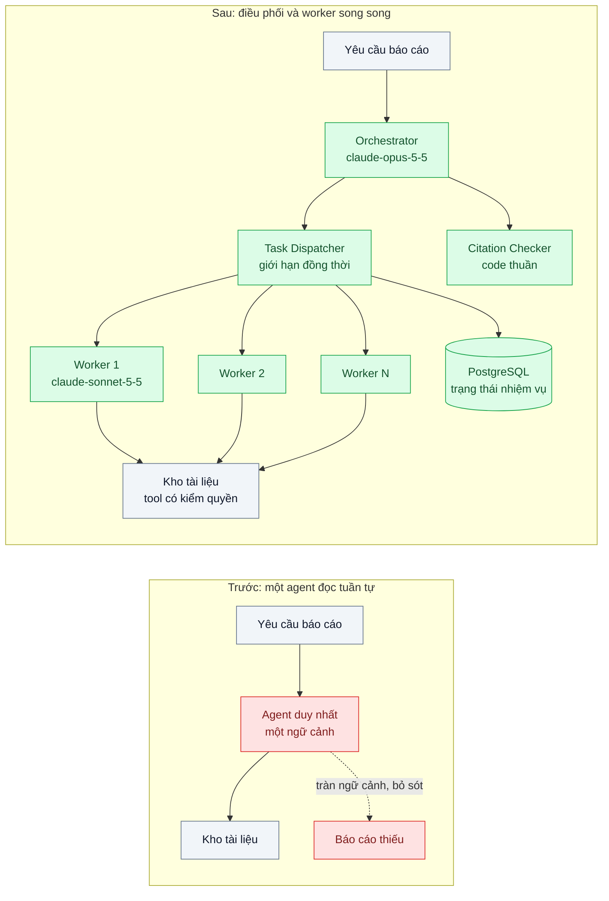
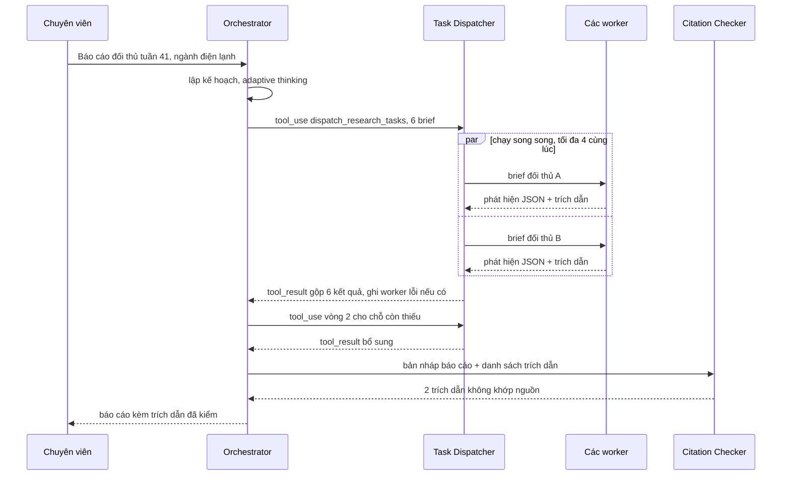

# Orchestrator-Workers (multi-agent) — Nghiên cứu thị trường cần tra 30 nguồn, một agent đọc hết thì tràn context

| Scope | Mức độ | Trạng thái | Pattern gốc | Cập nhật |
|---|---|---|---|---|
| 11 · backend / AI Agent | 🔴 Nâng cao | 📋 Kế hoạch | Orchestrator-Workers — Anthropic, "Building effective agents" (2024); Anthropic, "How we built our multi-agent research system" (2025) | 2026-10-06 |

> **Một câu tóm tắt:** Một agent điều phối lập kế hoạch và chia việc thành các nhiệm vụ con có mô tả rõ ràng, nhiều worker chạy song song mỗi worker một ngữ cảnh riêng và chỉ trả về phát hiện đã cô đọng kèm trích dẫn, rồi agent điều phối tổng hợp và kiểm trích dẫn.

## 1. Bài toán thực tế (What)

**Bối cảnh** *(doanh nghiệp giả định, số liệu minh họa)*
Phòng chiến lược của một chuỗi bán lẻ điện máy cần báo cáo "bức tranh đối thủ" mỗi tuần cho ban giám đốc: giá, khuyến mãi, mở cửa hàng mới, phản hồi khách của 6 đối thủ. Nguồn là khoảng 30 tài liệu mỗi tuần trong kho nội bộ: báo cáo ngành dạng PDF đã trích văn bản, bản tin do crawler nội bộ thu thập, ghi chú của đội khảo sát cửa hàng. Đội kỹ thuật dựng một agent duy nhất với tool `search_documents` và `read_document`, cho nó đọc lần lượt rồi viết báo cáo.

**Triệu chứng người kinh doanh nhìn thấy**
- Mỗi báo cáo mất khoảng 25 phút; khi tài liệu dài, agent dừng giữa chừng vì ngữ cảnh đầy hoặc hết lượt.
- Báo cáo bỏ sót đối thủ thứ 5 và 6: agent dành phần lớn ngữ cảnh đọc kỹ ba tài liệu đầu.
- Một số con số trong báo cáo không truy được về nguồn nào; chuyên viên mất nửa ngày kiểm lại tay.
- Đổi sang model có ngữ cảnh lớn hơn và nhồi hết 30 tài liệu: chi phí mỗi báo cáo tăng mạnh, chất lượng phần cuối vẫn kém.

**Nguyên nhân kỹ thuật**
Một agent làm tuần tự mọi việc: tìm, đọc, ghi nhớ chi tiết, rồi tổng hợp, tất cả trong một ngữ cảnh. Kết quả tool (toàn văn tài liệu) chiếm chỗ của suy luận; thông tin đọc sớm bị loãng khi ngữ cảnh dài. Công việc lại có tính *chia được*: sáu đối thủ, nhiều nhóm nguồn độc lập, nhưng không thể biết trước chính xác cần tra gì, nên một workflow cố định cũng không đủ.

**Ràng buộc**
- Báo cáo phải xong trong 10 phút sau khi chuyên viên yêu cầu.
- Mọi con số và nhận định phải có trích dẫn tới tài liệu và đoạn cụ thể.
- Chi phí mỗi báo cáo có trần (đặt sau khi đo); báo cáo này có giá trị cao nhưng chạy hàng tuần cho nhiều ngành hàng.

## 2. Vì sao dùng pattern này (Why)

**Nguyên nhân gốc mà pattern nhắm vào:** Một ngữ cảnh duy nhất phải gánh cả việc đọc khối lượng lớn lẫn việc suy luận tổng hợp. "Building effective agents" mô tả orchestrator-workers cho tác vụ phức tạp không đoán trước được các nhiệm vụ con; bài viết về hệ thống nghiên cứu đa agent của Anthropic cho thấy lợi ích đến từ việc mỗi worker có ngữ cảnh riêng để khám phá song song, và cũng nhấn mạnh chi phí token tăng đáng kể nên chỉ đáng với tác vụ giá trị cao.

**Pattern giải quyết thế nào:** *Orchestrator* (`claude-opus-5-5`, adaptive thinking) đọc yêu cầu, lập kế hoạch và gọi tool `dispatch_research_tasks` với danh sách nhiệm vụ con. Mỗi nhiệm vụ là một *brief* đầy đủ: mục tiêu, phạm vi nguồn, định dạng đầu ra (JSON phát hiện + trích dẫn), giới hạn số lượt. Harness chạy các *worker* (`claude-sonnet-5-5`, effort thấp hơn) song song, mỗi worker là một vòng lặp tool use riêng với tool đọc kho tài liệu, trả về phát hiện đã cô đọng thay vì toàn văn. Orchestrator nhận kết quả dưới dạng `tool_result`, có thể giao thêm vòng hai cho chỗ còn thiếu, rồi viết báo cáo. Bước cuối là *citation checker* bằng code: mỗi trích dẫn phải khớp với đoạn văn thật trong tài liệu.

**Lựa chọn khác đã cân nhắc**

| Lựa chọn | Giải quyết được gì | Vì sao không chọn (ở bài này) |
|---|---|---|
| Giữ nguyên + tối ưu nhỏ (một agent, ngữ cảnh lớn, xóa kết quả tool cũ) | Bớt lỗi tràn ngữ cảnh | Vẫn tuần tự nên chậm; thông tin đọc sớm vẫn loãng; không song song được |
| Workflow parallelization cố định (mỗi đối thủ một nhánh, cùng prompt) | Rẻ, dễ đoán, song song | Hợp khi nhiệm vụ con biết trước; ở đây cần tra theo phát hiện (khuyến mãi mới, cửa hàng mới) |
| Map-reduce tóm tắt từng tài liệu rồi gộp | Đơn giản, không cần agent | Tóm tắt không biết câu hỏi cụ thể nên dễ mất chi tiết cần cho báo cáo |
| **Orchestrator-workers, brief rõ ràng, kiểm trích dẫn (chọn)** | Song song, ngữ cảnh mỗi worker gọn, tra theo phát hiện | Tốn token nhiều hơn một agent; khó debug hơn; cần eval |

## 3. Thiết kế hệ thống (How)

### 3.1 Kiến trúc trước và sau



### 3.2 Luồng chính



### 3.3 Thành phần và trách nhiệm

| Thành phần | Trách nhiệm | Quyết định thiết kế đáng chú ý |
|---|---|---|
| Orchestrator | Lập kế hoạch, viết brief, quyết định có cần vòng hai, tổng hợp | System prompt dạy *cách giao việc*: mục tiêu, ranh giới, định dạng đầu ra, quy mô nỗ lực theo độ khó |
| Tool `dispatch_research_tasks` | Nhận danh sách brief theo schema `strict: true` | Giới hạn số nhiệm vụ mỗi lần; mỗi brief có `max_turns` |
| Task Dispatcher | Chạy worker song song, giới hạn đồng thời, timeout, ghi trạng thái | Worker lỗi trả kết quả `is_error` cho phần đó, không làm hỏng cả báo cáo |
| Worker | Vòng lặp tool use riêng trên kho tài liệu, trả phát hiện cô đọng | Structured outputs (`output_config.format`) cho JSON phát hiện; effort thấp hơn orchestrator |
| Citation Checker | Kiểm mỗi trích dẫn tồn tại trong tài liệu được nêu | So khớp đoạn trích sau chuẩn hóa khoảng trắng; nhận định không có nguồn bị gắn cờ |
| Lưu trạng thái | Kết quả từng worker trong PostgreSQL | Orchestrator crash vẫn tiếp tục được, không chạy lại worker đã xong |

### 3.4 Điểm dễ sai khi triển khai
- Brief quá ngắn ("tìm hiểu đối thủ A"): worker trùng việc nhau hoặc tra sai phạm vi. Brief phải nói rõ mục tiêu, nguồn, định dạng và điều *không* cần làm.
- Worker trả toàn văn tài liệu cho orchestrator: chuyển vấn đề tràn ngữ cảnh lên tầng trên. Worker chỉ trả phát hiện cô đọng.
- Không giới hạn số worker và số lượt: chi phí bùng nổ với câu hỏi đơn giản. Quy định quy mô nỗ lực theo độ khó trong prompt và trần cứng trong code.
- Dùng multi-agent cho việc mà workflow cố định làm được: tốn token gấp nhiều lần mà không thêm chất lượng.
- Tin trích dẫn do model viết: model có thể viết trích dẫn trông hợp lý nhưng không có trong tài liệu; luôn kiểm bằng code.

## 4. Tech stack và tác động (Impact techstack)

| Lớp | Công nghệ chọn | Vì sao chọn | Thay thế tương đương |
|---|---|---|---|
| Ngôn ngữ / runtime | TypeScript strict, Node 20+ | `Promise` + giới hạn đồng thời cho worker | Python asyncio |
| Model & SDK | `@anthropic-ai/sdk`; orchestrator `claude-opus-5-5` (adaptive thinking, effort cao); worker `claude-sonnet-5-5` hoặc `claude-haiku-4-5` cho trích xuất đơn giản | Model mạnh ở chỗ cần lập kế hoạch, model rẻ ở chỗ đọc khối lượng lớn | Cùng một model với effort khác nhau |
| Vòng lặp | Tool Runner của SDK cho cả orchestrator và worker | Giảm code vòng lặp; chèn log, giới hạn lượt | Vòng lặp tự viết |
| Kho tài liệu | PostgreSQL 16 + full-text search (hoặc kho RAG ở scope 10) | Tool `search_documents` / `read_document` có kiểm quyền | Elasticsearch |
| Trạng thái | PostgreSQL bảng `research_tasks` | Tiếp tục sau crash | Temporal (scope 20 bài 08) |

Giá tại thời điểm viết (kiểm tra lại trang Pricing): `claude-opus-5-5` $4/$20, `claude-sonnet-5-5` $2/$10, `claude-haiku-4-5` $1/$5 mỗi triệu token vào/ra.

**Thay đổi so với hệ thống hiện tại:** Thay agent đơn bằng orchestrator, dispatcher, worker và citation checker; thêm bảng trạng thái nhiệm vụ. Đội vận hành học đọc trace nhiều tầng (orchestrator → worker → tool) và dashboard chi phí theo vai trò.

## 5. Kết quả đầu ra và cách đo (Output impact)

| Chỉ số | Trước (minh họa) | Mục tiêu khi thực hành | Cách đo |
|---|---|---|---|
| Thời gian ra một báo cáo | 25 phút | < 10 phút | Timestamp đầu/cuối trong `research_tasks` |
| Độ phủ: số đối thủ có phát hiện / 6 | 4 | 6 | Checklist theo đề bài trong bộ 10 yêu cầu mẫu |
| Tỉ lệ trích dẫn không khớp nguồn trong báo cáo cuối | ~15% | 0% | Citation Checker + chuyên viên duyệt mẫu 3 báo cáo |
| Điểm chất lượng theo rubric (1–5) | 2,8 | ≥ 4 | Rubric chấm bằng `claude-opus-5-5` + đối chiếu chấm tay của chuyên viên |
| Token và chi phí mỗi báo cáo theo vai trò | ghi số thật | dưới trần đã đặt | Cộng `usage` theo orchestrator/worker nhân đơn giá từng model |
| Tỉ lệ worker lỗi hoặc timeout | không đo | < 5%, báo cáo vẫn hoàn thành | Đếm trạng thái trong `research_tasks` |

> Số "trước" là minh họa để hình dung bài toán. Số "mục tiêu" chỉ được coi là đạt khi có số đo thật
> ở mục 8 kèm môi trường đo.

**Tác động nghiệp vụ mong đợi:** Ban giám đốc nhận báo cáo đủ đối thủ, đúng hạn, mọi con số truy được nguồn; chuyên viên chuyển từ kiểm lại tay sang phân tích.

## 6. Đánh đổi và khi KHÔNG nên dùng

**Đánh đổi**
- Tổng token cao hơn nhiều so với một agent; chỉ hợp lý khi giá trị đầu ra cao.
- Khó debug: lỗi có thể nằm ở brief, ở worker hay ở bước tổng hợp; cần tracing theo tầng.

**Không nên dùng khi**
- Nhiệm vụ con biết trước và cố định: dùng workflow parallelization (bài 03 và scope 20 bài 04).
- Các nhiệm vụ con phụ thuộc chặt vào nhau, phải chia sẻ ngữ cảnh liên tục: một agent tuần tự làm tốt hơn.
- Câu hỏi đơn giản trả lời được từ vài tài liệu: một agent hoặc RAG là đủ.

**Liên quan**
- [03 — Prompt Chaining & Routing](../03-routing-prompt-chaining-mot-prompt-khong-lo-duoc-5-loai-yeu-cau/) — workflow cố định nên thử trước.
- [09 — Agent Evaluation](../09-agent-evaluation-tau-bench-agent-dung-80-lan-dau-chay-8-lan-khong/) — đo độ ổn định của hệ nhiều agent.
- [Durable Execution (scope 20)](../../20-backend-ai-framework-system-design/08-durable-execution-workflow-ai-chay-10-phut-crash-giua-chung/) — tiếp tục sau crash.
- [Model Routing / Cascade (scope 22)](../../22-backend-ai-optimizer/03-model-routing-cascade-80-phan-tram-cau-don-gian-vao-model-dat/) — chọn model theo vai trò.

## 7. Cơ sở tham khảo

- Anthropic, "Building effective agents", 2024-12 — https://www.anthropic.com/engineering/building-effective-agents — định nghĩa orchestrator-workers và phân biệt với parallelization khi nhiệm vụ con biết trước.
- Anthropic, "How we built our multi-agent research system", 2025-06 — https://www.anthropic.com/engineering/built-multi-agent-research-system — bài học về viết brief cho worker, quy mô nỗ lực theo độ khó, chạy song song, chi phí token và cách đánh giá.
- Anthropic docs, "Tool use overview" — https://platform.claude.com/docs/en/agents-and-tools/tool-use/overview — `strict`, parallel tool use, `is_error` cho worker lỗi.

## 8. Kế hoạch thực hành

- [ ] Bước 1: Nạp kho 30 tài liệu mẫu cho 6 đối thủ (có đoạn số liệu cài sẵn để kiểm trích dẫn); dựng agent đơn "cũ"; soạn 10 yêu cầu báo cáo mẫu và rubric.
- [ ] Bước 2: Đo "trước": thời gian, độ phủ, tỉ lệ trích dẫn sai, điểm rubric, chi phí.
- [ ] Bước 3: Áp dụng pattern: orchestrator + tool `dispatch_research_tasks`, dispatcher có giới hạn đồng thời và trạng thái trong PostgreSQL, worker trả JSON, citation checker.
- [ ] Bước 4: Đo "sau" cùng 10 yêu cầu; so thêm biến thể worker `claude-haiku-4-5`; ghi vào mục 5 kèm model và ngày.
- [ ] Bước 5: Test Vitest chứng minh: worker lỗi không làm hỏng báo cáo; trích dẫn bịa bị Citation Checker bắt; số worker không vượt trần cấu hình.

**Cấu trúc code dự kiến**
```text
src/
  research/orchestrator.ts       # lập kế hoạch, tổng hợp
  research/task-dispatcher.ts    # song song, giới hạn đồng thời, trạng thái
  research/worker.ts             # vòng lặp tool use, JSON phát hiện
  research/citation-checker.ts
  tools/search-documents.tool.ts
  tools/read-document.tool.ts
  eval/report-rubric.ts
test/
  task-dispatcher.test.ts
  citation-checker.test.ts
docker-compose.yml
```

**Cách chạy** *(điền khi bắt đầu code)*
```bash
docker compose up -d
pnpm install && pnpm test
```
