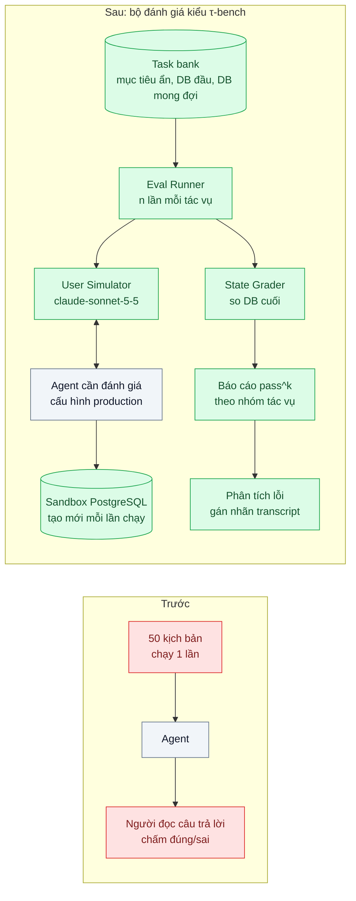
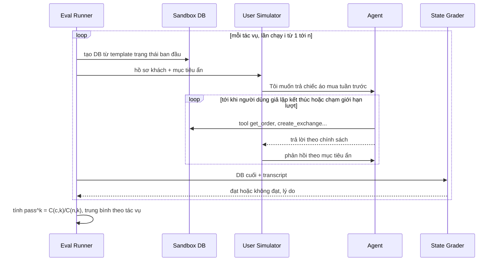

# Agent Evaluation (pass^k) — Agent đúng 80% lần đầu nhưng chạy 8 lần liên tiếp đều đúng chỉ 30%

| Scope | Mức độ | Trạng thái | Pattern gốc | Cập nhật |
|---|---|---|---|---|
| 11 · backend / AI Agent | 🔴 Nâng cao | 📋 Kế hoạch | Agent Evaluation (pass^k) — Yao et al. (Sierra), "τ-bench" (2024); Hamel Husain, "Your AI Product Needs Evals" (2024) | 2026-10-06 |

> **Một câu tóm tắt:** Đánh giá agent như τ-bench: người dùng giả lập có mục tiêu ẩn trò chuyện với agent trên môi trường sandbox, chấm bằng trạng thái DB cuối cùng thay vì bằng câu chữ, chạy mỗi tác vụ k lần và báo pass^k — xác suất cả k lần đều đúng.

## 1. Bài toán thực tế (What)

**Bối cảnh** *(doanh nghiệp giả định, số liệu minh họa)*
Chuỗi thời trang bán online có agent xử lý đổi size, đổi trả và hủy đơn, khoảng 6.000 hội thoại/ngày. Agent có tool `get_order`, `create_exchange`, `cancel_order`, `issue_store_credit` và một chính sách đổi trả 2 trang trong system prompt (đổi trong 30 ngày, mỗi đơn đổi một lần, hàng giảm giá chỉ đổi không trả). Trước khi ra mắt, đội sản phẩm chạy 50 kịch bản mỗi kịch bản một lần: đúng 40/50, coi là đạt.

**Triệu chứng người kinh doanh nhìn thấy**
- Sau ra mắt, cùng một kiểu yêu cầu lúc đúng lúc sai: hôm nay agent từ chối trả hàng giảm giá đúng chính sách, hôm sau lại hoàn tiền cho ca y hệt.
- Khiếu nại "nhân viên ảo nói một đằng làm một nẻo" tăng; đội CS phải rà lại 10% hội thoại có hành động ghi.
- Mỗi lần sửa prompt, đội chạy lại 50 kịch bản, con số dao động 76–84% và không ai biết thay đổi tốt lên hay chỉ là may.

**Nguyên nhân kỹ thuật**
Chỉ số "đúng ở lần chạy đầu" (pass^1) đo *khả năng* chứ không đo *độ tin cậy*. Agent nhiều lượt có nhiều điểm rẽ nhánh ngẫu nhiên; một tác vụ đúng 80% mỗi lần thì xác suất 8 lần liên tiếp đều đúng thấp hơn nhiều. τ-bench gọi chỉ số này là pass^k và cho thấy nó giảm nhanh khi k tăng. Ngoài ra, đội chấm bằng cách đọc câu trả lời; agent có thể *nói* đúng nhưng *làm* sai (gọi `issue_store_credit` khi chính sách không cho).

**Ràng buộc**
- Không chạy eval trên dữ liệu và hệ thống thật; mọi tool chạy trên sandbox.
- Một lượt eval đầy đủ phải chạy được qua đêm và có trần chi phí.
- Kết quả phải giải thích được: biết tác vụ nào hỏng, hỏng kiểu gì.

## 2. Vì sao dùng pattern này (Why)

**Nguyên nhân gốc mà pattern nhắm vào:** Đo sai đại lượng (một lần chạy, chấm bằng chữ) cho một hệ thống ngẫu nhiên, nhiều bước, có side effect. Không đo độ ổn định thì không cải thiện được độ ổn định.

**Pattern giải quyết thế nào:** Theo thiết kế của τ-bench:
1. **Tác vụ** gồm: hồ sơ người dùng và mục tiêu ẩn (ví dụ "muốn trả áo giảm giá, nếu bị từ chối thì chấp nhận đổi size"), trạng thái DB ban đầu, trạng thái DB mong đợi khi kết thúc, và các thông tin bắt buộc agent phải nói.
2. **Người dùng giả lập** là một model (`claude-sonnet-5-5`) đóng vai khách, chỉ biết mục tiêu của mình, trò chuyện nhiều lượt với agent cho tới khi xong.
3. **Agent cần đánh giá** chạy đúng cấu hình production (prompt, tool, model) nhưng tool trỏ vào sandbox.
4. **Chấm bằng trạng thái:** so DB cuối với DB mong đợi bằng code; thêm kiểm tra thông tin bắt buộc trong câu trả lời.
5. **Lặp k lần, tính pass^k:** với mỗi tác vụ chạy n lần, có c lần đúng, ước lượng pass^k = C(c, k) / C(n, k), rồi lấy trung bình trên các tác vụ.
6. **Phân tích lỗi** theo Hamel Husain: đọc transcript hỏng, gán nhãn kiểu lỗi (sai chính sách, sai tham số tool, hỏi thiếu thông tin, người dùng giả lập lệch vai), sửa theo nhóm lỗi lớn nhất và biến lỗi production thành tác vụ mới.

**Lựa chọn khác đã cân nhắc**

| Lựa chọn | Giải quyết được gì | Vì sao không chọn (ở bài này) |
|---|---|---|
| Giữ nguyên + tối ưu nhỏ (thêm kịch bản, vẫn chạy một lần) | Phủ rộng hơn | Vẫn không thấy độ dao động; không phân biệt được cải thiện thật và may mắn |
| LLM-as-judge chấm transcript | Chấm được chất lượng giao tiếp | Chấm theo chữ, bỏ lọt "nói đúng làm sai"; judge cũng dao động. Dùng bổ sung, không thay chấm trạng thái |
| Chỉ dựa vào A/B và phản hồi production | Dữ liệu thật | Phát hiện lỗi sau khi khách đã chịu; không dùng được để chặn trước khi deploy |
| **Mô phỏng người dùng + chấm trạng thái + pass^k + phân tích lỗi (chọn)** | Đo được độ tin cậy, chấm theo hành động, chạy trước deploy | Tốn chi phí chạy nhiều lần; người dùng giả lập có thể sai vai |

## 3. Thiết kế hệ thống (How)

### 3.1 Kiến trúc trước và sau



### 3.2 Luồng chính



### 3.3 Thành phần và trách nhiệm

| Thành phần | Trách nhiệm | Quyết định thiết kế đáng chú ý |
|---|---|---|
| Task bank | Tác vụ dạng tệp YAML: hồ sơ, mục tiêu ẩn, DB đầu, DB mong đợi, thông tin bắt buộc | Có cả tác vụ "phải từ chối" (vi phạm chính sách); nguồn tác vụ mới là lỗi production |
| User Simulator | Đóng vai khách, nói tự nhiên, không lộ mục tiêu một lần | Model khác agent để giảm "đồng điệu"; có lệnh kết thúc rõ ràng; giới hạn số lượt |
| Sandbox DB | Mỗi lần chạy một DB sạch tạo từ template | `CREATE DATABASE ... TEMPLATE` của PostgreSQL nhanh hơn chạy seed |
| State Grader | So sánh DB cuối với mong đợi theo các bảng liên quan | Code thuần, xác định; LLM judge chỉ dùng cho tiêu chí giao tiếp |
| Bộ tính pass^k | Ước lượng pass^k từ n lần chạy, báo theo nhóm tác vụ | n ≥ k; báo cả pass^1, pass^4, pass^8 để thấy đường dốc |
| Phân tích lỗi | Giao diện xem transcript hỏng, gán nhãn kiểu lỗi | Bảng đếm theo kiểu lỗi quyết định sửa gì trước |

### 3.4 Điểm dễ sai khi triển khai
- Chấm bằng chữ: agent nói "đã hoàn tiền" nhưng không gọi tool (hoặc ngược lại). Luôn chấm hành động bằng trạng thái DB.
- Người dùng giả lập lệch vai (tự đề xuất giải pháp, quên mục tiêu): làm agent trông tệ oan. Duyệt tay mẫu transcript và đo tỉ lệ lỗi của simulator riêng.
- Dùng chung DB giữa các lần chạy: lần sau thấy đơn đã đổi ở lần trước. Mỗi lần một DB mới.
- So sánh hai phiên bản prompt bằng một lần chạy: chênh lệch nằm trong nhiễu. Chạy đủ n lần và so cả khoảng dao động.
- Chỉ có tác vụ "đường vui": thiếu tác vụ phải từ chối, agent hào phóng vẫn đạt điểm cao.
- Bỏ qua chi phí: n × số tác vụ × số lượt có thể lớn; đo `usage` của một lượt chạy trước khi bật hằng đêm. Hội thoại nhiều lượt không gửi qua Message Batches được vì mỗi lượt phụ thuộc lượt trước.

## 4. Tech stack và tác động (Impact techstack)

| Lớp | Công nghệ chọn | Vì sao chọn | Thay thế tương đương |
|---|---|---|---|
| Ngôn ngữ / runtime | TypeScript strict, Node 20+ | Dùng lại code agent production trực tiếp | Python (τ-bench gốc viết bằng Python) |
| Agent cần đánh giá | `@anthropic-ai/sdk`, `claude-opus-5-5`, cấu hình production | Đánh giá đúng thứ chạy thật | — |
| User Simulator | `claude-sonnet-5-5` | Đủ tự nhiên, rẻ hơn agent, khác model với agent | `claude-haiku-4-5` cho tác vụ đơn giản |
| Sandbox | PostgreSQL 16 với database template | Tạo DB sạch nhanh cho mỗi lần chạy | Testcontainers |
| Runner & test | Vitest cho grader; script runner chạy song song có giới hạn | Grader có test riêng như code thường | promptfoo |
| CI | GitHub Actions chạy tập con mỗi PR, đủ bộ hằng đêm, có trần chi phí | Chặn merge khi pass^k giảm vượt ngưỡng nhiễu | — |

Giá tại thời điểm viết (kiểm tra lại trang Pricing): `claude-opus-5-5` $4/$20, `claude-sonnet-5-5` $2/$10 mỗi triệu token vào/ra.

**Thay đổi so với hệ thống hiện tại:** Thêm repo con `eval/` với task bank, simulator, grader, runner; tách cấu hình tool để trỏ được vào sandbox. Đội sản phẩm học đọc báo cáo pass^k và quy trình phân tích lỗi hằng tuần.

## 5. Kết quả đầu ra và cách đo (Output impact)

| Chỉ số | Trước (minh họa) | Mục tiêu khi thực hành | Cách đo |
|---|---|---|---|
| pass^1 trên 50 tác vụ | 80% | ghi số thật, không giảm | Runner, n = 10 lần mỗi tác vụ, chấm trạng thái DB |
| pass^8 trên 50 tác vụ | 30% | ≥ 60% sau các vòng sửa | Cùng runner, ước lượng C(c,8)/C(10,8) theo tác vụ |
| Tỉ lệ hành động vi phạm chính sách trong tác vụ "phải từ chối" | không đo | 0 ở mọi lần chạy | State Grader đếm tool ghi bị cấm được gọi |
| Tỉ lệ lỗi của User Simulator | không đo | < 5% transcript mẫu | Duyệt tay 40 transcript ngẫu nhiên mỗi đợt |
| Chi phí một lượt eval đầy đủ | không có | dưới trần đặt trước | Cộng `usage` agent + simulator nhân đơn giá |
| Thời gian một lượt eval đầy đủ | không có | < 2 giờ | Timestamp đầu/cuối do runner ghi vào báo cáo |

> Số "trước" là minh họa để hình dung bài toán. Số "mục tiêu" chỉ được coi là đạt khi có số đo thật
> ở mục 8 kèm môi trường đo.

**Tác động nghiệp vụ mong đợi:** Biết trước khi deploy agent có ổn định không; mỗi thay đổi prompt có bằng chứng tốt lên hay xấu đi; khách nhận cùng một cách xử lý cho cùng một yêu cầu.

## 6. Đánh đổi và khi KHÔNG nên dùng

**Đánh đổi**
- Chi phí và thời gian chạy tăng theo n; phải chọn n, tập con cho PR và lịch chạy hợp lý.
- Xây task bank và DB mong đợi tốn công chuyên gia nghiệp vụ.
- Người dùng giả lập không phải khách thật; eval không thay được giám sát production.

**Không nên dùng khi**
- Hệ thống là một lượt gọi model không có tool ghi (phân loại, tóm tắt): eval một lượt với bộ dữ liệu có nhãn (scope 20 bài 06) là đủ.
- Chưa có định nghĩa "đúng" bằng trạng thái (chính sách mơ hồ): làm rõ chính sách trước, nếu không grader không có gì để so.

**Liên quan**
- [05 — Prompt Injection Defense](../05-prompt-injection-khach-nhap-bo-qua-huong-dan-giam-gia-100/) — dùng cùng runner để đo tỉ lệ bị lừa.
- [Eval Pipeline & LLM-as-Judge in CI (scope 20)](../../20-backend-ai-framework-system-design/06-llm-as-judge-eval-pipeline-trong-ci-sua-prompt-khong-biet-tot-hon-hay-te-hon/) — hạ tầng eval chung.
- [Golden Dataset from Production Traces (scope 24)](../../24-backend-ai-monitoring/04-golden-dataset-tu-production-regression-test-prompt/) — nguồn tác vụ mới từ lỗi thật.

## 7. Cơ sở tham khảo

- Yao et al. (Sierra), "τ-bench: A Benchmark for Tool-Agent-User Interaction in Real-World Domains", 2024 — người dùng giả lập, chấm bằng trạng thái DB, định nghĩa và cách ước lượng pass^k.
- Hamel Husain, "Your AI Product Needs Evals", 2024 — https://hamel.dev/blog/posts/evals/ — phân tích lỗi từ transcript, kiểm tra theo tầng, đưa eval vào vòng lặp phát triển.
- Zheng et al., "Judging LLM-as-a-Judge with MT-Bench and Chatbot Arena", NeurIPS 2023 — giới hạn và thiên lệch của judge; lý do judge chỉ là lớp bổ sung.
- PostgreSQL docs, "Template Databases" — https://www.postgresql.org/docs/ — tạo DB sạch nhanh cho mỗi lần chạy.

## 8. Kế hoạch thực hành

- [ ] Bước 1: Viết 50 tác vụ YAML (trong đó 15 tác vụ phải từ chối), database template, agent đổi trả hiện có trỏ vào sandbox.
- [ ] Bước 2: Đo "trước": chạy n = 10 lần mỗi tác vụ với cấu hình hiện tại, báo pass^1, pass^4, pass^8, chi phí, thời gian.
- [ ] Bước 3: Phân tích lỗi trên transcript hỏng, gán nhãn, sửa theo nhóm lỗi lớn nhất (prompt, mô tả tool, Policy Engine).
- [ ] Bước 4: Đo "sau" cùng bộ tác vụ, cùng n; ghi vào mục 5 kèm model, ngày, phiên bản prompt.
- [ ] Bước 5: Test Vitest chứng minh: grader bắt được "nói đúng làm sai"; ước lượng pass^k khớp công thức trên dữ liệu giả; mỗi lần chạy có DB riêng.

**Cấu trúc code dự kiến**
```text
eval/
  tasks/*.yaml                 # mục tiêu ẩn, DB đầu, DB mong đợi
  src/user-simulator.ts
  src/sandbox-db.ts            # tạo DB từ template
  src/state-grader.ts
  src/pass-k.ts                # C(c,k)/C(n,k)
  src/eval-runner.ts
  src/failure-labels.ts
test/
  state-grader.test.ts
  pass-k.test.ts
docker-compose.yml
```

**Cách chạy** *(điền khi bắt đầu code)*
```bash
docker compose up -d
pnpm install && pnpm test
pnpm eval --tasks all --trials 10
```
