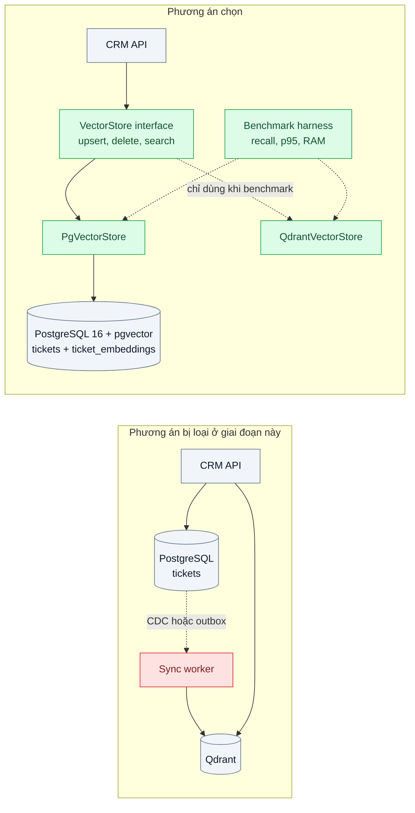
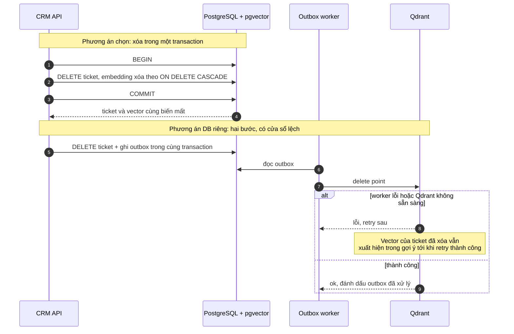

# pgvector vs Dedicated Vector DB — Đã có PostgreSQL, có cần thêm một DB vector riêng?

| Scope | Mức độ | Trạng thái | Pattern gốc | Cập nhật |
|---|---|---|---|---|
| 12 · backend / database / vector | 🟢 Cơ bản | 📋 Kế hoạch | Chọn hệ lưu trữ theo yêu cầu — Kleppmann, *DDIA* (2017); pgvector docs; Qdrant docs | 2026-10-06 |

> **Một câu tóm tắt:** Quyết định đặt vector ở đâu bằng tiêu chí đo được (quy mô, lọc, nhất quán, vận hành) và một benchmark trên chính dữ liệu của mình, bắt đầu bằng pgvector trong PostgreSQL hiện có sau một interface nhỏ, kèm điều kiện chuyển sang vector DB riêng được viết ra từ trước.

## 1. Bài toán thực tế (What)

**Bối cảnh** *(doanh nghiệp giả định, số liệu minh họa)*
SaaS CRM B2B có 400 khách doanh nghiệp, PostgreSQL 16 là DB chính (khoảng 80 GB). Sản phẩm muốn thêm "tìm ticket tương tự" và trợ lý RAG trên ghi chú khách hàng: khoảng 3 triệu vector 1024 chiều, tăng 100.000 mỗi tháng. Đội có 5 kỹ sư, một người kiêm hạ tầng.

**Triệu chứng người kinh doanh nhìn thấy**
- Tranh luận "thêm Qdrant hay dùng pgvector" kéo dài ba tuần, tính năng trễ khỏi roadmap quý.
- Một bên lo thêm DB là thêm chi phí trực đêm và dữ liệu lệch (ticket đã xóa vẫn hiện trong gợi ý — rủi ro với khách yêu cầu xóa dữ liệu).
- Bên kia lo "PostgreSQL sẽ chậm khi lớn" và phải làm lại sau sáu tháng.

**Nguyên nhân kỹ thuật**
Không có tiêu chí định lượng và không có số đo trên dữ liệu thật; quyết định dựa vào bài blog và cảm giác. Hai lựa chọn có đánh đổi khác nhau thật sự: cùng DB thì nhất quán giao dịch nhưng chia tài nguyên với OLTP; DB riêng thì tối ưu cho vector nhưng phải đồng bộ hai nơi.

**Ràng buộc**
- Xóa ticket hoặc xóa khách hàng phải xóa luôn vector tương ứng (yêu cầu hợp đồng về xóa dữ liệu).
- Truy vấn tương tự luôn có lọc theo tenant và trạng thái ticket.
- Không tăng đáng kể gánh vận hành cho đội 5 người.

## 2. Vì sao dùng pattern này (Why)

**Nguyên nhân gốc mà pattern nhắm vào:** chọn hệ lưu trữ mà không gắn với yêu cầu cụ thể (tải, nhất quán, vận hành) — đúng điều DDIA cảnh báo khi chọn công cụ dữ liệu.

**Pattern giải quyết thế nào:**
1. **Bảng tiêu chí** chấm cả hai phương án: số vector × số chiều (RAM cho index), QPS và p95 mục tiêu, kiểu lọc (tenant, trạng thái, join với bảng khác), yêu cầu nhất quán khi xóa, backup/PITR và HA sẵn có, tính năng cần (quantization, hybrid, multi-tenancy), năng lực vận hành của đội.
2. **Ước lượng thô trước khi benchmark**: 3 triệu × 1024 chiều × 4 byte ≈ 12 GB chỉ riêng vector float32, chưa kể đồ thị index — biết ngay máy hiện tại có chứa nổi không.
3. **Benchmark trên dữ liệu thật** (mẫu đã ẩn danh) cho cả pgvector và Qdrant: recall@10 so với brute force, p95 ở QPS mục tiêu, thời gian build index, RAM, và ảnh hưởng lên truy vấn OLTP hiện có.
4. **Interface `VectorStore` tối thiểu** (`upsert`, `delete`, `search` có filter) để code nghiệp vụ không phụ thuộc trực tiếp vào SQL vector; không xây abstraction cho mọi tính năng.
5. **Điều kiện chuyển được viết ra**: ví dụ "p95 vượt SLO khi đã tối ưu index" hoặc "index không còn vừa RAM của máy DB" — số ngưỡng lấy từ benchmark, không lấy từ internet.

**Lựa chọn khác đã cân nhắc**

| Lựa chọn | Giải quyết được gì | Vì sao không chọn (ở bài này) |
|---|---|---|
| Giữ nguyên + tối ưu nhỏ: tính cosine trong ứng dụng hoặc quét tuần tự trong PostgreSQL | Không thêm gì | Ổn với vài chục nghìn vector; 3 triệu vector thì mỗi truy vấn quét toàn bộ |
| pgvector trên một instance PostgreSQL riêng | Cô lập tải khỏi OLTP | Mất transaction chung với bảng ticket; vẫn phải đồng bộ như DB riêng |
| Qdrant tự host | Tính năng vector phong phú (filterable HNSW, quantization, multitenancy) | Thêm hệ phải vận hành và đồng bộ; với 3 triệu vector chưa chắc cần |
| Vector DB được quản lý (ví dụ Pinecone) | Không tự vận hành | Dữ liệu khách ra ngoài hạ tầng; chi phí theo mức dùng; vẫn phải đồng bộ |
| pgvector trong DB hiện có, sau interface, có điều kiện chuyển *(chọn)* | Nhất quán khi xóa, không thêm hệ mới | Chia CPU, RAM với OLTP; phải theo dõi để biết khi nào chạm ngưỡng |

## 3. Thiết kế hệ thống (How)

### 3.1 Kiến trúc trước và sau



### 3.2 Luồng chính



### 3.3 Thành phần và trách nhiệm

| Thành phần | Trách nhiệm | Quyết định thiết kế đáng chú ý |
|---|---|---|
| Bảng `ticket_embeddings` | `ticket_id` (khóa ngoại, `ON DELETE CASCADE`), `tenant_id`, `embedding vector(1024)`, `model_version` | Bảng riêng thay vì thêm cột vào `tickets` để không làm phình bảng nóng |
| Index | HNSW với `vector_cosine_ops`; B-tree trên `tenant_id` | Chi tiết chọn tham số ở bài 02 và bài 07 |
| `VectorStore` interface | Ba thao tác, kiểu dữ liệu filter đơn giản | Không bọc tính năng đặc thù (quantization) cho tới khi cần |
| Benchmark harness | Nạp cùng tập dữ liệu vào hai backend, chạy cùng bộ truy vấn | Ground truth bằng truy vấn brute force trên mẫu |
| Giám sát | Kích thước index, p95 truy vấn vector, CPU và cache hit của DB | Báo động khi tiến gần điều kiện chuyển |

### 3.4 Điểm dễ sai khi triển khai
- **So sánh không công bằng**: Qdrant có quantization bật sẵn còn pgvector chạy mặc định, hoặc ngược lại. Ghi đầy đủ cấu hình hai bên và chạy trên cùng phần cứng.
- **Chỉ đo truy vấn vector**: bỏ qua việc build index hoặc truy vấn tương tự làm chậm OLTP. Chạy tải hỗn hợp, theo dõi p95 các truy vấn cũ bằng `pg_stat_statements`.
- **Interface quá tham vọng**: cố trừu tượng hóa mọi tính năng của mọi vector DB làm code khó đọc. Ba thao tác là đủ.
- **Quên `maintenance_work_mem`** khi build HNSW: build chậm hoặc tràn ra disk. Đặt riêng cho phiên build.
- **Không ghi điều kiện chuyển**: sáu tháng sau tranh luận lại từ đầu. Ghi vào nhật ký quyết định kèm số đo.

## 4. Tech stack và tác động (Impact techstack)

| Lớp | Công nghệ chọn | Vì sao chọn | Thay thế tương đương |
|---|---|---|---|
| Ngôn ngữ / runtime | TypeScript strict, Node 20+, NestJS | Trùng stack | Fastify |
| Lưu vector | PostgreSQL 16 + pgvector (HNSW, cosine) | Cùng transaction với dữ liệu nghiệp vụ; tận dụng backup/PITR, HA, RLS sẵn có | Qdrant (phương án so sánh) |
| Phương án so sánh | Qdrant chạy trong Docker Compose | Đại diện cho vector DB tự host | Weaviate, Milvus |
| Embedding | Model embedding (ví dụ Voyage AI, hoặc mô hình mở qua Text Embeddings Inference) | Chỉ cần sinh tập vector để benchmark; chọn cụ thể khi thực hành | Vector ngẫu nhiên chuẩn hóa cho thử tải sơ bộ |
| Đo tải | k6 hoặc script Node đo p95; `EXPLAIN (ANALYZE, BUFFERS)`; `pg_stat_statements` | Lặp lại được, thấy plan | — |
| Hạ tầng / test | Docker Compose (Postgres + pgvector, Qdrant), Vitest | Một lệnh dựng cả hai | — |

**Thay đổi so với hệ thống hiện tại:** bật extension pgvector, thêm bảng `ticket_embeddings` và index, thêm interface `VectorStore`. Không thêm hệ lưu trữ mới; đội vận hành thêm dashboard kích thước index và p95 truy vấn vector.

## 5. Kết quả đầu ra và cách đo (Output impact)

| Chỉ số | Trước (minh họa) | Mục tiêu khi thực hành | Cách đo |
|---|---|---|---|
| recall@10 so với brute force | — | ≥ 0,95 ở cả hai backend | 1.000 truy vấn mẫu, ground truth bằng quét tuần tự |
| p95 truy vấn có lọc tenant ở 50 QPS | quét tuần tự khoảng 2 giây | dưới 50 ms | k6 hoặc script Node, ghi cấu hình máy |
| Ảnh hưởng lên p95 truy vấn OLTP hiện có | — | tăng không quá 10% | `pg_stat_statements` trước và trong khi chạy tải hỗn hợp |
| RAM và dung lượng index | — | ghi lại, so với RAM máy DB | `pg_relation_size`, telemetry của Qdrant |
| Vector mồ côi sau 1.000 thao tác xóa có tiêm lỗi | — | 0 với pgvector; đo cửa sổ lệch với Qdrant | Script xóa ngẫu nhiên, giết worker giữa chừng, đếm vector không còn ticket |
| Thời gian ra quyết định | 3 tuần tranh luận | quyết định ghi kèm số đo trong 1 tuần | Ngày ghi vào `docs/nhat-ky-quyet-dinh.md` |

> Số "trước" là minh họa để hình dung bài toán. Số "mục tiêu" chỉ được coi là đạt khi có số đo thật
> ở mục 8 kèm môi trường đo.

**Tác động nghiệp vụ mong đợi:** tính năng tìm tương tự ra mắt sớm mà không thêm hệ phải vận hành, xóa dữ liệu khách đúng cam kết, và đội có điều kiện rõ ràng để biết khi nào cần đầu tư vector DB riêng.

## 6. Đánh đổi và khi KHÔNG nên dùng

**Đánh đổi**
- Truy vấn vector và build index chia tài nguyên với OLTP; cần theo dõi và có thể phải tách replica cho đọc vector.
- pgvector có ít tính năng chuyên biệt hơn một số vector DB (ví dụ lọc tích hợp trong đồ thị, multitenancy có sẵn).
- Interface thêm một lớp nhỏ; vẫn phải viết lại phần đặc thù nếu chuyển.

**Không nên dùng khi**
- Quy mô hàng trăm triệu vector hoặc QPS rất cao vượt khả năng một máy PostgreSQL, đã kiểm chứng bằng benchmark (xem bài 04, 07).
- Hệ thống không dùng PostgreSQL làm nguồn sự thật: lợi thế "cùng transaction" không còn.

**Liên quan**
- [ANN Index: HNSW vs IVFFlat](../02-hnsw-vs-ivfflat-tim-san-pham-tuong-tu-5-trieu-anh-brute-force-3-giay/) — chọn index sau khi chọn nơi lưu.
- [Filtered Vector Search](../03-metadata-filtering-tim-tuong-tu-nhung-chi-trong-tenant-x/) và [Multi-tenancy in Vector DB](../06-multi-tenancy-vector-10k-tenant-moi-tenant-mot-collection/) — lọc theo tenant.
- [Naive RAG (scope 10)](../../10-backend-ai-rag/01-naive-rag-chatbot-noi-quy-cong-ty-tra-loi-bua/) — nơi dùng kho vector.
- [Transactional Outbox (scope 14)](../../14-backend-queueing/03-transactional-outbox-ghi-don-xong-crash-mat-event/) — cách đồng bộ nếu chọn DB riêng.
- [CDC-based Index Sync (scope 05)](../../05-backend-search/05-cdc-dong-bo-index-du-lieu-search-lech-db/) — bài toán đồng bộ tương tự với search index.

## 7. Cơ sở tham khảo

- pgvector — https://github.com/pgvector/pgvector — kiểu `vector`, index HNSW / IVFFlat, toán tử khoảng cách, lọc, hướng dẫn hiệu năng.
- Qdrant documentation — https://qdrant.tech/documentation/ — tính năng của một vector DB chuyên biệt dùng làm phương án so sánh (filtering, quantization, multitenancy).
- Kleppmann, *Designing Data-Intensive Applications* (2017), chương 1 và chương 11 — tiêu chí reliability, scalability, maintainability khi chọn hệ lưu trữ; rủi ro ghi kép và giữ các hệ dữ liệu đồng bộ.
- Richardson, *Microservices Patterns* (2018), "Transactional Outbox" — https://microservices.io/patterns/ — cơ chế đồng bộ cần có nếu vector nằm ở DB riêng.
- PostgreSQL docs — https://www.postgresql.org/docs/ — `EXPLAIN`, `pg_stat_statements`, khóa ngoại `ON DELETE CASCADE`.

## 8. Kế hoạch thực hành

- [ ] Bước 1: Docker Compose với Postgres 16 + pgvector và Qdrant; sinh 3 triệu vector 1024 chiều (từ văn bản mẫu hoặc vector chuẩn hóa ngẫu nhiên cho thử tải), kèm `tenant_id` và trạng thái.
- [ ] Bước 2: đo "trước": truy vấn quét tuần tự, p95, ảnh hưởng lên truy vấn OLTP mẫu.
- [ ] Bước 3: áp dụng: bảng + index HNSW ở pgvector, collection tương đương ở Qdrant, interface `VectorStore` với hai adapter, benchmark harness.
- [ ] Bước 4: đo "sau" cả hai backend trên cùng máy: recall@10, p95 ở 50 QPS, RAM, thời gian build, vector mồ côi khi tiêm lỗi; ghi quyết định và điều kiện chuyển vào mục 5 và nhật ký.
- [ ] Bước 5: test Vitest: (a) xóa ticket thì `search` không còn trả vector đó, (b) hai adapter trả cùng top-10 trên dữ liệu nhỏ có đáp án, (c) `search` luôn áp filter tenant, (d) truy vấn dùng index (kiểm tra plan).

**Cấu trúc code dự kiến**
```text
src/
  vector-store/
    vector-store.ts           # interface: upsert, delete, search
    pgvector-store.ts
    qdrant-store.ts           # chỉ dùng cho benchmark
  db/migrations/001-ticket-embeddings.sql
bench/
  seed-vectors.ts
  run-benchmark.ts            # recall@10, p95, RAM
test/
  vector-store.test.ts
docker-compose.yml            # postgres 16 + pgvector, qdrant
```

**Cách chạy** *(điền khi bắt đầu code)*
```bash
docker compose up -d
pnpm install && pnpm test
```
