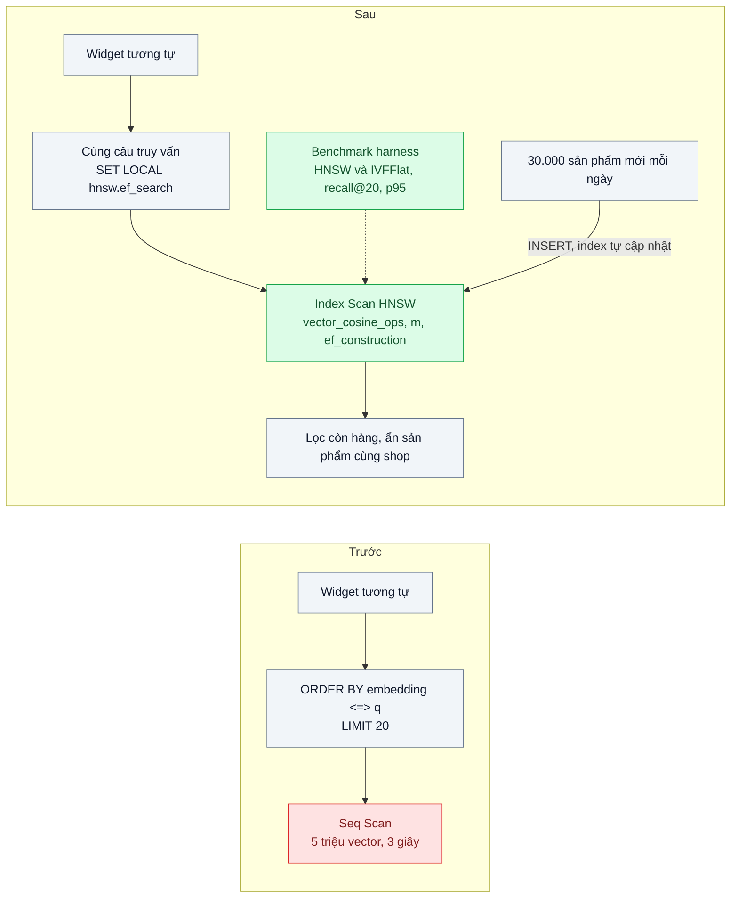

# ANN Index: HNSW vs IVFFlat — Tìm sản phẩm tương tự trong 5 triệu ảnh bằng brute force mất 3 giây

| Scope | Mức độ | Trạng thái | Pattern gốc | Cập nhật |
|---|---|---|---|---|
| 12 · backend / database / vector | 🟡 Trung bình | 📋 Kế hoạch | HNSW — Malkov & Yashunin (2016/2018); IVF — Johnson, Douze, Jégou, Faiss (2017); pgvector docs | 2026-10-06 |

> **Một câu tóm tắt:** Thay quét tuần tự 5 triệu vector bằng chỉ số tìm láng giềng gần đúng (ANN) — HNSW (đồ thị nhiều tầng) hoặc IVFFlat (phân cụm rồi chỉ quét vài cụm) — chấp nhận bỏ sót một phần rất nhỏ kết quả để truy vấn chạy trong vài chục ms, và chọn giữa hai loại bằng benchmark trên chính dữ liệu ảnh sản phẩm.

## 1. Bài toán thực tế (What)

**Bối cảnh** *(doanh nghiệp giả định, số liệu minh họa)*
Sàn TMĐT thời trang có 5 triệu sản phẩm, mỗi sản phẩm một embedding ảnh 768 chiều lưu trong PostgreSQL 16 + pgvector. Widget "sản phẩm tương tự" trên trang chi tiết chạy `ORDER BY embedding <=> $1 LIMIT 20` chưa có index ANN. Mỗi ngày thêm khoảng 30.000 sản phẩm mới.

**Triệu chứng người kinh doanh nhìn thấy**
- Widget mất khoảng 3 giây mới hiện; đội sản phẩm chỉ dám bật cho 5% lượt xem.
- Giờ cao điểm phải tắt hẳn widget vì CPU của DB lên 90%, ảnh hưởng cả đặt hàng.
- Mất doanh thu từ gợi ý — kênh mà đội marketing ước tính có tỷ lệ chuyển đổi tốt.

**Nguyên nhân kỹ thuật**
Không có index phù hợp nên mỗi truy vấn tính khoảng cách tới toàn bộ 5 triệu vector (chi phí tỷ lệ với số vector × số chiều). Index B-tree không giúp được với khoảng cách trong không gian nhiều chiều; cần một họ chỉ số khác.

**Ràng buộc**
- p95 dưới 50 ms ở lưu lượng giờ cao điểm.
- Kết quả "đủ giống" là chấp nhận được: recall@20 ≥ 0,95 so với brute force.
- Sản phẩm mới phải xuất hiện trong gợi ý trong ngày, không chờ build lại index hàng tuần.

## 2. Vì sao dùng pattern này (Why)

**Nguyên nhân gốc mà pattern nhắm vào:** tìm kiếm chính xác k láng giềng gần nhất có chi phí tuyến tính theo số vector.

**Pattern giải quyết thế nào:** chỉ số ANN chỉ xem xét một phần nhỏ vector có khả năng gần nhất.
- **IVFFlat** (inverted file, theo họ chỉ số của Faiss): chạy k-means chia vector thành `lists` cụm; truy vấn chỉ quét `ivfflat.probes` cụm có tâm gần nhất. Build nhanh, ít bộ nhớ; nhưng tâm cụm học từ dữ liệu *lúc build*, nên phải build sau khi đã có dữ liệu và recall có thể giảm khi dữ liệu mới lệch phân phối. pgvector gợi ý chọn `lists` theo số dòng và `probes` khởi đầu khoảng căn bậc hai của `lists`.
- **HNSW**: đồ thị nhiều tầng, tầng trên thưa để "nhảy xa", tầng dưới dày để tinh chỉnh. Tham số build `m` (số cạnh mỗi nút) và `ef_construction`; tham số truy vấn `hnsw.ef_search` (kích thước danh sách ứng viên). Recall và tốc độ truy vấn thường tốt hơn ở cùng mức, chèn thêm không cần build lại; đổi lại build chậm hơn và tốn bộ nhớ hơn.
Bài này dựng cả hai trên cùng dữ liệu, đo recall@20, p95, thời gian build, kích thước index, rồi chọn — dự kiến HNSW vì dữ liệu tăng liên tục.

**Lựa chọn khác đã cân nhắc**

| Lựa chọn | Giải quyết được gì | Vì sao không chọn (ở bài này) |
|---|---|---|
| Giữ nguyên + tối ưu nhỏ: tính trước top-20 cho mọi sản phẩm mỗi đêm, lưu vào bảng | Trang chi tiết đọc bảng, rất nhanh | Job đêm vẫn phải giải 5 triệu bài kNN; sản phẩm mới không có gợi ý tới hôm sau |
| Quét chính xác nhưng giới hạn theo danh mục | Giảm số vector mỗi truy vấn | Vẫn tuyến tính; danh mục lớn (áo thun) có hàng trăm nghìn sản phẩm |
| IVFFlat | Build nhanh, nhỏ gọn | Cần build lại định kỳ khi dữ liệu tăng nhanh; recall nhạy với `probes` |
| Vector DB riêng hoặc Faiss trong service riêng | Nhiều loại index hơn | Đã quyết định ở bài 01 dùng pgvector tới khi chạm điều kiện chuyển |
| HNSW trong pgvector *(chọn, IVFFlat làm đối chứng)* | p95 thấp, chèn tăng dần | Build lâu và tốn RAM; phải chọn `m`, `ef_search` có đo (bài 07) |

## 3. Thiết kế hệ thống (How)

### 3.1 Kiến trúc trước và sau



### 3.2 Luồng chính

```mermaid
sequenceDiagram
  autonumber
  participant BH as Benchmark harness
  participant PG as PostgreSQL + pgvector
  participant GT as Ground truth

  BH->>PG: quét tuần tự cho 1.000 truy vấn mẫu
  PG-->>GT: top-20 chính xác cho từng truy vấn
  BH->>PG: SET maintenance_work_mem, CREATE INDEX USING hnsw
  PG-->>BH: thời gian build, kích thước index
  loop ef_search trong 20, 40, 80, 160
    BH->>PG: SET LOCAL hnsw.ef_search, chạy 1.000 truy vấn
    PG-->>BH: top-20 và thời gian từng truy vấn
    BH->>GT: so sánh, tính recall@20
  end
  BH->>PG: DROP INDEX, CREATE INDEX USING ivfflat với lists
  loop probes trong vài giá trị
    BH->>PG: SET LOCAL ivfflat.probes, chạy 1.000 truy vấn
    PG-->>BH: top-20 và thời gian
  end
  BH-->>BH: bảng recall, p95, build, kích thước cho hai loại
  Note over BH,PG: Xác nhận bằng EXPLAIN ANALYZE rằng plan<br/>là Index Scan, không phải Seq Scan
```



### 3.3 Thành phần và trách nhiệm

| Thành phần | Trách nhiệm | Quyết định thiết kế đáng chú ý |
|---|---|---|
| Bảng `product_embeddings` | `product_id`, `category_id`, `embedding vector(768)` | Ảnh 768 chiều nằm trong giới hạn số chiều có thể đánh index HNSW của kiểu `vector` |
| Index HNSW | `USING hnsw (embedding vector_cosine_ops) WITH (m, ef_construction)` | Operator class phải khớp toán tử `<=>` trong truy vấn |
| Index IVFFlat (đối chứng) | `USING ivfflat ... WITH (lists = ...)` | Build sau khi đã nạp dữ liệu; ghi lại thời điểm build để biết khi nào cần build lại |
| Cấu hình truy vấn | `SET LOCAL hnsw.ef_search` trong transaction | Có thể đặt khác nhau theo loại truy vấn |
| Benchmark harness | Ground truth, quét tham số, tính recall và p95 | Kết quả lưu CSV để vẽ đường cong ở bài 07 |
| Build index | `maintenance_work_mem` đủ lớn, build song song khi có thể | Build `CONCURRENTLY` trên production để không khóa ghi |

### 3.4 Điểm dễ sai khi triển khai
- **Toán tử không khớp operator class**: index cosine nhưng truy vấn dùng `<->` thì planner bỏ index. Kiểm tra bằng `EXPLAIN`.
- **Build IVFFlat trên bảng rỗng hoặc dữ liệu mẫu nhỏ**: tâm cụm vô nghĩa, recall tệ. Build sau khi nạp đủ dữ liệu.
- **Thêm `WHERE` rồi ngạc nhiên vì thiếu kết quả**: index ANN lọc *sau* khi lấy ứng viên; lọc chặt làm trả về ít hơn 20 dòng. Xem bài 03.
- **Thiếu bộ nhớ khi build**: build HNSW vượt `maintenance_work_mem` chậm đi nhiều. Theo dõi thông báo của pgvector và đặt giá trị cho phiên build.
- **Đo p95 khi cache nguội hoặc chỉ một lần chạy**: ghi rõ warm-up, số lần chạy, cấu hình máy.

## 4. Tech stack và tác động (Impact techstack)

| Lớp | Công nghệ chọn | Vì sao chọn | Thay thế tương đương |
|---|---|---|---|
| Ngôn ngữ / runtime | TypeScript strict, Node 20+ (harness và API) | Trùng stack | — |
| Lưu vector + index | PostgreSQL 16 + pgvector: HNSW và IVFFlat | Hai họ chỉ số chính trong cùng một extension, so sánh công bằng | Qdrant (HNSW), Faiss (IVF, HNSW) |
| Embedding ảnh | Model embedding ảnh mở, chạy offline (chọn khi thực hành, cần xác minh) | Chỉ cần tạo tập vector để đo | Vector chuẩn hóa ngẫu nhiên cho thử tải sơ bộ |
| Đo | Script Node đo từng truy vấn, k6 cho tải đồng thời, `EXPLAIN (ANALYZE, BUFFERS)` | Có p95 và plan | pgbench với script tùy biến |
| Hạ tầng / test | Docker Compose (Postgres + pgvector, giới hạn RAM rõ ràng), Vitest | Lặp lại được trên máy khác | — |

**Thay đổi so với hệ thống hiện tại:** thêm index HNSW trên bảng embedding (build `CONCURRENTLY`), đặt `hnsw.ef_search` theo kết quả đo, thêm dashboard p95 widget. Đội vận hành cần biết index chiếm RAM bao nhiêu và thời gian build lại nếu phải đổi tham số.

## 5. Kết quả đầu ra và cách đo (Output impact)

| Chỉ số | Trước (minh họa) | Mục tiêu khi thực hành | Cách đo |
|---|---|---|---|
| p95 truy vấn top-20 | 3 giây | dưới 50 ms | Script 1.000 truy vấn sau warm-up, và k6 ở QPS giờ cao điểm |
| recall@20 so với brute force | 1,0 (brute force) | ≥ 0,95 | Ground truth bằng quét tuần tự trên cùng 1.000 truy vấn |
| Thời gian build index (HNSW, IVFFlat) | — | ghi lại cả hai | Đo thời gian `CREATE INDEX` với cùng `maintenance_work_mem` |
| Kích thước index | — | ghi lại, so với RAM máy | `pg_relation_size` |
| CPU DB giờ cao điểm khi bật widget 100% | 90% ở 5% lưu lượng | dưới 50% | Giám sát CPU trong khi chạy k6 |
| recall sau khi chèn thêm 10% dữ liệu mới | — | không giảm quá 0,02 với HNSW | Chèn dữ liệu, đo lại recall không build lại index |

> Số "trước" là minh họa để hình dung bài toán. Số "mục tiêu" chỉ được coi là đạt khi có số đo thật
> ở mục 8 kèm môi trường đo.

**Tác động nghiệp vụ mong đợi:** widget gợi ý bật được cho toàn bộ lượt xem kể cả giờ cao điểm mà không ảnh hưởng đặt hàng, mở lại kênh doanh thu từ gợi ý.

## 6. Đánh đổi và khi KHÔNG nên dùng

**Đánh đổi**
- Kết quả gần đúng: một phần nhỏ láng giềng thật bị bỏ sót; cần đo recall định kỳ.
- HNSW tốn RAM và build lâu; đổi `m` hoặc `ef_construction` phải build lại.
- Lọc theo điều kiện trở nên phức tạp hơn với index ANN.

**Không nên dùng khi**
- Vài chục nghìn vector: quét tuần tự đủ nhanh và luôn chính xác.
- Bài toán bắt buộc kết quả chính xác tuyệt đối (đối soát, trùng lặp pháp lý): dùng tìm chính xác, có thể kèm lọc trước để thu nhỏ tập.

**Liên quan**
- [pgvector vs Dedicated Vector DB](../01-pgvector-vs-vector-db-rieng-da-co-postgres/) — quyết định nơi lưu.
- [Filtered Vector Search](../03-metadata-filtering-tim-tuong-tu-nhung-chi-trong-tenant-x/) — khi truy vấn có `WHERE`.
- [Quantization](../04-quantization-100-trieu-vector-600gb-ram/) — khi index không còn vừa RAM.
- [Recall / Latency Trade-off](../07-recall-vs-latency-benchmark-ann-chon-tham-so-ef-m/) — chọn tham số bằng đường cong đo được.
- [N+1 Query & Indexing (scope 02)](../../02-backend-database/01-n-plus-1-trang-50-don-ban-151-cau-sql/) — nền về index và `EXPLAIN`.

## 7. Cơ sở tham khảo

- Malkov & Yashunin, "Efficient and robust approximate nearest neighbor search using Hierarchical Navigable Small World graphs" (2016, TPAMI 2018), arXiv 1603.09320 — cấu trúc đồ thị nhiều tầng, ý nghĩa của `M` và `ef`.
- Johnson, Douze, Jégou, "Billion-scale similarity search with GPUs" (2017) — họ chỉ số IVF trong Faiss.
- pgvector — https://github.com/pgvector/pgvector — cú pháp và tham số HNSW (`m`, `ef_construction`, `hnsw.ef_search`), IVFFlat (`lists`, `ivfflat.probes`), gợi ý chọn tham số, build song song.
- Faiss wiki — https://github.com/facebookresearch/faiss/wiki — so sánh các loại index và hướng dẫn chọn theo quy mô, bộ nhớ.
- ANN-Benchmarks — https://ann-benchmarks.com/ — cách trình bày đánh đổi recall và tốc độ giữa các thuật toán.

## 8. Kế hoạch thực hành

- [ ] Bước 1: Docker Compose với Postgres 16 + pgvector (giới hạn RAM ghi rõ); nạp 5 triệu vector 768 chiều (từ ảnh mẫu hoặc vector ngẫu nhiên chuẩn hóa nếu chưa có ảnh), kèm `category_id`.
- [ ] Bước 2: đo "trước": p95 quét tuần tự, CPU; sinh ground truth cho 1.000 truy vấn.
- [ ] Bước 3: build HNSW, quét `ef_search`; build IVFFlat, quét `probes`; ghi CSV.
- [ ] Bước 4: chọn cấu hình đạt recall@20 ≥ 0,95 với p95 thấp nhất; chạy k6 ở QPS cao điểm; đo recall sau khi chèn 10% dữ liệu mới; ghi vào mục 5 kèm cấu hình máy.
- [ ] Bước 5: test Vitest: (a) plan dùng Index Scan với toán tử `<=>`, (b) hàm recall@k đúng trên ví dụ tính tay, (c) sản phẩm vừa chèn được tìm thấy mà không build lại index HNSW.

**Cấu trúc code dự kiến**
```text
bench/
  seed-product-embeddings.ts
  build-ground-truth.ts
  sweep-hnsw.ts               # ef_search
  sweep-ivfflat.ts            # lists, probes
  similar-products.k6.js
src/
  similar-products/find-similar-products.ts
  metrics/recall-at-k.ts
db/migrations/001-product-embeddings.sql
test/
  recall-at-k.test.ts
  find-similar-products.test.ts
docker-compose.yml
```

**Cách chạy** *(điền khi bắt đầu code)*
```bash
docker compose up -d
pnpm install && pnpm test
```
