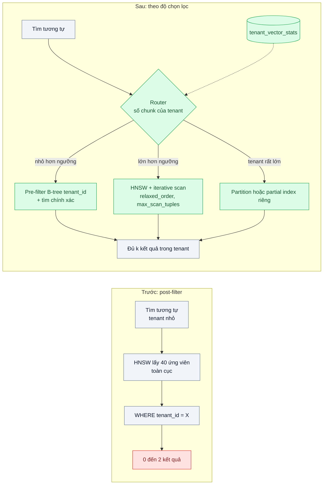
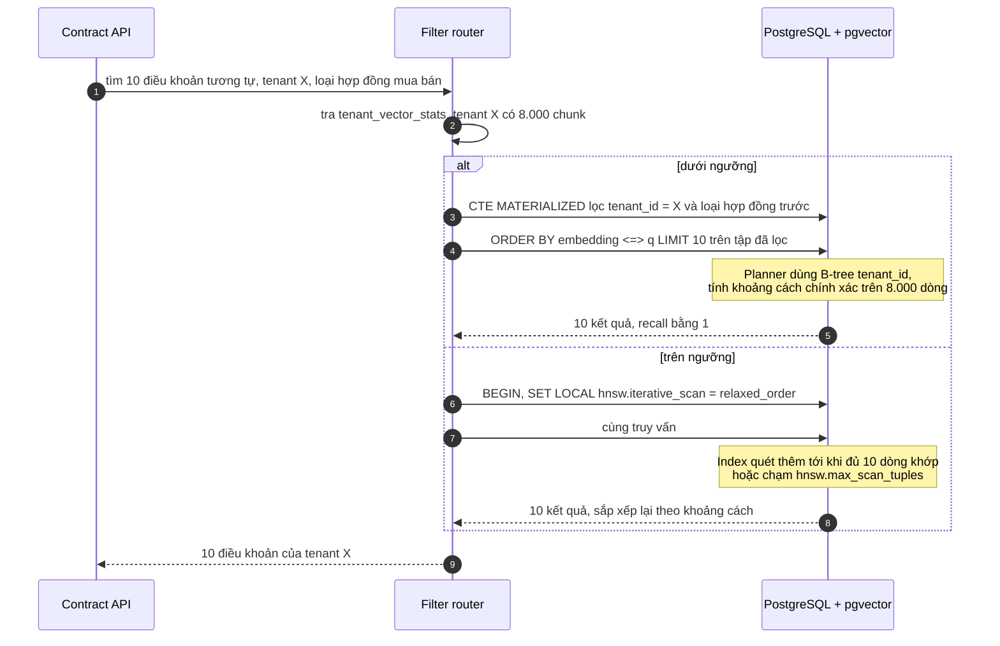

# Filtered Vector Search (pre/post-filter) — Tìm tương tự nhưng chỉ trong dữ liệu của tenant X, filter sau làm top-k rỗng

| Scope | Mức độ | Trạng thái | Pattern gốc | Cập nhật |
|---|---|---|---|---|
| 12 · backend / database / vector | 🟡 Trung bình | 📋 Kế hoạch | Filtered ANN — Qdrant docs "Filtering" (filterable HNSW); pgvector docs (iterative index scan, partial index) | 2026-10-06 |

> **Một câu tóm tắt:** Chọn chiến lược lọc theo độ chọn lọc của điều kiện — lọc trước rồi tìm chính xác khi tập dữ liệu của tenant nhỏ, dùng index ANN có quét lặp (iterative scan) hoặc lọc tích hợp trong đồ thị khi tập lớn — để tìm tương tự trong phạm vi một tenant luôn trả đủ k kết quả đúng.

## 1. Bài toán thực tế (What)

**Bối cảnh** *(doanh nghiệp giả định, số liệu minh họa)*
SaaS quản lý hợp đồng có 2.000 tenant, tổng 40 triệu chunk điều khoản trong một bảng pgvector có index HNSW. Tính năng "tìm điều khoản tương tự" luôn lọc theo `tenant_id` và thường thêm loại hợp đồng. Tenant lớn nhất có 3 triệu chunk; một nửa số tenant có dưới 20.000 chunk.

**Triệu chứng người kinh doanh nhìn thấy**
- Tenant nhỏ tìm điều khoản tương tự nhận 0–2 kết quả dù có hàng trăm điều khoản liên quan; khách nghĩ tính năng hỏng và mở ticket.
- Tenant lớn dùng bình thường, nên đội phát triển khó tái hiện lỗi.
- Một kỹ sư tăng `LIMIT` lên 1.000 rồi lọc ở ứng dụng: chậm hơn hẳn mà tenant rất nhỏ vẫn thiếu kết quả.

**Nguyên nhân kỹ thuật**
Với index ANN, PostgreSQL lấy ứng viên gần nhất *toàn cục* từ index (số lượng giới hạn bởi `hnsw.ef_search`, mặc định 40) rồi mới áp `WHERE tenant_id = X`. Tenant chiếm 0,05% dữ liệu thì gần như không ứng viên nào thuộc tenant đó — đây là hành vi được mô tả trong tài liệu pgvector (lọc áp dụng sau khi quét index). Lọc sau (post-filter) làm top-k rỗng; tăng `LIMIT` không thay đổi số ứng viên index trả về.

**Ràng buộc**
- Mọi truy vấn bắt buộc lọc tenant (cách ly dữ liệu); không được trả kết quả của tenant khác để "cho đủ".
- p95 dưới 100 ms cho mọi kích thước tenant.
- Không đổi sang mô hình mỗi tenant một bảng (bài 06 xử lý khi số tenant quá lớn).

## 2. Vì sao dùng pattern này (Why)

**Nguyên nhân gốc mà pattern nhắm vào:** thứ tự "tìm gần nhất rồi mới lọc" không phù hợp khi điều kiện lọc có độ chọn lọc cao.

**Pattern giải quyết thế nào:** chọn chiến lược theo số dòng khớp điều kiện:
1. **Pre-filter + tìm chính xác** cho tenant nhỏ: index B-tree trên `(tenant_id)` thu tập còn vài nghìn dòng, sau đó tính khoảng cách chính xác trên tập đó. Với tập nhỏ, quét chính xác nhanh và recall bằng 1.
2. **Iterative index scan** (pgvector 0.8 trở lên) cho tenant vừa và lớn: `SET LOCAL hnsw.iterative_scan = relaxed_order` (hoặc `strict_order`) cho phép index tiếp tục quét thêm khi lọc loại bớt ứng viên, tới khi đủ kết quả hoặc chạm `hnsw.max_scan_tuples`.
3. **Partial index hoặc partition** cho điều kiện có ít giá trị và ổn định (loại hợp đồng, tenant rất lớn): mỗi phần có index riêng, lọc trở thành chọn index.
4. **Router theo độ chọn lọc**: ứng dụng tra số chunk của tenant (bảng thống kê cập nhật định kỳ) để chọn nhánh 1 hay 2; ngưỡng xác định bằng benchmark.
Trong Qdrant, cơ chế tương đương là payload index và filterable HNSW: điều kiện lọc được kiểm tra *trong khi* duyệt đồ thị, và bộ lập kế hoạch truy vấn chuyển sang quét theo payload index khi số điểm khớp ít.

**Lựa chọn khác đã cân nhắc**

| Lựa chọn | Giải quyết được gì | Vì sao không chọn (ở bài này) |
|---|---|---|
| Giữ nguyên + tối ưu nhỏ: tăng `hnsw.ef_search` lên 1.000 | Nhiều ứng viên hơn trước khi lọc | Tất cả truy vấn chậm đi; tenant cực nhỏ vẫn có thể rỗng |
| Over-fetch ở ứng dụng (lấy k × 50 rồi lọc) | Đơn giản | Không đảm bảo đủ k; tốn băng thông; vẫn phụ thuộc giới hạn ứng viên của index |
| Mỗi tenant một bảng và index riêng | Lọc tự nhiên | 2.000 index, quản lý migration và RAM khó; xem bài 06 |
| Vector DB có lọc tích hợp (Qdrant) | Lọc trong đồ thị | Thêm hệ mới; bài 01 đã chọn pgvector tới khi chạm điều kiện chuyển |
| Chiến lược theo độ chọn lọc trong pgvector *(chọn)* | Đủ k kết quả cho mọi tenant, p95 kiểm soát được | Thêm logic router và thống kê; phải hiểu plan để gỡ lỗi |

## 3. Thiết kế hệ thống (How)

### 3.1 Kiến trúc trước và sau



### 3.2 Luồng chính



### 3.3 Thành phần và trách nhiệm

| Thành phần | Trách nhiệm | Quyết định thiết kế đáng chú ý |
|---|---|---|
| Index B-tree `(tenant_id, contract_type)` | Thu nhỏ tập cho nhánh pre-filter | Viết nhánh này bằng CTE `MATERIALIZED` để chắc chắn lọc trước rồi mới tính khoảng cách; kiểm tra bằng `EXPLAIN` |
| Index HNSW | Nhánh tenant lớn | Một index chung cho bảng |
| Cấu hình iterative scan | `hnsw.iterative_scan`, `hnsw.max_scan_tuples` | `relaxed_order` có thể trả thứ tự hơi lệch, sắp xếp lại ở truy vấn ngoài nếu cần thứ tự chặt |
| `tenant_vector_stats` | Số chunk mỗi tenant, cập nhật định kỳ | Tránh `COUNT(*)` mỗi truy vấn |
| Filter router | Chọn nhánh theo ngưỡng | Ngưỡng là cấu hình lấy từ benchmark, không đoán |
| Repository | Luôn thêm điều kiện `tenant_id` | Không có đường truy vấn nào bỏ được lọc tenant |

### 3.4 Điểm dễ sai khi triển khai
- **Tin rằng `LIMIT` lớn sẽ cứu**: số ứng viên do `ef_search` quyết định, không do `LIMIT`. Đo số dòng trả về theo từng nhóm tenant.
- **Planner chọn sai nhánh**: thống kê cũ làm planner dùng HNSW cho tenant nhỏ. Chạy `ANALYZE`, xem `EXPLAIN ANALYZE`, và để router quyết định rõ ràng khi cần.
- **Không đặt trần cho iterative scan**: tenant gần như không có dòng khớp làm index quét rất lâu. Đặt `hnsw.max_scan_tuples` và timeout truy vấn.
- **Chỉ test với tenant lớn**: lỗi chỉ lộ ở tenant nhỏ. Bộ test phải có đủ nhóm kích thước.
- **"Bổ sung" kết quả từ tenant khác cho đủ k**: vi phạm cách ly dữ liệu. Thà trả ít kết quả hơn.

## 4. Tech stack và tác động (Impact techstack)

| Lớp | Công nghệ chọn | Vì sao chọn | Thay thế tương đương |
|---|---|---|---|
| Ngôn ngữ / runtime | TypeScript strict, Node 20+, NestJS | Trùng stack | Fastify |
| Lưu vector + lọc | PostgreSQL 16 + pgvector 0.8 trở lên (iterative index scan), B-tree, partial index, partitioning | Đủ công cụ cho cả ba chiến lược trong một DB | Qdrant (payload index, filterable HNSW) |
| Phương án so sánh | Qdrant với payload index trên `tenant_id` | Thấy cách lọc trong đồ thị hoạt động trên cùng dữ liệu | Pinecone metadata filtering |
| Embedding | Model embedding (ví dụ Voyage AI, hoặc mô hình mở qua Text Embeddings Inference) | Chỉ cần tập vector; chọn cụ thể khi thực hành | Vector chuẩn hóa ngẫu nhiên |
| Đo | Script Node theo nhóm tenant, `EXPLAIN (ANALYZE, BUFFERS)` | Thấy plan và số tuple quét | k6 |
| Hạ tầng / test | Docker Compose, Vitest | Lặp lại được | — |

**Thay đổi so với hệ thống hiện tại:** nâng pgvector lên phiên bản có iterative scan, thêm index B-tree kết hợp, bảng thống kê, router trong repository. Đội vận hành học đọc plan của truy vấn vector có lọc.

## 5. Kết quả đầu ra và cách đo (Output impact)

| Chỉ số | Trước (minh họa) | Mục tiêu khi thực hành | Cách đo |
|---|---|---|---|
| Tỷ lệ truy vấn trả ít hơn k kết quả, nhóm tenant nhỏ | 60% | 0% (khi tenant có ≥ k chunk khớp) | Script 500 truy vấn mỗi nhóm kích thước tenant (nhỏ, vừa, lớn) |
| recall@10 trong phạm vi tenant | không đo | ≥ 0,95 mọi nhóm | Ground truth bằng quét chính xác có `WHERE tenant_id` |
| p95 theo nhóm tenant | tenant nhỏ nhanh nhưng rỗng | dưới 100 ms mọi nhóm | Script đo sau warm-up |
| Plan đúng nhánh | không kiểm | 100% truy vấn mẫu đúng plan mong đợi | `EXPLAIN` tự động cho mẫu truy vấn mỗi nhóm |
| Số tuple index quét trung bình | — | ghi lại theo nhóm | `EXPLAIN (ANALYZE, BUFFERS)` |

> Số "trước" là minh họa để hình dung bài toán. Số "mục tiêu" chỉ được coi là đạt khi có số đo thật
> ở mục 8 kèm môi trường đo.

**Tác động nghiệp vụ mong đợi:** khách hàng nhỏ — phần lớn số tenant — dùng được tính năng như khách lớn, giảm ticket "tính năng không chạy" và rủi ro rời bỏ ở nhóm khách này.

## 6. Đánh đổi và khi KHÔNG nên dùng

**Đánh đổi**
- Hai hoặc ba đường truy vấn phải duy trì và test; ngưỡng cần đo lại khi dữ liệu thay đổi.
- `relaxed_order` có thể trả thứ tự không hoàn toàn chặt; iterative scan tốn thêm thời gian cho điều kiện hiếm.
- Partition theo tenant làm migration và quản lý index phức tạp hơn.

**Không nên dùng khi**
- Điều kiện lọc giữ lại phần lớn dữ liệu (ví dụ chỉ loại sản phẩm hết hàng): post-filter đơn giản là đủ.
- Không bao giờ có lọc: chỉ cần index ANN thường (bài 02).

**Liên quan**
- [ANN Index: HNSW vs IVFFlat](../02-hnsw-vs-ivfflat-tim-san-pham-tuong-tu-5-trieu-anh-brute-force-3-giay/) — index nền.
- [Multi-tenancy in Vector DB](../06-multi-tenancy-vector-10k-tenant-moi-tenant-mot-collection/) — khi số tenant lên hàng chục nghìn.
- [Document-level Access Control in RAG (scope 10)](../../10-backend-ai-rag/07-access-control-rag-nhan-vien-hoi-duoc-luong-cua-sep/) — lọc theo quyền gặp đúng vấn đề này.
- [Multi-tenant Data Isolation (scope 02)](../../02-backend-database/07-multi-tenant-saas-300-cong-ty-chung-mot-db/) — mô hình chung bảng, chung DB.
- [Multi-tenant Authorization (scope 19)](../../19-backend-frontend-authenticate/09-multi-tenant-auth-tenant-trong-token-va-cach-ly/) — tenant lấy từ token.

## 7. Cơ sở tham khảo

- pgvector — https://github.com/pgvector/pgvector — phần Filtering (lọc áp dụng sau khi quét index, partial index, partitioning) và Iterative Index Scans (`hnsw.iterative_scan`, `hnsw.max_scan_tuples`).
- Qdrant docs, "Filtering" và "Indexing" — https://qdrant.tech/documentation/ — payload index, filterable HNSW, bộ lập kế hoạch chọn giữa duyệt đồ thị và quét theo payload.
- Pinecone docs, "Metadata filtering" — https://docs.pinecone.io/ — cách một vector DB được quản lý mô tả lọc theo metadata khi truy vấn.
- PostgreSQL docs — https://www.postgresql.org/docs/ — partial index, table partitioning, `EXPLAIN`, `ANALYZE` và thống kê cho planner.
- Malkov & Yashunin, HNSW (2016), arXiv 1603.09320 — vì sao số ứng viên phụ thuộc `ef` và vì sao lọc sau khi duyệt đồ thị làm mất kết quả.

## 8. Kế hoạch thực hành

- [ ] Bước 1: Docker Compose với Postgres 16 + pgvector 0.8 trở lên; sinh 5 triệu chunk phân bố lệch cho 2.000 tenant (vài tenant lớn, nhiều tenant nhỏ), kèm loại hợp đồng.
- [ ] Bước 2: đo "trước" với post-filter: tỷ lệ trả thiếu k, recall, p95 theo nhóm tenant.
- [ ] Bước 3: áp dụng: index B-tree kết hợp, iterative scan, partial index cho một loại hợp đồng, bảng thống kê, router; dựng Qdrant với payload index để so sánh.
- [ ] Bước 4: quét ngưỡng router (ví dụ 5.000 / 20.000 / 100.000 chunk) để chọn ngưỡng có p95 tốt nhất; ghi kết quả vào mục 5.
- [ ] Bước 5: test Vitest: (a) tenant 5.000 chunk luôn nhận đủ 10 kết quả, (b) không kết quả nào thuộc tenant khác, (c) router chọn nhánh đúng theo thống kê, (d) iterative scan dừng ở `max_scan_tuples` với điều kiện không khớp dòng nào.

**Cấu trúc code dự kiến**
```text
src/
  similar-clauses/
    filter-router.ts          # chọn nhánh theo tenant_vector_stats
    exact-search.ts           # pre-filter + tìm chính xác
    iterative-ann-search.ts   # SET LOCAL hnsw.iterative_scan
    tenant-vector-stats.ts
db/migrations/001-clauses-indexes.sql
bench/run-filtered-benchmark.ts
test/
  filter-router.test.ts
  tenant-isolation.test.ts
docker-compose.yml            # postgres + pgvector, qdrant
```

**Cách chạy** *(điền khi bắt đầu code)*
```bash
docker compose up -d
pnpm install && pnpm test
```
