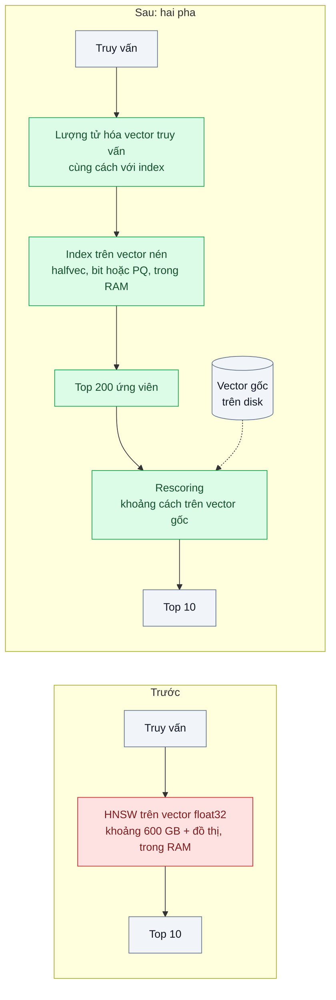
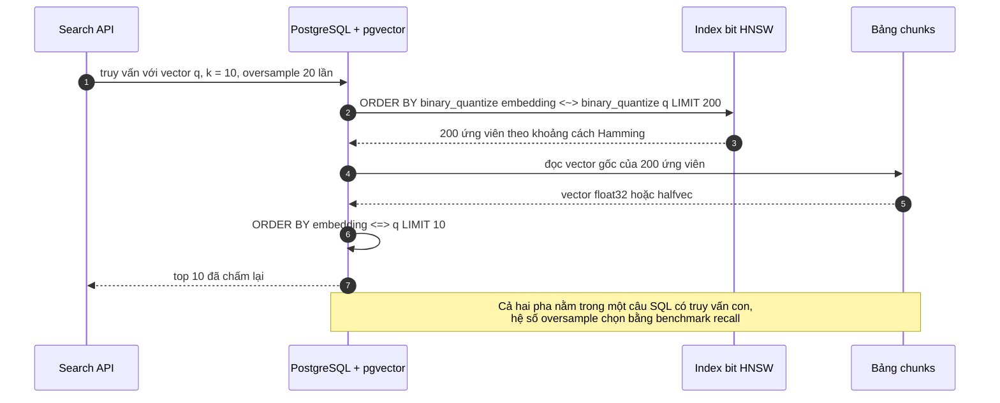

# Quantization (scalar / product / binary) — 100 triệu vector × 1536 chiều = 600 GB RAM

| Scope | Mức độ | Trạng thái | Pattern gốc | Cập nhật |
|---|---|---|---|---|
| 12 · backend / database / vector | 🔴 Nâng cao | 📋 Kế hoạch | Product Quantization — Jégou, Douze, Schmid (TPAMI 2011); scalar / binary quantization — pgvector `halfvec` / `bit`, Qdrant "Quantization" | 2026-10-06 |

> **Một câu tóm tắt:** Nén vector trong index (float16, int8, 1 bit mỗi chiều, hoặc mã PQ) để index vừa RAM, tìm ứng viên trên bản nén rồi chấm lại (rescore) top ứng viên bằng vector gốc lưu trên disk — đổi một phần nhỏ độ chính xác có kiểm soát lấy bộ nhớ giảm nhiều lần.

## 1. Bài toán thực tế (What)

**Bối cảnh** *(doanh nghiệp giả định, số liệu minh họa)*
Nền tảng SaaS lưu trữ và tìm kiếm tài liệu doanh nghiệp có 100 triệu chunk, mỗi chunk một embedding 1536 chiều float32. Chỉ riêng vector đã là 100 triệu × 1536 × 4 byte ≈ 614 GB, chưa tính đồ thị HNSW. Hệ thống chạy trên hai máy nhiều RAM (bản chính và bản sao) và tăng khoảng 5 triệu chunk mỗi tháng.

**Triệu chứng người kinh doanh nhìn thấy**
- Máy chủ nhiều RAM là khoản chi hạ tầng lớn nhất; mỗi khách doanh nghiệp lớn ký mới kéo theo yêu cầu nâng cấp máy.
- Biên lợi nhuận của gói rẻ âm vì chi phí lưu vector theo dung lượng không đổi theo giá gói.
- Build lại index sau sự cố mất gần hai ngày, trong thời gian đó tìm kiếm chạy chậm.

**Nguyên nhân kỹ thuật**
ANN chạy nhanh khi index và vector nằm trong RAM; mỗi chiều float32 tốn 4 byte nên bộ nhớ tăng tuyến tính theo số vector × số chiều. Phần lớn độ chính xác của float32 là thừa cho việc *xếp hạng sơ bộ*; chỉ bước xếp hạng cuối mới cần chính xác cao.

**Ràng buộc**
- recall@10 sau tối ưu không thấp hơn 0,95 so với tìm chính xác trên float32.
- p95 tìm kiếm giữ dưới 100 ms.
- Không đổi model embedding trong bài này (đổi model là bài 05).

## 2. Vì sao dùng pattern này (Why)

**Nguyên nhân gốc mà pattern nhắm vào:** lưu và duyệt vector ở độ chính xác cao hơn mức cần thiết cho bước tìm ứng viên.

**Pattern giải quyết thế nào:** tách tìm kiếm thành hai pha và chọn mức nén cho pha một:
- **Scalar quantization**: float32 → float16 (kiểu `halfvec` của pgvector, giảm một nửa) hoặc → int8 (Qdrant scalar quantization, giảm khoảng bốn lần). Ít mất recall, dễ áp dụng.
- **Binary quantization**: giữ dấu của mỗi chiều, 1 bit mỗi chiều (giảm 32 lần), so bằng khoảng cách Hamming. pgvector có `binary_quantize()` và kiểu `bit` để tạo index biểu thức; Qdrant có binary quantization. Mức mất recall phụ thuộc mạnh vào model embedding nên bắt buộc phải đo.
- **Product quantization (PQ)**: chia vector thành m đoạn con, mỗi đoạn được thay bằng chỉ số của tâm gần nhất trong codebook học bằng k-means; nén hàng chục lần (Faiss IVF-PQ, Qdrant product quantization).
- **Rescoring**: lấy dư ứng viên (ví dụ top 100–200) từ index nén, tính lại khoảng cách bằng vector gốc (float32 hoặc float16 trên disk), giữ top 10. Lấy dư nhiều hơn → recall cao hơn, chậm hơn.
- **Giảm số chiều** là đòn bẩy bổ sung chỉ khi model hỗ trợ (Matryoshka Representation Learning cho phép cắt chiều mà vẫn giữ phần lớn chất lượng).

**Lựa chọn khác đã cân nhắc**

| Lựa chọn | Giải quyết được gì | Vì sao không chọn (ở bài này) |
|---|---|---|
| Giữ nguyên + tối ưu nhỏ: thuê máy nhiều RAM hơn | Không đổi code, không mất recall | Chi phí tăng tuyến tính theo dữ liệu; không giải quyết biên lợi nhuận |
| Sharding sang nhiều máy | Mỗi máy ít RAM hơn | Tổng RAM không đổi; thêm độ phức tạp gộp kết quả |
| Index đặt trên SSD (họ DiskANN; extension pgvectorscale — cần xác minh) | RAM rất ít | Công nghệ khác, phụ thuộc thêm thành phần; để làm hướng mở |
| Giảm chiều bằng PCA trên embedding có sẵn | Giảm bộ nhớ theo tỷ lệ chiều | Mất chất lượng khó đoán với model không được huấn luyện cho việc này |
| Quantization + rescoring *(chọn)* | Giảm RAM nhiều lần, recall khôi phục bằng rescoring | Thêm pha rescoring; vector gốc vẫn chiếm disk; phải đo theo model |

## 3. Thiết kế hệ thống (How)

### 3.1 Kiến trúc trước và sau



### 3.2 Luồng chính



### 3.3 Thành phần và trách nhiệm

| Thành phần | Trách nhiệm | Quyết định thiết kế đáng chú ý |
|---|---|---|
| Cột vector gốc | Lưu `embedding` (float32 hoặc `halfvec`) cho rescoring | Có thể lưu `halfvec` thay float32 nếu benchmark cho thấy không mất recall |
| Index nén | Index biểu thức trên `binary_quantize(embedding)::bit(1536)` hoặc trên `embedding::halfvec(1536)` | Truy vấn phải dùng *đúng* biểu thức của index thì planner mới dùng index |
| Truy vấn hai pha | Truy vấn con lấy ứng viên trên index nén, truy vấn ngoài sắp xếp lại bằng vector gốc | Hệ số oversample là cấu hình |
| Phương án PQ | Faiss IVF-PQ hoặc Qdrant product quantization trên cùng dữ liệu | Để so sánh mức nén và recall với scalar / binary |
| Benchmark harness | Đo recall@10, p95, kích thước index theo từng mức nén và hệ số oversample | Ground truth bằng tìm chính xác float32 trên mẫu |

### 3.4 Điểm dễ sai khi triển khai
- **Truy vấn không khớp biểu thức index**: index trên `binary_quantize(embedding)` nhưng truy vấn viết khác kiểu ép thì planner quét tuần tự. Kiểm tra bằng `EXPLAIN`.
- **Bỏ rescoring**: dùng thẳng kết quả Hamming làm kết quả cuối thì recall tụt rõ. Luôn có pha hai.
- **Tin số liệu nén của model khác**: binary quantization hợp với một số model, rất tệ với model khác. Đo trên model đang dùng.
- **Ngoại suy từ mẫu quá nhỏ**: recall trên 1 triệu vector có thể khác trên 100 triệu. Đo ở ít nhất hai quy mô và ghi rõ giới hạn của kết luận.
- **Quên disk**: vector gốc vẫn cần chỗ; RAM giảm nhưng disk và IO cho rescoring tăng. Theo dõi IO khi chạy tải.

## 4. Tech stack và tác động (Impact techstack)

| Lớp | Công nghệ chọn | Vì sao chọn | Thay thế tương đương |
|---|---|---|---|
| Ngôn ngữ / runtime | TypeScript strict, Node 20+ (API, harness) | Trùng stack | — |
| Lưu vector + nén | PostgreSQL 16 + pgvector: `halfvec`, `bit`, `binary_quantize()`, index biểu thức | Thử scalar và binary trong DB hiện có | Qdrant scalar / binary / product quantization |
| Phương án PQ | Faiss IVF-PQ chạy trong script Python, hoặc Qdrant product quantization | pgvector không có PQ; cần để so sánh mức nén cao | — |
| Embedding | Model embedding (ví dụ Voyage AI, hoặc mô hình mở qua Text Embeddings Inference) | Giữ nguyên model hiện tại; chọn cụ thể khi thực hành | — |
| Đo | Script Node đo recall và p95, `pg_relation_size`, `EXPLAIN (ANALYZE, BUFFERS)` | Thấy plan, IO và kích thước | k6 cho tải đồng thời |
| Hạ tầng / test | Docker Compose (Postgres + pgvector, Qdrant), Vitest | Lặp lại được | — |

**Thay đổi so với hệ thống hiện tại:** thêm index nén (build song song với index cũ, chuyển truy vấn bằng feature flag), viết lại truy vấn thành hai pha, có thể đổi cột gốc sang `halfvec`. Đội vận hành theo dõi thêm IO disk và recall định kỳ.

## 5. Kết quả đầu ra và cách đo (Output impact)

| Chỉ số | Trước (minh họa) | Mục tiêu khi thực hành | Cách đo |
|---|---|---|---|
| Kích thước index trong RAM (quy đổi 100 triệu vector) | khoảng 600 GB + đồ thị | dưới 100 GB | `pg_relation_size` trên mẫu 1 triệu và 10 triệu vector, ngoại suy có ghi chú |
| recall@10 sau rescoring | 1,0 (float32 chính xác) | ≥ 0,95 | Ground truth float32 trên 1.000 truy vấn; đo cho từng mức nén và oversample |
| p95 tìm kiếm | đo trên cấu hình hiện tại | dưới 100 ms | Script sau warm-up, ghi cấu hình máy |
| Thời gian build index | gần 2 ngày (quy mô thật) | giảm rõ trên cùng mẫu | Đo `CREATE INDEX` trên mẫu 10 triệu vector cho từng loại |
| Chi phí hạ tầng ước tính mỗi tháng | — | ước tính từ RAM cần thiết | Bảng giá máy của nhà cung cấp cloud tại thời điểm đo, ghi rõ nguồn |

> Số "trước" là minh họa để hình dung bài toán. Số "mục tiêu" chỉ được coi là đạt khi có số đo thật
> ở mục 8 kèm môi trường đo.

**Tác động nghiệp vụ mong đợi:** chi phí lưu vector không còn tăng theo từng khách lớn, gói rẻ có biên lợi nhuận dương, khôi phục sau sự cố nhanh hơn.

## 6. Đánh đổi và khi KHÔNG nên dùng

**Đánh đổi**
- Mất một phần recall, phải khôi phục bằng rescoring và đo thường xuyên.
- Truy vấn hai pha phức tạp hơn; thêm IO đọc vector gốc.
- Mức nén tốt nhất phụ thuộc model; đổi model là phải đo lại.

**Không nên dùng khi**
- Dữ liệu vừa RAM thoải mái (vài triệu vector): độ phức tạp không đáng.
- Ứng dụng nhạy với từng phần trăm recall và không chịu được thêm độ trễ của rescoring.

**Liên quan**
- [ANN Index: HNSW vs IVFFlat](../02-hnsw-vs-ivfflat-tim-san-pham-tuong-tu-5-trieu-anh-brute-force-3-giay/) — index được nén.
- [Recall / Latency Trade-off](../07-recall-vs-latency-benchmark-ann-chon-tham-so-ef-m/) — phương pháp đo recall dùng ở đây.
- [Embedding Model Versioning](../05-embedding-versioning-doi-model-embedding-phai-re-embed-tat-ca/) — đổi sang model hỗ trợ cắt chiều.
- [Quantization & Speculative Decoding (scope 22)](../../22-backend-ai-optimizer/09-quantization-speculative-decoding-self-host-cham-va-ton-vram/) — lượng tử hóa *trọng số mô hình*, khác với lượng tử hóa vector ở bài này.

## 7. Cơ sở tham khảo

- Jégou, Douze, Schmid, "Product Quantization for Nearest Neighbor Search", TPAMI 2011 — định nghĩa PQ, codebook theo đoạn con, tính khoảng cách xấp xỉ.
- Faiss wiki — https://github.com/facebookresearch/faiss/wiki — các loại index nén (IVF-PQ, scalar quantizer) và hướng dẫn chọn theo bộ nhớ.
- pgvector — https://github.com/pgvector/pgvector — kiểu `halfvec`, `bit`, hàm `binary_quantize()`, ví dụ binary quantization kèm re-ranking, index biểu thức.
- Qdrant docs, "Quantization" — https://qdrant.tech/documentation/ — scalar, binary, product quantization, oversampling và rescoring.
- Kusupati et al., "Matryoshka Representation Learning", NeurIPS 2022 — điều kiện để cắt bớt chiều embedding mà vẫn giữ chất lượng.
- Johnson, Douze, Jégou, "Billion-scale similarity search with GPUs" (2017) — tìm kiếm quy mô lớn dựa trên vector nén.

## 8. Kế hoạch thực hành

- [ ] Bước 1: Docker Compose với Postgres 16 + pgvector và Qdrant; sinh mẫu 1 triệu và 10 triệu vector 1536 chiều từ model đang dùng (hoặc tập công khai có giấy phép phù hợp).
- [ ] Bước 2: đo "trước": HNSW float32 — kích thước, recall (ground truth chính xác), p95, thời gian build.
- [ ] Bước 3: áp dụng: index `halfvec`, index `bit` + rescoring, Qdrant scalar / binary / product; truy vấn hai pha.
- [ ] Bước 4: quét hệ số oversample (5, 10, 20, 40) cho từng mức nén; ghi bảng kích thước, recall@10, p95 ở hai quy mô vào mục 5, kèm giới hạn khi ngoại suy lên 100 triệu.
- [ ] Bước 5: test Vitest: (a) truy vấn hai pha dùng index biểu thức (kiểm tra plan), (b) top 10 sau rescoring trùng tìm chính xác trên tập nhỏ có đáp án, (c) hàm recall@k đúng trên ví dụ tính tay.

**Cấu trúc code dự kiến**
```text
src/
  search/
    two-phase-search.ts       # ứng viên trên index nén + rescoring
    quantization-config.ts    # mức nén, hệ số oversample
db/migrations/
  001-halfvec-index.sql
  002-binary-quantize-index.sql
bench/
  run-quantization-benchmark.ts
  faiss-ivfpq.py              # phương án PQ để so sánh
test/
  two-phase-search.test.ts
docker-compose.yml            # postgres + pgvector, qdrant
```

**Cách chạy** *(điền khi bắt đầu code)*
```bash
docker compose up -d
pnpm install && pnpm test
```
