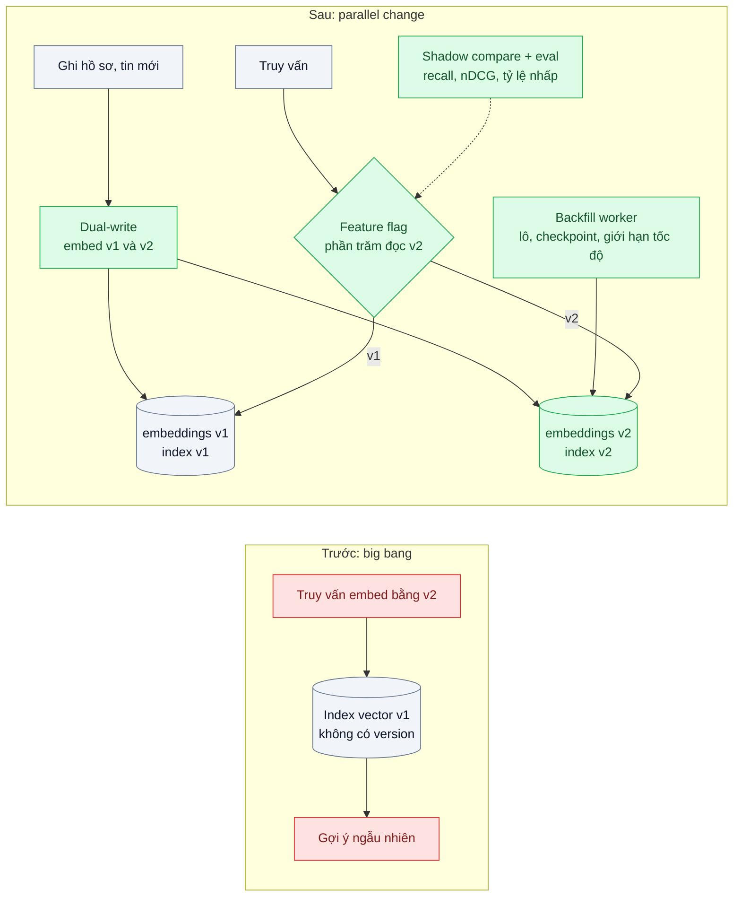
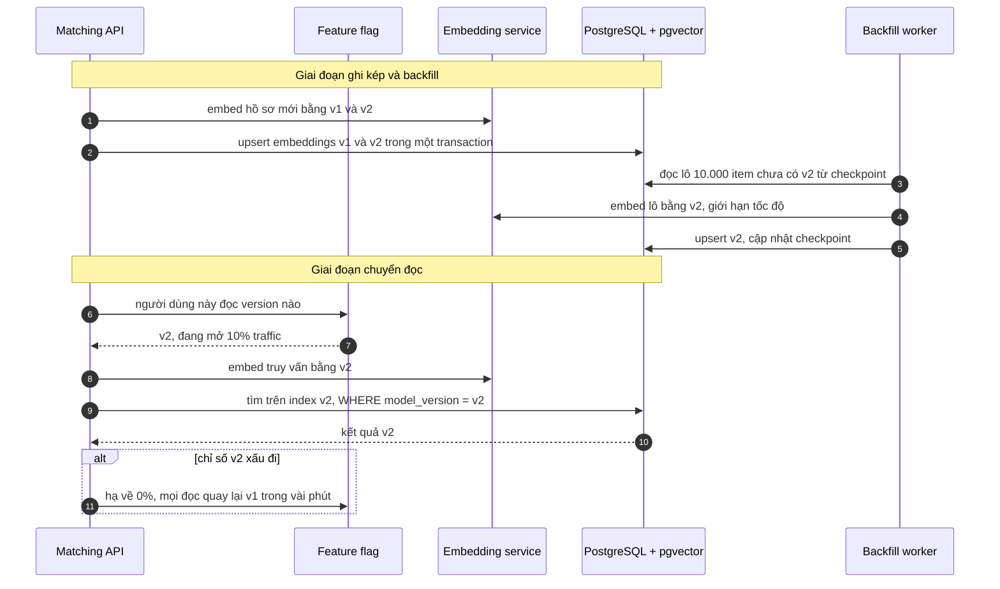

# Embedding Model Versioning & Re-embedding — Đổi model embedding, 20 triệu vector cũ không so được với vector mới

| Scope | Mức độ | Trạng thái | Pattern gốc | Cập nhật |
|---|---|---|---|---|
| 12 · backend / database / vector | 🔴 Nâng cao | 📋 Kế hoạch | Parallel Change (Expand/Contract) — Danilo Sato, Fowler bliki (2014); Named vectors — Weaviate docs | 2026-10-06 |

> **Một câu tóm tắt:** Coi model embedding như một phiên bản schema: gắn version vào mọi vector, thêm không gian vector mới song song với cái cũ (expand), ghi kép dữ liệu mới, re-embed dữ liệu cũ theo lô có checkpoint, so sánh hai bản bằng eval rồi chuyển đường đọc bằng feature flag, cuối cùng mới gỡ bản cũ (contract) — đổi model mà không có lúc nào tìm kiếm trả kết quả rác.

## 1. Bài toán thực tế (What)

**Bối cảnh** *(doanh nghiệp giả định, số liệu minh họa)*
Sàn tuyển dụng có 20 triệu hồ sơ ứng viên và tin tuyển dụng, mỗi bản ghi một embedding 768 chiều từ model cũ, lưu trong PostgreSQL 16 + pgvector để gợi ý "việc phù hợp" và "ứng viên phù hợp". Model mới 1024 chiều cho kết quả khớp tốt hơn rõ trên bộ eval nội bộ. Mỗi ngày có khoảng 150.000 hồ sơ và tin mới.

**Triệu chứng người kinh doanh nhìn thấy**
- Một kỹ sư thử đổi model cho phía truy vấn: gợi ý việc làm thành ngẫu nhiên, phải rollback lúc nửa đêm; nhà tuyển dụng phàn nàn cả buổi sáng.
- Ước tính re-embed toàn bộ mất khoảng 3 ngày và một khoản chi phí đáng kể; trong thời gian đó dữ liệu mới vẫn đổ vào.
- Không ai trả lời chắc được "vector này sinh từ model nào", nên đội ngại cải tiến dù model mới tốt hơn.

**Nguyên nhân kỹ thuật**
Vector của hai model khác nhau nằm trong hai không gian khác nhau (thậm chí khác số chiều); khoảng cách giữa chúng vô nghĩa. Cột `embedding vector(768)` không mang thông tin version; quy trình đổi model là "big bang" một bước, không có trạng thái trung gian để kiểm tra và quay lại.

**Ràng buộc**
- Tìm kiếm không được gián đoạn hay suy giảm trong suốt quá trình chuyển.
- Phải quay lại model cũ trong vài phút nếu model mới có vấn đề trên traffic thật.
- Re-embed phải chạy lại được sau lỗi mà không làm lại từ đầu, và không làm nghẽn DB chính.

## 2. Vì sao dùng pattern này (Why)

**Nguyên nhân gốc mà pattern nhắm vào:** thay đổi không tương thích (đổi không gian vector) được thực hiện trong một bước, không có giai đoạn hai phiên bản cùng tồn tại.

**Pattern giải quyết thế nào:** áp dụng Parallel Change cho embedding:
1. **Version hóa**: mọi vector gắn `model_version`; truy vấn embedding phía người dùng cũng ghi version. Trong pgvector dùng bảng `embeddings(item_id, model_version, embedding)` hoặc thêm cột `embedding_v2 vector(1024)` với index riêng; trong Weaviate/Qdrant dùng named vectors (nhiều vector có tên trên cùng một bản ghi).
2. **Expand**: tạo cột/bảng và index cho v2; v1 vẫn phục vụ đọc.
3. **Ghi kép**: bản ghi mới hoặc sửa được embed bằng cả v1 và v2.
4. **Backfill**: worker re-embed dữ liệu cũ theo lô, ghi checkpoint, idempotent (upsert theo `item_id` + `model_version`), giới hạn tốc độ; ưu tiên dữ liệu đang hoạt động trước.
5. **So sánh**: chạy truy vấn song song v1 và v2 (shadow), đo recall/nDCG trên bộ eval có nhãn và so tỷ lệ nhấp trên một phần traffic.
6. **Chuyển đọc** bằng feature flag theo phần trăm (truy vấn và index luôn cùng version), rồi **contract**: sau thời gian ổn định, dừng ghi v1, xóa index và cột v1.

**Lựa chọn khác đã cân nhắc**

| Lựa chọn | Giải quyết được gì | Vì sao không chọn (ở bài này) |
|---|---|---|
| Giữ nguyên + tối ưu nhỏ: không đổi model, tinh chỉnh truy vấn và lọc | Không rủi ro | Bỏ lỡ cải thiện chất lượng đã đo được |
| Big bang: dừng tính năng, re-embed toàn bộ, đổi một lần | Đơn giản | Gián đoạn nhiều ngày; không có đường quay lại; dữ liệu mới trong lúc chạy bị lệch |
| Học phép chiếu tuyến tính từ không gian v1 sang v2 | Không phải re-embed dữ liệu cũ | Chất lượng không đảm bảo, phụ thuộc cặp model; hướng nghiên cứu (cần xác minh), không phải pattern vận hành |
| Parallel Change với version và feature flag *(chọn)* | Không gián đoạn, quay lại được, đo được trước khi chuyển | Tạm thời tốn gấp đôi lưu trữ và chi phí embed cho dữ liệu mới |

## 3. Thiết kế hệ thống (How)

### 3.1 Kiến trúc trước và sau



### 3.2 Luồng chính



### 3.3 Thành phần và trách nhiệm

| Thành phần | Trách nhiệm | Quyết định thiết kế đáng chú ý |
|---|---|---|
| Bảng `embeddings` | `item_id`, `model_version`, `embedding`, `created_at`; khóa chính `(item_id, model_version)` | Index ANN riêng cho từng version (partial index theo `model_version` hoặc bảng riêng do số chiều khác nhau) |
| Registry model | Danh sách version, số chiều, metric, trạng thái (đang ghi, đang đọc, đã gỡ) | Một nơi duy nhất trả lời "version nào đang dùng" |
| Dual-write | Embed bằng mọi version đang ở trạng thái ghi | Lỗi embed v2 không được chặn ghi v1; đưa vào hàng đợi để thử lại |
| Backfill worker | Re-embed theo lô có checkpoint, idempotent, giới hạn tốc độ | Dùng chung pipeline ingestion (scope 21 bài 05) |
| Feature flag đọc | Phần trăm traffic đọc v2, theo người dùng để kết quả ổn định | Query embedding và index luôn cùng version; version nằm trong khóa cache |
| Shadow compare | Chạy v1 và v2 trên cùng truy vấn mẫu, lưu kết quả để so | Không ảnh hưởng người dùng |

### 3.4 Điểm dễ sai khi triển khai
- **Truy vấn và index khác version**: lỗi phổ biến và im lặng nhất. Hàm tìm kiếm nhận version làm tham số bắt buộc; test kiểm tra không thể gọi lệch.
- **Cache kết quả không có version trong khóa**: sau khi chuyển vẫn trả kết quả v1 (hoặc ngược lại). Đưa `model_version` vào khóa cache.
- **Backfill làm nghẽn DB chính**: ghi hàng triệu dòng và cập nhật index HNSW cùng lúc. Giới hạn tốc độ, chạy giờ thấp điểm, theo dõi p95 truy vấn chính.
- **Quên dữ liệu bị sửa trong lúc backfill**: bản ghi sửa sau khi đã backfill phải được embed lại v2 — dual-write xử lý được nếu bật *trước* khi bắt đầu backfill.
- **Contract quá sớm**: xóa v1 khi chưa có thời gian ổn định thì mất đường quay lại. Đặt điều kiện contract bằng số ngày và chỉ số.

## 4. Tech stack và tác động (Impact techstack)

| Lớp | Công nghệ chọn | Vì sao chọn | Thay thế tương đương |
|---|---|---|---|
| Ngôn ngữ / runtime | TypeScript strict, Node 20+, NestJS | Trùng stack | Fastify |
| Lưu vector | PostgreSQL 16 + pgvector, bảng theo version | Transaction cho ghi kép; index riêng mỗi version | Named vectors trong Qdrant hoặc Weaviate |
| Embedding | Hai model embedding (ví dụ Voyage AI, hoặc mô hình mở qua Text Embeddings Inference) | Bài cần hai model có số chiều khác nhau; chọn cụ thể khi thực hành | — |
| Backfill | Worker + hàng đợi PGMQ, checkpoint trong bảng | Chạy lại được, giới hạn tốc độ | BullMQ |
| Rollout và eval | Feature flag (bảng cấu hình hoặc thư viện flag hiện có); bộ truy vấn có nhãn, recall@10, nDCG@10 | Chuyển và quay lại trong vài phút; so hai version trước khi mở traffic | — |
| Hạ tầng / test | Docker Compose (Postgres + pgvector + PGMQ), Vitest | Lặp lại được | — |

**Thay đổi so với hệ thống hiện tại:** thêm `model_version` và bảng embedding theo version, registry model, ghi kép, worker backfill, flag đọc. Đội vận hành có quy trình đổi model sáu bước, mỗi bước có tiêu chí qua và cách quay lại.

## 5. Kết quả đầu ra và cách đo (Output impact)

| Chỉ số | Trước (minh họa) | Mục tiêu khi thực hành | Cách đo |
|---|---|---|---|
| Thời gian gián đoạn tìm kiếm khi đổi model | khoảng 3 ngày nếu big bang | 0 | Health check tìm kiếm chạy mỗi phút suốt quá trình chuyển |
| Truy vấn dùng sai version | không đo (sự cố nửa đêm) | 0 | Log version của truy vấn và của index; script đối chiếu |
| Thời gian quay lại model cũ | rollback thủ công nhiều giờ | dưới 5 phút | Diễn tập hạ flag về 0% và đo |
| Tốc độ backfill và khả năng tiếp tục sau lỗi | chạy lại từ đầu | tiếp tục từ checkpoint, không embed trùng | Giết worker giữa chừng, đếm số item embed hai lần |
| Chất lượng v2 so với v1 | — | v2 tốt hơn trên bộ eval trước khi mở traffic | recall@10 và nDCG@10 trên 500 truy vấn có nhãn |
| Ảnh hưởng của backfill lên p95 truy vấn chính | — | tăng không quá 10% | `pg_stat_statements` trước và trong khi backfill |

> Số "trước" là minh họa để hình dung bài toán. Số "mục tiêu" chỉ được coi là đạt khi có số đo thật
> ở mục 8 kèm môi trường đo.

**Tác động nghiệp vụ mong đợi:** đội dám nâng cấp model khi có model tốt hơn, nhà tuyển dụng và ứng viên nhận gợi ý tốt hơn mà không trải qua sự cố.

## 6. Đánh đổi và khi KHÔNG nên dùng

**Đánh đổi**
- Tạm thời gấp đôi lưu trữ, index và chi phí embed cho dữ liệu mới.
- Thêm trạng thái (registry, flag, checkpoint) phải vận hành trong suốt quá trình, có thể kéo dài nhiều ngày đến nhiều tuần.

**Không nên dùng khi**
- Kho nhỏ, re-embed xong trong vài phút và tính năng chịu được bảo trì ngắn: big bang có kế hoạch là đủ.
- Không có bộ eval để chứng minh model mới tốt hơn: làm eval trước, chưa nên đổi model.

**Liên quan**
- [Expand/Contract (scope 02)](../../02-backend-database/08-expand-contract-doi-ten-cot-100-trieu-dong/) — cùng pattern áp dụng cho cột dữ liệu.
- [Embedding Ingestion Pipeline (scope 21)](../../21-backend-ai-infrastructure/05-embedding-pipeline-nhap-10-trieu-tai-lieu-idempotent/) — nền cho worker backfill.
- [RAG Evaluation (scope 10)](../../10-backend-ai-rag/06-rag-evaluation-ragas-khong-biet-tra-loi-dung-bao-nhieu-phan-tram/) — đo chất lượng trước khi chuyển.

## 7. Cơ sở tham khảo

- Danilo Sato, "ParallelChange", Martin Fowler bliki (2014) — https://martinfowler.com/bliki/ParallelChange.html — ba pha expand, migrate, contract cho thay đổi không tương thích.
- Weaviate docs, "Named vectors" — https://weaviate.io/developers/weaviate — nhiều vector có tên trên cùng một đối tượng, nền cho việc giữ hai version song song.
- Kusupati et al., "Matryoshka Representation Learning", NeurIPS 2022 — khi model mới hỗ trợ nhiều kích thước chiều, ảnh hưởng tới kế hoạch lưu trữ.
- pgvector — https://github.com/pgvector/pgvector — index riêng cho từng cột hoặc partial index, kiểu vector theo số chiều.

## 8. Kế hoạch thực hành

- [ ] Bước 1: Docker Compose với Postgres + pgvector + PGMQ; 200.000 hồ sơ và tin giả định; hai model embedding khác số chiều; bộ 500 truy vấn có nhãn.
- [ ] Bước 2: tái hiện "trước": đổi model chỉ ở phía truy vấn, đo recall sụp đổ để thấy triệu chứng.
- [ ] Bước 3: áp dụng: bảng theo version, registry, dual-write, worker backfill có checkpoint, flag đọc, shadow compare.
- [ ] Bước 4: chạy toàn bộ sáu bước trong khi có tải ghi liên tục; đo gián đoạn, sai version, thời gian quay lại, ảnh hưởng p95; ghi vào mục 5.
- [ ] Bước 5: test Vitest: (a) không thể tìm trên index v2 với vector truy vấn v1, (b) worker chạy lại sau lỗi không embed trùng, (c) bản ghi sửa trong lúc backfill có v2 mới nhất, (d) hạ flag về 0% thì mọi truy vấn đọc v1.

**Cấu trúc code dự kiến**
```text
src/
  embeddings/
    model-registry.ts
    dual-write-embedder.ts
    versioned-vector-search.ts   # version là tham số bắt buộc
  backfill/
    reembed-worker.ts            # PGMQ, checkpoint, giới hạn tốc độ
  rollout/read-version-flag.ts   # kèm shadow compare v1 và v2
db/migrations/001-versioned-embeddings.sql
test/
  versioned-vector-search.test.ts
  reembed-worker.test.ts
docker-compose.yml
```

**Cách chạy** *(điền khi bắt đầu code)*
```bash
docker compose up -d
pnpm install && pnpm test
```
