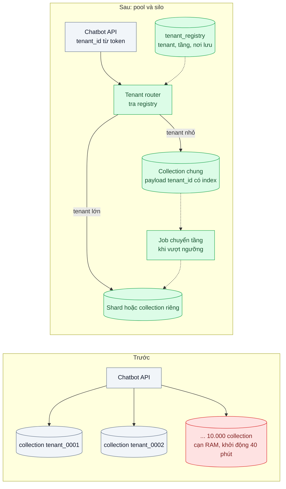
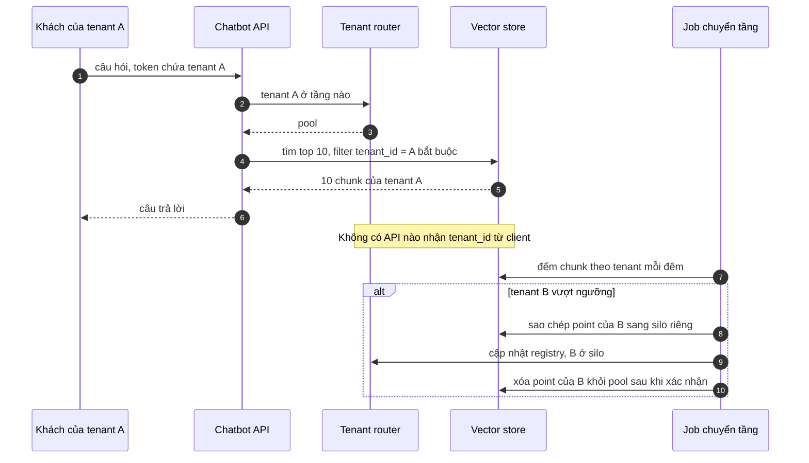

# Multi-tenancy in Vector DB — 10.000 tenant, mỗi tenant một collection làm cạn RAM

| Scope | Mức độ | Trạng thái | Pattern gốc | Cập nhật |
|---|---|---|---|---|
| 12 · backend / database / vector | 🟡 Trung bình | 📋 Kế hoạch | Multitenancy — Qdrant docs; Row Security Policies — PostgreSQL docs + pgvector; pool / silo — Microsoft, multitenant SaaS | 2026-10-06 |

> **Một câu tóm tắt:** Gom tenant nhỏ vào một collection (hoặc bảng) dùng chung, phân vùng bằng trường `tenant_id` có index và bộ lọc bắt buộc ở tầng dữ liệu, chỉ tách tenant lớn ra phân vùng riêng — để chi phí theo *lượng dữ liệu* chứ không theo *số tenant*.

## 1. Bài toán thực tế (What)

**Bối cảnh** *(doanh nghiệp giả định, số liệu minh họa)*
SaaS chatbot chăm sóc khách hàng gắn thương hiệu riêng cho 10.000 doanh nghiệp nhỏ và vừa. Mỗi tenant tải lên tài liệu riêng: trung bình 2.000 chunk, vài chục tenant lớn có 1–2 triệu chunk. Kiến trúc ban đầu tạo mỗi tenant một collection trong cụm Qdrant tự host.

**Triệu chứng người kinh doanh nhìn thấy**
- Cụm cạn RAM khi đạt khoảng 6.000 tenant; mỗi tháng phải thêm node dù tổng dữ liệu tăng chậm.
- Khởi động lại một node mất khoảng 40 phút vì phải nạp hàng nghìn collection; trong lúc đó một phần khách mất chatbot.
- Chi phí hạ tầng cho mỗi tenant gói rẻ cao hơn doanh thu của gói đó; đội kinh doanh không dám mở gói miễn phí.

**Nguyên nhân kỹ thuật**
Mỗi collection có chi phí cố định (segment, index, cấu hình, metadata, file) không phụ thuộc lượng dữ liệu; 10.000 collection nhỏ tốn tài nguyên hơn nhiều so với một collection chứa cùng lượng vector. Tài liệu Qdrant khuyến nghị dùng một collection với phân vùng theo payload cho đa số trường hợp đa tenant thay vì tạo rất nhiều collection.

**Ràng buộc**
- Cách ly tuyệt đối: không truy vấn nào được trả dữ liệu của tenant khác.
- Tenant lớn không được làm chậm tenant nhỏ (noisy neighbor) và ngược lại.
- Tạo tenant mới phải xong trong vài giây (đăng ký tự phục vụ).

## 2. Vì sao dùng pattern này (Why)

**Nguyên nhân gốc mà pattern nhắm vào:** đơn vị cách ly (collection) bị chọn quá nhỏ, nên chi phí cố định nhân theo số tenant.

**Pattern giải quyết thế nào:** mô hình phân tầng pool / silo:
1. **Pool cho tenant nhỏ**: một collection chung; mỗi point có payload `tenant_id`; tạo payload index trên `tenant_id` (Qdrant cho phép đánh dấu trường này là khóa tenant để tối ưu lưu trữ — cần xác minh tên tham số theo phiên bản) và cấu hình HNSW theo nhóm payload để mỗi tenant có đồ thị con hiệu quả.
2. **Silo cho tenant lớn**: tenant vượt ngưỡng được chuyển sang shard hoặc collection riêng; registry ghi tenant nào ở tầng nào.
3. **Bộ lọc bắt buộc**: repository là đường duy nhất truy cập vector và luôn thêm điều kiện `tenant_id` lấy từ token; không có API nhận `tenant_id` từ client.
4. **Bản PostgreSQL tương đương**: một bảng chung có `tenant_id`, Row-Level Security cưỡng chế lọc; tenant nhỏ tìm chính xác sau khi lọc bằng B-tree (vài nghìn dòng là rất nhanh), tenant lớn nằm ở partition riêng có index HNSW riêng.
Bài này dựng cả hai phiên bản trên cùng dữ liệu để thấy cơ chế, rồi chọn theo stack.

**Lựa chọn khác đã cân nhắc**

| Lựa chọn | Giải quyết được gì | Vì sao không chọn (ở bài này) |
|---|---|---|
| Giữ nguyên + tối ưu nhỏ: mỗi tenant một collection, bật quantization, thêm node | Giữ cách ly vật lý | Chi phí vẫn nhân theo số tenant; khởi động lại vẫn chậm |
| Một collection chung, không phân tầng | Rẻ nhất | Tenant 2 triệu chunk chiếm tài nguyên và làm chậm tenant nhỏ |
| Mỗi tenant một database hoặc một cụm | Cách ly tối đa, đáp ứng yêu cầu hợp đồng đặc biệt | Vận hành 10.000 đơn vị là không khả thi; chỉ dành cho khách trả tiền cho silo |
| Pool cho tenant nhỏ, silo cho tenant lớn *(chọn)* | Chi phí theo dữ liệu, tenant lớn không làm phiền tenant nhỏ | Cách ly là logic (bộ lọc), phải test kỹ; cần quy trình chuyển tầng |

## 3. Thiết kế hệ thống (How)

### 3.1 Kiến trúc trước và sau



### 3.2 Luồng chính



### 3.3 Thành phần và trách nhiệm

| Thành phần | Trách nhiệm | Quyết định thiết kế đáng chú ý |
|---|---|---|
| Collection chung (pool) | Chứa vector của mọi tenant nhỏ | Payload index trên `tenant_id`; cấu hình HNSW theo nhóm payload theo tài liệu Multitenancy của Qdrant |
| Silo | Shard hoặc collection riêng cho tenant lớn | Ngưỡng chuyển tầng lấy từ benchmark |
| `tenant_registry` | Tenant → tầng → nơi lưu | Nguồn sự thật duy nhất cho router |
| Repository vector | Đường duy nhất đọc/ghi vector, luôn thêm filter tenant | Kiểu dữ liệu buộc truyền `TenantContext`, không có hàm "tìm không lọc" |
| Job chuyển tầng | Sao chép → đổi registry → xóa bản cũ | Idempotent; đọc trong lúc chuyển vẫn đúng nhờ đổi registry sau khi sao chép xong |
| Bản PostgreSQL | Bảng chung + RLS; partition cho tenant lớn | Dùng khi stack đã chọn pgvector (bài 01) |

### 3.4 Điểm dễ sai khi triển khai
- **Quên filter ở một đường truy vấn** (job nội bộ, endpoint admin): lộ dữ liệu chéo tenant. Chặn ở repository và có test rò rỉ tự động.
- **Lấy `tenant_id` từ tham số request**: kẻ tấn công đổi giá trị để đọc dữ liệu tenant khác (OWASP API1). Luôn lấy từ token đã xác thực.
- **Không có index payload trên `tenant_id`**: mỗi truy vấn lọc phải quét rộng, chậm dần theo tổng dữ liệu.
- **Chuyển tầng không nguyên tử**: xóa ở pool trước khi registry trỏ sang silo làm tenant mất dữ liệu tạm thời. Thứ tự: sao chép, xác nhận, đổi registry, rồi mới xóa.
- **Xóa tenant chỉ xóa registry**: vector vẫn nằm trong pool. Job xóa phải xóa theo filter `tenant_id` và kiểm tra lại số lượng.

## 4. Tech stack và tác động (Impact techstack)

| Lớp | Công nghệ chọn | Vì sao chọn | Thay thế tương đương |
|---|---|---|---|
| Ngôn ngữ / runtime | TypeScript strict, Node 20+, NestJS; `tenant_id` lấy từ token (OIDC hoặc JWT nội bộ) | Trùng stack; token là nguồn tin cậy duy nhất cho tenant | Fastify |
| Vector store (phiên bản Qdrant) | Qdrant: một collection, payload index `tenant_id`, sharding cho tenant lớn | Hệ hiện có của doanh nghiệp giả định; có hướng dẫn multitenancy chính thức | Weaviate multi-tenancy |
| Vector store (phiên bản PostgreSQL) | PostgreSQL 16 + pgvector, Row Security Policies, partitioning | Cưỡng chế cách ly ở DB; dùng khi đã chọn pgvector | — |
| Embedding | Model embedding (ví dụ Voyage AI, hoặc mô hình mở qua Text Embeddings Inference) | Chỉ cần tập vector; chọn cụ thể khi thực hành | Vector chuẩn hóa ngẫu nhiên |
| Đo | Script tạo 10.000 tenant phân bố lệch, đo RAM, p95, thời gian tạo tenant | Thấy chi phí cố định theo số tenant | k6 |
| Hạ tầng / test | Docker Compose (Qdrant, Postgres + pgvector), Vitest | Lặp lại được | — |

**Thay đổi so với hệ thống hiện tại:** gộp collection theo tenant vào collection chung, thêm registry và router, repository bắt buộc filter, job chuyển tầng và job xóa tenant. Cần một lần di chuyển dữ liệu từ 10.000 collection cũ, chạy theo lô có kiểm tra số lượng.

## 5. Kết quả đầu ra và cách đo (Output impact)

| Chỉ số | Trước (minh họa) | Mục tiêu khi thực hành | Cách đo |
|---|---|---|---|
| RAM cho 10.000 tenant cùng tổng dữ liệu | cạn RAM ở khoảng 6.000 tenant | giảm rõ so với mỗi tenant một collection | Telemetry Qdrant hoặc RSS của tiến trình ở hai mô hình, cùng dữ liệu |
| Thời gian tạo tenant mới | vài phút (tạo collection) | dưới 1 giây (ghi registry) | Đo API tạo tenant |
| Thời gian khởi động lại node | khoảng 40 phút | giảm rõ | Đo từ khởi động tới sẵn sàng phục vụ |
| p95 truy vấn theo tầng (nhỏ, lớn) | — | dưới 100 ms cả hai | Script theo nhóm tenant khi có tải đồng thời từ tenant lớn |
| recall@10 trong phạm vi tenant | — | ≥ 0,95 | Ground truth tìm chính xác trong từng tenant |
| Rò rỉ chéo tenant | không kiểm | 0 trên 10.000 truy vấn ngẫu nhiên | Test tự động: truy vấn bằng token tenant A, kiểm mọi kết quả thuộc A |

> Số "trước" là minh họa để hình dung bài toán. Số "mục tiêu" chỉ được coi là đạt khi có số đo thật
> ở mục 8 kèm môi trường đo.

**Tác động nghiệp vụ mong đợi:** chi phí hạ tầng theo lượng dữ liệu thay vì số khách, mở được gói giá rẻ và gói dùng thử; đăng ký tự phục vụ hoạt động ngay.

## 6. Đánh đổi và khi KHÔNG nên dùng

**Đánh đổi**
- Cách ly là logic: một lỗi ở tầng truy cập có thể lộ dữ liệu; cần test và review nghiêm ngặt.
- Thêm registry, router và job chuyển tầng phải vận hành.
- Khách yêu cầu cách ly vật lý theo hợp đồng phải đi đường silo riêng, giá khác.

**Không nên dùng khi**
- Chỉ có vài chục tenant, mỗi tenant lớn: mỗi tenant một collection hoặc bảng riêng là đơn giản và đủ.
- Yêu cầu pháp lý bắt buộc dữ liệu từng khách ở hạ tầng riêng (ví dụ vùng địa lý khác nhau).

**Liên quan**
- [Filtered Vector Search](../03-metadata-filtering-tim-tuong-tu-nhung-chi-trong-tenant-x/) — lọc tenant trong index ANN.
- [Multi-tenant Data Isolation (scope 02)](../../02-backend-database/07-multi-tenant-saas-300-cong-ty-chung-mot-db/) — cùng câu hỏi chung bảng, chung DB, riêng DB cho dữ liệu quan hệ.
- [Multi-tenant Authorization (scope 19)](../../19-backend-frontend-authenticate/09-multi-tenant-auth-tenant-trong-token-va-cach-ly/) — tenant trong token.

## 7. Cơ sở tham khảo

- Qdrant docs, "Multitenancy" — https://qdrant.tech/documentation/ — khuyến nghị một collection với phân vùng theo payload, payload index cho `tenant_id`, cấu hình HNSW theo nhóm, sharding cho tenant lớn (cần xác minh tên tham số theo phiên bản).
- PostgreSQL docs, "Row Security Policies" — https://www.postgresql.org/docs/ — cưỡng chế lọc tenant ở DB; table partitioning cho tenant lớn.
- Microsoft Learn, *Multitenant SaaS database tenancy patterns* — https://learn.microsoft.com/azure/azure-sql/database/saas-tenancy-app-design-patterns — đánh đổi giữa chung schema, schema riêng, DB riêng.
- Microsoft, *Architect multitenant solutions on Azure* — https://learn.microsoft.com/azure/architecture/guide/multitenant/overview — mô hình pool / silo và noisy neighbor.
- OWASP API Security Top 10 (2023) — https://owasp.org/API-Security/ — API1 Broken Object Level Authorization, lý do không nhận `tenant_id` từ client.

## 8. Kế hoạch thực hành

- [ ] Bước 1: Docker Compose với Qdrant và Postgres + pgvector; script sinh 10.000 tenant phân bố lệch (đa số 2.000 chunk, vài tenant 1 triệu).
- [ ] Bước 2: đo "trước": mỗi tenant một collection — RAM, thời gian tạo tenant, thời gian khởi động lại, p95.
- [ ] Bước 3: áp dụng: collection chung + payload index, registry, router, repository bắt buộc filter, silo cho tenant lớn, job chuyển tầng; bản PostgreSQL với RLS và partition.
- [ ] Bước 4: đo "sau" cùng dữ liệu và cùng máy; chạy tải đồng thời từ tenant lớn để kiểm tra noisy neighbor; ghi vào mục 5.
- [ ] Bước 5: test Vitest: (a) 10.000 truy vấn ngẫu nhiên không trả dữ liệu chéo tenant, (b) không thể gọi tìm kiếm mà không có `TenantContext`, (c) chuyển tầng giữa chừng bị giết vẫn không mất dữ liệu, (d) xóa tenant xóa hết vector của tenant đó.

**Cấu trúc code dự kiến**
```text
src/
  tenancy/
    tenant-registry.ts
    tenant-router.ts
    tier-migration-job.ts     # sao chép, xác nhận, đổi registry, xóa
  vector-store/
    tenant-scoped-repository.ts
    qdrant-pool-store.ts
    pgvector-rls-store.ts
bench/seed-tenants.ts
test/
  tenant-isolation.test.ts
  tier-migration-job.test.ts
docker-compose.yml            # qdrant, postgres + pgvector
```

**Cách chạy** *(điền khi bắt đầu code)*
```bash
docker compose up -d
pnpm install && pnpm test
```
