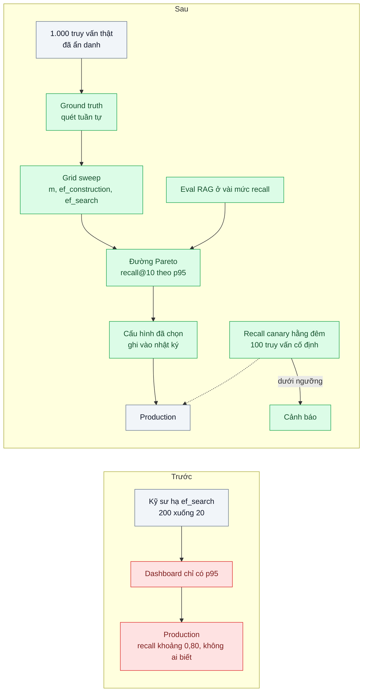
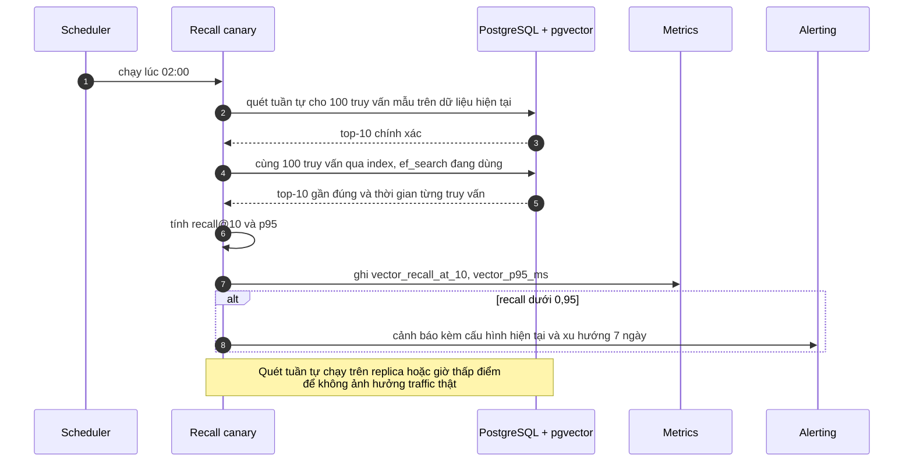

# Recall / Latency Trade-off (ef, M, nprobe) — Tăng tốc gấp 10 nhưng recall rớt từ 0,99 xuống 0,80

| Scope | Mức độ | Trạng thái | Pattern gốc | Cập nhật |
|---|---|---|---|---|
| 12 · backend / database / vector | 🔴 Nâng cao | 📋 Kế hoạch | ANN-Benchmarks — Aumüller et al. (2018/2020); HNSW — Malkov & Yashunin (2016); pgvector docs (`ef_search`, `probes`) | 2026-10-06 |

> **Một câu tóm tắt:** Chọn tham số chỉ số ANN bằng đường cong recall–độ trễ đo trên chính dữ liệu và truy vấn thật (theo phương pháp ANN-Benchmarks), lấy điểm nhanh nhất còn đạt ngưỡng recall nghiệp vụ, rồi giữ nó bằng một "recall canary" chạy định kỳ trong production — thay vì chỉnh tham số theo p95 mà không ai đo recall.

## 1. Bài toán thực tế (What)

**Bối cảnh** *(doanh nghiệp giả định, số liệu minh họa)*
Nền tảng học trực tuyến có kho 8 triệu câu hỏi luyện thi và bài giảng, dùng tìm kiếm vector (PostgreSQL 16 + pgvector, HNSW) cho "câu hỏi tương tự" và cho bước truy hồi của trợ lý giải bài (RAG). Để đạt SLO p95, một kỹ sư hạ `hnsw.ef_search` từ 200 xuống 20: p95 từ 120 ms còn 12 ms.

**Triệu chứng người kinh doanh nhìn thấy**
- Học viên phàn nàn "câu hỏi tương tự" không liên quan; tỷ lệ nhấp vào gợi ý giảm khoảng 20% sau đợt "tối ưu hiệu năng".
- Trợ lý giải bài trả lời sai nhiều hơn vì bài giảng đúng không được truy hồi; đội nội dung tưởng do model.
- Không ai nối hai sự kiện với nhau vì dashboard chỉ có p95, không có recall.

**Nguyên nhân kỹ thuật**
ANN là tìm kiếm gần đúng: tham số truy vấn (`hnsw.ef_search`, `ivfflat.probes`) và tham số build (`m`, `ef_construction`, `lists`) quyết định vị trí trên đường cong đánh đổi giữa recall và tốc độ. Đổi tham số mà chỉ đo độ trễ là tối ưu một phía và mù phía còn lại. Ngoài ra recall có thể trôi theo thời gian khi dữ liệu thay đổi (đặc biệt với IVFFlat build từ dữ liệu cũ).

**Ràng buộc**
- p95 tìm kiếm dưới 30 ms ở QPS giờ cao điểm.
- recall@10 ≥ 0,95 so với tìm chính xác (ngưỡng do đội sản phẩm chốt sau khi xem ảnh hưởng lên eval RAG).
- Không được thêm phần cứng trong quý này.

## 2. Vì sao dùng pattern này (Why)

**Nguyên nhân gốc mà pattern nhắm vào:** tham số ANN được chọn mà không đo recall so với ground truth.

**Pattern giải quyết thế nào:**
1. **Ground truth**: lấy 1.000 truy vấn thật (mẫu từ log, ẩn danh), tính top-k chính xác bằng quét tuần tự hoặc Faiss flat; lưu lại làm chuẩn.
2. **Quét lưới tham số** theo cách của ANN-Benchmarks: với mỗi cấu hình build (`m`, `ef_construction`) và mỗi giá trị truy vấn (`ef_search`), đo recall@k, p50/p95, QPS ở mức đồng thời cố định, thời gian build và kích thước index.
3. **Đường Pareto**: vẽ recall theo p95 (hoặc QPS); chọn điểm có độ trễ thấp nhất mà vẫn đạt ngưỡng recall. Ghi lý do và cấu hình vào nhật ký.
4. **Nối với chỉ số nghiệp vụ**: chạy eval RAG (scope 10 bài 06) ở vài mức recall để biết recall tụt bao nhiêu thì câu trả lời tụt bao nhiêu — từ đó ngưỡng recall có cơ sở.
5. **Recall canary**: job hằng đêm chạy 100 truy vấn mẫu cố định, so với ground truth được tính lại trên dữ liệu hiện tại, cảnh báo khi recall dưới ngưỡng.
6. **Tham số theo loại truy vấn**: truy vấn có lọc hoặc truy vấn cho RAG có thể dùng `ef_search` cao hơn truy vấn cho widget gợi ý.

**Lựa chọn khác đã cân nhắc**

| Lựa chọn | Giải quyết được gì | Vì sao không chọn (ở bài này) |
|---|---|---|
| Giữ nguyên + tối ưu nhỏ: chỉnh `ef_search` theo cảm giác, nhìn p95 | Nhanh | Chính là nguyên nhân sự cố; không thấy recall |
| Dùng tham số mặc định của thư viện | Không phải nghĩ | Mặc định không được chọn cho dữ liệu và SLO của mình |
| Thêm phần cứng để giữ `ef_search` cao | Giữ recall | Trái ràng buộc ngân sách; không trả lời câu hỏi "cao bao nhiêu là đủ" |
| Benchmark Pareto + recall canary *(chọn)* | Tham số có cơ sở, phát hiện trôi recall | Tốn công dựng harness và ground truth; ground truth phải cập nhật |

## 3. Thiết kế hệ thống (How)

### 3.1 Kiến trúc trước và sau



### 3.2 Luồng chính



### 3.3 Thành phần và trách nhiệm

| Thành phần | Trách nhiệm | Quyết định thiết kế đáng chú ý |
|---|---|---|
| Bộ truy vấn mẫu | 1.000 truy vấn thật cho benchmark, 100 truy vấn cố định cho canary | Đại diện phân phối thật, không chỉ truy vấn dễ |
| Ground truth | Top-k chính xác cho từng truy vấn | Tính lại khi dữ liệu đổi nhiều; lưu kèm thời điểm |
| Grid sweep runner | Build index theo từng cấu hình, quét tham số truy vấn, ghi CSV | Cố định mức đồng thời, warm-up, số lần chạy; ghi cấu hình máy |
| Biểu đồ Pareto | Recall theo p95 và theo QPS | Chọn điểm bằng quy tắc viết sẵn, không chọn bằng mắt |
| Recall canary | Đo recall và p95 hằng đêm, phát metric | Chạy trên replica để không tốn tài nguyên bản chính |
| Cấu hình theo loại truy vấn | `ef_search` khác nhau cho widget và RAG | Đặt bằng `SET LOCAL` trong transaction của từng loại |

### 3.4 Điểm dễ sai khi triển khai
- **Ground truth sai metric**: tính ground truth bằng L2 trong khi index dùng cosine. Dùng đúng toán tử của truy vấn thật.
- **Đo trên truy vấn tổng hợp**: vector ngẫu nhiên cho recall khác hẳn truy vấn thật. Dùng truy vấn từ log.
- **Coordinated omission khi đo tải**: công cụ chờ request chậm xong mới gửi request tiếp làm p95 đẹp giả tạo. Dùng mô hình tải mở (tốc độ đến cố định) của k6.
- **So các điểm đo ở trạng thái cache khác nhau**: lần đầu cache nguội, lần sau ấm. Warm-up giống nhau và chạy nhiều lần.
- **Chỉ đo một lần lúc chọn tham số**: recall trôi khi dữ liệu thay đổi; không có canary thì lặp lại sự cố.

## 4. Tech stack và tác động (Impact techstack)

| Lớp | Công nghệ chọn | Vì sao chọn | Thay thế tương đương |
|---|---|---|---|
| Ngôn ngữ / runtime | TypeScript strict, Node 20+ cho harness và canary | Trùng stack | Python cho phần vẽ biểu đồ |
| Vector store | PostgreSQL 16 + pgvector (HNSW; IVFFlat để đối chiếu) | Hệ đang chạy production | Qdrant (`hnsw_ef`), Faiss |
| Ground truth | Quét tuần tự trong PostgreSQL trên replica | Không thêm công cụ | Faiss flat index chạy offline |
| Đo tải | k6 với mô hình tải mở; `EXPLAIN (ANALYZE, BUFFERS)` | Tránh coordinated omission, thấy plan | — |
| Metric và cảnh báo | Prometheus gauge `vector_recall_at_10`, `vector_p95_ms`; cảnh báo theo ngưỡng | Đưa recall lên dashboard cạnh p95 | OpenTelemetry metrics |
| Lịch chạy | Cron trong hệ thống job hiện có | Đơn giản | Kubernetes CronJob |
| Hạ tầng / test | Docker Compose (Postgres + pgvector), Vitest | Lặp lại được | — |

**Thay đổi so với hệ thống hiện tại:** thêm harness benchmark, ground truth có version, job canary và hai metric mới trên dashboard; quy trình đổi tham số ANN bắt buộc kèm đường cong và ghi nhật ký.

## 5. Kết quả đầu ra và cách đo (Output impact)

| Chỉ số | Trước (minh họa) | Mục tiêu khi thực hành | Cách đo |
|---|---|---|---|
| recall@10 so với tìm chính xác | khoảng 0,80 (không ai đo) | ≥ 0,95 | Ground truth trên 1.000 truy vấn thật |
| p95 ở QPS giờ cao điểm | 12 ms ở recall thấp | dưới 30 ms ở recall mục tiêu | k6 tải mở, ghi cấu hình máy và mức đồng thời |
| QPS tối đa ở recall mục tiêu | không biết | ghi lại | Tăng dần tốc độ đến tới khi p95 vượt SLO |
| Ảnh hưởng của recall lên eval RAG | không biết | có bảng recall → tỷ lệ trả lời đúng | Chạy eval bài 06 (scope 10) ở 3–4 mức `ef_search` |
| Thời gian phát hiện recall trôi | không phát hiện | dưới 24 giờ | Recall canary hằng đêm, cảnh báo khi dưới ngưỡng |
| Thời gian build và kích thước index theo cấu hình | — | ghi lại cho từng cấu hình | Đo `CREATE INDEX`, `pg_relation_size` |

> Số "trước" là minh họa để hình dung bài toán. Số "mục tiêu" chỉ được coi là đạt khi có số đo thật
> ở mục 8 kèm môi trường đo.

**Tác động nghiệp vụ mong đợi:** gợi ý và trợ lý giải bài lấy lại chất lượng mà vẫn đạt SLO độ trễ; lần đổi tham số tiếp theo không âm thầm làm hỏng trải nghiệm học viên.

## 6. Đánh đổi và khi KHÔNG nên dùng

**Đánh đổi**
- Tốn công dựng và duy trì ground truth; quét tuần tự trên dữ liệu lớn tốn tài nguyên (nên chạy trên replica).
- Canary chỉ phản ánh 100 truy vấn mẫu; có thể bỏ sót suy giảm ở nhóm truy vấn hiếm.
- Build lại index cho mỗi cấu hình build tốn thời gian.

**Không nên dùng khi**
- Dữ liệu nhỏ đủ để tìm chính xác trong SLO: không cần ANN, không cần đánh đổi.
- Hệ thống thử nghiệm ngắn ngày, chưa có truy vấn thật: dùng tham số mặc định, đo khi có traffic.

**Liên quan**
- [ANN Index: HNSW vs IVFFlat](../02-hnsw-vs-ivfflat-tim-san-pham-tuong-tu-5-trieu-anh-brute-force-3-giay/) — hai họ chỉ số được đo.
- [Quantization](../04-quantization-100-trieu-vector-600gb-ram/) — cùng phương pháp đo recall cho index nén.
- [RAG Evaluation (scope 10)](../../10-backend-ai-rag/06-rag-evaluation-ragas-khong-biet-tra-loi-dung-bao-nhieu-phan-tram/) — nối recall với chất lượng câu trả lời.
- [Percentiles & Histograms (scope 23)](../../23-backend-monitoring-benchmark/04-percentiles-p99-trung-binh-200ms-nhung-khach-than-cham/) và [Load Testing Methodology (scope 23)](../../23-backend-monitoring-benchmark/07-load-testing-k6-coordinated-omission-benchmark-tu-danh-lua/) — đo độ trễ đúng cách.

## 7. Cơ sở tham khảo

- Aumüller, Bernhardsson, Faithfull, "ANN-Benchmarks: A Benchmarking Tool for Approximate Nearest Neighbor Algorithms" (2018/2020); https://ann-benchmarks.com/ — phương pháp đo recall theo QPS và trình bày đường Pareto.
- Malkov & Yashunin, HNSW (2016), arXiv 1603.09320 — ý nghĩa của `M`, `efConstruction`, `ef` với recall và tốc độ.
- pgvector — https://github.com/pgvector/pgvector — tham số `m`, `ef_construction`, `hnsw.ef_search`, `lists`, `ivfflat.probes` và khuyến nghị khởi đầu.
- Faiss wiki — https://github.com/facebookresearch/faiss/wiki — `nprobe` và cách chọn tham số IVF theo đánh đổi tốc độ, độ chính xác.
- Gil Tene, "How NOT to Measure Latency" (Strange Loop, 2015) — coordinated omission và vì sao phải nhìn percentiles đúng cách.
- k6 docs — https://grafana.com/docs/k6/ — mô hình tải mở và đóng (open vs closed model).

## 8. Kế hoạch thực hành

- [ ] Bước 1: Docker Compose với Postgres 16 + pgvector (RAM giới hạn rõ); nạp 2 triệu vector từ văn bản mẫu; chuẩn bị 1.000 truy vấn (từ câu hỏi mẫu) và 100 truy vấn canary.
- [ ] Bước 2: tái hiện "trước": `ef_search = 20`, đo p95 và recall để thấy recall thấp bị che.
- [ ] Bước 3: dựng ground truth, grid sweep (`m` 8/16/32, `ef_construction` 64/128, `ef_search` 10–400), biểu đồ Pareto; chạy eval RAG ở 3–4 mức.
- [ ] Bước 4: chọn cấu hình theo quy tắc viết sẵn, đo k6 ở QPS cao điểm, triển khai canary và metric; ghi vào mục 5 kèm cấu hình máy.
- [ ] Bước 5: test Vitest: (a) recall@k đúng trên ví dụ tính tay, (b) quy tắc chọn trả về điểm nhanh nhất đạt ngưỡng trên dữ liệu CSV mẫu, (c) canary phát cảnh báo khi recall giả lập dưới ngưỡng, (d) ground truth dùng đúng toán tử cosine.

**Cấu trúc code dự kiến**
```text
bench/
  build-ground-truth.ts
  grid-sweep.ts               # m, ef_construction, ef_search
  pick-pareto-config.ts       # quy tắc chọn điểm
  search-load.k6.js           # tải mở
src/
  canary/recall-canary.ts     # job hằng đêm, phát metric
  metrics/recall-at-k.ts
test/
  recall-at-k.test.ts
  pick-pareto-config.test.ts
docker-compose.yml
```

**Cách chạy** *(điền khi bắt đầu code)*
```bash
docker compose up -d
pnpm install && pnpm test
```
