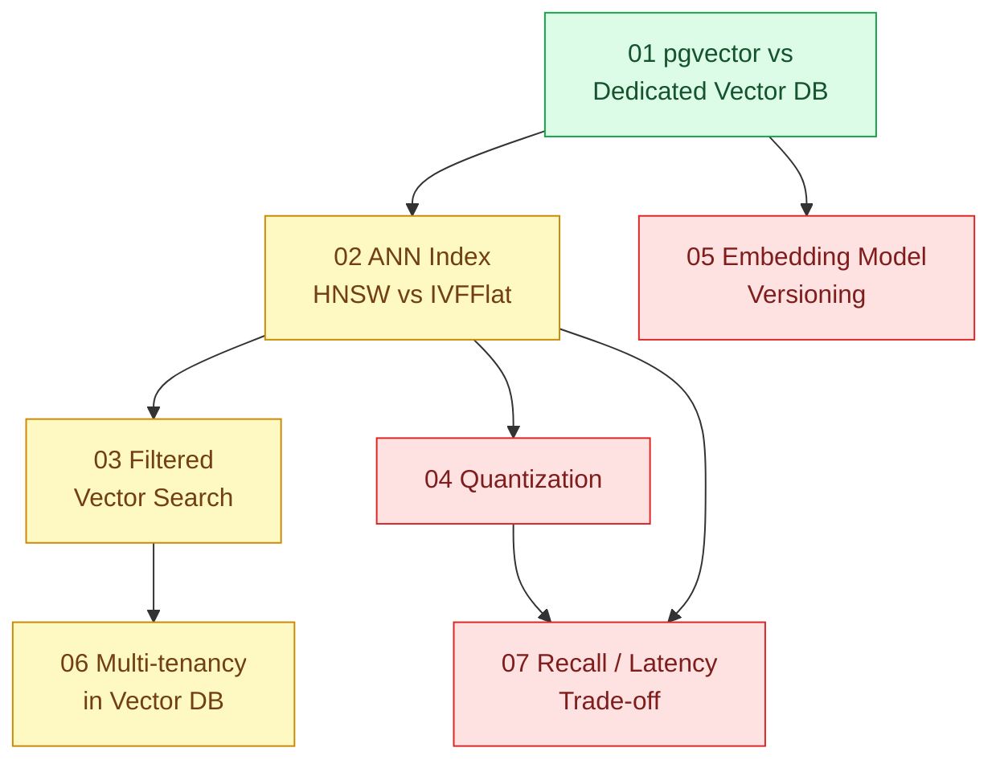

# 12 · Cơ sở dữ liệu vector (`backend / database / vector`)

> **Phạm vi:** Lưu và tìm kiếm vector (embedding) cho tìm tương tự, gợi ý và RAG: chọn hệ lưu trữ,
> chỉ số ANN, lọc theo metadata, nén vector, đổi model embedding, đa tenant, đánh đổi recall/độ trễ.
> Pipeline RAG thuộc scope 10; pipeline tạo embedding ở quy mô lớn thuộc scope 21.
>
> **Câu hỏi trung tâm:** Tìm "giống nhau" trên hàng chục triệu vector với recall, độ trễ và RAM
> chấp nhận được?

## Bản đồ pattern trong scope

## Danh sách bài toán

| # | Bài toán (pattern — triệu chứng) | Mức | Pattern gốc / nguồn | Trạng thái |
|---|---|---|---|---|
| 01 | [pgvector vs Dedicated Vector DB — Đã có PostgreSQL, có cần thêm một DB vector riêng?](./01-pgvector-vs-vector-db-rieng-da-co-postgres/) | 🟢 | pgvector docs; Qdrant docs; DDIA (tiêu chí chọn hệ lưu trữ) | 📋 |
| 02 | [ANN Index: HNSW vs IVFFlat — Tìm sản phẩm tương tự trong 5 triệu ảnh bằng brute force mất 3 giây](./02-hnsw-vs-ivfflat-tim-san-pham-tuong-tu-5-trieu-anh-brute-force-3-giay/) | 🟡 | Malkov & Yashunin, HNSW (2016/2018); Johnson, Douze, Jégou, Faiss (2017); pgvector docs (HNSW, IVFFlat) | 📋 |
| 03 | [Filtered Vector Search (pre/post-filter) — Tìm tương tự nhưng chỉ trong dữ liệu của tenant X, filter sau làm top-k rỗng](./03-metadata-filtering-tim-tuong-tu-nhung-chi-trong-tenant-x/) | 🟡 | Qdrant docs "Filtering" (filterable HNSW); pgvector docs (iterative index scan, partial index); Pinecone docs "Metadata filtering" | 📋 |
| 04 | [Quantization (scalar / product / binary) — 100 triệu vector × 1536 chiều = 600 GB RAM](./04-quantization-100-trieu-vector-600gb-ram/) | 🔴 | Jégou, Douze, Schmid, "Product Quantization" (2011); Faiss wiki; pgvector `halfvec` / `bit`; Qdrant "Quantization" | 📋 |
| 05 | [Embedding Model Versioning & Re-embedding — Đổi model embedding, 20 triệu vector cũ không so được với vector mới](./05-embedding-versioning-doi-model-embedding-phai-re-embed-tat-ca/) | 🔴 | Weaviate docs "Named vectors"; Kusupati et al., "Matryoshka Representation Learning" (2022); Fowler "ParallelChange" (áp dụng cho embedding) | 📋 |
| 06 | [Multi-tenancy in Vector DB — 10.000 tenant, mỗi tenant một collection làm cạn RAM](./06-multi-tenancy-vector-10k-tenant-moi-tenant-mot-collection/) | 🟡 | Qdrant docs "Multitenancy"; PostgreSQL docs "Row Security Policies" + pgvector | 📋 |
| 07 | [Recall / Latency Trade-off (ef, M, nprobe) — Tăng tốc gấp 10 nhưng recall rớt từ 0,99 xuống 0,80](./07-recall-vs-latency-benchmark-ann-chon-tham-so-ef-m/) | 🔴 | Aumüller et al., "ANN-Benchmarks" (2018/2020); pgvector docs (`ef_search`, `probes`); HNSW paper | 📋 |

## Lộ trình đề xuất trong scope

1. **pgvector vs dedicated** — quyết định kiến trúc đầu tiên; đa số team nhỏ nên bắt đầu từ pgvector.
2. **HNSW vs IVFFlat** — hiểu hai họ chỉ số chính qua benchmark trên chính dữ liệu của mình.
3. **Filtered search → Multi-tenancy** — hai bài về lọc; lỗi "top-k rỗng" là lỗi gặp sớm nhất.
4. **Quantization → Recall/latency** — hai bài về tài nguyên; cần công cụ đo recall.
5. **Embedding versioning** — vấn đề vận hành dài hạn; áp dụng tư duy Expand/Contract.

## Kiến thức nền cần có trước

- Embedding, cosine / inner product / L2 ở mức trực giác.
- PostgreSQL index (scope 02 bài 01) để hiểu chỉ số ANN khác B-tree thế nào.
- Cách tính recall@k so với brute force.

## Liên kết với scope khác

- `10-backend-ai-rag` — nơi dùng kết quả của scope này.
- `02-backend-database` bài 07, 08 — multi-tenant và expand/contract chuyển sang vector.
- `21-backend-ai-infrastructure` bài 05 — pipeline sinh embedding.
- `05-backend-search` — tìm từ khóa bổ trợ tìm vector.

## Nguồn tổng quan cho scope

- Malkov & Yashunin, HNSW (2016) — arXiv 1603.09320.
- pgvector — https://github.com/pgvector/pgvector
- ANN-Benchmarks — https://ann-benchmarks.com/
