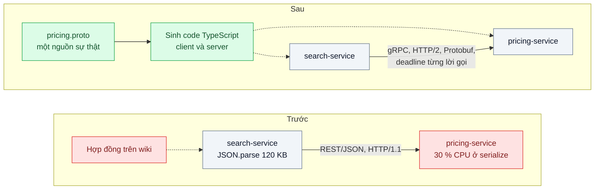
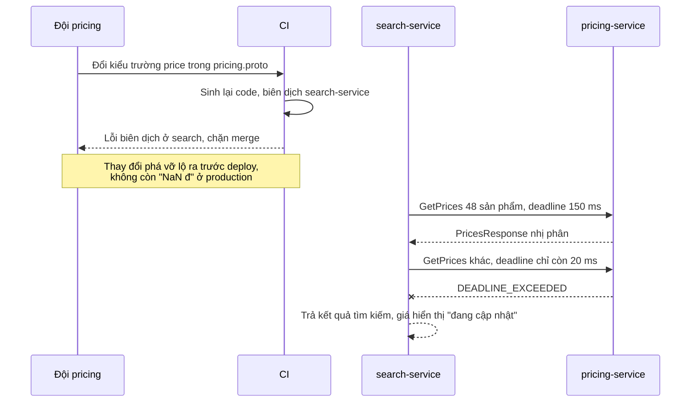

# REST/JSON vs gRPC/Protobuf — Serialize JSON chiếm 30% CPU, contract giữa service không rõ

| Scope | Mức độ | Trạng thái | Pattern gốc | Cập nhật |
|---|---|---|---|---|
| 13 · backend / transporter | 🟢 Cơ bản | 📋 Kế hoạch | gRPC + Protocol Buffers (schema-based encoding) — gRPC docs, protobuf.dev; Kleppmann, *DDIA* ch.4 (2017) | 2026-10-06 |

> **Một câu tóm tắt:** Đo xem bao nhiêu CPU thật sự nằm ở JSON rồi so ba phương án trên payload thật — JSON tối ưu theo schema, REST kèm hợp đồng OpenAPI, và gRPC với hợp đồng `.proto` sinh code — để chọn giao thức cho kênh nội bộ dựa trên số đo và độ rõ của hợp đồng, không dựa trên benchmark của người khác.

## 1. Bài toán thực tế (What)

**Bối cảnh** *(doanh nghiệp giả định, số liệu minh họa)*
Sàn thương mại điện tử: mỗi trang kết quả tìm kiếm, `search-service` gọi `pricing-service` lấy giá, khuyến mãi và tồn kho cho 48–200 sản phẩm. Giờ cao điểm có khoảng 2.000 lời gọi nội bộ mỗi giây, mỗi phản hồi JSON khoảng 120 KB. Hai đội khác nhau sở hữu hai service; hợp đồng giữa họ là một trang wiki.

**Triệu chứng người kinh doanh nhìn thấy**
- Cuối năm phải nhân đôi số máy cho `pricing-service` dù logic tính giá không đổi; hóa đơn cloud tăng theo.
- Hai lần trong quý, đội pricing đổi `price` từ số sang chuỗi; trang tìm kiếm hiện "NaN đ" vài giờ trước khi có người phát hiện.
- Trường `discount` lúc là phần trăm, lúc là số tiền tùy endpoint; tài liệu wiki đã lỗi thời.

**Nguyên nhân kỹ thuật**
JSON là văn bản tự mô tả: tên trường lặp lại cho mọi phần tử, số được chuyển qua dạng chuỗi, chi phí `JSON.stringify` và `JSON.parse` tăng theo kích thước payload. Flame graph sơ bộ cho thấy khoảng 30 % CPU của `pricing-service` nằm ở serialize. Không có schema máy đọc được, nên kiểu dữ liệu chỉ được kiểm (nếu có) lúc chạy và thay đổi phá vỡ chỉ lộ ra ở production.

**Ràng buộc**
- API cho trình duyệt và đối tác vẫn là REST/JSON (scope 01); chỉ xét kênh nội bộ service với service.
- Đội quen TypeScript, chưa dùng gRPC; quyết định phải dựa trên số đo với payload thật.
- Hạ tầng hiện có load balancer L4 nội bộ giữa hai service.

## 2. Vì sao dùng pattern này (Why)

**Nguyên nhân gốc mà pattern nhắm vào:** chi phí mã hóa dạng văn bản trên payload lớn, cộng với việc hai đội không có hợp đồng có kiểu được kiểm tự động.

**Pattern giải quyết thế nào:** gRPC là framework RPC chạy trên HTTP/2, dùng Protocol Buffers làm ngôn ngữ mô tả và định dạng nhị phân: file `.proto` khai báo service và message, công cụ sinh code tạo client và server có kiểu cho từng ngôn ngữ. Protobuf mã hóa mỗi trường bằng *số thứ tự trường* thay vì tên, số nguyên dùng varint, nên payload thường nhỏ hơn JSON. Kleppmann (DDIA ch.4) so sánh encoding dựa trên schema (Protobuf, Thrift, Avro) với JSON: gọn hơn, schema là tài liệu luôn đúng, và tương thích có thể kiểm trước khi deploy. HTTP/2 cho nhiều lời gọi song song trên một kết nối; gRPC truyền *deadline* theo từng lời gọi. Điểm phải trung thực: trong Node.js, `JSON.parse` là code native đã được V8 tối ưu mạnh, còn giải mã Protobuf thường chạy bằng JavaScript — lợi ích CPU *không được giả định*, bài này đo cả ba phương án trước khi kết luận. Lợi ích hợp đồng thì chắc chắn hơn: đổi kiểu một trường thành lỗi biên dịch ở phía gọi.

**Lựa chọn khác đã cân nhắc**

| Lựa chọn | Giải quyết được gì | Vì sao không chọn (ở bài này) |
|---|---|---|
| Giữ nguyên + tối ưu nhỏ: serialize theo schema (`fast-json-stringify`), bỏ trường thừa | Giảm CPU phía gửi, giảm payload | Không có hợp đồng sinh code; parse phía nhận vẫn tốn; là biến thể đo cùng, có thể thắng |
| REST/JSON + OpenAPI + sinh client | Hợp đồng rõ, giữ JSON quen thuộc | Giải quyết hợp đồng, không giải quyết CPU; là phương án dự phòng nếu Protobuf không nhanh hơn |
| MessagePack hoặc CBOR | Nhị phân, không cần schema | Không có hợp đồng; vẫn lặp tên trường |
| gRPC + Protobuf cho kênh search → pricing (chọn để đo và so sánh) | Hợp đồng có kiểu, payload nhỏ, deadline, streaming | Nhị phân khó gỡ lỗi; cần HTTP/2 xuyên suốt; L4 load balancer không chia theo request |

## 3. Thiết kế hệ thống (How)

### 3.1 Kiến trúc trước và sau



### 3.2 Luồng chính



### 3.3 Thành phần và trách nhiệm

| Thành phần | Trách nhiệm | Quyết định thiết kế đáng chú ý |
|---|---|---|
| `pricing.proto` | Hợp đồng duy nhất giữa hai đội | Tiền dùng `int64` đơn vị nhỏ nhất; trường có thể vắng dùng `optional` |
| Sinh code | Tạo type và stub TypeScript | Chạy trong CI; code sinh ra không sửa tay |
| gRPC server ở pricing | Phục vụ `GetPrices` | Bật server reflection ở môi trường dev để gỡ lỗi bằng `grpcurl` |
| gRPC client ở search | Gọi với deadline, keepalive | Deadline lấy từ ngân sách thời gian còn lại của request tìm kiếm |
| Bộ đo | Micro-benchmark mã hóa/giải mã và đo end-to-end cùng payload thật | Ba biến thể: JSON thường, JSON theo schema, Protobuf |
| Flame graph | Xác định tỷ lệ CPU ở serialize trước và sau | Lấy mẫu ở cùng mức tải, cùng giới hạn CPU container |

### 3.4 Điểm dễ sai khi triển khai
- **Tin benchmark trên mạng.** Kết quả phụ thuộc hình dạng payload và thư viện; đo trên payload thật, tách micro-benchmark khỏi end-to-end.
- **So sánh không công bằng.** REST HTTP/1.1 không keep-alive so với gRPC HTTP/2 là so kết nối chứ không so định dạng; bật keep-alive và cùng mức nén.
- **L4 load balancer với HTTP/2.** Kết nối lâu dài khiến mọi lời gọi dính một backend; cần cân bằng phía client hoặc proxy L7 (xem bài 07).
- **`int64` trong JavaScript.** Không vừa kiểu `number`; chọn tùy chọn sinh code (chuỗi hoặc `bigint`) có chủ đích, nhất là với tiền.
- **Không đặt deadline.** Nhiều client gRPC mặc định không có deadline; lời gọi treo theo phía chậm nhất.
- **Giá trị mặc định của proto3.** Không phân biệt "giá 0" với "không gửi giá" nếu không dùng `optional`.

## 4. Tech stack và tác động (Impact techstack)

| Lớp | Công nghệ chọn | Vì sao chọn | Thay thế tương đương |
|---|---|---|---|
| Ngôn ngữ | TypeScript strict, Node 20+ | Trùng stack repo; đo đúng môi trường đang chạy | Go cho pricing nếu số đo cho thấy Node là nút thắt |
| Baseline REST | Fastify, biến thể có `fast-json-stringify` theo JSON Schema | Đường "trước" công bằng và một phương án tối ưu nhỏ | NestJS |
| RPC | `@grpc/grpc-js` | Thư viện gRPC chính thức viết thuần JS cho Node | Connect-ES (cần xác minh độ ổn định) |
| Sinh code | Buf CLI + `ts-proto` (tùy chọn kiểu `int64` cần xác minh) | Type TypeScript strict, `buf lint` cho quy ước đặt tên | `@bufbuild/protobuf`, `protobufjs` |
| Đo CPU | `node --cpu-prof`, xem bằng Chrome DevTools | Flame graph không cần công cụ ngoài | `0x`, clinic flame |
| Đo tải | k6 (HTTP và module `k6/net/grpc`) | Một công cụ, cùng kịch bản cho hai giao thức | ghz |
| Hạ tầng | Docker Compose, mỗi container giới hạn 1 CPU | So sánh request/giây trên mỗi core công bằng | — |

**Thay đổi so với hệ thống hiện tại:** thêm thư mục `proto/` dùng chung và bước sinh code trong CI; hai service chạy song song REST và gRPC trong giai đoạn chuyển đổi; đội vận hành cần `grpcurl` và hiểu mã trạng thái gRPC thay cho HTTP status khi gỡ lỗi.

## 5. Kết quả đầu ra và cách đo (Output impact)

| Chỉ số | Trước (minh họa) | Mục tiêu khi thực hành | Cách đo |
|---|---|---|---|
| Tỷ lệ CPU của pricing ở serialize/deserialize | ≈ 30 % | Ghi số thật cho cả ba biến thể; chọn biến thể ≤ 15 % | Flame graph `--cpu-prof` ở 1.000 lời gọi/giây |
| Lời gọi/giây tối đa mỗi core với p99 ≤ 100 ms | 900 | So sánh ba biến thể, ghi số thật | k6 tăng tải dần, container 1 CPU |
| Kích thước phản hồi 48 sản phẩm | 120 KB | Ghi số thật từng định dạng, có và không gzip | Script đo kích thước body |
| p99 lời gọi search → pricing | 85 ms | ≤ 60 ms | Histogram k6 |
| Thay đổi phá vỡ bị chặn trước deploy | 0/2 trong quý | 100 % | Test: đổi kiểu một trường trong `.proto`, CI phải đỏ |

> Số "trước" là minh họa để hình dung bài toán. Số "mục tiêu" chỉ được coi là đạt khi có số đo thật
> ở mục 8 kèm môi trường đo.

**Tác động nghiệp vụ mong đợi:** quyết định mua thêm máy hay đổi giao thức dựa trên số đo của chính hệ thống; sự cố hiển thị giá sai do lệch hợp đồng bị chặn ở CI thay vì để khách nhìn thấy.

## 6. Đánh đổi và khi KHÔNG nên dùng

**Đánh đổi**
- Payload nhị phân không đọc được bằng mắt; cần công cụ riêng để gỡ lỗi và ghi log.
- HTTP/2 làm cân bằng tải phức tạp hơn; trình duyệt không gọi gRPC trực tiếp mà phải qua gRPC-Web hoặc Connect.
- Hai giao thức cùng tồn tại (REST công khai, gRPC nội bộ) và thêm bước sinh code trong build.

**Không nên dùng khi**
- API cho trình duyệt, đối tác bên ngoài hoặc cần cache HTTP chuẩn (CDN, ETag).
- Payload nhỏ và tần suất thấp: CPU serialize không đáng kể — flame graph sẽ nói điều đó.
- Hai "service" thực chất cùng một codebase và cùng deploy: chia sẻ type trong monorepo đơn giản hơn.

**Liên quan**
- Đọc sau: `../02-schema-evolution-them-field-lam-sap-consumer-cu/` — tiến hóa hợp đồng `.proto` an toàn.
- Hợp đồng phía client: `../../01-frontend-backend-transporter/01-contract-first-openapi-frontend-goi-sai-ten-truong/`.
- Cân bằng tải cho HTTP/2: `../07-service-mesh-mtls-retry-tracing-khong-sua-code/`; đo đúng cách: `../../23-backend-monitoring-benchmark/07-load-testing-k6-coordinated-omission-benchmark-tu-danh-lua/`, `../../23-backend-monitoring-benchmark/08-continuous-profiling-cpu-80-phan-tram-khong-biet-ham-nao/`.

## 7. Cơ sở tham khảo

- gRPC docs — https://grpc.io/docs/ — khái niệm cốt lõi, deadline, cân bằng tải với HTTP/2.
- Protocol Buffers docs — https://protobuf.dev/ — ngôn ngữ proto3, cách mã hóa (số thứ tự trường, varint), trường `optional`.
- Martin Kleppmann, *Designing Data-Intensive Applications*, O'Reilly, 2017, ch.4 "Encoding and Evolution" — so sánh JSON với encoding dựa trên schema về kích thước và khả năng tiến hóa.
- Fastify docs, "Validation and Serialization" — https://fastify.dev/docs/latest/Reference/Validation-and-Serialization/ — serialize theo schema cho biến thể JSON tối ưu.
- k6 docs — https://grafana.com/docs/k6/ — module `k6/net/grpc` để đo hai giao thức bằng cùng công cụ.
- Node.js docs — https://nodejs.org/docs/ — cờ `--cpu-prof` để lấy CPU profile.

## 8. Kế hoạch thực hành

- [ ] Bước 1: dựng `pricing-service` và `search-service` REST/JSON với payload thật (48 và 200 sản phẩm), Docker Compose giới hạn 1 CPU mỗi container.
- [ ] Bước 2: đo "trước": flame graph ở 1.000 lời gọi/giây, k6 tăng tải tìm điểm p99 vượt 100 ms, ghi kích thước payload.
- [ ] Bước 3: thêm biến thể `fast-json-stringify`, rồi viết `pricing.proto`, sinh code, server và client gRPC có deadline.
- [ ] Bước 4: đo cả ba biến thể cùng kịch bản, ghi số thật và môi trường vào mục 5; viết một đoạn kết luận chọn biến thể nào và vì sao.
- [ ] Bước 5: test: (a) đổi kiểu trường trong `.proto` làm biên dịch search thất bại; (b) deadline hết hạn trả `DEADLINE_EXCEEDED` và search vẫn trả kết quả; (c) ba biến thể trả dữ liệu tương đương cho cùng đầu vào.

**Cấu trúc code dự kiến**
```text
proto/pricing/v1/pricing.proto      # [PATTERN] hợp đồng duy nhất
src/
  pricing/rest-server.ts            # baseline JSON và biến thể fast-json-stringify
  pricing/grpc-server.ts
  search/pricing-client.ts          # client gRPC có deadline
  shared/generated/                 # code sinh ra, không sửa tay
test/
  breaking-type-change-fails-build.test.ts
  deadline-exceeded-degrades-gracefully.test.ts
  variants-return-equivalent-data.test.ts
bench/
  serialize.micro.ts                # micro-benchmark mã hóa/giải mã
  rest-vs-grpc.k6.js
docker-compose.yml
```

**Cách chạy** *(điền khi bắt đầu code)*
```bash
docker compose up -d
pnpm install && pnpm test
```
