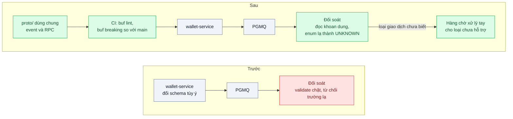
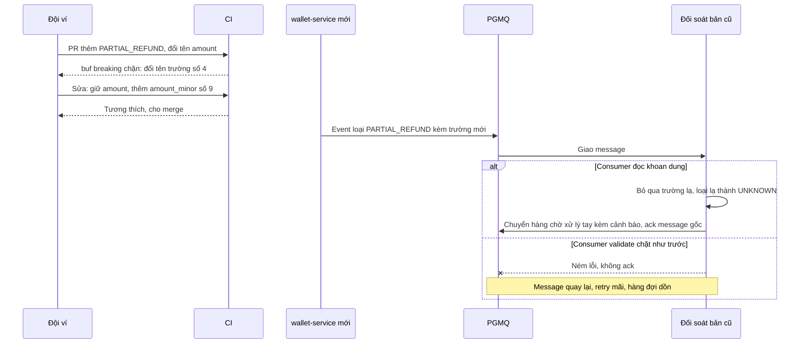

# Schema Evolution & Backward Compatibility — Thêm một field làm consumer cũ sập

| Scope | Mức độ | Trạng thái | Pattern gốc | Cập nhật |
|---|---|---|---|---|
| 13 · backend / transporter | 🟡 Trung bình | 📋 Kế hoạch | Schema Evolution (backward/forward compatibility) — Kleppmann, *DDIA* ch.4 (2017); Protobuf "Updating A Message Type"; Avro schema resolution | 2026-10-06 |

> **Một câu tóm tắt:** Đặt quy tắc tiến hóa schema (chỉ thêm, không đổi nghĩa; đổi lớn theo expand–contract), kiểm tương thích tự động trong CI so với schema đang chạy, và viết consumer đọc khoan dung với trường và giá trị enum chưa biết — để mỗi đội deploy độc lập mà không làm sập bên kia.

## 1. Bài toán thực tế (What)

**Bối cảnh** *(doanh nghiệp giả định, số liệu minh họa)*
Ví điện tử: `wallet-service` phát event `TransactionCompleted` qua PGMQ cho 4 consumer (đối soát, thông báo, tích điểm, chống gian lận) và cung cấp RPC `GetTransaction` cho 3 service khác. 6 đội, mỗi đội deploy độc lập 2–3 lần/tuần; khoảng 1,2 triệu giao dịch/ngày. Message lỗi được giữ trong DLQ tối đa 7 ngày để phát lại.

**Triệu chứng người kinh doanh nhìn thấy**
- Đội ví thêm loại giao dịch `PARTIAL_REFUND` và trường `fee_breakdown`; service đối soát từ chối mọi message mới, hàng đợi dồn 80.000 message, báo cáo đối soát cuối ngày trễ 6 giờ.
- Một bản deploy đổi tên `amount` thành `amount_minor`: service tích điểm cộng 0 điểm cho cả buổi sáng, khách khiếu nại.
- Mỗi thay đổi schema phải họp 6 đội và deploy "đồng loạt" lúc nửa đêm — mất đúng lợi ích deploy độc lập.

**Nguyên nhân kỹ thuật**
Producer và consumer deploy ở những thời điểm khác nhau, nên luôn có khoảng thời gian code mới đọc dữ liệu cũ và code cũ đọc dữ liệu mới. Không có quy tắc tương thích được kiểm tự động: consumer validate chặt (từ chối trường lạ, enum lạ), producer đổi tên hoặc xóa trường tùy ý, và event cũ trong DLQ vẫn mang hình dạng cũ khi được phát lại.

**Ràng buộc**
- Mỗi đội deploy độc lập; không có "cửa sổ deploy chung".
- Message tài chính không được mất; message có thể được phát lại sau tối đa 7 ngày.
- Quy tắc áp dụng cho cả RPC lẫn event trong hàng đợi.

## 2. Vì sao dùng pattern này (Why)

**Nguyên nhân gốc mà pattern nhắm vào:** thiếu một hợp đồng về *cách thay đổi* hợp đồng — được đổi gì, theo thứ tự nào, và ai kiểm.

**Pattern giải quyết thế nào:** Kleppmann phân biệt *backward compatibility* (code mới đọc được dữ liệu do code cũ ghi) và *forward compatibility* (code cũ đọc được dữ liệu do code mới ghi); deploy cuốn chiếu cần cả hai. Tài liệu Protobuf "Updating A Message Type" đưa quy tắc cụ thể: không đổi số thứ tự trường, không dùng lại số đã xóa (khai báo `reserved`), thêm trường thì code cũ bỏ qua; enum cần giá trị `0` kiểu `UNSPECIFIED` và phía đọc phải xử lý giá trị chưa biết. Avro giải quyết bằng *schema resolution*: đối chiếu writer schema với reader schema, trường mới phải có giá trị mặc định. Ba cơ chế quy về một kỷ luật: (1) chỉ thêm, không đổi nghĩa trường cũ; (2) đổi lớn theo expand–contract (Parallel Change): thêm trường mới, ghi cả hai, chuyển consumer, rồi mới ngừng ghi trường cũ; (3) consumer đọc khoan dung: bỏ qua trường lạ, ánh xạ enum lạ về `UNKNOWN` và xử lý có chủ đích; (4) CI so schema mới với schema trên nhánh chính và chặn thay đổi phá vỡ.

**Lựa chọn khác đã cân nhắc**

| Lựa chọn | Giải quyết được gì | Vì sao không chọn (ở bài này) |
|---|---|---|
| Giữ nguyên + tối ưu nhỏ (họp đồng bộ, deploy cùng lúc) | Không cần công cụ | Không mở rộng được với 6 đội; event cũ trong DLQ vẫn gãy khi phát lại |
| Version trong tên hàng đợi hoặc endpoint (v1, v2 song song) cho mọi thay đổi | Cách ly hoàn toàn | Nhân đôi producer, consumer phải di chuyển; chỉ đáng cho thay đổi phá vỡ thật sự |
| Schema registry gắn với Kafka, có chế độ tương thích | Kiểm tự động lúc publish | Repo dùng PGMQ; kiểm ở CI cho cùng hiệu quả mà không thêm hạ tầng |
| Quy tắc tiến hóa + kiểm CI + consumer khoan dung + expand–contract (chọn) | Deploy độc lập, phát hiện phá vỡ trước merge | Cần kỷ luật review; schema dài dần vì trường cũ không xóa ngay được |

## 3. Thiết kế hệ thống (How)

### 3.1 Kiến trúc trước và sau



### 3.2 Luồng chính



### 3.3 Thành phần và trách nhiệm

| Thành phần | Trách nhiệm | Quyết định thiết kế đáng chú ý |
|---|---|---|
| Thư mục `proto/` dùng chung | Một nguồn schema cho RPC và payload event | Event lưu trong PGMQ dạng JSON theo ánh xạ JSON chuẩn của Protobuf |
| `buf breaking` trong CI | So schema mới với nhánh chính, chặn thay đổi phá vỡ | Lỗi CI kèm hướng dẫn expand–contract |
| Quy ước `reserved` | Giữ số và tên trường đã xóa không bị dùng lại | Review bắt buộc khi xóa trường |
| Lớp đọc ở consumer | Bỏ qua trường lạ, ánh xạ enum lạ về `UNKNOWN` | Loại chưa biết có chính sách riêng: đối soát chuyển hàng chờ xử lý tay, thông báo thì bỏ qua |
| Phong bì event | `event_type`, `event_id`, `occurred_at` ổn định qua mọi phiên bản | Phong bì không bao giờ đổi; chỉ phần thân tiến hóa |
| Contract test | Chạy bộ fixture event cũ và mới qua consumer cũ và mới | Ma trận 2×2 chứng minh cả backward và forward |

### 3.4 Điểm dễ sai khi triển khai
- **Validate chặt ở consumer** (`.strict()`, `additionalProperties: false`) biến thay đổi tương thích thành sự cố.
- **`switch` enum ném lỗi ở nhánh mặc định.** Giá trị mới là chuyện bình thường; xử lý có chủ đích và đo, đừng ném.
- **Dùng lại số trường đã xóa.** Dữ liệu cũ bị đọc sai nghĩa âm thầm — nguy hiểm hơn cả sập.
- **Đổi nghĩa mà giữ tên và kiểu** (`amount` từ đồng sang xu): công cụ không bắt được; nghĩa mới phải là trường mới.
- **Sai thứ tự deploy.** Thêm trường mà consumer cần: deploy producer ghi trường trước, consumer dùng sau. Xóa trường: consumer ngừng đọc trước, producer ngừng ghi sau.
- **Quên dữ liệu đang nằm chờ.** Event 7 ngày tuổi trong DLQ vẫn mang schema cũ; consumer mới phải đọc được trong suốt cửa sổ lưu giữ.

## 4. Tech stack và tác động (Impact techstack)

| Lớp | Công nghệ chọn | Vì sao chọn | Thay thế tương đương |
|---|---|---|---|
| Schema | Protocol Buffers (proto3) cho cả RPC và payload event | Một ngôn ngữ schema; quy tắc tiến hóa được ghi rõ trong tài liệu chính thức | Avro + schema registry; JSON Schema |
| Kiểm tương thích | Buf CLI: `buf lint`, `buf breaking --against` nhánh main | Phát hiện đổi số, đổi kiểu, xóa trường trước khi merge | Script so sánh descriptor tự viết |
| Sinh code và đọc | `@bufbuild/protobuf`, tùy chọn bỏ qua trường lạ khi đọc JSON (tên tùy chọn cần xác minh) | Type TypeScript strict, hỗ trợ ánh xạ JSON | `ts-proto` |
| Phiên bản "trước" | Zod `.strict()` + `z.enum` | Tái hiện consumer validate chặt | Ajv với `additionalProperties: false` |
| Truyền tải | PGMQ cho event, `@grpc/grpc-js` cho RPC | Stack mặc định; message nằm nhiều ngày để test phát lại | Kafka, NATS JetStream |
| Test | Vitest contract test với fixture cũ và mới | Chứng minh cả hai chiều tương thích | Pact (message contract) |
| Hạ tầng | Docker Compose, GitHub Actions | CI chạy `buf breaking` trên mỗi PR | — |

**Thay đổi so với hệ thống hiện tại:** schema chuyển từ wiki sang thư mục `proto/` có review; CI thêm bước kiểm tương thích; consumer thay lớp validate chặt bằng lớp đọc khoan dung có metric; mỗi đội phải theo checklist expand–contract khi đổi trường. Người review học đọc lỗi của `buf breaking`.

## 5. Kết quả đầu ra và cách đo (Output impact)

| Chỉ số | Trước (minh họa) | Mục tiêu khi thực hành | Cách đo |
|---|---|---|---|
| Thay đổi phá vỡ lọt tới môi trường chạy | 2 mỗi quý | 0 | Test: PR đổi tên hoặc đổi kiểu trường phải làm CI đỏ |
| Message vào DLQ vì lỗi đọc schema sau khi producer deploy | 80.000 | 0 | Đếm message trong DLQ theo loại lỗi `schema` |
| Ma trận tương thích fixture cũ/mới × consumer cũ/mới | không kiểm | 4/4 ô xanh | Vitest contract test |
| Event 7 ngày tuổi phát lại thành công với consumer mới | không biết | 100 % | Test phát lại từ archive của PGMQ |
| Số đội phải deploy đồng thời cho một thay đổi | 6 | 1 | Kịch bản thực hành: thêm trường, deploy từng service riêng |

> Số "trước" là minh họa để hình dung bài toán. Số "mục tiêu" chỉ được coi là đạt khi có số đo thật
> ở mục 8 kèm môi trường đo.

**Tác động nghiệp vụ mong đợi:** thêm loại giao dịch mới không còn làm trễ báo cáo đối soát hay sai điểm thưởng của khách; các đội ra tính năng theo nhịp riêng, không chờ cửa sổ deploy chung.

## 6. Đánh đổi và khi KHÔNG nên dùng

**Đánh đổi**
- Schema phình dần vì trường cũ phải giữ qua nhiều phiên bản; cần lịch dọn có chủ đích.
- Consumer khoan dung có thể nuốt lỗi thật nếu không có metric và cảnh báo cho dữ liệu lạ.
- Thêm bước CI và kỷ luật review; expand–contract biến một thay đổi thành ba lần deploy.

**Không nên dùng khi**
- Producer và consumer luôn deploy cùng nhau (cùng repo, cùng binary): type dùng chung là đủ.
- Dữ liệu tạm, không lưu trữ, chỉ một consumer do cùng đội viết.
- Giai đoạn prototype khi schema đổi mỗi ngày và chưa có người dùng thật.

**Liên quan**
- Đọc trước: `../01-rest-vs-grpc-json-serialize-chiem-30-phan-tram-cpu/`.
- Cùng tư duy ở tầng database và API công khai: `../../02-backend-database/08-expand-contract-doi-ten-cot-100-trieu-dong/`, `../../01-frontend-backend-transporter/07-api-versioning-app-cu-van-phai-chay/`.
- Message không đọc được đi đâu: `../../14-backend-queueing/05-dead-letter-queue-mot-message-loi-chan-ca-hang-doi/`; hợp đồng event giữa context: `../../07-backend-microservices/01-decomposition-bounded-context-tach-service-theo-nghiep-vu/`.

## 7. Cơ sở tham khảo

- Protocol Buffers docs, "Updating A Message Type" — https://protobuf.dev/programming-guides/proto3/#updating — quy tắc thêm, xóa, đổi trường; `reserved`; xử lý enum chưa biết.
- Apache Avro, Specification — mục "Schema Resolution" — https://avro.apache.org/docs/ — đối chiếu writer/reader schema, vai trò giá trị mặc định.
- Martin Kleppmann, *Designing Data-Intensive Applications*, O'Reilly, 2017, ch.4 "Encoding and Evolution" — định nghĩa backward/forward compatibility và dataflow qua database, service, message.
- Danilo Sato, "ParallelChange", Martin Fowler bliki, 2014 — https://martinfowler.com/bliki/ParallelChange.html — mô hình expand–migrate–contract.
- Buf docs, phát hiện thay đổi phá vỡ — https://buf.build/docs/breaking/ (cần xác minh URL) — công cụ `buf breaking` dùng ở mục 4.

## 8. Kế hoạch thực hành

- [ ] Bước 1: dựng `wallet-service` phát event qua PGMQ và 2 consumer (đối soát, tích điểm) phiên bản "trước" dùng Zod `.strict()`.
- [ ] Bước 2: đo "trước": deploy producer thêm enum và trường mới; đếm message vào DLQ, thời gian hàng đợi dồn.
- [ ] Bước 3: chuyển schema sang `proto/`, thêm `buf lint` và `buf breaking` vào CI, viết lớp đọc khoan dung và hàng chờ xử lý tay cho loại chưa biết.
- [ ] Bước 4: chạy lại kịch bản, thực hành đổi tên `amount` theo expand–contract qua ba lần deploy riêng; ghi số thật vào mục 5.
- [ ] Bước 5: test: (a) PR đổi tên trường làm CI đỏ; (b) consumer cũ nhận event mới không lỗi, loại lạ vào hàng chờ xử lý tay; (c) consumer mới đọc event cũ 7 ngày tuổi; (d) dùng lại số trường đã `reserved` bị `buf` chặn.

**Cấu trúc code dự kiến**
```text
proto/wallet/v1/transaction_events.proto   # [PATTERN] schema có reserved, enum UNSPECIFIED
buf.yaml
src/
  wallet/publisher.ts
  reconciliation/consumer.ts               # [PATTERN] đọc khoan dung, chính sách UNKNOWN
  loyalty/consumer.ts
  legacy/strict-consumer.ts                # phiên bản "trước" với Zod .strict()
test/
  compatibility-matrix.test.ts
  unknown-enum-goes-to-manual-queue.test.ts
  replay-old-events.test.ts
.github/workflows/buf-breaking.yml
docker-compose.yml
```

**Cách chạy** *(điền khi bắt đầu code)*
```bash
docker compose up -d
pnpm install && pnpm test        # CI chạy thêm: buf breaking --against '.git#branch=main'
```
