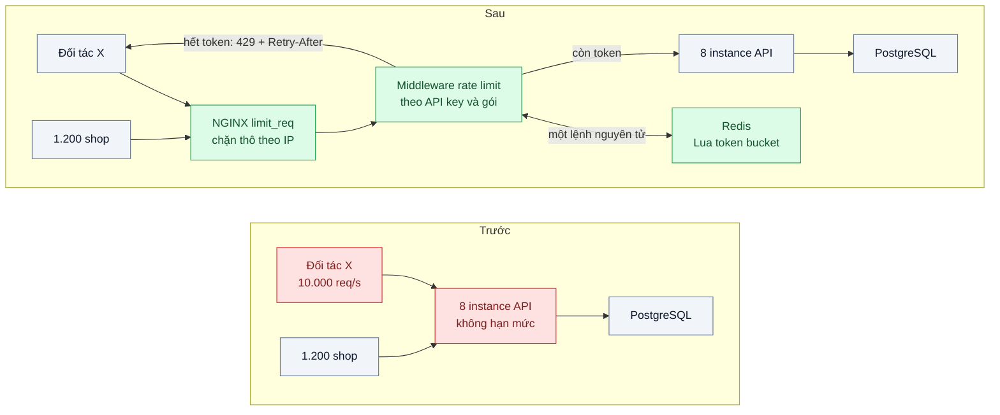
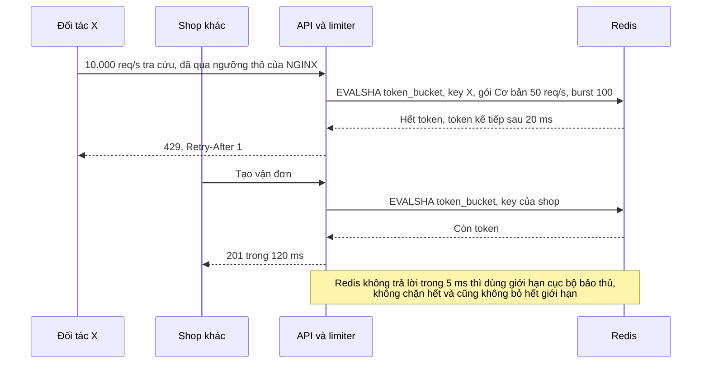

# Rate Limiting & Throttling — Một khách hàng API gọi 10k req/s làm chậm tất cả khách khác

| Scope | Mức độ | Trạng thái | Pattern gốc | Cập nhật |
|---|---|---|---|---|
| 13 · backend / transporter | 🟡 Trung bình | 📋 Kế hoạch | Rate Limiting & Throttling — Stripe, "Scaling your API with rate limiters" (2017); Azure "Rate Limiting", "Throttling" | 2026-10-06 |

> **Một câu tóm tắt:** Giới hạn tốc độ theo danh tính khách (API key) bằng token bucket dùng chung trên Redis, thêm một lớp chặn thô theo IP ở NGINX, và trả `429` kèm `Retry-After` — để một khách lỗi vòng lặp chỉ bị từ chối phần vượt hạn mức, các khách khác vẫn được phục vụ bình thường.

## 1. Bài toán thực tế (What)

**Bối cảnh** *(doanh nghiệp giả định, số liệu minh họa)*
Nền tảng logistics mở API công khai cho 1.200 shop và sàn đối tác: tạo vận đơn, tra cứu hành trình, tính cước. Bình thường tổng lưu lượng khoảng 1.500 request/giây, API chạy 8 instance sau NGINX, dùng chung một PostgreSQL. Khách có hai gói "Cơ bản" và "Doanh nghiệp".

**Triệu chứng người kinh doanh nhìn thấy**
- Một đối tác lỗi vòng lặp gọi tra cứu hành trình 10.000 request/giây suốt 40 phút; mọi shop khác tạo vận đơn chậm 8 giây, nhiều đơn bị hủy vì không gọi được shipper.
- Không ai biết ai đang gọi nhiều cho tới khi kỹ sư ngồi grep log.
- Chặn tay IP của đối tác thì chặn nhầm cả một shop khác dùng chung đường NAT văn phòng.
- Gói "Doanh nghiệp" và "Cơ bản" có cùng quyền gọi; đội kinh doanh không có cơ sở để bán gói cao hơn.

**Nguyên nhân kỹ thuật**
API không có hạn mức theo khách: mọi request cùng tranh CPU và pool kết nối database, nên khách gọi nhiều nhất quyết định độ trễ của tất cả. Không có tín hiệu "chậm lại" (`429`, `Retry-After`) để client có kỷ luật tự giảm tốc, và không có số đo theo API key để phát hiện sớm.

**Ràng buộc**
- Giới hạn theo API key đã xác thực, không theo IP; 8 instance phải dùng chung bộ đếm.
- Độ trễ thêm do limiter p99 ≤ 2 ms (minh họa); Redis hỏng không được kéo sập API.
- Hạn mức theo gói đổi được mà không cần deploy.

## 2. Vì sao dùng pattern này (Why)

**Nguyên nhân gốc mà pattern nhắm vào:** tài nguyên dùng chung không có hạn mức theo khách, và client không nhận được tín hiệu giảm tốc rõ ràng.

**Pattern giải quyết thế nào:** Stripe (2017) mô tả bốn lớp bảo vệ: request rate limiter (token bucket cho mỗi người dùng), concurrent requests limiter, fleet usage load shedder và worker utilization load shedder, dùng Redis làm nơi đếm. Azure tách hai góc nhìn: *Throttling* là phía cung cấp kiểm soát lượng tài nguyên mỗi tenant được dùng và từ chối khi vượt; *Rate Limiting* là phía gọi tự giới hạn tốc độ để không bị dịch vụ đích từ chối. Thuật toán thường gặp: fixed window (đơn giản nhưng dồn burst ở biên cửa sổ), sliding window counter (Cloudflare 2017 xấp xỉ bằng hai cửa sổ có trọng số), leaky bucket (NGINX `limit_req`, làm mượt lưu lượng) và token bucket (cho phép burst ngắn, giữ tốc độ trung bình). Bài chọn hai lớp: NGINX `limit_req` theo IP ở biên để chặn dội thô trước khi tới Node; trong ứng dụng, token bucket theo API key, hạn mức theo gói, chạy bằng một Lua script nguyên tử trên Redis; vượt hạn mức thì trả `429 Too Many Requests` kèm `Retry-After`.

**Lựa chọn khác đã cân nhắc**

| Lựa chọn | Giải quyết được gì | Vì sao không chọn (ở bài này) |
|---|---|---|
| Giữ nguyên + tối ưu nhỏ (chặn IP tay khi có sự cố, thêm máy) | Dập được sự cố | Phản ứng sau khi khách khác đã chịu; IP không phải danh tính; thêm máy là trả tiền cho lỗi của client |
| Chỉ NGINX `limit_req` theo IP | Có sẵn, rẻ | NAT chung và đối tác nhiều IP làm sai; không biết gói của khách; mỗi instance NGINX đếm riêng |
| Bộ đếm trong bộ nhớ từng instance | Không cần Redis | 8 instance thì giới hạn thật nhân 8 và lệch theo load balancer |
| API gateway có plugin rate limit | Có sẵn, nhiều tính năng | Thêm thành phần lớn chỉ cho một tính năng; để dành khi có thêm nhu cầu gateway |
| Token bucket theo API key trên Redis + `limit_req` ở biên (chọn) | Đúng danh tính, dùng chung cho mọi instance, cho phép burst | Thêm Redis vào đường nóng; mỗi request thêm một round-trip |

## 3. Thiết kế hệ thống (How)

### 3.1 Kiến trúc trước và sau



### 3.2 Luồng chính



### 3.3 Thành phần và trách nhiệm

| Thành phần | Trách nhiệm | Quyết định thiết kế đáng chú ý |
|---|---|---|
| NGINX `limit_req` | Chặn dội thô theo IP trước khi tới ứng dụng | Ngưỡng cao (ví dụ 2.000 req/s mỗi IP), chỉ để bảo vệ hạ tầng |
| Middleware rate limit | Lấy API key đã xác thực, gọi script, gắn header phản hồi | Đặt sau xác thực, trước mọi truy cập database |
| Lua script token bucket | Đọc số token và thời điểm cập nhật, nạp lại theo thời gian trôi, trừ token, đặt TTL | Một lệnh nguyên tử; dùng một nguồn thời gian thống nhất cho mọi instance |
| Bảng hạn mức theo gói | Tốc độ và burst cho mỗi gói, ngoại lệ theo khách | Lưu PostgreSQL, cache trong tiến trình 60 giây |
| Fallback cục bộ | Giới hạn bảo thủ trong bộ nhớ khi Redis lỗi | Quyết định fail-open có giới hạn được ghi rõ |
| Metrics theo key | Đếm cho phép và từ chối theo key, theo gói | Cảnh báo khi một key bị từ chối liên tục — thường là client lỗi |

### 3.4 Điểm dễ sai khi triển khai
- **GET rồi SET bằng hai lệnh.** 8 instance cùng đọc một giá trị cũ, giới hạn bị vượt; phải là một script nguyên tử.
- **Đếm theo IP thay vì danh tính.** Phạt nhầm người dùng chung NAT, bỏ lọt đối tác dùng nhiều IP.
- **Fail-closed khi Redis lỗi.** Limiter thành điểm sập toàn API; fail-open không giới hạn thì mất bảo vệ đúng lúc cần.
- **Không trả `Retry-After`.** Client retry ngay lập tức, tạo bão retry (bài 04 scope 07).
- **Tưởng rate limit thay được giới hạn đồng thời.** Request nặng ít mà lâu vẫn cạn tài nguyên; đó là việc của bulkhead.
- **Key Redis không có TTL.** Bộ nhớ tăng theo số key từng xuất hiện.

## 4. Tech stack và tác động (Impact techstack)

| Lớp | Công nghệ chọn | Vì sao chọn | Thay thế tương đương |
|---|---|---|---|
| Biên | NGINX `limit_req` theo `$binary_remote_addr` | Chặn dội thô trước khi tới Node, có `burst` | HAProxy stick tables, Envoy local rate limit |
| Ứng dụng | TypeScript strict, Fastify middleware | Middleware nhẹ trên đường nóng | NestJS guard; `@fastify/rate-limit` |
| Bộ đếm | Redis 7 + Lua script token bucket tự viết khoảng 40 dòng | Nguyên tử, một round-trip, hiểu rõ thuật toán | `rate-limiter-flexible` |
| Hạn mức | PostgreSQL bảng `plans`, `api_keys` | Đổi gói không cần deploy | — |
| Tải | k6 hai kịch bản song song: đối tác 10.000 req/s, 50 shop bình thường | Tái hiện khách ồn ào | vegeta |
| Đo | Prometheus + `prom-client` | Counter cho phép/từ chối theo key và gói, histogram độ trễ limiter | Grafana |
| Hạ tầng | Docker Compose: NGINX, 3 instance API, Redis, PostgreSQL | Nhiều instance để kiểm bộ đếm dùng chung | — |

**Thay đổi so với hệ thống hiện tại:** thêm middleware và Redis vào đường đi của mọi request; tài liệu API công bố hạn mức theo gói và cách xử lý `429`; đội kinh doanh có cơ sở bán gói theo hạn mức. Đội vận hành theo dõi tỷ lệ từ chối theo key và quyết định trước hành vi khi Redis lỗi.

## 5. Kết quả đầu ra và cách đo (Output impact)

| Chỉ số | Trước (minh họa) | Mục tiêu khi thực hành | Cách đo |
|---|---|---|---|
| p99 tạo vận đơn của shop khi đối tác X gọi 10.000 req/s | 8.000 ms | ≤ 300 ms | k6 hai kịch bản song song, histogram theo kịch bản |
| Request của X đi qua limiter tới database | 10.000/giây | ≤ 50/giây cộng burst | Counter request được cho phép theo key |
| Độ trễ thêm do limiter | — | p99 ≤ 2 ms | Histogram quanh lời gọi Redis |
| Sai lệch giới hạn khi chạy 3 instance | gấp 3 nếu đếm cục bộ | ≤ 5 % so với cấu hình | k6 gọi một key, so số phản hồi `200` với hạn mức |
| Hành vi khi Redis dừng giữa tải | — | API vẫn phục vụ, giới hạn cục bộ bật | `docker stop redis` giữa bài test, đếm tỷ lệ 5xx |

> Số "trước" là minh họa để hình dung bài toán. Số "mục tiêu" chỉ được coi là đạt khi có số đo thật
> ở mục 8 kèm môi trường đo.

**Tác động nghiệp vụ mong đợi:** lỗi của một đối tác không còn làm hủy đơn của hàng nghìn shop khác; hạn mức theo gói trở thành một phần của sản phẩm có thể bán.

## 6. Đánh đổi và khi KHÔNG nên dùng

**Đánh đổi**
- Redis nằm trên đường nóng của mọi request; cần giám sát và quyết định hành vi khi nó lỗi.
- Khách nhận `429` — cần tài liệu, SDK có retry theo `Retry-After`; chọn số hạn mức là quyết định kinh doanh, đặt sai thì chặn oan khách tốt.

**Không nên dùng khi**
- API nội bộ, ít client tin cậy: giới hạn đồng thời và bulkhead hợp hơn.
- Vấn đề là request nặng (ít mà lâu), không phải nhiều: dùng giới hạn đồng thời.
- Chống DDoS quy mô lớn: cần lớp mạng hoặc CDN phía trước; limiter trong ứng dụng không chịu nổi lưu lượng đó.

**Liên quan**
- Cùng chủ đề: `../../07-backend-microservices/08-bulkhead-mot-tenant-lon-chiem-het-thread-pool/` — giới hạn đồng thời; `../../18-backend-scale/05-load-shedding-qua-tai-thi-tu-choi-mot-phan-thay-vi-sap-het/`.
- Phía client tôn trọng `Retry-After`: `../../07-backend-microservices/04-timeout-retry-backoff-jitter-retry-dong-loat-tao-bao-moi/`.
- Redis làm bộ đếm: `../../03-backend-cache/05-hot-key-mot-san-pham-viral-dap-mot-node-redis/` — khi một key đếm trở nên quá nóng.

## 7. Cơ sở tham khảo

- Paul Tarjan, "Scaling your API with rate limiters", Stripe, 2017 — https://stripe.com/blog/rate-limiters — bốn loại limiter, token bucket trên Redis, cách triển khai an toàn.
- Microsoft Azure Architecture Center, "Throttling pattern" — https://learn.microsoft.com/azure/architecture/patterns/throttling — kiểm soát tài nguyên theo tenant, các chiến lược khi vượt ngưỡng.
- Microsoft Azure Architecture Center, "Rate Limiting pattern" — https://learn.microsoft.com/azure/architecture/patterns/rate-limiting-pattern — góc nhìn phía gọi tự giới hạn để tránh bị từ chối.
- NGINX docs, `ngx_http_limit_req_module` — https://nginx.org/en/docs/http/ngx_http_limit_req_module.html — thuật toán leaky bucket, `burst`, `nodelay` ở lớp biên.
- Cloudflare, "How we built rate limiting capable of scaling to millions of domains", 2017 (cần xác minh URL) — sliding window counter xấp xỉ bằng hai cửa sổ.
- IETF RFC 6585, "Additional HTTP Status Codes", 2012 — định nghĩa `429 Too Many Requests` và gợi ý kèm `Retry-After`.

## 8. Kế hoạch thực hành

- [ ] Bước 1: dựng API 3 instance sau NGINX, PostgreSQL có bảng `api_keys`, `plans`; endpoint tạo vận đơn và tra cứu hành trình.
- [ ] Bước 2: đo "trước": k6 đối tác 10.000 req/s song song 50 shop; ghi p99 của shop và số request tới database.
- [ ] Bước 3: viết Lua token bucket, middleware theo API key, header `Retry-After`, fallback cục bộ khi Redis lỗi; cấu hình `limit_req` ở NGINX.
- [ ] Bước 4: đo "sau" cùng kịch bản, thêm kịch bản dừng Redis giữa tải; ghi số thật và môi trường vào mục 5.
- [ ] Bước 5: test: (a) 3 instance cùng gọi một key không vượt hạn mức quá 5 %; (b) key A hết token không ảnh hưởng key B; (c) phản hồi `429` luôn có `Retry-After`; (d) Redis dừng thì API vẫn trả lời với giới hạn cục bộ.

**Cấu trúc code dự kiến**
```text
src/
  rate-limit/token-bucket.lua      # [PATTERN] nạp lại, trừ token, TTL trong một lệnh
  rate-limit/limiter.ts            # gọi EVALSHA, fallback cục bộ
  rate-limit/middleware.ts         # theo API key, header phản hồi
  rate-limit/plans.ts              # hạn mức theo gói, cache 60 giây
  api/server.ts
nginx/nginx.conf                   # limit_req theo IP
test/
  shared-counter-across-instances.test.ts
  key-isolation.test.ts
  redis-down-falls-back.test.ts
bench/noisy-partner.k6.js
docker-compose.yml
```

**Cách chạy** *(điền khi bắt đầu code)*
```bash
docker compose up -d
pnpm install && pnpm test
```
