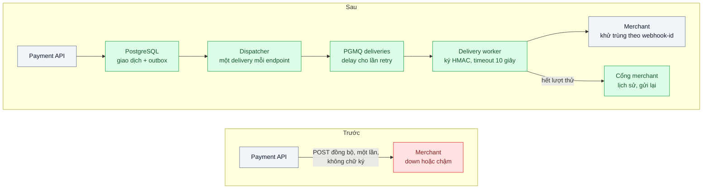
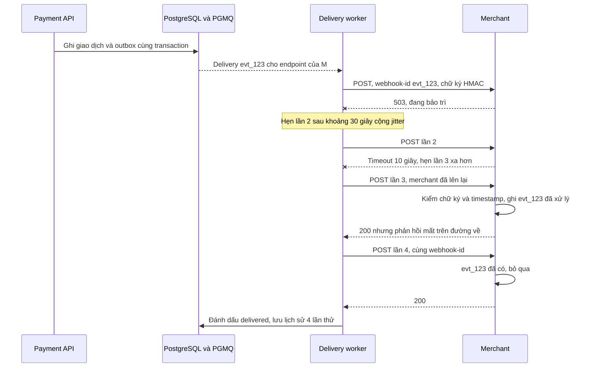

# Reliable Webhooks (signature, retry, idempotent receiver) — Gửi webhook cho đối tác, họ down 5 phút là mất sự kiện

| Scope | Mức độ | Trạng thái | Pattern gốc | Cập nhật |
|---|---|---|---|---|
| 13 · backend / transporter | 🟡 Trung bình | 📋 Kế hoạch | Reliable Webhooks — Stripe docs "Webhooks"; Standard Webhooks specification; *EIP* "Idempotent Receiver" | 2026-10-06 |

> **Một câu tóm tắt:** Biến việc gửi webhook từ một lời gọi HTTP đồng bộ một lần thành quy trình giao bền vững: ghi sự kiện cùng transaction, đưa vào hàng đợi giao theo từng endpoint, ký HMAC kèm timestamp, retry có backoff và jitter trong nhiều ngày, cho đối tác xem và gửi lại — còn phía nhận khử trùng theo `webhook-id`.

## 1. Bài toán thực tế (What)

**Bối cảnh** *(doanh nghiệp giả định, số liệu minh họa)*
Ví điện tử kiêm cổng thanh toán báo kết quả cho 3.000 merchant qua webhook `payment.succeeded` và `refund.completed`, khoảng 600.000 webhook/ngày. Hiện tại, ngay sau khi ghi giao dịch, API gọi `POST` tới URL của merchant trong chính request handler, timeout 30 giây, thử đúng một lần.

**Triệu chứng người kinh doanh nhìn thấy**
- Merchant bảo trì 5 phút thì mọi giao dịch trong 5 phút đó "treo": khách đã trả tiền nhưng shop không nhận được xác nhận để giao hàng; khiếu nại đổ về cả hai phía.
- Một merchant phản hồi chậm 20–30 giây làm API thanh toán chậm theo cho mọi merchant khác.
- Merchant nhận trùng webhook khi họ timeout nhưng thực ra đã xử lý, dẫn tới giao hàng hai lần.
- Một merchant bị kẻ xấu gửi webhook giả "đã thanh toán" vì không có cách xác minh nguồn gửi.

**Nguyên nhân kỹ thuật**
Sự kiện chỉ tồn tại trong bộ nhớ của request: gửi đồng bộ, một lần, không bền vững. Không có hàng đợi giao, không có lịch retry, không có lịch sử để tra cứu; không có chữ ký và id duy nhất để bên nhận xác thực nguồn gửi và khử trùng.

**Ràng buộc**
- Không được mất sự kiện (at-least-once); chấp nhận trùng nếu có id để khử.
- Merchant có thể down tới 3 ngày; một merchant chậm không được ảnh hưởng merchant khác.
- URL do merchant tự nhập nên phải chống SSRF; merchant tự xem và gửi lại sự kiện mà không cần gọi hỗ trợ.

## 2. Vì sao dùng pattern này (Why)

**Nguyên nhân gốc mà pattern nhắm vào:** giao sự kiện tới hệ thống bên ngoài — vốn không đáng tin — được làm như một lời gọi đồng bộ một lần thay vì một quy trình giao bền vững có xác thực.

**Pattern giải quyết thế nào:** Tài liệu webhook của Stripe mô tả cả hai phía: bên gửi ký mỗi webhook bằng secret riêng của endpoint kèm timestamp để chống phát lại, retry với backoff trong nhiều ngày; bên nhận phải xác minh chữ ký, khử trùng theo id sự kiện vì sự kiện có thể tới nhiều lần và không theo thứ tự, và trả 2xx thật nhanh trước khi xử lý nặng. Standard Webhooks chuẩn hóa điều này thành ba header `webhook-id`, `webhook-timestamp`, `webhook-signature` và cách ký HMAC-SHA256 trên chuỗi `id.timestamp.payload`. Bài ghép thành sáu bước: (1) ghi sự kiện vào outbox cùng transaction với giao dịch; (2) dispatcher tạo một *delivery* cho mỗi endpoint đăng ký; (3) worker gửi với timeout ngắn, retry exponential backoff có jitter kéo dài khoảng 3 ngày, giới hạn đồng thời theo endpoint; (4) hết lượt thử thì delivery chuyển `failed`, merchant được báo, endpoint lỗi kéo dài bị tự tắt; (5) cổng tự phục vụ để xem lịch sử và gửi lại; (6) phía nhận áp dụng *Idempotent Receiver* (EIP).

**Lựa chọn khác đã cân nhắc**

| Lựa chọn | Giải quyết được gì | Vì sao không chọn (ở bài này) |
|---|---|---|
| Giữ nguyên + tối ưu nhỏ (timeout ngắn hơn, retry 3 lần ngay trong request) | Đỡ lỗi chập chờn | Merchant down 5 phút vẫn mất; retry trong request làm API chậm hơn |
| Merchant tự polling API sự kiện | Bên gửi không phải giao; merchant chủ động | Trễ và tốn tải polling; giữ làm kênh bổ sung "lấy lại sự kiện bị lỡ" |
| Dịch vụ gửi webhook bên thứ ba | Có sẵn retry và cổng merchant | Dữ liệu thanh toán đi qua bên thứ ba; ngoài phạm vi học pattern |
| Outbox + hàng đợi giao + retry dài + chữ ký + idempotent receiver (chọn) | Không mất, không bị giả mạo, cô lập merchant chậm | Thêm worker, bảng delivery, cổng tự phục vụ; bên nhận phải làm phần việc của họ |

## 3. Thiết kế hệ thống (How)

### 3.1 Kiến trúc trước và sau



### 3.2 Luồng chính



### 3.3 Thành phần và trách nhiệm

| Thành phần | Trách nhiệm | Quyết định thiết kế đáng chú ý |
|---|---|---|
| Outbox | Ghi sự kiện cùng transaction với giao dịch | Không có giao dịch nào mà thiếu sự kiện, và ngược lại |
| Dispatcher | Tạo delivery cho mỗi endpoint đăng ký loại sự kiện đó | Mỗi delivery là một đơn vị retry độc lập |
| Delivery worker | Gửi, phân loại kết quả, hẹn lần thử sau | Chỉ 2xx là thành công; không theo redirect; giới hạn đồng thời theo endpoint |
| Bộ ký | HMAC-SHA256 theo Standard Webhooks, secret riêng mỗi endpoint | Hỗ trợ hai secret song song khi merchant xoay khóa |
| Lịch sử và cổng merchant | Xem từng lần thử, gửi lại sự kiện; tự tắt endpoint lỗi liên tục nhiều ngày và báo merchant | Merchant tự phục vụ, giảm ticket hỗ trợ |
| Chống SSRF | Chỉ chấp nhận `https`, phân giải DNS rồi chặn dải IP nội bộ | Kiểm ở cả lúc đăng ký và lúc gửi |

### 3.4 Điểm dễ sai khi triển khai
- **Bên nhận ký lại trên JSON đã parse.** Chữ ký phải tính trên body thô; parse rồi stringify sẽ lệch.
- **Không có timestamp trong chữ ký.** Kẻ xấu phát lại webhook cũ hợp lệ; bên nhận phải từ chối timestamp quá cửa sổ cho phép.
- **Retry không jitter.** Khi một merchant lớn lên lại, hàng nghìn delivery dồn vào cùng một giây.
- **Một hàng đợi chung không giới hạn theo endpoint.** Merchant chậm chiếm hết worker, merchant khác chờ theo.
- **Hứa thứ tự giao.** Retry làm sự kiện tới sai thứ tự; tài liệu phải nói rõ, kèm `created_at`, khuyên bên nhận lấy trạng thái mới nhất qua API khi cần.
- **Bên nhận xử lý nặng trước khi trả 200.** Dẫn tới timeout, retry và trùng; ghi nhận rồi trả 2xx, xử lý ở nền.

## 4. Tech stack và tác động (Impact techstack)

| Lớp | Công nghệ chọn | Vì sao chọn | Thay thế tương đương |
|---|---|---|---|
| Ứng dụng | TypeScript strict, NestJS cho Payment API và cổng merchant; worker Node riêng | Trùng stack repo | Fastify |
| Outbox và hàng đợi | PostgreSQL 16 + PGMQ, `pgmq.send` có delay cho lần thử sau | Sự kiện ghi cùng transaction với giao dịch; delay sẵn cho lịch retry | BullMQ (backoff tùy biến), RabbitMQ |
| Chữ ký | HMAC-SHA256 theo Standard Webhooks bằng `node:crypto` | Chuẩn mở, merchant có thư viện xác minh ở nhiều ngôn ngữ | Thư viện tham chiếu của Standard Webhooks (cần xác minh tên gói npm) |
| HTTP client | `undici`, timeout 10 giây, tắt theo redirect | Kiểm soát timeout và redirect tường minh | axios |
| Merchant giả | Fastify có chế độ down N phút, chậm, trả 200 rồi cắt kết nối | Tái hiện sự cố có kiểm soát | WireMock |
| Đo | Prometheus: tuổi delivery cũ nhất chưa giao, tỷ lệ thành công lần đầu, số `failed` | Cảnh báo theo tuổi chứ không chỉ theo số lượng | Grafana |
| Hạ tầng | Docker Compose | Một lệnh dựng API, worker, PostgreSQL, merchant giả | — |

**Thay đổi so với hệ thống hiện tại:** Payment API không gọi merchant nữa; thêm outbox, worker, bảng delivery và cổng merchant; tài liệu tích hợp cho merchant thêm phần xác minh chữ ký và khử trùng. Đội vận hành theo dõi tuổi delivery cũ nhất và số endpoint bị tự tắt.

## 5. Kết quả đầu ra và cách đo (Output impact)

| Chỉ số | Trước (minh họa) | Mục tiêu khi thực hành | Cách đo |
|---|---|---|---|
| Sự kiện mất khi merchant down 5 phút | toàn bộ sự kiện trong 5 phút | 0 | Merchant giả down 5 phút; so số sự kiện tạo ra với số `webhook-id` duy nhất đã nhận |
| Sự kiện bị merchant xử lý hai lần | có | 0 dù nhận trùng | Merchant giả đếm số lần xử lý theo `webhook-id` |
| p99 Payment API khi một merchant chậm 30 giây | 30.000 ms | ≤ 200 ms, không đổi so với bình thường | k6 trên API thanh toán trong lúc merchant giả chậm |
| Thời gian giao sau khi merchant lên lại | không giao | ≤ khoảng retry kế tiếp | Timestamp trong lịch sử delivery |
| Webhook giả mạo hoặc phát lại được chấp nhận | có | 0 | Test gửi chữ ký sai và timestamp cũ tới receiver mẫu |

> Số "trước" là minh họa để hình dung bài toán. Số "mục tiêu" chỉ được coi là đạt khi có số đo thật
> ở mục 8 kèm môi trường đo.

**Tác động nghiệp vụ mong đợi:** merchant bảo trì không còn làm khách "trả tiền mà không có hàng"; khiếu nại giao trùng và webhook giả giảm vì merchant có công cụ xác minh và khử trùng.

## 6. Đánh đổi và khi KHÔNG nên dùng

**Đánh đổi**
- Thêm worker, bảng delivery, cổng merchant và việc lưu lịch sử — chi phí lưu trữ tăng theo số lần thử. At-least-once đẩy trách nhiệm khử trùng sang bên nhận; không đảm bảo thứ tự.
- Quản lý và xoay secret cho hàng nghìn endpoint là việc vận hành mới.

**Không nên dùng khi**
- Tích hợp nội bộ giữa các service của chính mình: dùng hàng đợi hoặc broker trực tiếp (scope 14).
- Đối tác chỉ cần dữ liệu theo lô hằng ngày: file hoặc API lô đơn giản hơn.
- Sự kiện cần thứ tự nghiêm ngặt: dùng kênh có partition hoặc để đối tác kéo theo con trỏ.

**Liên quan**
- Nền tảng: `../../14-backend-queueing/03-transactional-outbox-ghi-don-xong-crash-mat-event/`, `../../14-backend-queueing/04-idempotent-consumer-event-den-hai-lan-tru-kho-hai-lan/`, `../../14-backend-queueing/05-dead-letter-queue-mot-message-loi-chan-ca-hang-doi/`.
- Retry và cách ly: `../../07-backend-microservices/04-timeout-retry-backoff-jitter-retry-dong-loat-tao-bao-moi/`, `../../07-backend-microservices/08-bulkhead-mot-tenant-lon-chiem-het-thread-pool/`.
- Chiều ngược lại: `../../01-frontend-backend-transporter/03-idempotency-key-bam-thanh-toan-hai-lan/`; callback cho việc dài: `../05-async-request-reply-xu-ly-30-giay-http-timeout/`.

## 7. Cơ sở tham khảo

- Stripe docs, "Webhooks" — https://docs.stripe.com/webhooks — chữ ký kèm timestamp, retry với backoff, sự kiện trùng và sai thứ tự, trả 2xx nhanh.
- Standard Webhooks specification — https://www.standardwebhooks.com/ — header `webhook-id`, `webhook-timestamp`, `webhook-signature` và cách ký HMAC.
- Amazon Builders' Library, "Making retries safe with idempotent APIs" — https://aws.amazon.com/builders-library/ — vì sao retry chỉ an toàn khi phía nhận idempotent.
- Hohpe & Woolf, *Enterprise Integration Patterns*, 2003, "Idempotent Receiver" — https://www.enterpriseintegrationpatterns.com/patterns/messaging/IdempotentReceiver.html — khử trùng ở phía nhận.
- Marc Brooker, "Exponential Backoff And Jitter", AWS Architecture Blog, 2015 — https://aws.amazon.com/blogs/architecture/exponential-backoff-and-jitter/ — lịch retry có jitter.
- OWASP Cheat Sheet Series, "Server-Side Request Forgery Prevention" — https://cheatsheetseries.owasp.org/ — chặn URL nội bộ khi gửi tới địa chỉ do người dùng nhập.

## 8. Kế hoạch thực hành

- [ ] Bước 1: dựng Payment API phiên bản "trước" gọi merchant đồng bộ; merchant giả có chế độ down, chậm, cắt kết nối sau khi xử lý.
- [ ] Bước 2: đo "trước": merchant down 5 phút giữa tải 50 giao dịch/giây; đếm sự kiện mất, p99 API khi merchant chậm.
- [ ] Bước 3: thêm outbox, dispatcher, PGMQ deliveries, worker có lịch retry và jitter, bộ ký Standard Webhooks, chống SSRF, cổng xem và gửi lại; viết receiver mẫu khử trùng theo `webhook-id`.
- [ ] Bước 4: đo "sau" cùng kịch bản, ghi số thật và môi trường vào mục 5.
- [ ] Bước 5: test: (a) merchant down 5 phút không mất sự kiện nào; (b) phản hồi bị cắt dẫn tới gửi lại nhưng chỉ xử lý một lần; (c) chữ ký sai hoặc timestamp cũ bị từ chối; (d) URL trỏ tới IP nội bộ bị chặn; (e) merchant chậm không làm chậm delivery của merchant khác.

**Cấu trúc code dự kiến**
```text
src/
  payment-api/create-payment.ts    # ghi giao dịch + outbox cùng transaction
  webhooks/dispatcher.ts           # outbox → delivery theo endpoint
  webhooks/delivery-worker.ts      # [PATTERN] gửi, retry có jitter, giới hạn theo endpoint
  webhooks/signer.ts               # HMAC theo Standard Webhooks
  webhooks/ssrf-guard.ts
  merchant-sample/receiver.ts      # [PATTERN] xác minh chữ ký, khử trùng theo webhook-id
  merchant-mock/server.ts
test/
  merchant-down-5-minutes-loses-nothing.test.ts
  duplicate-delivery-processed-once.test.ts
  invalid-signature-rejected.test.ts
docker-compose.yml
```

**Cách chạy** *(điền khi bắt đầu code)*
```bash
docker compose up -d
pnpm install && pnpm test
```
