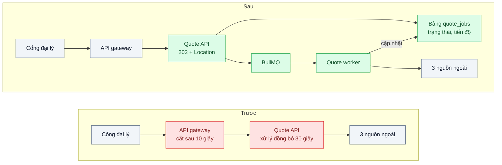
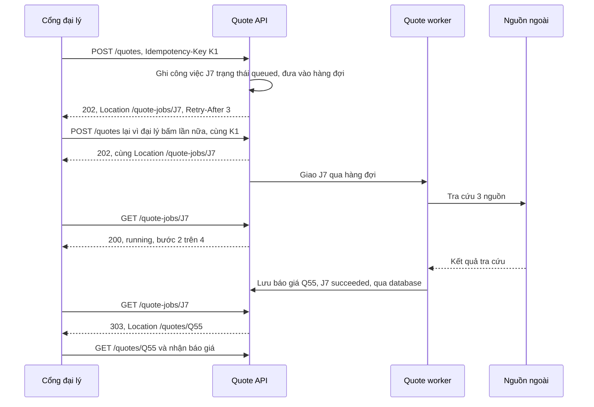

# Asynchronous Request-Reply — Xử lý mất 30 giây, HTTP timeout ở 10 giây

| Scope | Mức độ | Trạng thái | Pattern gốc | Cập nhật |
|---|---|---|---|---|
| 13 · backend / transporter | 🟡 Trung bình | 📋 Kế hoạch | Asynchronous Request-Reply — Azure Architecture Center; Hohpe & Woolf, *EIP* (2003): Request-Reply, Correlation Identifier | 2026-10-06 |

> **Một câu tóm tắt:** Nhận yêu cầu, ghi một "công việc" có id riêng rồi trả ngay `202 Accepted` kèm địa chỉ theo dõi; worker xử lý 30 giây ở phía sau, client hỏi trạng thái (hoặc nhận callback) và lấy kết quả khi xong — công việc không còn phụ thuộc vào thời gian sống của một kết nối HTTP.

## 1. Bài toán thực tế (What)

**Bối cảnh** *(doanh nghiệp giả định, số liệu minh họa)*
Công ty bảo hiểm có cổng web cho đại lý tạo báo giá bảo hiểm xe. Mỗi báo giá gọi 3 nguồn bên ngoài (tra cứu đăng kiểm, lịch sử bồi thường, định giá xe) rồi chạy bộ tính phí, tổng cộng 20–40 giây. Khoảng 8.000 báo giá/ngày. API gateway dùng chung của công ty cắt mọi request sau 10 giây và không đổi được riêng cho một ứng dụng.

**Triệu chứng người kinh doanh nhìn thấy**
- Khoảng 35 % báo giá trả lỗi 504 cho đại lý dù hệ thống vẫn tính xong phía sau; đại lý bấm lại, tạo 2–3 báo giá trùng, mỗi lần tốn phí tra cứu nguồn ngoài.
- Đại lý không biết hệ thống đang "tính" hay đã "lỗi", gọi tổng đài hỏi.
- Thử tăng timeout gateway lên 60 giây thì kết nối bị giữ lâu, giờ cao điểm gateway cạn kết nối cho mọi ứng dụng khác.

**Nguyên nhân kỹ thuật**
Công việc dài bị nhốt trong một HTTP request đồng bộ. Giữa trình duyệt và backend có nhiều tầng timeout (trình duyệt, load balancer, gateway); khi tầng ngoài cắt, việc bên trong vẫn chạy nhưng kết quả không còn đường về, và client thử lại tạo thêm việc mới. Công việc không có danh tính độc lập với kết nối.

**Ràng buộc**
- Không đổi được timeout của hạ tầng dùng chung; gọi nguồn ngoài tốn phí nên không được tạo việc trùng.
- Đại lý cần thấy tiến độ; một số đối tác tích hợp máy với máy muốn nhận callback thay vì hỏi trạng thái.

## 2. Vì sao dùng pattern này (Why)

**Nguyên nhân gốc mà pattern nhắm vào:** thời gian xử lý vượt thời gian sống của kết nối HTTP, và "công việc" không có danh tính tách khỏi kết nối.

**Pattern giải quyết thế nào:** Azure mô tả Asynchronous Request-Reply: API kiểm tra yêu cầu, đưa việc vào hàng đợi rồi trả ngay `202 Accepted` kèm header `Location` trỏ tới endpoint trạng thái, có thể kèm `Retry-After` gợi ý khi nào hỏi lại. Client hỏi endpoint trạng thái; khi xong, endpoint trả kết quả hoặc chuyển hướng sang tài nguyên kết quả (bài dùng `303 See Other`). Hohpe và Woolf mô tả cùng cấu trúc ở tầng messaging: *Request-Reply* với *Correlation Identifier* để ghép trả lời với yêu cầu và *Return Address* để biết trả lời gửi về đâu — ở đây id công việc là correlation id, còn `Location` (hỏi trạng thái) hoặc callback URL là return address. Thêm `Idempotency-Key` ở `POST` để đại lý bấm lại không tạo công việc mới.

**Lựa chọn khác đã cân nhắc**

| Lựa chọn | Giải quyết được gì | Vì sao không chọn (ở bài này) |
|---|---|---|
| Giữ nguyên + tối ưu nhỏ (gọi 3 nguồn ngoài song song) | Rút từ 40 xuống khoảng 20 giây | Vẫn vượt 10 giây; không đổi được timeout hạ tầng |
| WebSocket hoặc SSE giữ kết nối chờ kết quả | Đẩy kết quả ngay khi xong | Vẫn cần công việc bền vững khi kết nối đứt; dùng làm lớp thông báo phía trên |
| Callback cho mọi client | Không phải hỏi trạng thái | Trình duyệt không nhận được callback; giữ cho đối tác máy với máy |
| `202` + endpoint trạng thái + hàng đợi + `Idempotency-Key` (chọn) | Không phụ thuộc timeout, không trùng việc, có tiến độ | Client phải hỏi trạng thái; thêm bảng công việc, worker, việc dọn dẹp |

## 3. Thiết kế hệ thống (How)

### 3.1 Kiến trúc trước và sau



### 3.2 Luồng chính



### 3.3 Thành phần và trách nhiệm

| Thành phần | Trách nhiệm | Quyết định thiết kế đáng chú ý |
|---|---|---|
| `POST /quotes` | Kiểm tra nhanh, ánh xạ `Idempotency-Key` sang id công việc, trả `202` | Chỉ trả `202` sau khi công việc đã ghi bền vững |
| Bảng `quote_jobs` | Nguồn sự thật: trạng thái, tiến độ, lỗi, kết quả, hạn xóa; job dọn dẹp xóa bản ghi hết hạn | Hàng đợi chỉ là cơ chế phân phát, không phải nơi lưu trạng thái |
| Hàng đợi và worker | Chạy các bước, cập nhật tiến độ, retry nguồn ngoài, timeout tổng | Id job trong hàng đợi trùng id công việc để enqueue lại không nhân đôi |
| `GET /quote-jobs/:id` | `200` kèm trạng thái khi đang chạy hoặc lỗi; `303` khi xong | Kiểm chủ sở hữu; id ngẫu nhiên, không đoán được |
| Callback (tùy chọn) | Gửi kết quả cho đối tác máy với máy | Dùng lại cơ chế webhook đáng tin ở bài 04 |

### 3.4 Điểm dễ sai khi triển khai
- **Trả `202` trước khi công việc được ghi.** Crash ngay sau đó là mất việc mà client tưởng đã nhận; ghi bền vững trước, enqueue sau và enqueue lại được.
- **Không có `Idempotency-Key`.** Mỗi lần bấm lại là một công việc mới và một lần trả phí nguồn ngoài.
- **Client hỏi trạng thái quá dày.** Endpoint trạng thái thành điểm nóng; trả `Retry-After` và giữ truy vấn trạng thái thật rẻ.
- **Endpoint trạng thái không kiểm quyền.** Đoán id là xem được báo giá của đại lý khác.
- **Công việc "running" mãi khi worker chết.** Cần phát hiện job bị bỏ dở và timeout tổng để chuyển sang `failed` rõ ràng.
- **Dùng `200` cho "đã nhận nhưng chưa xong".** Client tưởng đã có kết quả; `202` và trạng thái tường minh mới đúng nghĩa.

## 4. Tech stack và tác động (Impact techstack)

| Lớp | Công nghệ chọn | Vì sao chọn | Thay thế tương đương |
|---|---|---|---|
| Ứng dụng | TypeScript strict, NestJS cho Quote API; worker Node riêng | Trùng stack repo | Fastify |
| Hàng đợi | BullMQ trên Redis 7 | Có sẵn tiến độ job, retry có backoff, phát hiện job bị bỏ dở — khớp nhu cầu endpoint trạng thái | PGMQ + bảng trạng thái tự quản |
| Trạng thái, kết quả | PostgreSQL 16: `quote_jobs`, `quotes`, `idempotency_keys` | Bền vững, truy vấn được, là nguồn sự thật | — |
| Thông báo (tùy chọn) | SSE cho cổng đại lý; webhook cho đối tác | Giảm số lần hỏi trạng thái | WebSocket |
| Nguồn ngoài giả | Fastify trễ 5–15 giây, lỗi ngẫu nhiên, đếm số lần bị gọi | Tái hiện chi phí và độ trễ có kiểm soát | WireMock |
| Đo | k6 (kịch bản POST rồi hỏi trạng thái qua NGINX cắt ở 10 giây), Prometheus | Đo đúng điều kiện timeout của gateway | — |
| Hạ tầng | Docker Compose: NGINX, API, worker, Redis, PostgreSQL | Một lệnh dựng môi trường | — |

**Thay đổi so với hệ thống hiện tại:** hợp đồng API đổi từ "chờ kết quả" sang "nhận phiếu theo dõi"; giao diện đại lý thêm màn hình tiến độ; thêm worker, Redis và bảng công việc. Đội vận hành theo dõi độ sâu hàng đợi, thời gian xử lý mỗi công việc và số công việc `failed`.

## 5. Kết quả đầu ra và cách đo (Output impact)

| Chỉ số | Trước (minh họa) | Mục tiêu khi thực hành | Cách đo |
|---|---|---|---|
| Tỷ lệ 504 ở cổng đại lý | 35 % | 0 % | k6 qua NGINX đặt timeout 10 giây giống gateway |
| Công việc trùng khi bấm lại cùng `Idempotency-Key` | 2–3 lần | 0 | Đếm công việc theo key trong database |
| Số lần gọi nguồn ngoài cho mỗi báo giá | 2,4 | 1,0 | Counter ở nguồn ngoài giả |
| p95 thời gian `POST` trả `202` | — | ≤ 150 ms | Histogram k6 |
| Thời gian từ khi xong tới khi đại lý thấy kết quả | — | ≤ `Retry-After` khi hỏi trạng thái; ≤ 1 giây với SSE | So timestamp `succeeded` với lần hỏi đầu tiên thấy kết quả |
| Công việc kẹt "running" sau khi kill worker | mãi mãi | 0 sau ngưỡng phát hiện | Test kill worker giữa chừng |

> Số "trước" là minh họa để hình dung bài toán. Số "mục tiêu" chỉ được coi là đạt khi có số đo thật
> ở mục 8 kèm môi trường đo.

**Tác động nghiệp vụ mong đợi:** đại lý không còn thấy lỗi giả và không tạo báo giá trùng, nên chi phí tra cứu nguồn ngoài giảm và tổng đài bớt cuộc gọi hỏi "hệ thống có đang chạy không".

## 6. Đánh đổi và khi KHÔNG nên dùng

**Đánh đổi**
- Thêm bảng công việc, worker, hàng đợi và việc dọn dẹp; nhiều thành phần hơn để vận hành. Client phải hiểu `202`, hỏi trạng thái hoặc nhận callback — hợp đồng API phức tạp hơn.
- Trải nghiệm phụ thuộc khoảng hỏi trạng thái; muốn tức thì phải thêm SSE hoặc WebSocket.

**Không nên dùng khi**
- Xử lý ổn định dưới 1–2 giây: gọi đồng bộ đơn giản hơn.
- Xử lý thường nhanh nhưng thỉnh thoảng chậm vì một truy vấn tệ: tối ưu truy vấn trước.
- Các bên là service nội bộ đã có broker chung: request-reply qua broker gọn hơn (bài 06).

**Liên quan**
- Nền tảng: `../../14-backend-queueing/01-work-queue-gui-100k-email-lam-treo-api/`, `../../01-frontend-backend-transporter/03-idempotency-key-bam-thanh-toan-hai-lan/`; phiên bản trong monolith: `../../08-backend-monolith/02-background-job-trong-monolith-xuat-excel-lam-treo-web/`.
- Callback đáng tin: `../04-webhook-delivery-doi-tac-down-5-phut-mat-su-kien/`; đẩy kết quả lên giao diện: `../../06-frontend-backend-realtime/01-sse-vs-websocket-vs-polling-theo-doi-trang-thai-don/`; cùng cơ chế correlation id qua broker: `../06-nats-request-reply-moleculer-transporter-service-goi-nhau-qua-broker/`.

## 7. Cơ sở tham khảo

- Microsoft Azure Architecture Center, "Asynchronous Request-Reply pattern" — https://learn.microsoft.com/azure/architecture/patterns/async-request-reply — luồng `202` + `Location` + endpoint trạng thái, `Retry-After`, chuyển hướng tới kết quả.
- Hohpe & Woolf, *Enterprise Integration Patterns*, 2003, "Request-Reply" — https://www.enterpriseintegrationpatterns.com/patterns/messaging/RequestReply.html — tách yêu cầu và trả lời, Return Address.
- Hohpe & Woolf, *EIP*, "Correlation Identifier" — https://www.enterpriseintegrationpatterns.com/patterns/messaging/CorrelationIdentifier.html — ghép trả lời với yêu cầu bằng id.
- BullMQ docs — https://docs.bullmq.io/ — tiến độ job, retry, job bị bỏ dở dùng ở mục 4.
- IETF draft, "The Idempotency-Key HTTP Header Field" (draft-ietf-httpapi-idempotency-key-header) — chống tạo công việc trùng khi client gửi lại.

## 8. Kế hoạch thực hành

- [ ] Bước 1: dựng Quote API phiên bản "trước" xử lý đồng bộ 30 giây sau NGINX cắt ở 10 giây; nguồn ngoài giả có đếm số lần gọi.
- [ ] Bước 2: đo "trước": k6 mô phỏng đại lý bấm lại khi gặp 504; ghi tỷ lệ 504, số báo giá trùng, số lần gọi nguồn ngoài.
- [ ] Bước 3: thêm `quote_jobs`, `Idempotency-Key`, BullMQ worker có tiến độ, endpoint trạng thái `200`/`303`, dọn dẹp; (tùy chọn) SSE và callback.
- [ ] Bước 4: đo "sau" cùng kịch bản, ghi số thật và môi trường vào mục 5.
- [ ] Bước 5: test: (a) hai `POST` cùng key trả cùng `Location`; (b) endpoint trạng thái trả `303` khi xong và `200 failed` khi lỗi; (c) kill worker giữa chừng, công việc chuyển `failed` hoặc chạy lại, không kẹt; (d) đại lý khác không xem được công việc.

**Cấu trúc code dự kiến**
```text
src/
  quote-api/create-quote-job.ts    # [PATTERN] idempotency key → job id, trả 202 + Location
  quote-api/quote-job-status.ts    # [PATTERN] 200 khi đang chạy, 303 khi xong
  quote-worker/worker.ts           # các bước, tiến độ, timeout tổng
  quote-worker/external-sources.ts
  cleanup/expire-jobs.ts
  external-mock/server.ts
test/
  same-idempotency-key-same-job.test.ts
  status-redirects-when-done.test.ts
  killed-worker-does-not-leave-running-job.test.ts
bench/quote-under-gateway-timeout.k6.js
docker-compose.yml
```

**Cách chạy** *(điền khi bắt đầu code)*
```bash
docker compose up -d
pnpm install && pnpm test
```
