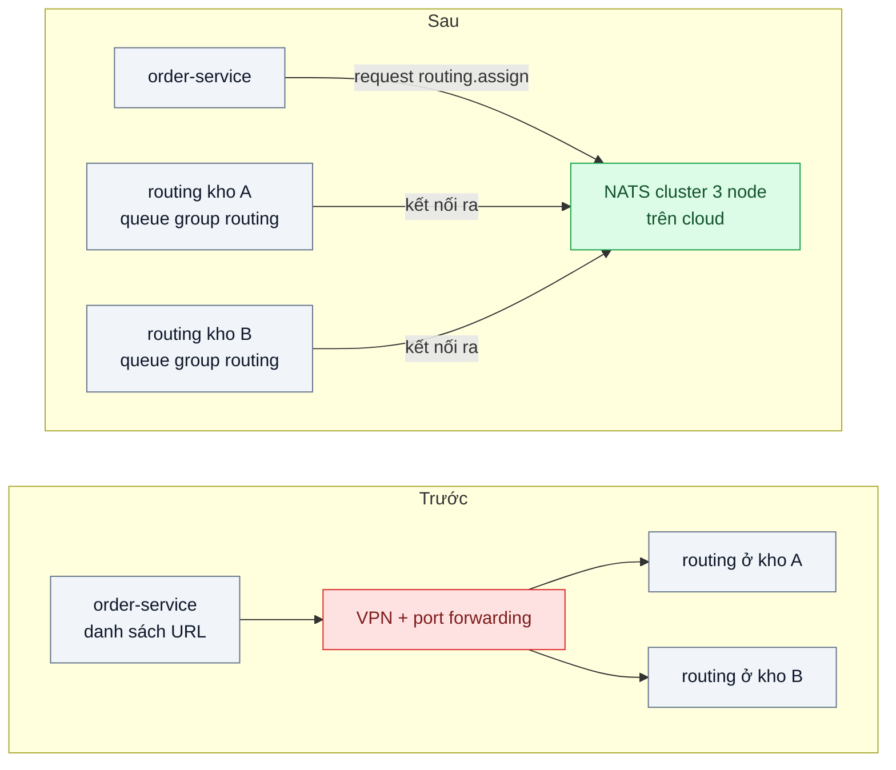
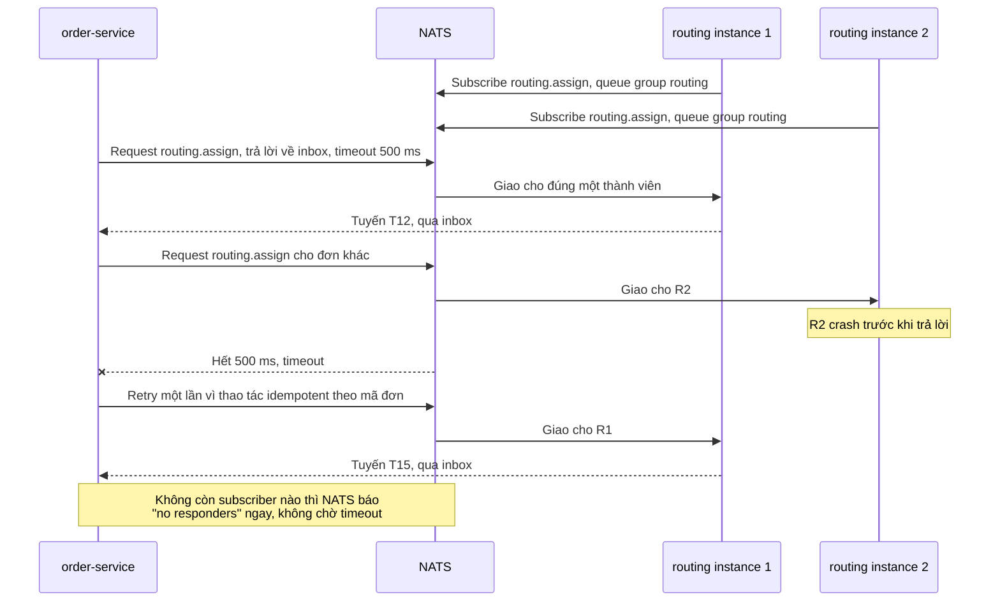

# Broker-based RPC (NATS request-reply, Moleculer transporter) — Service gọi nhau qua broker thay vì HTTP trực tiếp: khi nào đáng?

| Scope | Mức độ | Trạng thái | Pattern gốc | Cập nhật |
|---|---|---|---|---|
| 13 · backend / transporter | 🔴 Nâng cao | 📋 Kế hoạch | Request-Reply qua Message Bus — NATS docs "Request-Reply"; Moleculer docs "Transporters"; Hohpe & Woolf, *EIP* (2003) | 2026-10-06 |

> **Một câu tóm tắt:** Cho service gọi nhau bằng request-reply qua NATS — bên gọi gửi lên một subject, bên nhận đăng ký theo queue group, mọi bên chỉ kết nối *ra* tới broker — để thêm instance không phải sửa cấu hình và gọi xuyên mạng có NAT không cần mở cổng; đồng thời đo rõ cái giá: thêm một hop, broker thành phụ thuộc trung tâm, và giao nhận chỉ ở mức at-most-once.

## 1. Bài toán thực tế (What)

**Bối cảnh** *(doanh nghiệp giả định, số liệu minh họa)*
Nền tảng logistics có 14 service Node.js chạy ở ba nơi: cụm cloud, máy chủ tại 2 kho phân loại (sau NAT, không mở cổng vào) và máy chủ ở trung tâm của đối tác giao nhận. Service gọi nhau bằng HTTP qua danh sách URL; để cloud gọi được vào kho phải duy trì VPN và port forwarding. Các lời gọi tính cước, gán tuyến, tra tồn kho tại kho khoảng 3.000 lời gọi/giây giờ cao điểm.

**Triệu chứng người kinh doanh nhìn thấy**
- Mỗi lần thêm một instance gán tuyến ở kho, phải mở thêm port forwarding và sửa danh sách URL ở 5 service gọi tới; mất nửa ngày của hai người.
- Kho mất VPN 10 phút: mỗi lời gọi từ cloud chờ đủ 30 giây timeout, đơn tồn đọng, xe chờ tuyến.
- Timeout, retry, chọn instance được viết lại ở từng service, mỗi nơi một kiểu; sự cố khó đoán.

**Nguyên nhân kỹ thuật**
HTTP điểm-điểm đòi bên gọi biết và *với tới được* địa chỉ bên nhận. Khi topology mạng có nhiều vùng và NAT, "với tới được" trở nên đắt; discovery, cân bằng tải và xử lý "không có ai phục vụ" bị đẩy về từng service.

**Ràng buộc**
- Độ trễ thêm p99 ≤ 5 ms cho lời gọi tính cước (minh họa); bên gọi phải biết thất bại nhanh, không chờ mù.
- Không vận hành Kubernetes ở kho; đội 6 người.
- Thao tác ghi phải an toàn khi bị gửi lại (idempotent) vì sẽ có retry.

## 2. Vì sao dùng pattern này (Why)

**Nguyên nhân gốc mà pattern nhắm vào:** bên gọi phải biết và kết nối trực tiếp tới địa chỉ mạng của bên nhận.

**Pattern giải quyết thế nào:** *Message Bus* trong EIP mô tả các ứng dụng giao tiếp qua một hạ tầng chung, chỉ cần biết tên kênh. NATS hiện thực request-reply trên đó: bên gọi publish lên subject (ví dụ `routing.assign`) kèm một reply subject tạm (inbox); bên nhận subscribe theo *queue group* nên mỗi request chỉ tới một thành viên; bên nhận publish trả lời vào inbox. Mọi bên chỉ mở kết nối *ra* tới NATS nên đi qua NAT được; thêm instance chỉ là thêm subscriber; nếu không có subscriber nào, NATS báo *no responders* ngay thay vì để bên gọi chờ hết timeout. Moleculer dùng broker làm *transporter*: các node tự phát hiện nhau qua heartbeat trên transporter, `broker.call('routing.assign')` có sẵn timeout, retry, circuit breaker và bulkhead. Cái giá phải đo: NATS core là at-most-once — request mất nếu bên nhận chết giữa chừng và bên gọi chỉ thấy timeout; broker là phụ thuộc trung tâm; mỗi lời gọi thêm một hop.

**Lựa chọn khác đã cân nhắc**

| Lựa chọn | Giải quyết được gì | Vì sao không chọn (ở bài này) |
|---|---|---|
| Giữ nguyên + tối ưu nhỏ (HTTP + DNS nội bộ + VPN dự phòng) | Không học công cụ mới | Vẫn phải mở cổng vào kho; timeout và discovery vẫn ở từng service |
| HTTP/gRPC qua service mesh đa cụm | mTLS, discovery, retry thống nhất | Cần Kubernetes ở mọi nơi, kho không có; quá nặng cho đội 6 người |
| Chuyển hết sang hàng đợi bền vững (JetStream, Kafka) | Không mất message, tách thời gian | Tính cước và gán tuyến cần trả lời ngay trong request đang chờ |
| NATS request-reply + queue group (chọn); Moleculer làm biến thể so sánh | Kết nối ra qua NAT, thêm instance không sửa cấu hình, biết "không ai phục vụ" ngay | Broker là phụ thuộc trung tâm; at-most-once; thêm một hop |

## 3. Thiết kế hệ thống (How)

### 3.1 Kiến trúc trước và sau



### 3.2 Luồng chính



### 3.3 Thành phần và trách nhiệm

| Thành phần | Trách nhiệm | Quyết định thiết kế đáng chú ý |
|---|---|---|
| NATS cluster 3 node | Định tuyến request và reply, quản lý queue group | Client cấu hình nhiều URL server để chịu được mất một node |
| Quy ước subject | `<miền>.<hành-động>`, ví dụ `routing.assign`, `pricing.quote` | Phân quyền publish/subscribe theo subject cho từng service |
| Queue group | Chia request cho các instance cùng nhóm | Thêm instance là thêm subscriber, không sửa bên gọi |
| Lớp gọi RPC ở bên gọi | Timeout theo SLO, retry chỉ cho thao tác idempotent, xử lý no responders | Truyền trace context qua header của NATS |
| Biến thể Moleculer | Cùng nghiệp vụ viết bằng Moleculer với NATS transporter | So sánh lượng code và tính năng có sẵn |
| Giám sát NATS | Endpoint giám sát của server (`/varz`, `/connz`) | Cảnh báo số kết nối, slow consumer, mất node |

### 3.4 Điểm dễ sai khi triển khai
- **Tưởng broker đảm bảo giao.** NATS core là at-most-once; việc phải bền vững (thanh toán, trừ kho) đi qua hàng đợi bền vững, không qua request-reply.
- **Timeout dài vì "đã có broker lo".** Đặt timeout theo SLO và dựa vào no responders để thất bại nhanh.
- **Payload lớn.** NATS giới hạn kích thước payload theo cấu hình `max_payload` (mặc định khoảng 1 MB); dữ liệu lớn dùng Claim Check.
- **Mất truy vết.** Không chuyển trace context qua header NATS thì chuỗi lời gọi đứt đoạn trong công cụ tracing.
- **Subject quá rộng.** Wildcard subscribe nhầm làm một service nhận request không dành cho nó; phân quyền subject theo tài khoản.
- **Moleculer cân bằng hai tầng.** Bộ cân bằng của Moleculer và queue group của NATS cùng chọn instance; hiểu tùy chọn tắt cân bằng phía Moleculer (cần xác minh tên tùy chọn) trước khi đo.

## 4. Tech stack và tác động (Impact techstack)

| Lớp | Công nghệ chọn | Vì sao chọn | Thay thế tương đương |
|---|---|---|---|
| Broker | NATS Server 2.10+, cluster 3 node, core request-reply | Kết nối ra qua NAT, queue group, no responders, một binary nhỏ dễ vận hành | RabbitMQ RPC với direct reply-to |
| Client | Thư viện NATS chính thức cho Node.js (tên gói ở bản mới cần xác minh) | Hỗ trợ request, header, nhiều server URL | — |
| Biến thể framework | Moleculer với NATS transporter | So sánh discovery, timeout, retry có sẵn với tự bọc | NestJS microservices với NATS transport |
| Phiên bản "trước" | Fastify HTTP với danh sách URL | Tái hiện cách gọi hiện tại để so độ trễ | — |
| Mô phỏng mạng | Docker Compose với 3 network: cloud, kho A, kho B; kho chỉ đi ra được | Tái hiện NAT mà không cần hạ tầng thật | — |
| Đo | Script Node bắn tải cố định ghi histogram HDR; k6 cho phía HTTP; giám sát NATS | Cùng tải, cùng cách tính phân vị cho hai giao thức | — |

**Thay đổi so với hệ thống hiện tại:** thêm cụm NATS và quy ước subject; bỏ danh sách URL và port forwarding vào kho; lớp gọi RPC dùng chung thay cho code timeout/retry rải rác. Đội vận hành phải giám sát NATS như hạ tầng cốt lõi và học đọc lỗi "no responders" và "timeout" thay cho mã HTTP.

## 5. Kết quả đầu ra và cách đo (Output impact)

| Chỉ số | Trước (minh họa) | Mục tiêu khi thực hành | Cách đo |
|---|---|---|---|
| Độ trễ p50/p99 lời gọi gán tuyến cùng vùng | HTTP 2 ms / 6 ms | NATS thêm ≤ 1 ms ở p50, ≤ 5 ms ở p99 | Script tải cố định 3.000 lời gọi/giây, histogram HDR |
| Thao tác cấu hình khi thêm một instance ở kho | sửa 5 service, mở cổng | 0 | Đếm file và bước trong runbook |
| Thời gian bên gọi biết "không ai phục vụ" | 30 giây | ≤ 10 ms | Test tắt mọi instance routing rồi gọi |
| Tỷ lệ lời gọi thất bại khi kill 1/3 instance giữa tải | — | ≤ 0,1 % sau retry idempotent | Script tải + `docker kill` |
| Ảnh hưởng khi mất một node NATS | — | Không lời gọi nào lỗi quá 1 giây | `docker kill` một node NATS giữa tải |

> Số "trước" là minh họa để hình dung bài toán. Số "mục tiêu" chỉ được coi là đạt khi có số đo thật
> ở mục 8 kèm môi trường đo.

**Tác động nghiệp vụ mong đợi:** mở rộng năng lực kho trong mùa cao điểm không còn tốn nửa ngày cấu hình; mất kết nối một kho làm bên gọi biết ngay để chuyển phương án, thay vì treo đơn 30 giây mỗi lần.

## 6. Đánh đổi và khi KHÔNG nên dùng

**Đánh đổi**
- Broker là phụ thuộc trung tâm: phải chạy cluster, giám sát và nâng cấp cẩn thận; broker sập là mọi RPC sập.
- Thêm một hop và một thành phần trong mọi lời gọi; gỡ lỗi khó hơn vì không dùng được `curl`.
- Gắn với quy ước subject và (nếu dùng) framework Moleculer — đổi hướng sau này tốn công.

**Không nên dùng khi**
- Mọi service ở một cụm Kubernetes đã có Service DNS: HTTP hoặc gRPC trực tiếp đơn giản hơn.
- Cần đảm bảo không mất (thanh toán, trừ kho): dùng hàng đợi bền vững với outbox và idempotent consumer.
- Gọi ra đối tác bên ngoài, hoặc đội không muốn vận hành thêm hạ tầng.

**Liên quan**
- Cách tìm nhau khác: `../../07-backend-microservices/06-service-discovery-service-moi-deploy-doi-ip/`; giao thức trực tiếp: `../01-rest-vs-grpc-json-serialize-chiem-30-phan-tram-cpu/`; khi số service lớn: `../07-service-mesh-mtls-retry-tracing-khong-sua-code/`.
- Cùng cơ chế correlation id: `../05-async-request-reply-xu-ly-30-giay-http-timeout/`; chọn broker: `../../14-backend-queueing/02-chon-broker-redis-rabbitmq-kafka-nats-pgmq-team-5-nguoi/`.
- Payload lớn: `../../14-backend-queueing/08-claim-check-message-50mb-lam-nghen-broker/`; truy vết: `../../23-backend-monitoring-benchmark/03-distributed-tracing-otel-request-qua-6-service-cham-o-dau/`.

## 7. Cơ sở tham khảo

- NATS docs, "Request-Reply" — https://docs.nats.io/nats-concepts/core-nats/reqreply — inbox, no responders, timeout.
- NATS docs, "Queue Groups" — https://docs.nats.io/nats-concepts/core-nats/queue — chia request cho các thành viên cùng nhóm.
- Moleculer docs, "Transporters" — https://moleculer.services/docs/ — broker làm lớp vận chuyển, discovery qua heartbeat, các tính năng chịu lỗi có sẵn.
- Hohpe & Woolf, *Enterprise Integration Patterns*, 2003, "Message Bus" — https://www.enterpriseintegrationpatterns.com/patterns/messaging/MessageBus.html — hạ tầng chung để ứng dụng giao tiếp qua tên kênh.
- Hohpe & Woolf, *EIP*, "Request-Reply" — https://www.enterpriseintegrationpatterns.com/patterns/messaging/RequestReply.html — reply channel và return address.
- W3C Trace Context — https://www.w3.org/TR/trace-context/ — định dạng truyền trace context qua header.

## 8. Kế hoạch thực hành

- [ ] Bước 1: dựng 3 network trong Docker Compose (cloud, kho A, kho B), `order-service` và `routing-service` phiên bản HTTP; NATS cluster 3 node.
- [ ] Bước 2: đo "trước": độ trễ HTTP cùng vùng ở 3.000 lời gọi/giây, số thao tác để thêm instance, hành vi khi kho mất kết nối.
- [ ] Bước 3: viết lớp gọi RPC qua NATS (timeout, retry idempotent, no responders, trace header); `routing-service` subscribe theo queue group; viết biến thể Moleculer.
- [ ] Bước 4: đo "sau" các chỉ số mục 5 cho cả NATS thuần và Moleculer; ghi số thật, môi trường và một đoạn kết luận "khi nào đáng".
- [ ] Bước 5: test: (a) thêm instance nhận request mà không đổi cấu hình bên gọi; (b) không có subscriber thì lỗi no responders trong 10 ms; (c) instance chết giữa request thì bên gọi timeout rồi retry thành công; (d) mất một node NATS không làm lỗi lời gọi.

**Cấu trúc code dự kiến**
```text
src/
  shared/nats-rpc-client.ts        # [PATTERN] request, timeout, retry idempotent, no responders
  routing/nats-responder.ts        # [PATTERN] subscribe theo queue group
  routing/http-server.ts           # phiên bản "trước"
  order/order.service.ts
  moleculer/                       # biến thể Moleculer với NATS transporter
test/
  new-instance-needs-no-config.test.ts
  no-responders-fails-fast.test.ts
  responder-crash-then-retry.test.ts
bench/rpc-latency.ts               # histogram HDR cho HTTP và NATS
docker-compose.yml                 # 3 network, NATS cluster
```

**Cách chạy** *(điền khi bắt đầu code)*
```bash
docker compose up -d
pnpm install && pnpm test
```
