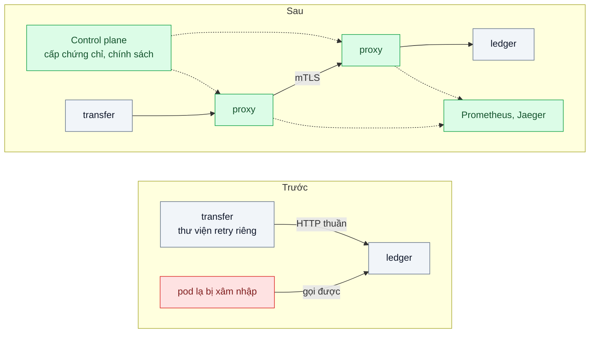
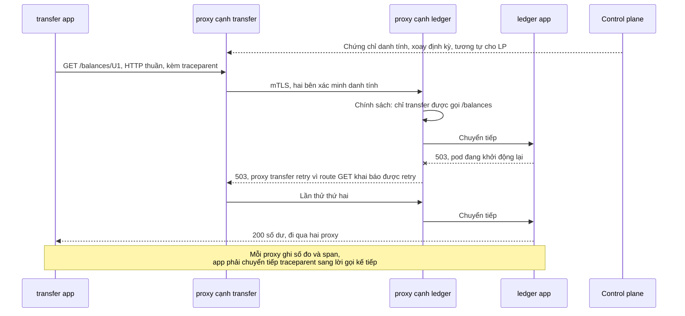

# Service Mesh (sidecar) — mTLS, retry, tracing cho 40 service mà không sửa code từng service

| Scope | Mức độ | Trạng thái | Pattern gốc | Cập nhật |
|---|---|---|---|---|
| 13 · backend / transporter | 🔴 Nâng cao | 📋 Kế hoạch | Service Mesh, Sidecar, Ambassador — Istio docs; Linkerd docs; Azure "Sidecar", "Ambassador" | 2026-10-06 |

> **Một câu tóm tắt:** Đặt một proxy cạnh mỗi service (sidecar) và một control plane cấp danh tính, để mã hóa và xác thực hai chiều (mTLS), chính sách ai-được-gọi-ai, retry, timeout và số đo theo từng cặp service được áp đồng nhất ở tầng hạ tầng — thay vì 8 đội tự cài trong 40 service viết bằng ba ngôn ngữ.

## 1. Bài toán thực tế (What)

**Bối cảnh** *(doanh nghiệp giả định, số liệu minh họa)*
Ví điện tử có 40 service (Node.js, Go, Java) chạy trên Kubernetes, do 8 đội sở hữu. Đợt kiểm toán bảo mật yêu cầu mọi lưu lượng giữa service phải được mã hóa và xác thực trong 6 tháng; đội vận hành muốn có tỷ lệ thành công và độ trễ theo từng cặp service. Đội platform có 3 người.

**Triệu chứng người kinh doanh nhìn thấy**
- Kiểm toán đánh giá "không đạt": lưu lượng nội bộ là HTTP thuần; một pod bị xâm nhập có thể gọi bất kỳ service nào, kể cả service chuyển tiền.
- Ước tính tự sửa 40 service để thêm chứng chỉ client, retry và tracing: 8 đội × 3 tuần, ba ngôn ngữ, ba thư viện khác nhau — trễ lộ trình sản phẩm cả quý.
- Sự cố tuần trước mất 2 giờ mới biết lỗi nằm ở cặp `transfer → ledger` vì mỗi service ghi log một kiểu; có service retry 5 lần không jitter làm sự cố nặng thêm.

**Nguyên nhân kỹ thuật**
Những mối quan tâm mạng chung — mã hóa, danh tính dịch vụ, retry, timeout, số đo — được cài trong từng ứng dụng, nhân lên theo số ngôn ngữ và số đội. Không có lớp thống nhất để áp chính sách và quan sát lưu lượng giữa service; thay đổi một chính sách đồng nghĩa với 40 lần deploy.

**Ràng buộc**
- Không yêu cầu đội sửa code nghiệp vụ, trừ việc chuyển tiếp header trace.
- Bật dần theo namespace, có đường lui; overhead độ trễ p99 ≤ 3 ms mỗi hop (minh họa).
- Đội platform 3 người phải vận hành được.

## 2. Vì sao dùng pattern này (Why)

**Nguyên nhân gốc mà pattern nhắm vào:** các mối quan tâm mạng xuyên suốt nằm rải trong code của từng service thay vì ở một lớp chung.

**Pattern giải quyết thế nào:** Azure mô tả *Sidecar*: triển khai thành phần hỗ trợ trong một container riêng chạy cạnh ứng dụng, chung vòng đời; và *Ambassador*: một proxy ngoài tiến trình làm thay ứng dụng các việc khi gọi ra ngoài như retry, ngắt mạch, giám sát. Service mesh gom các proxy đó thành *data plane* và thêm *control plane* để cấp chứng chỉ (danh tính gắn với service account của Kubernetes) và phân phối chính sách. Ứng dụng nói HTTP thuần với proxy cục bộ; proxy làm mTLS với proxy bên kia, kiểm chính sách, đo request, áp retry và timeout. Linkerd bật mTLS tự động giữa các pod đã gắn proxy; Istio có chế độ sidecar và chế độ ambient (không sidecar, dùng ztunnel và waypoint proxy). Giới hạn quan trọng mà cả hai tài liệu đều nêu: proxy tự sinh số đo và span, nhưng ứng dụng vẫn phải chuyển tiếp header trace từ request vào sang request ra thì trace mới nối thành chuỗi.

**Lựa chọn khác đã cân nhắc**

| Lựa chọn | Giải quyết được gì | Vì sao không chọn (ở bài này) |
|---|---|---|
| Giữ nguyên + tối ưu nhỏ: thư viện dùng chung cho mTLS, retry, tracing ở mỗi ngôn ngữ | Không thêm hạ tầng | 3 ngôn ngữ × 3 thư viện, 8 đội phải nâng cấp; chính sách lệch theo phiên bản thư viện |
| Chỉ NetworkPolicy của Kubernetes | Chặn kết nối theo nhãn ở tầng mạng | Không mã hóa, không danh tính mức dịch vụ, không số đo L7 — vẫn dùng kèm làm lớp phòng thủ |
| Istio | Nhiều tính năng (chia lưu lượng, chế độ ambient) | Nhiều khái niệm hơn cho đội 3 người; cân nhắc khi cần tính năng nâng cao |
| Linkerd (chọn cho thực hành) | mTLS mặc định, số đo theo cặp service, retry và timeout, gọn nhẹ | Ít tính năng hơn Istio; mô hình phát hành bản stable cần kiểm tra (cần xác minh) |

## 3. Thiết kế hệ thống (How)

### 3.1 Kiến trúc trước và sau



### 3.2 Luồng chính



### 3.3 Thành phần và trách nhiệm

| Thành phần | Trách nhiệm | Quyết định thiết kế đáng chú ý |
|---|---|---|
| Control plane | Cấp và xoay chứng chỉ danh tính, phân phối cấu hình | Danh tính theo service account, không theo IP |
| Proxy sidecar | mTLS, kiểm chính sách, retry, timeout, số đo L7 | Gắn tự động theo annotation của namespace |
| Chính sách phân quyền | Chỉ định service nào được gọi route nào | Bắt đầu ở chế độ ghi nhận, sau đó mới chặn |
| Cấu hình retry và timeout theo route | Retry chỉ cho route idempotent, có ngân sách retry | Gỡ retry trùng lặp ở thư viện ứng dụng |
| Lớp quan sát | Số đo vàng theo cặp service, trace từ proxy | Bảng điều khiển phân biệt lỗi do proxy và lỗi do ứng dụng |
| Chuyển tiếp trace trong app | Đọc `traceparent` từ request vào, gắn vào request ra | Phần duy nhất các đội phải sửa, dùng OpenTelemetry SDK |

### 3.4 Điểm dễ sai khi triển khai
- **Tưởng mesh tự có trace đầy đủ.** Không chuyển tiếp header trace thì mỗi hop là một trace rời.
- **Retry ở cả ứng dụng lẫn mesh.** 3 lần ở app × 3 lần ở proxy thành 9 lần thử; giữ retry ở một tầng và dùng ngân sách retry.
- **Retry `POST` không idempotent ở mesh.** Chuyển tiền có thể thực hiện hai lần; chỉ bật retry cho route idempotent.
- **Bật mTLS bắt buộc cho cả cluster một lần.** Job, CronJob hoặc thành phần chưa gắn proxy bị cắt kết nối; bật theo namespace, chế độ cho phép trước rồi mới bắt buộc.
- **Thứ tự khởi động và kết thúc.** App gọi ra trước khi proxy sẵn sàng thì lỗi; Job không kết thúc vì sidecar vẫn chạy — kiểm cơ chế sidecar container của phiên bản Kubernetes đang dùng (cần xác minh).
- **Quên chi phí tài nguyên.** Mỗi pod thêm một proxy; nhân với 40 service và số replica trước khi ước ngân sách.

## 4. Tech stack và tác động (Impact techstack)

| Lớp | Công nghệ chọn | Vì sao chọn | Thay thế tương đương |
|---|---|---|---|
| Cluster | kind hoặc k3d chạy local | Mesh cần Kubernetes; local đủ cho thực hành | Cluster cloud nhỏ |
| Mesh | Linkerd (bản dùng cho thực hành, mô hình phát hành cần xác minh) | mTLS tự động, `linkerd check` để kiểm cài đặt, gọn cho đội nhỏ | Istio chế độ sidecar hoặc ambient |
| Ứng dụng mẫu | 4 service TypeScript strict trên Fastify: transfer, ledger, notification, fraud | Không cần 40 service, đủ chứng minh mọi cơ chế | — |
| Tracing | OpenTelemetry SDK trong app để chuyển tiếp `traceparent`; Jaeger | Chuẩn mở, nối span của proxy và app | Grafana Tempo |
| Số đo | Prometheus + tiện ích quan sát của mesh | Số đo vàng theo cặp service không sửa code | Grafana |
| Chính sách mạng nền | NetworkPolicy của Kubernetes | Phòng thủ nhiều lớp | — |
| Tải | k6 chạy trong cluster | Đo overhead p99 trước và sau khi gắn proxy | fortio |

**Thay đổi so với hệ thống hiện tại:** thêm control plane và một proxy trong mỗi pod; chính sách mạng, retry, timeout chuyển từ code sang cấu hình hạ tầng; các đội chỉ thêm phần chuyển tiếp trace. Đội platform phải vận hành và nâng cấp mesh, và học phân biệt lỗi phát sinh ở proxy với lỗi của ứng dụng.

## 5. Kết quả đầu ra và cách đo (Output impact)

| Chỉ số | Trước (minh họa) | Mục tiêu khi thực hành | Cách đo |
|---|---|---|---|
| Tỷ lệ lưu lượng giữa service được mTLS | 0 % | 100 % trong namespace đã bật | Số đo của mesh theo cạnh giữa các service, trường TLS |
| Lời gọi trái phép từ pod lạ tới ledger | thành công | bị từ chối | Test: pod không có quyền gọi `/balances` |
| Overhead p99 mỗi hop | — | ≤ 3 ms | k6 cùng tải trước và sau khi gắn proxy |
| CPU và RAM thêm mỗi pod | — | ghi số thật | Prometheus hoặc `kubectl top` |
| Thời gian tìm ra cặp service lỗi | 2 giờ | ≤ 5 phút | Diễn tập: tiêm 20 % lỗi vào ledger, đo tới khi bảng điều khiển chỉ ra |
| Code nghiệp vụ phải sửa | 8 đội × 3 tuần | chỉ phần chuyển tiếp trace | Đếm diff trong 4 service mẫu |

> Số "trước" là minh họa để hình dung bài toán. Số "mục tiêu" chỉ được coi là đạt khi có số đo thật
> ở mục 8 kèm môi trường đo.

**Tác động nghiệp vụ mong đợi:** đạt yêu cầu kiểm toán mà không dừng lộ trình sản phẩm của 8 đội; điều tra sự cố giữa service rút từ giờ xuống phút.

## 6. Đánh đổi và khi KHÔNG nên dùng

**Đánh đổi**
- Thêm control plane phải vận hành; nâng cấp mesh là một sự kiện cần kế hoạch. Overhead độ trễ và tài nguyên ở mọi pod; thêm một tầng khi gỡ lỗi.
- Tính năng ở mesh dễ bị lạm dụng (retry chồng retry, chính sách khó đọc).

**Không nên dùng khi**
- Ít service (dưới khoảng 10), cùng một ngôn ngữ: thư viện dùng chung đơn giản hơn.
- Không chạy Kubernetes, hoặc đội platform không có người theo dõi mesh.
- Chỉ cần mã hóa đường truyền: cân nhắc tính năng mã hóa trong suốt của CNI (cần xác minh theo CNI đang dùng).

**Liên quan**
- Nền tảng: `../../07-backend-microservices/06-service-discovery-service-moi-deploy-doi-ip/`, `../../16-backend-k8s/01-probes-rolling-update-deploy-moi-nhan-traffic-khi-chua-san-sang/`.
- Chính sách retry và ngắt mạch: `../../07-backend-microservices/04-timeout-retry-backoff-jitter-retry-dong-loat-tao-bao-moi/`, `../../07-backend-microservices/03-circuit-breaker-service-khuyen-mai-cham-lam-sap-checkout/`.
- Danh tính máy với máy: `../../19-backend-frontend-authenticate/10-api-key-service-to-service-client-credentials-mtls/`; truy vết: `../../23-backend-monitoring-benchmark/03-distributed-tracing-otel-request-qua-6-service-cham-o-dau/`.

## 7. Cơ sở tham khảo

- Istio docs — https://istio.io/latest/docs/ — kiến trúc data plane và control plane, chế độ sidecar và ambient, chính sách phân quyền.
- Linkerd docs — https://linkerd.io/docs/ — mTLS tự động, số đo theo cặp service, retry và timeout, yêu cầu ứng dụng chuyển tiếp header trace.
- Microsoft Azure Architecture Center, "Sidecar pattern" — https://learn.microsoft.com/azure/architecture/patterns/sidecar — tách mối quan tâm hỗ trợ ra container chạy cạnh ứng dụng.
- Microsoft Azure Architecture Center, "Ambassador pattern" — https://learn.microsoft.com/azure/architecture/patterns/ambassador — proxy làm thay ứng dụng các việc khi gọi ra ngoài.
- W3C Trace Context — https://www.w3.org/TR/trace-context/ — header `traceparent` mà ứng dụng phải chuyển tiếp.
- OpenTelemetry docs — https://opentelemetry.io/docs/ — SDK dùng để chuyển tiếp context trong ứng dụng mẫu.

## 8. Kế hoạch thực hành

- [ ] Bước 1: dựng cluster kind, deploy 4 service mẫu gọi nhau bằng HTTP thuần; thêm một pod "lạ" để thử gọi trái phép.
- [ ] Bước 2: đo "trước": k6 đo p99 mỗi hop; thử gọi trái phép; diễn tập tiêm lỗi vào ledger và đo thời gian tìm ra cặp lỗi chỉ bằng log.
- [ ] Bước 3: cài Linkerd, gắn proxy theo namespace, bật chính sách phân quyền ở chế độ ghi nhận rồi bắt buộc, cấu hình retry cho route GET, thêm OpenTelemetry chuyển tiếp trace.
- [ ] Bước 4: đo "sau" cùng kịch bản, ghi số thật, phiên bản và môi trường vào mục 5.
- [ ] Bước 5: test: (a) pod lạ gọi `/balances` bị từ chối; (b) mọi cạnh giữa 4 service có TLS; (c) `POST /transfers` không bị proxy retry; (d) trace của một yêu cầu hiển thị đủ 4 service nối liền.

**Cấu trúc code dự kiến**
```text
services/
  transfer/src/server.ts           # chuyển tiếp traceparent bằng OpenTelemetry
  ledger/src/server.ts             # notification, fraud có cấu trúc tương tự
k8s/
  namespace-mesh.yaml              # [PATTERN] annotation gắn proxy
  authorization-policy.yaml        # [PATTERN] chỉ transfer được gọi /balances
  routes-retry-timeout.yaml        # retry chỉ cho route idempotent
  network-policy.yaml
test/
  rogue-pod-denied.test.ts
  post-transfer-not-retried.test.ts
bench/per-hop-overhead.k6.js
```

**Cách chạy** *(điền khi bắt đầu code)*
```bash
kind create cluster && kubectl apply -f k8s/
pnpm install && pnpm test
```
