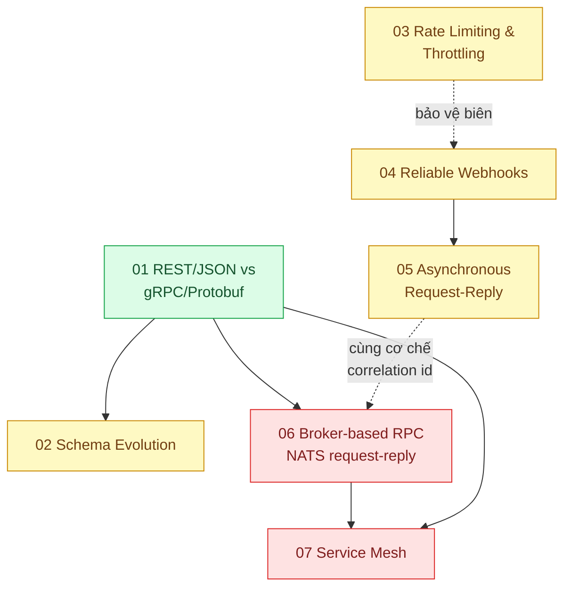

# 13 · Giao tiếp giữa các service (`backend / transporter`)

> **Phạm vi:** Cách service nói chuyện với service và với đối tác bên ngoài: giao thức và định dạng
> (REST/JSON, gRPC/Protobuf, broker), tiến hóa schema, giới hạn tốc độ ở biên, webhook đáng tin,
> yêu cầu bất đồng bộ, RPC qua broker (NATS, Moleculer "transporter"), service mesh. Giao tiếp
> frontend↔backend thuộc scope 01; hàng đợi công việc thuộc scope 14.
>
> **Câu hỏi trung tâm:** Service nói chuyện với service (và với đối tác) bằng giao thức nào, tiến
> hóa schema và chịu lỗi ra sao?

## Bản đồ pattern trong scope

## Danh sách bài toán

| # | Bài toán (pattern — triệu chứng) | Mức | Pattern gốc / nguồn | Trạng thái |
|---|---|---|---|---|
| 01 | [REST/JSON vs gRPC/Protobuf — Serialize JSON chiếm 30% CPU, contract giữa service không rõ](./01-rest-vs-grpc-json-serialize-chiem-30-phan-tram-cpu/) | 🟢 | gRPC docs; Protocol Buffers docs; DDIA ch.4 "Encoding and Evolution" | 📋 |
| 02 | [Schema Evolution & Backward Compatibility — Thêm một field làm consumer cũ sập](./02-schema-evolution-them-field-lam-sap-consumer-cu/) | 🟡 | Protobuf docs "Updating A Message Type"; Apache Avro spec (schema resolution); DDIA ch.4 | 📋 |
| 03 | [Rate Limiting & Throttling — Một khách hàng API gọi 10k req/s làm chậm tất cả khách khác](./03-rate-limiting-mot-khach-api-goi-10k-req-s/) | 🟡 | Stripe, "Scaling your API with rate limiters" (2017); Azure "Rate Limiting", "Throttling"; NGINX `ngx_http_limit_req_module`; Cloudflare (2017) | 📋 |
| 04 | [Reliable Webhooks (signature, retry, idempotent receiver) — Gửi webhook cho đối tác, họ down 5 phút là mất sự kiện](./04-webhook-delivery-doi-tac-down-5-phut-mat-su-kien/) | 🟡 | Stripe docs "Webhooks"; Standard Webhooks specification; Amazon Builders' Library "Making retries safe with idempotent APIs" | 📋 |
| 05 | [Asynchronous Request-Reply — Xử lý mất 30 giây, HTTP timeout ở 10 giây](./05-async-request-reply-xu-ly-30-giay-http-timeout/) | 🟡 | Azure "Asynchronous Request-Reply"; Hohpe & Woolf, *EIP*: Request-Reply, Correlation Identifier | 📋 |
| 06 | [Broker-based RPC (NATS request-reply, Moleculer transporter) — Service gọi nhau qua broker thay vì HTTP trực tiếp: khi nào đáng?](./06-nats-request-reply-moleculer-transporter-service-goi-nhau-qua-broker/) | 🔴 | NATS docs "Request-Reply"; Moleculer docs "Transporters"; *EIP* "Message Bus" | 📋 |
| 07 | [Service Mesh (sidecar) — mTLS, retry, tracing cho 40 service mà không sửa code từng service](./07-service-mesh-mtls-retry-tracing-khong-sua-code/) | 🔴 | Istio docs; Linkerd docs; Azure "Sidecar", "Ambassador" | 📋 |

## Lộ trình đề xuất trong scope

1. **REST vs gRPC** — đo thật CPU/độ trễ serialize trên payload của mình trước khi tin con số nào.
2. **Schema evolution** — áp dụng cho cả JSON, Protobuf, Avro và event trong queue.
3. **Rate limiting → Webhooks → Async request-reply** — ba bài về biên với bên ngoài.
4. **Broker RPC** — nếu dùng Moleculer/NATS; hiểu đánh đổi so với HTTP/gRPC trực tiếp.
5. **Service mesh** — chỉ khi số service đủ lớn để chi phí vận hành mesh đáng giá.

## Kiến thức nền cần có trước

- HTTP/2, TLS cơ bản.
- Serialization: JSON, Protobuf, Avro.
- Idempotency (scope 01 bài 03) — nền của webhook và retry.

## Liên kết với scope khác

- `01-frontend-backend-transporter` — hợp đồng API phía client; API gateway.
- `07-backend-microservices` — circuit breaker, retry/jitter dùng trên mọi kênh ở đây.
- `14-backend-queueing` — async request-reply thường cài bằng queue.
- `03-backend-cache` — Redis làm bộ đếm cho rate limiting.
- `16-backend-k8s` — service mesh chạy trên Kubernetes.

## Nguồn tổng quan cho scope

- Martin Kleppmann, *DDIA* ch.4 "Encoding and Evolution".
- Hohpe & Woolf, *Enterprise Integration Patterns* (2003).
- gRPC docs — https://grpc.io/docs/ · Protocol Buffers — https://protobuf.dev/
