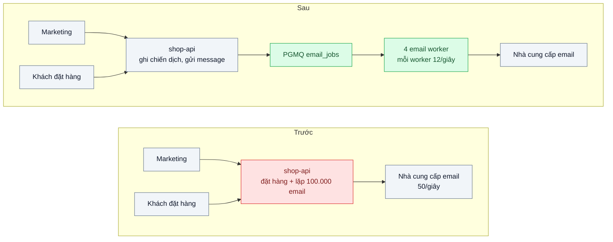
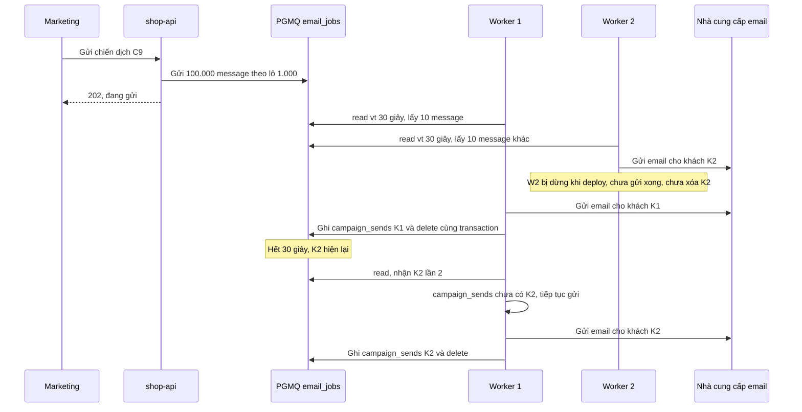

# Work Queue / Competing Consumers — Gửi 100k email marketing làm treo API đặt hàng

| Scope | Mức độ | Trạng thái | Pattern gốc | Cập nhật |
|---|---|---|---|---|
| 14 · backend / queueing / message queueing | 🟢 Cơ bản | 📋 Kế hoạch | Competing Consumers, Point-to-Point Channel — Hohpe & Woolf, *EIP* (2003); Azure "Competing Consumers" | 2026-10-06 |

> **Một câu tóm tắt:** Tách việc gửi email ra khỏi tiến trình phục vụ đặt hàng: API chỉ ghi chiến dịch và đưa từng việc vào hàng đợi PGMQ, nhiều worker ở tiến trình riêng cùng cạnh tranh lấy việc, mỗi việc chỉ do một worker xử lý — API đặt hàng không còn chung tài nguyên với 100.000 email.

## 1. Bài toán thực tế (What)

**Bối cảnh** *(doanh nghiệp giả định, số liệu minh họa)*
Sàn thương mại điện tử: đội marketing bấm "Gửi chiến dịch" trong trang quản trị; endpoint của `shop-api` — chính tiến trình đang phục vụ giỏ hàng và đặt hàng — lặp qua 100.000 khách, render template và gọi API của nhà cung cấp email theo lô `Promise.all`. Nhà cung cấp giới hạn 50 email/giây.

**Triệu chứng người kinh doanh nhìn thấy**
- Mỗi lần gửi chiến dịch, API đặt hàng chậm 5–10 giây trong khoảng 40 phút; tỷ lệ bỏ giỏ hàng tăng đúng lúc chiến dịch kéo khách vào.
- Deploy giữa chừng thì không ai biết đã gửi tới ai: gửi lại thì khách nhận hai email, không gửi thì nửa danh sách không nhận.
- Nhà cung cấp trả lỗi 429 khi vượt hạn mức; email bị bỏ qua âm thầm.

**Nguyên nhân kỹ thuật**
Việc dài, khối lượng lớn chạy trong cùng tiến trình phục vụ request: render template chiếm event loop, hàng nghìn lời gọi HTTP đồng thời chiếm socket và bộ nhớ. Tiến độ chỉ nằm trong bộ nhớ nên mất khi tiến trình khởi động lại. Không có cơ chế điều tốc theo hạn mức của nhà cung cấp.

**Ràng buộc**
- Không thêm hạ tầng mới nếu PostgreSQL sẵn có đủ dùng.
- Tôn trọng 50 email/giây: 100.000 email cần tối thiểu khoảng 33 phút.
- Mỗi khách nhận một email cho mỗi chiến dịch; chấp nhận rủi ro trùng rất nhỏ khi worker chết đúng lúc gửi.

## 2. Vì sao dùng pattern này (Why)

**Nguyên nhân gốc mà pattern nhắm vào:** việc nền chạy chung tiến trình và chung tài nguyên với request của người dùng, không có hàng đợi để tách và điều tốc.

**Pattern giải quyết thế nào:** Hohpe và Woolf mô tả *Point-to-Point Channel*: mỗi message chỉ được một consumer nhận; và *Competing Consumers*: nhiều consumer cùng đọc một kênh, mỗi message chỉ một consumer xử lý, muốn tăng thông lượng thì thêm consumer. Azure bổ sung các điều phải cân nhắc: thứ tự không được đảm bảo, xử lý phải idempotent, cần cách xử lý message lỗi và cách co giãn số consumer. Áp dụng: `shop-api` chỉ ghi chiến dịch và gửi 100.000 message (mỗi message là một khách) vào PGMQ theo lô; 4 worker ở tiến trình riêng đọc message với *visibility timeout* — message đã đọc bị ẩn trong 30 giây; xử lý xong thì xóa; worker chết thì message tự hiện lại cho worker khác. PGMQ đọc bằng `FOR UPDATE SKIP LOCKED` nên hai worker không lấy trùng một message. Tổng tốc độ 4 worker được chia cố định để không vượt 50 email/giây.

**Lựa chọn khác đã cân nhắc**

| Lựa chọn | Giải quyết được gì | Vì sao không chọn (ở bài này) |
|---|---|---|
| Giữ nguyên + tối ưu nhỏ (chạy nền bằng `setImmediate`, giới hạn đồng thời) | Trả response cho marketing ngay | Vẫn chung event loop và bộ nhớ với API; khởi động lại là mất tiến độ |
| Cron đọc bảng `campaign_recipients` trạng thái pending | Không cần hàng đợi | Phải tự viết khóa dòng, visibility timeout, retry — chính là xây lại một hàng đợi |
| BullMQ trên Redis | Rate limiter toàn cục cho mọi worker, giao diện theo dõi | Thêm Redis; là phương án tương đương nếu đội đã vận hành Redis |
| PGMQ + worker riêng (chọn) | Dùng PostgreSQL sẵn có, gửi message trong transaction, visibility timeout | Thông lượng giới hạn bởi PostgreSQL; hạn mức chung phải tự chia cho worker |

## 3. Thiết kế hệ thống (How)

### 3.1 Kiến trúc trước và sau



### 3.2 Luồng chính



### 3.3 Thành phần và trách nhiệm

| Thành phần | Trách nhiệm | Quyết định thiết kế đáng chú ý |
|---|---|---|
| `shop-api` | Ghi chiến dịch, gửi message theo lô 1.000 | Mỗi lô một transaction; message chỉ chứa `campaignId` và `customerId`, không chứa nội dung email |
| Hàng đợi `email_jobs` | Giữ việc bền vững, ẩn message đang xử lý | Visibility timeout lớn hơn p99 thời gian gửi một email |
| Email worker | Đọc, render, gửi, ghi nhận, xóa | Tiến trình riêng; tốc độ mỗi worker × số worker ≤ hạn mức nhà cung cấp |
| Bảng `campaign_sends` | Ghi khách đã được gửi, khóa duy nhất theo chiến dịch và khách | Ghi cùng transaction với `pgmq.delete`; kiểm trước khi gửi để giảm trùng |
| Xử lý lỗi nhà cung cấp | 429 hoặc 5xx: không xóa, kéo dài thời gian ẩn bằng `set_vt` có backoff | Quá số lần đọc tối đa thì chuyển hàng lỗi (bài 05) |
| Theo dõi tiến độ | Độ sâu hàng đợi, tuổi message cũ nhất, số gửi mỗi giây | Lấy từ `pgmq.metrics` và xuất ra Prometheus |

### 3.4 Điểm dễ sai khi triển khai
- **Chạy worker trong cùng tiến trình API "cho tiện".** Quay lại đúng triệu chứng ban đầu.
- **Visibility timeout ngắn hơn thời gian xử lý.** Message hiện lại khi worker đầu vẫn đang gửi, sinh email trùng; đặt lớn hơn p99 hoặc gia hạn bằng `set_vt`.
- **Gửi 100.000 message trong một transaction khổng lồ.** Giữ khóa lâu và sinh WAL lớn; chia lô.
- **Coi hàng đợi là exactly-once.** Giao nhận là at-least-once; phía xử lý phải idempotent (bài 04).
- **Thêm worker mà không chia lại hạn mức.** 8 worker × 12/giây vượt 50/giây, nhận 429 hàng loạt.
- **Không giới hạn số lần đọc.** Message lỗi vĩnh viễn quay vòng mãi, chiếm worker (bài 05).

## 4. Tech stack và tác động (Impact techstack)

| Lớp | Công nghệ chọn | Vì sao chọn | Thay thế tương đương |
|---|---|---|---|
| Hàng đợi | PGMQ trên PostgreSQL 16 | Không thêm hạ tầng; `send`, `read` với visibility timeout, `delete`, `set_vt`, `metrics` đều là hàm SQL | BullMQ (có rate limiter toàn cục), RabbitMQ |
| Ứng dụng | TypeScript strict, NestJS cho `shop-api` | Trùng stack repo | Fastify |
| Worker | Tiến trình Node riêng, gọi hàm SQL của PGMQ qua `pg` | Không cần client riêng; dễ đọc | Kysely |
| Nhà cung cấp giả | Fastify mô phỏng hạn mức 50/giây, trả 429 khi vượt, đếm email theo khách | Tái hiện hạn mức và đếm trùng | Mailpit cho SMTP |
| Tải và đo | k6 cho API đặt hàng; Prometheus cho độ sâu hàng đợi và tốc độ gửi | Đo ảnh hưởng tới khách hàng thật | Grafana |
| Hạ tầng | Docker Compose: PostgreSQL có PGMQ, API, worker, nhà cung cấp giả | Một lệnh dựng môi trường | — |

**Thay đổi so với hệ thống hiện tại:** thêm một loại tiến trình (worker) cần deploy và giám sát riêng; trang quản trị hiển thị tiến độ chiến dịch thay vì chờ; đội vận hành theo dõi độ sâu hàng đợi và tuổi message cũ nhất như chỉ số mới.

## 5. Kết quả đầu ra và cách đo (Output impact)

| Chỉ số | Trước (minh họa) | Mục tiêu khi thực hành | Cách đo |
|---|---|---|---|
| p95 API đặt hàng trong lúc gửi chiến dịch | 6.000 ms | ≤ p95 lúc bình thường + 10 % | k6 20 đơn/giây trong suốt thời gian gửi 100.000 email |
| Thời gian gửi xong 100.000 email | 40 phút kèm lỗi | ≤ 35 phút | Timestamp đầu và cuối trong `campaign_sends` |
| Khách thiếu email sau khi dừng worker 3 lần | không biết | 0 | Đối chiếu `campaign_sends` với danh sách khách |
| Email trùng | không biết | ≤ số lần worker bị dừng giữa lúc gửi | Bộ đếm theo khách ở nhà cung cấp giả |
| Phản hồi 429 từ nhà cung cấp | hàng nghìn | gần 0 | Counter ở nhà cung cấp giả |

> Số "trước" là minh họa để hình dung bài toán. Số "mục tiêu" chỉ được coi là đạt khi có số đo thật
> ở mục 8 kèm môi trường đo.

**Tác động nghiệp vụ mong đợi:** chiến dịch marketing không còn làm mất đơn hàng của chính lượng khách nó kéo về; marketing biết chính xác đã gửi tới ai.

## 6. Đánh đổi và khi KHÔNG nên dùng

**Đánh đổi**
- Thêm tiến trình worker cần deploy, giám sát và co giãn riêng.
- At-least-once và không đảm bảo thứ tự — phía xử lý phải chịu được trùng và đảo thứ tự.
- PostgreSQL gánh thêm ghi và xóa liên tục; cần theo dõi bloat và vacuum.

**Không nên dùng khi**
- Việc nhỏ dưới khoảng 100 ms và hiếm: làm đồng bộ đơn giản hơn.
- Người gọi cần kết quả ngay trong cùng request (khi đó xem bài async request-reply).
- Khối lượng hàng chục nghìn message mỗi giây vượt sức PostgreSQL: cần broker riêng (bài 02).

**Liên quan**
- Đọc trước: `../../08-backend-monolith/02-background-job-trong-monolith-xuat-excel-lam-treo-web/` — dạng đơn giản nhất của việc nền.
- Đọc sau: `../02-chon-broker-redis-rabbitmq-kafka-nats-pgmq-team-5-nguoi/`, `../04-idempotent-consumer-event-den-hai-lan-tru-kho-hai-lan/`, `../05-dead-letter-queue-mot-message-loi-chan-ca-hang-doi/`.
- Cùng chủ đề: `../../18-backend-scale/04-queue-based-load-leveling-dinh-20h-flash-sale/`; co giãn worker: `../09-consumer-lag-autoscale-hang-doi-dong-500k-message-toi-flash-sale/`.

## 7. Cơ sở tham khảo

- Hohpe & Woolf, *Enterprise Integration Patterns*, 2003, "Competing Consumers" — https://www.enterpriseintegrationpatterns.com/patterns/messaging/CompetingConsumers.html — nhiều consumer cùng đọc một kênh để tăng thông lượng.
- Hohpe & Woolf, *EIP*, "Point-to-Point Channel" — https://www.enterpriseintegrationpatterns.com/patterns/messaging/PointToPointChannel.html — mỗi message chỉ một consumer nhận.
- Microsoft Azure Architecture Center, "Competing Consumers pattern" — https://learn.microsoft.com/azure/architecture/patterns/competing-consumers — thứ tự, idempotency, message lỗi, co giãn.
- PGMQ — https://github.com/pgmq/pgmq — hàm `send`, `read` với visibility timeout, `delete`, `set_vt`, `metrics`.
- BullMQ docs — https://docs.bullmq.io/ — phương án tương đương với rate limiter toàn cục cho worker.

## 8. Kế hoạch thực hành

- [ ] Bước 1: dựng `shop-api` phiên bản "trước" gửi email trong endpoint; nhà cung cấp giả có hạn mức 50/giây; seed 100.000 khách.
- [ ] Bước 2: đo "trước": k6 20 đơn/giây trong lúc gửi chiến dịch; ghi p95 đặt hàng, số 429, thời gian gửi xong; khởi động lại giữa chừng và đếm khách thiếu.
- [ ] Bước 3: chuyển sang PGMQ: gửi message theo lô, 4 worker riêng có tốc độ chia cố định, `campaign_sends`, xử lý 429 bằng `set_vt`.
- [ ] Bước 4: đo "sau" cùng kịch bản, dừng worker 3 lần giữa chừng; ghi số thật và môi trường vào mục 5.
- [ ] Bước 5: test: (a) hai worker không bao giờ nhận cùng một message trong cùng thời gian ẩn; (b) worker chết thì message được worker khác xử lý sau visibility timeout; (c) tổng tốc độ không vượt hạn mức; (d) mọi khách nhận đúng một email khi không có sự cố.

**Cấu trúc code dự kiến**
```text
src/
  shop-api/campaigns.controller.ts   # ghi chiến dịch, gửi message theo lô
  email-worker/worker.ts             # [PATTERN] read với visibility timeout, delete khi xong
  email-worker/rate.ts               # chia hạn mức cho mỗi worker
  email-provider-mock/server.ts      # hạn mức 50/giây, đếm theo khách
test/
  no-two-workers-same-message.test.ts
  crashed-worker-message-reappears.test.ts
  total-rate-under-provider-limit.test.ts
bench/order-during-campaign.k6.js
docker-compose.yml
```

**Cách chạy** *(điền khi bắt đầu code)*
```bash
docker compose up -d
pnpm install && pnpm test
```
