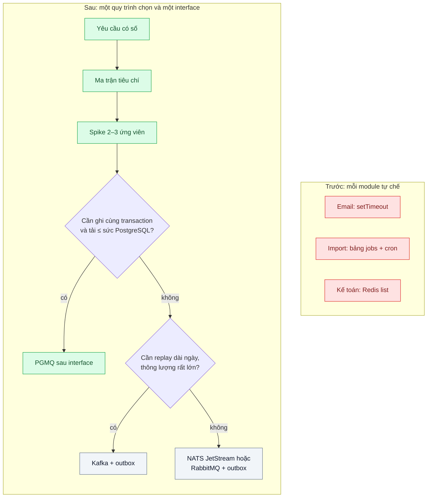
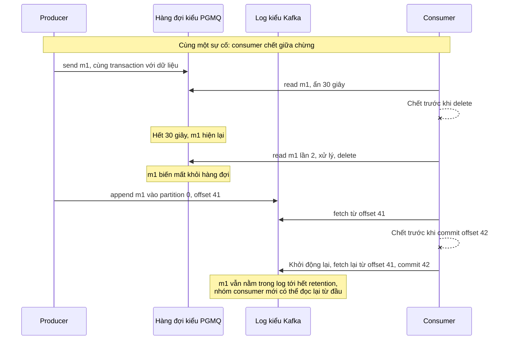

# Choosing a Broker — Team 5 người: Redis Streams, RabbitMQ, Kafka, NATS JetStream hay queue trong Postgres (PGMQ)?

| Scope | Mức độ | Trạng thái | Pattern gốc | Cập nhật |
|---|---|---|---|---|
| 14 · backend / queueing / message queueing | 🟢 Cơ bản | 📋 Kế hoạch | Message broker vs log-based broker — Kleppmann, *DDIA* ch.11 (2017); tài liệu chính thức Kafka, RabbitMQ, NATS JetStream, PGMQ | 2026-10-06 |

> **Một câu tóm tắt:** Chọn broker bằng danh sách yêu cầu thật, ma trận tiêu chí có trọng số và một spike đo nhanh trên 2–3 ứng viên, đặt broker sau một interface nhỏ để đổi được về sau — thay vì chọn theo độ nổi tiếng rồi để một người duy nhất biết vận hành.

## 1. Bài toán thực tế (What)

**Bối cảnh** *(doanh nghiệp giả định, số liệu minh họa)*
SaaS B2B quản lý bán hàng với đội backend 5 người, modular monolith NestJS + PostgreSQL 16 + Redis (đang làm cache). Cần hàng đợi cho: gửi email và thông báo (khoảng 200.000/ngày), đồng bộ dữ liệu sang phần mềm kế toán của khách, xử lý file import, và event nội bộ giữa module (đỉnh khoảng 50 event/giây). Mỗi kỹ sư đề xuất một broker theo kinh nghiệm cũ.

**Triệu chứng người kinh doanh nhìn thấy**
- Hai tuần tranh luận chưa chốt; tính năng "đồng bộ kế toán" trễ hạn với một khách lớn.
- Dự án trước của công ty chọn một broker phức tạp, cuối cùng chỉ một người biết vận hành; khi người đó nghỉ, một sự cố mất cả ngày mới xử lý xong.
- Báo giá dịch vụ broker managed cao gấp khoảng 3 lần chi phí database hiện tại.

**Nguyên nhân kỹ thuật**
Chọn theo độ phổ biến thay vì theo yêu cầu: không ai viết ra cần thông lượng bao nhiêu, có cần thứ tự, đọc lại (replay), message trễ, DLQ, ghi cùng transaction với dữ liệu nghiệp vụ hay fan-out — và mỗi lựa chọn tốn bao nhiêu công vận hành so với quy mô đội.

**Ràng buộc**
- 5 người, không có SRE riêng; tải hiện tại ≤ 100 message/giây, dự kiến gấp 10 trong 2 năm.
- Cần ghi event cùng transaction với dữ liệu nghiệp vụ; cần message trễ (retry đồng bộ kế toán) và DLQ.
- Ngân sách hạ tầng hạn chế; quyết định phải đảo ngược được với chi phí thấp.

## 2. Vì sao dùng pattern này (Why)

**Nguyên nhân gốc mà pattern nhắm vào:** thiếu tiêu chí chọn gắn với yêu cầu thật và năng lực vận hành của đội.

**Pattern giải quyết thế nào:** Kleppmann (DDIA ch.11) chia broker thành hai họ. *Message broker kiểu AMQP/JMS* (RabbitMQ, và các hàng đợi kiểu SQS như PGMQ): message bị xóa sau khi xác nhận, consumer cạnh tranh nhau — hợp với work queue. *Log-based broker* (Kafka, Redis Streams, stream của NATS JetStream): message nằm trong log có thứ tự theo partition, consumer tự giữ vị trí đọc (offset), đọc lại được và fan-out cho nhiều nhóm consumer với chi phí thấp. Bài biến phân loại đó thành quy trình: (1) viết yêu cầu có số; (2) chấm ma trận tiêu chí có trọng số; (3) spike cùng một kịch bản trên 2–3 ứng viên cuối; (4) đặt broker sau interface `publish/consume` nhỏ để đổi về sau chỉ thay adapter; (5) ghi quyết định thành ADR kèm điều kiện "khi nào xem lại". Giả thuyết ban đầu, cần spike xác nhận: PGMQ làm mặc định vì nằm trong PostgreSQL sẵn có và gửi được trong cùng transaction; NATS JetStream hoặc RabbitMQ khi cần fan-out hay thông lượng vượt PostgreSQL; Kafka khi cần replay dài ngày ở thông lượng lớn và có người vận hành.

**Lựa chọn khác đã cân nhắc**

| Lựa chọn | Giải quyết được gì | Vì sao không chọn làm mặc định (ở bài này) |
|---|---|---|
| Giữ nguyên + tối ưu nhỏ (bảng jobs + cron, không broker) | Không thêm gì | Tự viết lại visibility timeout, retry, DLQ; khó mở rộng thêm loại việc |
| Kafka | Replay, thông lượng rất lớn, hệ sinh thái stream | Công vận hành nặng với đội 5 người; tải hiện tại nhỏ; message trễ và DLQ phải tự dựng |
| RabbitMQ | Định tuyến linh hoạt, dead-letter exchange, quorum queue | Thêm một cụm phải vận hành; không chung transaction với PostgreSQL nên cần outbox |
| NATS JetStream | Một binary nhẹ, có stream và work queue, request-reply | Đội chưa quen; vẫn cần outbox |
| Redis Streams | Đã có Redis, có consumer group | Độ bền phụ thuộc cấu hình persistence; trộn vai trò cache và hàng đợi trên cùng instance |
| PGMQ (giả thuyết mặc định, kiểm bằng spike) | Không thêm hạ tầng, gửi cùng transaction, message trễ, archive | Thông lượng giới hạn bởi PostgreSQL; fan-out phải tạo nhiều hàng đợi; không replay kiểu log |

## 3. Thiết kế hệ thống (How)

### 3.1 Kiến trúc trước và sau



### 3.2 Luồng chính



### 3.3 Thành phần và trách nhiệm

| Thành phần | Trách nhiệm | Quyết định thiết kế đáng chú ý |
|---|---|---|
| Danh sách yêu cầu | Thông lượng hiện tại và 2 năm, thứ tự, replay, trễ, DLQ, transaction, fan-out | Mỗi yêu cầu có con số hoặc "không cần" |
| Ma trận tiêu chí | Chấm điểm có trọng số cho 5 lựa chọn | Trọng số "công vận hành" cao vì đội 5 người |
| Spike | Cùng kịch bản producer/consumer trên 2–3 ứng viên | Đo độ trễ đầu-cuối, hành vi khi broker khởi động lại, công dựng môi trường |
| Interface `MessageBus` + test hợp đồng | `publish`, `consume`, `ack` dùng chung; cùng bộ test chạy trên mọi adapter | Code nghiệp vụ không gọi thẳng API của broker; đổi broker chỉ là thay adapter |
| ADR | Ghi quyết định, số đo, điều kiện xem lại | Ví dụ: "xem lại khi vượt 1.000 message/giây kéo dài" |

### 3.4 Ma trận tiêu chí (điền số đo ở bước spike)

| Tiêu chí | PGMQ | RabbitMQ | Kafka | NATS JetStream | Redis Streams |
|---|---|---|---|---|---|
| Ghi cùng transaction với PostgreSQL | có | không, cần outbox | không, cần outbox | không, cần outbox | không, cần outbox |
| Đọc lại sau khi đã xử lý | qua bảng archive | không (trừ RabbitMQ Streams) | có, theo retention | có, theo cấu hình stream | có, tới khi bị cắt |
| Message trễ | có sẵn | plugin hoặc TTL + DLX | tự dựng | cần xác minh theo phiên bản | tự dựng |
| DLQ | tự dựng theo số lần đọc | có sẵn | tự dựng | giới hạn số lần giao, tự chuyển | tự dựng |
| Công vận hành với đội 5 người | thấp | trung bình | cao | thấp đến trung bình | thấp |

### 3.5 Điểm dễ sai khi triển khai
- **Chọn theo thông lượng tưởng tượng.** Thiết kế cho 100.000 message/giây khi tải thật là 100 — trả phí vận hành cho năng lực không dùng.
- **Quên công vận hành.** Nâng cấp, sao lưu, giám sát, xử lý sự cố lúc 2 giờ sáng là chi phí thật.
- **Interface quá dày.** Bọc mọi tính năng đặc thù thì mất lợi ích của broker; interface chỉ gồm phần dùng chung.
- **Spike với kịch bản khác nhau.** Mỗi ứng viên phải chạy cùng payload, cùng tải, cùng sự cố.
- **Tin "exactly-once" trên trang quảng cáo.** Mọi lựa chọn vẫn cần idempotent consumer khi có tác dụng phụ ngoài broker.

## 4. Tech stack và tác động (Impact techstack)

| Lớp | Công nghệ chọn | Vì sao chọn | Thay thế tương đương |
|---|---|---|---|
| Ứng viên spike | PGMQ, NATS JetStream, RabbitMQ trong Docker Compose | Ba đại diện: hàng đợi trong DB, broker nhẹ, broker AMQP | Thêm Kafka nếu yêu cầu replay được chấm cao |
| Ứng dụng | TypeScript strict, interface `MessageBus` với 3 adapter | Code nghiệp vụ không đổi khi đổi broker | — |
| Client | `pg` cho PGMQ, thư viện NATS chính thức, `amqplib` | Client chính thức hoặc phổ biến nhất | — |
| Đo | Script producer/consumer ghi timestamp vào mỗi message, histogram HDR | Đo độ trễ đầu-cuối như nhau cho mọi broker | k6 với extension (cần xác minh) |
| Test | Vitest test hợp đồng chạy trên cả 3 adapter | Chứng minh khả năng thay thế | — |
| Hạ tầng | Docker Compose | Dựng và hủy từng ứng viên trong vài phút | — |

**Thay đổi so với hệ thống hiện tại:** các module bỏ cơ chế tự chế, dùng chung interface `MessageBus`; nếu PGMQ được chọn thì không thêm hạ tầng, chỉ thêm extension vào PostgreSQL; ADR trở thành nơi tra cứu khi có người đề xuất đổi broker.

## 5. Kết quả đầu ra và cách đo (Output impact)

| Chỉ số | Trước (minh họa) | Mục tiêu khi thực hành | Cách đo |
|---|---|---|---|
| Thời gian ra quyết định | 2 tuần tranh luận | ≤ 3 ngày | Lịch sử ADR |
| p99 độ trễ đầu-cuối ở 100 và 1.000 message/giây | chưa đo | ghi số thật cho từng ứng viên | Script tải, histogram HDR |
| Message mất khi khởi động lại broker giữa tải | chưa đo | 0 với cấu hình bền vững | Đối chiếu id đã gửi với id đã nhận |
| Thành phần hạ tầng mới phải vận hành | — | ghi rõ cho từng ứng viên | Đếm service trong `docker-compose.yml` |
| Chi phí đổi broker | không biết | chỉ thay adapter | Test hợp đồng xanh trên cả 3 adapter |

> Số "trước" là minh họa để hình dung bài toán. Số "mục tiêu" chỉ được coi là đạt khi có số đo thật
> ở mục 8 kèm môi trường đo.

**Tác động nghiệp vụ mong đợi:** tính năng phụ thuộc hàng đợi không còn bị chặn bởi tranh luận công nghệ; công ty không phụ thuộc vào một người duy nhất biết vận hành broker.

## 6. Đánh đổi và khi KHÔNG nên dùng

**Đánh đổi**
- Chọn cái đơn giản bây giờ có thể phải chuyển sau; interface và ADR là bảo hiểm cho việc đó.
- Interface chung có thể che mất tính năng đặc thù đáng giá của một broker; nếu chọn PGMQ, hàng đợi chia tài nguyên với database chính.

**Không nên dùng khi**
- Đã cần hàng chục nghìn message mỗi giây hoặc replay nhiều tuần cho phân tích: đi thẳng tới broker log-based.
- Công ty đã có đội vận hành một broker chung chất lượng tốt: dùng cái sẵn có.
- Chỉ có một loại việc nền đơn giản: thư viện job trong monolith là đủ.

**Liên quan**
- Đọc trước: `../01-work-queue-gui-100k-email-lam-treo-api/`. Đọc sau: `../03-transactional-outbox-ghi-don-xong-crash-mat-event/` — cái giá khi broker nằm ngoài database; `../06-ordering-partition-key-trang-thai-don-den-sai-thu-tu/` — khi cần partition.
- Interface tách broker: `../../08-backend-monolith/04-hexagonal-architecture-doi-cong-thanh-toan-phai-sua-20-file/`; NATS cho RPC: `../../13-backend-transporter/06-nats-request-reply-moleculer-transporter-service-goi-nhau-qua-broker/`.

## 7. Cơ sở tham khảo

- Martin Kleppmann, *Designing Data-Intensive Applications*, O'Reilly, 2017, ch.11 "Stream Processing" — so sánh message broker kiểu AMQP/JMS với log-based broker, ack và offset.
- Apache Kafka docs, "Design" — https://kafka.apache.org/documentation/#design — log, partition, consumer group, retention.
- RabbitMQ docs — https://www.rabbitmq.com/docs — quorum queue, stream, dead-letter exchange.
- NATS docs, "JetStream" — https://docs.nats.io/nats-concepts/jetstream — stream, consumer, giới hạn số lần giao.
- PGMQ — https://github.com/pgmq/pgmq — hàng đợi kiểu SQS trong PostgreSQL, message trễ, archive.
- Redis docs, "Streams" — https://redis.io/docs/ — consumer group, pending entries, persistence.

## 8. Kế hoạch thực hành

- [ ] Bước 1: viết danh sách yêu cầu có số và chấm ma trận tiêu chí; chọn 2–3 ứng viên cho spike.
- [ ] Bước 2: viết interface `MessageBus` và kịch bản spike chung (producer ghi timestamp, consumer đo độ trễ, tiêm sự cố khởi động lại broker và kill consumer).
- [ ] Bước 3: viết adapter cho PGMQ, NATS JetStream, RabbitMQ; chạy test hợp đồng trên cả ba.
- [ ] Bước 4: chạy spike ở 100 và 1.000 message/giây, ghi số thật và môi trường vào mục 5 và cột ma trận; viết ADR.
- [ ] Bước 5: test: (a) test hợp đồng xanh trên mọi adapter; (b) kill consumer giữa chừng không mất message trên mọi ứng viên; (c) với PGMQ, rollback transaction thì message không được gửi.

**Cấu trúc code dự kiến**
```text
src/
  message-bus/message-bus.ts       # [PATTERN] interface publish/consume/ack
  message-bus/pgmq-adapter.ts
  message-bus/nats-adapter.ts
  message-bus/rabbitmq-adapter.ts
  spike/producer.ts, consumer.ts   # ghi timestamp, histogram độ trễ đầu-cuối
test/
  message-bus.contract.test.ts     # chạy trên mọi adapter
  pgmq-rollback-sends-nothing.test.ts
docs/adr-001-broker-choice.md
docker-compose.yml                 # postgres+pgmq, nats, rabbitmq
```

**Cách chạy** *(điền khi bắt đầu code)*
```bash
docker compose up -d
pnpm install && pnpm test
```
