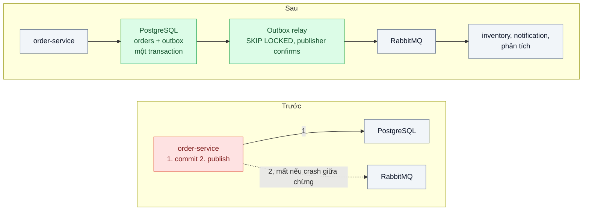
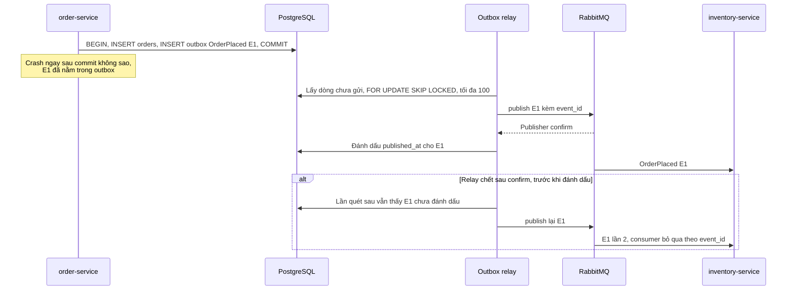

# Transactional Outbox — Ghi đơn hàng xong, crash trước khi publish → event mất, kho không trừ

| Scope | Mức độ | Trạng thái | Pattern gốc | Cập nhật |
|---|---|---|---|---|
| 14 · backend / queueing / message queueing | 🟡 Trung bình | 📋 Kế hoạch | Transactional Outbox — microservices.io (Richardson); *Microservices Patterns* (2018) | 2026-10-06 |

> **Một câu tóm tắt:** Ghi event `OrderPlaced` vào bảng outbox trong cùng transaction với đơn hàng, rồi để một relay đọc outbox và publish lên broker, chỉ đánh dấu "đã gửi" khi broker xác nhận — không còn khoảnh khắc nào mà đơn đã lưu nhưng event có thể mất.

## 1. Bài toán thực tế (What)

**Bối cảnh** *(doanh nghiệp giả định, số liệu minh họa)*
Sàn thương mại điện tử: `order-service` (PostgreSQL) ghi đơn rồi publish `OrderPlaced` lên RabbitMQ — broker công ty đang dùng — cho `inventory-service`, `notification-service` và hệ thống phân tích. Khoảng 50.000 đơn/ngày, deploy `order-service` vài lần mỗi tuần.

**Triệu chứng người kinh doanh nhìn thấy**
- Mỗi tuần vài chục đơn "có trong hệ thống nhưng kho không trừ": bán vượt tồn kho, phải hủy đơn và xin lỗi khách.
- Thỉnh thoảng ngược lại: kho bị trừ cho đơn không tồn tại, hàng "biến mất" khỏi kệ ảo.
- Đội vận hành đối soát đơn và tồn kho bằng tay mỗi sáng.

**Nguyên nhân kỹ thuật**
*Dual write*: ghi vào hai hệ thống không chung transaction. Code hiện tại `await tx.commit(); await channel.publish(...)` — crash, deploy hoặc mất kết nối broker giữa hai lệnh là event mất. Đảo thứ tự (publish trước, commit sau) thì sinh event "ma" khi commit thất bại. Publish lại không chờ broker xác nhận, nên ngay cả lệnh publish "thành công" cũng chưa chắc broker đã nhận.

**Ràng buộc**
- Giữ RabbitMQ vì nhiều consumer đang dùng; không dùng transaction phân tán.
- Độ trễ từ lúc đặt đơn tới lúc consumer nhận event p99 ≤ 1 giây là chấp nhận được.
- Consumer phải chịu được event trùng (bài 04).

## 2. Vì sao dùng pattern này (Why)

**Nguyên nhân gốc mà pattern nhắm vào:** hai lần ghi vào hai hệ thống khác nhau không thể nguyên tử với nhau.

**Pattern giải quyết thế nào:** Richardson mô tả Transactional Outbox: thay vì publish trực tiếp, service ghi event vào bảng outbox *trong cùng transaction cục bộ* với thay đổi nghiệp vụ — hoặc cả hai cùng được lưu, hoặc không cái nào. Một tiến trình *relay* đọc outbox và publish lên broker theo một trong hai cách: *Polling publisher* (định kỳ truy vấn các dòng chưa gửi) hoặc *Transaction log tailing* (đọc log ghi của database, ví dụ Debezium với Outbox Event Router). Relay có thể publish lặp nếu chết sau khi publish nhưng trước khi đánh dấu, nên đảm bảo đạt được là *at-least-once*; consumer phải idempotent theo `event_id`. Bài chọn polling publisher vì đơn giản, không cần thêm Kafka Connect; relay dùng *publisher confirms* của RabbitMQ để chỉ đánh dấu dòng đã gửi khi broker xác nhận đã nhận.

**Lựa chọn khác đã cân nhắc**

| Lựa chọn | Giải quyết được gì | Vì sao không chọn (ở bài này) |
|---|---|---|
| Giữ nguyên + tối ưu nhỏ (retry publish trong code, job đối soát mỗi sáng) | Giảm số event mất | Crash giữa commit và publish vẫn mất; đối soát là chữa cháy sau khi khách đã chịu |
| Publish trước, commit sau | Không mất event khi commit thành công | Sinh event cho đơn không tồn tại khi commit thất bại |
| Transaction phân tán giữa PostgreSQL và broker | Nguyên tử về lý thuyết | RabbitMQ không tham gia transaction phân tán với PostgreSQL; chậm và phức tạp |
| Đưa hàng đợi vào cùng PostgreSQL (PGMQ) | Gửi trong cùng transaction, hết dual write | Consumer hiện có đọc từ RabbitMQ; hợp khi consumer dùng chung database (bài 04, saga ở scope 07) |
| Outbox + polling publisher (chọn); log tailing bằng Debezium ở bước tùy chọn | Nguyên tử với database, không đổi consumer | Thêm relay, độ trễ vài trăm ms, at-least-once |

## 3. Thiết kế hệ thống (How)

### 3.1 Kiến trúc trước và sau



### 3.2 Luồng chính



### 3.3 Thành phần và trách nhiệm

| Thành phần | Trách nhiệm | Quyết định thiết kế đáng chú ý |
|---|---|---|
| Bảng `outbox` | `id`, `aggregate_type`, `aggregate_id`, `event_type`, `payload`, `created_at`, `published_at` | Partial index trên các dòng `published_at IS NULL` để quét nhanh |
| Ghi nghiệp vụ | Ghi đơn và dòng outbox trong cùng transaction | Repository nhận transaction từ ngoài, không tự mở transaction riêng |
| Outbox relay | Quét theo lô, publish, chờ confirm, đánh dấu | `FOR UPDATE SKIP LOCKED` để chạy nhiều relay không publish trùng hàng loạt |
| `event_id` | UUID sinh ở producer, đi theo event tới consumer | Là khóa khử trùng của consumer; không dùng id do broker cấp |
| Dọn outbox | Xóa dòng đã gửi quá 7 ngày | Hoặc partition theo ngày để xóa nhanh |
| Đo outbox lag | Tuổi dòng chưa gửi cũ nhất | Cảnh báo khi vượt 30 giây — broker hoặc relay đang có vấn đề |

### 3.4 Điểm dễ sai khi triển khai
- **Publish bên trong transaction trước khi commit.** Vẫn là dual write, chỉ đổi chỗ.
- **Đánh dấu "đã gửi" trước khi broker xác nhận.** Broker chưa nhận mà dòng đã đánh dấu là event mất.
- **Không có `event_id` ổn định.** Consumer không thể khử trùng khi relay publish lại.
- **Nhiều relay không khóa dòng.** Mọi relay cùng publish một lô; dùng `SKIP LOCKED`.
- **Giả định thứ tự toàn cục.** Nhiều relay song song và publish lại có thể đảo thứ tự event của cùng một đơn; nếu cần thứ tự, xem bài 06.
- **Polling quá dày hoặc quá thưa.** Quá dày tốn tải database, quá thưa tăng độ trễ; `LISTEN/NOTIFY` của PostgreSQL có thể đánh thức relay ngay khi có dòng mới.

## 4. Tech stack và tác động (Impact techstack)

| Lớp | Công nghệ chọn | Vì sao chọn | Thay thế tương đương |
|---|---|---|---|
| Ứng dụng | TypeScript strict, NestJS cho `order-service`; relay là tiến trình Node riêng | Trùng stack repo; relay co giãn độc lập | Fastify |
| Database | PostgreSQL 16: bảng `outbox`, partial index, `SKIP LOCKED` | Transaction cục bộ là nền của pattern | — |
| Truy vấn | Kysely | Transaction tường minh, type-safe | Prisma |
| Broker | RabbitMQ (broker sẵn có trong bối cảnh), publisher confirms | Bài cần broker tách khỏi database để tái hiện dual write; confirm cho biết broker đã nhận | Kafka, NATS JetStream |
| Client | `amqplib` với confirm channel | Client AMQP phổ biến cho Node | `rabbitmq-client` |
| Log tailing (tùy chọn) | Debezium với Outbox Event Router | So sánh: không polling, đọc log ghi của PostgreSQL | — (đích RabbitMQ qua Debezium Server cần xác minh) |
| Tiêm lỗi, test | Điểm crash có chủ đích giữa commit và publish, `docker kill` relay, dừng RabbitMQ; Vitest + script đối soát | Chứng minh không mất event | Toxiproxy |

**Thay đổi so với hệ thống hiện tại:** `order-service` không publish trực tiếp nữa; thêm bảng `outbox`, tiến trình relay và job dọn dẹp; consumer phải khử trùng theo `event_id`. Đội vận hành theo dõi outbox lag như chỉ số sức khỏe của đường event.

## 5. Kết quả đầu ra và cách đo (Output impact)

| Chỉ số | Trước (minh họa) | Mục tiêu khi thực hành | Cách đo |
|---|---|---|---|
| Event mất sau 10.000 đơn với 50 lần crash tiêm giữa commit và publish | khoảng 50 | 0 | Đối soát: mọi đơn có ít nhất một `OrderPlaced` được consumer nhận |
| Event "ma" (có event, không có đơn) | có khi đảo thứ tự | 0 | Đối soát ngược từ event về đơn |
| Độ trễ từ commit tới consumer nhận | khoảng 10 ms khi không lỗi | p99 ≤ 1 giây | So `created_at` của outbox với thời điểm consumer nhận |
| Event publish trùng khi kill relay 20 lần | — | ghi số thật; consumer xử lý mỗi `event_id` một lần | Đếm `event_id` trùng ở consumer |
| Outbox lag khi RabbitMQ dừng 5 phút | — | về 0 trong ≤ 1 phút sau khi broker lên lại | Metric tuổi dòng chưa gửi cũ nhất |

> Số "trước" là minh họa để hình dung bài toán. Số "mục tiêu" chỉ được coi là đạt khi có số đo thật
> ở mục 8 kèm môi trường đo.

**Tác động nghiệp vụ mong đợi:** không còn đơn bán vượt tồn kho vì event mất; đội vận hành bỏ được buổi đối soát mỗi sáng.

## 6. Đánh đổi và khi KHÔNG nên dùng

**Đánh đổi**
- Thêm relay phải vận hành và giám sát; thêm độ trễ vài trăm mili giây.
- At-least-once: mọi consumer phải idempotent.
- Bảng outbox tăng tải ghi cho database chính và cần dọn định kỳ.

**Không nên dùng khi**
- Hàng đợi nằm trong cùng database (PGMQ): gửi message trong transaction là đủ, không cần relay.
- Event không quan trọng, mất vài cái chấp nhận được (số liệu phân tích ước lượng).
- Dữ liệu nghiệp vụ không nằm trong hệ thống có transaction: cần cách khác như CDC từ nguồn hoặc đối soát.

**Liên quan**
- Đọc sau: `../04-idempotent-consumer-event-den-hai-lan-tru-kho-hai-lan/` — nửa còn lại của at-least-once.
- Dùng trong: `../../07-backend-microservices/07-saga-dat-hang-tru-kho-thanh-toan-hoan-tien-khi-loi/`, `../../13-backend-transporter/04-webhook-delivery-doi-tac-down-5-phut-mat-su-kien/`.
- Cùng cơ chế đọc log ghi: `../../05-backend-search/05-cdc-dong-bo-index-du-lieu-search-lech-db/`; dữ liệu riêng từng service: `../../07-backend-microservices/02-database-per-service-hai-service-cung-sua-mot-bang/`.

## 7. Cơ sở tham khảo

- Chris Richardson, "Pattern: Transactional outbox", microservices.io — https://microservices.io/patterns/data/transactional-outbox.html — vấn đề dual write và lời giải ghi event cùng transaction.
- Chris Richardson, "Pattern: Polling publisher" — https://microservices.io/patterns/data/polling-publisher.html — và "Pattern: Transaction log tailing" — https://microservices.io/patterns/data/transaction-log-tailing.html — hai cách hiện thực relay.
- Chris Richardson, *Microservices Patterns*, Manning, 2018, ch.3 — publish event một cách tin cậy trong kiến trúc microservices.
- Debezium docs, "Outbox Event Router" — https://debezium.io/documentation/ — định tuyến dòng outbox đọc từ log ghi thành event.
- RabbitMQ docs, "Consumer Acknowledgements and Publisher Confirms" — https://www.rabbitmq.com/docs/confirms — cách biết broker đã nhận message.
- PostgreSQL docs, `SELECT` — mệnh đề `FOR UPDATE SKIP LOCKED` — https://www.postgresql.org/docs/16/sql-select.html — cho nhiều relay quét outbox song song.

## 8. Kế hoạch thực hành

- [ ] Bước 1: dựng `order-service` phiên bản "trước" (commit rồi publish), RabbitMQ, `inventory-service` đếm event nhận được; điểm crash có chủ đích giữa commit và publish.
- [ ] Bước 2: đo "trước": 10.000 đơn với 50 lần crash; chạy đối soát, ghi số event mất và event "ma".
- [ ] Bước 3: thêm bảng outbox, ghi cùng transaction, relay polling với `SKIP LOCKED` và publisher confirms, job dọn dẹp, metric outbox lag.
- [ ] Bước 4: đo "sau" cùng kịch bản, thêm kill relay và dừng RabbitMQ 5 phút; ghi số thật và môi trường vào mục 5; (tùy chọn) thử Debezium.
- [ ] Bước 5: test: (a) crash sau commit không mất event; (b) rollback không sinh event; (c) hai relay song song không publish trùng cả lô; (d) relay chết trước khi đánh dấu thì event được publish lại với cùng `event_id`.

**Cấu trúc code dự kiến**
```text
src/
  order/place-order.ts             # [PATTERN] INSERT orders + INSERT outbox trong một transaction
  outbox/outbox-relay.ts           # [PATTERN] SKIP LOCKED, publish, chờ confirm, đánh dấu
  outbox/outbox-cleanup.ts
  inventory/consumer.ts            # đếm event theo event_id
  legacy/place-order-dual-write.ts # phiên bản "trước"
test/
  crash-after-commit-loses-nothing.test.ts
  rollback-emits-nothing.test.ts
  two-relays-no-bulk-duplicates.test.ts
scripts/reconcile-orders-events.ts
docker-compose.yml                 # postgres, rabbitmq, (tùy chọn) debezium
```

**Cách chạy** *(điền khi bắt đầu code)*
```bash
docker compose up -d
pnpm install && pnpm test
```
