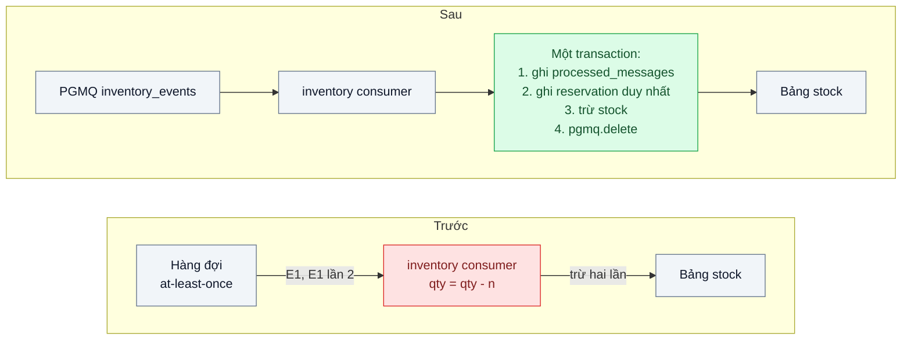
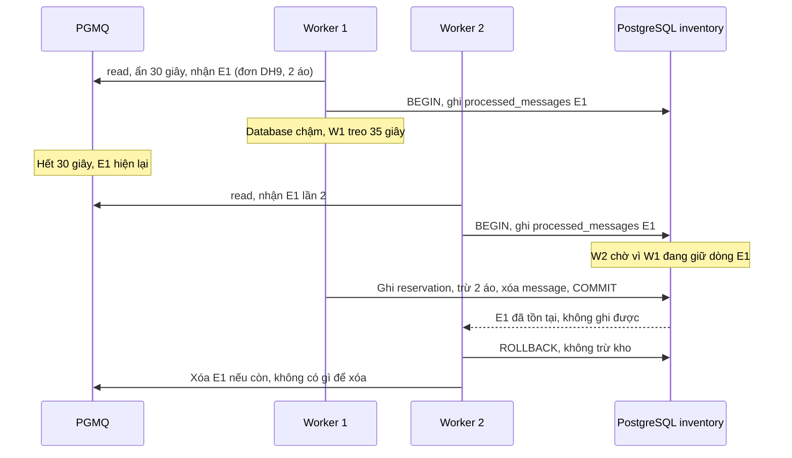

# Idempotent Consumer — Event tới hai lần (at-least-once), kho bị trừ hai lần

| Scope | Mức độ | Trạng thái | Pattern gốc | Cập nhật |
|---|---|---|---|---|
| 14 · backend / queueing / message queueing | 🟡 Trung bình | 📋 Kế hoạch | Idempotent Consumer — microservices.io (Richardson); *EIP* "Idempotent Receiver" (Hohpe & Woolf, 2003) | 2026-10-06 |

> **Một câu tóm tắt:** Ghi `event_id` vào bảng `processed_messages` trong cùng transaction với việc trừ kho, kèm ràng buộc duy nhất theo nghiệp vụ, để event tới lần thứ hai bị nhận ra và bỏ qua — chấp nhận rằng hàng đợi nào cũng giao at-least-once và xử lý trùng ở phía consumer.

## 1. Bài toán thực tế (What)

**Bối cảnh** *(doanh nghiệp giả định, số liệu minh họa)*
Tiếp nối bài 03 ở sàn thương mại điện tử: `inventory-service` nhận `OrderPlaced` và trừ tồn kho. Bài thực hành dùng PGMQ nằm trong chính database của `inventory-service` để tái hiện dễ; nguyên lý giống hệt khi event đến từ RabbitMQ hay Kafka. Khoảng 50.000 đơn/ngày, đỉnh 200 event/giây lúc flash sale.

**Triệu chứng người kinh doanh nhìn thấy**
- Mỗi tuần vài trăm đơn vị sản phẩm lệch tồn kho: hệ thống báo "hết hàng" trong khi kho còn, mất doanh thu; kiểm kê cuối tháng lệch.
- Lệch tăng vọt sau mỗi lần deploy `inventory-service` hoặc khi database chậm.
- Đội kho mất khoảng một ngày mỗi tháng để điều chỉnh tay.

**Nguyên nhân kỹ thuật**
Hàng đợi thực tế giao *at-least-once*: relay outbox publish lại sau khi chết (bài 03); consumer xử lý xong nhưng chết trước khi xác nhận; xử lý lâu hơn visibility timeout nên message hiện lại cho worker khác trong khi worker đầu vẫn đang chạy. Consumer hiện chạy `UPDATE stock SET qty = qty - n` mà không kiểm event đã xử lý chưa — mỗi lần giao lại là một lần trừ.

**Ràng buộc**
- Không có broker nào cho "exactly-once" với tác dụng phụ ra database bên ngoài; giải pháp nằm ở consumer.
- Event mang `event_id` do producer sinh (từ outbox); event có thể được phát lại từ DLQ tới 7 ngày sau.
- Độ trễ thêm mỗi message nhỏ (p99 ≤ 3 ms, minh họa).

## 2. Vì sao dùng pattern này (Why)

**Nguyên nhân gốc mà pattern nhắm vào:** thao tác không idempotent (trừ tương đối) gặp cơ chế giao nhận at-least-once.

**Pattern giải quyết thế nào:** Hohpe và Woolf mô tả *Idempotent Receiver*: phía nhận xử lý an toàn khi nhận cùng một message nhiều lần — hoặc vì bản thân thao tác idempotent về ngữ nghĩa, hoặc vì phía nhận nhớ id đã xử lý để bỏ qua. Richardson cụ thể hóa thành *Idempotent Consumer*: ghi message id vào bảng `processed_messages` trong cùng transaction với cập nhật nghiệp vụ; lần thứ hai vi phạm khóa chính nên bị bỏ qua. Tài liệu Kafka phân biệt at-most-once, at-least-once và exactly-once, và nói rõ exactly-once của Kafka áp dụng cho luồng đọc-ghi giữa các topic; khi tác dụng phụ đi ra hệ thống ngoài, phía ghi vẫn phải tự khử trùng. Bài dùng hai lớp: bảng `processed_messages` theo `(consumer, event_id)`, và ràng buộc duy nhất theo nghiệp vụ — `reservations(order_id, sku)` — để ngay cả khi lớp thứ nhất bị bỏ qua do lỗi lập trình, kho vẫn không bị trừ hai lần. Vì PGMQ nằm cùng database, việc xóa message cũng nằm trong transaction đó.

**Lựa chọn khác đã cân nhắc**

| Lựa chọn | Giải quyết được gì | Vì sao không chọn (ở bài này) |
|---|---|---|
| Giữ nguyên + tối ưu nhỏ (tăng visibility timeout, xác nhận message trước khi xử lý) | Giảm trùng do timeout | Xác nhận trước biến hệ thống thành at-most-once: chết giữa chừng là mất đơn; trùng từ relay vẫn còn |
| Khử trùng bằng Redis `SET NX` có TTL | Nhanh | Không chung transaction với database: đặt khóa xong chết trước khi trừ kho thì event bị bỏ qua vĩnh viễn |
| Dựa vào "exactly-once" của broker | — | Chỉ đúng trong phạm vi broker; tác dụng phụ ra database vẫn trùng |
| `processed_messages` cùng transaction + ràng buộc duy nhất theo nghiệp vụ (chọn) | Khử trùng nguyên tử, có lớp phòng thủ thứ hai | Thêm một lần ghi mỗi message; phải dọn bảng định kỳ |

## 3. Thiết kế hệ thống (How)

### 3.1 Kiến trúc trước và sau



### 3.2 Luồng chính



### 3.3 Thành phần và trách nhiệm

| Thành phần | Trách nhiệm | Quyết định thiết kế đáng chú ý |
|---|---|---|
| `event_id` | Danh tính ổn định của event, sinh ở producer | Không dùng `msg_id` của PGMQ hay delivery tag của RabbitMQ — publish lại sẽ có id mới |
| Bảng `processed_messages` | Khóa chính `(consumer_name, event_id)`, cột `processed_at` | Mỗi consumer một không gian khóa riêng |
| Transaction xử lý | Ghi khóa khử trùng → ghi reservation → trừ kho → xóa message | Đọc message ở câu lệnh riêng, ngoài transaction này, để không giữ khóa dòng message lâu |
| Ràng buộc nghiệp vụ | `reservations` duy nhất theo `(order_id, sku)` | Lớp phòng thủ thứ hai, không phụ thuộc lớp khử trùng |
| Dọn bảng khử trùng | Xóa bản ghi quá 14 ngày | Dài hơn thời gian event có thể được phát lại từ DLQ (7 ngày) |
| Metric | Counter `duplicate_skipped` theo consumer | Tăng đột biến là dấu hiệu relay hoặc visibility timeout có vấn đề |

### 3.4 Điểm dễ sai khi triển khai
- **Khử trùng theo id của broker.** Relay publish lại tạo id mới; chỉ `event_id` của producer mới ổn định.
- **Ghi khóa khử trùng và cập nhật nghiệp vụ ở hai transaction** (hoặc ở hai hệ thống như Redis và database): chết ở giữa là mất hoặc trùng.
- **Dọn bảng khử trùng quá sớm.** Event phát lại từ DLQ sau khi khóa đã bị xóa sẽ bị xử lý lần hai.
- **Tác dụng phụ ra ngoài database.** Gửi email hay gọi API không nằm trong transaction; cần idempotency key phía ngoài hoặc một outbox nữa.
- **Giữ khóa dòng message trong transaction dài.** Đọc message trong cùng transaction xử lý dễ gây deadlock với worker khác; tách câu lệnh đọc.
- **Nghĩ rằng idempotent là đủ cho thứ tự.** Khử trùng không sửa được event tới sai thứ tự (bài 06).

## 4. Tech stack và tác động (Impact techstack)

| Lớp | Công nghệ chọn | Vì sao chọn | Thay thế tương đương |
|---|---|---|---|
| Hàng đợi | PGMQ trong database của `inventory-service` | Xóa message nằm cùng transaction với xử lý; dễ tái hiện trùng bằng visibility timeout ngắn | RabbitMQ, Kafka — khi đó xác nhận message nằm ngoài transaction, khử trùng càng cần |
| Database | PostgreSQL 16, `INSERT ... ON CONFLICT DO NOTHING` | Khử trùng nguyên tử bằng khóa chính | — |
| Truy vấn | Kysely | Transaction tường minh, type-safe | Prisma |
| Ứng dụng | TypeScript strict, worker Node | Trùng stack repo | NestJS |
| Tiêm lỗi | Visibility timeout ngắn + xử lý chậm có chủ đích; gửi trùng event; kill worker giữa chừng | Tái hiện ba nguồn trùng thường gặp | Toxiproxy làm chậm database |
| Test, đo | Vitest test tích hợp; script đối soát tồn kho; Prometheus | Chứng minh tồn kho đúng sau mọi sự cố | — |
| Hạ tầng | Docker Compose | PostgreSQL có PGMQ, worker | — |

**Thay đổi so với hệ thống hiện tại:** consumer bọc mọi xử lý trong một transaction có bước khử trùng; thêm bảng `processed_messages`, ràng buộc duy nhất cho `reservations`, job dọn dẹp và metric số event trùng. Mọi đội viết consumer mới phải theo cùng khuôn này.

## 5. Kết quả đầu ra và cách đo (Output impact)

| Chỉ số | Trước (minh họa) | Mục tiêu khi thực hành | Cách đo |
|---|---|---|---|
| Sai lệch tồn kho sau 10.000 event với 5 % gửi trùng và 20 lần kill worker | vài trăm đơn vị | 0 | So tồn kho cuối với tổng số lượng của các đơn hợp lệ |
| Đơn bị trừ kho nhiều hơn một lần | có | 0 | Truy vấn `reservations` nhóm theo đơn, đếm bản ghi lặp |
| Event trùng được nhận ra và bỏ qua | không đo | bằng số trùng đã tiêm | Counter `duplicate_skipped` |
| Độ trễ thêm mỗi message | — | p99 ≤ 3 ms | Histogram quanh transaction xử lý |
| Kích thước bảng khử trùng | — | ổn định quanh cửa sổ 14 ngày | Đếm dòng trước và sau job dọn |

> Số "trước" là minh họa để hình dung bài toán. Số "mục tiêu" chỉ được coi là đạt khi có số đo thật
> ở mục 8 kèm môi trường đo.

**Tác động nghiệp vụ mong đợi:** tồn kho hiển thị khớp kho thật nên không còn mất doanh thu vì "hết hàng ảo"; đội kho bỏ được ngày điều chỉnh tay hằng tháng.

## 6. Đánh đổi và khi KHÔNG nên dùng

**Đánh đổi**
- Thêm một lần ghi và một bảng phải dọn cho mỗi consumer.
- Không bảo vệ được tác dụng phụ ra ngoài database; những chỗ đó cần cơ chế riêng.
- Khuôn khử trùng phải lặp lại ở mọi consumer — cần thư viện nhỏ dùng chung để không ai quên.

**Không nên dùng khi**
- Thao tác đã tự idempotent: đặt trạng thái tuyệt đối, upsert theo khóa tự nhiên.
- Consumer chỉ đọc và tính toán, không có tác dụng phụ.
- Mất message chấp nhận được còn xử lý trùng gây hại nặng: chọn at-most-once một cách có chủ đích.

**Liên quan**
- Đọc trước: `../03-transactional-outbox-ghi-don-xong-crash-mat-event/`; đọc sau: `../05-dead-letter-queue-mot-message-loi-chan-ca-hang-doi/`, `../06-ordering-partition-key-trang-thai-don-den-sai-thu-tu/`.
- Dùng trong: `../../07-backend-microservices/07-saga-dat-hang-tru-kho-thanh-toan-hoan-tien-khi-loi/`, `../../13-backend-transporter/04-webhook-delivery-doi-tac-down-5-phut-mat-su-kien/`.
- Cùng ý tưởng ở biên HTTP: `../../01-frontend-backend-transporter/03-idempotency-key-bam-thanh-toan-hai-lan/`.

## 7. Cơ sở tham khảo

- Chris Richardson, "Pattern: Idempotent Consumer", microservices.io — https://microservices.io/patterns/communication-style/idempotent-consumer.html — ghi id message đã xử lý cùng transaction với cập nhật nghiệp vụ.
- Hohpe & Woolf, *Enterprise Integration Patterns*, 2003, "Idempotent Receiver" — https://www.enterpriseintegrationpatterns.com/patterns/messaging/IdempotentReceiver.html — hai cách đạt idempotent: ngữ nghĩa thao tác và nhớ id.
- Apache Kafka docs, "Message Delivery Semantics" — https://kafka.apache.org/documentation/#semantics — at-most-once, at-least-once, exactly-once và phạm vi của chúng.
- Amazon Builders' Library, "Making retries safe with idempotent APIs" — https://aws.amazon.com/builders-library/ — vì sao retry chỉ an toàn khi phía nhận idempotent.
- PostgreSQL docs, `INSERT ... ON CONFLICT` — https://www.postgresql.org/docs/16/sql-insert.html — khử trùng nguyên tử bằng ràng buộc duy nhất.
- PGMQ — https://github.com/pgmq/pgmq — visibility timeout và xóa message bằng SQL trong transaction.

## 8. Kế hoạch thực hành

- [ ] Bước 1: dựng `inventory-service` với PGMQ, consumer phiên bản "trước" trừ kho trực tiếp; producer giả lập có thể gửi trùng event.
- [ ] Bước 2: đo "trước": 10.000 event, 5 % gửi trùng, visibility timeout ngắn kèm xử lý chậm ngẫu nhiên, kill worker 20 lần; chạy đối soát tồn kho.
- [ ] Bước 3: thêm `processed_messages`, ràng buộc duy nhất `reservations`, transaction bốn bước, đọc message ngoài transaction, job dọn và metric.
- [ ] Bước 4: đo "sau" cùng kịch bản, ghi số thật và môi trường vào mục 5.
- [ ] Bước 5: test: (a) cùng `event_id` gửi hai lần chỉ trừ kho một lần; (b) hai worker xử lý đồng thời cùng event chỉ một worker thành công; (c) kill worker sau khi trừ kho nhưng trước commit thì event được xử lý lại đúng một lần; (d) event phát lại sau 7 ngày vẫn bị nhận ra là trùng.

**Cấu trúc code dự kiến**
```text
src/
  inventory/consumer.ts            # đọc message, gọi handler
  inventory/handle-order-placed.ts # [PATTERN] khử trùng + reservation + trừ kho + delete trong một transaction
  inventory/cleanup-processed.ts
  shared/idempotent-handler.ts     # khuôn dùng chung cho mọi consumer
  legacy/naive-consumer.ts         # phiên bản "trước"
test/
  same-event-twice-deducts-once.test.ts
  concurrent-workers-one-wins.test.ts
  replay-after-7-days-is-duplicate.test.ts
scripts/reconcile-stock.ts
docker-compose.yml
```

**Cách chạy** *(điền khi bắt đầu code)*
```bash
docker compose up -d
pnpm install && pnpm test
```
