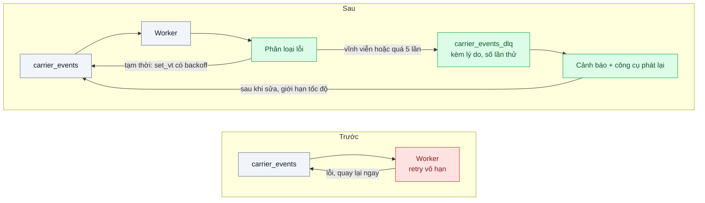
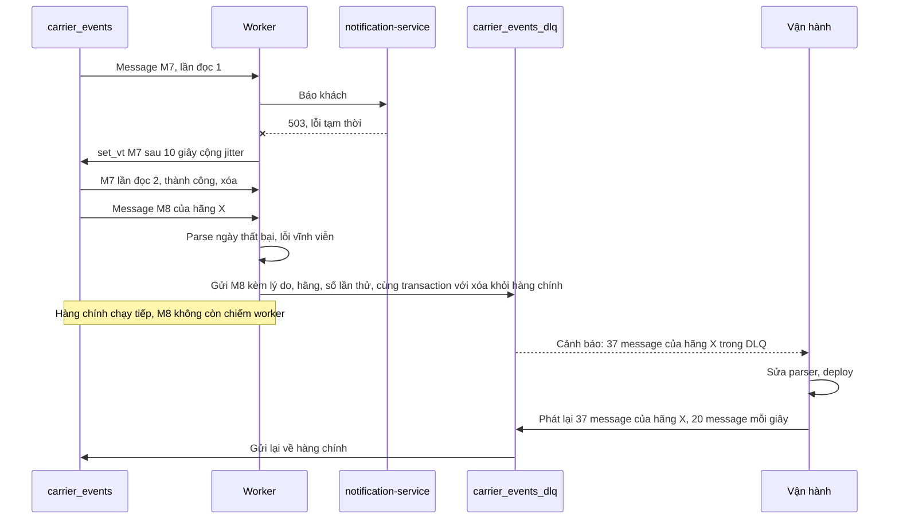

# Dead Letter Queue & Poison Message — Một message lỗi retry vô hạn, chặn cả hàng đợi

| Scope | Mức độ | Trạng thái | Pattern gốc | Cập nhật |
|---|---|---|---|---|
| 14 · backend / queueing / message queueing | 🟡 Trung bình | 📋 Kế hoạch | Dead Letter Channel — Hohpe & Woolf, *EIP* (2003); AWS SQS "Dead-letter queues"; RabbitMQ "Dead Letter Exchanges" | 2026-10-06 |

> **Một câu tóm tắt:** Phân loại lỗi tạm thời và lỗi vĩnh viễn, retry có giới hạn và có backoff, chuyển message không xử lý được sang một hàng riêng (DLQ) kèm lý do — hàng chính tiếp tục chạy, message hỏng không mất và được phát lại có kiểm soát sau khi sửa.

## 1. Bài toán thực tế (What)

**Bối cảnh** *(doanh nghiệp giả định, số liệu minh họa)*
Công ty logistics nhận cập nhật hành trình từ 12 hãng vận chuyển qua webhook; `tracking-ingest` đưa mỗi cập nhật vào hàng đợi `carrier_events` (PGMQ). Worker cập nhật trạng thái vận đơn rồi gọi `notification-service` để báo khách. Khoảng 2 triệu event/ngày.

**Triệu chứng người kinh doanh nhìn thấy**
- Một hãng đổi định dạng ngày tháng; worker ném lỗi, message quay lại, 3 worker liên tục xử lý đi xử lý lại vài chục message hỏng. Hàng đợi dồn, khách không nhận cập nhật "đang giao" trong 3 giờ.
- Log tràn cùng một stack trace; cảnh báo bị bỏ qua vì quá nhiều.
- Để gỡ kẹt, kỹ sư xóa tay các message hỏng; sửa xong parser thì không còn dữ liệu, phải nhờ hãng gửi lại.

**Nguyên nhân kỹ thuật**
Không phân biệt lỗi tạm thời (`notification-service` trả 503, database timeout) với lỗi vĩnh viễn (payload sai định dạng). Retry không giới hạn, không backoff: *poison message* — message không bao giờ xử lý được — chiếm worker mãi. Không có nơi cất message hỏng để xem lý do và phát lại sau.

**Ràng buộc**
- Không mất event: message hỏng phải được cất lại kèm ngữ cảnh.
- Lỗi tạm thời phải tự hồi phục mà không cần người can thiệp.
- Vận hành phải xem được lý do, lọc theo hãng và phát lại sau khi sửa; có cảnh báo khi DLQ có message.

## 2. Vì sao dùng pattern này (Why)

**Nguyên nhân gốc mà pattern nhắm vào:** thiếu giới hạn retry và thiếu nơi cất message không xử lý được.

**Pattern giải quyết thế nào:** Hohpe và Woolf mô tả *Dead Letter Channel*: message không giao hoặc không xử lý được được chuyển sang một kênh riêng thay vì bị bỏ hay làm kẹt kênh chính. Các broker hiện thực theo cách riêng: SQS dùng redrive policy với `maxReceiveCount` để chuyển sang DLQ và hỗ trợ chuyển ngược về hàng nguồn; RabbitMQ có dead-letter exchange khi message bị từ chối không xếp lại, hết TTL hoặc vượt độ dài hàng, và quorum queue có giới hạn số lần giao để xử lý poison message. PGMQ không có DLQ sẵn, nhưng mỗi message có `read_ct` (số lần đã đọc): worker tự chuyển message sang hàng `carrier_events_dlq` khi vượt ngưỡng — và vì cả hai hàng nằm trong cùng PostgreSQL, gửi sang DLQ và xóa khỏi hàng chính nằm trong một transaction. Bài thêm hai việc: phân loại lỗi (vĩnh viễn thì vào DLQ ngay; tạm thời thì retry có backoff bằng `set_vt`, quá 5 lần mới vào DLQ) và công cụ phát lại có giới hạn tốc độ.

**Lựa chọn khác đã cân nhắc**

| Lựa chọn | Giải quyết được gì | Vì sao không chọn (ở bài này) |
|---|---|---|
| Giữ nguyên + tối ưu nhỏ (bắt lỗi, ghi log rồi xóa message) | Hàng đợi không kẹt | Mất event âm thầm — khách không bao giờ nhận cập nhật |
| Retry vô hạn có backoff | Lỗi tạm thời tự hồi phục | Poison message vẫn chiếm worker mãi; không có nơi xem |
| Ghi lỗi vào bảng `error_log` rồi xóa message | Có dấu vết | Không phát lại tự động; dễ thiếu payload gốc |
| Phân loại lỗi + retry giới hạn + DLQ + phát lại (chọn) | Không mất, không kẹt, xem và phát lại được | Thêm hàng đợi, công cụ và quy trình; DLQ phải có người chịu trách nhiệm |

## 3. Thiết kế hệ thống (How)

### 3.1 Kiến trúc trước và sau



### 3.2 Luồng chính



### 3.3 Thành phần và trách nhiệm

| Thành phần | Trách nhiệm | Quyết định thiết kế đáng chú ý |
|---|---|---|
| Phân loại lỗi | Lỗi validation là vĩnh viễn; timeout, 5xx là tạm thời; lỗi không rõ coi là tạm thời tới giới hạn | Lớp lỗi tường minh trong code, không đoán theo chuỗi thông báo |
| Retry có backoff | `set_vt` với khoảng tăng dần cộng jitter | Không retry ngay lập tức vào phụ thuộc đang quá tải |
| Ngưỡng số lần đọc | Quá 5 lần đọc thì chuyển DLQ | Đủ lớn để qua sự cố thoáng qua của phụ thuộc |
| `carrier_events_dlq` | Giữ payload gốc kèm lý do, hãng, số lần thử, thời điểm | Gửi sang DLQ và xóa khỏi hàng chính trong một transaction |
| Công cụ phát lại | Lọc theo lý do hoặc hãng, chạy thử, giới hạn tốc độ | Phát lại ngoài giờ cao điểm; consumer phải idempotent |
| Cảnh báo và runbook | Cảnh báo khi DLQ có message quá 10 phút hoặc tăng nhanh | Có người chịu trách nhiệm theo ca |
| Hạn giữ DLQ | 14 ngày | Dài hơn thời gian từ lúc phát hiện tới lúc sửa xong thông thường |

### 3.4 Điểm dễ sai khi triển khai
- **DLQ không ai xem.** Thành "nghĩa địa message"; cảnh báo và người chịu trách nhiệm là một phần của pattern.
- **Retry ngay lập tức.** Tạo bão retry vào phụ thuộc đang quá tải; luôn có backoff và jitter.
- **Ngưỡng quá thấp.** Một sự cố database 30 giây đẩy hàng nghìn message tốt vào DLQ.
- **Phát lại ồ ạt khi chưa sửa xong.** Message quay về DLQ, hoặc dồn tải vào giờ cao điểm.
- **Mất ngữ cảnh khi vào DLQ.** Không có lý do và số lần thử thì không biết sửa gì.
- **Consumer không idempotent.** Phát lại sinh tác dụng phụ trùng (bài 04); message phát lại cũng tới sau message mới hơn của cùng vận đơn (bài 06).

## 4. Tech stack và tác động (Impact techstack)

| Lớp | Công nghệ chọn | Vì sao chọn | Thay thế tương đương |
|---|---|---|---|
| Hàng đợi | PGMQ: `read_ct`, `set_vt`, `send`, `delete` | Chuyển sang DLQ nguyên tử vì hai hàng cùng database | RabbitMQ (dead-letter exchange, giới hạn số lần giao của quorum queue); SQS redrive policy; BullMQ `attempts` và lỗi không retry (cần xác minh tên lớp lỗi) |
| Ứng dụng | TypeScript strict, worker Node; Zod để phát hiện payload sai định dạng | Lỗi validation tách bạch khỏi lỗi hạ tầng | NestJS |
| Phụ thuộc giả | `notification-service` giả trả 503 theo lịch | Tái hiện lỗi tạm thời có kiểm soát | Toxiproxy |
| Công cụ phát lại | CLI TypeScript có lọc, chạy thử, giới hạn tốc độ | Vận hành dùng được không cần sửa SQL tay | Trang quản trị nhỏ |
| Đo và cảnh báo | Prometheus: độ sâu và tuổi message cũ nhất của DLQ, tỷ lệ retry; quy tắc cảnh báo | Cảnh báo theo triệu chứng | Grafana |
| Hạ tầng | Docker Compose | PostgreSQL có PGMQ, worker, phụ thuộc giả, Prometheus | — |

**Thay đổi so với hệ thống hiện tại:** worker có lớp phân loại lỗi và retry có backoff; thêm hàng DLQ, công cụ phát lại, cảnh báo và runbook. Đội vận hành có thêm việc theo ca: xem DLQ, liên hệ hãng khi cần, phát lại sau khi sửa.

## 5. Kết quả đầu ra và cách đo (Output impact)

| Chỉ số | Trước (minh họa) | Mục tiêu khi thực hành | Cách đo |
|---|---|---|---|
| Thời gian hàng chính bị chặn khi có 50 message hỏng trong 100.000 | 3 giờ | 0; thông lượng giảm không quá 5 % | Script tiêm message hỏng, đo thông lượng và độ sâu hàng chính |
| Message bị mất | có (khi xóa tay để gỡ kẹt) | 0 | Đối chiếu: id đã gửi = id xử lý xong + id trong DLQ |
| Lỗi tạm thời tự hồi phục khi `notification-service` trả 503 trong 30 giây | — | 100 %, không message nào vào DLQ | Phụ thuộc giả theo lịch, đếm DLQ sau sự cố |
| Thời gian từ message hỏng đầu tiên tới khi có cảnh báo | không có | ≤ 2 phút | Quy tắc cảnh báo Prometheus, timestamp |
| Phát lại sau khi sửa | nhờ hãng gửi lại | 100 % xử lý thành công, không tác dụng phụ trùng | Chạy công cụ phát lại, kiểm đối soát |

> Số "trước" là minh họa để hình dung bài toán. Số "mục tiêu" chỉ được coi là đạt khi có số đo thật
> ở mục 8 kèm môi trường đo.

**Tác động nghiệp vụ mong đợi:** lỗi của một hãng không còn làm hàng triệu khách của 11 hãng khác mất cập nhật; dữ liệu của hãng lỗi được giữ lại và xử lý ngay khi sửa xong.

## 6. Đánh đổi và khi KHÔNG nên dùng

**Đánh đổi**
- Thêm hàng đợi, công cụ, cảnh báo và quy trình theo ca.
- Phân loại lỗi sai thì message tốt vào DLQ hoặc message hỏng retry quá lâu.
- DLQ chứa dữ liệu có thể nhạy cảm; cần phân quyền xem và hạn giữ.

**Không nên dùng khi**
- Message bỏ được (số liệu ước lượng, sự kiện theo dõi hành vi): bỏ và đếm là đủ.
- Xử lý đồng bộ dạng request-response: trả lỗi cho bên gọi là cơ chế tự nhiên.
- Luồng bắt buộc đúng thứ tự mà bỏ qua một message sẽ làm sai trạng thái: cần tạm dừng theo khóa thay vì chỉ đẩy sang DLQ.

**Liên quan**
- Đọc trước: `../04-idempotent-consumer-event-den-hai-lan-tru-kho-hai-lan/`; đọc sau: `../06-ordering-partition-key-trang-thai-don-den-sai-thu-tu/`.
- Lỗi đọc schema là nguồn poison message phổ biến: `../../13-backend-transporter/02-schema-evolution-them-field-lam-sap-consumer-cu/`.
- Backoff: `../../07-backend-microservices/04-timeout-retry-backoff-jitter-retry-dong-loat-tao-bao-moi/`; cảnh báo đúng cách: `../../23-backend-monitoring-benchmark/06-alerting-symptom-not-cause-50-alert-moi-dem-khong-ai-doc/`.

## 7. Cơ sở tham khảo

- Hohpe & Woolf, *Enterprise Integration Patterns*, 2003, "Dead Letter Channel" — https://www.enterpriseintegrationpatterns.com/patterns/messaging/DeadLetterChannel.html — kênh riêng cho message không giao hoặc không xử lý được.
- AWS SQS docs, "Amazon SQS dead-letter queues" — https://docs.aws.amazon.com/AWSSimpleQueueService/latest/SQSDeveloperGuide/sqs-dead-letter-queues.html — redrive policy, `maxReceiveCount`, chuyển ngược về hàng nguồn.
- RabbitMQ docs, "Dead Letter Exchanges" — https://www.rabbitmq.com/docs/dlx — các trường hợp message bị chuyển sang dead-letter exchange.
- RabbitMQ docs, "Quorum Queues" — https://www.rabbitmq.com/docs/quorum-queues — giới hạn số lần giao để xử lý poison message.
- PGMQ — https://github.com/pgmq/pgmq — `read_ct`, `set_vt`, cách tự dựng DLQ bằng hàng thứ hai.

## 8. Kế hoạch thực hành

- [ ] Bước 1: dựng `carrier_events`, worker phiên bản "trước" retry vô hạn, `notification-service` giả; script phát 100.000 event có 50 message hỏng của một hãng.
- [ ] Bước 2: đo "trước": thông lượng và độ sâu hàng chính theo thời gian, thời gian bị chặn.
- [ ] Bước 3: thêm phân loại lỗi, retry có backoff bằng `set_vt`, ngưỡng 5 lần, `carrier_events_dlq`, công cụ phát lại, cảnh báo.
- [ ] Bước 4: đo "sau" cùng kịch bản, thêm sự cố 503 trong 30 giây; sửa parser rồi phát lại; ghi số thật và môi trường vào mục 5.
- [ ] Bước 5: test: (a) payload sai vào DLQ ngay ở lần đọc đầu; (b) lỗi tạm thời không vào DLQ nếu hồi phục trước ngưỡng; (c) chuyển sang DLQ và xóa khỏi hàng chính là nguyên tử; (d) phát lại tôn trọng giới hạn tốc độ và bộ lọc.

**Cấu trúc code dự kiến**
```text
src/
  tracking/worker.ts               # đọc, xử lý, gọi phân loại lỗi
  tracking/error-classifier.ts     # [PATTERN] tạm thời hay vĩnh viễn
  tracking/dead-letter.ts          # [PATTERN] gửi DLQ + xóa hàng chính trong một transaction
  tools/redrive.ts                 # lọc, chạy thử, giới hạn tốc độ
  notification-mock/server.ts      # 503 theo lịch
test/
  malformed-payload-goes-to-dlq.test.ts
  transient-error-recovers-without-dlq.test.ts
  move-to-dlq-is-atomic.test.ts
  redrive-respects-rate-limit.test.ts
docker-compose.yml
```

**Cách chạy** *(điền khi bắt đầu code)*
```bash
docker compose up -d
pnpm install && pnpm test
```
