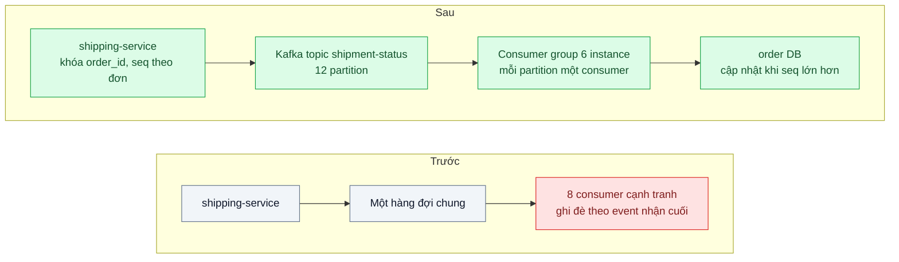
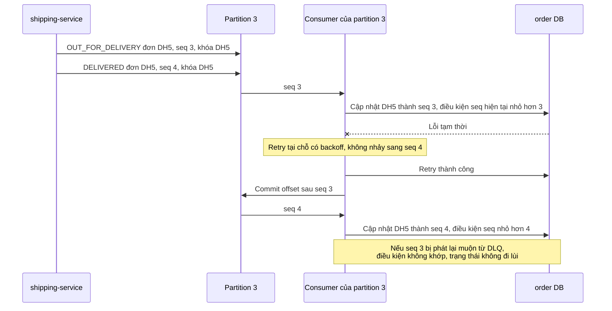

# Message Ordering (partition key) — "Đã giao" tới trước "Đang giao", trạng thái đơn nhảy ngược

| Scope | Mức độ | Trạng thái | Pattern gốc | Cập nhật |
|---|---|---|---|---|
| 14 · backend / queueing / message queueing | 🔴 Nâng cao | 📋 Kế hoạch | Partitioned ordering — Kafka docs; Azure "Sequential Convoy"; *EIP* "Resequencer" (Hohpe & Woolf, 2003) | 2026-10-06 |

> **Một câu tóm tắt:** Gửi mọi event của cùng một đơn vào cùng một partition bằng khóa `order_id` để chúng được xử lý tuần tự trong khi các đơn khác vẫn chạy song song, và thêm số thứ tự trong event cùng cập nhật có điều kiện ở consumer để trạng thái không bao giờ đi lùi — kể cả khi event được phát lại muộn.

## 1. Bài toán thực tế (What)

**Bối cảnh** *(doanh nghiệp giả định, số liệu minh họa)*
Sàn thương mại điện tử: `shipping-service` phát event trạng thái vận chuyển (`PICKED_UP`, `IN_TRANSIT`, `OUT_FOR_DELIVERY`, `DELIVERED`) cho `order-service` cập nhật trạng thái đơn và gửi thông báo. Khoảng 3 triệu event/ngày, đỉnh 400 event/giây. Hiện dùng một hàng đợi chung với 8 consumer cạnh tranh nhau.

**Triệu chứng người kinh doanh nhìn thấy**
- Khoảng 0,3 % đơn hiển thị "Đang giao" sau khi đã "Đã giao"; khách bấm "Chưa nhận được hàng", mở khiếu nại, CSKH phải tra tay.
- Thông báo đẩy tới khách sai thứ tự: "Đã giao thành công" rồi mới "Shipper đang trên đường tới".
- Báo cáo thời gian giao trung bình sai vì mốc thời gian bị ghi đè bởi event cũ.

**Nguyên nhân kỹ thuật**
Competing consumers không giữ thứ tự: hai event của cùng một đơn tới hai consumer khác nhau, consumer nhận event sau lại xử lý xong trước. Retry và visibility timeout làm event cũ quay lại sau event mới; producer retry cũng có thể đảo thứ tự. Consumer ghi đè trạng thái theo event *nhận cuối cùng* thay vì theo thứ tự nghiệp vụ.

**Ràng buộc**
- Thứ tự chỉ cần *trong từng đơn*, không cần toàn cục.
- Một consumer duy nhất không đủ thông lượng ở đỉnh 400 event/giây.
- Event có thể được phát lại từ DLQ; phần lệch thứ tự còn sót phải không làm trạng thái đi lùi.

## 2. Vì sao dùng pattern này (Why)

**Nguyên nhân gốc mà pattern nhắm vào:** thứ tự cần giữ theo từng thực thể, nhưng cơ chế phân phối message không có khái niệm "cùng thực thể".

**Pattern giải quyết thế nào:** Tài liệu Kafka đảm bảo thứ tự trong một partition. Producer gửi kèm khóa `order_id` thì partitioner mặc định băm khóa và đưa mọi event của một đơn vào cùng partition; trong một consumer group, mỗi partition chỉ do một consumer đọc tại một thời điểm — tuần tự trong từng đơn, song song giữa các đơn, và số partition là mức song song tối đa. Azure mô tả cùng ý ở *Sequential Convoy*: xử lý một nhóm message liên quan theo thứ tự mà không chặn các nhóm khác. *Resequencer* trong EIP là hướng khác: gom và sắp lại message lệch thứ tự theo số thứ tự trước khi chuyển tiếp. Bài kết hợp partition theo khóa với lớp phòng thủ ở consumer: mỗi event mang `seq` tăng dần theo đơn do producer sinh, consumer chỉ áp dụng khi `seq` lớn hơn giá trị đang lưu (cập nhật có điều kiện), và máy trạng thái chặn chuyển lùi.

**Lựa chọn khác đã cân nhắc**

| Lựa chọn | Giải quyết được gì | Vì sao không chọn (ở bài này) |
|---|---|---|
| Giữ nguyên + tối ưu nhỏ (một consumer duy nhất) | Đúng thứ tự | Không đủ thông lượng ở đỉnh; một message chậm chặn mọi đơn |
| Chỉ kiểm `seq` ở consumer, bỏ event cũ | Trạng thái không đi lùi | Thông báo vẫn có thể gửi sai thứ tự; event cũ bị bỏ có thể chứa mốc thời gian cần — vẫn giữ làm lớp phòng thủ |
| Resequencer đệm và sắp lại | Đúng thứ tự ngay cả khi nguồn lộn xộn | Phải quyết định chờ event thiếu bao lâu; bộ đệm phải bền vững |
| Partition theo `order_id` + kiểm `seq` ở consumer (chọn) | Tuần tự trong đơn, song song giữa đơn, có lớp phòng thủ | Thêm Kafka; partition nóng; retry phải không phá thứ tự |

## 3. Thiết kế hệ thống (How)

### 3.1 Kiến trúc trước và sau



### 3.2 Luồng chính



### 3.3 Thành phần và trách nhiệm

| Thành phần | Trách nhiệm | Quyết định thiết kế đáng chú ý |
|---|---|---|
| Khóa partition | `order_id` cho mọi event của một đơn | Không dùng `shop_id`: shop lớn tạo partition nóng |
| Số partition | Mức song song tối đa của consumer group | Chọn dư cho 2 năm (12); tăng sau sẽ đổi ánh xạ khóa sang partition |
| Producer | Gửi có khóa, bật chế độ idempotent để retry không đảo thứ tự | Cấu hình cụ thể theo client cần xác minh |
| `seq` trong event | Số tăng dần theo đơn, lấy từ version của bản ghi vận chuyển | Sinh ở producer, không dựa vào timestamp của nhiều máy |
| Consumer | Xử lý tuần tự trong partition, commit offset sau khi xử lý | Không `Promise.all` các message trong cùng partition |
| Cập nhật có điều kiện | Chỉ ghi khi `seq` mới lớn hơn `seq` đang lưu | Máy trạng thái chặn chuyển lùi như lớp thứ hai |
| Lỗi kéo dài | Retry tại chỗ có giới hạn, rồi tạm dừng khóa đó và chuyển hàng chờ riêng | Không để event sau của cùng đơn chạy trước event lỗi |

### 3.4 Điểm dễ sai khi triển khai
- **Gửi không có khóa hoặc sai khóa.** Mất nhóm thứ tự, hoặc dồn một shop lớn vào một partition.
- **Xử lý song song trong một partition.** `Promise.all` theo lô phá đúng thứ tự vừa giành được.
- **Đẩy message lỗi sang retry topic rồi đi tiếp.** Event sau của cùng đơn được xử lý trước event lỗi; nếu dùng retry topic, phải tạm dừng cả khóa.
- **Tăng số partition giữa chừng.** Ánh xạ khóa sang partition đổi, thứ tự trong giai đoạn chuyển bị phá; chọn dư từ đầu.
- **Dùng timestamp làm thứ tự.** Đồng hồ nhiều máy lệch nhau; dùng `seq` do một nguồn sinh.
- **Quên rebalance.** Consumer mất partition giữa chừng; event đã xử lý nhưng chưa commit sẽ được consumer mới xử lý lại — cần idempotent (bài 04).

## 4. Tech stack và tác động (Impact techstack)

| Lớp | Công nghệ chọn | Vì sao chọn | Thay thế tương đương |
|---|---|---|---|
| Broker | Apache Kafka chế độ KRaft trong Docker | Thứ tự trong partition và consumer group là đúng tính năng bài cần; PGMQ và BullMQ không có partition theo khóa | Redpanda (tương thích Kafka API), NATS JetStream |
| Client | KafkaJS hoặc `@confluentinc/kafka-javascript` (cần xác minh tình trạng bảo trì và API) | Client Node.js cho producer có khóa và consumer group | — |
| Ứng dụng | TypeScript strict, NestJS cho `order-service`; `shipping-service` giả lập | Trùng stack repo | Fastify |
| Database | PostgreSQL 16, cột `status_seq`, cập nhật có điều kiện | Lớp phòng thủ không phụ thuộc broker | — |
| Tiêm lỗi | Producer giả lập gửi lộn thứ tự có chủ đích; kill consumer để gây rebalance; lỗi database ngẫu nhiên | Tái hiện mọi nguồn đảo thứ tự | — |
| Đo | Consumer lag theo partition (công cụ `kafka-consumer-groups` hoặc exporter), Prometheus, script đối soát lịch sử trạng thái | Thấy được cả độ đúng lẫn thông lượng | Grafana |

**Thay đổi so với hệ thống hiện tại:** thêm Kafka (lý do: bài cần thứ tự theo khóa mà hàng đợi mặc định của repo không có); event có thêm khóa và `seq`; consumer chuyển sang xử lý tuần tự theo partition. Đội vận hành học theo dõi lag theo partition và xử lý partition nóng.

## 5. Kết quả đầu ra và cách đo (Output impact)

| Chỉ số | Trước (minh họa) | Mục tiêu khi thực hành | Cách đo |
|---|---|---|---|
| Đơn có trạng thái đi lùi sau 1 triệu event | 0,3 % | 0 | Truy vấn lịch sử trạng thái, đếm lần chuyển lùi |
| Thông báo sai thứ tự trong cùng đơn | có | 0 | Log thông báo theo đơn, kiểm `seq` tăng dần |
| Thông lượng ở đỉnh | 400/giây với 8 consumer | ≥ 400/giây với 12 partition, 6 consumer | Script producer đỉnh + theo dõi lag |
| Consumer lag p99 lúc đỉnh | — | ≤ 5 giây | Lag theo partition |
| Event bị xử lý lại khi rebalance | — | ghi số thật; không gây sai trạng thái | Đếm event có `seq` không lớn hơn giá trị đang lưu |

> Số "trước" là minh họa để hình dung bài toán. Số "mục tiêu" chỉ được coi là đạt khi có số đo thật
> ở mục 8 kèm môi trường đo.

**Tác động nghiệp vụ mong đợi:** khách không còn thấy đơn "đã giao" quay về "đang giao", giảm khiếu nại oan và công tra cứu của CSKH; báo cáo thời gian giao dùng được để ra quyết định.

## 6. Đánh đổi và khi KHÔNG nên dùng

**Đánh đổi**
- Thêm Kafka phải vận hành; mức song song bị chặn bởi số partition.
- Retry tại chỗ khiến một event lỗi chặn mọi đơn trong cùng partition cho tới khi tạm dừng khóa.
- Partition nóng và việc tăng partition về sau là rủi ro vận hành mới.

**Không nên dùng khi**
- Không cần thứ tự (thông báo marketing): competing consumers đơn giản hơn.
- Chỉ cần "trạng thái không đi lùi": cập nhật có điều kiện theo `seq` ở consumer là đủ, không cần Kafka.
- Cần thứ tự toàn cục (hiếm): một partition và chấp nhận thông lượng thấp.

**Liên quan**
- Đọc trước: `../04-idempotent-consumer-event-den-hai-lan-tru-kho-hai-lan/`, `../05-dead-letter-queue-mot-message-loi-chan-ca-hang-doi/`; đọc sau: `../09-consumer-lag-autoscale-hang-doi-dong-500k-message-toi-flash-sale/`.
- Cập nhật có điều kiện: `../../02-backend-database/02-optimistic-lock-hai-nhan-vien-cung-sua-mot-don/`.
- Thứ tự ở phía realtime: `../../06-frontend-backend-realtime/05-server-side-ordering-dau-gia-hai-nguoi-bid-cung-luc/`; chọn broker: `../02-chon-broker-redis-rabbitmq-kafka-nats-pgmq-team-5-nguoi/`.

## 7. Cơ sở tham khảo

- Apache Kafka docs — https://kafka.apache.org/documentation/ — partition, đảm bảo thứ tự trong partition, consumer group, producer idempotent.
- Microsoft Azure Architecture Center, "Sequential Convoy pattern" — https://learn.microsoft.com/azure/architecture/patterns/sequential-convoy — xử lý theo thứ tự trong từng nhóm mà không chặn nhóm khác.
- Hohpe & Woolf, *Enterprise Integration Patterns*, 2003, "Resequencer" — https://www.enterpriseintegrationpatterns.com/patterns/messaging/Resequencer.html — sắp lại message lệch thứ tự theo số thứ tự.
- Martin Kleppmann, *Designing Data-Intensive Applications*, O'Reilly, 2017, ch.11 — log phân vùng, thứ tự theo partition và giới hạn của nó.

## 8. Kế hoạch thực hành

- [ ] Bước 1: dựng phiên bản "trước": một hàng đợi chung, 8 consumer cạnh tranh, producer giả lập phát 1 triệu event với đỉnh 400/giây.
- [ ] Bước 2: đo "trước": tỷ lệ đơn đi lùi, thông báo sai thứ tự.
- [ ] Bước 3: chuyển sang Kafka 12 partition với khóa `order_id`, producer idempotent, `seq` theo đơn, consumer tuần tự theo partition, cập nhật có điều kiện, tạm dừng khóa khi lỗi kéo dài.
- [ ] Bước 4: đo "sau" cùng kịch bản, thêm kill consumer để gây rebalance và phát lại event cũ; ghi số thật và môi trường vào mục 5.
- [ ] Bước 5: test: (a) mọi event cùng `order_id` vào cùng partition; (b) event `seq` cũ tới sau không làm trạng thái đi lùi; (c) lỗi tạm thời ở `seq` 3 không để `seq` 4 được xử lý trước; (d) rebalance giữa chừng không làm sai trạng thái.

**Cấu trúc code dự kiến**
```text
src/
  shipping/producer.ts             # [PATTERN] khóa order_id, seq theo đơn
  order/shipment-consumer.ts       # [PATTERN] tuần tự trong partition, commit sau xử lý
  order/apply-status.ts            # cập nhật có điều kiện theo seq, máy trạng thái
  legacy/competing-consumers.ts    # phiên bản "trước"
test/
  same-order-same-partition.test.ts
  stale-seq-does-not-regress.test.ts
  retry-blocks-later-events-of-same-order.test.ts
scripts/reconcile-status-history.ts
docker-compose.yml                 # kafka kraft, postgres
```

**Cách chạy** *(điền khi bắt đầu code)*
```bash
docker compose up -d
pnpm install && pnpm test
```
