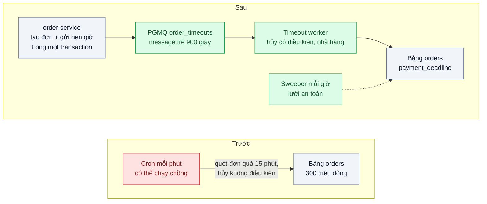
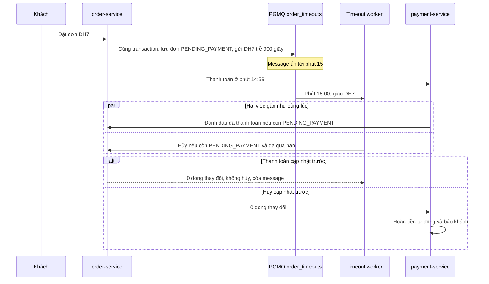

# Delayed / Scheduled Messages — Hủy đơn chưa thanh toán sau 15 phút cho 1 triệu đơn/ngày

| Scope | Mức độ | Trạng thái | Pattern gốc | Cập nhật |
|---|---|---|---|---|
| 14 · backend / queueing / message queueing | 🟡 Trung bình | 📋 Kế hoạch | Delayed / Scheduled Messages — BullMQ "Delayed jobs"; RabbitMQ Delayed Message Exchange; AWS SQS "Delay queues" | 2026-10-06 |

> **Một câu tóm tắt:** Khi tạo đơn, gửi luôn một message "kiểm tra hạn thanh toán" trễ 15 phút trong cùng transaction; tới hạn, worker hủy đơn bằng cập nhật có điều kiện trên trạng thái — thay cho cron quét bảng mỗi phút vừa trễ, vừa chồng lần chạy, vừa hủy nhầm đơn vừa thanh toán.

## 1. Bài toán thực tế (What)

**Bối cảnh** *(doanh nghiệp giả định, số liệu minh họa)*
Sàn thương mại điện tử khoảng 1 triệu đơn/ngày, đỉnh 800 đơn/giây lúc flash sale. Đơn chuyển khoản hoặc ví được giữ hàng 15 phút chờ thanh toán; quá hạn thì hủy và nhả hàng. Hiện tại một cron chạy mỗi phút: tìm đơn `PENDING_PAYMENT` tạo quá 15 phút trong bảng 300 triệu dòng rồi hủy từng đơn.

**Triệu chứng người kinh doanh nhìn thấy**
- Giờ flash sale, cron chạy quá một phút, hai lần chạy chồng nhau cùng hủy một đơn và nhả hàng hai lần: tồn kho ảo tăng, bán vượt.
- Đơn bị hủy trễ 6–8 phút sau hạn: hàng "kẹt" đúng giờ vàng, khách khác thấy hết hàng.
- Khách thanh toán đúng phút thứ 15 bị hủy dù tiền đã trừ; phải hoàn tiền và xử lý khiếu nại.
- Truy vấn quét mỗi phút làm database chậm cho mọi luồng khác.

**Nguyên nhân kỹ thuật**
Quét định kỳ có độ trễ bằng chu kỳ cộng thời gian quét, và chi phí quét tăng theo kích thước bảng. Không có khóa ngăn hai lần chạy chồng. Hủy và thanh toán không được tuần tự hóa bằng điều kiện trên trạng thái, nên hai bên cùng "thắng".

**Ràng buộc**
- Hủy đúng hạn trong khoảng ±30 giây; mỗi đơn hủy và nhả hàng đúng một lần.
- Thanh toán sát hạn: bên nào cập nhật trạng thái trước thì thắng; thanh toán tới sau khi đã hủy thì hoàn tiền tự động.
- Hẹn giờ không được mất khi deploy hay crash; không thêm hạ tầng nếu PostgreSQL đủ.

## 2. Vì sao dùng pattern này (Why)

**Nguyên nhân gốc mà pattern nhắm vào:** dùng quét định kỳ cho hàng triệu hẹn giờ riêng lẻ, và hành động khi tới hạn không được bảo vệ bởi điều kiện trên trạng thái.

**Pattern giải quyết thế nào:** Thay vì hỏi "đơn nào đã quá hạn?" mỗi phút, mỗi đơn mang theo hẹn giờ của chính nó: một message được gửi với độ trễ 15 phút và chỉ được giao khi tới hạn. Mỗi broker hiện thực khác nhau: BullMQ giữ job trễ trong Redis và chuyển sang hàng chờ khi tới hạn; RabbitMQ có plugin Delayed Message Exchange dùng header `x-delay`; SQS có delay queue với độ trễ tối đa 15 phút; PGMQ cho phép `send` kèm số giây trễ, message chỉ hiện ra khi tới hạn. Khi tới hạn, worker không hủy mù mà chạy cập nhật có điều kiện: chỉ đổi sang `CANCELLED` nếu đơn vẫn `PENDING_PAYMENT` và đã qua `payment_deadline` lưu trong đơn. Thanh toán dùng điều kiện ngược lại. Một sweeper chạy thưa (mỗi giờ) làm lưới an toàn cho hẹn giờ bị sót.

**Lựa chọn khác đã cân nhắc**

| Lựa chọn | Giải quyết được gì | Vì sao không chọn (ở bài này) |
|---|---|---|
| Giữ nguyên + tối ưu nhỏ (cron + partial index + advisory lock chống chồng) | Hết chạy chồng, quét nhanh hơn | Độ trễ vẫn tới một chu kỳ; đỉnh flash sale vẫn dồn một lần quét lớn — giữ làm sweeper dự phòng |
| BullMQ delayed jobs | Chính xác, có sẵn | Thêm Redis vào luồng tạo đơn; enqueue không cùng transaction với tạo đơn nên cần outbox |
| RabbitMQ Delayed Message Exchange | Có sẵn khi đã dùng RabbitMQ | Plugin có giới hạn về số lượng message trễ và độ bền (cần xác minh trong README của plugin) |
| PGMQ `send` có độ trễ trong transaction tạo đơn (chọn) | Hẹn giờ nguyên tử với đơn, không thêm hạ tầng | Lúc đỉnh có hàng trăm nghìn message chờ trong bảng; thông lượng giới hạn bởi PostgreSQL |

## 3. Thiết kế hệ thống (How)

### 3.1 Kiến trúc trước và sau



### 3.2 Luồng chính



### 3.3 Thành phần và trách nhiệm

| Thành phần | Trách nhiệm | Quyết định thiết kế đáng chú ý |
|---|---|---|
| Tạo đơn | Lưu đơn kèm `payment_deadline` và gửi message trễ trong cùng transaction | Hạn tính bằng `now()` của database, không bằng đồng hồ ứng dụng |
| Hàng `order_timeouts` | Giữ message ẩn tới hạn | Message chỉ chứa `orderId` |
| Timeout worker | Hủy có điều kiện, nhả hàng, xóa message — trong một transaction | Nếu hạn đã được gia hạn thì gửi lại message trễ theo hạn mới |
| Thanh toán | Đánh dấu đã thanh toán có điều kiện; 0 dòng thay đổi thì hoàn tiền | Hoàn tiền dùng idempotency key theo mã giao dịch |
| Sweeper | Mỗi giờ tìm đơn quá hạn còn sót bằng partial index | Có advisory lock để không chạy chồng |
| Metric | Độ trễ hủy so với hạn, số hủy, số hoàn tiền do tranh chấp | Cảnh báo khi độ trễ p99 vượt 60 giây — worker không theo kịp |

### 3.4 Điểm dễ sai khi triển khai
- **Hủy mù không kiểm trạng thái.** Nguồn gốc của "đã trả tiền vẫn bị hủy".
- **Gửi hẹn giờ ngoài transaction tạo đơn.** Chết ở giữa là mất hẹn giờ, hoặc có hẹn giờ cho đơn không tồn tại.
- **Dùng `setTimeout` trong tiến trình.** Mất toàn bộ hẹn giờ khi deploy.
- **Tin độ chính xác tuyệt đối.** Worker bận thì message tới hạn vẫn phải chờ; đo độ trễ so với hạn và co giãn worker.
- **Quên nhả hàng trong cùng transaction với hủy.** Hủy xong chết là hàng kẹt mãi.
- **Đổi chính sách 15 thành 30 phút.** Message đã gửi vẫn mang hạn cũ; worker phải so với `payment_deadline` trong đơn thay vì tin message.

## 4. Tech stack và tác động (Impact techstack)

| Lớp | Công nghệ chọn | Vì sao chọn | Thay thế tương đương |
|---|---|---|---|
| Hàng đợi | PGMQ, `send` kèm độ trễ | Hẹn giờ nằm cùng transaction với đơn | BullMQ delayed jobs (biến thể so sánh ở bước tùy chọn), RabbitMQ Delayed Message Exchange, SQS delay queue |
| Database | PostgreSQL 16, partial index cho đơn `PENDING_PAYMENT`, advisory lock cho sweeper | Sweeper quét nhanh, không chạy chồng | — |
| Ứng dụng | TypeScript strict, NestJS cho `order-service`; timeout worker Node riêng | Trùng stack repo | Fastify |
| Thanh toán giả | Fastify cho phép đặt thời điểm thanh toán chính xác, có API hoàn tiền | Tái hiện tranh chấp ở phút thứ 15 | — |
| Tải và đo | k6 tạo 800 đơn/giây trong 10 phút; Prometheus histogram độ trễ hủy; `pg_stat_statements` | Đo đúng đỉnh flash sale và tải database | — |
| Hạ tầng | Docker Compose | PostgreSQL có PGMQ, service, worker | — |

**Thay đổi so với hệ thống hiện tại:** bỏ cron mỗi phút, thêm hàng đợi trễ và worker; bảng đơn có thêm `payment_deadline`; thanh toán có luồng hoàn tiền tự động khi thua tranh chấp. Đội vận hành theo dõi độ trễ hủy và số hoàn tiền do tranh chấp.

## 5. Kết quả đầu ra và cách đo (Output impact)

| Chỉ số | Trước (minh họa) | Mục tiêu khi thực hành | Cách đo |
|---|---|---|---|
| Độ trễ hủy so với hạn, p99 | 8 phút | ≤ 30 giây | Histogram (thời điểm hủy − `payment_deadline`) |
| Đơn bị hủy hoặc nhả hàng hai lần | có | 0 | Đếm lịch sử trạng thái và đối soát tồn kho |
| Đơn đã thanh toán bị hủy mà không hoàn tiền | có | 0 | Test tranh chấp: 1.000 thanh toán đúng phút thứ 15 |
| Tải database do cơ chế hẹn giờ | quét bảng lớn mỗi phút | không còn truy vấn quét theo phút; sweeper ≤ 1 giây mỗi giờ | `pg_stat_statements` |
| Hẹn giờ bị mất khi kill worker hoặc deploy | không biết | 0 | Kill worker giữa tải, đối soát mọi đơn quá hạn đều đã hủy |

> Số "trước" là minh họa để hình dung bài toán. Số "mục tiêu" chỉ được coi là đạt khi có số đo thật
> ở mục 8 kèm môi trường đo.

**Tác động nghiệp vụ mong đợi:** hàng giữ quá hạn được trả lại kệ đúng giờ vàng, khách thanh toán sát hạn không bị hủy oan, và không còn bán vượt tồn kho do nhả hàng hai lần.

## 6. Đánh đổi và khi KHÔNG nên dùng

**Đánh đổi**
- Lúc đỉnh có rất nhiều message chờ trong bảng (800 đơn/giây × 900 giây ≈ 720.000 message, minh họa) — cần theo dõi kích thước và vacuum.
- Tranh chấp sát hạn không biến mất, chỉ được xử lý đúng bằng hoàn tiền tự động.
- Hai cơ chế (message trễ và sweeper) phải cùng được giữ đúng.

**Không nên dùng khi**
- Hạn dài nhiều ngày hoặc nhiều tuần (nhắc gia hạn hợp đồng): lưu `due_at` trong bảng và quét theo index tốt hơn hàng triệu message nằm chờ lâu.
- Số lượng nhỏ, vài trăm mỗi ngày: cron kèm index là đủ.
- Cần lịch lặp theo biểu thức cron: dùng bộ lập lịch job.

**Liên quan**
- Dùng trong: `../../07-backend-microservices/07-saga-dat-hang-tru-kho-thanh-toan-hoan-tien-khi-loi/` — hạn 15 phút của saga.
- Nền tảng: `../01-work-queue-gui-100k-email-lam-treo-api/`, `../04-idempotent-consumer-event-den-hai-lan-tru-kho-hai-lan/`.
- Cập nhật có điều kiện: `../../02-backend-database/02-optimistic-lock-hai-nhan-vien-cung-sua-mot-don/`; chống chạy chồng: `../../03-backend-cache/06-distributed-lock-hai-worker-cung-chay-mot-job/`.

## 7. Cơ sở tham khảo

- BullMQ docs, "Delayed jobs" — https://docs.bullmq.io/guide/jobs/delayed — job trễ trong Redis và cách chúng được chuyển sang hàng chờ.
- RabbitMQ Delayed Message Exchange plugin — https://github.com/rabbitmq/rabbitmq-delayed-message-exchange — exchange kiểu trễ, header `x-delay`, các giới hạn đã nêu trong README.
- AWS SQS docs, "Amazon SQS delay queues" — https://docs.aws.amazon.com/AWSSimpleQueueService/latest/SQSDeveloperGuide/sqs-delay-queues.html — độ trễ theo hàng và theo message, giới hạn tối đa.
- PGMQ — https://github.com/pgmq/pgmq — `send` kèm độ trễ, message hiện ra khi tới hạn.
- PostgreSQL docs, "Partial Indexes" — https://www.postgresql.org/docs/16/indexes-partial.html — index cho sweeper chỉ trên đơn đang chờ thanh toán.

## 8. Kế hoạch thực hành

- [ ] Bước 1: dựng `order-service` với cron phiên bản "trước", thanh toán giả, seed bảng đơn lớn (vài chục triệu dòng là đủ thấy chi phí quét).
- [ ] Bước 2: đo "trước": k6 800 đơn/giây trong 10 phút, 30 % đơn không thanh toán, 1.000 thanh toán đúng phút 15; ghi độ trễ hủy, số hủy hai lần, số hủy oan.
- [ ] Bước 3: thêm `payment_deadline`, gửi message trễ trong transaction, timeout worker hủy có điều kiện, hoàn tiền tự động, sweeper có advisory lock.
- [ ] Bước 4: đo "sau" cùng kịch bản, kill worker giữa tải; ghi số thật và môi trường vào mục 5; (tùy chọn) chạy biến thể BullMQ để so sánh.
- [ ] Bước 5: test: (a) đơn thanh toán trước hạn không bị hủy; (b) tranh chấp đúng hạn chỉ có một bên thắng và bên thua được xử lý; (c) rollback tạo đơn thì không có hẹn giờ; (d) gia hạn `payment_deadline` thì worker hẹn lại thay vì hủy.

**Cấu trúc code dự kiến**
```text
src/
  order/create-order.ts            # [PATTERN] lưu đơn + gửi message trễ trong một transaction
  order/timeout-worker.ts          # [PATTERN] hủy có điều kiện, nhả hàng, xóa message
  order/sweeper.ts                 # lưới an toàn mỗi giờ, advisory lock
  payment-mock/server.ts           # thanh toán đúng thời điểm, hoàn tiền
  legacy/cancel-cron.ts            # phiên bản "trước"
test/
  paid-before-deadline-not-cancelled.test.ts
  race-at-deadline-single-winner.test.ts
  rollback-creates-no-timer.test.ts
  extended-deadline-reschedules.test.ts
bench/flash-sale-orders.k6.js
docker-compose.yml
```

**Cách chạy** *(điền khi bắt đầu code)*
```bash
docker compose up -d
pnpm install && pnpm test
```
