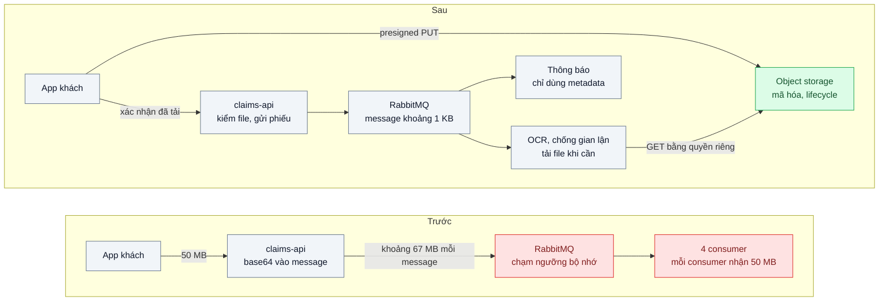
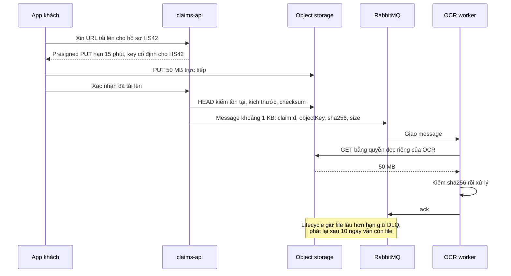

# Claim Check — Message chứa file PDF 50 MB làm nghẽn broker

| Scope | Mức độ | Trạng thái | Pattern gốc | Cập nhật |
|---|---|---|---|---|
| 14 · backend / queueing / message queueing | 🟡 Trung bình | 📋 Kế hoạch | Claim Check — Hohpe & Woolf, *EIP* (2003); Azure "Claim-Check" | 2026-10-06 |

> **Một câu tóm tắt:** Để file lớn ở object storage và chỉ gửi qua broker một "phiếu gửi đồ" vài trăm byte (mã hồ sơ, object key, checksum, kích thước), consumer nào cần file mới tải về — broker trở lại làm đúng việc chuyển message nhỏ, không còn bị bộ nhớ chặn mọi luồng khác.

## 1. Bài toán thực tế (What)

**Bối cảnh** *(doanh nghiệp giả định, số liệu minh họa)*
Công ty bảo hiểm nhận hồ sơ bồi thường qua app: ảnh hiện trường, hóa đơn viện phí, biên bản — mỗi file 5–50 MB. `claims-api` mã hóa base64 các file vào message và publish lên RabbitMQ cho 4 consumer: OCR, chống gian lận, lưu trữ, thông báo giám định viên. Bình thường 6.000 hồ sơ/ngày; sau bão lũ có thể gấp 10.

**Triệu chứng người kinh doanh nhìn thấy**
- Sau một trận bão, lượng hồ sơ tăng gấp 10; RabbitMQ chạm ngưỡng bộ nhớ và chặn mọi publisher — cả luồng thu phí và thông báo không liên quan cũng dừng 40 phút.
- Hồ sơ lớn thỉnh thoảng bị từ chối vì vượt giới hạn kích thước message; khách phải nộp lại đúng lúc đang gặp nạn.
- Consumer thông báo chỉ cần mã hồ sơ nhưng vẫn nhận nguyên 50 MB; bộ nhớ và băng thông của mọi consumer phình theo.

**Nguyên nhân kỹ thuật**
Dữ liệu lớn đi qua broker vốn tối ưu cho message nhỏ. Base64 làm phình thêm khoảng một phần ba; fan-out sang 4 hàng đợi nhân bản payload; broker giữ message trong bộ nhớ và ổ đĩa, và khi vượt ngưỡng bộ nhớ, RabbitMQ chặn các kết nối đang publish để tự bảo vệ.

**Ràng buộc**
- File chứa dữ liệu y tế: kiểm soát truy cập theo từng consumer, mã hóa khi lưu, thời hạn lưu theo quy định.
- Message có thể được phát lại từ DLQ sau nhiều ngày; lúc đó file vẫn phải còn.
- Giữ RabbitMQ cho các luồng khác.

## 2. Vì sao dùng pattern này (Why)

**Nguyên nhân gốc mà pattern nhắm vào:** dùng broker làm kênh chuyên chở dữ liệu lớn.

**Pattern giải quyết thế nào:** Hohpe và Woolf mô tả *Claim Check*: lưu phần dữ liệu lớn vào một kho bền vững, gửi đi message chỉ chứa tham chiếu cùng vài trường nhỏ cần thiết; bên nhận dùng tham chiếu để lấy lại dữ liệu khi cần — như gửi hành lý và giữ phiếu. Azure mô tả cùng pattern với blob storage và nêu các điều phải cân nhắc: khi nào xóa payload sau khi xử lý, bảo mật kho lưu, và chỉ áp dụng khi message vượt ngưỡng kích thước. Áp dụng: app tải file thẳng lên object storage bằng presigned URL (không đi qua `claims-api`); `claims-api` kiểm file đã tồn tại rồi publish message khoảng 1 KB gồm `claimId`, `objectKey`, `sha256`, `size`, `contentType`; OCR và chống gian lận tải file bằng quyền đọc riêng; thông báo chỉ dùng metadata, không tải gì.

**Lựa chọn khác đã cân nhắc**

| Lựa chọn | Giải quyết được gì | Vì sao không chọn (ở bài này) |
|---|---|---|
| Giữ nguyên + tối ưu nhỏ (thêm RAM cho broker, nén payload, nâng giới hạn kích thước) | Đỡ được vài đợt cao điểm | PDF và ảnh nén kém; vẫn nhân bản theo fan-out; giới hạn sẽ lại bị chạm |
| Chia file thành nhiều message nhỏ | Vượt qua giới hạn kích thước | Phải ghép lại, lo thứ tự và thiếu mảnh; broker vẫn chở toàn bộ dữ liệu |
| Lưu file trong PostgreSQL rồi gửi id | Có transaction | Database phình, sao lưu chậm (xem bài object storage ở scope 15) |
| Claim Check với object storage (chọn) | Message nhỏ, broker nhẹ, consumer chỉ tải khi cần, quyền theo consumer | Thêm phụ thuộc object storage; vòng đời file và message phải khớp nhau |

## 3. Thiết kế hệ thống (How)

### 3.1 Kiến trúc trước và sau



### 3.2 Luồng chính



### 3.3 Thành phần và trách nhiệm

| Thành phần | Trách nhiệm | Quyết định thiết kế đáng chú ý |
|---|---|---|
| Object storage | Giữ file hồ sơ, mã hóa khi lưu | Key bất biến theo `claimId` và id file; không ghi đè |
| Presigned PUT | Cho app tải thẳng lên, hạn ngắn | File đầu tiên vào tiền tố tạm; chuyển sang tiền tố chính khi hồ sơ được xác nhận |
| `claims-api` | Kiểm file bằng HEAD rồi mới publish phiếu | Không publish khi file chưa tồn tại hoặc sai kích thước |
| Message "phiếu" | `claimId`, `objectKey`, `sha256`, `size`, `contentType`, `schemaVersion` | Không chứa URL ký sẵn — consumer tự xin quyền khi cần |
| Quyền theo consumer | OCR và chống gian lận được đọc; thông báo không | Nguyên tắc quyền tối thiểu cho dữ liệu y tế |
| Lifecycle | Xóa tiền tố tạm sau 1 ngày; giữ file chính theo quy định | Luôn dài hơn hạn giữ DLQ (14 ngày) |

### 3.4 Điểm dễ sai khi triển khai
- **Publish trước khi file thực sự có.** Consumer nhận phiếu rồi gặp 404; kiểm bằng HEAD trước khi publish.
- **Lifecycle xóa file trước khi message cũ được xử lý.** Message phát lại từ DLQ trỏ vào khoảng trống.
- **Nhét URL ký sẵn dài hạn vào message.** Ai đọc được message là tải được file; URL lại hết hạn khi phát lại. Gửi object key, consumer tự ký khi cần.
- **Ghi đè cùng key sau khi đã gửi phiếu.** Consumer xử lý nội dung khác với nội dung đã duyệt; key bất biến và kiểm checksum.
- **Xóa file ngay khi consumer đầu tiên xong.** Các consumer khác trong fan-out không còn file.
- **Áp claim check cho mọi message.** Message vài KB không cần; chỉ dùng khi vượt ngưỡng kích thước.

## 4. Tech stack và tác động (Impact techstack)

| Lớp | Công nghệ chọn | Vì sao chọn | Thay thế tương đương |
|---|---|---|---|
| Broker | RabbitMQ (broker sẵn có trong bối cảnh) | Triệu chứng chặn publisher khi chạm ngưỡng bộ nhớ là hành vi của RabbitMQ cần tái hiện | Kafka, PGMQ — cùng nguyên lý, giới hạn kích thước khác nhau |
| Object storage | MinIO chạy local (tương thích S3) | Presigned URL, lifecycle, mã hóa như S3 mà không cần cloud | AWS S3, Google Cloud Storage |
| SDK | `@aws-sdk/client-s3`, `@aws-sdk/s3-request-presigner` | SDK chính thức, dùng được với MinIO | MinIO JS client |
| Ứng dụng | TypeScript strict, NestJS cho `claims-api`; worker Node cho OCR giả lập | Trùng stack repo | Fastify |
| Đo | Plugin Prometheus của RabbitMQ (bộ nhớ, kích thước hàng, kết nối bị chặn), byte nhận theo consumer | Đo đúng triệu chứng ở broker | Management UI của RabbitMQ |
| Tải | Script tạo hồ sơ với file 5–50 MB, mô phỏng đỉnh gấp 10 | Tái hiện đợt bão lũ | k6 |
| Hạ tầng | Docker Compose: RabbitMQ, MinIO, API, worker | Một lệnh dựng môi trường | — |

**Thay đổi so với hệ thống hiện tại:** app tải file thẳng lên object storage; `claims-api` gửi phiếu thay vì payload; mỗi consumer có quyền đọc riêng; thêm chính sách lifecycle. Đội vận hành quản lý thêm bucket, quyền và quy tắc lưu giữ dữ liệu y tế.

## 5. Kết quả đầu ra và cách đo (Output impact)

| Chỉ số | Trước (minh họa) | Mục tiêu khi thực hành | Cách đo |
|---|---|---|---|
| Bộ nhớ RabbitMQ lúc đỉnh gấp 10 | chạm ngưỡng, chặn publisher | ≤ 20 % ngưỡng | Plugin Prometheus của RabbitMQ |
| Thời gian publisher bị chặn | 40 phút | 0 | Metric kết nối bị chặn |
| Kích thước trung bình message | khoảng 30 MB | ≤ 2 KB | Thống kê từ management API |
| Dữ liệu consumer thông báo phải nhận mỗi hồ sơ | 50 MB | ≤ 2 KB | Byte nhận theo consumer |
| Hồ sơ bị từ chối vì quá giới hạn kích thước | có | 0 với file ≤ 100 MB | Test tải file lớn |
| Phát lại từ DLQ sau 10 ngày vẫn lấy được file | không áp dụng | 100 % | Test giả lập thời gian và lifecycle |

> Số "trước" là minh họa để hình dung bài toán. Số "mục tiêu" chỉ được coi là đạt khi có số đo thật
> ở mục 8 kèm môi trường đo.

**Tác động nghiệp vụ mong đợi:** đợt hồ sơ bồi thường dồn dập sau thiên tai không còn làm dừng thu phí và thông báo; khách không phải nộp lại hồ sơ vì file quá lớn.

## 6. Đánh đổi và khi KHÔNG nên dùng

**Đánh đổi**
- Thêm object storage và quản lý quyền; hai hệ thống phải nhất quán (phiếu không có file, file mồ côi).
- Consumer cần file chịu thêm một lần tải; dữ liệu nhạy cảm nằm ở thêm một nơi phải bảo vệ.

**Không nên dùng khi**
- Message nhỏ (vài KB): thêm phụ thuộc mà không được gì.
- Mọi consumer cần toàn bộ dữ liệu ngay và broker xử lý tốt kích thước đó.
- Không có kho lưu trữ chung mà mọi consumer đều truy cập được.

**Liên quan**
- Nền tảng: `../../15-backend-storage/02-presigned-url-valet-key-upload-500mb-qua-api-lam-nghen/`, `../../15-backend-storage/06-lifecycle-tiering-chi-phi-luu-tru-tang-gap-3/`.
- Kiểm file tải lên: `../../15-backend-storage/08-upload-security-virus-scan-content-type-sniffing/`; xử lý file nền: `../../15-backend-storage/04-image-pipeline-mot-anh-can-6-kich-co/`.
- Vòng đời phát lại: `../05-dead-letter-queue-mot-message-loi-chan-ca-hang-doi/`; giới hạn payload của broker RPC: `../../13-backend-transporter/06-nats-request-reply-moleculer-transporter-service-goi-nhau-qua-broker/`.

## 7. Cơ sở tham khảo

- Hohpe & Woolf, *Enterprise Integration Patterns*, 2003, "Claim Check" — https://www.enterpriseintegrationpatterns.com/patterns/messaging/StoreInLibrary.html — lưu dữ liệu lớn, gửi tham chiếu, lấy lại khi cần.
- Microsoft Azure Architecture Center, "Claim-Check pattern" — https://learn.microsoft.com/azure/architecture/patterns/claim-check — cân nhắc về xóa payload, bảo mật, ngưỡng áp dụng.
- AWS S3 docs — https://docs.aws.amazon.com/s3/ — presigned URL, lifecycle, mã hóa khi lưu.
- MinIO docs — https://min.io/docs/ — object storage tương thích S3 dùng cho môi trường local.
- RabbitMQ docs, "Memory Threshold and Limit" — https://www.rabbitmq.com/docs/memory — ngưỡng bộ nhớ và việc chặn publisher khi vượt ngưỡng.

## 8. Kế hoạch thực hành

- [ ] Bước 1: dựng `claims-api` phiên bản "trước" gửi base64 qua RabbitMQ với 4 consumer; hạ ngưỡng bộ nhớ RabbitMQ để tái hiện nhanh.
- [ ] Bước 2: đo "trước": mô phỏng đỉnh gấp 10 với file 5–50 MB; ghi bộ nhớ broker, thời gian publisher bị chặn, kích thước message.
- [ ] Bước 3: thêm MinIO, presigned PUT, kiểm HEAD trước khi publish, message phiếu, quyền đọc theo consumer, lifecycle cho tiền tố tạm và tiền tố chính.
- [ ] Bước 4: đo "sau" cùng kịch bản; ghi số thật và môi trường vào mục 5.
- [ ] Bước 5: test: (a) không publish khi file chưa tồn tại; (b) consumer thông báo không có quyền đọc file; (c) checksum sai thì OCR từ chối xử lý; (d) phát lại message 10 ngày tuổi vẫn tải được file.

**Cấu trúc code dự kiến**
```text
src/
  claims-api/upload-url.ts         # presigned PUT vào tiền tố tạm
  claims-api/confirm-claim.ts      # [PATTERN] HEAD kiểm file rồi publish phiếu
  claims-api/claim-ticket.ts       # schema message phiếu
  ocr-worker/worker.ts             # [PATTERN] tải file bằng quyền riêng, kiểm sha256
  notify-worker/worker.ts          # chỉ dùng metadata
  legacy/publish-base64.ts         # phiên bản "trước"
test/
  no-publish-without-object.test.ts
  notify-cannot-read-object.test.ts
  checksum-mismatch-rejected.test.ts
infra/minio-lifecycle.json
docker-compose.yml                 # rabbitmq, minio
```

**Cách chạy** *(điền khi bắt đầu code)*
```bash
docker compose up -d
pnpm install && pnpm test
```
