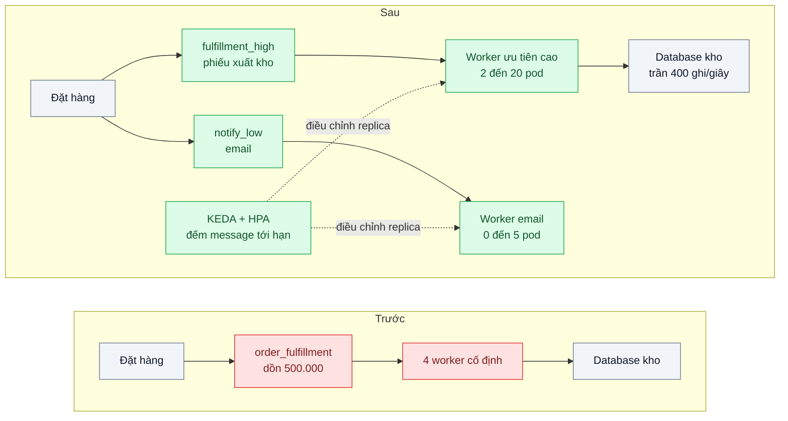
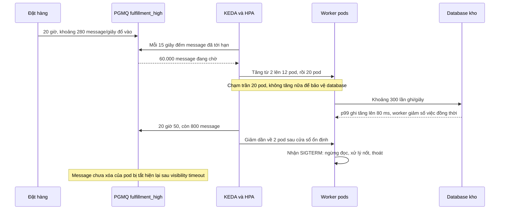

# Backpressure & Consumer Autoscaling (lag-based) — Hàng đợi dồn 500k message tối flash sale, sáng mới xử lý xong

| Scope | Mức độ | Trạng thái | Pattern gốc | Cập nhật |
|---|---|---|---|---|
| 14 · backend / queueing / message queueing | 🔴 Nâng cao | 📋 Kế hoạch | Queue-Based Load Leveling + lag-based autoscaling — Azure; Amazon Builders' Library "Avoiding insurmountable queue backlogs"; KEDA docs | 2026-10-06 |

> **Một câu tóm tắt:** Co giãn số worker theo độ dài hàng đợi bằng KEDA, đặt trần số worker theo sức chịu của database phía sau, tách hàng theo mức ưu tiên và cho worker tự giảm tốc khi database chậm — để backlog flash sale được xử lý trong vài chục phút thay vì tới rạng sáng, mà ngày thường không phải trả tiền cho worker ngồi không.

## 1. Bài toán thực tế (What)

**Bối cảnh** *(doanh nghiệp giả định, số liệu minh họa)*
Sàn thương mại điện tử: sau khi đặt hàng, message `OrderPlaced` vào hàng `order_fulfillment` (PGMQ) để worker tạo phiếu xuất kho, tính hoa hồng và gửi email xác nhận. Ngày thường khoảng 30 message/giây. Flash sale lúc 20 giờ tạo 500.000 message trong 30 phút. Có 4 worker cố định trên Kubernetes, mỗi worker xử lý khoảng 15 message/giây khi database kho đang bận.

**Triệu chứng người kinh doanh nhìn thấy**
- Phiếu xuất kho của đơn lúc 20 giờ tới gần 1 giờ sáng mới có; ca kho tối không có việc, ca sáng quá tải; cam kết "giao trong 24 giờ" bị vỡ với hàng chục nghìn đơn.
- Khách không nhận email xác nhận trong vài giờ, gọi tổng đài hỏi đơn có thành công không.
- Có lần tăng tay lên 30 worker thì database kho quá tải, mọi thứ còn chậm hơn; ngày thường thì 4 worker gần như ngồi không.

**Nguyên nhân kỹ thuật**
Năng lực xử lý cố định trong khi tải đến dồn theo đỉnh: 4 worker × 15 = 60 message/giây, trừ 30 message/giây vẫn tiếp tục đến, backlog chỉ giảm khoảng 30 message/giây — 500.000 message mất gần 5 giờ. Không có tín hiệu tự động để tăng hay giảm worker theo backlog, không có trần dựa trên sức chịu của database, và mọi loại việc (phiếu kho, email) chung một hàng cùng mức ưu tiên.

**Ràng buộc**
- Database kho chịu an toàn khoảng 400 lần ghi/giây.
- Backlog flash sale phải xử lý xong trong ≤ 45 phút; phiếu xuất kho ưu tiên hơn email.
- Ngày thường giảm về tối thiểu; không mất message khi giảm worker.

## 2. Vì sao dùng pattern này (Why)

**Nguyên nhân gốc mà pattern nhắm vào:** năng lực tiêu thụ cố định, không phản ứng theo backlog và không biết giới hạn của phụ thuộc phía sau.

**Pattern giải quyết thế nào:** Azure mô tả *Queue-Based Load Leveling*: hàng đợi là bộ đệm giữa nơi tạo việc và nơi xử lý, hấp thụ đỉnh để phía xử lý chạy theo năng lực của mình. Amazon Builders' Library ("Avoiding insurmountable queue backlogs") cảnh báo phần còn lại: backlog có thể kéo dài rất lâu nếu tốc độ xử lý không vượt đủ xa tốc độ đến, nên phải đo tuổi message chứ không chỉ độ dài, và thiết kế trước cách hệ thống hồi phục khi backlog lớn. Bài kết hợp bốn cơ chế. (1) *Co giãn theo backlog*: KEDA đọc số message đã tới hạn trong hàng và điều chỉnh số replica qua HPA. (2) *Trần theo phụ thuộc*: `maxReplicaCount` tính từ sức chịu của database, vì thêm worker vượt mức đó chỉ dời nút thắt. (3) *Backpressure trong worker*: khi độ trễ ghi database vượt ngưỡng, worker giảm số việc xử lý đồng thời. (4) *Tách hàng theo ưu tiên* (Azure *Priority Queue*): phiếu xuất kho và email ở hai hàng, co giãn riêng. Số worker cần được ước bằng định luật Little: muốn xả 500.000 message trong 45 phút khi vẫn có 30 message/giây đến, cần khoảng 215 message/giây, tức khoảng 15 worker — dưới trần 20 worker mà database chịu được.

**Lựa chọn khác đã cân nhắc**

| Lựa chọn | Giải quyết được gì | Vì sao không chọn (ở bài này) |
|---|---|---|
| Giữ nguyên + tối ưu nhỏ (cố định 12 worker, tối ưu truy vấn) | Đỉnh xử lý nhanh hơn | Trả tiền cho 12 worker cả ngày; không thích ứng khi đỉnh lớn hơn |
| HPA theo CPU | Có sẵn trong Kubernetes | Worker chờ I/O database nên CPU thấp dù backlog lớn — tín hiệu sai |
| Lên lịch tăng worker trước giờ flash sale | Đơn giản, dự đoán được | Không bắt được đỉnh bất ngờ; vẫn cần trần theo database |
| KEDA theo backlog + trần theo database + backpressure + tách hàng ưu tiên (chọn) | Phản ứng theo backlog, giảm về tối thiểu, bảo vệ database | Thêm KEDA; nhiều tham số phải chỉnh; độ trễ khởi động pod |

## 3. Thiết kế hệ thống (How)

### 3.1 Kiến trúc trước và sau



### 3.2 Luồng chính



### 3.3 Thành phần và trách nhiệm

| Thành phần | Trách nhiệm | Quyết định thiết kế đáng chú ý |
|---|---|---|
| Hai hàng theo ưu tiên | Tách phiếu xuất kho khỏi email | Mỗi hàng một ScaledObject, trần riêng |
| KEDA ScaledObject | Đọc số message đã tới hạn qua PostgreSQL scaler, đặt replica qua HPA | Truy vấn đếm phải rẻ; chu kỳ đọc 15 giây; cửa sổ ổn định trước khi giảm |
| Trần replica | `maxReplicaCount` tính từ sức chịu database | 20 worker × khoảng 15 lần ghi/giây ≤ 400; PgBouncer giữ tổng kết nối |
| Backpressure trong worker | Giảm số việc đồng thời khi p99 ghi database vượt ngưỡng | Tự hồi phục khi database nhẹ lại |
| Tắt êm | SIGTERM: ngừng đọc, xử lý nốt, thoát trong thời gian cho phép | Visibility timeout đủ ngắn để message của pod bị tắt sớm hiện lại |
| Đo | Độ dài hàng, tuổi message cũ nhất, tốc độ xả, số replica, p99 ghi | Cảnh báo theo tuổi message — đó là cam kết với khách |

### 3.4 Điểm dễ sai khi triển khai
- **Co giãn theo CPU.** Worker chờ I/O nên CPU thấp, không bao giờ tăng.
- **Không có trần.** Hàng trăm pod đập database và chậm hơn cả lúc chưa co giãn — đúng triệu chứng tăng tay 30 worker.
- **Giảm pod cắt ngang việc đang xử lý.** Cần tắt êm; consumer phải idempotent vì message có thể được xử lý lại (bài 04).
- **Tăng giảm liên tục.** Thiếu cửa sổ ổn định và cooldown làm pod khởi động rồi bị tắt liên tục.
- **Chỉ đo độ dài, không đo tuổi.** 10.000 message mới khác hẳn 10.000 message đã chờ 3 giờ.
- **Một hàng cho mọi việc.** Email marketing chen hàng với phiếu xuất kho đúng lúc cao điểm.

## 4. Tech stack và tác động (Impact techstack)

| Lớp | Công nghệ chọn | Vì sao chọn | Thay thế tương đương |
|---|---|---|---|
| Cluster | Kubernetes local bằng kind hoặc k3d | KEDA và HPA cần Kubernetes | Cluster cloud nhỏ |
| Co giãn | KEDA với PostgreSQL scaler | Co giãn theo truy vấn đếm message trong PGMQ, có thể giảm về 0 | KEDA RabbitMQ scaler, Kafka lag scaler |
| Hàng đợi | PGMQ trên PostgreSQL 16 | Stack mặc định; đếm message đã tới hạn bằng SQL | BullMQ, RabbitMQ |
| Pool kết nối | PgBouncer | Giữ tổng kết nối ổn định khi số pod thay đổi | Pool phía ứng dụng nhỏ hơn |
| Worker | TypeScript strict, xử lý SIGTERM, giới hạn đồng thời thích ứng | Tắt êm và backpressure là một phần của pattern | — |
| Tải | Script tạo 500.000 message trong 30 phút cộng nền 30 message/giây | Tái hiện đúng hình dạng đỉnh | k6 qua API đặt hàng |
| Đo | Prometheus + Grafana: độ dài, tuổi message cũ nhất, replica, p99 ghi database | Thấy cả độ nhanh lẫn độ an toàn | — |

**Thay đổi so với hệ thống hiện tại:** tách một hàng thành hai theo ưu tiên; thêm KEDA, PgBouncer và cấu hình trần; worker biết tắt êm và tự giảm tốc. Đội vận hành theo dõi tuổi message cũ nhất như cam kết dịch vụ và chỉnh trần khi database được nâng cấp.

## 5. Kết quả đầu ra và cách đo (Output impact)

| Chỉ số | Trước (minh họa) | Mục tiêu khi thực hành | Cách đo |
|---|---|---|---|
| Thời gian xả hết backlog flash sale | khoảng 5 giờ | ≤ 45 phút | Thời điểm message cuối của đợt được xóa |
| Tuổi message cũ nhất lúc đỉnh | hơn 4 giờ | ≤ 30 phút | Metric tuổi message cũ nhất |
| p99 ghi database kho lúc đỉnh | quá tải khi tăng tay | ≤ 100 ms | Exporter PostgreSQL hoặc `pg_stat_statements` |
| Số pod-giờ worker trong một ngày thường | 96 | ≤ 50 | Tích phân số replica trong Prometheus |
| Message mất khi giảm pod | không biết | 0 | Đối soát id đã gửi với id đã xử lý |
| Thời gian từ khi backlog tăng tới khi pod mới chạy | — | ≤ 60 giây | Sự kiện của HPA so với metric độ dài hàng |

> Số "trước" là minh họa để hình dung bài toán. Số "mục tiêu" chỉ được coi là đạt khi có số đo thật
> ở mục 8 kèm môi trường đo.

**Tác động nghiệp vụ mong đợi:** đơn flash sale có phiếu xuất kho ngay trong ca tối, giữ được cam kết giao trong 24 giờ; ngày thường chi phí worker giảm vì không còn chạy cố định cho đỉnh.

## 6. Đánh đổi và khi KHÔNG nên dùng

**Đánh đổi**
- Thêm KEDA và nhiều tham số (chu kỳ đọc, trần, cửa sổ ổn định) phải chỉnh bằng số đo. Có độ trễ phản ứng: pod cần thời gian khởi động; giảm về 0 thì việc đầu tiên chờ lâu hơn.
- Nhiều pod hơn nghĩa là nhiều kết nối hơn — cần PgBouncer và giám sát.

**Không nên dùng khi**
- Tải đều và đỉnh nhỏ, dự đoán được: số worker cố định hoặc lên lịch tăng trước là đủ.
- Nút thắt nằm ở database phía sau: thêm worker vô ích, tối ưu ghi theo lô hoặc database trước.
- Không chạy Kubernetes: dùng autoscaling group theo metric hàng đợi của nền tảng cloud.

**Liên quan**
- Hạ tầng: `../../16-backend-k8s/09-keda-scale-worker-theo-do-dai-hang-doi/`, `../../16-backend-k8s/02-graceful-shutdown-prestop-deploy-lam-rot-request-dang-xu-ly/`. Cùng chủ đề: `../../18-backend-scale/04-queue-based-load-leveling-dinh-20h-flash-sale/`, `../../18-backend-scale/08-autoscaling-policy-scale-cham-hon-traffic/`, `../../18-backend-scale/07-capacity-planning-use-method-mua-may-bao-nhieu-cho-tet/`.
- Nền tảng: `../01-work-queue-gui-100k-email-lam-treo-api/`, `../04-idempotent-consumer-event-den-hai-lan-tru-kho-hai-lan/`; kết nối database: `../../02-backend-database/03-connection-pool-200-pod-dap-postgres/`; thứ tự và lag theo partition: `../06-ordering-partition-key-trang-thai-don-den-sai-thu-tu/`.

## 7. Cơ sở tham khảo

- Microsoft Azure Architecture Center, "Queue-Based Load Leveling pattern" — https://learn.microsoft.com/azure/architecture/patterns/queue-based-load-leveling — hàng đợi làm bộ đệm hấp thụ đỉnh.
- Microsoft Azure Architecture Center, "Priority Queue pattern" — https://learn.microsoft.com/azure/architecture/patterns/priority-queue — tách việc theo mức ưu tiên.
- Amazon Builders' Library, "Avoiding insurmountable queue backlogs" — https://aws.amazon.com/builders-library/ — vì sao backlog có thể kéo dài, đo tuổi message, thiết kế để hồi phục.
- KEDA docs — https://keda.sh/docs/ — ScaledObject, PostgreSQL scaler, giảm về 0.
- Kubernetes docs, "Horizontal Pod Autoscaling" — https://kubernetes.io/docs/tasks/run-application/horizontal-pod-autoscale/ — hành vi tăng giảm, cửa sổ ổn định.
- J. D. C. Little, "A Proof for the Queuing Formula: L = λW", Operations Research, 1961 — cơ sở để ước số worker cần cho thời gian xả mục tiêu.

## 8. Kế hoạch thực hành

- [ ] Bước 1: dựng kind, PostgreSQL có PGMQ, PgBouncer, worker 4 pod cố định; database kho giả lập giới hạn khoảng 400 lần ghi/giây.
- [ ] Bước 2: đo "trước": script tạo 500.000 message trong 30 phút cộng nền 30 message/giây; ghi thời gian xả, tuổi message cũ nhất, p99 ghi.
- [ ] Bước 3: tách hai hàng, cài KEDA với PostgreSQL scaler, đặt trần theo tính toán, thêm backpressure và tắt êm cho worker.
- [ ] Bước 4: đo "sau" cùng kịch bản, thêm một đợt đỉnh bất ngờ gấp đôi; ghi số thật, phiên bản và môi trường vào mục 5.
- [ ] Bước 5: test: (a) số replica không vượt trần; (b) giảm pod giữa tải không mất message; (c) email không làm chậm phiếu xuất kho khi cả hai hàng đầy; (d) worker giảm số việc đồng thời khi p99 ghi vượt ngưỡng.

**Cấu trúc code dự kiến**
```text
src/
  worker/fulfillment-worker.ts     # [PATTERN] tắt êm khi SIGTERM, giới hạn đồng thời thích ứng
  worker/adaptive-concurrency.ts   # backpressure theo p99 ghi database
  loadgen/flash-sale-producer.ts   # 500.000 message trong 30 phút + nền
k8s/
  scaledobject-high.yaml           # [PATTERN] PostgreSQL scaler, trần 20 (bản low tương tự)
  worker-deployment.yaml           # terminationGracePeriodSeconds, preStop
  pgbouncer.yaml
test/
  replicas-never-exceed-cap.test.ts
  scale-down-loses-no-message.test.ts
  priority-queue-isolation.test.ts
```

**Cách chạy** *(điền khi bắt đầu code)*
```bash
kind create cluster && kubectl apply -f k8s/
pnpm install && pnpm test
```
