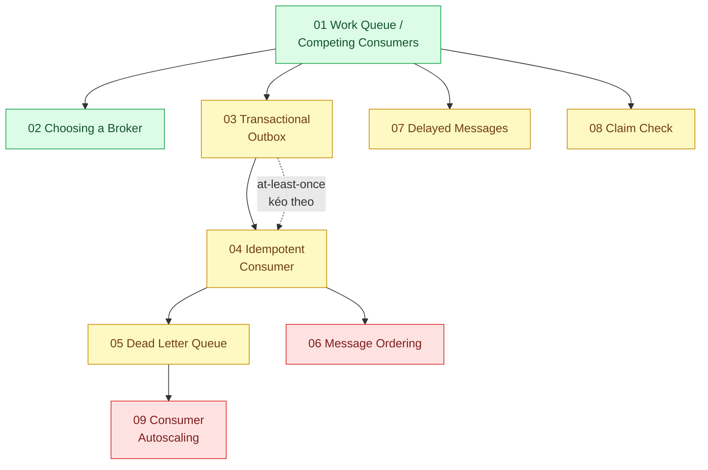

# 14 · Hàng đợi và message queue (`backend / queueing / message queueing`)

> **Phạm vi:** Tách công việc ra khỏi request và truyền sự kiện giữa thành phần qua queue/stream:
> chọn broker, publish đáng tin, tiêu thụ an toàn, xử lý lỗi, thứ tự, trễ, message lớn, mở rộng
> consumer. Dùng PGMQ/BullMQ làm điểm bắt đầu, RabbitMQ/Kafka/NATS khi bài cần.
>
> **Câu hỏi trung tâm:** Tách việc ra khỏi request mà không mất message, không xử lý trùng, không
> sai thứ tự?

## Bản đồ pattern trong scope

## Danh sách bài toán

| # | Bài toán (pattern — triệu chứng) | Mức | Pattern gốc / nguồn | Trạng thái |
|---|---|---|---|---|
| 01 | [Work Queue / Competing Consumers — Gửi 100k email marketing làm treo API đặt hàng](./01-work-queue-gui-100k-email-lam-treo-api/) | 🟢 | Hohpe & Woolf, *EIP*: Competing Consumers, Point-to-Point Channel; Azure "Competing Consumers"; BullMQ / PGMQ docs | 📋 |
| 02 | [Choosing a Broker — Team 5 người: Redis Streams, RabbitMQ, Kafka, NATS JetStream hay queue trong Postgres (PGMQ)?](./02-chon-broker-redis-rabbitmq-kafka-nats-pgmq-team-5-nguoi/) | 🟢 | Kafka docs "Design"; RabbitMQ docs; NATS JetStream docs; PGMQ README; DDIA ch.11 (log-based vs message broker) | 📋 |
| 03 | [Transactional Outbox — Ghi đơn hàng xong, crash trước khi publish → event mất, kho không trừ](./03-transactional-outbox-ghi-don-xong-crash-mat-event/) | 🟡 | microservices.io "Transactional outbox", "Polling publisher", "Transaction log tailing"; Debezium Outbox Event Router | 📋 |
| 04 | [Idempotent Consumer — Event tới hai lần (at-least-once), kho bị trừ hai lần](./04-idempotent-consumer-event-den-hai-lan-tru-kho-hai-lan/) | 🟡 | microservices.io "Idempotent Consumer"; *EIP* "Idempotent Receiver"; Kafka docs (delivery semantics) | 📋 |
| 05 | [Dead Letter Queue & Poison Message — Một message lỗi retry vô hạn, chặn cả hàng đợi](./05-dead-letter-queue-mot-message-loi-chan-ca-hang-doi/) | 🟡 | *EIP* "Dead Letter Channel"; AWS SQS docs "Dead-letter queues"; RabbitMQ docs "Dead Letter Exchanges" | 📋 |
| 06 | [Message Ordering (partition key) — "Đã giao" tới trước "Đang giao", trạng thái đơn nhảy ngược](./06-ordering-partition-key-trang-thai-don-den-sai-thu-tu/) | 🔴 | Kafka docs (ordering within partition); Azure "Sequential Convoy"; *EIP* "Resequencer" | 📋 |
| 07 | [Delayed / Scheduled Messages — Hủy đơn chưa thanh toán sau 15 phút cho 1 triệu đơn/ngày](./07-delayed-message-huy-don-chua-thanh-toan-sau-15-phut/) | 🟡 | BullMQ docs "Delayed jobs"; RabbitMQ Delayed Message Exchange plugin; AWS SQS "Delay queues" | 📋 |
| 08 | [Claim Check — Message chứa file PDF 50 MB làm nghẽn broker](./08-claim-check-message-50mb-lam-nghen-broker/) | 🟡 | *EIP* "Claim Check"; Azure "Claim-Check" | 📋 |
| 09 | [Backpressure & Consumer Autoscaling (lag-based) — Hàng đợi dồn 500k message tối flash sale, sáng mới xử lý xong](./09-consumer-lag-autoscale-hang-doi-dong-500k-message-toi-flash-sale/) | 🔴 | KEDA docs (scaler theo độ dài queue); Amazon Builders' Library "Avoiding insurmountable queue backlogs"; Azure "Queue-Based Load Leveling" | 📋 |

## Lộ trình đề xuất trong scope

1. **Work queue → Chọn broker** — bắt đầu bằng PGMQ trong Postgres sẵn có; hiểu khi nào cần broker riêng.
2. **Outbox → Idempotent consumer → DLQ** — bộ ba "đáng tin": không mất, không trùng, không kẹt.
   Đây là lõi của scope và là điều kiện cho Saga (scope 07).
3. **Delayed, Claim check** — hai bài tiện ích hay gặp.
4. **Ordering → Autoscaling** — nâng cao, cần Kafka/KEDA.

## Kiến thức nền cần có trước

- Transaction DB (scope 02) — Outbox dựa trên atomic write.
- Khái niệm at-most-once / at-least-once / exactly-once (DDIA ch.11).
- Docker Compose để dựng broker local.

## Liên kết với scope khác

- `07-backend-microservices` bài 07 (Saga) dùng Outbox + Idempotent Consumer.
- `05-backend-search` bài 05 (CDC sync) và `13-backend-transporter` bài 05 (async request-reply).
- `16-backend-k8s` bài 09 (KEDA) là hạ tầng cho bài 09 ở đây.
- `08-backend-monolith` bài 02 — background jobs là dạng đơn giản nhất của work queue.

## Nguồn tổng quan cho scope

- Hohpe & Woolf, *Enterprise Integration Patterns* — https://www.enterpriseintegrationpatterns.com/
- Martin Kleppmann, *DDIA* ch.11 "Stream Processing".
- Chris Richardson, microservices.io — Transactional outbox, Idempotent consumer.
