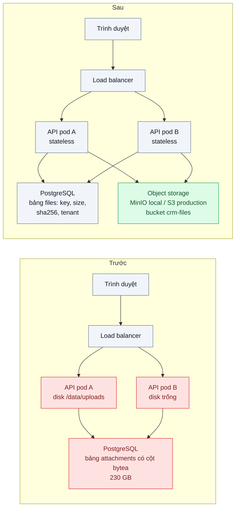
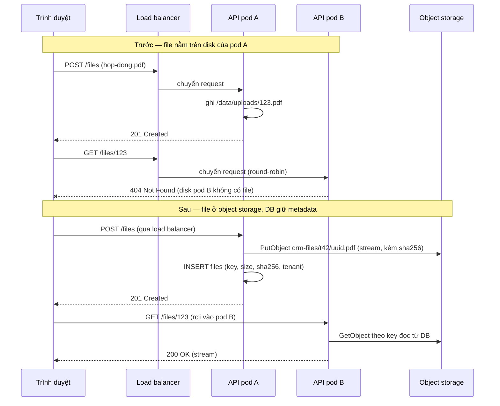

# Object Storage vs DB / Local Disk — File đính kèm lưu trong DB làm backup 200 GB; lưu trên disk server thì scale ngang mất file

| Scope | Mức độ | Trạng thái | Pattern gốc | Cập nhật |
|---|---|---|---|---|
| 15 · backend / storage | 🟢 Cơ bản | 📋 Kế hoạch | Object Storage (S3 API) — AWS S3 docs, MinIO docs; "Backing services", "Processes" — The Twelve-Factor App (Wiggins, 2011) | 2026-10-06 |

> **Một câu tóm tắt:** Đưa file ra khỏi PostgreSQL và khỏi disk của từng server, lưu vào object storage theo S3 API; DB chỉ giữ metadata, nên backup DB nhỏ lại và mọi replica đều "thấy" cùng một file.

## 1. Bài toán thực tế (What)

**Bối cảnh** *(doanh nghiệp giả định, số liệu minh họa)*
Một SaaS CRM B2B bán cho khoảng 300 công ty. Hợp đồng, báo giá, email đính kèm được lưu thành file: module cũ ghi nội dung file vào cột `bytea` trong PostgreSQL, module mới hơn ghi ra thư mục `/data/uploads` trên server API. Sau ba năm, DB nặng 230 GB trong đó khoảng 200 GB là file; backend vừa chuyển lên Kubernetes với 3 replica.

**Triệu chứng người kinh doanh nhìn thấy**
- Backup đêm chạy 5 giờ, có đêm không xong trước giờ làm; lần diễn tập khôi phục gần nhất mất 9 giờ — nếu có sự cố, khách hàng mất gần một ngày làm việc.
- Từ khi chạy 3 replica, khách báo "tải hợp đồng lúc được lúc không": file ghi trên disk của pod A, request tải rơi vào pod B thì báo không tìm thấy.
- Chi phí disk SSD cho DB và cho replica tăng theo file, dù phần lớn file cũ không ai mở lại.

**Nguyên nhân kỹ thuật**
PostgreSQL phải mang khối dữ liệu nhị phân qua mọi cơ chế của nó: WAL, replication, `VACUUM`, `pg_dump`; một hợp đồng 20 MB đọc một lần vẫn chiếm chỗ trong shared buffers và trong mọi bản backup. Disk cục bộ thì vi phạm nguyên tắc "Processes" của Twelve-Factor App: tiến trình phải stateless, dữ liệu bền phải nằm ở backing service, nên scale ngang hoặc pod bị lập lịch lại là mất đường tới file.

**Ràng buộc**
- Không dừng dịch vụ để di chuyển 200 GB file; quá trình di trú chạy song song với vận hành.
- Mỗi file truy được về khách hàng-tổ chức sở hữu (multi-tenant), có checksum để chứng minh toàn vẹn khi kiểm toán.
- Môi trường local chạy được không cần tài khoản cloud.

## 2. Vì sao dùng pattern này (Why)

**Nguyên nhân gốc mà pattern nhắm vào:** file là dữ liệu lớn, ghi một lần đọc nhiều, không cần giao dịch hay join — đặt nó vào hệ thống thiết kế cho giao dịch (DB) hoặc gắn với một máy (disk) là sai chỗ.

**Pattern giải quyết thế nào:** object storage lưu mỗi file thành một object định danh bằng `bucket/key`, truy cập qua HTTP (S3 API), bền nhờ sao chép nội bộ của dịch vụ, mở rộng gần như không giới hạn và tính tiền theo GB. DB chỉ còn bảng `files` (key, kích cỡ, content-type, sha256, chủ sở hữu). Mọi replica của API đọc/ghi cùng một bucket nên không còn chuyện "file nằm ở pod nào". Local chạy MinIO (S3-compatible), production dùng S3/R2 — cùng một SDK, chỉ đổi endpoint.

**Lựa chọn khác đã cân nhắc**

| Lựa chọn | Giải quyết được gì | Vì sao không chọn (ở bài này) |
|---|---|---|
| Giữ nguyên + tối ưu nhỏ (tách tablespace cho bảng file, `pg_dump --exclude-table-data`, nén) | Backup logic nhỏ hơn, DB chính nhẹ hơn một phần | File vẫn đi qua WAL và replication; vẫn phải backup bảng file bằng cách khác; đọc file vẫn tốn RAM của DB |
| Volume dùng chung (NFS / PVC ReadWriteMany) cho mọi pod | Mọi replica thấy cùng file, code gần như không đổi | Thêm một hệ thống file mạng phải vận hành, điểm nghẽn I/O; không có presigned URL, CDN, lifecycle — không mở đường cho bài 02–06 |
| PostgreSQL Large Objects (`lo_*`) thay cho `bytea` | Stream từng đoạn thay vì nạp cả file | Vẫn nằm trong DB, vẫn vào backup/WAL; thêm cơ chế quản lý OID dễ rò rỉ |
| Object storage (S3 API) + metadata trong DB — **chọn** | Backup DB nhỏ, replica nào cũng truy được, nền cho presigned URL, CDN, tiering | Thêm một backing service và một khâu di trú dữ liệu |

## 3. Thiết kế hệ thống (How)

### 3.1 Kiến trúc trước và sau



### 3.2 Luồng chính

Luồng lỗi mà pattern xử lý: file ghi trên disk của một pod, request tải rơi vào pod khác.



### 3.3 Thành phần và trách nhiệm

| Thành phần | Trách nhiệm | Quyết định thiết kế đáng chú ý |
|---|---|---|
| Bảng `files` (PostgreSQL) | Nguồn sự thật về metadata: `id`, `tenant_id`, `bucket`, `key`, `size`, `content_type`, `sha256`, `status`, `created_at` | Key không chứa tên file người dùng đặt (`<tenant>/<uuid>`); tên gốc lưu riêng để hiển thị |
| `FileStorage` (port) + `S3FileStorage` (adapter) | Put/Get/Delete object bằng stream, không nạp cả file vào RAM | Interface nhỏ để test thay bằng adapter giả; AWS SDK v3 dùng chung cho MinIO và S3 |
| Job `migrate-bytea-to-s3` | Đọc từng dòng `bytea`, đẩy lên bucket, so sha256, ghi key; chạy lại được | Theo lô, có checkpoint; không xóa cột cũ cho tới khi đối soát xong |
| API `/files` | Kiểm tra quyền theo tenant, stream nội dung, đặt `Content-Disposition` | Giai đoạn chuyển tiếp: có `key` thì đọc object storage, chưa có thì đọc `bytea` |
| MinIO (Docker Compose) | S3-compatible local, bucket `crm-files`, tài khoản riêng cho app | Bật versioning sớm để chuẩn bị cho bài 07 |

### 3.4 Điểm dễ sai khi triển khai
- `GetObject` rồi `Buffer.concat` toàn bộ trước khi trả — file 500 MB chiếm 500 MB RAM mỗi request. Pipe stream của SDK thẳng vào response.
- Dùng tên file người dùng đặt làm key → trùng tên, ký tự lạ, lộ thông tin. Dùng UUID, lưu tên gốc trong DB.
- Xóa cột `bytea` ngay sau khi copy mà chưa đối soát sha256 — sai một file là mất vĩnh viễn. Giữ hai nguồn tới khi không còn dòng thiếu `key` và đối soát xong, rồi mới `DROP COLUMN` (xem Expand/Contract ở scope 02 bài 08).
- Quên `forcePathStyle: true` khi trỏ SDK vào MinIO local → lỗi DNS vì SDK ghép tên bucket vào hostname.
- Ghi object thành công nhưng INSERT metadata thất bại → object mồ côi. Ghi DB trước với `status = pending`, upload xong mới đổi `ready`; job dọn object `pending` quá hạn.

## 4. Tech stack và tác động (Impact techstack)

| Lớp | Công nghệ chọn | Vì sao chọn | Thay thế tương đương |
|---|---|---|---|
| Ngôn ngữ / runtime | TypeScript strict, Node 20+ | Stack mặc định của repo; `stream/promises` đủ để pipe file không tốn RAM | Go, Java |
| HTTP app | NestJS | Module `files` tách rõ port/adapter; DI để thay adapter trong test | Fastify thuần |
| Object storage | MinIO (local, Docker Compose) → AWS S3 hoặc Cloudflare R2 (production) | Cùng S3 API, chỉ đổi endpoint và credential | Google Cloud Storage (chế độ tương thích S3), Azure Blob (API khác) |
| SDK | `@aws-sdk/client-s3`, `@aws-sdk/lib-storage` | Chính thức, hỗ trợ stream và multipart cho upload lớn | MinIO JavaScript SDK |
| Metadata | PostgreSQL 16 | Đã có sẵn; metadata cần giao dịch và quan hệ với tenant | — |
| Test / đo | Vitest, k6, `docker stats`, `pg_dump` + `time` | Đo được độ trễ, RAM và kích cỡ backup | Jest, autocannon |

**Thay đổi so với hệ thống hiện tại:** thêm MinIO/S3 làm backing service và bảng `files`; sửa module tải lên/tải xuống để đi qua `FileStorage`; thêm job di trú chạy nền. Đội vận hành học thêm: quản lý bucket và quyền (IAM/policy), `mc` CLI của MinIO, theo dõi dung lượng bucket thay cho dung lượng DB.

## 5. Kết quả đầu ra và cách đo (Output impact)

| Chỉ số | Trước (minh họa) | Mục tiêu khi thực hành | Cách đo |
|---|---|---|---|
| Kích cỡ DB | 230 GB (200 GB là file) | Giảm đúng phần file đã di trú (đo trên dataset mẫu ~5 GB local) | `SELECT pg_size_pretty(pg_database_size(current_database()))` trước/sau |
| Thời gian `pg_dump` | 5 giờ | Tỷ lệ với phần metadata còn lại; ghi số đo thật trên dataset mẫu | `time pg_dump -Fc crm > backup.dump` |
| Tỷ lệ GET /files trả 200 khi chạy 3 replica | ~33% lỗi 404 (file nằm trên 1 trong 3 pod) | 100% trả 200 | k6 `check(res.status === 200)` khi `docker compose up --scale api=3` |
| RAM đỉnh của API khi tải 10 file 200 MB song song | Tăng theo tổng kích cỡ file (buffer) | Gần như không đổi (stream) | `docker stats` trong lúc k6 chạy |
| p95 tải file 20 MB | — | Không tệ hơn đọc từ `bytea` | k6 `http_req_duration` p(95) |

> Số "trước" là minh họa để hình dung bài toán. Số "mục tiêu" chỉ được coi là đạt khi có số đo thật
> ở mục 8 kèm môi trường đo.

**Tác động nghiệp vụ mong đợi:** backup và khôi phục DB rút ngắn nên cửa sổ mất dữ liệu và thời gian ngừng dịch vụ nhỏ hơn; khách không còn gặp "file lúc có lúc không"; chi phí lưu trữ chuyển từ SSD của DB sang object storage rẻ hơn theo GB và phân bậc được ở bài 06.

## 6. Đánh đổi và khi KHÔNG nên dùng

**Đánh đổi**
- Thêm một backing service phải giám sát, phân quyền, backup (object storage bền nhưng vẫn xóa nhầm được — xem bài 07).
- Mất tính giao dịch giữa file và metadata: cần quy ước `pending → ready` và job dọn object mồ côi.
- Giai đoạn di trú phải duy trì hai đường đọc, code tạm thời phức tạp hơn.

**Không nên dùng khi**
- File nhỏ (vài KB), ít, và cần nằm trong cùng transaction với dữ liệu (ảnh đại diện nhỏ, cấu hình JSON): `bytea` đơn giản hơn và đủ tốt.
- Ứng dụng chạy một instance, không có kế hoạch scale ngang và đã có backup disk tin cậy — disk cục bộ vẫn ổn nếu nhận thức rõ giới hạn.
- Môi trường không cho phép dịch vụ ngoài và không thể tự vận hành MinIO.

**Liên quan**
- `../02-presigned-url-valet-key-upload-500mb-qua-api-lam-nghen/` — bước tiếp theo: bỏ API khỏi đường đi của byte.
- `../07-backup-pitr-xoa-nham-bang-luc-14h-backup-dem-qua/` — backup cho cả DB và bucket sau khi tách.
- `../../02-backend-database/08-expand-contract-doi-ten-cot-100-trieu-dong/` — cách bỏ cột `bytea` không dừng dịch vụ.
- `../../18-backend-scale/01-stateless-session-externalized-login-server-a-server-b-khong-biet/` — cùng nguyên tắc stateless, áp cho session.

## 7. Cơ sở tham khảo

- AWS S3 docs, *Amazon S3 User Guide* — https://docs.aws.amazon.com/s3/ — mô hình bucket/object/key, tính bền và các API `PutObject`/`GetObject` mà bài dựa vào.
- MinIO docs — https://min.io/docs/ — chạy S3-compatible local bằng Docker, tạo bucket, user/policy, `mc` CLI để đo dung lượng.
- Adam Wiggins, *The Twelve-Factor App* (2011), "IV. Backing services" và "VI. Processes" — https://12factor.net/ — lý do tiến trình phải stateless và file bền phải nằm ở backing service.
- AWS SDK for JavaScript v3 docs, `@aws-sdk/client-s3` và `@aws-sdk/lib-storage` — https://docs.aws.amazon.com/sdk-for-javascript/ — stream upload/download dùng ở mục 4.
- PostgreSQL docs, "Binary Data Types" và "Large Objects" — https://www.postgresql.org/docs/ — hai cách lưu file trong DB được so sánh ở mục 2.

## 8. Kế hoạch thực hành

- [ ] Bước 1: Docker Compose gồm PostgreSQL 16 + MinIO; seed bảng `attachments` với 2.000 file `bytea` (tổng ~5 GB sinh ngẫu nhiên); API kiểu "trước" (cột `bytea` + thư mục `/data/uploads`).
- [ ] Bước 2: Đo "trước": `pg_database_size`, `time pg_dump`, k6 GET với `--scale api=3` (ghi tỷ lệ 404), `docker stats` khi tải song song.
- [ ] Bước 3: Áp dụng pattern: bảng `files`, `S3FileStorage` stream, API đọc theo thứ tự key → bytea, job di trú theo lô có checkpoint và đối soát sha256.
- [ ] Bước 4: Đo "sau" cùng kịch bản, ghi vào mục 5 kèm môi trường (máy, phiên bản, số lần chạy).
- [ ] Bước 5: Test: upload qua pod A rồi tải qua pod B trả 200; sha256 object bằng sha256 gốc; job di trú chạy hai lần không tạo trùng; `DROP COLUMN` chỉ khi không còn dòng thiếu key.

**Cấu trúc code dự kiến**
```text
src/
  truoc/                       # API lưu bytea + disk cục bộ (tái hiện triệu chứng)
  sau/
    files/
      file-storage.ts          # port
      s3-file-storage.ts       # adapter MinIO/S3 (stream)
      files.controller.ts
      files.repository.ts
    migrate/
      migrate-bytea-to-s3.ts   # job theo lô, checkpoint, đối soát
  shared/
test/
  files.test.ts
  migrate.test.ts
bench/
  download.k6.js
docker-compose.yml             # postgres, minio, api (scale được)
.env.example
```

**Cách chạy** *(điền khi bắt đầu code)*
```bash
docker compose up -d --scale api=3
pnpm install && pnpm test
k6 run bench/download.k6.js
```
