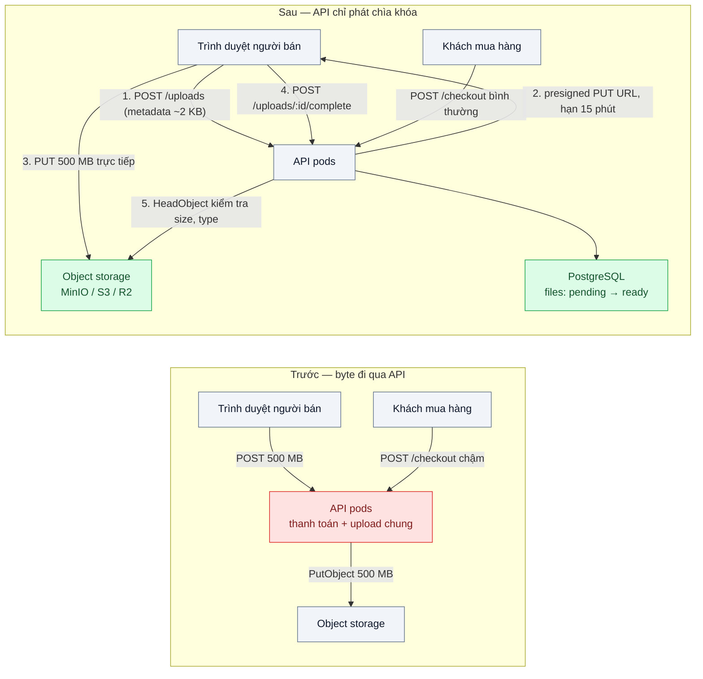
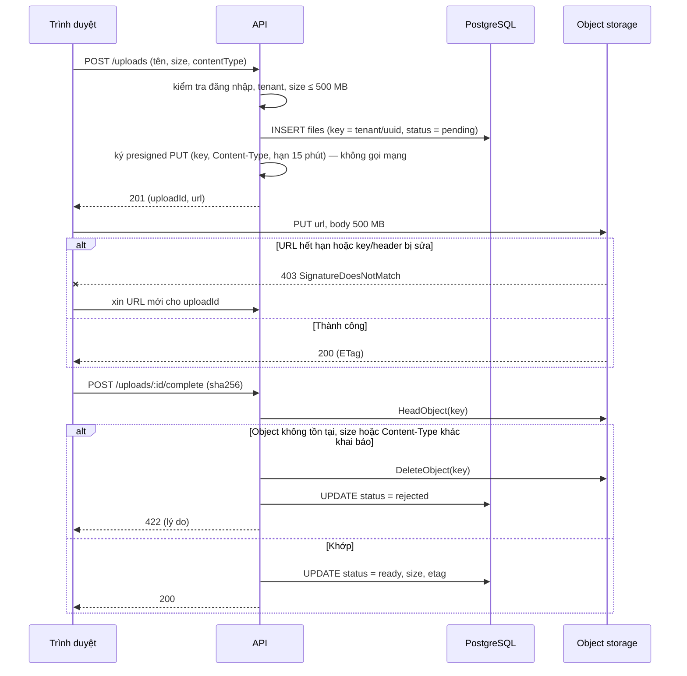

# Presigned URL (Valet Key) — Upload file 500 MB đi qua API server làm nghẽn toàn bộ API

| Scope | Mức độ | Trạng thái | Pattern gốc | Cập nhật |
|---|---|---|---|---|
| 15 · backend / storage | 🟢 Cơ bản | 📋 Kế hoạch | Valet Key — Microsoft Azure Architecture Center, Cloud Design Patterns; Presigned URLs — AWS S3 docs | 2026-10-06 |

> **Một câu tóm tắt:** API chỉ phát một "chìa khóa tạm" (presigned URL có hạn, gắn với một key và quyền PUT) để trình duyệt tải thẳng lên object storage; byte của file không còn đi qua API server.

## 1. Bài toán thực tế (What)

**Bối cảnh** *(doanh nghiệp giả định, số liệu minh họa)*
Sàn TMĐT có 20.000 người bán; mỗi sản phẩm có video giới thiệu và catalog PDF, file tới 500 MB. Backend là API Node chạy 4 pod, vừa phục vụ giỏ hàng/thanh toán vừa nhận upload: trình duyệt POST multipart/form-data lên API, API đọc body rồi ghi sang object storage. Một upload chiếm một kết nối và băng thông của pod trong 2–5 phút.

**Triệu chứng người kinh doanh nhìn thấy**
- Giờ người bán đăng hàng (9h–11h), trang thanh toán chậm hẳn: p95 của API thanh toán từ 250 ms lên 3 giây, một phần request quá hạn — khách bỏ giỏ đúng lúc đang mua.
- Hóa đơn băng thông tăng vì mỗi file đi hai lần: vào API rồi từ API ra object storage.
- Vài pod bị khởi động lại vì hết RAM khi nhiều người bán upload cùng lúc; người bán phải tải lại từ đầu.

**Nguyên nhân kỹ thuật**
API đóng vai proxy byte. Node đọc body (có lúc đệm cả file trong RAM), rồi ghi sang storage; băng thông card mạng, slot kết nối ở ingress/load balancer, CPU mã hóa TLS và bộ đệm của pod đều tiêu tốn cho việc "chuyển byte" không có logic nghiệp vụ nào, trong khi cùng pool pod đó phải phục vụ thanh toán.

**Ràng buộc**
- Chỉ người bán đã đăng nhập mới upload; file phải nằm đúng không gian (tenant) của họ; giới hạn 500 MB mỗi file.
- Không lộ credential của object storage ra trình duyệt.
- Môi trường local chạy MinIO; production S3 hoặc R2 với cùng code.

## 2. Vì sao dùng pattern này (Why)

**Nguyên nhân gốc mà pattern nhắm vào:** API đứng trên đường đi của byte dù nó chỉ cần làm hai việc nhỏ — xác thực/phân quyền và ghi metadata.

**Pattern giải quyết thế nào:** Valet Key (Azure) mô tả việc app cấp cho client một token/URL bị giới hạn (tài nguyên nào, quyền gì, tới khi nào) để client nói chuyện trực tiếp với storage. Presigned URL của S3 là một hiện thực: app dùng credential của mình ký (SigV4) một URL buộc chặt method `PUT`, key, thời hạn và các header đã ký (như `Content-Type`). Trình duyệt `PUT` thẳng lên bucket; xong thì gọi API "hoàn tất", API `HeadObject` kiểm tra object rồi mới đánh dấu `ready`. API chỉ xử lý vài KB metadata cho mỗi upload 500 MB.

**Lựa chọn khác đã cân nhắc**

| Lựa chọn | Giải quyết được gì | Vì sao không chọn (ở bài này) |
|---|---|---|
| Giữ nguyên + tối ưu nhỏ (stream body sang storage bằng `@aws-sdk/lib-storage`, không đệm RAM) | Hết lỗi hết RAM | Băng thông và slot kết nối vẫn đi qua API; thanh toán vẫn chung pool với upload |
| Tách "upload service" thành deployment riêng | Cô lập thanh toán khỏi upload | Vẫn trả hai lần băng thông, vẫn phải scale một dịch vụ chỉ để chuyển byte |
| Cấp credential tạm (STS) cho trình duyệt gọi S3 trực tiếp | Linh hoạt nhiều thao tác | Phân quyền phức tạp, dễ cấp rộng hơn cần; không có trên MinIO/R2 đồng nhất |
| Presigned PUT (+ presigned POST khi cần chặn kích cỡ) — **chọn** | Byte không qua API; quyền hẹp theo key, method, hạn | Logic upload chuyển sang client; cần bước "hoàn tất" và job dọn object mồ côi |

## 3. Thiết kế hệ thống (How)

### 3.1 Kiến trúc trước và sau



### 3.2 Luồng chính

Luồng lỗi mà pattern xử lý: URL hết hạn hoặc bị sửa key, và client khai sai kích cỡ/loại file.



### 3.3 Thành phần và trách nhiệm

| Thành phần | Trách nhiệm | Quyết định thiết kế đáng chú ý |
|---|---|---|
| `UploadsController` | Hai endpoint: cấp URL (`POST /uploads`) và hoàn tất (`POST /uploads/:id/complete`) | Rate limit endpoint cấp URL theo người dùng (scope 13 bài 03) để không bị xin URL hàng loạt |
| `Presigner` | Gói `getSignedUrl` của AWS SDK; chọn key, hạn, header ký | Key do server sinh (`<tenant>/<uuid>.<ext>`), client không bao giờ chọn key |
| Bảng `files` | Trạng thái `pending → ready | rejected`, metadata, ETag | `pending` quá 24 giờ thì job dọn xóa object nếu có |
| Bucket MinIO/S3 | Nhận PUT trực tiếp từ trình duyệt | Bật CORS cho origin của web app; bucket private, không đọc công khai |
| Job `cleanup-pending` | Dọn object mồ côi và dòng `pending` quá hạn | Chạy mỗi giờ; idempotent |

### 3.4 Điểm dễ sai khi triển khai
- Ký `Content-Type` nhưng trình duyệt gửi header khác (hoặc không gửi) → 403 khó hiểu. Thống nhất: client gửi đúng header đã ký, hoặc không ký `Content-Type` và kiểm tra bằng `HeadObject` + sniffing (bài 08).
- Quên cấu hình CORS trên bucket → `PUT` từ trình duyệt bị chặn ở preflight dù URL đúng. MinIO local cấu hình qua biến `MINIO_API_CORS_ALLOW_ORIGIN`.
- Presigned PUT không giới hạn được kích cỡ body. Cần chặn cứng thì dùng presigned POST với điều kiện `content-length-range`, hoặc chấp nhận kiểm tra sau bằng `HeadObject` rồi xóa.
- Lệch giờ máy chủ vài phút → chữ ký bị coi là hết hạn. Đồng bộ NTP; đừng đặt hạn quá ngắn (dưới 1 phút).
- URL là bearer: ai có URL đều PUT được trong hạn. Vì vậy key ngẫu nhiên, hạn ngắn, và không bao giờ coi object là `ready` khi chưa qua bước hoàn tất.
- Đánh dấu `ready` chỉ dựa vào lời client, không `HeadObject` → dòng DB trỏ tới object không tồn tại.

## 4. Tech stack và tác động (Impact techstack)

| Lớp | Công nghệ chọn | Vì sao chọn | Thay thế tương đương |
|---|---|---|---|
| Ngôn ngữ / runtime | TypeScript strict, Node 20+ | Stack mặc định của repo | — |
| HTTP app | NestJS | Guard xác thực + module `uploads` gọn | Fastify thuần |
| Ký URL | `@aws-sdk/client-s3` + `@aws-sdk/s3-request-presigner` | SDK chính thức; ký cục bộ không tốn round-trip; dùng được với MinIO/S3/R2 | MinIO JS SDK `presignedPutObject` |
| Object storage | MinIO (local) → S3 / Cloudflare R2 (production) | Cùng S3 API và presigned URL; R2 bớt phí egress | GCS (chế độ tương thích S3) |
| Metadata | PostgreSQL 16 | Trạng thái upload cần giao dịch | — |
| Đo | k6 (`http.put` với body nhị phân từ `open(..., 'b')`), `docker stats` | Đo p95 thanh toán trong lúc upload chạy song song | autocannon |

**Thay đổi so với hệ thống hiện tại:** endpoint upload cũ thay bằng hai endpoint nhỏ; frontend đổi sang `PUT` trực tiếp; bucket cần CORS và policy riêng cho app; thêm job dọn. Đội vận hành học thêm: đọc log truy cập của bucket thay cho log API khi điều tra upload lỗi.

## 5. Kết quả đầu ra và cách đo (Output impact)

| Chỉ số | Trước (minh họa) | Mục tiêu khi thực hành | Cách đo |
|---|---|---|---|
| p95 `POST /checkout` khi có 10 upload 500 MB chạy song song | 3 giây | Không khác lúc không có upload quá 10% | k6 hai scenario song song: `checkout` (constant-arrival-rate) và `upload` (10 VU PUT file 500 MB) |
| Băng thông vào pod API cho một upload 500 MB | ~500 MB | Vài KB (metadata) | `docker stats` cột NET I/O trước/sau mỗi lượt |
| RAM đỉnh của pod API khi 10 upload song song | Tăng theo số upload | Phẳng | `docker stats` trong lúc k6 chạy |
| Tỷ lệ upload thành công 500 MB | Giảm khi tải cao (timeout, OOM) | 100% trong kịch bản đo | k6 `check(res.status === 200)` ở bước PUT và `complete` |
| Thời gian từ "hoàn tất" tới `ready` | — | < 200 ms (một `HeadObject`) | Log thời gian trong `UploadsController` |

> Số "trước" là minh họa để hình dung bài toán. Số "mục tiêu" chỉ được coi là đạt khi có số đo thật
> ở mục 8 kèm môi trường đo.

**Tác động nghiệp vụ mong đợi:** thanh toán không còn chậm theo giờ người bán đăng hàng; tiền băng thông cho upload giảm một nửa; pod API scale theo request nghiệp vụ, không theo số người đang tải file.

## 6. Đánh đổi và khi KHÔNG nên dùng

**Đánh đổi**
- Logic upload (retry, báo tiến độ, xử lý 403) dời sang client; mỗi nền tảng client phải làm lại.
- Hai bước (cấp URL → hoàn tất) tạo trạng thái trung gian và object mồ côi cần dọn.
- Không kiểm tra được nội dung trước khi nó nằm trong bucket; phải quét sau (bài 08) và chỉ công khai khi đã sạch.
- Thêm bề mặt lỗi: CORS, lệch giờ, header ký không khớp.

**Không nên dùng khi**
- File nhỏ (dưới vài trăm KB) và cần xử lý đồng bộ ngay trong request (cắt ảnh đại diện rồi trả kết quả): đi qua API đơn giản và đủ nhanh.
- Cần biến đổi hoặc kiểm duyệt nội dung *trước khi* lưu và không có hàng đợi xử lý sau.
- Client không được phép gọi ra domain khác ngoài API (mạng nội bộ chặn chặt).

**Liên quan**
- `../01-object-storage-vs-luu-file-trong-db-hoac-disk-server/` — điều kiện tiên quyết: file đã nằm ở object storage.
- `../03-multipart-resumable-upload-video-dut-mang-lam-lai-tu-dau/` — presigned URL cho từng part khi file lớn.
- `../08-upload-security-virus-scan-content-type-sniffing/` — kiểm tra nội dung sau khi upload trực tiếp.
- `../05-signed-cdn-url-hop-dong-rieng-tu-bi-share-link/` — Valet Key chiều tải xuống.
- `../../19-backend-frontend-authenticate/02-session-cookie-vs-jwt-spa-luu-token-o-dau/` — ai được xin URL.

## 7. Cơ sở tham khảo

- Microsoft Azure Architecture Center, "Valet Key pattern" — https://learn.microsoft.com/azure/architecture/patterns/valet-key — định nghĩa pattern, điều kiện áp dụng và các rủi ro (token bị lộ, giới hạn quyền).
- AWS S3 docs, "Download and upload objects with presigned URLs" — https://docs.aws.amazon.com/AmazonS3/latest/userguide/using-presigned-url.html — cơ chế ký, thời hạn, ai ký thì quyền của người đó quyết định.
- AWS S3 API Reference, "POST Object" và "Creating a POST Policy" — https://docs.aws.amazon.com/AmazonS3/latest/API/ — điều kiện `content-length-range` dùng khi cần chặn kích cỡ.
- MinIO docs — https://min.io/docs/ — cấu hình CORS, `mc share upload` để thử presigned URL từ CLI.
- AWS SDK for JavaScript v3, `@aws-sdk/s3-request-presigner` — https://docs.aws.amazon.com/sdk-for-javascript/ — hàm `getSignedUrl` dùng ở mục 4.

## 8. Kế hoạch thực hành

- [ ] Bước 1: Docker Compose gồm API (NestJS), PostgreSQL, MinIO (bucket `seller-media`, CORS cho `http://localhost:3000`); API kiểu "trước" nhận multipart và ghi sang MinIO.
- [ ] Bước 2: Đo "trước": k6 chạy `checkout` 50 req/s song song với 10 VU upload file 500 MB; ghi p95 checkout, `docker stats` (RAM, NET I/O).
- [ ] Bước 3: Áp dụng pattern: `POST /uploads` cấp presigned PUT, `POST /uploads/:id/complete` với `HeadObject`, job dọn `pending`; trang HTML tối giản `PUT` trực tiếp.
- [ ] Bước 4: Đo "sau" cùng kịch bản (k6 PUT thẳng lên MinIO), ghi vào mục 5 kèm môi trường.
- [ ] Bước 5: Test: URL hết hạn trả 403; key bị sửa trả 403; `complete` với size khác khai báo → `rejected` và object bị xóa; `complete` hai lần không đổi trạng thái; object `pending` quá hạn bị dọn.

**Cấu trúc code dự kiến**
```text
src/
  truoc/
    upload-proxy.controller.ts   # nhận multipart, ghi sang MinIO (tái hiện triệu chứng)
  sau/
    uploads/
      uploads.controller.ts      # cấp URL, hoàn tất
      presigner.ts
      uploads.repository.ts
      cleanup-pending.job.ts
    checkout/                    # endpoint giả lập thanh toán để đo ảnh hưởng
  shared/
public/
  upload.html                    # trang PUT trực tiếp
test/
  uploads.test.ts
bench/
  checkout-vs-upload.k6.js
docker-compose.yml
.env.example
```

**Cách chạy** *(điền khi bắt đầu code)*
```bash
docker compose up -d
pnpm install && pnpm test
k6 run bench/checkout-vs-upload.k6.js
```
