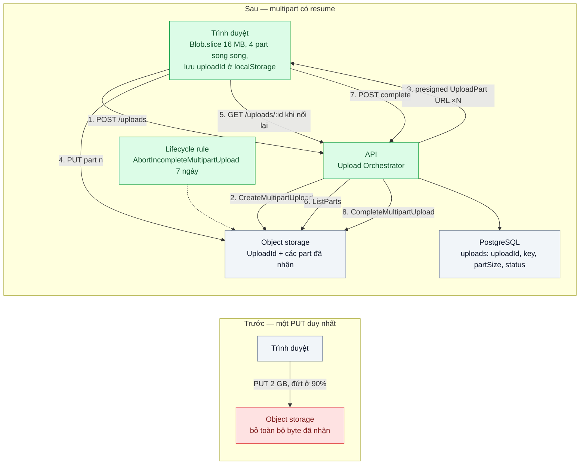
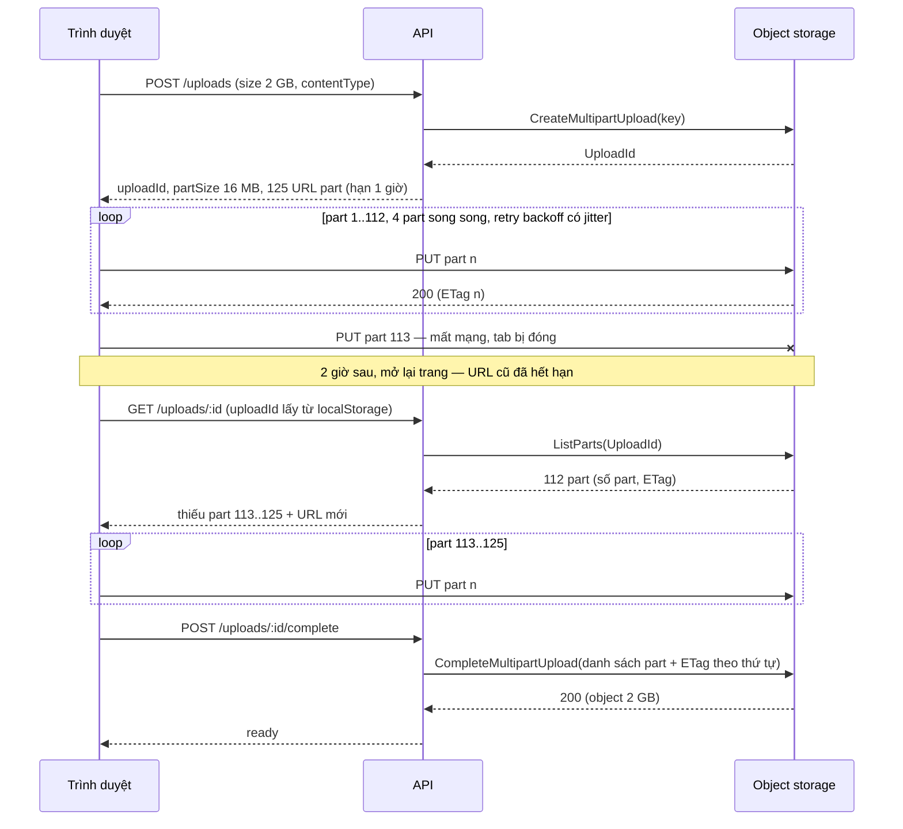

# Multipart & Resumable Upload — Upload video 2 GB đứt mạng ở 90% phải làm lại từ đầu

| Scope | Mức độ | Trạng thái | Pattern gốc | Cập nhật |
|---|---|---|---|---|
| 15 · backend / storage | 🟡 Trung bình | 📋 Kế hoạch | Multipart Upload — AWS S3 docs; Resumable upload — tus protocol (tus.io) | 2026-10-06 |

> **Một câu tóm tắt:** Chia file thành các part độc lập, tải song song bằng presigned URL từng part, hỏi storage "đã nhận part nào" (`ListParts`) để tiếp tục đúng chỗ đứt — mất mạng chỉ tốn lại một part, không tốn lại cả file.

## 1. Bài toán thực tế (What)

**Bối cảnh** *(doanh nghiệp giả định, số liệu minh họa)*
SaaS B2B đào tạo nội bộ (LMS) cho 400 doanh nghiệp. Giảng viên tải video bài giảng 1–3 GB từ laptop qua wifi văn phòng hoặc 4G. Upload hiện là một `PUT` duy nhất bằng presigned URL (bài 02) với thanh tiến độ; không có cơ chế tiếp tục.

**Triệu chứng người kinh doanh nhìn thấy**
- Khoảng 35% upload trên 1 GB thất bại ít nhất một lần; mỗi lần làm lại tốn giảng viên 20–40 phút. Bộ phận hỗ trợ nhận ~60 ticket/tháng chỉ về "tải video bị đứt".
- Giảng viên tải vào ban đêm "cho yên", khóa học mở muộn một ngày so với kế hoạch bán hàng.
- Băng thông trả tiền cho những GB tải lên rồi vứt đi.

**Nguyên nhân kỹ thuật**
Một request `PUT` là đơn vị "được ăn cả ngã về không": TCP đứt, laptop ngủ, đổi mạng wifi → 4G, proxy công ty cắt kết nối dài, hay presigned URL hết hạn giữa chừng — bất kỳ lý do nào cũng làm storage bỏ toàn bộ byte đã nhận, vì nó không có khái niệm "đã nhận tới đâu" cho một object chưa hoàn tất.

**Ràng buộc**
- Tiếp tục được sau khi đóng tab, đổi mạng, hoặc quay lại sau vài ngày (tối đa 7 ngày).
- Byte vẫn không đi qua API server (giữ thành quả của bài 02); file tới 5 GB.
- Không để lại "rác" tính tiền trong bucket khi người dùng bỏ dở.

## 2. Vì sao dùng pattern này (Why)

**Nguyên nhân gốc mà pattern nhắm vào:** thiếu một đơn vị nhỏ hơn file để ghi nhận tiến độ, nên mọi lỗi đều quay về số 0.

**Pattern giải quyết thế nào:** S3 Multipart Upload mở một `UploadId`, nhận từng part (5 MB–5 GB, tối đa 10.000 part) qua các request độc lập — mỗi part có ETag riêng, tải song song được, lỗi part nào tải lại part đó. `ListParts` cho biết part nào đã nằm trên storage, nên client quay lại sau nhiều giờ vẫn tiếp tục đúng chỗ; `CompleteMultipartUpload` ghép thành object cuối. Giao thức tus chuẩn hóa cùng ý tưởng ở mức HTTP (`HEAD` lấy `Upload-Offset`, `PATCH` nối tiếp từ offset) và cho thấy phía client cần gì: lưu định danh upload, hỏi offset trước khi gửi, retry với backoff. Bài này dùng S3 multipart với presigned URL cho từng part (byte vẫn không qua API) và vay tư duy "hỏi trước, gửi sau" của tus.

**Lựa chọn khác đã cân nhắc**

| Lựa chọn | Giải quyết được gì | Vì sao không chọn (ở bài này) |
|---|---|---|
| Giữ nguyên + tối ưu nhỏ (tăng timeout, retry cả file với backoff) | Tự phục hồi khi lỗi thoáng qua | Vẫn tải lại từ byte 0; càng lớn càng dễ đứt lần nữa |
| Chunked upload tự chế qua API (POST từng chunk, server ghép file) | Resume được, kiểm soát toàn bộ | Byte quay lại đi qua API (mất thành quả bài 02); server phải giữ state và ghép file |
| tus server (`@tus/server` + `@tus/s3-store`) với client Uppy/tus-js-client | Giao thức chuẩn, client sẵn, resume tốt | Byte đi qua pod tus; nhiều instance cần locker phân tán; thêm một dịch vụ để vận hành. Là phương án tốt khi muốn ecosystem client sẵn có |
| S3 multipart + presigned URL từng part, resume bằng `ListParts` — **chọn** | Byte thẳng lên storage, song song, resume chính xác tới part | Client phức tạp hơn; phải dọn part mồ côi bằng lifecycle |

## 3. Thiết kế hệ thống (How)

### 3.1 Kiến trúc trước và sau



### 3.2 Luồng chính

Luồng lỗi mà pattern xử lý: mất mạng ở part 113/125, đóng tab, hai giờ sau quay lại.



### 3.3 Thành phần và trách nhiệm

| Thành phần | Trách nhiệm | Quyết định thiết kế đáng chú ý |
|---|---|---|
| `UploadOrchestrator` (API) | `create`, `presignParts`, `status` (gọi `ListParts`), `complete`, `abort` | Nguồn sự thật về tiến độ là `ListParts` của storage, không phải localStorage của client |
| Client uploader (TS thuần trong trình duyệt) | `Blob.slice` theo `partSize`, 4 part song song, retry từng part với backoff + jitter, lưu `uploadId` | Không bao giờ đọc cả file vào RAM; xin URL mới mỗi lần resume |
| Bảng `uploads` | `uploadId`, `key`, `size`, `partSize`, `status` (`uploading`, `completed`, `aborted`), `expires_at` | `partSize` tính từ `size` để không vượt 10.000 part |
| Bucket + lifecycle rule | Lưu part, ghép object; `AbortIncompleteMultipartUpload` sau 7 ngày | Part mồ côi không hiện trong `ListObjects` nhưng vẫn tính tiền |
| Toxiproxy (local) | Cắt mạng giữa client và MinIO theo kịch bản | Tái hiện "đứt ở 90%" lặp lại được trong test |

### 3.4 Điểm dễ sai khi triển khai
- Part nhỏ hơn 5 MB (trừ part cuối) → `EntityTooSmall` khi complete. Tính `partSize = max(16 MB, ceil(size / 10.000))`.
- `CompleteMultipartUpload` cần đúng cặp (số part, ETag) theo thứ tự tăng; thiếu dấu ngoặc kép trong ETag cũng lỗi — lấy ETag từ response header của từng PUT và từ `ListParts`, đừng tự tính.
- Resume chỉ dựa vào localStorage → client tưởng đã gửi part mà storage không có (PUT trả lỗi sau khi tab đóng). Luôn đối chiếu `ListParts`.
- Quá nhiều part song song trên mạng 4G làm tất cả cùng chậm và timeout; 3–6 là vùng hợp lý, cho cấu hình được.
- Retry không có jitter → các part lỗi cùng lúc retry cùng lúc (xem Amazon Builders' Library về backoff + jitter).
- Không đặt lifecycle rule abort → trả tiền cho part của những upload bị bỏ dở vô hình; kiểm tra bằng `mc ls --incomplete`.
- Presigned URL part có hạn ngắn hơn thời gian upload thực tế trên mạng chậm; cho hạn 1 giờ và cấp lại theo lô khi resume.

## 4. Tech stack và tác động (Impact techstack)

| Lớp | Công nghệ chọn | Vì sao chọn | Thay thế tương đương |
|---|---|---|---|
| Ngôn ngữ / runtime | TypeScript strict, Node 20+ (API) và TS trình duyệt (client) | Chia sẻ kiểu dữ liệu giữa API và client | — |
| HTTP app | NestJS | Module `uploads` nối tiếp bài 02 | Fastify thuần |
| Multipart API | `@aws-sdk/client-s3` (`CreateMultipartUpload`, `UploadPart` ký bằng `@aws-sdk/s3-request-presigner`, `ListParts`, `CompleteMultipartUpload`, `AbortMultipartUpload`) | SDK chính thức, MinIO tương thích đầy đủ | tus (`@tus/server` + `@tus/s3-store`) khi cần client Uppy |
| Object storage | MinIO (local) → S3 / R2 (production) | Multipart và lifecycle abort có trên cả ba | — |
| Mô phỏng mạng | Toxiproxy (Shopify) trong Docker Compose | Cắt kết nối, giới hạn băng thông theo kịch bản, điều khiển bằng API | `tc netem` |
| Đo | Script Node (`performance.now()`), `mc ls --incomplete`, Vitest | Đo byte tải lại và part mồ côi | k6 (cho phần API) |

**Thay đổi so với hệ thống hiện tại:** API bài 02 thêm `create/status/complete/abort`; client thay `PUT` đơn bằng uploader multipart; bucket thêm lifecycle rule. Đội vận hành học thêm: theo dõi upload chưa hoàn tất và chi phí của chúng.

## 5. Kết quả đầu ra và cách đo (Output impact)

| Chỉ số | Trước (minh họa) | Mục tiêu khi thực hành | Cách đo |
|---|---|---|---|
| Tỷ lệ upload 2 GB thành công khi mạng bị cắt 3 lần giữa chừng | ~0% (mỗi lần cắt là làm lại) | 100% | Script `bench/upload-resume.ts` chạy 10 lần qua Toxiproxy với toxic `timeout` kích hoạt ở 30%, 60%, 90% |
| Byte phải tải lại sau một lần đứt | Toàn bộ byte đã gửi (tới 1,8 GB) | ≤ 1 part đang dở (16 MB) × số part song song | Đếm byte PUT trong script trước/sau khi cắt |
| Thời gian từ khi nối lại tới khi tiếp tục gửi | Bằng thời gian tải lại từ đầu | < 2 giây (một `ListParts`) | Log mốc thời gian trong client |
| Part mồ côi còn trong bucket sau 7 ngày (local rút xuống 1 ngày) | Không ai biết | 0 | `mc ls --incomplete --recursive local/lms-videos` |
| Tổng thời gian tải 2 GB trên mạng giới hạn 50 Mbps không lỗi | Một luồng | Không chậm hơn một luồng; ghi số thật | Script đo, Toxiproxy toxic `bandwidth` |

> Số "trước" là minh họa để hình dung bài toán. Số "mục tiêu" chỉ được coi là đạt khi có số đo thật
> ở mục 8 kèm môi trường đo.

**Tác động nghiệp vụ mong đợi:** giảng viên không phải canh mạng để tải video; ticket "tải bị đứt" giảm; khóa học mở đúng lịch; băng thông không trả cho byte bị vứt.

## 6. Đánh đổi và khi KHÔNG nên dùng

**Đánh đổi**
- Client phức tạp hơn đáng kể: cắt file, song song, retry, lưu state, xin URL mới.
- Nhiều request hơn (mỗi part một PUT) — nhà cung cấp tính phí theo request; part quá nhỏ làm chi phí request tăng.
- Trạng thái "đang upload" sống nhiều ngày, cần job/lifecycle dọn và UI hiển thị upload dở.
- `ListParts` thêm một vòng gọi tới storage mỗi lần resume.

**Không nên dùng khi**
- File dưới ~100 MB trên mạng ổn định: một `PUT` presigned (bài 02) đơn giản hơn; AWS cũng chỉ khuyến nghị multipart khi object từ khoảng 100 MB trở lên.
- Upload server-to-server trong cùng mạng nội bộ, lỗi hiếm — retry cả file là đủ.
- Cần xử lý đồng bộ ngay khi nhận byte đầu (stream transcode) — multipart ghép ở cuối không hợp.

**Liên quan**
- `../02-presigned-url-valet-key-upload-500mb-qua-api-lam-nghen/` — nền: presigned URL và bước hoàn tất.
- `../04-image-pipeline-mot-anh-can-6-kich-co/` — xử lý sau khi object hoàn tất.
- `../06-lifecycle-tiering-chi-phi-luu-tru-tang-gap-3/` — lifecycle rule, trong đó có abort multipart.
- `../../14-backend-queueing/08-claim-check-message-50mb-lam-nghen-broker/` — cùng ý "chuyển byte lớn ra khỏi đường chính".

## 7. Cơ sở tham khảo

- AWS S3 docs, "Uploading and copying objects using multipart upload" — https://docs.aws.amazon.com/AmazonS3/latest/userguide/mpuoverview.html — ba bước Create/UploadPart/Complete, giới hạn part, `ListParts`, abort và lifecycle cho upload chưa hoàn tất.
- tus, *Resumable upload protocol* — https://tus.io/protocols/resumable-upload — ngữ nghĩa resume theo offset (`HEAD` → `Upload-Offset`, `PATCH`) mà client ở bài vay mượn; phương án thay thế ở mục 2.
- Marc Brooker, "Exponential Backoff And Jitter", AWS Architecture Blog, 2015 — https://aws.amazon.com/blogs/architecture/exponential-backoff-and-jitter/ — cách retry từng part không gây đồng loạt.
- MinIO docs — https://min.io/docs/ — multipart tương thích S3, `mc ls --incomplete`, `mc ilm` cho rule abort.
- Shopify Toxiproxy — https://github.com/Shopify/toxiproxy — công cụ mô phỏng đứt mạng dùng ở mục 4.

## 8. Kế hoạch thực hành

- [ ] Bước 1: Docker Compose gồm API, PostgreSQL, MinIO, Toxiproxy đứng giữa client và MinIO; client "trước" `PUT` một lần file 2 GB sinh ngẫu nhiên.
- [ ] Bước 2: Đo "trước": script cắt mạng ở 90%, ghi tỷ lệ thành công và byte tải lại.
- [ ] Bước 3: Áp dụng pattern: `UploadOrchestrator` (create/status/complete/abort), client multipart 4 luồng có retry + jitter, lưu `uploadId`; lifecycle rule abort 1 ngày trên MinIO (`mc ilm rule add --expire-delete-marker`... dùng tùy chọn abort incomplete của `mc ilm`).
- [ ] Bước 4: Đo "sau" với cùng kịch bản cắt mạng 3 lần; ghi số vào mục 5 kèm môi trường.
- [ ] Bước 5: Test: resume sau khi cắt chỉ gửi lại part thiếu; complete với ETag sai bị từ chối; abort xóa hết part (`ListParts` rỗng); `partSize` tự tính không vượt 10.000 part với file 5 GB.

**Cấu trúc code dự kiến**
```text
src/
  truoc/
    single-put-client.ts
  sau/
    uploads/
      upload-orchestrator.ts     # create / status / complete / abort
      uploads.controller.ts
      uploads.repository.ts
    client/
      multipart-uploader.ts      # slice, song song, retry, resume
  shared/
public/
  upload.html
test/
  upload-orchestrator.test.ts
  multipart-uploader.test.ts     # dùng Toxiproxy API để cắt mạng
bench/
  upload-resume.ts
docker-compose.yml               # api, postgres, minio, toxiproxy
.env.example
```

**Cách chạy** *(điền khi bắt đầu code)*
```bash
docker compose up -d
pnpm install && pnpm test
pnpm bench   # chạy bench/upload-resume.ts
```
