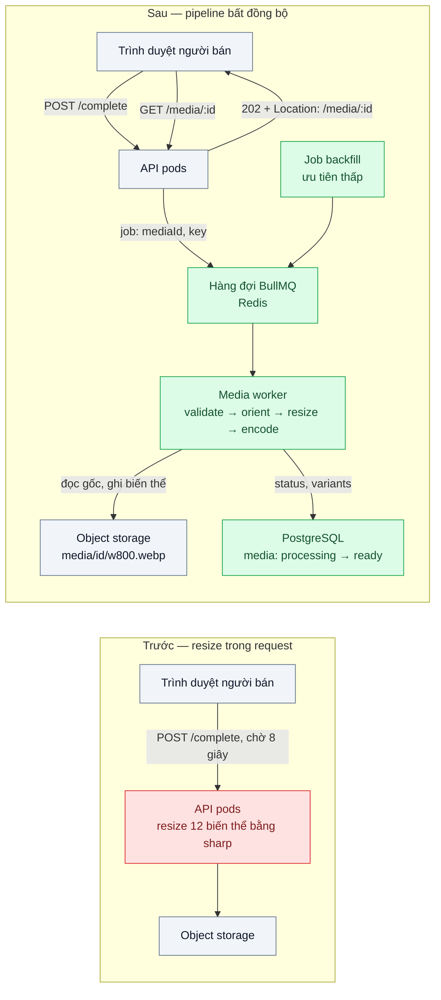
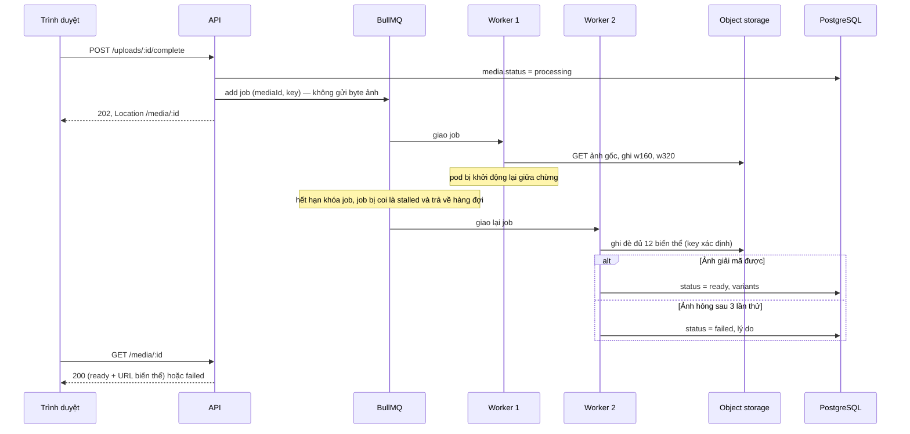

# Async Media Processing Pipeline — Mỗi ảnh sản phẩm cần 6 kích cỡ và WebP, xử lý đồng bộ làm upload chậm 8 giây

| Scope | Mức độ | Trạng thái | Pattern gốc | Cập nhật |
|---|---|---|---|---|
| 15 · backend / storage | 🟡 Trung bình | 📋 Kế hoạch | Pipes and Filters, Asynchronous Request-Reply — Microsoft Azure Architecture Center; Serverless Image Handler — AWS Solutions; sharp docs | 2026-10-06 |

> **Một câu tóm tắt:** Tách việc "nhận ảnh" khỏi việc "biến đổi ảnh": API ghi nhận upload rồi trả `202` ngay, một chuỗi bước xử lý độc lập (kiểm tra → xoay/xóa metadata → resize → mã hóa WebP → ghi biến thể) chạy trong worker qua hàng đợi, client hỏi trạng thái cho tới khi đủ biến thể.

## 1. Bài toán thực tế (What)

**Bối cảnh** *(doanh nghiệp giả định, số liệu minh họa)*
Sàn TMĐT có 20.000 người bán, mỗi ngày nhận khoảng 150.000 ảnh sản phẩm mới. Mỗi ảnh cần 6 kích cỡ (160, 320, 480, 800, 1200, 2000 px chiều ngang) ở hai định dạng JPEG và WebP để trang danh sách, trang chi tiết và app mobile dùng đúng cỡ. Hiện tại sau khi upload xong (presigned URL — bài 02), endpoint "hoàn tất" gọi `sharp` tạo đủ 12 biến thể ngay trong request rồi mới trả lời.

**Triệu chứng người kinh doanh nhìn thấy**
- Người bán đăng một sản phẩm 20 ảnh phải chờ gần 3 phút, nhiều người bỏ dở giữa chừng; bộ phận hỗ trợ nhận phàn nàn "đăng hàng chậm".
- Giờ cao điểm đăng hàng (9h–11h), CPU của pod API lên 100%, trang thanh toán chậm theo.
- Đội marketing muốn thêm cỡ banner 1600 px cho chiến dịch Tết: không có cách tạo lại cho 5 triệu ảnh cũ mà không làm chậm hệ thống.

**Nguyên nhân kỹ thuật**
Giải mã một ảnh 12 MP, resize ra 6 cỡ và mã hóa hai định dạng là việc thuần CPU, mất vài giây mỗi ảnh. Việc đó nằm trên đường đi của request HTTP: pod API vừa phục vụ nghiệp vụ nhẹ vừa làm việc nặng, request "hoàn tất" giữ kết nối tới khi xong, lỗi giữa chừng (pod bị khởi động lại) làm mất toàn bộ công việc và không có cơ chế thử lại.

**Ràng buộc**
- Sản phẩm chỉ hiển thị công khai khi đủ biến thể bắt buộc (320 và 800 px).
- Ảnh phải qua bước quét an toàn (bài 08) trước khi biến đổi.
- Thêm kích cỡ mới phải chạy lại được cho ảnh cũ mà không làm chậm ảnh mới.

## 2. Vì sao dùng pattern này (Why)

**Nguyên nhân gốc mà pattern nhắm vào:** việc nặng và có thể thất bại nằm trong luồng đồng bộ của request, gắn chặt "đã nhận" với "đã xử lý xong".

**Pattern giải quyết thế nào:** Pipes and Filters (Azure) chia một xử lý lớn thành các bước (filter) độc lập nối bằng kênh (pipe) — ở đây là hàng đợi — nên từng bước scale, thử lại và thay thế riêng. Asynchronous Request-Reply (Azure) cho API trả `202 Accepted` kèm địa chỉ hỏi trạng thái thay vì giữ kết nối; client hỏi lại tới khi trạng thái là `ready`. Mỗi bước ghi kết quả ra key xác định (`media/<id>/w800.webp`) nên chạy lại bao nhiêu lần cũng cho cùng kết quả — điều kiện để retry an toàn.

**Lựa chọn khác đã cân nhắc**

| Lựa chọn | Giải quyết được gì | Vì sao không chọn (ở bài này) |
|---|---|---|
| Giữ nguyên + tối ưu nhỏ (giảm số cỡ, tăng CPU pod, chỉnh tham số `sharp`) | Giảm thời gian mỗi ảnh | Việc nặng vẫn trong request; vẫn chung CPU với thanh toán; vẫn không retry |
| Resize theo yêu cầu khi đọc (on-the-fly, kiểu AWS Serverless Image Handler sau CDN) | Không tiền xử lý; thêm cỡ mới không cần backfill | Request đầu chậm; cần CDN và allowlist kích cỡ chống lạm dụng; không kiểm duyệt được trước khi công khai. Đáng cân nhắc kết hợp sau khi đo |
| Resize ở client trước khi upload | Giảm byte upload | Không tin được client; không thay được bước xóa metadata và kiểm tra |
| Pipeline bất đồng bộ qua hàng đợi + worker — **chọn** | Upload trả lời nhanh; retry, ưu tiên, scale worker độc lập | Thêm hàng đợi, worker, trạng thái trung gian; client phải xử lý "đang xử lý" |

## 3. Thiết kế hệ thống (How)

### 3.1 Kiến trúc trước và sau



### 3.2 Luồng chính — worker chết giữa chừng và ảnh hỏng



### 3.3 Thành phần và trách nhiệm

| Thành phần | Trách nhiệm | Quyết định thiết kế đáng chú ý |
|---|---|---|
| `UploadsController.complete` | Kiểm tra object (bài 02), đổi trạng thái, đưa job vào hàng đợi, trả `202` | Job chỉ chứa `mediaId` và key (Claim Check, scope 14 bài 08) — byte ảnh trong payload làm Redis phình |
| Bảng `media` + `GET /media/:id` | Trạng thái `uploaded → processing → ready / failed`, danh sách biến thể; endpoint trả trạng thái kèm `Retry-After` | Sản phẩm chỉ công khai khi biến thể bắt buộc đã có; có thể thay hỏi trạng thái bằng SSE (scope 06) |
| Hàng đợi `media-process` (BullMQ) | Retry có backoff, ưu tiên, phát hiện job stalled | Hai mức ưu tiên: ảnh mới cao, backfill thấp |
| `MediaWorker` | Chuỗi filter: kiểm tra kích thước điểm ảnh → `rotate()` theo EXIF, xóa metadata → `resize` 6 cỡ → mã hóa JPEG và WebP → ghi | Key đầu ra xác định theo `mediaId` và cỡ nên retry ghi đè, không sinh file mồ côi |
| Job `backfill-variant` | Thêm một cỡ mới cho ảnh cũ theo lô | Giới hạn tốc độ để không giành CPU của ảnh mới |

### 3.4 Điểm dễ sai khi triển khai
- Đặt tên biến thể bằng UUID mới mỗi lần chạy → retry sinh file mồ côi và DB trỏ lung tung. Key phải suy ra được từ `mediaId` + cỡ + định dạng.
- Không giới hạn số điểm ảnh đầu vào → ảnh "bom giải nén" vài KB nở ra hàng GB RAM. Dùng tùy chọn `limitInputPixels` của `sharp` và từ chối sớm.
- Quên `rotate()` theo EXIF → ảnh chụp dọc từ điện thoại hiển thị nằm ngang; và quên xóa metadata → lộ tọa độ GPS của người bán.
- Đặt `concurrency` của worker bằng số CPU trong khi `sharp` (libvips) cũng tự dùng nhiều luồng → tranh CPU. Đo rồi chỉnh `sharp.concurrency()` hoặc concurrency của worker, không chỉnh cả hai theo cảm tính.
- Biến đổi ảnh trước khi quét an toàn → xử lý cả file độc hại. Bước quét (bài 08) đứng trước trong pipeline.

## 4. Tech stack và tác động (Impact techstack)

| Lớp | Công nghệ chọn | Vì sao chọn | Thay thế tương đương |
|---|---|---|---|
| Runtime / HTTP app | TypeScript strict, Node 20+, NestJS | Stack mặc định; dùng lại module `uploads` của bài 02 | Fastify thuần |
| Hàng đợi | BullMQ trên Redis 7 | Có sẵn retry/backoff, priority, concurrency, phát hiện job stalled | PGMQ (Postgres); SQS + Lambda trên AWS |
| Xử lý ảnh | `sharp` (libvips) | Nhanh, ít RAM so với thư viện thuần JS; hỗ trợ resize, WebP, AVIF, xoay theo EXIF | ImageMagick qua CLI; dịch vụ ảnh của CDN |
| Object storage | MinIO (local) → S3 / R2 (production) | Cùng S3 API với bài 01–03 | GCS chế độ tương thích S3 |
| Metadata | PostgreSQL 16 | Trạng thái và danh sách biến thể cần giao dịch | — |
| Đo | k6, BullMQ `getJobCounts`, `docker stats` | Đo p95 bước hoàn tất, độ dài hàng đợi, CPU worker | Prometheus + exporter cho BullMQ (cần xác minh) |

**Thay đổi so với hệ thống hiện tại:** thêm Redis (nếu chưa có), một deployment worker riêng, bảng `media` có trạng thái; frontend hiển thị "đang xử lý ảnh" và hỏi trạng thái. Đội vận hành học theo dõi độ dài hàng đợi và job thất bại thay vì chỉ nhìn CPU API.

## 5. Kết quả đầu ra và cách đo (Output impact)

| Chỉ số | Trước (minh họa) | Mục tiêu khi thực hành | Cách đo |
|---|---|---|---|
| p95 thời gian `POST /uploads/:id/complete` | 8 giây | < 300 ms | k6, `http_req_duration` của bước hoàn tất |
| p95 thời gian từ hoàn tất tới `ready` khi tải 10 ảnh/giây | — | < 30 giây | Cột `ready_at - completed_at` trong bảng `media`, truy vấn `percentile_cont(0.95)` |
| p95 `POST /checkout` trong lúc đăng ảnh dồn dập | 2 giây | Chênh < 10% so với lúc không có upload | k6 hai scenario song song |
| Tổng byte ảnh của trang danh sách 40 sản phẩm | 1,8 MB (JPEG gốc thu nhỏ) | Giảm rõ khi dùng `w320.webp` | Script cộng kích thước object qua `mc stat` cho hai bộ biến thể |
| Tỷ lệ ảnh hợp lệ rơi vào `failed` | — | < 0,1% | BullMQ `getJobCounts('failed')` so với số job đã chạy |
| p95 job ảnh mới trong lúc backfill 100.000 ảnh | — | Không tăng quá 20% | So p95 `ready_at - completed_at` khi có và không có backfill |

> Số "trước" là minh họa để hình dung bài toán. Số "mục tiêu" chỉ được coi là đạt khi có số đo thật
> ở mục 8 kèm môi trường đo.

**Tác động nghiệp vụ mong đợi:** người bán đăng hàng không phải chờ, thanh toán không chậm theo giờ đăng hàng, marketing thêm cỡ ảnh mới mà không cần "đóng băng" hệ thống.

## 6. Đánh đổi và khi KHÔNG nên dùng

**Đánh đổi**
- Thêm thành phần vận hành: Redis, worker, hàng đợi lỗi; cần giám sát độ dài hàng đợi.
- Tính nhất quán cuối cùng: sau khi upload, ảnh chưa xem được ngay; UI phải có trạng thái "đang xử lý".
- Lưu nhiều biến thể làm tăng dung lượng lưu trữ — chi phí xử lý ở `../06-lifecycle-tiering-chi-phi-luu-tru-tang-gap-3/`.

**Không nên dùng khi**
- Lượng ảnh thấp (vài trăm ảnh/ngày) và xử lý dưới 1 giây: làm đồng bộ đơn giản hơn nhiều.
- Kích cỡ hiển thị thay đổi liên tục, không biết trước: resize theo yêu cầu sau CDN phù hợp hơn tiền xử lý.

**Liên quan**
- `../02-presigned-url-valet-key-upload-500mb-qua-api-lam-nghen/` — nguồn của sự kiện "upload hoàn tất".
- `../08-upload-security-virus-scan-content-type-sniffing/` — bước quét đứng trước pipeline.
- `../../14-backend-queueing/01-work-queue-gui-100k-email-lam-treo-api/` — nền tảng work queue và competing consumers.
- `../../14-backend-queueing/08-claim-check-message-50mb-lam-nghen-broker/` — chỉ gửi key trong message.
- `../../13-backend-transporter/05-async-request-reply-xu-ly-30-giay-http-timeout/` — chi tiết pattern 202 + hỏi trạng thái.

## 7. Cơ sở tham khảo

- Microsoft Azure Architecture Center, "Pipes and Filters pattern" — https://learn.microsoft.com/azure/architecture/patterns/pipes-and-filters — chia xử lý thành filter độc lập nối bằng pipe, scale và retry từng bước.
- Microsoft Azure Architecture Center, "Asynchronous Request-Reply pattern" — https://learn.microsoft.com/azure/architecture/patterns/async-request-reply — `202 Accepted`, endpoint trạng thái, `Retry-After`.
- AWS Solutions, "Serverless Image Handler" (implementation guide) — https://aws.amazon.com/solutions/implementations/serverless-image-handler/ (cần xác minh URL) — kiến trúc resize theo yêu cầu sau CloudFront, dùng làm phương án so sánh.
- sharp docs — https://sharp.pixelplumbing.com/ — API `resize`, `rotate`, `webp`, `limitInputPixels`, `concurrency`.
- BullMQ docs — https://docs.bullmq.io/ — retry/backoff, priority, concurrency, stalled jobs.

## 8. Kế hoạch thực hành

- [ ] Bước 1: Docker Compose gồm API (NestJS), PostgreSQL, Redis, MinIO; phiên bản "trước" resize 12 biến thể ngay trong `complete`; bộ 50 ảnh mẫu 12 MP (có ảnh chụp dọc với EXIF, một ảnh hỏng, một ảnh kích thước điểm ảnh cực lớn).
- [ ] Bước 2: Đo "trước": k6 gửi 10 lượt hoàn tất/giây song song scenario `checkout`; ghi p95 hai bên và CPU.
- [ ] Bước 3: Áp dụng pattern: `complete` trả `202`, hàng đợi `media-process`, worker riêng với chuỗi filter, endpoint `GET /media/:id`, job backfill ưu tiên thấp.
- [ ] Bước 4: Đo "sau" cùng kịch bản, thêm kịch bản backfill 100.000 bản ghi giả; ghi vào mục 5 kèm môi trường.
- [ ] Bước 5: Test: chạy job hai lần cho cùng kết quả và cùng tập key; kill worker giữa chừng thì job hoàn tất ở worker khác; ảnh hỏng vào `failed` sau 3 lần; ảnh vượt giới hạn điểm ảnh bị từ chối không làm worker hết RAM; metadata GPS bị xóa ở biến thể.

**Cấu trúc code dự kiến**
```text
src/
  before/sync-resize.controller.ts   # resize trong request (tái hiện triệu chứng)
  after/
    complete.controller.ts           # trả 202, đưa job vào hàng đợi
    media.controller.ts              # GET /media/:id
    media-worker.ts                  # worker BullMQ + chuỗi filter
    variant-keys.ts                  # quy tắc key xác định
    backfill-variant.ts              # thêm cỡ mới cho ảnh cũ, ưu tiên thấp
test/media-pipeline.test.ts
bench/complete-vs-checkout.k6.js
docker-compose.yml
```

**Cách chạy** *(điền khi bắt đầu code)*
```bash
docker compose up -d
pnpm install && pnpm test
k6 run bench/complete-vs-checkout.k6.js
```
