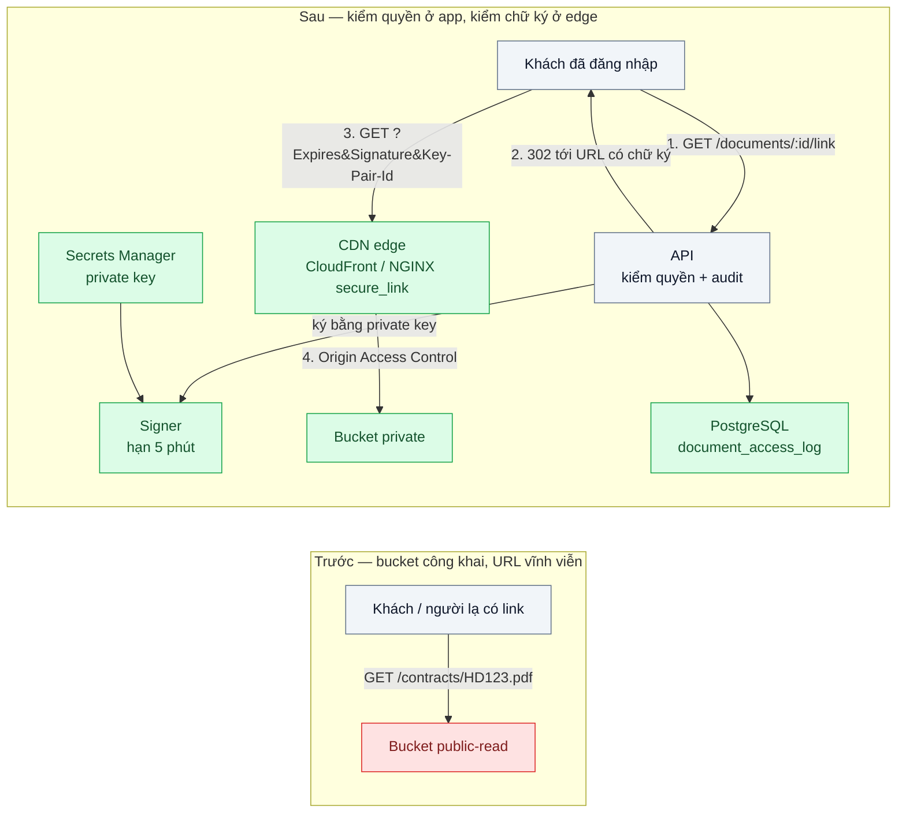
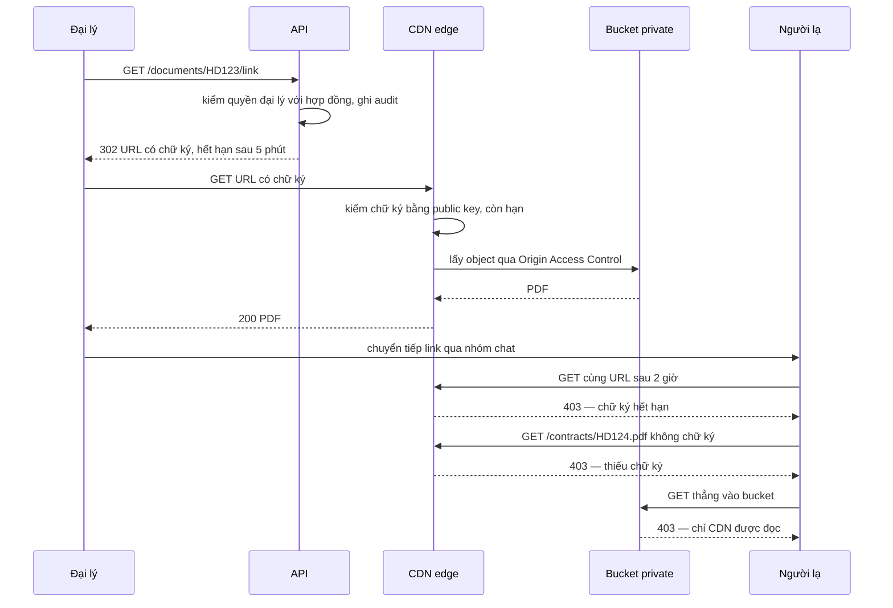

# Private Content via Signed CDN URLs — Link hợp đồng riêng tư bị share ra ngoài vẫn mở được

| Scope | Mức độ | Trạng thái | Pattern gốc | Cập nhật |
|---|---|---|---|---|
| 15 · backend / storage | 🟡 Trung bình | 📋 Kế hoạch | Signed URLs / Signed Cookies — AWS CloudFront docs "Serving private content"; Valet Key — Microsoft Azure Architecture Center | 2026-10-06 |

> **Một câu tóm tắt:** Bucket chuyển sang private, chỉ CDN được đọc; mỗi lần người dùng bấm xem, app kiểm tra quyền rồi phát một URL có chữ ký sống vài phút — CDN tự kiểm chữ ký ở edge, link bị chuyển tiếp sau khi hết hạn chỉ còn trả 403.

## 1. Bài toán thực tế (What)

**Bối cảnh** *(doanh nghiệp giả định, số liệu minh họa)*
Một công ty bảo hiểm phát hành khoảng 400.000 hợp đồng và giấy chứng nhận dạng PDF mỗi năm, kèm ảnh hồ sơ bồi thường. File nằm trong bucket bật đọc công khai, URL có dạng `files.<domain>/contracts/<số-hợp-đồng>.pdf` và được gửi kèm email, tin nhắn cho khách và đại lý.

**Triệu chứng người kinh doanh nhìn thấy**
- Khách phát hiện hợp đồng của mình bị đăng trong một nhóm chat; đại lý đã chuyển tiếp link từ nhiều tháng trước, link vẫn mở được.
- Một người đổi số hợp đồng trên URL và xem được hợp đồng của người khác.
- Pháp chế yêu cầu "thu hồi link đã lộ"; cách duy nhất là xóa hoặc đổi tên file, làm hỏng mọi link hợp lệ khác.

**Nguyên nhân kỹ thuật**
Phân quyền chỉ nằm ở trang web, còn file thì công khai: ai có URL là có file, URL đoán được theo số hợp đồng và không có hạn. Không có lớp nào giữa "người cầm link" và "object" để hỏi "người này có quyền không, link này còn hạn không".

**Ràng buộc**
- Khách và đại lý vẫn mở được tài liệu bằng một cú bấm, kể cả trên điện thoại đổi mạng liên tục.
- Giữ được CDN cho tài liệu xem nhiều (biểu phí, quy tắc sản phẩm) để không tăng chi phí băng thông.
- Biết ai đã xin link xem tài liệu nào, lúc nào (yêu cầu kiểm toán).

## 2. Vì sao dùng pattern này (Why)

**Nguyên nhân gốc mà pattern nhắm vào:** quyền truy cập file là vĩnh viễn và gắn với URL, không gắn với người và thời điểm.

**Pattern giải quyết thế nào:** Đây là Valet Key theo chiều tải xuống. Bucket private; CDN đọc bucket qua Origin Access Control nên URL trực tiếp vào bucket trả 403. Khi người dùng bấm "Xem hợp đồng", app kiểm tra quyền, ghi audit, rồi ký một URL bằng private key của một *trusted key group* đã khai báo trên CloudFront. Chữ ký buộc chặt đường dẫn và thời điểm hết hạn (canned policy), hoặc thêm thời điểm bắt đầu và dải IP (custom policy). Edge kiểm chữ ký bằng public key, không cần gọi về app; hết hạn là 403. Khi một trang cần nhiều file (hồ sơ bồi thường 30 ảnh), dùng signed cookies với custom policy cho cả thư mục thay vì ký 30 URL.

**Lựa chọn khác đã cân nhắc**

| Lựa chọn | Giải quyết được gì | Vì sao không chọn (ở bài này) |
|---|---|---|
| Giữ nguyên + tối ưu nhỏ (đổi tên file thành UUID khó đoán) | Hết đoán URL | Link đã lộ vẫn mở được mãi; không thu hồi, không audit |
| Tải qua API (API kiểm quyền rồi stream file) | Thu hồi tức thì, audit đầy đủ | Byte đi qua API (vấn đề của bài 02), mất cache CDN |
| Presigned GET thẳng vào S3/MinIO, không CDN | Đơn giản, cùng cơ chế bài 02 | Không cache edge cho tài liệu xem nhiều; lộ domain bucket. Hợp lý khi lưu lượng thấp |
| Signed URL / signed cookies của CDN + Origin Access Control — **chọn** | Link sống ngắn, kiểm ở edge, giữ cache, bucket không lộ | Thêm quản lý cặp khóa; không thu hồi riêng từng link trước hạn |

## 3. Thiết kế hệ thống (How)

### 3.1 Kiến trúc trước và sau



### 3.2 Luồng chính — link bị chuyển tiếp và URL bị đoán



### 3.3 Thành phần và trách nhiệm

| Thành phần | Trách nhiệm | Quyết định thiết kế đáng chú ý |
|---|---|---|
| `GET /documents/:id/link` | Kiểm quyền (chủ hợp đồng, đại lý phụ trách), ghi audit, trả `302` tới URL đã ký | Email chỉ chứa link tới trang app cần đăng nhập, không chứa URL đã ký |
| `Signer` | Ký canned policy cho một file; custom policy + signed cookies cho cả thư mục hồ sơ | Hạn mặc định 5 phút; không ràng IP cho khách vì điện thoại đổi mạng |
| Cặp khóa + trusted key group | Private key ở secret store, public key khai báo trên CDN | Giữ hai public key trong group để xoay khóa không gián đoạn |
| Origin Access Control | Chỉ CDN đọc được bucket | Bucket policy từ chối mọi principal khác |
| `document_access_log` | Ai xin link, tài liệu nào, lúc nào, IP | Đối chiếu với log của CDN khi điều tra |
| Local: NGINX `secure_link` trước MinIO | Mô phỏng "edge kiểm chữ ký" trong Docker Compose | Chỉ để học cơ chế; `secure_link` dùng MD5, không thay được CDN thật |

### 3.4 Điểm dễ sai khi triển khai
- Chỉ ký URL mà quên chặn đường vào bucket → người ta bỏ CDN, đọc thẳng bucket. Kiểm tra bằng curl tới URL bucket phải ra 403.
- Gửi URL đã ký trong email hoặc lưu vào DB để dùng lại → link lại thành "vĩnh viễn" trong phạm vi hạn dài. Ký tại thời điểm bấm, hạn ngắn.
- Tưởng thu hồi được một link cụ thể: không thể trước khi hết hạn; chỉ gỡ public key khỏi key group (vô hiệu mọi link ký bằng khóa đó). Hạn ngắn chính là cơ chế thu hồi.
- Cache policy đưa cả tham số chữ ký vào cache key → mỗi link là một bản cache, mất lợi ích CDN. Kiểm tra cấu hình cache key (cần xác minh hành vi mặc định trong CloudFront docs).
- Ràng IP bằng custom policy cho người dùng di động → mở link khi vừa đổi từ Wi-Fi sang 4G bị 403. Chỉ ràng IP cho cổng nội bộ.
- Lệch giờ máy ký → link hết hạn ngay khi phát. Đồng bộ NTP, không đặt hạn dưới 1 phút.

## 4. Tech stack và tác động (Impact techstack)

| Lớp | Công nghệ chọn | Vì sao chọn | Thay thế tương đương |
|---|---|---|---|
| Runtime / HTTP app | TypeScript strict, Node 20+, NestJS | Stack mặc định; guard phân quyền có sẵn | Fastify thuần |
| CDN (production) | CloudFront + Origin Access Control + trusted key group | Kiểm chữ ký ở edge, canned/custom policy, signed cookies | Google Cloud CDN signed URLs; Cloudflare (token auth, cần xác minh) |
| Edge mô phỏng (local) | NGINX `ngx_http_secure_link_module` + `proxy_cache` trước MinIO | Tái hiện được "edge kiểm chữ ký, có cache" bằng Docker Compose | MinIO presigned GET (không có lớp cache) |
| Ký URL | `@aws-sdk/cloudfront-signer` (cần xác minh tên hàm) | SDK chính thức, ký cục bộ không gọi mạng | Tự ký RSA-SHA1 theo docs |
| Object storage | MinIO (local) → S3 (production) | Cùng S3 API với các bài trước | R2 |
| Audit | PostgreSQL 16 | Truy vấn "ai xem gì" cho kiểm toán | — |
| Đo | k6, script curl, log NGINX `$upstream_cache_status` | Đo tỷ lệ link hết hạn bị chặn và cache hit | Log chuẩn của CloudFront |

**Thay đổi so với hệ thống hiện tại:** tắt đọc công khai của bucket, thêm CDN distribution, cặp khóa và quy trình xoay khóa, endpoint phát link, bảng audit; email đổi sang link tới trang app. Đội vận hành học quản lý key group và đọc log CDN.

## 5. Kết quả đầu ra và cách đo (Output impact)

| Chỉ số | Trước (minh họa) | Mục tiêu khi thực hành | Cách đo |
|---|---|---|---|
| Tỷ lệ link đã quá hạn còn mở được | 100% (link vĩnh viễn) | 0% | Script phát 100 link, chờ quá hạn + 1 phút, curl lại và đếm mã 200 |
| Tỷ lệ URL đoán được (đổi số hợp đồng) mở được | 100% | 0% | Script thử 1.000 số hợp đồng liên tiếp không chữ ký |
| Truy cập thẳng bucket bỏ qua CDN | Mở được | 403 | curl tới endpoint MinIO/S3 với key hợp lệ |
| p95 thời gian `GET /documents/:id/link` | — | < 20 ms | k6, `http_req_duration` của endpoint phát link |
| Cache hit cho tài liệu xem nhiều với link ký khác nhau | — | > 80% sau khi làm nóng | Log NGINX `$upstream_cache_status` khi k6 xin 1.000 link cho 10 file |
| Tỷ lệ lượt xem có bản ghi audit | 0% | 100% | So số dòng `document_access_log` với số lượt 200 ở log edge |

> Số "trước" là minh họa để hình dung bài toán. Số "mục tiêu" chỉ được coi là đạt khi có số đo thật
> ở mục 8 kèm môi trường đo.

**Tác động nghiệp vụ mong đợi:** link bị chuyển tiếp tự mất tác dụng sau vài phút, không ai xem được tài liệu bằng cách đoán URL, và công ty trả lời được câu hỏi kiểm toán "ai đã xem hợp đồng này".

## 6. Đánh đổi và khi KHÔNG nên dùng

**Đánh đổi**
- Thêm quản lý khóa: lưu private key an toàn, xoay khóa định kỳ, đồng bộ key group.
- Link có hạn làm mất tính năng "bookmark file"; người dùng phải đi qua trang app.
- Trong thời hạn, link vẫn là bearer: ai cầm link đều mở được — rủi ro còn lại được giới hạn bằng thời gian, không triệt tiêu.
- Gắn chặt hơn vào một CDN cụ thể (định dạng chữ ký khác nhau giữa các nhà cung cấp).

**Không nên dùng khi**
- Nội dung thật sự công khai (ảnh sản phẩm, tài liệu marketing): ký URL chỉ làm hỏng cache trình duyệt và thêm độ trễ.
- Cần thu hồi tức thì từng lượt truy cập hoặc đóng dấu nội dung theo người xem: tải qua API có kiểm quyền mỗi lần.
- Lưu lượng thấp, không cần cache edge: presigned GET của object storage là đủ, bớt một thành phần.

**Liên quan**
- `../02-presigned-url-valet-key-upload-500mb-qua-api-lam-nghen/` — Valet Key chiều tải lên.
- `../08-upload-security-virus-scan-content-type-sniffing/` — phát nội dung người dùng từ domain riêng.
- `../../04-frontend-cache/01-http-cache-headers-anh-san-pham-tai-lai-moi-lan/` — header cache cho nội dung công khai.
- `../../19-backend-frontend-authenticate/06-rbac-abac-rebac-phan-quyen-theo-chi-nhanh-phong-ban/` — quy tắc ai được xin link.
- `../../02-backend-database/04-audit-log-ai-doi-gia-hop-dong-luc-nao/` — thiết kế bảng audit.
- `../../16-backend-k8s/04-config-secret-external-secrets-password-db-nam-trong-yaml/` — nơi giữ private key ký URL.

## 7. Cơ sở tham khảo

- AWS CloudFront Developer Guide, "Serve private content with signed URLs and signed cookies" — https://docs.aws.amazon.com/AmazonCloudFront/latest/DeveloperGuide/PrivateContent.html — canned vs custom policy, trusted key groups, khi nào dùng cookie thay URL.
- AWS CloudFront Developer Guide, "Restrict access to an Amazon S3 origin" (Origin Access Control) — https://docs.aws.amazon.com/AmazonCloudFront/latest/DeveloperGuide/private-content-restricting-access-to-s3.html (cần xác minh URL) — chặn đường vào bucket ngoài CDN.
- Microsoft Azure Architecture Center, "Valet Key pattern" — https://learn.microsoft.com/azure/architecture/patterns/valet-key — khung lý thuyết: token giới hạn tài nguyên, quyền và thời hạn.
- NGINX docs, `ngx_http_secure_link_module` — https://nginx.org/en/docs/http/ngx_http_secure_link_module.html — kiểm chữ ký và hạn ở proxy, dùng cho môi trường local.
- OWASP API Security Top 10 (2023), "API1 Broken Object Level Authorization" — https://owasp.org/API-Security/ — lỗi đổi id để xem tài nguyên người khác.

## 8. Kế hoạch thực hành

- [ ] Bước 1: Docker Compose gồm API (NestJS), PostgreSQL, MinIO (bucket `contracts` bật đọc công khai để tái hiện "trước"), NGINX trước MinIO; seed 1.000 hợp đồng PDF giả.
- [ ] Bước 2: Đo "trước": chạy script đoán URL, script mở lại link cũ, curl thẳng bucket; ghi tỷ lệ mở được.
- [ ] Bước 3: Áp dụng pattern: bucket private, NGINX `secure_link` + `proxy_cache`, endpoint phát link có audit; nhánh production ghi sẵn cấu hình CloudFront (OAC, key group) và signer bằng `@aws-sdk/cloudfront-signer`.
- [ ] Bước 4: Đo "sau" cùng script, thêm k6 cho endpoint phát link và tỷ lệ cache hit; ghi vào mục 5 kèm môi trường.
- [ ] Bước 5: Test: link quá hạn trả 403; sửa một ký tự đường dẫn trả 403; người không có quyền không xin được link; mỗi link phát ra có một dòng audit; xoay khóa thì link ký bằng khóa mới vẫn hợp lệ trong lúc khóa cũ còn trong group.

**Cấu trúc code dự kiến**
```text
src/
  documents/document-link.controller.ts   # kiểm quyền, audit, 302
  documents/document-access.repository.ts
  signing/secure-link-signer.ts           # ký cho NGINX secure_link (local)
  signing/cloudfront-signer.ts            # ký cho CloudFront (production)
nginx/edge.conf                           # secure_link + proxy_cache trước MinIO
scripts/guess-urls.mjs                    # đo tỷ lệ đoán URL / link quá hạn
test/document-link.test.ts
bench/document-link.k6.js
docker-compose.yml
```

**Cách chạy** *(điền khi bắt đầu code)*
```bash
docker compose up -d
pnpm install && pnpm test
node scripts/guess-urls.mjs && k6 run bench/document-link.k6.js
```
