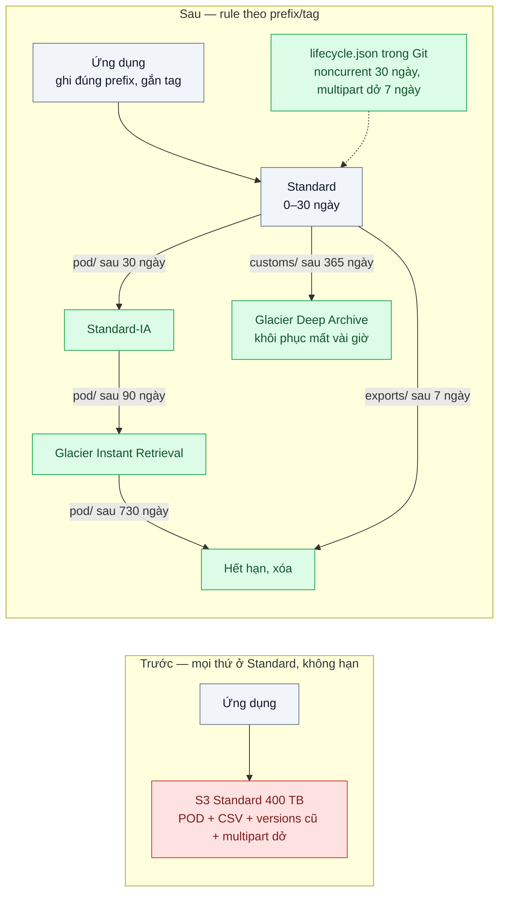
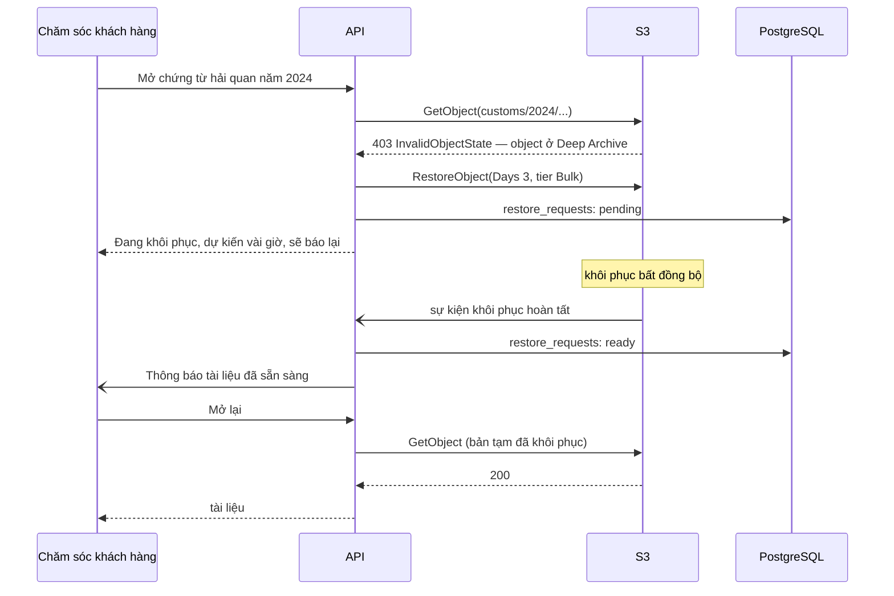

# Lifecycle Policies & Storage Tiers — Chi phí lưu trữ tăng gấp 3 vì giữ mọi file ở hot tier

| Scope | Mức độ | Trạng thái | Pattern gốc | Cập nhật |
|---|---|---|---|---|
| 15 · backend / storage | 🟡 Trung bình | 📋 Kế hoạch | Lifecycle configuration, Storage classes — AWS S3 docs "Managing your storage lifecycle", "Storage classes"; MinIO docs "Object Lifecycle Management" | 2026-10-06 |

> **Một câu tóm tắt:** Phân loại dữ liệu theo tần suất truy cập và thời hạn phải giữ, rồi khai báo lifecycle rule theo prefix/tag để object tự chuyển xuống bậc lưu trữ rẻ hơn và tự hết hạn — thay cho việc giữ mọi thứ ở bậc đắt nhất mãi mãi.

## 1. Bài toán thực tế (What)

**Bối cảnh** *(doanh nghiệp giả định, số liệu minh họa)*
Một công ty logistics lưu ảnh bằng chứng giao hàng (proof of delivery — POD): khoảng 1,2 triệu ảnh/ngày, trung bình 300 KB. Ngoài ra có file xuất báo cáo CSV, log đối soát và chứng từ hải quan. Sau 3 năm, khoảng 400 TB nằm cả ở S3 Standard; bucket bật versioning nhưng không có rule nào.

**Triệu chứng người kinh doanh nhìn thấy**
- Hóa đơn lưu trữ tăng gấp 3 trong 18 tháng trong khi số đơn chỉ tăng 40%; giám đốc tài chính hỏi lý do, không ai trả lời được bằng số.
- Không ai dám xóa gì vì không biết file nào còn cần cho khiếu nại hoặc kiểm toán.
- Mỗi quý một kỹ sư chạy script xóa file xuất cũ bằng tay; lần gần nhất script xóa nhầm một thư mục chứng từ.

**Nguyên nhân kỹ thuật**
Ảnh POD được xem nhiều trong 7 ngày đầu (khiếu nại giao hàng), hiếm khi sau 90 ngày, nhưng vẫn trả giá bậc "truy cập thường xuyên". File CSV chỉ cần 7 ngày nhưng sống mãi. Versioning giữ mọi phiên bản cũ (noncurrent) không hạn; các lượt multipart upload bỏ dở vẫn bị tính tiền phần đã tải. Không có phân loại dữ liệu nên không có quy tắc, chỉ có xóa tay.

**Ràng buộc**
- Ảnh POD giữ 2 năm cho tranh chấp, mở được trong vài giây khi chăm sóc khách hàng cần (giả định quy định nội bộ).
- Chứng từ hải quan giữ 10 năm (giả định), chấp nhận chờ vài giờ khi cần lấy lại.
- Không được xóa object nào trước hạn giữ; quy tắc phải nằm trong Git và review được.

## 2. Vì sao dùng pattern này (Why)

**Nguyên nhân gốc mà pattern nhắm vào:** một bậc lưu trữ và không hạn cho mọi loại dữ liệu, bất kể nó được đọc bao nhiêu và cần giữ bao lâu.

**Pattern giải quyết thế nào:** S3 cung cấp nhiều storage class đánh đổi giá lưu trữ với phí và thời gian truy xuất (Standard, Standard-IA, Glacier Instant Retrieval, Glacier Flexible Retrieval, Glacier Deep Archive, Intelligent-Tiering). Lifecycle configuration là tập rule theo prefix hoặc tag với hai loại hành động: *transition* (chuyển class sau N ngày) và *expiration* (xóa sau N ngày), cộng các rule cho phiên bản noncurrent và cho multipart bỏ dở. Storage tự thực thi, không cần script. MinIO có cơ chế tương tự (ILM: expiration và transition sang remote tier) nên học được ở local.

**Lựa chọn khác đã cân nhắc**

| Lựa chọn | Giải quyết được gì | Vì sao không chọn (ở bài này) |
|---|---|---|
| Giữ nguyên + tối ưu nhỏ (nén ảnh mạnh hơn, script xóa định kỳ) | Giảm dung lượng mới | Script dễ xóa nhầm, tốn request LIST; không tận dụng bậc rẻ; versions cũ vẫn tính tiền |
| S3 Intelligent-Tiering cho toàn bộ | Tự chuyển bậc theo truy cập thực | Phí giám sát theo số object, bất lợi với hàng tỷ ảnh nhỏ; không lo phần hết hạn. Dùng cho prefix khó đoán |
| Chuyển sang nhà cung cấp rẻ hơn | Đổi cấu trúc giá (ví dụ không phí egress) | Chi phí di chuyển lớn; không giải quyết việc giữ dữ liệu quá hạn |
| Phân loại dữ liệu + lifecycle rule theo prefix/tag — **chọn** | Mỗi loại dữ liệu có bậc và hạn riêng, storage tự thực thi | Phải hiểu phí tối thiểu, phí chuyển bậc, độ trễ khôi phục |

## 3. Thiết kế hệ thống (How)

### 3.1 Kiến trúc trước và sau



### 3.2 Luồng chính — mở file đã nằm ở bậc lưu trữ lạnh



### 3.3 Thành phần và trách nhiệm

| Thành phần | Trách nhiệm | Quyết định thiết kế đáng chú ý |
|---|---|---|
| Bảng phân loại dữ liệu | Mỗi prefix: ai đọc, đọc bao lâu sau khi tạo, giữ bao lâu, chấp nhận chờ bao lâu | Viết cùng nghiệp vụ và pháp chế; là "hợp đồng" để sinh rule |
| Quy ước key | `pod/yyyy/mm/dd/...`, `exports/...`, `customs/...`; tag `retention` khi prefix không đủ | Prefix theo loại dữ liệu trước, theo ngày sau, để rule khớp gọn |
| `lifecycle.json` + script áp dụng | Rule transition, expiration, noncurrent, abort multipart; áp bằng lệnh `mc ilm` (local, cần xác minh cú pháp import rule) hoặc API `PutBucketLifecycleConfiguration` | Nằm trong Git, review như code; có test "không rule nào xóa sớm hơn hạn giữ" |
| `RestoreService` | Nhận `InvalidObjectState`, gọi `RestoreObject`, theo dõi tới khi xong | Chỉ áp dụng cho prefix ở bậc lưu trữ cần khôi phục |
| Mô hình chi phí | Tính chi phí theo dung lượng mỗi bậc, số object, phí chuyển bậc, phí tối thiểu | Bảng giá là tham số nhập vào từ trang giá tại thời điểm tính, không viết cứng |

### 3.4 Điểm dễ sai khi triển khai
- Chuyển hàng tỷ object nhỏ xuống bậc IA: phí chuyển bậc tính theo số object và có kích thước tính phí tối thiểu (128 KB với các lớp IA), có thể đắt hơn số tiền tiết kiệm. Chạy mô hình chi phí trước (cần xác minh ràng buộc hiện hành trong S3 docs).
- Quên thời gian lưu tối thiểu (khoảng 30 ngày với Standard-IA, 90 ngày với Glacier Instant Retrieval, 180 ngày với Deep Archive theo docs): xóa sớm vẫn bị tính đủ.
- Bật versioning mà không có rule `NoncurrentVersionExpiration` → "xóa" chỉ tạo delete marker, dung lượng không giảm.
- Không có rule `AbortIncompleteMultipartUpload` → phần upload dở (bài 03) bị tính tiền mãi và không hiện trong danh sách object thường.
- Đưa dữ liệu cần mở ngay xuống Deep Archive → chăm sóc khách hàng chờ vài giờ. Bậc chọn theo thời gian chờ chấp nhận được, không chỉ theo giá.
- Rule viết theo prefix sai một ký tự xóa nhầm cả cây; luôn thử trên bucket staging và có test tĩnh cho rule.

## 4. Tech stack và tác động (Impact techstack)

| Lớp | Công nghệ chọn | Vì sao chọn | Thay thế tương đương |
|---|---|---|---|
| Object storage (local) | Hai MinIO: một "hot", một làm remote tier | MinIO ILM hỗ trợ expiration và transition sang tier khác — tái hiện cơ chế bằng Docker Compose | — |
| Object storage (production) | S3 với lifecycle configuration | Đủ bậc lưu trữ và rule noncurrent / multipart | GCS lifecycle + storage classes; Azure Blob access tiers |
| Áp rule | `mc ilm` (local), AWS SDK `PutBucketLifecycleConfiguration` hoặc Terraform (production) | Rule là code, review được | Pulumi |
| Ứng dụng | TypeScript strict, Node 20+, NestJS (`RestoreService`) | Stack mặc định | Fastify thuần |
| Mô hình chi phí | Script Node đọc thống kê dung lượng + bảng giá nhập tay | Kiểm chứng được trước khi bật rule | Bảng tính |
| Quan sát | `mc du`, `mc ls --versions`; production: S3 Storage Lens, Storage Class Analysis | Thấy dung lượng theo prefix, phiên bản cũ, phần upload dở | Báo cáo S3 Inventory |

**Thay đổi so với hệ thống hiện tại:** thêm bảng phân loại dữ liệu, chuẩn hóa prefix khi ghi, rule trong Git, luồng khôi phục cho dữ liệu lạnh. Nghiệp vụ phải chấp nhận "tài liệu rất cũ mở chậm"; đội vận hành học đọc hóa đơn theo bậc lưu trữ.

## 5. Kết quả đầu ra và cách đo (Output impact)

| Chỉ số | Trước (minh họa) | Mục tiêu khi thực hành | Cách đo |
|---|---|---|---|
| Dung lượng ở bậc hot sau khi rule chạy trên bộ dữ liệu giả lập 90 ngày | 100% | Chỉ còn dữ liệu trong cửa sổ "đọc nhiều" | `mc du` trên MinIO hot và remote tier |
| Chi phí lưu trữ ước tính mỗi tháng | Mốc 100 | Giảm rõ theo mô hình; báo cáo cả phí chuyển bậc | Script mô hình chi phí với bảng giá nhập tại thời điểm thực hành |
| Dung lượng phiên bản noncurrent và multipart dở | Tăng mãi | Về 0 sau hạn rule | `mc ls --versions`, liệt kê multipart dở qua API `ListMultipartUploads` |
| Object bị xóa trước hạn giữ | Có (script xóa tay) | 0 | Test so danh sách object với bảng phân loại sau khi giả lập thời gian |
| Thời gian lấy file từ remote tier ở local | — | Ghi nhận để so với Standard | Script đo thời gian `GetObject` trên hai tier |

> Số "trước" là minh họa để hình dung bài toán. Số "mục tiêu" chỉ được coi là đạt khi có số đo thật
> ở mục 8 kèm môi trường đo.

**Tác động nghiệp vụ mong đợi:** chi phí lưu trữ tăng theo dữ liệu thật sự cần giữ thay vì theo thời gian, tài chính dự báo được hóa đơn, không còn xóa tay với rủi ro xóa nhầm.

## 6. Đánh đổi và khi KHÔNG nên dùng

**Đánh đổi**
- Dữ liệu cũ mở chậm hơn và có phí truy xuất; cần luồng khôi phục và giải thích cho người dùng nội bộ.
- Rule sai có thể xóa dữ liệu không lấy lại được; cần review, staging và (với dữ liệu quan trọng) versioning/Object Lock (bài 07).
- Cấu trúc giá nhiều chiều (lưu trữ, chuyển bậc, truy xuất, thời gian tối thiểu) khiến dự đoán khó hơn.

**Không nên dùng khi**
- Tổng dung lượng nhỏ (vài trăm GB): tiền tiết kiệm không đáng công phân loại và rủi ro rule sai.
- Mẫu truy cập hoàn toàn không đoán được: Intelligent-Tiering hoặc giữ nguyên bậc đơn giản hơn tự viết rule.
- Object rất nhỏ và rất nhiều: phí chuyển bậc và kích thước tính phí tối thiểu có thể nuốt hết lợi ích; gộp file trước khi lưu trữ lâu dài.

**Liên quan**
- `../01-object-storage-vs-luu-file-trong-db-hoac-disk-server/` — nền: file đã ở object storage.
- `../03-multipart-resumable-upload-video-dut-mang-lam-lai-tu-dau/` — rule dọn multipart dở.
- `../07-backup-pitr-xoa-nham-bang-luc-14h-backup-dem-qua/` — versioning, Object Lock và hạn giữ backup.
- `../../02-backend-database/09-partitioning-bang-su-kien-500-trieu-dong/` — cùng ý tưởng "dữ liệu già đi" trong DB.
- `../../18-backend-scale/07-capacity-planning-use-method-mua-may-bao-nhieu-cho-tet/` — dự báo tăng trưởng dung lượng.

## 7. Cơ sở tham khảo

- AWS S3 User Guide, "Managing the lifecycle of objects" — https://docs.aws.amazon.com/AmazonS3/latest/userguide/object-lifecycle-mgmt.html — transition, expiration, rule cho noncurrent version và multipart dở.
- AWS S3 User Guide, "Understanding and managing Amazon S3 storage classes" — https://docs.aws.amazon.com/AmazonS3/latest/userguide/storage-class-intro.html — đặc tính từng bậc, thời gian lưu tối thiểu, kích thước tính phí tối thiểu.
- AWS S3 User Guide, "Restoring an archived object" — https://docs.aws.amazon.com/AmazonS3/latest/userguide/restoring-objects.html (cần xác minh URL) — `RestoreObject`, các tier khôi phục.
- MinIO docs, "Object Lifecycle Management" — https://min.io/docs/ — expiration và transition sang remote tier dùng cho môi trường local.
- AWS S3 pricing — https://aws.amazon.com/s3/pricing/ — nguồn bảng giá nhập vào mô hình chi phí tại thời điểm thực hành.

## 8. Kế hoạch thực hành

- [ ] Bước 1: Docker Compose gồm hai MinIO (hot và remote tier), script sinh 1 triệu object giả theo ba prefix với ngày tạo trải 3 năm (ghi trong metadata), bật versioning, để lại vài multipart dở.
- [ ] Bước 2: Đo "trước": `mc du`, đếm phiên bản noncurrent và multipart dở; chạy mô hình chi phí với bảng giá nhập tay.
- [ ] Bước 3: Viết bảng phân loại dữ liệu và `lifecycle.json`; áp bằng `mc ilm`; viết `RestoreService` cho prefix lạnh (production dùng `RestoreObject`, local mô phỏng bằng độ trễ của remote tier).
- [ ] Bước 4: Đo "sau" khi rule chạy (MinIO quét theo chu kỳ, cần chờ hoặc dùng bộ dữ liệu đã "già" sẵn); ghi vào mục 5 kèm môi trường.
- [ ] Bước 5: Test: không rule nào có số ngày expiration nhỏ hơn hạn giữ trong bảng phân loại; noncurrent và multipart dở có rule dọn; prefix `customs/` không bao giờ bị expiration; `RestoreService` xử lý đúng lỗi `InvalidObjectState`.

**Cấu trúc code dự kiến**
```text
lifecycle/
  data-classification.yaml     # prefix, hạn đọc nhiều, hạn giữ, thời gian chờ chấp nhận
  lifecycle.json               # rule sinh ra từ bảng phân loại
src/
  restore/restore.service.ts
  scripts/seed-objects.ts      # sinh dữ liệu giả lập 3 năm
  scripts/cost-model.ts        # mô hình chi phí theo bảng giá nhập vào
test/lifecycle-rules.test.ts
docker-compose.yml
```

**Cách chạy** *(điền khi bắt đầu code)*
```bash
docker compose up -d
pnpm install && pnpm test
pnpm tsx src/scripts/cost-model.ts
```
