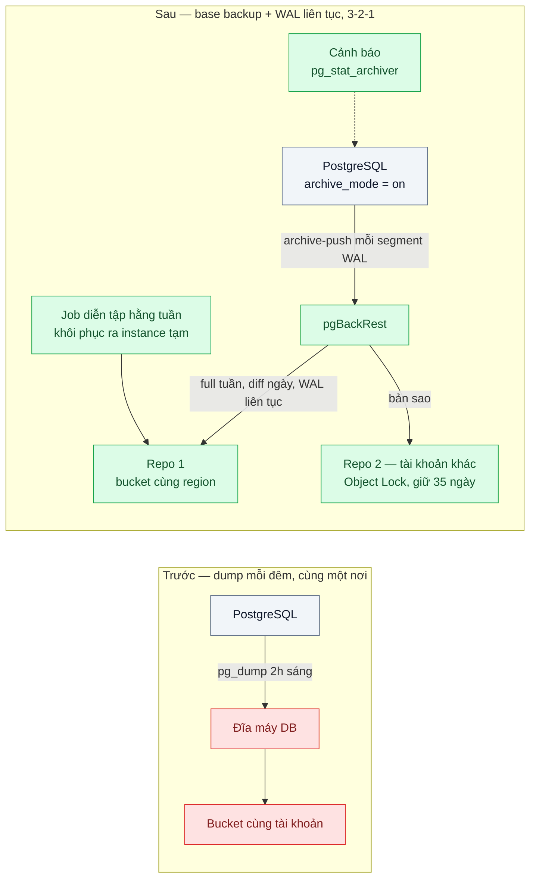
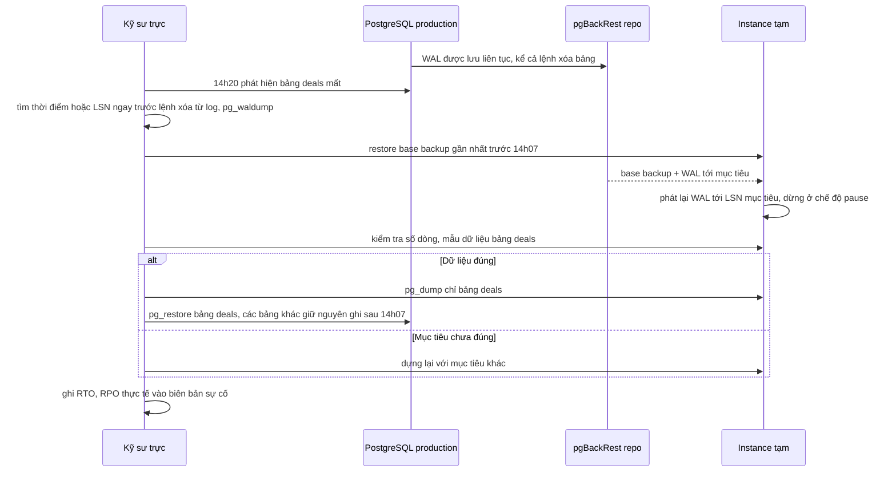

# Backup & Point-in-Time Recovery (3-2-1) — Xóa nhầm bảng lúc 14h, bản backup gần nhất là 2h sáng

| Scope | Mức độ | Trạng thái | Pattern gốc | Cập nhật |
|---|---|---|---|---|
| 15 · backend / storage | 🔴 Nâng cao | 📋 Kế hoạch | Continuous Archiving and PITR — PostgreSQL docs; quy tắc 3-2-1 — Peter Krogh, *The DAM Book*; S3 Versioning / Object Lock — AWS S3 docs | 2026-10-06 |

> **Một câu tóm tắt:** Thay bản dump mỗi đêm bằng base backup vật lý cộng WAL lưu trữ liên tục, để khôi phục về đúng thời điểm trước sự cố (mất vài phút dữ liệu thay vì 12 giờ); giữ ba bản ở hai nơi lưu khác nhau, một bản ở tài khoản khác không xóa được, và diễn tập khôi phục hằng tuần.

## 1. Bài toán thực tế (What)

**Bối cảnh** *(doanh nghiệp giả định, số liệu minh họa)*
Một SaaS B2B quản lý khách hàng (CRM) phục vụ 300 công ty, PostgreSQL 1,5 TB tự vận hành trên máy ảo. Backup là `pg_dump` lúc 2h sáng, ghi ra đĩa của chính máy DB rồi chép sang một bucket cùng tài khoản cloud. Chưa ai từng khôi phục thử từ bản backup.

**Triệu chứng người kinh doanh nhìn thấy**
- 14h07 một kỹ sư chạy nhầm script dọn dữ liệu trên production, bảng `deals` bị xóa. Bản gần nhất là 2h sáng: 12 giờ giao dịch của 300 khách hàng biến mất.
- Khôi phục bản dump 1,5 TB mất khoảng 9 giờ (dựng lại index); toàn hệ thống dừng cả buổi chiều.
- Kiểm toán bảo mật chỉ ra: một credential bị lộ có thể xóa cả DB lẫn bucket backup vì cùng tài khoản.

**Nguyên nhân kỹ thuật**
Dữ liệu mất tối đa (RPO) bằng khoảng cách giữa hai lần dump — 24 giờ. Thời gian khôi phục (RTO) là thời gian nạp lại dump logic và dựng index cho toàn bộ DB, dù chỉ cần một bảng. Bản backup chỉ có ở hai nơi, cùng quyền truy cập, và chưa từng được chứng minh là khôi phục được.

**Ràng buộc**
- RPO mục tiêu vài phút, RTO cho sự cố "xóa nhầm một bảng" dưới 1 giờ (con số mục tiêu minh họa, cần thỏa thuận với nghiệp vụ).
- Các bảng khác vẫn nhận ghi sau 14h07; không được đánh đổi chúng để lấy lại một bảng.
- Ít nhất một bản backup không thể bị xóa hay sửa trong thời hạn giữ, kể cả bởi quản trị viên.

## 2. Vì sao dùng pattern này (Why)

**Nguyên nhân gốc mà pattern nhắm vào:** backup là ảnh chụp rời rạc, cách nhau lâu, cùng một nơi, và chưa được diễn tập.

**Pattern giải quyết thế nào:** PostgreSQL ghi mọi thay đổi vào WAL trước khi áp vào dữ liệu. Continuous archiving kết hợp một *base backup* vật lý với chuỗi WAL được lưu trữ liên tục (`archive_mode`, `archive_command`); khôi phục là đặt lại base backup rồi phát lại WAL tới một mục tiêu (`recovery_target_time`, `recovery_target_lsn` hoặc `recovery_target_xid`) và dừng ở đó (`recovery_target_action = pause`). RPO giờ phụ thuộc độ trễ lưu WAL (giới hạn bằng `archive_timeout`), không còn là 24 giờ. Quy tắc 3-2-1 (Krogh): 3 bản dữ liệu, trên 2 loại nơi lưu, 1 bản ở nơi khác. Object Lock của S3 biến bản ở nơi khác thành bất biến trong thời hạn giữ. Với sự cố một bảng, khôi phục ra một instance tạm rồi chép bảng về, không tua cả cluster.

**Lựa chọn khác đã cân nhắc**

| Lựa chọn | Giải quyết được gì | Vì sao không chọn (ở bài này) |
|---|---|---|
| Giữ nguyên + tối ưu nhỏ (`pg_dump` mỗi 4 giờ, nén song song) | RPO còn 4 giờ | Dump gây tải lên DB; khôi phục vẫn chậm; vẫn cùng một nơi |
| Streaming replica làm "backup" | Chịu được hỏng máy chủ | Lệnh xóa bảng được sao chép ngay sang replica — replica không phải backup |
| Replica trễ (`recovery_min_apply_delay` 1 giờ) | Có cửa sổ lấy lại dữ liệu trước sự cố | Chỉ cứu được trong cửa sổ trễ; vẫn cần backup dài hạn. Đáng bổ sung |
| Dịch vụ DB được quản lý có PITR sẵn (RDS, Cloud SQL) | Cùng cơ chế, ít vận hành | Hệ thống đang tự vận hành; nếu dùng dịch vụ quản lý thì nên bật PITR sẵn có thay vì tự làm |
| Base backup + WAL archive (pgBackRest) + 3-2-1 + Object Lock + diễn tập — **chọn** | RPO vài phút, khôi phục tới thời điểm bất kỳ, bản bất biến ở nơi khác | Thêm công cụ, dung lượng WAL, quy trình diễn tập định kỳ |

## 3. Thiết kế hệ thống (How)

### 3.1 Kiến trúc trước và sau



### 3.2 Luồng chính — khôi phục bảng bị xóa lúc 14h07



### 3.3 Thành phần và trách nhiệm

| Thành phần | Trách nhiệm | Quyết định thiết kế đáng chú ý |
|---|---|---|
| Cấu hình PostgreSQL | `wal_level = replica`, `archive_mode = on`, `archive_command` gọi pgBackRest, `archive_timeout = 60s` | `archive_timeout` chặn trên độ trễ lưu WAL lúc ít ghi, đổi lại tốn thêm segment |
| pgBackRest | Full hằng tuần, differential hằng ngày, WAL liên tục; kiểm tra checksum | Hai repo: repo 1 khôi phục nhanh, repo 2 ở tài khoản khác (cần xác minh cấu hình nhiều repo) |
| Repo 2 + Object Lock | Bản bất biến trong 35 ngày | Chế độ compliance: không ai, kể cả tài khoản quản trị, xóa được trước hạn |
| Runbook + script khôi phục | Khôi phục ra instance tạm theo thời điểm/LSN, kiểm tra, chép bảng về | Mặc định "khôi phục bên cạnh", chỉ tua cả cluster khi toàn DB hỏng |
| Job diễn tập | Mỗi tuần khôi phục bản mới nhất ra instance tạm, chạy kiểm tra, ghi RTO/RPO | Backup chưa từng khôi phục thử thì coi như chưa có |
| Giám sát | `pg_stat_archiver` (`failed_count`, `last_archived_time`), tuổi backup gần nhất | Cảnh báo khi WAL chưa được lưu quá 5 phút |

### 3.4 Điểm dễ sai khi triển khai
- Coi replica là backup: lệnh xóa sao chép sang replica trong vài mili-giây.
- `archive_command` trả về 0 dù chép thất bại → chuỗi WAL có lỗ, chỉ phát hiện lúc khôi phục. Dùng lệnh của công cụ backup có kiểm tra, và cảnh báo trên `failed_count`.
- Tua cả cluster về 14h06 → mất mọi ghi hợp lệ của các bảng khác sau đó. Khôi phục ra instance tạm rồi chép bảng.
- `recovery_target_time` không ghi múi giờ → khôi phục lệch 7 giờ. Luôn ghi múi giờ, hoặc dùng LSN/xid.
- Thời hạn giữ WAL ngắn hơn khoảng cách tới base backup cũ nhất → có backup nhưng không tới được thời điểm cần.
- Khóa giải mã backup chỉ nằm trên máy DB → mất máy là mất luôn khả năng giải mã. Khóa phải nằm ở nơi độc lập.

## 4. Tech stack và tác động (Impact techstack)

| Lớp | Công nghệ chọn | Vì sao chọn | Thay thế tương đương |
|---|---|---|---|
| Cơ sở dữ liệu | PostgreSQL 16 | Stack mặc định; continuous archiving có sẵn | — |
| Công cụ backup | pgBackRest | Full/diff/incremental, WAL archive song song, nhiều repo, lưu lên S3, kiểm tra checksum | WAL-G, Barman |
| Nơi lưu backup | MinIO (local, bucket tạo với `--with-lock`) → S3 hai tài khoản, Object Lock (production) | Tái hiện được Object Lock ở local; cùng S3 API | GCS bucket lock, Azure immutable blob |
| Hạ tầng local | Docker Compose: PostgreSQL, MinIO, instance tạm để khôi phục | Một lệnh dựng lại kịch bản sự cố | — |
| Script diễn tập và đo | Node 20 (TypeScript strict) điều khiển `pgbackrest`, `psql`, ghi thời gian từng bước | Đo RTO/RPO lặp lại được | Bash |
| Test | Vitest | Kiểm tra hành vi khôi phục bằng dữ liệu nhịp tim | — |

**Thay đổi so với hệ thống hiện tại:** thêm pgBackRest, hai repo backup (một ở tài khoản riêng), cấu hình WAL archive, runbook và job diễn tập, cảnh báo archive. Đội vận hành phải học đọc `pg_stat_archiver`, chạy khôi phục theo LSN và xoay vòng diễn tập.

## 5. Kết quả đầu ra và cách đo (Output impact)

| Chỉ số | Trước (minh họa) | Mục tiêu khi thực hành | Cách đo |
|---|---|---|---|
| RPO — dữ liệu mất tối đa | 12 giờ | ≤ 1 phút | Bảng nhịp tim ghi một dòng mỗi giây; sau khôi phục so dòng cuối với thời điểm sự cố |
| RTO — lấy lại một bảng 5 GB trên DB lab 20 GB | — (ước 9 giờ cho 1,5 TB) | < 30 phút | Script ghi thời gian từ lúc bắt đầu restore tới khi bảng trở lại production |
| Ghi hợp lệ của bảng khác sau sự cố bị mất | Có (nếu tua cả DB) | 0 dòng | So số dòng bảng khác trước và sau khi chép bảng về |
| Độ trễ lưu WAL | Không đo | < 60 giây | `now() - last_archived_time` từ `pg_stat_archiver` |
| Diễn tập khôi phục thành công | Chưa từng | 4/4 tuần thực hành | Log job diễn tập |
| Bản backup sống sót khi credential chính bị dùng để xóa | 0 bản | Repo 2 không xóa được | Thử `DeleteObject` phiên bản trong repo 2, kỳ vọng bị từ chối |

> Số "trước" là minh họa để hình dung bài toán. Số "mục tiêu" chỉ được coi là đạt khi có số đo thật
> ở mục 8 kèm môi trường đo.

**Tác động nghiệp vụ mong đợi:** sự cố xóa nhầm chỉ mất vài phút dữ liệu và chưa tới một giờ gián đoạn một tính năng thay vì cả buổi chiều; công ty trả lời được kiểm toán "bản backup không bị xóa được, và đã khôi phục thử tuần trước".

## 6. Đánh đổi và khi KHÔNG nên dùng

**Đánh đổi**
- Dung lượng và chi phí lưu WAL tăng theo lượng ghi; cần lifecycle cho repo (bài 06).
- Thêm công cụ và quy trình: diễn tập định kỳ tốn máy và người.
- Object Lock chế độ compliance không đảo ngược được: đặt sai thời hạn là trả tiền lưu tới hết hạn.

**Không nên dùng khi**
- Dùng dịch vụ DB được quản lý đã có PITR: bật và diễn tập tính năng sẵn có, không tự dựng lại.
- Dữ liệu dựng lại được hoàn toàn từ nguồn khác (cache, bảng tổng hợp, môi trường dev): backup đơn giản hoặc không cần.
- DB rất nhỏ, ghi ít, chấp nhận mất một ngày: `pg_dump` định kỳ ra nơi khác vẫn đủ, miễn là có diễn tập.

**Liên quan**
- `../01-object-storage-vs-luu-file-trong-db-hoac-disk-server/` — file ở object storage cũng cần versioning và bản ở nơi khác.
- `../06-lifecycle-tiering-chi-phi-luu-tru-tang-gap-3/` — hạn giữ và chi phí của repo backup.
- `../../02-backend-database/05-read-replica-bao-cao-cuoi-thang-lam-cham-tao-don/` — replica phục vụ đọc, không thay backup.
- `../../02-backend-database/04-audit-log-ai-doi-gia-hop-dong-luc-nao/` — soft delete giảm số lần phải khôi phục.
- `../../02-backend-database/08-expand-contract-doi-ten-cot-100-trieu-dong/` — migration an toàn để bớt xóa nhầm.
- `../../23-backend-monitoring-benchmark/06-alerting-symptom-not-cause-50-alert-moi-dem-khong-ai-doc/` — cảnh báo khi archive WAL thất bại.

## 7. Cơ sở tham khảo

- PostgreSQL docs, "Continuous Archiving and Point-in-Time Recovery (PITR)" — https://www.postgresql.org/docs/16/continuous-archiving.html — base backup, `archive_command`, khôi phục và yêu cầu lệnh archive chỉ trả 0 khi thành công.
- PostgreSQL docs, "Write Ahead Log — Recovery Target" — https://www.postgresql.org/docs/16/runtime-config-wal.html — `recovery_target_time`, `recovery_target_lsn`, `recovery_target_xid`, `recovery_target_action`, `archive_timeout`.
- PostgreSQL docs, "The Cumulative Statistics System" (`pg_stat_archiver`) — https://www.postgresql.org/docs/16/monitoring-stats.html — chỉ số giám sát archive.
- Peter Krogh, *The DAM Book* (O'Reilly, 2005/2009) — quy tắc backup 3-2-1.
- AWS S3 User Guide, "Using S3 Object Lock" — https://docs.aws.amazon.com/AmazonS3/latest/userguide/object-lock.html — chế độ governance và compliance, thời hạn giữ.
- pgBackRest User Guide — https://pgbackrest.org/user-guide.html — cấu hình repo S3 và khôi phục theo thời điểm (cần xác minh tham số khi dùng với MinIO).

## 8. Kế hoạch thực hành

- [ ] Bước 1: Docker Compose gồm PostgreSQL 16, MinIO (bucket `repo1` thường, `repo2` tạo với Object Lock), container pgBackRest; seed DB lab 20 GB với bảng `deals` 5 GB; bảng nhịp tim ghi mỗi giây.
- [ ] Bước 2: Đo "trước": `pg_dump` lúc T0, xóa bảng lúc T0 + 30 phút, khôi phục bằng dump; ghi RPO, RTO.
- [ ] Bước 3: Áp dụng pattern: bật WAL archive qua pgBackRest, full + diff, repo 2 với Object Lock; viết runbook và script khôi phục "bên cạnh" theo LSN.
- [ ] Bước 4: Lặp lại kịch bản xóa bảng, khôi phục bằng PITR; ghi RPO, RTO, số dòng bảng khác vào mục 5 kèm môi trường; chạy job diễn tập 4 tuần.
- [ ] Bước 5: Test: khôi phục tới LSN trước lệnh xóa có đủ dòng `deals`; các bảng khác không mất ghi sau sự cố; tắt MinIO làm `pg_stat_archiver.failed_count` tăng và cảnh báo bật; xóa object trong repo 2 bị từ chối.

**Cấu trúc code dự kiến**
```text
pgbackrest/pgbackrest.conf          # repo1, repo2, lịch backup
scripts/
  seed-database.ts
  heartbeat-writer.ts                 # ghi nhịp tim mỗi giây để đo RPO
  restore-table-aside.ts              # khôi phục ra instance tạm, chép bảng về
  restore-drill.ts                    # diễn tập hằng tuần, ghi RTO/RPO
runbook/restore-dropped-table.md
test/pitr-restore.test.ts
docker-compose.yml
```

**Cách chạy** *(điền khi bắt đầu code)*
```bash
docker compose up -d
pnpm install && pnpm test
pnpm tsx scripts/restore-drill.ts
```
