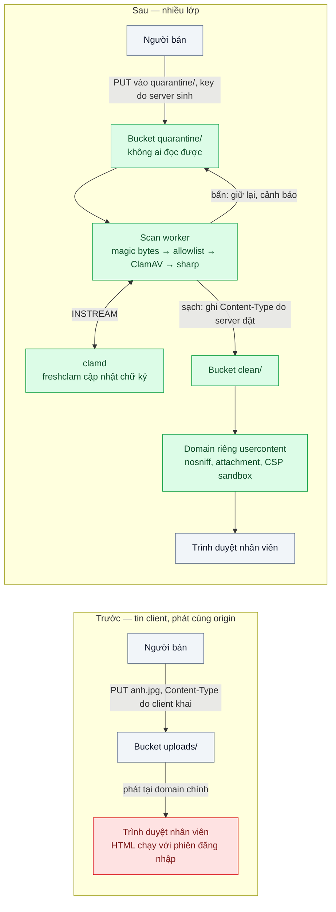
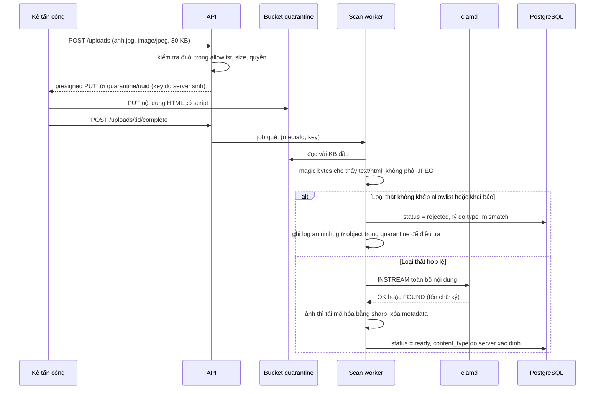

# Upload Hardening (validation, content sniffing, AV scan) — Khách upload "ảnh.jpg" thực ra là file HTML chứa script

| Scope | Mức độ | Trạng thái | Pattern gốc | Cập nhật |
|---|---|---|---|---|
| 15 · backend / storage | 🟡 Trung bình | 📋 Kế hoạch | File Upload Cheat Sheet — OWASP Cheat Sheet Series; ClamAV docs | 2026-10-06 |

> **Một câu tóm tắt:** Không tin bất cứ điều gì client nói về file: nhận vào vùng cách ly, xác định loại thật bằng magic bytes, quét virus, tái mã hóa ảnh, rồi mới đưa sang vùng sạch và phát từ một domain riêng với header do server đặt — nhiều lớp, lớp sau đỡ khi lớp trước sót.

## 1. Bài toán thực tế (What)

**Bối cảnh** *(doanh nghiệp giả định, số liệu minh họa)*
Một sàn đấu giá trực tuyến cho người bán tải ảnh sản phẩm và giấy tờ chứng minh nguồn gốc (PDF), khoảng 40.000 file/ngày. Upload đi qua presigned URL (bài 02); `Content-Type` lấy theo khai báo của trình duyệt, file được phát lại tại `<domain-chính>/uploads/...`. Nhân viên kiểm duyệt mở file trực tiếp trên trình duyệt nội bộ.

**Triệu chứng người kinh doanh nhìn thấy**
- Một "người bán" tải lên `anh.jpg` thực chất là trang HTML chứa script; nhân viên kiểm duyệt bấm xem, tài khoản của họ bị dùng để duyệt hàng loạt tin đăng giả.
- Một file "giay-to.pdf" chứa mã độc được tải về máy kế toán; phải cô lập máy và rà soát cả phòng; pháp chế lo sàn bị dùng để phát tán file độc hại dưới tên miền công ty.

**Nguyên nhân kỹ thuật**
Hệ thống tin đuôi file và `Content-Type` do client khai, cả hai đều tùy ý sửa được. File được phát cùng origin với ứng dụng, nên HTML/SVG chạy script với quyền của phiên đăng nhập; không quét virus; ảnh được phát nguyên byte gốc nên một file "đa hình" (vừa là ảnh hợp lệ vừa chứa payload) vẫn lọt.

**Ràng buộc**
- Chỉ chấp nhận JPEG, PNG, WebP, PDF; tối đa 20 MB mỗi file.
- Không đưa byte qua API (giữ kiến trúc bài 02); quét không làm upload chậm quá vài giây.
- Môi trường local chạy được toàn bộ (MinIO, ClamAV trong Docker Compose).

## 2. Vì sao dùng pattern này (Why)

**Nguyên nhân gốc mà pattern nhắm vào:** dữ liệu do người dùng kiểm soát (tên, đuôi, loại, nội dung) được coi như dữ liệu tin cậy và phát lại trong ngữ cảnh có quyền.

**Pattern giải quyết thế nào:** OWASP File Upload Cheat Sheet đưa ra một chuỗi biện pháp chồng lớp: allowlist đuôi file và giới hạn kích thước; tên file do server sinh; xác định loại file thật thay vì tin header `Content-Type`; quét bằng phần mềm chống virus; chỉ người có quyền mới upload; lưu và phát ở nơi tách biệt khỏi ứng dụng. Ở bài này: upload vào prefix `quarantine/` không ai đọc được; worker đọc magic bytes để xác định loại thật, đối chiếu allowlist, gửi nội dung tới `clamd` qua lệnh `INSTREAM`, tái mã hóa ảnh bằng `sharp`, rồi ghi sang `clean/` với `Content-Type` do server đặt. File phát từ một domain riêng (không chung cookie) kèm `X-Content-Type-Options: nosniff` và `Content-Disposition: attachment` cho loại không phải ảnh.

**Lựa chọn khác đã cân nhắc**

| Lựa chọn | Giải quyết được gì | Vì sao không chọn (ở bài này) |
|---|---|---|
| Giữ nguyên + tối ưu nhỏ (kiểm tra đuôi và `Content-Type` ở client và API) | Chặn người dùng nhầm lẫn | Kẻ tấn công sửa được cả hai; không chặn được HTML đổi đuôi |
| Tải qua API, quét đồng bộ trước khi lưu | Không có file chưa quét trong bucket | Byte qua API (vấn đề bài 02); file lớn làm request treo |
| Chỉ dùng dịch vụ quét malware được quản lý của cloud | Ít vận hành | Phụ thuộc nhà cung cấp, không chạy được local; không thay được sniffing và domain riêng. Có thể bổ sung |
| Cách ly + sniffing + AV + tái mã hóa ảnh + domain riêng — **chọn** | Nhiều lớp độc lập, lớp sau đỡ lớp trước | Thêm bước xử lý và độ trễ trước khi file dùng được; phải cập nhật chữ ký virus |

## 3. Thiết kế hệ thống (How)

### 3.1 Kiến trúc trước và sau



### 3.2 Luồng chính — file HTML đội lốt ảnh



### 3.3 Thành phần và trách nhiệm

| Thành phần | Trách nhiệm | Quyết định thiết kế đáng chú ý |
|---|---|---|
| `POST /uploads` | Allowlist đuôi, giới hạn size, kiểm quyền, sinh key | Key `quarantine/<uuid>`; tên gốc chỉ lưu trong DB để hiển thị, không bao giờ vào đường dẫn |
| Bucket `quarantine/` | Nhận file chưa kiểm | Không có đường đọc công khai; lifecycle xóa sau 30 ngày (`../06-lifecycle-tiering-chi-phi-luu-tru-tang-gap-3/`) |
| `ScanWorker` (filter đầu của pipeline BullMQ ở bài 04) | Magic bytes → allowlist → ClamAV → tái mã hóa ảnh → ghi `clean/` | Từ chối sớm ở bước rẻ nhất; chỉ gửi ClamAV file đã qua sniffing |
| `clamd` + `freshclam` | Quét theo chữ ký, cập nhật cơ sở dữ liệu chữ ký định kỳ | Giới hạn kích thước stream phải ≥ giới hạn upload (cần xác minh tham số `StreamMaxLength`) |
| Domain `usercontent` | Phát file sạch với header an toàn | Domain khác hẳn domain ứng dụng, không phải subdomain dùng chung cookie |
| Log an ninh | Ghi mọi lần `rejected` / `infected` kèm người upload | Ngưỡng cảnh báo khi một tài khoản bị từ chối nhiều lần |

### 3.4 Điểm dễ sai khi triển khai
- Sniffing ở trình duyệt (MIME sniffing) là thứ cần *tắt* bằng `nosniff`; sniffing ở server là thứ cần *làm*. Đừng nhầm hai việc.
- Ký `Content-Type` theo khai báo client vào presigned URL rồi phát nguyên header đó → server đã "chứng nhận" loại file giả. Header khi phát phải lấy từ kết quả sniffing.
- Cho phép SVG như một "ảnh" → SVG là XML có thể chứa script. Loại khỏi allowlist hoặc chuyển sang PNG.
- Phát file người dùng ở subdomain chung cookie với ứng dụng (`files.<domain-chính>`) → vẫn chung ngữ cảnh cookie. Dùng domain riêng.
- Chữ ký ClamAV cũ nhiều ngày vì `freshclam` không chạy → quét mà như không. Giám sát tuổi cơ sở dữ liệu chữ ký.
- Coi AV là lớp duy nhất: AV theo chữ ký bỏ sót mã độc mới. Tái mã hóa ảnh và domain riêng là lớp không phụ thuộc chữ ký.

## 4. Tech stack và tác động (Impact techstack)

| Lớp | Công nghệ chọn | Vì sao chọn | Thay thế tương đương |
|---|---|---|---|
| Runtime / HTTP app | TypeScript strict, Node 20+, NestJS | Stack mặc định; dùng lại module upload bài 02 | Fastify thuần |
| Xác định loại file | Thư viện `file-type` (đọc magic bytes, cần xác minh API hiện hành) | Đọc vài KB đầu, không cần tải cả file | `libmagic` qua lệnh `file` |
| Chống virus | ClamAV (`clamd` + `freshclam`) trong container, giao tiếp qua TCP bằng lệnh `INSTREAM` | Mã nguồn mở, chạy local được, có giao thức stream | Dịch vụ quét malware của cloud cho object storage |
| Tái mã hóa ảnh | `sharp` | Giải mã rồi mã hóa lại làm rơi dữ liệu thừa và metadata | ImageMagick |
| Object storage | MinIO (local) → S3 / R2 | Cùng S3 API | — |
| Phát file | NGINX đặt header cho domain `usercontent.localhost` (local); CDN với response headers policy (production) | Kiểm soát header tập trung | Cấu hình header ở CDN khác |
| Đo | Bộ file kiểm thử + script, k6, `curl -I` | Đo tỷ lệ chặn đúng/nhầm và độ trễ quét | — |

**Thay đổi so với hệ thống hiện tại:** thêm vùng cách ly, worker quét, container ClamAV và lịch cập nhật chữ ký, domain riêng cho nội dung người dùng; trạng thái upload có thêm `rejected` / `infected`. Đội vận hành học theo dõi tuổi chữ ký và xử lý file bị cách ly.

## 5. Kết quả đầu ra và cách đo (Output impact)

| Chỉ số | Trước (minh họa) | Mục tiêu khi thực hành | Cách đo |
|---|---|---|---|
| File độc hại trong bộ kiểm thử được phát như nội dung chạy được trên domain ứng dụng | 100% | 0% | Bộ kiểm thử: HTML đổi đuôi, SVG có script, ảnh đa hình, PDF đổi đuôi, file EICAR; script upload rồi kiểm tra trạng thái và header phát |
| Tỷ lệ phát hiện file kiểm thử EICAR | 0% | 100% | Trạng thái `infected` sau khi upload |
| File hợp lệ bị chặn nhầm | — | < 0,5% | Bộ 1.000 ảnh/PDF hợp lệ, đếm `rejected` |
| p95 thời gian từ hoàn tất tới `ready` với file 10 MB | — | < 10 giây | Cột thời gian trong bảng `media`, `percentile_cont(0.95)` |
| Header khi phát file người dùng | Thiếu | Luôn có `nosniff`, `Content-Type` do server đặt, `attachment` cho PDF | Script `curl -I` trên toàn bộ file sạch |
| Tuổi cơ sở dữ liệu chữ ký ClamAV | Không theo dõi | < 24 giờ | Lệnh `VERSION` của `clamd` trả ngày cơ sở dữ liệu, kiểm tra định kỳ |

> Số "trước" là minh họa để hình dung bài toán. Số "mục tiêu" chỉ được coi là đạt khi có số đo thật
> ở mục 8 kèm môi trường đo.

**Tác động nghiệp vụ mong đợi:** sàn không còn là kênh phát tán file độc hại; nhân viên kiểm duyệt mở file an toàn; khi có sự cố, log an ninh chỉ ra ai đã upload gì.

## 6. Đánh đổi và khi KHÔNG nên dùng

**Đánh đổi**
- File không dùng được ngay sau upload; người dùng thấy trạng thái "đang kiểm tra".
- ClamAV tốn RAM đáng kể (nạp cơ sở dữ liệu chữ ký) và cần cập nhật liên tục.
- Tái mã hóa ảnh đổi byte gốc; nghiệp vụ cần ảnh gốc phải giữ bản gốc trong vùng cách ly có kiểm soát. Chặn nhầm vẫn có thể xảy ra, cần đường khiếu nại.

**Không nên dùng khi**
- Upload chỉ từ hệ thống nội bộ tin cậy (job xuất báo cáo tự sinh): allowlist và domain riêng là đủ, AV là thừa.
- Nghiệp vụ cần giữ nguyên định dạng tùy ý (kho mã nguồn, file thiết kế): không thể allowlist; chuyển sang chiến lược "chỉ cho tải xuống, không bao giờ hiển thị" và cách ly mạnh.

**Liên quan**
- `../02-presigned-url-valet-key-upload-500mb-qua-api-lam-nghen/` — luồng upload trực tiếp mà bài này gia cố.
- `../04-image-pipeline-mot-anh-can-6-kich-co/` — bước quét là filter đầu của pipeline.
- `../05-signed-cdn-url-hop-dong-rieng-tu-bi-share-link/` — phát nội dung riêng tư từ domain riêng.
- `../../19-backend-frontend-authenticate/02-session-cookie-vs-jwt-spa-luu-token-o-dau/` — script chạy cùng origin lấy được gì.
- `../../13-backend-transporter/03-rate-limiting-mot-khach-api-goi-10k-req-s/` — giới hạn tài khoản upload hàng loạt.

## 7. Cơ sở tham khảo

- OWASP Cheat Sheet Series, "File Upload Cheat Sheet" — https://cheatsheetseries.owasp.org/cheatsheets/File_Upload_Cheat_Sheet.html — danh sách biện pháp: allowlist, xác định loại thật, đổi tên, giới hạn kích thước, quét, lưu và phát tách biệt.
- ClamAV docs — https://docs.clamav.net/ — cấu hình `clamd`, lệnh `INSTREAM`, `freshclam` cập nhật chữ ký.
- MDN Web Docs, "X-Content-Type-Options" và "Content-Disposition" — https://developer.mozilla.org/docs/Web/HTTP/Headers — tắt MIME sniffing của trình duyệt, buộc tải xuống.
- sharp docs — https://sharp.pixelplumbing.com/ — giải mã và mã hóa lại ảnh, xóa metadata.
- `file-type` (npm) — https://github.com/sindresorhus/file-type (cần xác minh API hiện hành) — xác định loại file bằng magic bytes.

## 8. Kế hoạch thực hành

- [ ] Bước 1: Docker Compose gồm API (NestJS), PostgreSQL, Redis, MinIO, ClamAV, NGINX phát hai domain `app.localhost` và `usercontent.localhost`; phiên bản "trước" phát file tại `app.localhost/uploads` với `Content-Type` do client khai.
- [ ] Bước 2: Dựng bộ kiểm thử (HTML đổi đuôi, SVG có script, ảnh đa hình, PDF đổi đuôi, EICAR) và bộ 1.000 file hợp lệ; đo "trước".
- [ ] Bước 3: Áp dụng pattern: prefix cách ly, `ScanWorker` với bốn bước, domain riêng với header an toàn, log an ninh.
- [ ] Bước 4: Đo "sau": tỷ lệ chặn đúng/nhầm, p95 thời gian quét, header; ghi vào mục 5 kèm môi trường.
- [ ] Bước 5: Test: HTML đổi đuôi bị `rejected`; EICAR bị `infected` và không có bản trong `clean/`; ảnh hợp lệ ra `clean/` không còn metadata EXIF; mọi phản hồi từ `usercontent` có `nosniff`; tắt `clamd` thì job thử lại chứ không đánh dấu `ready`.

**Cấu trúc code dự kiến**
```text
src/
  uploads/uploads.controller.ts      # allowlist, size, key do server sinh
  scan/scan-worker.ts                # chuỗi bước quét
  scan/detect-file-type.ts           # magic bytes
  scan/clamd-client.ts               # INSTREAM qua TCP
  scan/reencode-image.ts             # sharp
nginx/usercontent.conf               # header an toàn cho domain riêng
fixtures/malicious/                  # bộ file kiểm thử
scripts/run-malicious-suite.ts       # upload bộ kiểm thử, kiểm tra trạng thái và header
test/upload-hardening.test.ts
docker-compose.yml
```

**Cách chạy** *(điền khi bắt đầu code)*
```bash
docker compose up -d
pnpm install && pnpm test
pnpm tsx scripts/run-malicious-suite.ts
```
