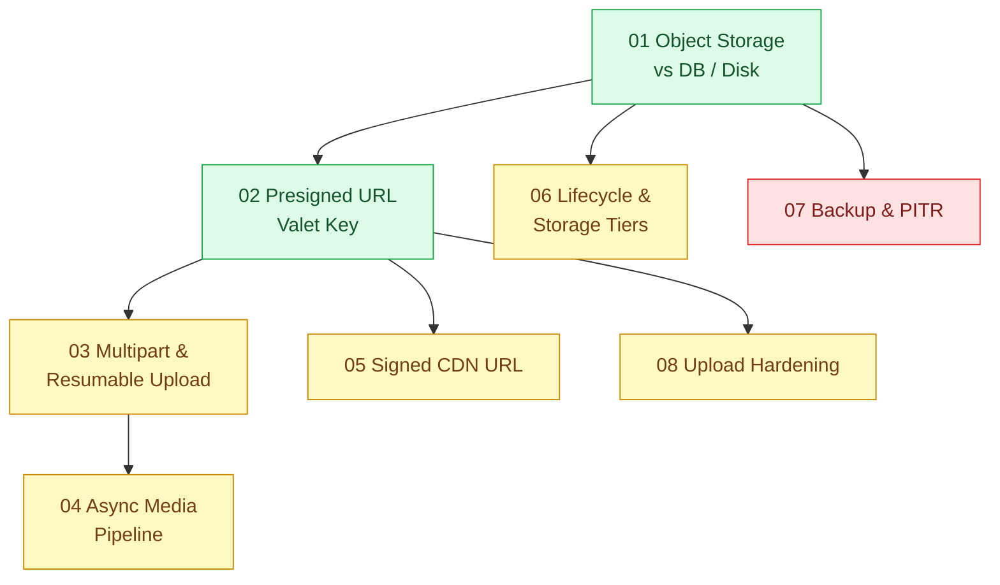

# 15 · Lưu trữ file và object (`backend / storage`)

> **Phạm vi:** File người dùng tải lên và tài sản tĩnh: lưu ở đâu, tải lên không qua API server,
> tải lên lớn và nối lại, xử lý ảnh/video bất đồng bộ, phát nội dung riêng tư qua CDN, chi phí theo
> bậc lưu trữ, backup và khôi phục theo thời điểm, an toàn khi nhận file. Dùng S3-compatible
> (MinIO local, S3/R2/GCS production).
>
> **Câu hỏi trung tâm:** File đi đâu, ai được tải, upload lớn không nghẽn API, chi phí và backup
> kiểm soát thế nào?

## Bản đồ pattern trong scope

## Danh sách bài toán

| # | Bài toán (pattern — triệu chứng) | Mức | Pattern gốc / nguồn | Trạng thái |
|---|---|---|---|---|
| 01 | [Object Storage vs DB / Local Disk — File đính kèm lưu trong DB làm backup 200 GB; lưu trên disk server thì scale ngang mất file](./01-object-storage-vs-luu-file-trong-db-hoac-disk-server/) | 🟢 | AWS S3 docs; MinIO docs; 12factor.net "Backing services", "Processes" | 📋 |
| 02 | [Presigned URL (Valet Key) — Upload file 500 MB đi qua API server làm nghẽn toàn bộ API](./02-presigned-url-valet-key-upload-500mb-qua-api-lam-nghen/) | 🟢 | Azure "Valet Key"; AWS S3 docs "Presigned URLs" | 📋 |
| 03 | [Multipart & Resumable Upload — Upload video 2 GB đứt mạng ở 90% phải làm lại từ đầu](./03-multipart-resumable-upload-video-dut-mang-lam-lai-tu-dau/) | 🟡 | AWS S3 docs "Multipart upload"; tus resumable upload protocol | 📋 |
| 04 | [Async Media Processing Pipeline — Mỗi ảnh sản phẩm cần 6 kích cỡ và WebP, xử lý đồng bộ làm upload chậm 8 giây](./04-image-pipeline-mot-anh-can-6-kich-co/) | 🟡 | Azure "Pipes and Filters", "Asynchronous Request-Reply"; AWS Solutions "Serverless Image Handler"; sharp docs | 📋 |
| 05 | [Private Content via Signed CDN URLs — Link hợp đồng riêng tư bị share ra ngoài vẫn mở được](./05-signed-cdn-url-hop-dong-rieng-tu-bi-share-link/) | 🟡 | AWS CloudFront docs "Serving private content with signed URLs and signed cookies"; Azure "Valet Key" | 📋 |
| 06 | [Lifecycle Policies & Storage Tiers — Chi phí lưu trữ tăng gấp 3 vì giữ mọi file ở hot tier](./06-lifecycle-tiering-chi-phi-luu-tru-tang-gap-3/) | 🟡 | AWS S3 docs "Managing your storage lifecycle", "Storage classes" | 📋 |
| 07 | [Backup & Point-in-Time Recovery (3-2-1) — Xóa nhầm bảng lúc 14h, bản backup gần nhất là 2h sáng](./07-backup-pitr-xoa-nham-bang-luc-14h-backup-dem-qua/) | 🔴 | PostgreSQL docs "Continuous Archiving and PITR"; Peter Krogh, *The DAM Book* (3-2-1); AWS S3 Versioning / Object Lock | 📋 |
| 08 | [Upload Hardening (validation, content sniffing, AV scan) — Khách upload "ảnh.jpg" thực ra là file HTML chứa script](./08-upload-security-virus-scan-content-type-sniffing/) | 🟡 | OWASP Cheat Sheet "File Upload"; ClamAV docs | 📋 |

## Lộ trình đề xuất trong scope

1. **Object storage** — quyết định nền: file ra khỏi DB và khỏi disk server.
2. **Presigned URL** — thay đổi lớn nhất về kiến trúc upload với ít code nhất.
3. **Multipart/resumable → Media pipeline** — upload lớn và xử lý sau upload.
4. **Signed CDN URL, Upload hardening** — hai bài về an toàn nội dung.
5. **Lifecycle tiers, Backup & PITR** — vận hành dài hạn; PITR là bài quan trọng nhất về rủi ro.

## Kiến thức nền cần có trước

- S3 API cơ bản (bucket, object, ACL/policy); chạy MinIO bằng Docker Compose.
- HTTP range request, content-type.
- Queue (scope 14 bài 01) cho pipeline xử lý ảnh.

## Liên kết với scope khác

- `04-frontend-cache` — cache CDN cho tài sản tĩnh.
- `14-backend-queueing` — pipeline media là một work queue.
- `19-backend-frontend-authenticate` — ai được xin presigned URL.
- `02-backend-database` — PITR của PostgreSQL.

## Nguồn tổng quan cho scope

- AWS S3 Developer Guide — https://docs.aws.amazon.com/s3/
- Azure Architecture Center, "Valet Key pattern".
- PostgreSQL docs, "Continuous Archiving and Point-in-Time Recovery".
