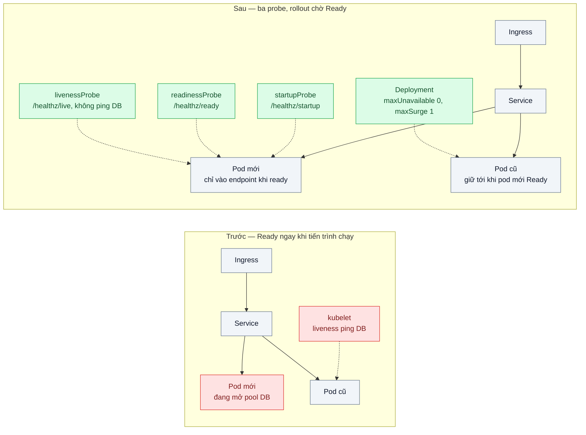
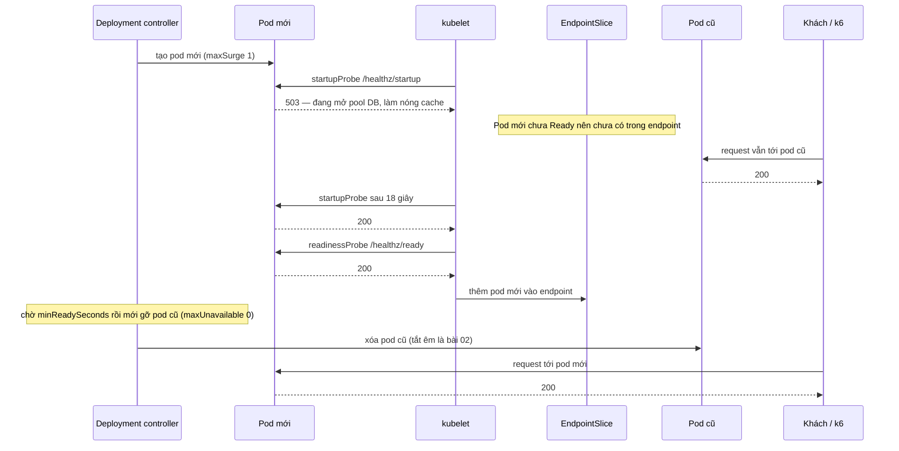

# Health Probes & Rolling Update — Pod mới nhận traffic khi chưa kết nối DB xong, lỗi 502 mỗi lần deploy

| Scope | Mức độ | Trạng thái | Pattern gốc | Cập nhật |
|---|---|---|---|---|
| 16 · backend / k8s | 🟢 Cơ bản | 📋 Kế hoạch | Liveness / Readiness / Startup Probes, Rolling Update — Kubernetes docs; Health Endpoint Monitoring — Microsoft Azure Architecture Center | 2026-10-06 |

> **Một câu tóm tắt:** Tách ba câu hỏi "đã khởi động xong chưa", "có nên nhận traffic không", "tiến trình có bị kẹt không" thành startup, readiness và liveness probe riêng, rồi cấu hình rolling update chỉ gỡ pod cũ khi pod mới đã thật sự sẵn sàng.

## 1. Bài toán thực tế (What)

**Bối cảnh** *(doanh nghiệp giả định, số liệu minh họa)*
Một ví điện tử chạy API NestJS 6 replica trên Kubernetes, deploy 5–8 lần mỗi ngày. Mỗi pod cần khoảng 20 giây để khởi động: mở pool kết nối PostgreSQL, nạp cấu hình và cờ tính năng, làm nóng cache tỷ giá. Deployment không có readiness probe; liveness probe gọi `/health`, endpoint này ping cả DB.

**Triệu chứng người kinh doanh nhìn thấy**
- Mỗi lần deploy, khoảng 1–2% giao dịch nạp tiền lỗi 502 trong gần một phút; khách thấy "giao dịch thất bại" và gọi tổng đài.
- Đội kỹ thuật ngại deploy giờ hành chính, dồn release vào ban đêm, sửa lỗi chậm hơn.
- Một lần DB failover 20 giây làm toàn bộ pod bị khởi động lại liên tục; sự cố kéo dài 10 phút thay vì 20 giây.

**Nguyên nhân kỹ thuật**
Không có readiness probe, Kubernetes coi container là Ready ngay khi tiến trình chạy, đưa pod vào endpoint của Service, ingress gửi request tới khi app chưa lắng nghe cổng hoặc chưa có kết nối DB. Rolling update mặc định (`maxUnavailable` 25%) gỡ pod cũ theo nhịp pod mới "Ready" giả, nên công suất thật bị hụt. Liveness gắn với DB biến sự cố của một phụ thuộc thành vòng khởi động lại của cả đội pod.

**Ràng buộc**
- Không đổi luồng CI/CD; vẫn dùng `Deployment` chuẩn (canary là bài 06).
- Thời gian khởi động thay đổi theo kích thước cache (15–60 giây), không đoán trước được.
- DB có thể failover vài chục giây; API phải tự hồi phục, không bị Kubernetes "giết" vì lỗi của DB.

## 2. Vì sao dùng pattern này (Why)

**Nguyên nhân gốc mà pattern nhắm vào:** Kubernetes không biết app đã sẵn sàng hay chưa, và đang được trả lời sai câu hỏi về sức khỏe.

**Pattern giải quyết thế nào:** Kubernetes có ba loại probe với hệ quả khác nhau. *Startup probe* chạy trước; khi chưa thành công, hai probe kia chưa chạy, nên app khởi động chậm không bị liveness giết oan (`failureThreshold × periodSeconds` là thời gian khởi động tối đa). *Readiness probe* thất bại thì pod bị gỡ khỏi endpoint của Service nhưng không bị khởi động lại. *Liveness probe* thất bại thì kubelet khởi động lại container, nên chỉ được kiểm tra trạng thái nội tại của tiến trình. Rolling update với `maxUnavailable: 0`, `maxSurge: 1` và `minReadySeconds` buộc Deployment chỉ gỡ pod cũ sau khi pod mới đã Ready và giữ Ready đủ lâu; pod mới không bao giờ Ready thì rollout dừng ở `progressDeadlineSeconds`, pod cũ vẫn phục vụ. Health Endpoint Monitoring (Azure) là khung chung cho việc app tự công bố trạng thái qua endpoint.

**Lựa chọn khác đã cân nhắc**

| Lựa chọn | Giải quyết được gì | Vì sao không chọn (ở bài này) |
|---|---|---|
| Giữ nguyên + tối ưu nhỏ (`initialDelaySeconds` lớn, `sleep` trong entrypoint) | Bớt 502 khi khởi động nhanh hơn mức đoán | Đoán mò; khởi động chậm hơn mức đoán vẫn lỗi, nhanh hơn thì deploy chậm vô ích |
| Chiến lược `Recreate` hoặc deploy ban đêm | Không có hai phiên bản song song | Có downtime; né vấn đề chứ không giải quyết |
| Canary / blue-green (bài 06) | Giới hạn ảnh hưởng của bản lỗi | Mạnh hơn nhưng vẫn cần probe đúng làm nền |
| Ba probe đúng ngữ nghĩa + tham số rolling update — **chọn** | Pod chỉ nhận traffic khi sẵn sàng; sự cố DB không gây vòng restart | Rollout chậm hơn một chút; cần app công bố trạng thái chính xác |

## 3. Thiết kế hệ thống (How)

### 3.1 Kiến trúc trước và sau



### 3.2 Luồng chính — rolling update khi pod mới chưa sẵn sàng



### 3.3 Thành phần và trách nhiệm

| Thành phần | Trách nhiệm | Quyết định thiết kế đáng chú ý |
|---|---|---|
| `/healthz/startup` | Thành công khi đã khởi tạo xong: pool DB mở được lần đầu, cấu hình nạp xong, cache đã nóng | `failureThreshold × periodSeconds` = 90 giây, lớn hơn thời gian khởi động chậm nhất đã đo |
| `/healthz/ready` | Thành công khi đã khởi tạo và chưa vào trạng thái tắt | Không ping DB mỗi lần probe: một sự cố DB không được gỡ đồng loạt mọi pod khỏi endpoint |
| `/healthz/live` | Thành công nếu event loop còn phản hồi | Tuyệt đối không kiểm tra phụ thuộc bên ngoài |
| Trạng thái nội bộ `starting → ready → draining` | Một nguồn sự thật cho ba endpoint | `draining` được bật ở bài 02 khi nhận SIGTERM |
| `Deployment.strategy` | `maxUnavailable: 0`, `maxSurge: 1`, `minReadySeconds: 10`, `progressDeadlineSeconds: 300` | Bản lỗi không bao giờ Ready thì rollout dừng, không hụt công suất |
| Script k6 | Bắn tải đều trong lúc `kubectl rollout restart` | Open model để thấy lỗi thật, không bị che bởi client chờ |

### 3.4 Điểm dễ sai khi triển khai
- Liveness kiểm tra DB hoặc service khác → phụ thuộc chập chờn biến thành vòng restart toàn đội pod. Liveness chỉ hỏi "tiến trình còn sống không".
- Dùng chung một endpoint cho cả ba probe → mất ý nghĩa tách biệt; hoặc liveness quá chặt làm restart oan khi CPU cao.
- `timeoutSeconds` mặc định là 1 giây; khi pod bận, probe quá hạn bị tính là thất bại. Đặt timeout theo p99 thật của endpoint health, giữ endpoint thật nhẹ.
- Readiness ping DB với `failureThreshold` thấp → DB chậm một nhịp là mọi pod rời endpoint, ingress trả 503 toàn bộ. Xử lý lỗi phụ thuộc trong app (timeout, circuit breaker), không ở probe.
- Quên rằng readiness chỉ lo phía "pod mới"; request vẫn rớt ở phía "pod cũ bị tắt" nếu chưa làm graceful shutdown (bài 02). Hai bài phải đi cùng nhau.
- Đo bằng một lần `curl` sau deploy thay vì tải liên tục trong lúc deploy → không thấy lỗi.

## 4. Tech stack và tác động (Impact techstack)

| Lớp | Công nghệ chọn | Vì sao chọn | Thay thế tương đương |
|---|---|---|---|
| Cluster local | k3d (k3s trong Docker), kèm Traefik làm ingress | Dựng cluster nhiều node trong vài giây; có sẵn ingress để đo đường đi thật | kind + một ingress controller |
| Manifest | Kustomize (base + overlay `before` / `after`) | So hai cấu hình probe chỉ khác vài dòng | Helm |
| Ứng dụng | NestJS + `@nestjs/terminus`, TypeScript strict, Node 20 | Stack mặc định; Terminus có sẵn khung health check | Fastify + endpoint tự viết |
| Cơ sở dữ liệu | PostgreSQL 16 trong cluster | Tái hiện "chưa kết nối DB xong" và DB failover | — |
| Đo | k6 (`constant-arrival-rate`) chạy song song `kubectl rollout restart`; `kubectl get pods -w` | Thấy 5xx và restart trong lúc deploy | Fortio, vegeta |
| Test | Vitest cho logic trạng thái health; script bash cho kịch bản cluster | Test nhanh phần logic, kịch bản cluster chạy riêng | Jest |

**Thay đổi so với hệ thống hiện tại:** thêm ba endpoint health và trạng thái nội bộ trong app, sửa manifest Deployment (probe, strategy). Đội vận hành học đọc `kubectl describe pod` (sự kiện probe thất bại) và `kubectl rollout status`.

## 5. Kết quả đầu ra và cách đo (Output impact)

| Chỉ số | Trước (minh họa) | Mục tiêu khi thực hành | Cách đo |
|---|---|---|---|
| Tỷ lệ request lỗi trong một lần rollout 6 replica | 1–2% | 0% (chưa tính phía pod cũ — bài 02) | k6 200 req/s trong lúc `kubectl rollout restart`, `http_req_failed` |
| p99 trong lúc rollout | 4 giây | < 1,5 lần p99 lúc ổn định | k6 `http_req_duration` p99, so với lượt không deploy |
| Thời gian rollout hoàn tất | — | Ghi nhận (dài hơn do `maxUnavailable: 0`) | `time kubectl rollout status deployment/api` |
| Số lần restart pod khi DB gián đoạn 20 giây | 6 pod × nhiều lần | 0 | `kubectl get pods` cột RESTARTS trước và sau khi dừng PostgreSQL 20 giây |
| Công suất khi deploy bản không bao giờ Ready | Hụt dần tới 0 | Giữ đủ 6 pod cũ, rollout dừng | `kubectl rollout status` báo quá `progressDeadlineSeconds`, k6 không lỗi |

> Số "trước" là minh họa để hình dung bài toán. Số "mục tiêu" chỉ được coi là đạt khi có số đo thật
> ở mục 8 kèm môi trường đo.

**Tác động nghiệp vụ mong đợi:** deploy giờ hành chính không còn làm khách thấy giao dịch lỗi; sự cố DB ngắn không bị khuếch đại thành sự cố dài; đội kỹ thuật release thường xuyên hơn.

## 6. Đánh đổi và khi KHÔNG nên dùng

**Đánh đổi**
- Rollout chậm hơn vì chờ pod mới Ready và `minReadySeconds`; `maxSurge` cần thêm tài nguyên tạm thời.
- App phải duy trì trạng thái health chính xác; endpoint health sai còn nguy hiểm hơn không có. Probe định kỳ cũng thêm tải và log cần lọc.

**Không nên dùng khi**
- Job chạy một lần (`Job`, `CronJob`) không nhận traffic: readiness vô nghĩa, chỉ cần xử lý thoát đúng mã.
- Đặt liveness cho app không có trạng thái "kẹt" nào mà restart sửa được: liveness thừa chỉ thêm rủi ro restart oan.
- Không bao giờ kiểm tra phụ thuộc chung (DB, cache) trong liveness, và cân nhắc kỹ trước khi đưa vào readiness.

**Liên quan**
- [../02-graceful-shutdown-prestop-deploy-lam-rot-request-dang-xu-ly/](../02-graceful-shutdown-prestop-deploy-lam-rot-request-dang-xu-ly/) — nửa còn lại của "deploy không rớt request".
- [../06-canary-blue-green-argo-rollouts-release-loi-anh-huong-100-phan-tram/](../06-canary-blue-green-argo-rollouts-release-loi-anh-huong-100-phan-tram/) — giới hạn ảnh hưởng của bản lỗi, dựa trên probe.
- [../../17-backend-docker/06-healthcheck-depends-on-app-khoi-dong-truoc-db-san-sang/](../../17-backend-docker/06-healthcheck-depends-on-app-khoi-dong-truoc-db-san-sang/) — cùng vấn đề ở Docker Compose.
- [../../07-backend-microservices/03-circuit-breaker-service-khuyen-mai-cham-lam-sap-checkout/](../../07-backend-microservices/03-circuit-breaker-service-khuyen-mai-cham-lam-sap-checkout/) — xử lý phụ thuộc lỗi trong app thay vì trong probe.

## 7. Cơ sở tham khảo

- Kubernetes docs, "Configure Liveness, Readiness and Startup Probes" — https://kubernetes.io/docs/tasks/configure-pod-container/configure-liveness-readiness-startup-probes/ — ngữ nghĩa ba probe, tham số và giá trị mặc định.
- Kubernetes docs, "Deployments" — https://kubernetes.io/docs/concepts/workloads/controllers/deployment/ — `maxSurge`, `maxUnavailable`, `minReadySeconds`, `progressDeadlineSeconds`, `kubectl rollout`.
- Kubernetes docs, "Pod Lifecycle" — https://kubernetes.io/docs/concepts/workloads/pods/pod-lifecycle/ — điều kiện Ready và quan hệ với endpoint của Service.
- Microsoft Azure Architecture Center, "Health Endpoint Monitoring pattern" — https://learn.microsoft.com/azure/architecture/patterns/health-endpoint-monitoring — app công bố trạng thái qua endpoint, điều cần và không cần kiểm tra.
- NestJS docs, "Health checks (Terminus)" — https://docs.nestjs.com/recipes/terminus — thư viện dùng ở mục 4.
- Ibryam & Huß, *Kubernetes Patterns*, 2nd ed. (O'Reilly, 2023), "Health Probe" (cần xác minh tên chương) — pattern ở góc nhìn thiết kế ứng dụng cloud-native.

## 8. Kế hoạch thực hành

- [ ] Bước 1: k3d cluster 3 node; PostgreSQL trong cluster; API NestJS có độ trễ khởi động cấu hình được (`STARTUP_DELAY_MS`), overlay `before` không readiness, liveness ping DB.
- [ ] Bước 2: Đo "trước": k6 200 req/s qua ingress trong lúc `kubectl rollout restart`; dừng PostgreSQL 20 giây và đếm restart.
- [ ] Bước 3: Áp dụng pattern: ba endpoint health theo trạng thái nội bộ, overlay `after` với ba probe và strategy mới.
- [ ] Bước 4: Đo "sau" cùng kịch bản 3 lần, thêm kịch bản image không bao giờ Ready; ghi vào mục 5 kèm môi trường (máy, phiên bản k3d/k3s, số node).
- [ ] Bước 5: Test: `/healthz/ready` trả 503 khi `starting` và `draining`; `/healthz/live` vẫn 200 khi DB mất; kịch bản cluster xác nhận 0 request lỗi phía pod mới.

**Cấu trúc code dự kiến**
```text
src/
  health/health-state.ts          # starting → ready → draining
  health/health.controller.ts     # /healthz/startup, /ready, /live
  main.ts                         # khởi tạo pool, nạp cấu hình, đổi trạng thái
k8s/
  base/                           # deployment, service, ingress, postgres
  overlays/before/                # không readiness, liveness ping DB
  overlays/after/                 # ba probe, maxUnavailable 0
bench/rollout-traffic.k6.js
scripts/run-rollout-scenario.sh
test/health-state.test.ts
```

**Cách chạy** *(điền khi bắt đầu code)*
```bash
k3d cluster create probes --agents 2
kubectl apply -k k8s/overlays/after
pnpm install && pnpm test
k6 run bench/rollout-traffic.k6.js & kubectl rollout restart deployment/api
```
