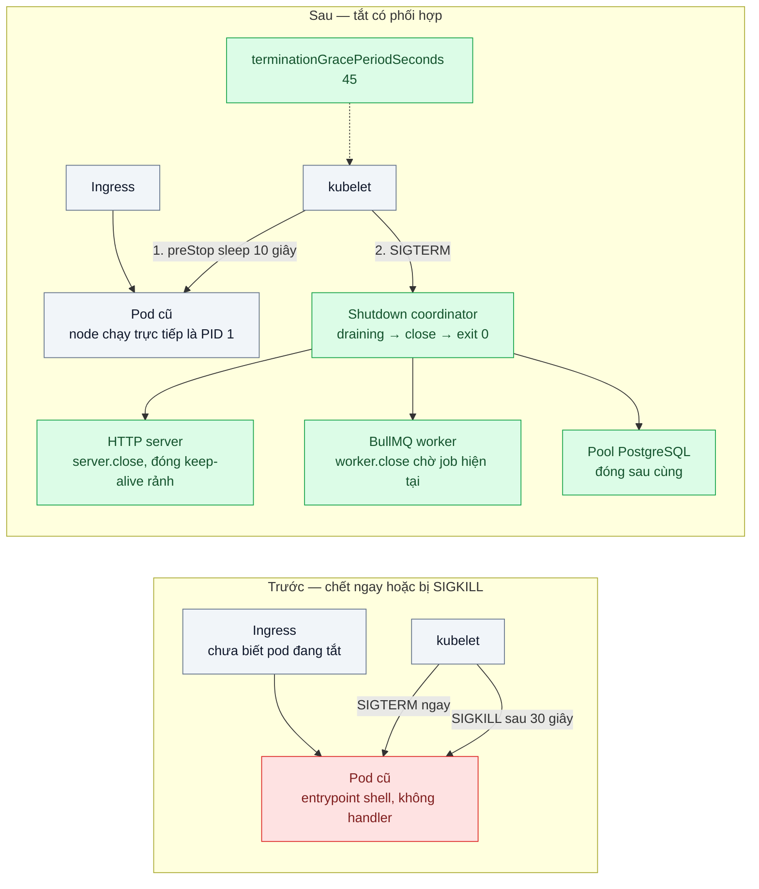
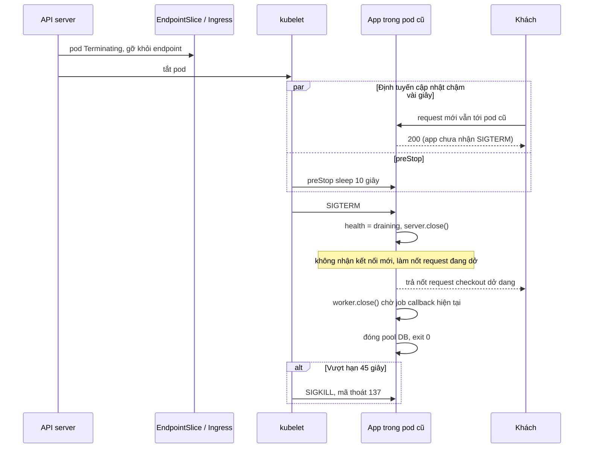

# Graceful Shutdown (SIGTERM, preStop, terminationGracePeriod) — Mỗi lần deploy rớt vài chục request đang xử lý

| Scope | Mức độ | Trạng thái | Pattern gốc | Cập nhật |
|---|---|---|---|---|
| 16 · backend / k8s | 🟢 Cơ bản | 📋 Kế hoạch | Pod termination & Container Lifecycle Hooks — Kubernetes docs "Pod Lifecycle"; Disposability — Adam Wiggins, *The Twelve-Factor App* (2011); Node.js docs (signals) | 2026-10-06 |

> **Một câu tóm tắt:** Khi pod bị tắt, chờ một nhịp để ingress ngừng gửi request mới (preStop), rồi app nhận SIGTERM, ngừng nhận kết nối mới, làm nốt request và job đang dở trong hạn `terminationGracePeriodSeconds`, đóng tài nguyên và thoát mã 0 — thay vì chết ngay giữa chừng.

## 1. Bài toán thực tế (What)

**Bối cảnh** *(doanh nghiệp giả định, số liệu minh họa)*
Một sàn TMĐT chạy API checkout NestJS 8 replica và một deployment worker BullMQ xử lý callback của cổng thanh toán, deploy khoảng 10 lần mỗi ngày. Bài 01 đã thêm probe nên pod mới chỉ nhận traffic khi sẵn sàng, nhưng lỗi vẫn còn ở phía pod cũ bị tắt.

**Triệu chứng người kinh doanh nhìn thấy**
- Mỗi lần deploy có khoảng 30–50 request checkout lỗi 502 hoặc mất kết nối; một phần khách bấm lại và lo bị trừ tiền hai lần.
- Vài đơn kẹt ở trạng thái "đang thanh toán" vì worker bị tắt giữa lúc xử lý callback; bộ phận đối soát phải sửa tay.
- Đội kỹ thuật thấy pod cũ luôn "chết" đúng 30 giây sau lệnh tắt và không hiểu vì sao.

**Nguyên nhân kỹ thuật**
Khi pod bị xóa, Kubernetes gỡ pod khỏi endpoint *song song* với việc gửi SIGTERM; ingress và kube-proxy cập nhật chậm vài giây nên vẫn gửi request mới tới pod đang tắt. Trong khi đó app hoặc thoát ngay khi nhận SIGTERM (Node không có handler thì mặc định kết thúc tiến trình), cắt mọi request đang dở; hoặc không nhận được SIGTERM vì entrypoint dạng shell không chuyển tiếp tín hiệu, nên bị SIGKILL sau 30 giây mặc định. Worker bị cắt giữa job.

**Ràng buộc**
- Request checkout dài nhất khoảng 15 giây (gọi cổng thanh toán); job callback dài nhất khoảng 20 giây.
- Image chạy distroless, không có shell (scope 17 bài 04).
- Không dựa vào retry ở ingress cho `POST` vì có nguy cơ trừ tiền hai lần.

## 2. Vì sao dùng pattern này (Why)

**Nguyên nhân gốc mà pattern nhắm vào:** tiến trình kết thúc không phối hợp với việc gỡ khỏi định tuyến và không tôn trọng công việc đang dở.

**Pattern giải quyết thế nào:** Kubernetes mô tả trình tự tắt pod: pod chuyển sang Terminating và bị gỡ khỏi endpoint; hook `preStop` chạy; xong hook thì container nhận SIGTERM; nếu chưa thoát sau `terminationGracePeriodSeconds` (mặc định 30 giây, tính từ lúc bắt đầu tắt, gồm cả thời gian `preStop`) thì bị SIGKILL. Twelve-Factor gọi đặc tính này là *Disposability*: khởi động nhanh, tắt êm khi nhận SIGTERM. Áp vào đây: `preStop` chờ vài giây để định tuyến kịp cập nhật; handler SIGTERM chuyển health sang `draining`, gọi `server.close()` để ngừng nhận kết nối mới, chờ request đang dở với hạn chót, đóng kết nối keep-alive rảnh, gọi `worker.close()` để worker làm nốt job hiện tại, đóng pool DB rồi thoát mã 0.

**Lựa chọn khác đã cân nhắc**

| Lựa chọn | Giải quyết được gì | Vì sao không chọn (ở bài này) |
|---|---|---|
| Giữ nguyên + tối ưu nhỏ (tăng `terminationGracePeriodSeconds`) | Không gì, nếu app thoát ngay hoặc không nhận tín hiệu | Kéo dài thời gian chờ SIGKILL, request vẫn bị cắt |
| Retry ở ingress khi upstream lỗi | Che lỗi cho request `GET` idempotent | Nguy hiểm với `POST` thanh toán nếu chưa có idempotency key; che bệnh chứ không chữa |
| Service mesh có cơ chế drain kết nối | Drain ở tầng proxy | Quá nặng cho vấn đề nằm trong app |
| preStop + xử lý SIGTERM + grace period đủ dài — **chọn** | Không request mới tới pod đang tắt, request và job dở được làm xong | Deploy chậm hơn vài giây mỗi pod; app phải viết đúng thứ tự tắt |

## 3. Thiết kế hệ thống (How)

### 3.1 Kiến trúc trước và sau



### 3.2 Luồng chính — pod bị tắt trong rolling update



### 3.3 Thành phần và trách nhiệm

| Thành phần | Trách nhiệm | Quyết định thiết kế đáng chú ý |
|---|---|---|
| `lifecycle.preStop` | Trì hoãn SIGTERM để định tuyến kịp gỡ pod | Image distroless không có lệnh `sleep`: dùng hành động `sleep` gốc của Kubernetes ở phiên bản hỗ trợ (cần xác minh phiên bản), hoặc tự trì hoãn trong handler |
| `ShutdownCoordinator` | Một nơi điều phối thứ tự tắt: draining → HTTP → worker → DB → exit | Có hạn chót nội bộ ngắn hơn grace period để kịp ghi log trước khi bị SIGKILL |
| HTTP server | `server.close()` ngừng nhận kết nối mới; đóng keep-alive rảnh; trả `Connection: close` khi draining | Kết nối dài (SSE, WebSocket) được báo đóng để client tự nối lại sang pod khác |
| BullMQ worker | `worker.close()` dừng lấy job mới, chờ job đang chạy | Job phải idempotent vì vẫn có trường hợp bị SIGKILL và chạy lại |
| `terminationGracePeriodSeconds: 45` | Hạn tổng cho preStop + làm nốt việc | ≥ preStop 10 giây + request dài nhất 15 giây + job dài nhất 20 giây |
| Entrypoint | `node dist/main.js` dạng exec, node là PID 1 hoặc chạy sau `tini` | Không dùng `npm start` hay dạng shell (scope 17 bài 03) |

### 3.4 Điểm dễ sai khi triển khai
- Entrypoint dạng shell → SIGTERM không tới node, mọi công sức xử lý tín hiệu vô ích. Kiểm tra mã thoát: 137 là bị SIGKILL.
- Gọi `process.exit()` ngay trong handler SIGTERM → cắt request đang dở, y như không có handler.
- Grace period ngắn hơn preStop + thời gian làm nốt → bị SIGKILL giữa chừng. Nhớ rằng đồng hồ grace period chạy cả trong lúc preStop.
- `server.close()` không bao giờ xong vì còn kết nối keep-alive hoặc SSE → cần đóng kết nối rảnh và có hạn chót.
- Thử bằng `kubectl delete pod --grace-period=0 --force` rồi kết luận "vẫn rớt": lệnh đó là giết ngay, không phải tắt êm.

## 4. Tech stack và tác động (Impact techstack)

| Lớp | Công nghệ chọn | Vì sao chọn | Thay thế tương đương |
|---|---|---|---|
| Cluster local | k3d với Traefik làm ingress | Cùng môi trường bài 01; có ingress thật để thấy độ trễ cập nhật endpoint | kind + ingress controller |
| Ứng dụng | NestJS (`enableShutdownHooks`, `beforeApplicationShutdown`), TypeScript strict, Node 20 | Lifecycle hook có sẵn; Node 18.2+ có `server.closeIdleConnections()` | Fastify (`fastify.close()`) |
| Worker | BullMQ trên Redis 7 | `worker.close()` chờ job đang chạy | PGMQ consumer tự viết vòng lặp dừng |
| Manifest | Kustomize overlay `before` / `after` | So cấu hình tắt chỉ khác vài dòng | Helm |
| Đo | k6 (`POST /checkout` kèm idempotency key) trong lúc `kubectl rollout restart`; `kubectl get pod -o jsonpath` lấy mã thoát | Thấy request rớt, kết nối reset, mã 137 | vegeta |

**Thay đổi so với hệ thống hiện tại:** sửa entrypoint image, thêm coordinator tắt trong app và worker, thêm `preStop` và grace period vào manifest. Đội vận hành học đọc mã thoát container và sự kiện `Killing` trong `kubectl describe pod`.

## 5. Kết quả đầu ra và cách đo (Output impact)

| Chỉ số | Trước (minh họa) | Mục tiêu khi thực hành | Cách đo |
|---|---|---|---|
| Request lỗi mỗi lần rollout 8 replica ở 300 req/s | 30–50 | 0 | k6 trong lúc `kubectl rollout restart`, đếm `http_req_failed` theo mã (502, 0 = reset) |
| Job callback bị bỏ dở do tắt pod | Vài job mỗi lần deploy | 0 job mất; số job chạy lại được ghi nhận | So số job vào hàng đợi với số đơn đạt trạng thái cuối sau rollout |
| Mã thoát container cũ | 137 (SIGKILL) | 0 | `kubectl get pod -o jsonpath='{..lastState.terminated.exitCode}'` hoặc sự kiện của pod |
| Thời gian từ lệnh tắt tới khi pod biến mất | 30 giây | ≈ preStop + thời gian làm nốt, < 30 giây | `kubectl get pods -w` kèm timestamp |
| Request mới tới pod sau khi đã SIGTERM | Có | 0 | Log app: request nhận được khi trạng thái `draining` |

> Số "trước" là minh họa để hình dung bài toán. Số "mục tiêu" chỉ được coi là đạt khi có số đo thật
> ở mục 8 kèm môi trường đo.

**Tác động nghiệp vụ mong đợi:** deploy không còn làm khách thấy lỗi thanh toán, không còn đơn kẹt cần đối soát tay; kết hợp bài 01, deploy giờ hành chính trở thành việc bình thường.

## 6. Đánh đổi và khi KHÔNG nên dùng

**Đánh đổi**
- Mỗi pod tắt chậm hơn thêm thời gian preStop; rollout của nhiều replica dài hơn.
- Grace period dài làm việc rút node (bài 07) và scale down chậm hơn.
- Phải duy trì thứ tự tắt đúng khi app thêm tài nguyên mới (kết nối Kafka, cron nội bộ...).

**Không nên dùng khi**
- Pod không nhận traffic và không có việc dở (job tính toán chạy lại được từ đầu rẻ): tắt nhanh đơn giản hơn.
- Job dài hơn mọi grace period hợp lý (vài giờ): đừng kéo grace period theo job; thiết kế job có checkpoint, idempotent, hoặc dùng `Job` riêng.
- Không có ingress hay Service trước pod (worker thuần): preStop sleep là thừa, chỉ cần xử lý SIGTERM.

**Liên quan**
- [../01-probes-rolling-update-deploy-moi-nhan-traffic-khi-chua-san-sang/](../01-probes-rolling-update-deploy-moi-nhan-traffic-khi-chua-san-sang/) — nửa "pod mới" của deploy không rớt request.
- [../09-keda-scale-worker-theo-do-dai-hang-doi/](../09-keda-scale-worker-theo-do-dai-hang-doi/) — scale down worker cũng là tắt pod.
- [../../17-backend-docker/03-pid-1-signal-sigterm-container-khong-tat-sach/](../../17-backend-docker/03-pid-1-signal-sigterm-container-khong-tat-sach/) — điều kiện để SIGTERM tới được app.
- [../../14-backend-queueing/04-idempotent-consumer-event-den-hai-lan-tru-kho-hai-lan/](../../14-backend-queueing/04-idempotent-consumer-event-den-hai-lan-tru-kho-hai-lan/) — job chạy lại không gây hậu quả kép.
- [../../06-frontend-backend-realtime/03-reconnect-resume-mat-mang-10-giay-mat-thong-bao/](../../06-frontend-backend-realtime/03-reconnect-resume-mat-mang-10-giay-mat-thong-bao/) — client nối lại khi kết nối dài bị đóng.

## 7. Cơ sở tham khảo

- Kubernetes docs, "Pod Lifecycle — Termination of Pods" — https://kubernetes.io/docs/concepts/workloads/pods/pod-lifecycle/#pod-termination — trình tự Terminating, preStop, SIGTERM, grace period, SIGKILL.
- Kubernetes docs, "Container Lifecycle Hooks" — https://kubernetes.io/docs/concepts/containers/container-lifecycle-hooks/ — ngữ nghĩa `preStop` và các loại handler.
- Adam Wiggins, *The Twelve-Factor App* (2011), "IX. Disposability" — https://12factor.net/disposability — tắt êm khi nhận SIGTERM, worker trả job về hàng đợi.
- Node.js docs, "Process — Signal events" và "HTTP — server.close(), server.closeIdleConnections()" — https://nodejs.org/api/process.html, https://nodejs.org/api/http.html — hành vi mặc định khi nhận SIGTERM và cách ngừng nhận kết nối.
- NestJS docs, "Lifecycle events" — https://docs.nestjs.com/fundamentals/lifecycle-events — `enableShutdownHooks` và thứ tự hook khi tắt.
- BullMQ docs — https://docs.bullmq.io/ — `worker.close()` và xử lý job stalled khi worker chết (cần xác minh trang "graceful shutdown").

## 8. Kế hoạch thực hành

- [ ] Bước 1: Dùng lại cluster bài 01; overlay `before` với entrypoint `npm start`, không handler SIGTERM, không preStop; endpoint `/checkout` có độ trễ 0–15 giây và worker job 0–20 giây.
- [ ] Bước 2: Đo "trước": k6 300 req/s trong lúc `kubectl rollout restart` cho cả API và worker; ghi request lỗi, mã thoát, job dở.
- [ ] Bước 3: Áp dụng pattern: entrypoint exec, `ShutdownCoordinator`, preStop, grace period 45 giây.
- [ ] Bước 4: Đo "sau" cùng kịch bản 3 lần; ghi vào mục 5 kèm môi trường.
- [ ] Bước 5: Test: gửi SIGTERM khi đang có request dài thì request vẫn trả 200; sau SIGTERM kết nối mới bị từ chối; worker hoàn tất job đang chạy rồi mới thoát; quá hạn nội bộ thì thoát với log cảnh báo.

**Cấu trúc code dự kiến**
```text
src/
  shutdown/shutdown-coordinator.ts   # draining → HTTP → worker → DB → exit
  checkout/checkout.controller.ts    # request dài có cấu hình độ trễ
  worker/payment-callback.worker.ts
  main.ts
k8s/overlays/before/                 # npm start, không preStop
k8s/overlays/after/                  # exec entrypoint, preStop, grace 45 giây
bench/rollout-checkout.k6.js
test/shutdown-coordinator.test.ts
```

**Cách chạy** *(điền khi bắt đầu code)*
```bash
kubectl apply -k k8s/overlays/after
pnpm install && pnpm test
k6 run bench/rollout-checkout.k6.js & kubectl rollout restart deployment/api deployment/worker
```
