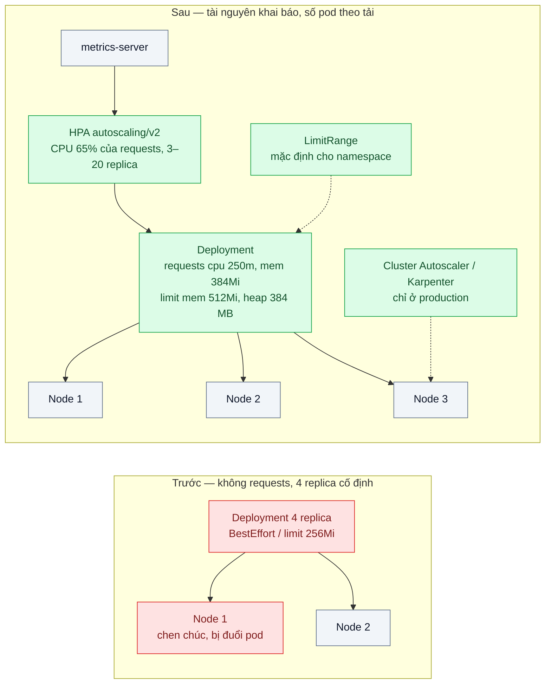
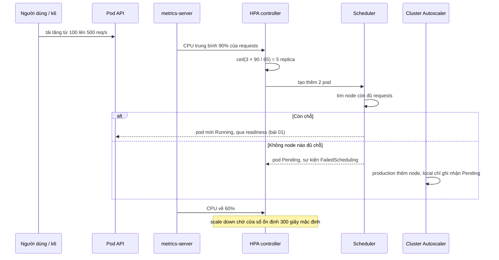

# Resource Requests/Limits & HPA — 9h sáng traffic gấp 5, pod OOMKilled hoặc node hết chỗ

| Scope | Mức độ | Trạng thái | Pattern gốc | Cập nhật |
|---|---|---|---|---|
| 16 · backend / k8s | 🟡 Trung bình | 📋 Kế hoạch | Resource Management for Pods and Containers, Horizontal Pod Autoscaling — Kubernetes docs | 2026-10-06 |

> **Một câu tóm tắt:** Đo mức dùng thật rồi khai báo requests (để scheduler xếp chỗ đúng) và limits (để một pod không nuốt cả node), căn heap Node theo memory limit, và để HPA thêm bớt replica theo mức dùng CPU so với requests thay vì cố định số pod.

## 1. Bài toán thực tế (What)

**Bối cảnh** *(doanh nghiệp giả định, số liệu minh họa)*
Một SaaS B2B quản lý khách hàng (CRM) có nhân viên kinh doanh của 300 công ty cùng đăng nhập từ 8h30 đến 9h30; traffic lúc đó gấp 5 lần buổi tối. API NestJS chạy cố định 4 replica trên cluster 3 node. Manifest không khai báo requests; một số deployment chép `limits.memory: 256Mi` từ mẫu cũ.

**Triệu chứng người kinh doanh nhìn thấy**
- Đầu giờ sáng, màn hình danh sách khách hàng chậm hẳn, thỉnh thoảng lỗi; đội sales than "CRM sáng nào cũng đơ".
- Pod API bị khởi động lại vài lần mỗi sáng; có hôm một node hết RAM, cả Redis chung node bị đẩy ra theo.
- Ban đêm 4 replica gần như không làm gì, nhưng tăng cố định lên 12 replica cho giờ cao điểm thì tốn tiền gấp ba cả ngày.

**Nguyên nhân kỹ thuật**
Không có requests, scheduler xếp pod theo cảm tính, không biết node nào thật sự còn chỗ; pod thuộc lớp QoS BestEffort bị đuổi đầu tiên khi node thiếu bộ nhớ. Memory limit 256Mi thấp hơn mức heap thực khi tải cao nên tiến trình bị OOMKilled. Số replica cố định không phản ứng với tải; khi cần thêm pod thì không còn node trống.

**Ràng buộc**
- Không đổi code nghiệp vụ; chỉ thay đổi khai báo tài nguyên, cấu hình runtime và autoscaling.
- Luôn giữ tối thiểu 3 replica cho tính sẵn sàng.
- Production có thể thêm node tự động; môi trường local thì không — phải thấy được trạng thái Pending.

## 2. Vì sao dùng pattern này (Why)

**Nguyên nhân gốc mà pattern nhắm vào:** Kubernetes không được cho biết mỗi pod cần bao nhiêu tài nguyên, và số pod không gắn với tải.

**Pattern giải quyết thế nào:** *Requests* là lượng tài nguyên scheduler đảm bảo khi xếp pod lên node; *limits* là trần: vượt memory limit thì container bị OOMKilled, chạm CPU limit thì bị bóp (throttling). Từ requests và limits, pod được xếp lớp QoS (Guaranteed, Burstable, BestEffort), quyết định thứ tự bị đuổi khi node thiếu tài nguyên. HPA (`autoscaling/v2`) định kỳ (mặc định 15 giây) so mức dùng thực với mục tiêu và tính số replica theo công thức `ceil(currentReplicas × currentMetricValue / desiredMetricValue)`; mức dùng CPU tính theo phần trăm của requests, nên không có requests thì HPA không tính được. Trường `behavior` cho phép scale lên nhanh, scale xuống chậm.

**Lựa chọn khác đã cân nhắc**

| Lựa chọn | Giải quyết được gì | Vì sao không chọn (ở bài này) |
|---|---|---|
| Giữ nguyên + tối ưu nhỏ (cố định 12 replica) | Đủ công suất giờ cao điểm | Lãng phí phần lớn thời gian; vẫn OOMKilled nếu limit sai |
| Vertical Pod Autoscaler | Gợi ý hoặc tự chỉnh requests | Áp thay đổi thường cần tạo lại pod; không nên dùng chung với HPA trên cùng chỉ số CPU. Dùng chế độ chỉ gợi ý làm đầu vào |
| HPA theo request/giây qua Prometheus Adapter | Bám sát tải HTTP hơn CPU | Thêm thành phần; CPU đủ tốt với API thiên về CPU. Để dành khi CPU không phản ánh tải |
| Requests/limits theo số đo + HPA theo CPU — **chọn** | Xếp chỗ đúng, không OOM, số pod theo tải | Phải đo và hiệu chỉnh định kỳ; vẫn cần node đủ chỗ |

## 3. Thiết kế hệ thống (How)

### 3.1 Kiến trúc trước và sau



### 3.2 Luồng chính — tải tăng gấp 5 lúc 9h



### 3.3 Thành phần và trách nhiệm

| Thành phần | Trách nhiệm | Quyết định thiết kế đáng chú ý |
|---|---|---|
| `resources.requests` | Đảm bảo chỗ khi xếp pod; mẫu số cho phần trăm CPU của HPA | Đặt quanh p95 mức dùng lúc tải bình thường, đo bằng `kubectl top` và Prometheus |
| `resources.limits.memory` | Trần bộ nhớ, tránh một pod nuốt node | Bằng hoặc hơi cao hơn requests; heap Node đặt bằng `--max-old-space-size` khoảng 75% limit |
| CPU limit | Trần CPU | Cân nhắc không đặt hoặc đặt rộng để tránh throttling; đánh đổi là pod "ồn ào" ảnh hưởng hàng xóm |
| HPA | Thêm/bớt replica theo CPU | `minReplicas: 3`, `maxReplicas: 20`; scale lên nhanh, scale xuống chậm |
| `LimitRange` / `ResourceQuota` | Mặc định và trần cho namespace | Deployment quên khai báo vẫn có requests hợp lý |

### 3.4 Điểm dễ sai khi triển khai
- Không đặt requests rồi bật HPA theo CPU → HPA báo không tính được mức dùng.
- Memory limit thấp hơn heap mặc định của Node → OOMKilled dưới tải. Căn heap theo limit, chừa phần cho buffer và bộ nhớ ngoài heap.
- CPU limit chặt làm p99 tăng do throttling dù CPU node còn trống; kiểm tra chỉ số throttling trước khi kết luận "thiếu CPU".
- Requests đặt theo lúc nhàn rỗi → node bị xếp quá dày, đến giờ cao điểm cùng tranh tài nguyên.
- HPA scale lên nhưng không có node trống → pod Pending mãi; HPA không thêm node, cần Cluster Autoscaler hoặc dư địa sẵn.

## 4. Tech stack và tác động (Impact techstack)

| Lớp | Công nghệ chọn | Vì sao chọn | Thay thế tương đương |
|---|---|---|---|
| Cluster local | k3d 3 node, giới hạn bộ nhớ mỗi node (cần xác minh cờ của k3d) | k3s đi kèm metrics-server nên HPA chạy ngay; giới hạn node để tái hiện "node hết chỗ" | kind + cài metrics-server |
| Ứng dụng | NestJS, TypeScript strict, Node 20 với `NODE_OPTIONS=--max-old-space-size` | Stack mặc định; endpoint có thể chỉnh độ nặng CPU/bộ nhớ | Fastify |
| Autoscaling | HPA `autoscaling/v2` + metrics-server | Có sẵn trong Kubernetes, đủ cho API thiên về CPU | KEDA (bài 09), Prometheus Adapter |
| Node autoscaling | Cluster Autoscaler hoặc Karpenter (chỉ production) | HPA cần node trống để đặt pod mới | Dư địa sẵn bằng pod ưu tiên thấp |
| Quan sát | Prometheus + kube-state-metrics + cAdvisor (qua kubelet) | Chỉ số throttling, OOMKilled, replica theo thời gian | Grafana Cloud |
| Đo | k6 `ramping-arrival-rate` từ 100 lên 500 req/s trong 2 phút | Mô phỏng 9h sáng | vegeta |

**Thay đổi so với hệ thống hiện tại:** thêm khối `resources` cho mọi deployment, `LimitRange` cho namespace, HPA cho API, biến môi trường heap. Đội vận hành học đọc `kubectl top`, `kubectl describe hpa`, lý do `OOMKilled` và sự kiện `FailedScheduling`.

## 5. Kết quả đầu ra và cách đo (Output impact)

| Chỉ số | Trước (minh họa) | Mục tiêu khi thực hành | Cách đo |
|---|---|---|---|
| Số lần OOMKilled trong 30 phút tải cao điểm mô phỏng | 12 | 0 | `kubectl get pods` cột RESTARTS và `lastState.terminated.reason` |
| p95 latency ở tải gấp 5 | 2,5 giây | < 400 ms | k6 `http_req_duration` p95 |
| Tỷ lệ CPU bị throttling | Không đo | < 5% | PromQL `rate(container_cpu_cfs_throttled_periods_total[5m]) / rate(container_cpu_cfs_periods_total[5m])` |
| Thời gian từ lúc tải tăng tới khi đủ replica Ready | — | < 2 phút | `kubectl get hpa -w` và `kube_deployment_status_replicas_available` theo thời gian |
| Pod-giờ trong 24 giờ mô phỏng (đêm thấp, sáng cao) | 4 × 24 = 96 cố định, hoặc 288 nếu cố định 12 | Thấp hơn phương án cố định 12 mà vẫn đạt p95 | Tích phân `sum(kube_deployment_status_replicas)` trên Prometheus |

> Số "trước" là minh họa để hình dung bài toán. Số "mục tiêu" chỉ được coi là đạt khi có số đo thật
> ở mục 8 kèm môi trường đo.

**Tác động nghiệp vụ mong đợi:** CRM không còn "đơ" đầu giờ sáng, pod không còn bị giết giữa giờ làm việc, và chi phí hạ tầng đi theo tải thật thay vì theo đỉnh.

## 6. Đánh đổi và khi KHÔNG nên dùng

**Đánh đổi**
- Requests cao làm giảm số pod mỗi node (tốn tiền hơn); thấp quá thì quay lại chen chúc — cần hiệu chỉnh định kỳ.
- HPA phản ứng sau tải vài chục giây tới vài phút; đỉnh dốc hơn thế cần chính sách khác (scope 18 bài 08).
- Bỏ CPU limit tăng hiệu năng nhưng tăng rủi ro một pod ảnh hưởng pod khác trên cùng node.

**Không nên dùng khi**
- Tải gần như phẳng cả ngày: số replica cố định với requests đúng là đủ, HPA chỉ thêm biến động.
- Ứng dụng có trạng thái gắn với từng pod (session trong RAM): stateless hóa trước (scope 18 bài 01) rồi mới scale ngang.
- Worker xử lý hàng đợi mà CPU không phản ánh việc tồn: scale theo độ dài hàng đợi (bài 09).

**Liên quan**
- [../01-probes-rolling-update-deploy-moi-nhan-traffic-khi-chua-san-sang/](../01-probes-rolling-update-deploy-moi-nhan-traffic-khi-chua-san-sang/) — pod mới do HPA tạo chỉ nhận traffic khi Ready.
- [../07-pdb-anti-affinity-node-drain-lam-down-ca-service/](../07-pdb-anti-affinity-node-drain-lam-down-ca-service/) — rải replica qua node.
- [../09-keda-scale-worker-theo-do-dai-hang-doi/](../09-keda-scale-worker-theo-do-dai-hang-doi/) — autoscale theo sự kiện thay vì CPU.
- [../../18-backend-scale/08-autoscaling-policy-scale-cham-hon-traffic/](../../18-backend-scale/08-autoscaling-policy-scale-cham-hon-traffic/) — chọn chính sách scale khi đỉnh đến nhanh.
- [../../18-backend-scale/07-capacity-planning-use-method-mua-may-bao-nhieu-cho-tet/](../../18-backend-scale/07-capacity-planning-use-method-mua-may-bao-nhieu-cho-tet/) — từ số đo một pod tới số node cần mua.

## 7. Cơ sở tham khảo

- Kubernetes docs, "Resource Management for Pods and Containers" — https://kubernetes.io/docs/concepts/configuration/manage-resources-containers/ — ngữ nghĩa requests và limits, OOMKilled, throttling.
- Kubernetes docs, "Horizontal Pod Autoscaling" — https://kubernetes.io/docs/tasks/run-application/horizontal-pod-autoscale/ — công thức tính replica, chu kỳ đồng bộ, `behavior`, yêu cầu requests cho chỉ số phần trăm.
- Kubernetes docs, "Configure Quality of Service for Pods" — https://kubernetes.io/docs/tasks/configure-pod-container/quality-service-pod/ — ba lớp QoS.
- Kubernetes docs, "Node-pressure Eviction" — https://kubernetes.io/docs/concepts/scheduling-eviction/node-pressure-eviction/ — thứ tự đuổi pod khi node thiếu tài nguyên.
- Kubernetes docs, "Limit Ranges" — https://kubernetes.io/docs/concepts/policy/limit-range/ — mặc định tài nguyên cho namespace.
- Node.js docs, "Command-line options" (`--max-old-space-size`) — https://nodejs.org/api/cli.html — căn heap theo memory limit.

## 8. Kế hoạch thực hành

- [ ] Bước 1: k3d 3 node giới hạn bộ nhớ; API có endpoint tiêu CPU và bộ nhớ chỉnh được; overlay `before` không requests, limit 256Mi, 4 replica cố định.
- [ ] Bước 2: Đo "trước": k6 ramp 100 → 500 req/s, giữ 30 phút; ghi OOMKilled, p95, sự kiện đuổi pod.
- [ ] Bước 3: Đo mức dùng thật ở tải bình thường; áp dụng overlay `after`: requests/limits, heap, `LimitRange`, HPA với `behavior`.
- [ ] Bước 4: Đo "sau" cùng kịch bản, thêm kịch bản 24 giờ rút gọn (đêm thấp, sáng cao) để tính pod-giờ; ghi vào mục 5 kèm môi trường.
- [ ] Bước 5: Test (script kịch bản cluster): dưới tải gấp 5 không có pod OOMKilled; HPA đạt replica mong muốn trong 2 phút; khi giảm tải, replica không giảm trước cửa sổ ổn định; vượt sức chứa node thì xuất hiện sự kiện `FailedScheduling`.

**Cấu trúc code dự kiến**
```text
src/load-endpoints.ts           # endpoint tiêu CPU/bộ nhớ có tham số
k8s/
  overlays/before/              # không requests, limit 256Mi, 4 replica
  overlays/after/               # requests/limits, LimitRange, HPA
monitoring/prometheus-values.yaml
bench/morning-peak.k6.js
scripts/check-oomkilled.sh
```

**Cách chạy** *(điền khi bắt đầu code)*
```bash
k3d cluster create resources --agents 2
kubectl apply -k k8s/overlays/after
k6 run bench/morning-peak.k6.js & kubectl get hpa -w
```
