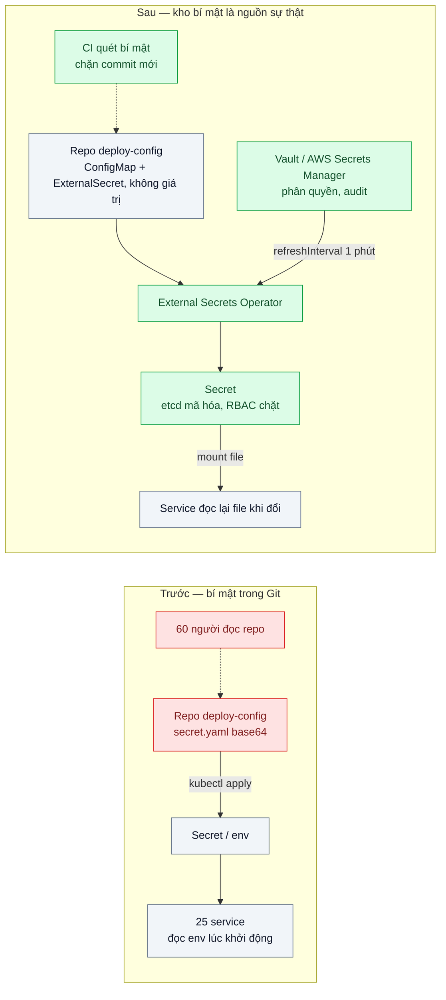
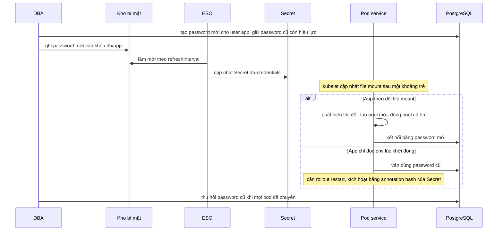

# ConfigMap, Secret & External Secrets — Password DB nằm trong YAML commit lên Git

| Scope | Mức độ | Trạng thái | Pattern gốc | Cập nhật |
|---|---|---|---|---|
| 16 · backend / k8s | 🟡 Trung bình | 📋 Kế hoạch | Secrets, ConfigMaps — Kubernetes docs; External Secrets Operator docs; Config — Adam Wiggins, *The Twelve-Factor App* (2011) | 2026-10-06 |

> **Một câu tóm tắt:** Cấu hình thường nằm trong ConfigMap và Git; bí mật không bao giờ vào Git mà nằm trong một kho bí mật có phân quyền và audit, được External Secrets Operator đồng bộ thành Secret của Kubernetes — nhờ vậy xoay password là sửa một chỗ, không phải sửa 25 file YAML.

## 1. Bài toán thực tế (What)

**Bối cảnh** *(doanh nghiệp giả định, số liệu minh họa)*
Một công ty bảo hiểm chạy 25 service trên Kubernetes, manifest nằm trong repo `deploy-config`. Password DB, API key cổng thanh toán và nhà cung cấp SMS nằm trong `secret.yaml` dạng base64, có chỗ ghi thẳng vào `env` của Deployment. Khoảng 60 người có quyền đọc repo, gồm cả nhân sự thuê ngoài.

**Triệu chứng người kinh doanh nhìn thấy**
- Đợt kiểm tra bảo mật phát hiện password production đọc được trong lịch sử Git; báo cáo xếp mức nghiêm trọng cao.
- Đổi password DB phải sửa 25 file, deploy lại toàn bộ, mất cả ngày và có lúc gián đoạn — nên 3 năm chưa đổi lần nào.
- Một kỹ sư thuê ngoài nghỉ việc; không ai chắc họ còn giữ bí mật nào và không có cách thu hồi nhanh.

**Nguyên nhân kỹ thuật**
Bí mật đi cùng cấu hình vào hệ thống quản lý phiên bản; base64 chỉ là mã hóa ký tự, không phải mã hóa bảo mật. Không có kho bí mật trung tâm nên không có phân quyền theo service, không có audit ai đọc gì, không có quy trình xoay. App đọc bí mật qua biến môi trường lúc khởi động nên mọi thay đổi đều cần deploy lại.

**Ràng buộc**
- Vẫn quản lý manifest bằng Git (chuẩn bị cho GitOps — bài 08).
- Xoay password DB không được gây lỗi request.
- Staging và production dùng bí mật khác nhau, người làm staging không đọc được bí mật production.

## 2. Vì sao dùng pattern này (Why)

**Nguyên nhân gốc mà pattern nhắm vào:** bí mật không có "nhà" riêng; nó được sao chép vào mọi nơi có cấu hình.

**Pattern giải quyết thế nào:** Twelve-Factor tách cấu hình khỏi code và để môi trường cung cấp. Kubernetes tách tiếp: ConfigMap cho cấu hình không nhạy cảm, Secret cho bí mật — nhưng docs nói rõ Secret mặc định chỉ được lưu không mã hóa trong etcd và cần bật mã hóa khi lưu, cộng RBAC chặt. External Secrets Operator (ESO) đưa nguồn sự thật ra ngoài cluster: `SecretStore` mô tả cách kết nối kho bí mật (Vault, AWS Secrets Manager...), `ExternalSecret` khai báo "lấy khóa nào, ghi vào Secret nào, làm mới mỗi bao lâu" (`refreshInterval`). File `ExternalSecret` không chứa giá trị nên commit vào Git an toàn. Xoay bí mật: đổi trong kho → ESO cập nhật Secret → app đọc lại file được mount.

**Lựa chọn khác đã cân nhắc**

| Lựa chọn | Giải quyết được gì | Vì sao không chọn (ở bài này) |
|---|---|---|
| Giữ nguyên + tối ưu nhỏ (repo private, giảm người đọc) | Giảm số người thấy bí mật mới | Lịch sử Git và bản clone trên máy cá nhân vẫn còn; không xoay, không audit |
| Sealed Secrets | Bí mật mã hóa được commit vào Git, controller giải mã trong cluster | Hợp GitOps nhưng xoay vẫn thủ công theo repo; không có audit truy cập tập trung |
| SOPS (age / KMS) | File mã hóa trong Git, giải mã lúc deploy | Tương tự: quyền và xoay vẫn xoay quanh repo |
| Secrets Store CSI Driver | Mount bí mật trực tiếp từ kho, không tạo Secret | Đáng cân nhắc; ESO tạo Secret chuẩn nên dùng được với mọi chart sẵn có |
| ESO + kho bí mật + mã hóa etcd + RBAC — **chọn** | Một nguồn sự thật, phân quyền, audit, xoay bằng một thao tác | Thêm một thành phần quan trọng; kho bí mật phải sẵn sàng cao |

## 3. Thiết kế hệ thống (How)

### 3.1 Kiến trúc trước và sau



### 3.2 Luồng chính — xoay password DB không gián đoạn



### 3.3 Thành phần và trách nhiệm

| Thành phần | Trách nhiệm | Quyết định thiết kế đáng chú ý |
|---|---|---|
| Kho bí mật (Vault local, AWS Secrets Manager production) | Nguồn sự thật, phân quyền theo đường dẫn, audit | Mỗi service một policy chỉ đọc đường dẫn của mình; staging và production tách biệt |
| `SecretStore` / `ClusterSecretStore` | Cách ESO xác thực với kho | Xác thực bằng service account Kubernetes, không dùng token tĩnh |
| `ExternalSecret` | Ánh xạ khóa trong kho thành Secret, chu kỳ làm mới | Commit được vào Git vì không chứa giá trị |
| ConfigMap qua `configMapGenerator` của Kustomize | Cấu hình không nhạy cảm, có hậu tố hash | Đổi cấu hình tự đổi tên ConfigMap, kéo theo rollout |
| Mã hóa etcd + RBAC | Bảo vệ Secret trong cluster | Không cấp `list secrets` rộng rãi vì `list` trả về cả giá trị |
| App đọc bí mật từ file | Nhận bí mật mới không cần deploy | Không mount bằng `subPath` vì khi đó file không được cập nhật |

### 3.4 Điểm dễ sai khi triển khai
- Xóa `secret.yaml` khỏi repo rồi coi như xong: bí mật vẫn nằm trong lịch sử và bản clone. Bí mật đã lộ phải được xoay.
- Mount Secret bằng `subPath` hoặc đọc qua env rồi chờ app tự nhận bí mật mới: sẽ không nhận. Theo dõi file, hoặc rollout khi hash đổi.
- Thu hồi password cũ ngay sau khi ghi password mới → pod chưa kịp chuyển bị lỗi kết nối. Luôn có giai đoạn hai password cùng hiệu lực.
- `refreshInterval` quá ngắn với hàng trăm `ExternalSecret` → vượt giới hạn gọi API và tốn phí của kho bí mật.
- Log cấu hình lúc khởi động in ra cả bí mật; lọc theo danh sách khóa nhạy cảm.

## 4. Tech stack và tác động (Impact techstack)

| Lớp | Công nghệ chọn | Vì sao chọn | Thay thế tương đương |
|---|---|---|---|
| Cluster local | k3d (k3s có tùy chọn mã hóa Secret khi lưu, cần xác minh cờ) | Cùng môi trường các bài trước | kind + `EncryptionConfiguration` |
| Kho bí mật | HashiCorp Vault chế độ dev (local) → AWS Secrets Manager (production) | Vault chạy được trong cluster local, có audit và Kubernetes auth | GCP Secret Manager, Azure Key Vault |
| Đồng bộ | External Secrets Operator (cài bằng Helm) | Tạo Secret chuẩn, nhiều provider, hợp GitOps | Secrets Store CSI Driver, Sealed Secrets, SOPS |
| Manifest | Kustomize (`configMapGenerator`) | Hậu tố hash buộc rollout khi cấu hình đổi | Helm |
| Ứng dụng | NestJS `ConfigModule` đọc bí mật từ file, theo dõi thay đổi; TypeScript strict, Node 20 | Stack mặc định | Fastify |
| Quét bí mật | gitleaks trong CI (cần xác minh cú pháp lệnh) | Chặn bí mật mới vào Git | trufflehog |
| Đo | k6 trong lúc xoay; `kubectl auth can-i`; log audit của Vault | Request lỗi khi xoay, ai đọc được gì | — |

**Thay đổi so với hệ thống hiện tại:** thêm kho bí mật và ESO, thay `secret.yaml` bằng `ExternalSecret`, bật mã hóa etcd, siết RBAC, sửa app đọc bí mật từ file, thêm bước quét trong CI. Đội vận hành học quy trình xoay hai giai đoạn và đọc log audit.

## 5. Kết quả đầu ra và cách đo (Output impact)

| Chỉ số | Trước (minh họa) | Mục tiêu khi thực hành | Cách đo |
|---|---|---|---|
| Bí mật dạng rõ trong repo và lịch sử | 40 | 0 trong commit mới; mọi bí mật trong lịch sử đã được xoay | gitleaks quét toàn bộ lịch sử repo thực hành |
| Thời gian xoay password DB cho các service | 1 ngày, có gián đoạn | < 15 phút | Script ghi thời điểm ghi kho → mọi pod dùng password mới → thu hồi password cũ |
| Request lỗi trong lúc xoay | Có | 0 | k6 50 req/s chạy suốt quá trình xoay |
| Đối tượng đọc được Secret production | 60 người | Service account của từng service + nhóm quản trị nhỏ | `kubectl auth can-i get secrets --as=...`; policy của Vault |
| Truy vết ai đọc bí mật nào | Không có | Có cho mọi lần đọc | Log audit device của Vault |

> Số "trước" là minh họa để hình dung bài toán. Số "mục tiêu" chỉ được coi là đạt khi có số đo thật
> ở mục 8 kèm môi trường đo.

**Tác động nghiệp vụ mong đợi:** qua được kiểm tra bảo mật, xoay bí mật trở thành thao tác thường kỳ thay vì dự án cả ngày, và thu hồi quyền khi nhân sự nghỉ việc trong vài phút.

## 6. Đánh đổi và khi KHÔNG nên dùng

**Đánh đổi**
- Kho bí mật trở thành phụ thuộc quan trọng: kho sập thì không làm mới được bí mật (Secret đã đồng bộ vẫn dùng được).
- Thêm ESO, Vault/Secrets Manager, chính sách phân quyền phải duy trì.
- App phải hỗ trợ đọc lại bí mật hoặc chấp nhận rollout khi bí mật đổi.

**Không nên dùng khi**
- Dự án nhỏ, một cluster, vài bí mật, ít người: Sealed Secrets hoặc SOPS đơn giản hơn mà vẫn không để bí mật rõ trong Git.
- Đã dùng dịch vụ nền tảng có tích hợp bí mật sẵn và đủ audit: dùng tích hợp đó thay vì thêm lớp.
- Không có ai chịu trách nhiệm vận hành kho bí mật: một Vault tự dựng không ai chăm còn rủi ro hơn dịch vụ được quản lý.

**Liên quan**
- [../08-gitops-argocd-ai-deploy-gi-luc-nao-khong-ro/](../08-gitops-argocd-ai-deploy-gi-luc-nao-khong-ro/) — `ExternalSecret` là thứ cho phép GitOps mà không lộ bí mật.
- [../05-ingress-tls-cert-manager-chung-chi-het-han-luc-nua-dem/](../05-ingress-tls-cert-manager-chung-chi-het-han-luc-nua-dem/) — chứng chỉ TLS cũng là Secret được quản lý tự động.
- [../../17-backend-docker/08-env-config-secrets-khong-nuong-vao-image/](../../17-backend-docker/08-env-config-secrets-khong-nuong-vao-image/) — cùng nguyên tắc ở tầng image.
- [../../19-backend-frontend-authenticate/10-api-key-service-to-service-client-credentials-mtls/](../../19-backend-frontend-authenticate/10-api-key-service-to-service-client-credentials-mtls/) — loại bí mật giữa các service.
- [../../15-backend-storage/05-signed-cdn-url-hop-dong-rieng-tu-bi-share-link/](../../15-backend-storage/05-signed-cdn-url-hop-dong-rieng-tu-bi-share-link/) — private key ký URL là một bí mật cần xoay.

## 7. Cơ sở tham khảo

- Kubernetes docs, "Secrets" — https://kubernetes.io/docs/concepts/configuration/secret/ — Secret mặc định không mã hóa trong etcd, cập nhật file mount, giới hạn của `subPath`.
- Kubernetes docs, "Good practices for Kubernetes Secrets" — https://kubernetes.io/docs/concepts/security/secrets-good-practices/ — RBAC, mã hóa khi lưu, rủi ro của quyền `list`.
- Kubernetes docs, "Encrypting Confidential Data at Rest" — https://kubernetes.io/docs/tasks/administer-cluster/encrypt-data/ — cấu hình mã hóa etcd.
- Kubernetes docs, "ConfigMaps" — https://kubernetes.io/docs/concepts/configuration/configmap/ — cấu hình không nhạy cảm, ConfigMap bất biến.
- External Secrets Operator docs — https://external-secrets.io/ — `SecretStore`, `ExternalSecret`, `refreshInterval`, provider Vault và AWS.
- Adam Wiggins, *The Twelve-Factor App* (2011), "III. Config" — https://12factor.net/config — tách cấu hình khỏi code.
- HashiCorp Vault docs — https://developer.hashicorp.com/vault/docs — KV v2, Kubernetes auth, audit device.

## 8. Kế hoạch thực hành

- [ ] Bước 1: k3d cluster, PostgreSQL, 3 service mẫu đọc password qua env từ `secret.yaml` trong repo thực hành (tái hiện "trước"); chạy gitleaks để thấy phát hiện.
- [ ] Bước 2: Đo "trước": thời gian và số request lỗi khi đổi password theo cách cũ (sửa YAML, apply, restart).
- [ ] Bước 3: Áp dụng pattern: Vault dev + Kubernetes auth, ESO, `ExternalSecret` cho từng service, mã hóa Secret khi lưu, RBAC, app đọc từ file và theo dõi thay đổi.
- [ ] Bước 4: Đo "sau": xoay password hai giai đoạn với k6 chạy song song; ghi vào mục 5 kèm môi trường.
- [ ] Bước 5: Test: đổi giá trị trong Vault thì Secret đổi trong một chu kỳ làm mới; app tạo pool mới không rớt request; service A không đọc được đường dẫn của service B; commit chứa password bị CI chặn.

**Cấu trúc code dự kiến**
```text
src/config/secret-file-watcher.ts   # theo dõi file mount, phát sự kiện đổi
src/db/pool-manager.ts              # thay pool khi password đổi
k8s/
  vault/                            # Vault dev, policy, Kubernetes auth
  eso/secret-store.yaml
  services/*/external-secret.yaml
  services/*/kustomization.yaml     # configMapGenerator
scripts/rotate-db-password.sh
bench/rotation-traffic.k6.js
test/secret-file-watcher.test.ts
```

**Cách chạy** *(điền khi bắt đầu code)*
```bash
k3d cluster create secrets
helm install external-secrets external-secrets/external-secrets -n external-secrets --create-namespace
kubectl apply -k k8s/
pnpm install && pnpm test && ./scripts/rotate-db-password.sh
```
