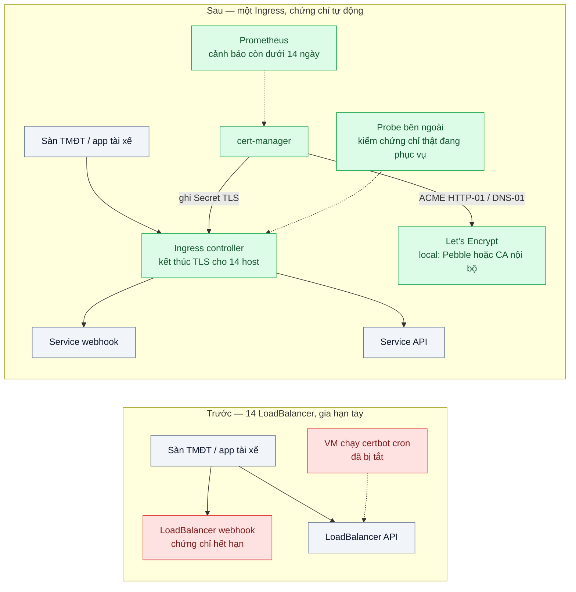
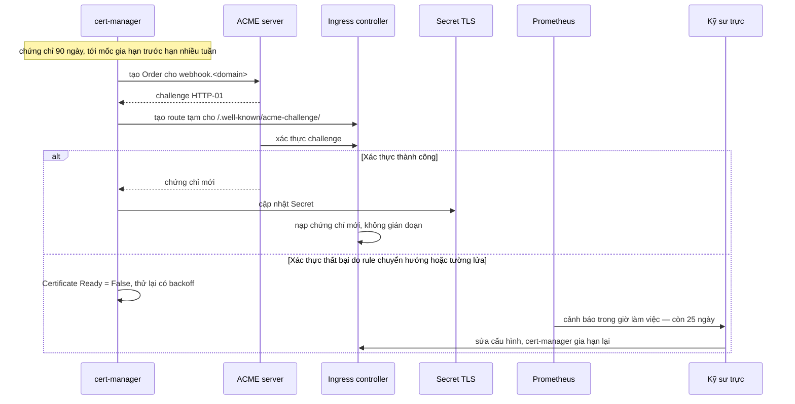

# Ingress & Automated TLS — Chứng chỉ hết hạn lúc nửa đêm, cả hệ thống báo đỏ

| Scope | Mức độ | Trạng thái | Pattern gốc | Cập nhật |
|---|---|---|---|---|
| 16 · backend / k8s | 🟡 Trung bình | 📋 Kế hoạch | Ingress — Kubernetes docs; tự động cấp và gia hạn chứng chỉ — cert-manager docs; ACME (RFC 8555) — Let's Encrypt | 2026-10-06 |

> **Một câu tóm tắt:** Gom các điểm vào HTTP về một Ingress controller kết thúc TLS, và để cert-manager tự xin, lưu và gia hạn chứng chỉ qua giao thức ACME từ trước khi hết hạn nhiều tuần — kèm cảnh báo khi gia hạn thất bại — thay cho bảng tính ngày hết hạn và một người nhớ việc.

## 1. Bài toán thực tế (What)

**Bối cảnh** *(doanh nghiệp giả định, số liệu minh họa)*
Một công ty logistics có 14 tên miền con: API cho app tài xế, cổng đối tác, endpoint nhận webhook từ các sàn TMĐT, trang quản trị... Mỗi service có LoadBalancer riêng; chứng chỉ thì một phần mua theo năm, một phần lấy từ Let's Encrypt bằng `certbot` chạy cron trên một máy ảo. Ngày hết hạn ghi trong một bảng tính.

**Triệu chứng người kinh doanh nhìn thấy**
- 0h một đêm thứ Bảy, chứng chỉ của endpoint nhận webhook hết hạn; các sàn TMĐT gửi đơn thất bại vì lỗi TLS, 6 giờ đơn không về hệ thống, sáng ra kho không có đơn để soạn.
- App tài xế báo "kết nối không an toàn", tài xế gọi tổng đài hàng loạt.
- Người phụ trách gia hạn đã nghỉ việc; máy ảo chạy cron bị tắt trong đợt dọn dẹp chi phí, không ai biết.

**Nguyên nhân kỹ thuật**
Việc gia hạn phụ thuộc vào một người và một máy, không ai giám sát ngày hết hạn của chứng chỉ thực sự đang được phục vụ. Chứng chỉ rải rác trên 14 LoadBalancer với 14 cách cấu hình TLS khác nhau. Không có tín hiệu nào báo trước khi sự cố xảy ra.

**Ràng buộc**
- Không đổi tên miền đang dùng; đối tác đã cấu hình sẵn.
- Một số tên miền cần wildcard (`*.partner.<domain>`) cho từng đối tác.
- Cảnh báo phải tới trong giờ làm việc, nhiều tuần trước khi hết hạn.

## 2. Vì sao dùng pattern này (Why)

**Nguyên nhân gốc mà pattern nhắm vào:** vòng đời chứng chỉ là việc thủ công, không có chủ sở hữu hệ thống và không có giám sát.

**Pattern giải quyết thế nào:** Ingress là tài nguyên Kubernetes mô tả định tuyến HTTP theo host/path và TLS; một Ingress controller hiện thực nó, nên mọi service dùng chung một điểm vào và một cách cấu hình TLS. cert-manager là controller quản lý chứng chỉ như tài nguyên: `Issuer`/`ClusterIssuer` mô tả nơi cấp (ACME của Let's Encrypt, CA nội bộ...), `Certificate` mô tả tên miền và Secret đích; với annotation trên Ingress, cert-manager tự tạo `Certificate`. Giao thức ACME (RFC 8555) chứng minh quyền sở hữu tên miền bằng challenge HTTP-01 (file ở `/.well-known/acme-challenge/`) hoặc DNS-01 (bản ghi TXT, cần cho wildcard). cert-manager gia hạn trước khi hết hạn một khoảng (`renewBefore`, mặc định theo tỷ lệ thời hạn — cần xác minh giá trị mặc định hiện hành) và xuất chỉ số Prometheus để cảnh báo.

**Lựa chọn khác đã cân nhắc**

| Lựa chọn | Giải quyết được gì | Vì sao không chọn (ở bài này) |
|---|---|---|
| Giữ nguyên + tối ưu nhỏ (nhắc lịch, cron `certbot` có email) | Bớt quên | Vẫn phụ thuộc người và máy; email nhắc từ CA không đảm bảo còn được gửi (cần xác minh chính sách hiện hành của Let's Encrypt) |
| Chứng chỉ quản lý bởi cloud gắn LoadBalancer (ví dụ ACM + ALB) | Tự gia hạn, không lộ khóa | Gắn với một nhà cung cấp, không chạy được local; vẫn là lựa chọn tốt nếu toàn bộ ở cloud đó |
| Một wildcard mua theo năm cho mọi thứ | Ít chứng chỉ phải theo dõi | Vẫn gia hạn tay; lộ khóa là lộ mọi tên miền |
| Ingress controller + cert-manager + ACME + cảnh báo — **chọn** | Một điểm vào, chứng chỉ tự xin và tự gia hạn, có tín hiệu sớm | Thêm controller cần vận hành; phải hiểu challenge và giới hạn tốc độ của CA |

## 3. Thiết kế hệ thống (How)

### 3.1 Kiến trúc trước và sau



### 3.2 Luồng chính — gia hạn tự động và khi gia hạn thất bại



### 3.3 Thành phần và trách nhiệm

| Thành phần | Trách nhiệm | Quyết định thiết kế đáng chú ý |
|---|---|---|
| Ingress controller (Traefik đi kèm k3s ở local) | Định tuyến theo host/path, kết thúc TLS | Một điểm vào thay 14 LoadBalancer; cấu hình TLS thống nhất |
| `ClusterIssuer` | `letsencrypt-staging`, `letsencrypt-prod`; local: Pebble và CA nội bộ | Thử mọi thứ trên staging trước để không chạm giới hạn tốc độ của production |
| `Certificate` / annotation trên Ingress | Khai báo tên miền, Secret đích, thời hạn | Wildcard dùng DNS-01; tên miền thường dùng HTTP-01 |
| Quy tắc cảnh báo | Chứng chỉ còn dưới 14 ngày; `Certificate` không Ready quá 1 giờ | Dựa trên chỉ số của cert-manager (cần xác minh tên chỉ số) |
| Probe bên ngoài | Kiểm ngày hết hạn của chứng chỉ thực sự được phục vụ | Bắt được trường hợp Secret đã mới nhưng controller chưa nạp |

### 3.4 Điểm dễ sai khi triển khai
- Thử nghiệm thẳng trên Let's Encrypt production → chạm giới hạn tốc độ, bị chặn xin chứng chỉ vài ngày. Dùng staging.
- Cần wildcard mà cấu hình HTTP-01 → ACME không cấp wildcard qua HTTP-01; phải DNS-01 với quyền ghi DNS.
- Middleware chuyển hướng HTTP sang HTTPS toàn cục chặn đường dẫn challenge → gia hạn thất bại âm thầm. Có test cho đường dẫn này.
- Chỉ giám sát tài nguyên `Certificate` mà không kiểm chứng chỉ thật trên cổng 443 → không thấy lỗi nạp chứng chỉ.
- Khai báo nhiều Ingress cùng một host với cấu hình TLS khác nhau → controller chọn một cách khó đoán.

## 4. Tech stack và tác động (Impact techstack)

| Lớp | Công nghệ chọn | Vì sao chọn | Thay thế tương đương |
|---|---|---|---|
| Cluster local | k3d (k3s kèm Traefik làm Ingress controller) | Có controller ngay, cùng môi trường các bài trước | kind + controller khác |
| Ingress controller | Traefik | Hỗ trợ cả Ingress và Gateway API. Không chọn ingress-nginx vì dự án đã thông báo ngừng phát triển (cần xác minh mốc thời gian) | NGINX Gateway Fabric, Envoy Gateway, HAProxy Ingress |
| Quản lý chứng chỉ | cert-manager (Helm) | Chuẩn de facto trên Kubernetes, hỗ trợ ACME, CA nội bộ, Gateway API | ACM của AWS, chứng chỉ của CDN |
| CA | Let's Encrypt (production); Pebble và CA nội bộ của cert-manager (local) | Pebble là máy chủ ACME thử nghiệm của Let's Encrypt, cho chạy trọn luồng ACME không cần tên miền thật (cần xác minh cách cấu hình trong cluster) | ZeroSSL, step-ca |
| Quan sát | Prometheus + chỉ số cert-manager; blackbox exporter cho probe TLS (cần xác minh tên chỉ số) | Cảnh báo sớm và kiểm chứng phía client | Dịch vụ giám sát chứng chỉ bên ngoài |
| Đo | Script `curl` / `openssl s_client` đo thời gian có HTTPS hợp lệ và đọc ngày hết hạn | Lặp lại được | — |

**Thay đổi so với hệ thống hiện tại:** thay 14 LoadBalancer bằng một Ingress controller, cài cert-manager và issuer, thêm cảnh báo và probe; quyền ghi DNS cho DNS-01. Đội vận hành học đọc `kubectl describe certificate`, `Order`, `Challenge` khi gia hạn lỗi.

## 5. Kết quả đầu ra và cách đo (Output impact)

| Chỉ số | Trước (minh họa) | Mục tiêu khi thực hành | Cách đo |
|---|---|---|---|
| Chứng chỉ phải gia hạn thủ công | 14 | 0 | `kubectl get certificates -A`, đối chiếu danh sách host |
| Thời gian báo trước khi hết hạn | 0 (biết khi đã hết) | ≥ 14 ngày | Chặn đường challenge trên một Certificate thời hạn ngắn, ghi thời điểm cảnh báo bật so với ngày hết hạn |
| Gia hạn tự động thành công trong lab | — | 100% qua 10 chu kỳ | CA nội bộ cấp chứng chỉ thời hạn ngắn; đếm `CertificateRequest` thành công |
| Thời gian từ khi thêm host mới tới HTTPS hợp lệ | Khoảng 1 ngày | < 2 phút (Pebble) | Script ghi thời điểm `kubectl apply` Ingress tới khi `curl --cacert` thành công |
| Số LoadBalancer công khai | 14 | 1 | `kubectl get svc -A` lọc kiểu LoadBalancer |

> Số "trước" là minh họa để hình dung bài toán. Số "mục tiêu" chỉ được coi là đạt khi có số đo thật
> ở mục 8 kèm môi trường đo.

**Tác động nghiệp vụ mong đợi:** không còn sự cố "chứng chỉ hết hạn" làm mất đơn của đối tác; nếu gia hạn có vấn đề, đội kỹ thuật biết trước nhiều tuần và xử lý trong giờ làm việc.

## 6. Đánh đổi và khi KHÔNG nên dùng

**Đánh đổi**
- Ingress controller thành điểm vào chung: cần nhiều replica, PDB (bài 07) và giám sát riêng.
- Phụ thuộc vào CA bên ngoài và giới hạn tốc độ của CA; DNS-01 cần cấp quyền ghi DNS cho cluster.
- Thêm một controller nữa cần nâng cấp định kỳ.

**Không nên dùng khi**
- Toàn bộ hệ thống chạy sau LoadBalancer hoặc CDN có chứng chỉ được quản lý sẵn: dùng tính năng đó, không cần cert-manager cho lưu lượng công khai.
- Chỉ có một hai tên miền và một máy chủ: một ACME client đơn giản có giám sát là đủ.
- Lưu lượng nội bộ giữa service cần mTLS: đó là bài toán service mesh hoặc PKI nội bộ, không giải bằng Ingress.

**Liên quan**
- [../04-config-secret-external-secrets-password-db-nam-trong-yaml/](../04-config-secret-external-secrets-password-db-nam-trong-yaml/) — chứng chỉ được lưu dưới dạng Secret, áp cùng nguyên tắc RBAC.
- [../06-canary-blue-green-argo-rollouts-release-loi-anh-huong-100-phan-tram/](../06-canary-blue-green-argo-rollouts-release-loi-anh-huong-100-phan-tram/) — Ingress controller dùng để chia traffic canary.
- [../07-pdb-anti-affinity-node-drain-lam-down-ca-service/](../07-pdb-anti-affinity-node-drain-lam-down-ca-service/) — giữ Ingress controller sống khi rút node.
- [../../23-backend-monitoring-benchmark/09-synthetic-monitoring-health-check-khach-bao-loi-truoc-khi-doi-ky-thuat-biet/](../../23-backend-monitoring-benchmark/09-synthetic-monitoring-health-check-khach-bao-loi-truoc-khi-doi-ky-thuat-biet/) — probe từ bên ngoài.
- [../../13-backend-transporter/07-service-mesh-mtls-retry-tracing-khong-sua-code/](../../13-backend-transporter/07-service-mesh-mtls-retry-tracing-khong-sua-code/) — TLS cho lưu lượng nội bộ.

## 7. Cơ sở tham khảo

- Kubernetes docs, "Ingress" — https://kubernetes.io/docs/concepts/services-networking/ingress/ — định tuyến theo host/path, khai báo TLS, vai trò của Ingress controller.
- Kubernetes docs, "Gateway API" — https://kubernetes.io/docs/concepts/services-networking/gateway/ — API kế nhiệm Ingress, hướng đi khi mở rộng.
- cert-manager docs — https://cert-manager.io/docs/ — `Issuer`, `Certificate`, ACME HTTP-01/DNS-01, annotation trên Ingress, `renewBefore`, chỉ số Prometheus.
- Let's Encrypt docs — https://letsencrypt.org/docs/ — môi trường staging, giới hạn tốc độ, thời hạn chứng chỉ.
- RFC 8555, "Automatic Certificate Management Environment (ACME)" — https://www.rfc-editor.org/rfc/rfc8555 — giao thức xin và chứng minh quyền sở hữu tên miền.
- Pebble — https://github.com/letsencrypt/pebble — máy chủ ACME thử nghiệm dùng cho môi trường local (cần xác minh cách triển khai trong cluster).

## 8. Kế hoạch thực hành

- [ ] Bước 1: k3d cluster với Traefik; 3 service mẫu, mỗi service một LoadBalancer và chứng chỉ tự ký thời hạn ngắn để tái hiện "trước".
- [ ] Bước 2: Đo "trước": để một chứng chỉ hết hạn, ghi lỗi phía client và việc không có cảnh báo nào.
- [ ] Bước 3: Áp dụng pattern: cert-manager, `ClusterIssuer` Pebble và CA nội bộ, Ingress cho 3 host, quy tắc cảnh báo, probe TLS.
- [ ] Bước 4: Đo "sau": thời gian có HTTPS cho host mới, 10 chu kỳ gia hạn, thời gian báo trước khi chặn challenge; ghi vào mục 5 kèm môi trường.
- [ ] Bước 5: Test (script): chứng chỉ được phục vụ khớp Secret mới sau gia hạn; chặn đường challenge thì `Certificate` không Ready và cảnh báo bật; host mới có HTTPS mà không thao tác tay.

**Cấu trúc code dự kiến**
```text
k8s/
  cert-manager/cluster-issuers.yaml   # pebble, ca-issuer, letsencrypt-staging/prod
  pebble/                             # máy chủ ACME thử nghiệm
  apps/*/ingress.yaml                 # annotation cluster-issuer
monitoring/certificate-alerts.yaml    # quy tắc cảnh báo
scripts/
  measure-time-to-https.sh
  read-served-cert-expiry.sh          # openssl s_client
  break-challenge-path.sh             # mô phỏng gia hạn thất bại
```

**Cách chạy** *(điền khi bắt đầu code)*
```bash
k3d cluster create tls
helm install cert-manager jetstack/cert-manager -n cert-manager --create-namespace --set crds.enabled=true
kubectl apply -k k8s/
./scripts/measure-time-to-https.sh
```
