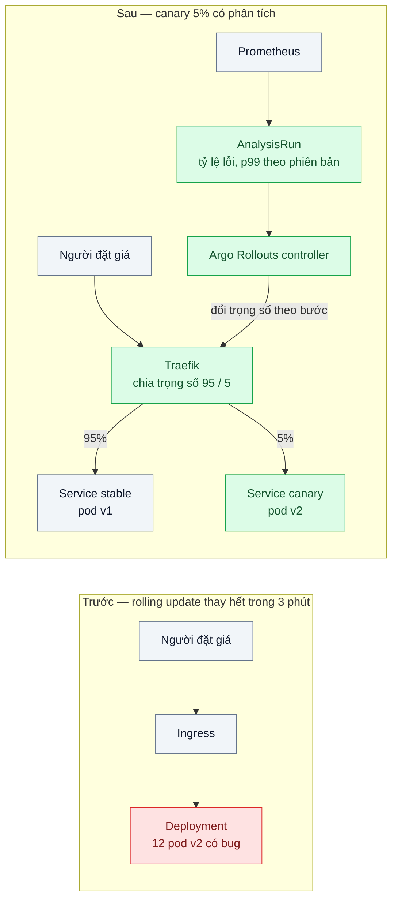
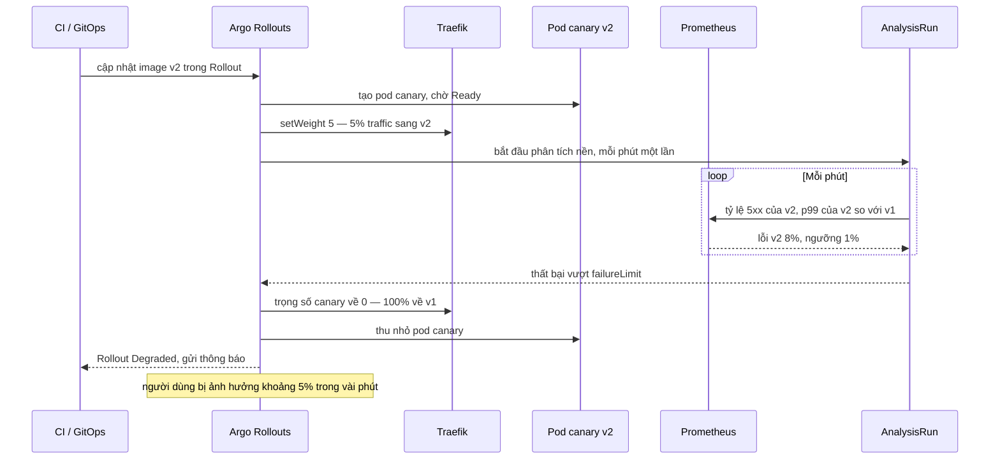

# Canary / Blue-Green (Argo Rollouts) — Release có bug ảnh hưởng 100% người dùng ngay lập tức

| Scope | Mức độ | Trạng thái | Pattern gốc | Cập nhật |
|---|---|---|---|---|
| 16 · backend / k8s | 🔴 Nâng cao | 📋 Kế hoạch | Canary Release — Danilo Sato, martinfowler.com bliki (2014); Blue-Green Deployment — Martin Fowler, bliki (2010); Argo Rollouts docs | 2026-10-06 |

> **Một câu tóm tắt:** Phát hành bản mới cho một phần nhỏ traffic trước, tự động so tỷ lệ lỗi và độ trễ của bản mới với bản đang chạy, tăng dần nếu ổn và tự quay về bản cũ nếu xấu — để một bug chỉ chạm 5% người dùng trong vài phút thay vì 100% trong 18 phút.

## 1. Bài toán thực tế (What)

**Bối cảnh** *(doanh nghiệp giả định, số liệu minh họa)*
Một sàn đấu giá trực tuyến có phiên đấu giá trực tiếp tối thứ Sáu với khoảng 120.000 người tham gia. API "đặt giá" chạy 12 replica, release 3 lần/tuần bằng rolling update chuẩn; probe (bài 01) và tắt êm (bài 02) đã làm đúng.

**Triệu chứng người kinh doanh nhìn thấy**
- Một bản sửa cách làm tròn bước giá có bug: sau 3 phút rolling update, 100% lượt đặt giá trả lỗi 500; 18 phút sau mới quay về bản cũ, khi tổng đài đã quá tải.
- Người bán khiếu nại phiên đấu giá bị "mất" lượt trả giá cao nhất; công ty phải bồi thường và tổ chức lại phiên.
- Ban điều hành yêu cầu "đóng băng release" trước mỗi phiên lớn, làm chậm cả các bản sửa lỗi cần thiết.

**Nguyên nhân kỹ thuật**
Rolling update chỉ hỏi "pod mới đã Ready chưa" — pod có bug nghiệp vụ vẫn Ready. Mọi người dùng chuyển sang bản mới trong vài phút, không có bước nào so sánh tỷ lệ lỗi của bản mới với bản cũ. Phát hiện dựa vào khiếu nại; quay lại là thao tác tay giữa lúc căng thẳng.

**Ràng buộc**
- Không thay đổi luồng build image; chỉ thay cách đưa image lên production.
- Bản mới và bản cũ chạy song song một thời gian, nên schema DB phải tương thích hai chiều.
- Trang quản trị nội bộ có rất ít traffic, không đủ để thống kê canary.

## 2. Vì sao dùng pattern này (Why)

**Nguyên nhân gốc mà pattern nhắm vào:** mức độ phơi nhiễm với bản mới là 100% trước khi có bất kỳ bằng chứng nào về chất lượng của nó.

**Pattern giải quyết thế nào:** Canary Release (Sato, bliki) đưa bản mới tới một tập nhỏ người dùng, quan sát, rồi mở rộng dần; Blue-Green Deployment (Fowler) chạy song song môi trường mới đầy đủ, kiểm thử trên đó rồi chuyển toàn bộ traffic một lần, giữ môi trường cũ để quay lại tức thì. Argo Rollouts hiện thực cả hai bằng CRD `Rollout` thay cho `Deployment`: chiến lược `canary` với các bước `setWeight`, `pause`, `analysis`; chiến lược `blueGreen` với `activeService`, `previewService`, phân tích trước/sau khi chuyển. `AnalysisTemplate` chạy truy vấn Prometheus định kỳ với điều kiện thành công và số lần thất bại cho phép; vượt ngưỡng thì Rollout tự hủy, traffic về bản ổn định. Khi có traffic router (Traefik, Gateway API...), trọng số được áp chính xác ở tầng định tuyến thay vì xấp xỉ theo số replica.

**Lựa chọn khác đã cân nhắc**

| Lựa chọn | Giải quyết được gì | Vì sao không chọn (ở bài này) |
|---|---|---|
| Giữ nguyên + tối ưu nhỏ (rolling update chậm hơn, người trực nhìn dashboard, `kubectl rollout undo` nhanh) | Rút ngắn thời gian quay lại | Vẫn phơi nhiễm 100% trong vài phút; phụ thuộc người phát hiện |
| Feature toggle (scope 08 bài 06) | Bật tắt từng tính năng không cần deploy | Bổ trợ tốt nhưng không bắt được lỗi ngoài phạm vi cờ (crash, chậm, rò bộ nhớ); cần sửa code |
| Chỉ blue-green | Quay lại tức thì | Lúc chuyển vẫn phơi nhiễm 100%; tốn gấp đôi tài nguyên trong lúc song song |
| Canary có phân tích tự động bằng Argo Rollouts; blue-green cho dịch vụ ít traffic — **chọn** | Bản lỗi chỉ chạm phần nhỏ người dùng, tự quay lại | Release chậm hơn; cần chỉ số tách theo phiên bản; schema DB phải tương thích |

## 3. Thiết kế hệ thống (How)

### 3.1 Kiến trúc trước và sau



### 3.2 Luồng chính — canary gặp bản lỗi và tự hủy



### 3.3 Thành phần và trách nhiệm

| Thành phần | Trách nhiệm | Quyết định thiết kế đáng chú ý |
|---|---|---|
| `Rollout` (canary) cho API đặt giá | Các bước 5% → 25% → 50% → 100%, mỗi bước tạm dừng vài phút | Phân tích chạy nền suốt các bước, không chỉ ở cuối |
| `AnalysisTemplate` | Truy vấn Prometheus: tỷ lệ 5xx và p99 của canary so với stable | So với bản đang chạy thay vì ngưỡng cố định; có số mẫu tối thiểu để tránh kết luận từ nhiễu |
| Traffic routing qua Traefik | Áp trọng số chính xác ở tầng định tuyến | Không có router thì trọng số bị làm tròn theo số replica (1/12 ≈ 8%) |
| `Rollout` (blue-green) cho trang quản trị | Chạy bản mới ở `previewService`, kiểm thử tự động, chuyển `activeService` | Giữ bản cũ thêm một khoảng (`scaleDownDelaySeconds`) để quay lại tức thì |
| Chỉ số ứng dụng | `http_requests_total` và histogram độ trễ có nhãn phiên bản | Không tách được theo phiên bản thì không phân tích được canary |

### 3.4 Điểm dễ sai khi triển khai
- Phân tích canary với quá ít request → nhiễu thống kê dẫn tới hủy oan hoặc cho qua bản lỗi. Đặt số mẫu tối thiểu, và dùng blue-green cho dịch vụ ít traffic.
- Migration DB không tương thích ngược → quay về v1 lại vỡ vì schema đã đổi. Áp expand/contract trước khi canary.
- Kết nối dài (WebSocket cập nhật giá) không đi theo trọng số mới; cần cơ chế nối lại để chuyển dần.
- Một người dùng lúc vào v1 lúc vào v2 thấy hành vi khác nhau; cân nhắc định tuyến dính theo người dùng nếu router hỗ trợ (cần xác minh với Traefik).
- Sau khi tự hủy, Rollout ở trạng thái Degraded; lần release tiếp phải là bản sửa hoặc thao tác `undo` có chủ đích, không "deploy lại cho chắc".

## 4. Tech stack và tác động (Impact techstack)

| Lớp | Công nghệ chọn | Vì sao chọn | Thay thế tương đương |
|---|---|---|---|
| Cluster local | k3d với Traefik | Cùng môi trường các bài trước; Traefik là một traffic router Argo Rollouts hỗ trợ (cần xác minh cấu hình `TraefikService`) | kind + Gateway API |
| Progressive delivery | Argo Rollouts + plugin `kubectl argo rollouts` | Canary và blue-green trong một CRD, phân tích bằng Prometheus, hợp với Argo CD (bài 08) | Flagger, Spinnaker |
| Chỉ số | Prometheus; ứng dụng xuất chỉ số bằng `prom-client` | Truy vấn PromQL theo nhãn phiên bản | Datadog, New Relic (Argo Rollouts có provider) |
| Ứng dụng | NestJS, TypeScript strict, Node 20; biến `BUG_RATE` để tạo bản lỗi có kiểm soát | Tái hiện bug theo tỷ lệ | Fastify |
| Đo | k6 đọc header `X-Version` của phản hồi; sự kiện của Rollout | Đếm request lỗi theo phiên bản và thời gian tới khi tự hủy | — |

**Thay đổi so với hệ thống hiện tại:** thay `Deployment` bằng `Rollout`, thêm hai Service stable/canary, `AnalysisTemplate`, chỉ số có nhãn phiên bản, quy tắc migration tương thích. Đội vận hành học đọc trạng thái Rollout, `promote`, `abort` và quy trình sau khi tự hủy.

## 5. Kết quả đầu ra và cách đo (Output impact)

| Chỉ số | Trước (minh họa) | Mục tiêu khi thực hành | Cách đo |
|---|---|---|---|
| Tỷ lệ request bị bản lỗi phục vụ trong thời gian sự cố | 100% | ≤ 5% | k6 tag theo `X-Version`, so số request v2 lỗi với tổng request |
| Thời gian từ khi bắt đầu release bản lỗi tới khi tự quay về | 18 phút (thủ công) | < 5 phút | Thời điểm trong sự kiện Rollout (`kubectl argo rollouts get rollout`) |
| Bản tốt bị hủy oan trong 10 lần release | — | 0 | Đếm Rollout hủy khi `BUG_RATE=0` |
| Thời gian hoàn tất một release bản tốt | 3 phút | Ghi nhận (dự kiến khoảng 20 phút do các bước tạm dừng) | Thời điểm bắt đầu và `Healthy` của Rollout |
| Thời gian quay lại với blue-green | — | < 10 giây | Script chuyển `activeService` về bản cũ và đo tới khi 100% request trả phiên bản cũ |

> Số "trước" là minh họa để hình dung bài toán. Số "mục tiêu" chỉ được coi là đạt khi có số đo thật
> ở mục 8 kèm môi trường đo.

**Tác động nghiệp vụ mong đợi:** một bản lỗi trở thành sự cố nhỏ, ngắn và tự hồi phục thay vì sự cố toàn hệ thống; ban điều hành không cần "đóng băng release" trước mỗi phiên lớn.

## 6. Đánh đổi và khi KHÔNG nên dùng

**Đánh đổi**
- Release chậm hơn nhiều so với rolling update; bản sửa khẩn cấp cần đường tắt có kiểm soát (`promote --full`).
- Hai phiên bản chạy song song: schema, cache, định dạng message đều phải tương thích hai chiều.
- Chất lượng phân tích phụ thuộc chất lượng chỉ số; chỉ số sai thì tự động hóa sai.

**Không nên dùng khi**
- Dịch vụ ít traffic: canary không đủ mẫu; dùng blue-green kèm kiểm thử tự động trên bản preview.
- Thay đổi không tương thích ngược bắt buộc (đổi giao thức với client cũ): hai phiên bản song song gây lỗi; cần kế hoạch chuyển đổi riêng.
- Team chưa có chỉ số theo phiên bản và chưa làm đúng probe, tắt êm: làm bài 01, 02 và có chỉ số trước.

**Liên quan**
- [../01-probes-rolling-update-deploy-moi-nhan-traffic-khi-chua-san-sang/](../01-probes-rolling-update-deploy-moi-nhan-traffic-khi-chua-san-sang/) — điều kiện nền: pod chỉ nhận traffic khi Ready.
- [../08-gitops-argocd-ai-deploy-gi-luc-nao-khong-ro/](../08-gitops-argocd-ai-deploy-gi-luc-nao-khong-ro/) — GitOps cập nhật image, Argo Rollouts lo cách đưa lên.
- [../../08-backend-monolith/06-feature-toggle-branch-by-abstraction-refactor-lon-van-release-hang-tuan/](../../08-backend-monolith/06-feature-toggle-branch-by-abstraction-refactor-lon-van-release-hang-tuan/) — tách deploy khỏi release ở mức tính năng.
- [../../02-backend-database/08-expand-contract-doi-ten-cot-100-trieu-dong/](../../02-backend-database/08-expand-contract-doi-ten-cot-100-trieu-dong/) — schema tương thích khi hai phiên bản song song.
- [../../23-backend-monitoring-benchmark/05-slo-error-budget-he-thong-on-chua-khong-co-so/](../../23-backend-monitoring-benchmark/05-slo-error-budget-he-thong-on-chua-khong-co-so/) — ngưỡng phân tích canary bắt nguồn từ SLO.

## 7. Cơ sở tham khảo

- Danilo Sato, "CanaryRelease", martinfowler.com bliki, 2014 — https://martinfowler.com/bliki/CanaryRelease.html — định nghĩa canary, mở rộng dần và quay lại.
- Martin Fowler, "BlueGreenDeployment", bliki, 2010 — https://martinfowler.com/bliki/BlueGreenDeployment.html — hai môi trường song song, chuyển và quay lại tức thì.
- Argo Rollouts docs — https://argo-rollouts.readthedocs.io/ — CRD `Rollout`, các bước canary, blue-green, `AnalysisTemplate` với Prometheus, traffic management.
- Google, *The Site Reliability Workbook* (2018), chương "Canarying Releases" (cần xác minh số chương) — https://sre.google/workbook/table-of-contents/ — chọn chỉ số, so với baseline, kích thước canary.
- Prometheus docs — https://prometheus.io/docs/ — PromQL và histogram dùng trong phân tích.

## 8. Kế hoạch thực hành

- [ ] Bước 1: k3d + Traefik + Prometheus + Argo Rollouts; API đặt giá giả lập xuất chỉ số có nhãn phiên bản; hai image v1 và v2 (v2 có `BUG_RATE` cấu hình được).
- [ ] Bước 2: Đo "trước": `Deployment` rolling update sang v2 có bug, k6 200 req/s; ghi tỷ lệ request lỗi và thời gian tới khi quay lại thủ công.
- [ ] Bước 3: Áp dụng pattern: `Rollout` canary với Traefik và `AnalysisTemplate`; `Rollout` blue-green cho dịch vụ quản trị.
- [ ] Bước 4: Đo "sau": 5 lần release bản lỗi, 10 lần release bản tốt, 3 lần quay lại blue-green; ghi vào mục 5 kèm môi trường.
- [ ] Bước 5: Test (script kịch bản): `BUG_RATE=0.1` thì Rollout hủy và 100% traffic về v1; `BUG_RATE=0` thì Rollout tới `Healthy`; canary không bao giờ nhận quá trọng số của bước hiện tại (đếm theo `X-Version`).

**Cấu trúc code dự kiến**
```text
src/bid.controller.ts                # đặt giá giả lập, BUG_RATE, header X-Version
src/metrics.ts                       # prom-client, nhãn version
k8s/
  rollout-canary.yaml                # các bước 5 → 25 → 50 → 100
  analysis-template.yaml             # tỷ lệ lỗi, p99 so với stable
  traefik-weighted.yaml
  rollout-bluegreen-admin.yaml
bench/bid-traffic.k6.js
scripts/release-buggy-version.sh
```

**Cách chạy** *(điền khi bắt đầu code)*
```bash
kubectl create namespace argo-rollouts
kubectl apply -n argo-rollouts -f <manifest cài đặt Argo Rollouts theo docs>
kubectl apply -f k8s/ && k6 run bench/bid-traffic.k6.js
```
