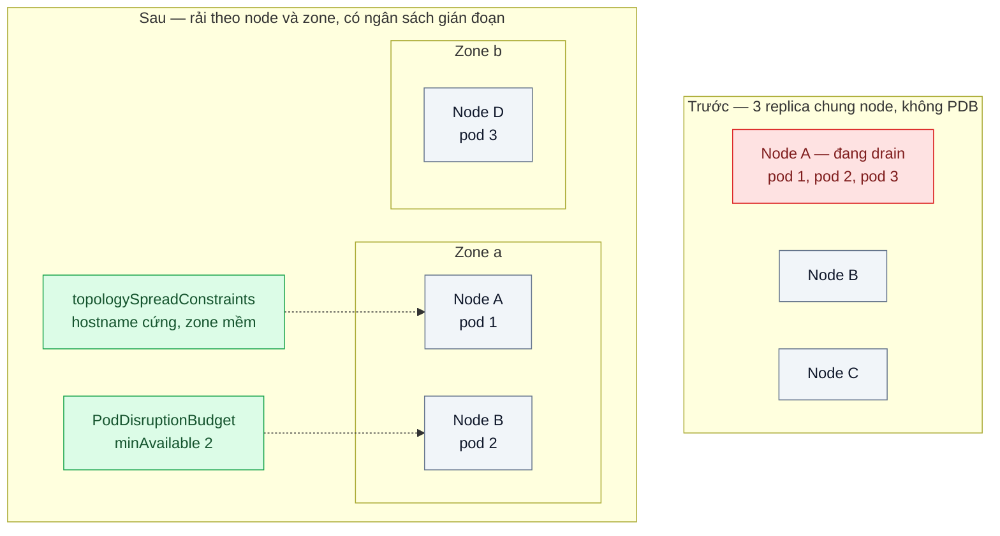
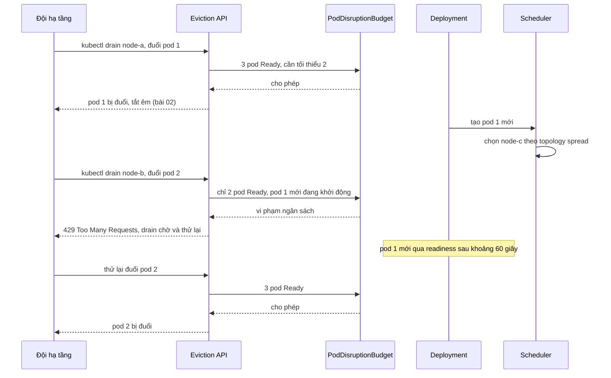

# PodDisruptionBudget & Anti-affinity — Nâng cấp node làm 3 replica cùng chết vì nằm chung một node

| Scope | Mức độ | Trạng thái | Pattern gốc | Cập nhật |
|---|---|---|---|---|
| 16 · backend / k8s | 🔴 Nâng cao | 📋 Kế hoạch | Pod Disruption Budgets, Assigning Pods to Nodes (affinity / anti-affinity), Pod Topology Spread Constraints — Kubernetes docs | 2026-10-06 |

> **Một câu tóm tắt:** Rải các replica ra nhiều node và zone (topology spread / anti-affinity) để một node hỏng không kéo theo cả service, và khai báo PodDisruptionBudget để việc rút node có chủ đích chỉ được đuổi pod khi vẫn còn đủ số replica sẵn sàng.

## 1. Bài toán thực tế (What)

**Bối cảnh** *(doanh nghiệp giả định, số liệu minh họa)*
Một sàn TMĐT chạy service `payment-adapter` (kết nối cổng thanh toán) 3 replica trên cluster 6 node chia hai zone. Mỗi tháng đội hạ tầng nâng cấp hệ điều hành node bằng cách rút (drain) lần lượt từng node. Pod `payment-adapter` cần khoảng 60 giây để khởi động (nạp chứng chỉ, mở kết nối tới cổng thanh toán).

**Triệu chứng người kinh doanh nhìn thấy**
- Đêm nâng cấp gần nhất, thanh toán ngừng hoạt động khoảng 4 phút; khách bỏ giỏ, đội chăm sóc khách hàng nhận phản ánh dồn dập.
- Đội hạ tầng khẳng định "chỉ rút một node", nhưng cả 3 replica đều nằm trên node đó.
- Ban điều hành yêu cầu dừng nâng cấp định kỳ, trong khi bản vá bảo mật cho node đang chờ.

**Nguyên nhân kỹ thuật**
Scheduler không được yêu cầu tách các replica, nên đã xếp cả ba lên node còn nhiều tài nguyên nhất. `kubectl drain` đuổi mọi pod trên node cùng lúc vì không có PodDisruptionBudget nào giới hạn; ba pod thay thế mất 60 giây khởi động cộng thời gian kéo image, trong lúc đó Service không còn endpoint nào.

**Ràng buộc**
- Luôn còn tối thiểu 2 replica sẵn sàng trong mọi thao tác có chủ đích (nâng cấp, thu nhỏ cluster).
- Mất trọn một node hoặc một zone bất ngờ vẫn còn replica phục vụ.
- Nâng cấp node không được bị kẹt vô thời hạn.

## 2. Vì sao dùng pattern này (Why)

**Nguyên nhân gốc mà pattern nhắm vào:** vị trí đặt replica và nhịp đuổi pod không được ràng buộc theo yêu cầu sẵn sàng của service.

**Pattern giải quyết thế nào:** Kubernetes phân biệt gián đoạn *không chủ đích* (node hỏng, mất zone) và *có chủ đích* (drain, cluster autoscaler thu nhỏ). Với loại thứ nhất, cách duy nhất là không để trứng chung một giỏ: *Pod Topology Spread Constraints* (`maxSkew`, `topologyKey`, `whenUnsatisfiable`) hoặc *pod anti-affinity* (`requiredDuringScheduling...` cứng, `preferredDuringScheduling...` mềm) buộc scheduler rải replica theo `kubernetes.io/hostname` và `topology.kubernetes.io/zone`. Với loại thứ hai, *PodDisruptionBudget* (`minAvailable` hoặc `maxUnavailable`) được Eviction API tôn trọng: nếu đuổi thêm một pod làm vi phạm ngân sách, API trả `429 Too Many Requests` và `kubectl drain` chờ rồi thử lại cho tới khi pod thay thế đã Ready.

**Lựa chọn khác đã cân nhắc**

| Lựa chọn | Giải quyết được gì | Vì sao không chọn (ở bài này) |
|---|---|---|
| Giữ nguyên + tối ưu nhỏ (tăng lên 6 replica) | Giảm xác suất dồn cùng node | Không có gì đảm bảo; tốn gấp đôi; drain vẫn đuổi đồng loạt |
| Anti-affinity cứng theo hostname | Bảo đảm không hai replica cùng node | Thiếu node thì pod Pending, chặn scale lên; khó mở rộng khi replica nhiều hơn node |
| Rút node thủ công cẩn thận, trong khung bảo trì | Không cần cấu hình | Phụ thuộc con người; cluster autoscaler vẫn đuổi pod bất kỳ lúc nào |
| Topology spread + PDB — **chọn** | Rải replica theo node và zone; drain không bao giờ hạ dưới 2 replica | Cấu hình sai có thể làm drain kẹt hoặc pod Pending; rải đều chỉ áp dụng lúc xếp lịch |

## 3. Thiết kế hệ thống (How)

### 3.1 Kiến trúc trước và sau



### 3.2 Luồng chính — rút hai node liên tiếp



### 3.3 Thành phần và trách nhiệm

| Thành phần | Trách nhiệm | Quyết định thiết kế đáng chú ý |
|---|---|---|
| `topologySpreadConstraints` theo hostname | Không để hai replica chung node | `maxSkew: 1`, `whenUnsatisfiable: DoNotSchedule` vì cluster có nhiều node hơn số replica |
| `topologySpreadConstraints` theo zone | Rải đều hai zone | `ScheduleAnyway` để mất một zone vẫn xếp được pod sang zone còn lại |
| `PodDisruptionBudget` | Giới hạn số pod bị đuổi có chủ đích | `minAvailable: 2` với 3 replica; không bao giờ đặt bằng số replica |
| Nhãn zone trên node | Cho scheduler biết topology | Ở local gán tay `topology.kubernetes.io/zone` cho node của k3d |
| Script drain lần lượt | Mô phỏng nâng cấp hàng tháng | Có `--timeout` để drain kẹt thì dừng và báo, không treo cả đêm |

### 3.4 Điểm dễ sai khi triển khai
- `minAvailable` bằng số replica (hoặc `maxUnavailable: 0`) → drain không bao giờ xong, nâng cấp node kẹt vô thời hạn.
- Service 1 replica kèm PDB `minAvailable: 1` → cùng kết cục. Service cần sẵn sàng thì cần ít nhất 2 replica.
- Một replica đang không Ready cũng tiêu ngân sách → drain bị chặn dù pod đó vốn đã hỏng. Xem xét `unhealthyPodEvictionPolicy` (cần xác minh phiên bản hỗ trợ).
- Tưởng PDB bảo vệ khỏi node chết đột ngột: không, PDB chỉ áp cho gián đoạn có chủ đích qua Eviction API. Chống node chết là việc của topology spread.
- Topology spread chỉ được xét lúc xếp lịch; sau nhiều lần drain, pod có thể dồn lại. Theo dõi phân bố và cân nhắc descheduler (cần xác minh).

## 4. Tech stack và tác động (Impact techstack)

| Lớp | Công nghệ chọn | Vì sao chọn | Thay thế tương đương |
|---|---|---|---|
| Cluster local | k3d 1 server + 5 agent, gán nhãn zone `a` / `b` | Đủ node để thấy rải đều và drain lần lượt; tắt container agent để mô phỏng node chết | kind nhiều node |
| Lịch xếp pod | Topology spread constraints (ổn định trong Kubernetes) | Biểu đạt "rải theo node và zone" gọn hơn anti-affinity | Pod anti-affinity |
| Ngân sách gián đoạn | `policy/v1` PodDisruptionBudget | Được Eviction API, `kubectl drain`, cluster autoscaler tôn trọng | — |
| Ứng dụng | NestJS, TypeScript strict, Node 20, khởi động có độ trễ cấu hình được | Tái hiện "pod thay thế cần 60 giây" | Fastify |
| Đo | k6 chạy suốt kịch bản drain; `kubectl get pods -o wide`; kube-state-metrics | Request lỗi, số replica sẵn sàng thấp nhất, phân bố | — |

**Thay đổi so với hệ thống hiện tại:** thêm topology spread và PDB cho mọi service quan trọng, chuẩn hóa nhãn zone trên node, viết lại quy trình nâng cấp node dựa trên `kubectl drain` có timeout. Đội hạ tầng học đọc lỗi 429 khi drain và kiểm tra ngân sách bằng `kubectl get pdb`.

## 5. Kết quả đầu ra và cách đo (Output impact)

| Chỉ số | Trước (minh họa) | Mục tiêu khi thực hành | Cách đo |
|---|---|---|---|
| Request lỗi khi drain node đang chứa replica | Khoảng 4 phút gián đoạn | 0 | k6 100 req/s chạy suốt kịch bản drain lần lượt 6 node |
| Số replica sẵn sàng thấp nhất trong lúc drain | 0 | ≥ 2 | PromQL `min_over_time(kube_deployment_status_replicas_available[30m])` |
| Phân bố replica | 3 trên một node | Tối đa 1 mỗi node, không zone nào trống | Script đọc `kubectl get pods -o wide` và nhãn zone |
| Phục vụ khi một node chết đột ngột | Có thể mất hết | Vẫn còn ≥ 2 replica phục vụ | `docker stop` container agent, k6 đếm lỗi |
| Thời gian drain toàn cluster | — | Ghi nhận (dài hơn do chờ ngân sách) | Script ghi thời gian từng lệnh `kubectl drain` |

> Số "trước" là minh họa để hình dung bài toán. Số "mục tiêu" chỉ được coi là đạt khi có số đo thật
> ở mục 8 kèm môi trường đo.

**Tác động nghiệp vụ mong đợi:** nâng cấp node hàng tháng diễn ra trong giờ thấp điểm mà khách không nhận ra; bản vá bảo mật không còn bị hoãn vì sợ gián đoạn thanh toán.

## 6. Đánh đổi và khi KHÔNG nên dùng

**Đánh đổi**
- Drain và nâng cấp cluster chậm hơn vì phải chờ pod thay thế Ready.
- Ràng buộc cứng có thể làm pod Pending khi thiếu node; cần dư địa tài nguyên ở mỗi zone.
- Cấu hình sai PDB chặn cả quy trình bảo trì; cần cảnh báo khi drain kẹt.

**Không nên dùng khi**
- Workload chạy một lần hoặc chạy lại được rẻ (job batch): PDB chỉ làm chậm việc rút node.
- Service chỉ có 1 replica và chấp nhận gián đoạn ngắn: PDB sẽ chặn drain; tăng replica trước hoặc chấp nhận gián đoạn.
- Cluster một node (môi trường dev): không có gì để rải.

**Liên quan**
- [../02-graceful-shutdown-prestop-deploy-lam-rot-request-dang-xu-ly/](../02-graceful-shutdown-prestop-deploy-lam-rot-request-dang-xu-ly/) — pod bị đuổi cũng phải tắt êm.
- [../01-probes-rolling-update-deploy-moi-nhan-traffic-khi-chua-san-sang/](../01-probes-rolling-update-deploy-moi-nhan-traffic-khi-chua-san-sang/) — PDB đếm pod theo trạng thái Ready do probe quyết định.
- [../03-requests-limits-hpa-9h-sang-traffic-gap-5/](../03-requests-limits-hpa-9h-sang-traffic-gap-5/) — dư địa tài nguyên để pod thay thế có chỗ.
- [../05-ingress-tls-cert-manager-chung-chi-het-han-luc-nua-dem/](../05-ingress-tls-cert-manager-chung-chi-het-han-luc-nua-dem/) — Ingress controller cũng cần PDB và rải đều.
- [../../18-backend-scale/01-stateless-session-externalized-login-server-a-server-b-khong-biet/](../../18-backend-scale/01-stateless-session-externalized-login-server-a-server-b-khong-biet/) — replica thay thế được nhau thì mới rải được.

## 7. Cơ sở tham khảo

- Kubernetes docs, "Disruptions" — https://kubernetes.io/docs/concepts/workloads/pods/disruptions/ — gián đoạn có chủ đích và không chủ đích, vai trò của PDB.
- Kubernetes docs, "Specifying a Disruption Budget for your Application" — https://kubernetes.io/docs/tasks/run-application/configure-pdb/ — `minAvailable`, `maxUnavailable`, cách chọn giá trị.
- Kubernetes docs, "API-initiated Eviction" — https://kubernetes.io/docs/concepts/scheduling-eviction/api-eviction/ — phản hồi 429 khi vi phạm ngân sách.
- Kubernetes docs, "Assigning Pods to Nodes" — https://kubernetes.io/docs/concepts/scheduling-eviction/assign-pod-node/ — affinity và anti-affinity cứng/mềm.
- Kubernetes docs, "Pod Topology Spread Constraints" — https://kubernetes.io/docs/concepts/scheduling-eviction/topology-spread-constraints/ — `maxSkew`, `topologyKey`, `whenUnsatisfiable`.
- Kubernetes docs, "Safely Drain a Node" — https://kubernetes.io/docs/tasks/administer-cluster/safely-drain-node/ — `kubectl drain` tôn trọng PDB.

## 8. Kế hoạch thực hành

- [ ] Bước 1: k3d 1 server + 5 agent, gán nhãn zone; `payment-adapter` 3 replica khởi động 60 giây; overlay `before` dùng `nodeSelector` dồn cả ba vào một node để tái hiện chắc chắn.
- [ ] Bước 2: Đo "trước": k6 chạy suốt `kubectl drain` node đó; ghi thời gian gián đoạn và số replica sẵn sàng thấp nhất.
- [ ] Bước 3: Áp dụng pattern: overlay `after` với topology spread theo hostname và zone, PDB `minAvailable: 2`.
- [ ] Bước 4: Đo "sau": drain lần lượt cả 6 node; tắt đột ngột một agent; ghi vào mục 5 kèm môi trường.
- [ ] Bước 5: Test (script): không có hai replica chung node sau khi xếp lịch; drain node thứ hai trong lúc pod thay thế chưa Ready nhận 429; số replica sẵn sàng không bao giờ dưới 2; PDB đặt sai (`minAvailable: 3`) làm drain hết timeout và script báo lỗi.

**Cấu trúc code dự kiến**
```text
src/main.ts                       # khởi động có độ trễ, endpoint thanh toán giả
k8s/
  overlays/before/                # nodeSelector dồn một node, không PDB
  overlays/after/                 # topologySpreadConstraints + PDB
scripts/
  label-zones.sh
  drain-all-nodes.sh              # drain lần lượt, có timeout
  check-spread.sh
bench/drain-traffic.k6.js
```

**Cách chạy** *(điền khi bắt đầu code)*
```bash
k3d cluster create spread --agents 5 && ./scripts/label-zones.sh
kubectl apply -k k8s/overlays/after
k6 run bench/drain-traffic.k6.js & ./scripts/drain-all-nodes.sh
```
