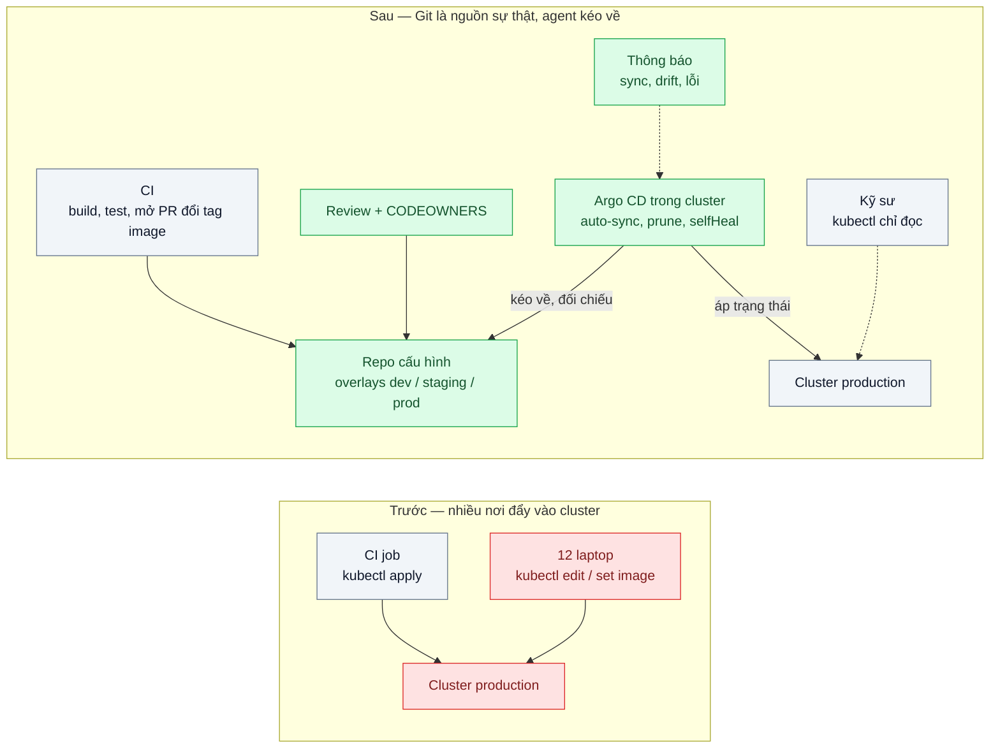
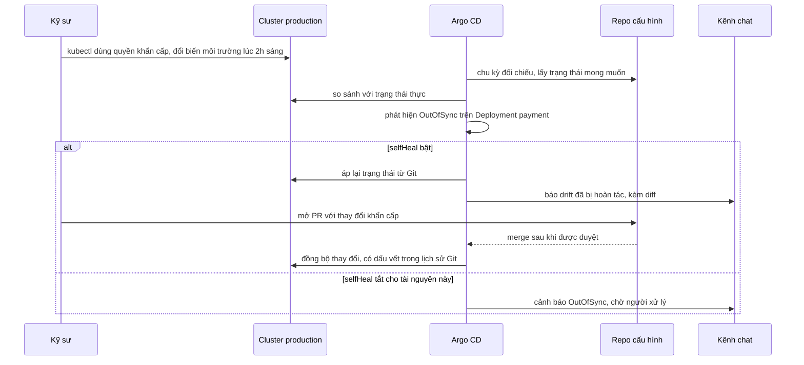

# GitOps (Argo CD) — Không ai biết production đang chạy version nào, ai deploy lúc nào

| Scope | Mức độ | Trạng thái | Pattern gốc | Cập nhật |
|---|---|---|---|---|
| 16 · backend / k8s | 🟡 Trung bình | 📋 Kế hoạch | GitOps principles — OpenGitOps (CNCF); Argo CD docs | 2026-10-06 |

> **Một câu tóm tắt:** Trạng thái mong muốn của mọi môi trường nằm trong một repo Git; một agent trong cluster (Argo CD) liên tục kéo về và so với trạng thái thực, tự áp lại khi lệch — nên "production đang chạy gì, ai đổi, lúc nào, ai duyệt" trả lời bằng `git log`.

## 1. Bài toán thực tế (What)

**Bối cảnh** *(doanh nghiệp giả định, số liệu minh họa)*
Một ví điện tử có 30 service trên ba môi trường (dev, staging, production). Deploy bằng job CI chạy `kubectl apply`, cộng các lần sửa nóng bằng `kubectl set image` hoặc `kubectl edit` từ máy cá nhân; 12 kỹ sư có quyền ghi vào cluster production.

**Triệu chứng người kinh doanh nhìn thấy**
- Trong một sự cố, mất 40 phút chỉ để xác định production đang chạy phiên bản nào của service thanh toán.
- Một thay đổi cấu hình làm lúc 2h sáng ba tháng trước bị mất khi ai đó apply lại từ repo, gây lại đúng lỗi cũ.
- Kiểm toán yêu cầu bằng chứng "ai phê duyệt thay đổi production ngày X"; đội kỹ thuật không đưa ra được.

**Nguyên nhân kỹ thuật**
Thay đổi được *đẩy* vào cluster từ nhiều nơi (CI, laptop), mỗi nơi một cách. Không có nguồn sự thật duy nhất: repo nói một đằng, cluster chạy một nẻo, và không có gì phát hiện độ lệch (drift). Credential ghi cluster nằm rải rác; quay lại phiên bản trước là đoán tag image.

**Ràng buộc**
- Giữ CI hiện có để build và test image; chỉ đổi cách đưa lên cluster.
- Sửa nóng khẩn cấp vẫn phải làm được trong vài phút, nhưng phải để lại dấu vết.
- Bí mật không được nằm trong repo cấu hình (đã có bài 04).

## 2. Vì sao dùng pattern này (Why)

**Nguyên nhân gốc mà pattern nhắm vào:** cluster là nơi duy nhất biết trạng thái thật, và ai cũng có thể đổi nó.

**Pattern giải quyết thế nào:** OpenGitOps nêu bốn nguyên tắc: trạng thái mong muốn được khai báo (*Declarative*), được lưu có phiên bản và bất biến (*Versioned and Immutable*), được agent tự kéo về (*Pulled Automatically*) và được đối chiếu liên tục (*Continuously Reconciled*). Argo CD hiện thực bằng tài nguyên `Application` trỏ tới một đường dẫn trong repo cấu hình và một cluster đích; bật tự đồng bộ với `prune` (xóa tài nguyên không còn trong Git) và `selfHeal` (áp lại khi cluster bị sửa tay). Thay đổi production đi qua pull request có review; lịch sử Git là nhật ký deploy; quay lại là `git revert`. Quyền ghi cluster thu về agent; con người chỉ đọc.

**Lựa chọn khác đã cân nhắc**

| Lựa chọn | Giải quyết được gì | Vì sao không chọn (ở bài này) |
|---|---|---|
| Giữ nguyên + tối ưu nhỏ (chỉ CI được deploy, thu quyền laptop) | Một đường deploy, có log CI | CI giữ quyền admin cluster từ bên ngoài; không phát hiện và sửa drift |
| Flux CD | Cùng mô hình GitOps, kéo về và đối chiếu | Tương đương về nguyên tắc; chọn Argo CD vì có giao diện trực quan và đi cùng Argo Rollouts (bài 06) |
| Helm chạy tay + ghi chép thay đổi trên wiki | Có ghi chép | Ghi chép do người nhớ; không đối chiếu với thực tế |
| GitOps với Argo CD — **chọn** | Một nguồn sự thật, review bắt buộc, tự sửa drift, lịch sử là nhật ký | Thêm repo cấu hình và một hệ thống cần vận hành; quy trình sửa nóng phải đi qua Git |

## 3. Thiết kế hệ thống (How)

### 3.1 Kiến trúc trước và sau



### 3.2 Luồng chính — sửa tay trên production bị phát hiện và tự áp lại



### 3.3 Thành phần và trách nhiệm

| Thành phần | Trách nhiệm | Quyết định thiết kế đáng chú ý |
|---|---|---|
| Repo cấu hình (tách khỏi repo code) | Manifest Kustomize, overlay theo môi trường | Commit của CI (đổi tag) và commit của người tách bạch; branch được bảo vệ |
| `ApplicationSet` / App of Apps | Sinh `Application` cho 30 service × 3 môi trường | Thêm service là thêm thư mục, không thêm cấu hình Argo CD bằng tay |
| `AppProject` + RBAC + SSO của Argo CD | Giới hạn repo nguồn, cluster đích, ai được bấm sync | Production chỉ nhận nguồn từ repo cấu hình chính |
| Bước CI cập nhật tag | `kustomize edit set image` trong overlay rồi mở PR | Tag bất biến hoặc digest; không dùng `latest` |
| `ignoreDifferences` | Bỏ qua trường do controller khác quản lý | `replicas` do HPA điều khiển không gây OutOfSync liên tục |
| Thông báo | Đẩy sự kiện sync, drift, lỗi health vào kênh chat | Người trực thấy drift ngay cả khi selfHeal đã sửa |

### 3.4 Điểm dễ sai khi triển khai
- Dùng tag `latest` → image đổi mà Git không đổi; mất tính "có phiên bản và bất biến".
- Khai báo `replicas` trong manifest trong khi HPA điều khiển → Argo CD và HPA giành nhau. Bỏ trường đó hoặc dùng `ignoreDifferences`.
- Bật `prune` cho production mà review lỏng → xóa nhầm một file là xóa tài nguyên thật. Cân nhắc annotation chặn prune cho tài nguyên quan trọng và khung giờ đồng bộ.
- Vẫn để con người giữ quyền ghi cluster → selfHeal "đánh nhau" với người. Thu quyền, giữ một đường khẩn cấp có ghi log.
- Để giao diện Argo CD công khai với mật khẩu admin mặc định: bật SSO, tắt tài khoản admin sau khi cài.

## 4. Tech stack và tác động (Impact techstack)

| Lớp | Công nghệ chọn | Vì sao chọn | Thay thế tương đương |
|---|---|---|---|
| Cluster local | k3d, ba namespace mô phỏng dev / staging / prod | Cùng môi trường các bài trước | kind |
| GitOps agent | Argo CD (cài bằng manifest chính thức hoặc Helm) | `Application`, `ApplicationSet`, selfHeal, giao diện diff, hợp Argo Rollouts | Flux CD |
| Git server local | Gitea chạy trong cluster (cần xác minh cách cài nhanh nhất) hoặc một repo GitHub riêng | Thử trọn luồng PR → merge → sync không cần mạng ngoài | GitLab |
| Manifest | Kustomize overlay theo môi trường | Đổi tag image bằng một lệnh, diff nhỏ, review dễ | Helm values |
| CI mô phỏng | Script Node thay vai CI: build tag giả, mở PR đổi tag | Tập trung vào phần GitOps | GitHub Actions |
| Đo | `argocd app get`, `argocd app history`, sự kiện Argo CD, `git log` | Trả lời "đang chạy gì, ai đổi" và đo thời gian tự sửa drift | Chỉ số Prometheus của Argo CD |

**Thay đổi so với hệ thống hiện tại:** thêm repo cấu hình, Argo CD, quy trình PR cho mọi thay đổi production, thu quyền ghi cluster của con người, quy trình khẩn cấp có ghi log. Đội học đọc trạng thái Synced/OutOfSync và Healthy/Degraded.

## 5. Kết quả đầu ra và cách đo (Output impact)

| Chỉ số | Trước (minh họa) | Mục tiêu khi thực hành | Cách đo |
|---|---|---|---|
| Thời gian trả lời "production đang chạy phiên bản nào, ai duyệt" | 40 phút | < 1 phút | Bấm giờ một người dùng `argocd app get` và `git log` của overlay prod |
| Thời gian từ khi sửa tay tới khi tự áp lại | Không bao giờ | < 5 phút | Script `kubectl set env` rồi chờ sự kiện sync của Argo CD, ghi chênh lệch |
| Thời gian quay về phiên bản trước | 30 phút (đoán tag) | < 5 phút | Script `git revert` commit đổi tag, đo tới khi Deployment chạy tag cũ |
| Đối tượng có quyền ghi vào cluster production | 12 người + CI | Argo CD + tài khoản khẩn cấp | `kubectl auth can-i --list --as=...` cho từng nhóm |
| Thay đổi production không có commit tương ứng | Không đếm được | 0 tồn tại quá một chu kỳ đối chiếu | Đếm sự kiện OutOfSync và selfHeal trong tuần thực hành |

> Số "trước" là minh họa để hình dung bài toán. Số "mục tiêu" chỉ được coi là đạt khi có số đo thật
> ở mục 8 kèm môi trường đo.

**Tác động nghiệp vụ mong đợi:** sự cố được xử lý nhanh hơn vì biết ngay cái gì đã đổi; kiểm toán có bằng chứng phê duyệt cho mọi thay đổi; không còn "lỗi cũ quay lại" do cấu hình sửa tay bị ghi đè.

## 6. Đánh đổi và khi KHÔNG nên dùng

**Đánh đổi**
- Thêm một hệ thống quan trọng cần vận hành, nâng cấp và sao lưu cấu hình.
- Sửa nóng chậm hơn vài phút vì phải qua Git; cần quy trình khẩn cấp rõ ràng.
- Hai repo (code và cấu hình) làm luồng phát triển dài thêm một bước.

**Không nên dùng khi**
- Một cluster, một hai service, một người vận hành: CI deploy thẳng có log là đủ.
- Hạ tầng không mô tả khai báo được (máy ảo cấu hình tay): làm hạ tầng dạng code trước.
- Đội chưa có thói quen review PR cho cấu hình: GitOps chỉ chuyển sự hỗn loạn vào Git.

**Liên quan**
- [../04-config-secret-external-secrets-password-db-nam-trong-yaml/](../04-config-secret-external-secrets-password-db-nam-trong-yaml/) — bí mật không vào repo cấu hình.
- [../06-canary-blue-green-argo-rollouts-release-loi-anh-huong-100-phan-tram/](../06-canary-blue-green-argo-rollouts-release-loi-anh-huong-100-phan-tram/) — GitOps quyết định phiên bản, Argo Rollouts quyết định cách đưa lên.
- [../03-requests-limits-hpa-9h-sang-traffic-gap-5/](../03-requests-limits-hpa-9h-sang-traffic-gap-5/) — trường `replicas` khi có HPA.
- [../../17-backend-docker/07-image-tagging-sbom-scan-tag-latest-khong-biet-dang-chay-gi/](../../17-backend-docker/07-image-tagging-sbom-scan-tag-latest-khong-biet-dang-chay-gi/) — tag bất biến là điều kiện của GitOps.
- [../../23-backend-monitoring-benchmark/02-structured-logging-correlation-id-grep-log-6-service-tim-mot-request/](../../23-backend-monitoring-benchmark/02-structured-logging-correlation-id-grep-log-6-service-tim-mot-request/) — nối phiên bản đang chạy với log khi điều tra.

## 7. Cơ sở tham khảo

- OpenGitOps, "GitOps Principles" — https://opengitops.dev/ — bốn nguyên tắc: declarative, versioned and immutable, pulled automatically, continuously reconciled.
- Argo CD docs — https://argo-cd.readthedocs.io/ — `Application`, `ApplicationSet`, auto-sync với `prune`/`selfHeal`, `ignoreDifferences`, RBAC, notifications, sync windows.
- Kustomize docs, trường `images` — https://kubectl.docs.kubernetes.io/references/kustomize/ (cần xác minh URL) — đổi tag image theo overlay.
- GitHub docs, "About code owners" — https://docs.github.com/articles/about-code-owners — bắt buộc người phụ trách duyệt thay đổi overlay production.
- Flux docs — https://fluxcd.io/flux/ — công cụ GitOps thay thế, dùng để so sánh.

## 8. Kế hoạch thực hành

- [ ] Bước 1: k3d, ba namespace môi trường, 3 service mẫu; deploy kiểu "trước" bằng script `kubectl apply` và vài lần `kubectl set image` tay.
- [ ] Bước 2: Đo "trước": bấm giờ trả lời "đang chạy gì"; tạo drift và kiểm tra không ai phát hiện; đo thời gian quay lại.
- [ ] Bước 3: Áp dụng pattern: Gitea hoặc repo riêng, repo cấu hình với overlay, Argo CD với `ApplicationSet`, `AppProject`, selfHeal, thông báo; thu quyền ghi của tài khoản người.
- [ ] Bước 4: Đo "sau" các chỉ số mục 5; ghi kèm môi trường (phiên bản Argo CD, chu kỳ đối chiếu đã cấu hình).
- [ ] Bước 5: Test (script): merge PR đổi tag thì Deployment chạy tag mới; `kubectl set env` bị hoàn tác trong một chu kỳ; xóa file manifest thì tài nguyên bị prune ở dev nhưng không ở tài nguyên có annotation chặn prune; HPA đổi replica không gây OutOfSync.

**Cấu trúc code dự kiến**
```text
config-repo/
  apps/<service>/base/
  apps/<service>/overlays/{dev,staging,prod}/
  argocd/applicationset.yaml
  argocd/projects.yaml
scripts/
  fake-ci-bump-image.ts         # đổi tag image, mở PR
  create-drift.sh               # kubectl set env trên prod
  measure-self-heal.sh
  rollback-by-revert.sh
```

**Cách chạy** *(điền khi bắt đầu code)*
```bash
k3d cluster create gitops
kubectl create namespace argocd && kubectl apply -n argocd -f <manifest cài đặt Argo CD theo docs>
kubectl apply -f config-repo/argocd/ && ./scripts/measure-self-heal.sh
```
