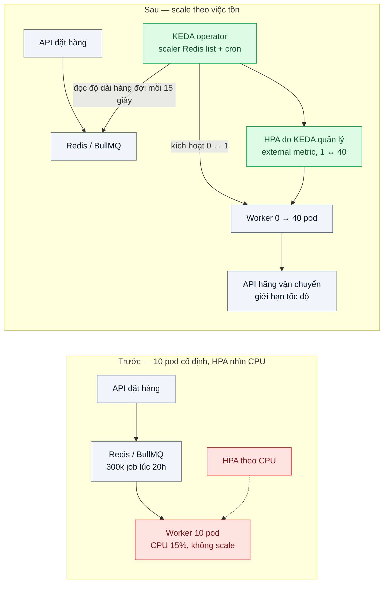
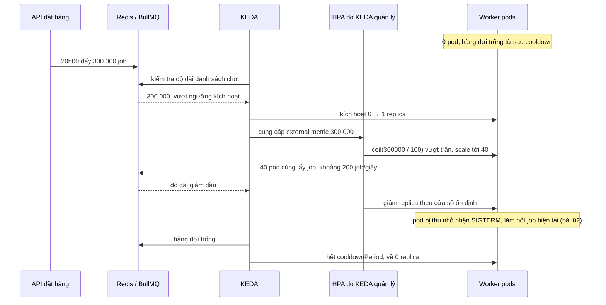

# Event-driven Autoscaling (KEDA) — Worker chạy 10 pod cả đêm dù hàng đợi trống

| Scope | Mức độ | Trạng thái | Pattern gốc | Cập nhật |
|---|---|---|---|---|
| 16 · backend / k8s | 🔴 Nâng cao | 📋 Kế hoạch | Event-driven autoscaling — KEDA docs; Horizontal Pod Autoscaling (external metrics) — Kubernetes docs | 2026-10-06 |

> **Một câu tóm tắt:** Scale worker theo lượng việc đang chờ trong hàng đợi thay vì theo CPU: KEDA đọc độ dài hàng đợi, đưa worker về 0 pod khi không có việc và nâng lên hàng chục pod khi việc dồn, trong giới hạn mà hệ thống phía sau chịu được.

## 1. Bài toán thực tế (What)

**Bối cảnh** *(doanh nghiệp giả định, số liệu minh họa)*
Một sàn TMĐT dùng worker BullMQ để tạo vận đơn với các hãng vận chuyển: mỗi job gọi API hãng mất khoảng 200 ms, gần như không tốn CPU. Deployment worker cố định 10 pod, mỗi pod requests 1 CPU và 1 GiB, chạy 24/7. Đỉnh 20h ngày flash sale có khoảng 300.000 job trong 10 phút.

**Triệu chứng người kinh doanh nhìn thấy**
- Đêm và rạng sáng hàng đợi trống, 10 pod vẫn chạy và giữ node không thu nhỏ được; tiền máy chủ trả cho việc ngồi chờ.
- Tối flash sale, 10 pod xử lý khoảng 50 job/giây nên tồn đọng gần 1,5 giờ; vận đơn ra muộn, nhiều đơn lỡ chuyến lấy hàng cuối ngày.
- Đội kỹ thuật đã bật HPA theo CPU nhưng worker không bao giờ scale: CPU chỉ 15% trong khi hàng đợi phình to.

**Nguyên nhân kỹ thuật**
Worker bị giới hạn bởi I/O (chờ API hãng), nên CPU không phản ánh lượng việc tồn. HPA theo CPU nhìn sai tín hiệu; số replica cố định không phản ứng với đỉnh và không về 0 khi rảnh. Tín hiệu đúng — số job đang chờ — nằm trong Redis, ngoài tầm nhìn của HPA mặc định.

**Ràng buộc**
- API của mỗi hãng vận chuyển giới hạn tốc độ; scale worker quá tay sẽ nhận lỗi 429 hàng loạt.
- Mỗi worker giữ kết nối tới PostgreSQL; tổng kết nối không được vượt giới hạn của pool (scope 02 bài 03).
- Job đầu tiên sau thời gian rảnh được phép chờ tối đa khoảng 1 phút.

## 2. Vì sao dùng pattern này (Why)

**Nguyên nhân gốc mà pattern nhắm vào:** tín hiệu scale (CPU) không đo lượng việc, và không có cơ chế về 0 khi không có việc.

**Pattern giải quyết thế nào:** KEDA là thành phần của Kubernetes đọc sự kiện từ nguồn bên ngoài (Redis, Kafka, RabbitMQ, SQS, PostgreSQL, Prometheus, cron...) qua các *scaler*. Một `ScaledObject` gắn với Deployment worker: KEDA tự tạo và quản lý một HPA dùng chỉ số ngoài (external metric) do KEDA cung cấp cho khoảng 1 ↔ N replica, còn bước 0 ↔ 1 (kích hoạt) do KEDA trực tiếp đảm nhận. Với mục tiêu 100 job chờ cho mỗi replica, 300.000 job chờ cho nhu cầu rất lớn và `maxReplicaCount` chặn lại ở mức hệ thống phía sau chịu được. `pollingInterval` quyết định KEDA hỏi nguồn bao lâu một lần; `cooldownPeriod` quyết định chờ bao lâu sau lần cuối có việc mới về 0.

**Lựa chọn khác đã cân nhắc**

| Lựa chọn | Giải quyết được gì | Vì sao không chọn (ở bài này) |
|---|---|---|
| Giữ nguyên + tối ưu nhỏ (đổi số replica theo lịch: ngày 10, đêm 2) | Bớt lãng phí ban đêm | Không phản ứng với đỉnh bất ngờ; vẫn không về 0 |
| HPA theo CPU | Có sẵn | Worker thiên I/O, CPU không phản ánh việc tồn |
| HPA theo chỉ số ngoài qua Prometheus Adapter | Scale theo độ dài hàng đợi, không cần KEDA | Không về 0 ở cấu hình HPA chuẩn; nhiều thành phần cấu hình hơn |
| Knative Serving | Scale về 0 theo request HTTP | Hợp với dịch vụ HTTP, không hợp với consumer kéo việc từ hàng đợi |
| KEDA với scaler hàng đợi + cron — **chọn** | Scale theo việc tồn, về 0 khi rảnh, có trần theo năng lực phía sau | Thêm một operator; khởi động từ 0 có độ trễ |

## 3. Thiết kế hệ thống (How)

### 3.1 Kiến trúc trước và sau



### 3.2 Luồng chính — đỉnh 20h rồi về 0



### 3.3 Thành phần và trách nhiệm

| Thành phần | Trách nhiệm | Quyết định thiết kế đáng chú ý |
|---|---|---|
| `ScaledObject` | Gắn KEDA với Deployment worker, đặt min/max, chu kỳ hỏi, cooldown | `minReplicaCount: 0`, `maxReplicaCount: 40` theo giới hạn tốc độ API hãng và pool DB |
| Trigger Redis list | Đọc số job chờ trong danh sách của BullMQ | Tên key danh sách chờ phụ thuộc phiên bản BullMQ (cần xác minh); job ưu tiên nằm cấu trúc khác, có thể không được đếm |
| Trigger cron | Giữ tối thiểu 2 replica trong giờ hành chính | Tránh độ trễ khởi động từ 0 khi khách đang thao tác |
| Worker | `concurrency` cố định mỗi pod, tắt êm khi bị thu nhỏ | Mục tiêu 100 job/replica suy ra từ thông lượng một pod và thời gian chờ chấp nhận được |
| Giới hạn phía sau | Rate limit gọi API hãng, pool kết nối DB | Trần replica là quyết định nghiệp vụ, không chỉ kỹ thuật |

### 3.4 Điểm dễ sai khi triển khai
- Đặt `maxReplicaCount` theo khả năng của cluster mà quên hệ thống phía sau → worker đông thì API hãng trả 429, DB cạn kết nối; scale nhanh hơn chỉ làm lỗi nhanh hơn.
- Đếm sai nguồn: scaler đọc một key không phải nơi BullMQ lưu job chờ → KEDA luôn thấy 0. Kiểm tra bằng `redis-cli` trước khi tin.
- Cùng lúc khai báo HPA riêng và `ScaledObject` cho một Deployment → hai bộ điều khiển giành nhau.
- Job dài hơn grace period khi bị thu nhỏ → job dở bị chạy lại; job phải idempotent hoặc dùng `ScaledJob` cho việc dài.
- Quên độ trễ từ 0: job đầu chờ chu kỳ hỏi + thời gian kéo image + khởi động. Đo và chấp nhận, hoặc giữ tối thiểu bằng cron.

## 4. Tech stack và tác động (Impact techstack)

| Lớp | Công nghệ chọn | Vì sao chọn | Thay thế tương đương |
|---|---|---|---|
| Cluster local | k3d | Cùng môi trường các bài trước | kind |
| Autoscaling theo sự kiện | KEDA (cài bằng Helm) với scaler Redis list và cron | Scale về 0, nhiều scaler, dựa trên HPA chuẩn | Prometheus Adapter + HPA (không về 0) |
| Hàng đợi | BullMQ trên Redis 7 | Stack mặc định cho work queue | PGMQ + scaler PostgreSQL; RabbitMQ + scaler RabbitMQ |
| Worker | Node 20, TypeScript strict, `worker.close()` khi SIGTERM | Tắt êm khi bị thu nhỏ | — |
| Hệ thống phía sau giả lập | Fastify mock "API hãng vận chuyển" có giới hạn tốc độ và trả 429 | Thấy được trần replica hợp lý | WireMock |
| Đo | `kubectl get hpa -w`, `kube_deployment_status_replicas` trên Prometheus, `getJobCounts` của BullMQ | Replica theo thời gian, việc tồn, pod-giờ | — |

**Thay đổi so với hệ thống hiện tại:** cài KEDA, thay số replica cố định bằng `ScaledObject`, xóa HPA theo CPU của worker, thêm rate limit phía client khi gọi API hãng. Đội vận hành học đọc trạng thái `ScaledObject` và chỉ số do KEDA xuất.

## 5. Kết quả đầu ra và cách đo (Output impact)

| Chỉ số | Trước (minh họa) | Mục tiêu khi thực hành | Cách đo |
|---|---|---|---|
| Pod-giờ worker trong kịch bản 24 giờ rút gọn | 240 | Giảm rõ, đêm về 0 | Tích phân `kube_deployment_status_replicas` trên Prometheus |
| Thời gian xử lý hết 300.000 job dồn lúc 20h | 1,5 giờ | < 30 phút (giới hạn bởi trần replica) | `getJobCounts('waiting')` lấy mẫu mỗi 10 giây tới khi về 0 |
| Thời gian từ khi job dồn tới khi đạt trần replica | Không scale | < 2 phút | Thời điểm đẩy job so với thời điểm `kubectl get hpa -w` báo đủ replica |
| Độ trễ job đầu tiên khi scale từ 0 | — | Ghi nhận, kỳ vọng < 1 phút | Thời điểm đẩy job so với thời điểm hoàn tất trong log worker |
| Tỷ lệ 429 từ API hãng giả lập ở trần replica | — | < 1% | Bộ đếm của mock server |
| Job mất hoặc dở do thu nhỏ | — | 0 mất; số job chạy lại được ghi nhận | So số job đã đẩy với số vận đơn tạo xong |

> Số "trước" là minh họa để hình dung bài toán. Số "mục tiêu" chỉ được coi là đạt khi có số đo thật
> ở mục 8 kèm môi trường đo.

**Tác động nghiệp vụ mong đợi:** vận đơn tối flash sale ra kịp chuyến lấy hàng, chi phí worker ban đêm gần như bằng 0, và hãng vận chuyển không chặn tài khoản vì gọi quá tay.

## 6. Đánh đổi và khi KHÔNG nên dùng

**Đánh đổi**
- Thêm KEDA operator cần vận hành; KEDA lỗi thì worker kẹt ở số replica cuối cùng.
- Khởi động từ 0 có độ trễ; việc cần xử lý ngay phải giữ replica tối thiểu.
- Scale nhanh dễ dồn áp lực sang hệ thống phía sau nếu trần đặt sai.

**Không nên dùng khi**
- Hàng đợi có lưu lượng đều quanh năm: số replica cố định đúng cỡ đơn giản hơn.
- Dịch vụ HTTP đồng bộ: HPA theo CPU/RPS hoặc Knative hợp hơn KEDA.
- Hệ thống phía sau là nút thắt cứng (API đối tác 10 req/giây): thêm worker không làm nhanh hơn; cần đàm phán hạn mức hoặc gom lô.

**Liên quan**
- [../03-requests-limits-hpa-9h-sang-traffic-gap-5/](../03-requests-limits-hpa-9h-sang-traffic-gap-5/) — HPA nền tảng mà KEDA dựa vào.
- [../02-graceful-shutdown-prestop-deploy-lam-rot-request-dang-xu-ly/](../02-graceful-shutdown-prestop-deploy-lam-rot-request-dang-xu-ly/) — worker bị thu nhỏ phải tắt êm.
- [../../14-backend-queueing/09-consumer-lag-autoscale-hang-doi-dong-500k-message-toi-flash-sale/](../../14-backend-queueing/09-consumer-lag-autoscale-hang-doi-dong-500k-message-toi-flash-sale/) — cùng bài toán nhìn từ phía hàng đợi.
- [../../18-backend-scale/04-queue-based-load-leveling-dinh-20h-flash-sale/](../../18-backend-scale/04-queue-based-load-leveling-dinh-20h-flash-sale/) — hàng đợi hấp thụ đỉnh, KEDA quyết định tốc độ xả.
- [../../02-backend-database/03-connection-pool-200-pod-dap-postgres/](../../02-backend-database/03-connection-pool-200-pod-dap-postgres/) — trần replica theo số kết nối DB.

## 7. Cơ sở tham khảo

- KEDA docs — https://keda.sh/docs/ — kiến trúc (operator, metrics adapter, HPA), `ScaledObject` (`minReplicaCount`, `maxReplicaCount`, `pollingInterval`, `cooldownPeriod`), `ScaledJob`.
- KEDA docs, scaler "Redis Lists" và "Cron" — https://keda.sh/docs/ (cần xác minh đường dẫn từng scaler theo phiên bản) — tham số `listLength`, ngưỡng kích hoạt, lịch cron.
- Kubernetes docs, "Horizontal Pod Autoscaling" — https://kubernetes.io/docs/tasks/run-application/horizontal-pod-autoscale/ — external metrics, `behavior`, cửa sổ ổn định.
- BullMQ docs — https://docs.bullmq.io/ — cấu trúc hàng đợi trong Redis, `worker.close()`.
- Microsoft Azure Architecture Center, "Competing Consumers pattern" — https://learn.microsoft.com/azure/architecture/patterns/competing-consumers — nhiều worker cùng lấy việc từ một hàng đợi, điều kiện để scale ngang worker.

## 8. Kế hoạch thực hành

- [ ] Bước 1: k3d, Redis, PostgreSQL, mock API hãng vận chuyển (giới hạn 300 req/giây), worker BullMQ 10 replica cố định và HPA theo CPU (tái hiện "trước").
- [ ] Bước 2: Đo "trước": script đẩy 300.000 job; ghi thời gian xả hết, replica theo thời gian, pod-giờ của kịch bản 24 giờ rút gọn.
- [ ] Bước 3: Áp dụng pattern: cài KEDA, `ScaledObject` với trigger Redis list và cron, xóa HPA CPU, worker tắt êm; chọn trần replica theo giới hạn mock và pool DB.
- [ ] Bước 4: Đo "sau" cùng kịch bản; ghi vào mục 5 kèm môi trường (phiên bản KEDA, `pollingInterval`, `cooldownPeriod`).
- [ ] Bước 5: Test (script): hàng đợi trống quá cooldown thì replica = 0; đẩy job thì có pod trong 1 phút; replica không vượt trần; mock không trả quá 1% 429; tổng vận đơn bằng tổng job.

**Cấu trúc code dự kiến**
```text
src/
  worker/shipping-label.worker.ts   # BullMQ worker, tắt êm, rate limit phía client
  mock/carrier-api.ts               # Fastify mock có giới hạn tốc độ
  scripts/enqueue-burst.ts          # đẩy 300.000 job
k8s/
  worker-deployment.yaml
  scaled-object.yaml                # Redis list + cron
  before/hpa-cpu.yaml
scripts/measure-drain-time.ts
```

**Cách chạy** *(điền khi bắt đầu code)*
```bash
k3d cluster create keda
helm install keda kedacore/keda -n keda --create-namespace
kubectl apply -f k8s/ && pnpm tsx src/scripts/enqueue-burst.ts
```
