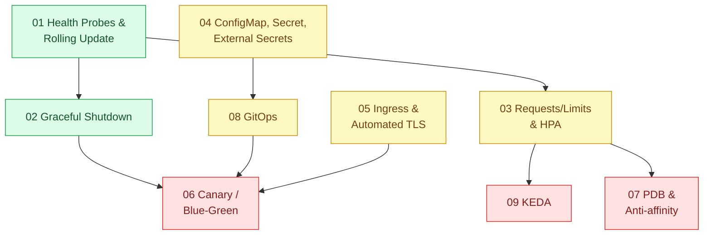

# 16 · Kubernetes (`backend / k8s`)

> **Phạm vi:** Chạy ứng dụng web trên Kubernetes một cách đáng tin: health probe và rolling update,
> tắt êm, tài nguyên và autoscale, cấu hình và bí mật, ingress/TLS, phát hành giảm rủi ro, chịu
> sự cố node, GitOps, autoscale theo sự kiện. Đóng gói image thuộc scope 17; chiến lược scale tổng
> thể thuộc scope 18.
>
> **Câu hỏi trung tâm:** Deploy không rớt request, scale theo tải, cấu hình và bí mật an toàn,
> release giảm rủi ro?

## Bản đồ pattern trong scope

## Danh sách bài toán

| # | Bài toán (pattern — triệu chứng) | Mức | Pattern gốc / nguồn | Trạng thái |
|---|---|---|---|---|
| 01 | [Health Probes & Rolling Update — Pod mới nhận traffic khi chưa kết nối DB xong, lỗi 502 mỗi lần deploy](./01-probes-rolling-update-deploy-moi-nhan-traffic-khi-chua-san-sang/) | 🟢 | Kubernetes docs "Configure Liveness, Readiness and Startup Probes", "Deployments"; Azure "Health Endpoint Monitoring" | 📋 |
| 02 | [Graceful Shutdown (SIGTERM, preStop, terminationGracePeriod) — Mỗi lần deploy rớt vài chục request đang xử lý](./02-graceful-shutdown-prestop-deploy-lam-rot-request-dang-xu-ly/) | 🟢 | Kubernetes docs "Pod Lifecycle" (termination); Node.js docs (signals); 12factor "Disposability" | 📋 |
| 03 | [Resource Requests/Limits & HPA — 9h sáng traffic gấp 5, pod OOMKilled hoặc node hết chỗ](./03-requests-limits-hpa-9h-sang-traffic-gap-5/) | 🟡 | Kubernetes docs "Resource Management for Pods and Containers", "Horizontal Pod Autoscaling" | 📋 |
| 04 | [ConfigMap, Secret & External Secrets — Password DB nằm trong YAML commit lên Git](./04-config-secret-external-secrets-password-db-nam-trong-yaml/) | 🟡 | Kubernetes docs "Secrets", "ConfigMaps"; External Secrets Operator docs; 12factor "Config" | 📋 |
| 05 | [Ingress & Automated TLS — Chứng chỉ hết hạn lúc nửa đêm, cả hệ thống báo đỏ](./05-ingress-tls-cert-manager-chung-chi-het-han-luc-nua-dem/) | 🟡 | Kubernetes docs "Ingress"; cert-manager docs; Let's Encrypt (ACME) | 📋 |
| 06 | [Canary / Blue-Green (Argo Rollouts) — Release có bug ảnh hưởng 100% người dùng ngay lập tức](./06-canary-blue-green-argo-rollouts-release-loi-anh-huong-100-phan-tram/) | 🔴 | Fowler bliki "CanaryRelease", "BlueGreenDeployment"; Argo Rollouts docs | 📋 |
| 07 | [PodDisruptionBudget & Anti-affinity — Nâng cấp node làm 3 replica cùng chết vì nằm chung một node](./07-pdb-anti-affinity-node-drain-lam-down-ca-service/) | 🔴 | Kubernetes docs "Pod Disruption Budgets", "Assigning Pods to Nodes" (affinity / anti-affinity) | 📋 |
| 08 | [GitOps (Argo CD) — Không ai biết production đang chạy version nào, ai deploy lúc nào](./08-gitops-argocd-ai-deploy-gi-luc-nao-khong-ro/) | 🟡 | OpenGitOps principles; Argo CD docs | 📋 |
| 09 | [Event-driven Autoscaling (KEDA) — Worker chạy 10 pod cả đêm dù hàng đợi trống](./09-keda-scale-worker-theo-do-dai-hang-doi/) | 🔴 | KEDA docs; Kubernetes HPA docs (custom / external metrics) | 📋 |

## Lộ trình đề xuất trong scope

1. **Probes → Graceful shutdown** — hai bài làm deploy "không rớt request"; thấy ngay bằng k6 chạy
   trong lúc deploy.
2. **Requests/limits & HPA** — bài về tài nguyên; cần hiểu để không bị OOMKilled.
3. **Config/Secret → Ingress/TLS → GitOps** — ba bài vận hành nền.
4. **Canary/Blue-green → PDB/anti-affinity → KEDA** — nâng cao.

## Kiến thức nền cần có trước

- Docker và image (scope 17 bài 01–03).
- `kubectl` cơ bản; cluster local (kind / k3d / minikube).
- YAML; khái niệm Deployment, Service, Pod.

## Liên kết với scope khác

- `17-backend-docker` bài 03 — PID 1/signal là điều kiện của graceful shutdown.
- `18-backend-scale` — HPA là công cụ cài đặt chính sách autoscaling.
- `14-backend-queueing` bài 09 — KEDA scale consumer theo lag.
- `23-backend-monitoring-benchmark` — metric cho HPA/KEDA và cho canary analysis.

## Nguồn tổng quan cho scope

- Kubernetes documentation — https://kubernetes.io/docs/
- Ibryam & Huß, *Kubernetes Patterns* (O'Reilly, 2nd ed. 2023).
- OpenGitOps — https://opengitops.dev/
