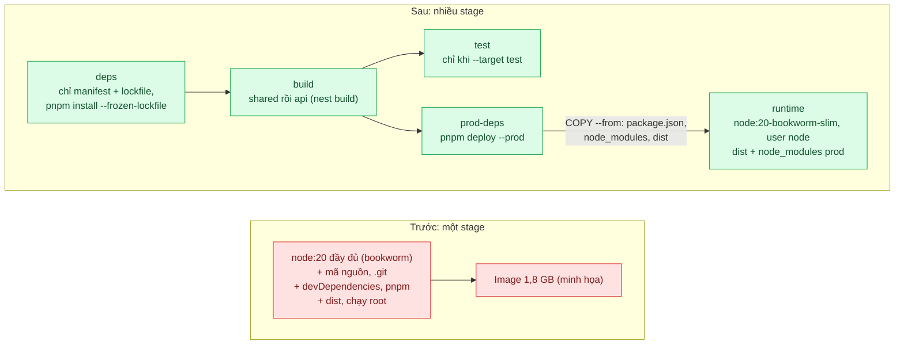
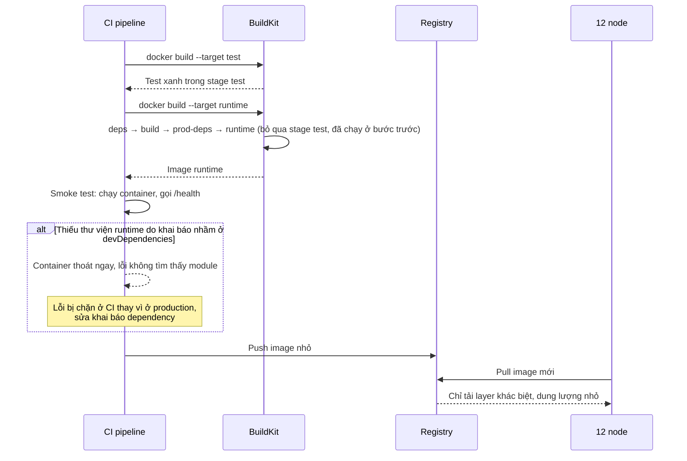

# Multi-stage Build — Image 1,8 GB chứa cả devDependencies, deploy mất 10 phút

| Scope | Mức độ | Trạng thái | Pattern gốc | Cập nhật |
|---|---|---|---|---|
| 17 · backend / docker | 🟢 Cơ bản | ✅ Hoàn thành | Multi-stage Build — Docker docs "Multi-stage builds", "Best practices for writing Dockerfiles" | 2026-10-09 |

> **Một câu tóm tắt:** Tách Dockerfile thành nhiều stage: stage build có đủ công cụ biên dịch và devDependencies, stage cuối chỉ chép `dist/` và dependency production lên một base image gọn, nên image chạy production nhỏ đi nhiều lần và mỗi lần deploy kéo ít dữ liệu hơn.

## 1. Bài toán thực tế (What)

**Bối cảnh** *(doanh nghiệp giả định, số liệu minh họa)*
Công ty SaaS B2B (phần mềm CRM) chạy API NestJS trong monorepo pnpm, deploy lên 12 node mỗi ngày vài lần. Dockerfile hiện tại một stage: `FROM node:20`, `COPY . .`, cài toàn bộ dependency, build, rồi chạy luôn trong cùng image.

**Triệu chứng người kinh doanh nhìn thấy**
- Mỗi lần deploy mất khoảng 10 phút, phần lớn là chờ các node kéo image; bản sửa lỗi khẩn cấp tới tay khách chậm.
- Chi phí lưu trữ registry và băng thông tăng đều theo số lần phát hành.
- Báo cáo quét bảo mật liệt kê hàng trăm lỗ hổng, phần lớn trong công cụ build mà production không hề dùng; đội bảo mật và đội phát triển tranh cãi mỗi quý.

**Nguyên nhân kỹ thuật**
Image 1,8 GB gồm: base image đầy đủ có trình biên dịch và công cụ hệ thống, toàn bộ devDependencies (TypeScript, công cụ test, linter), mã nguồn TypeScript, thư mục `.git`, dữ liệu test. Mọi thứ cần để *build* đều đi theo vào image để *chạy*. Mỗi thay đổi nhỏ tạo layer lớn mới mà các node phải kéo lại.

**Ràng buộc**
- Giữ một Dockerfile duy nhất cho cả CI và production, chạy bằng `docker build` thông thường.
- Không đổi cách build ứng dụng (vẫn `nest build`, vẫn pnpm workspace).
- Image phải chạy được ngay trên các node hiện có, không đổi runtime.

## 2. Vì sao dùng pattern này (Why)

**Nguyên nhân gốc mà pattern nhắm vào:** môi trường build và môi trường chạy bị gộp làm một, nên image chạy mang theo mọi thứ chỉ cần lúc build.

**Pattern giải quyết thế nào:** Docker docs mô tả multi-stage build: một Dockerfile có nhiều chỉ thị `FROM`, mỗi `FROM` mở một stage mới; stage sau chép có chọn lọc kết quả của stage trước bằng `COPY --from=<stage>`, phần còn lại của stage trước bị bỏ khỏi image cuối. Ở bài này: stage `deps` cài dependency theo lockfile, stage `build` biên dịch TypeScript, stage `prod-deps` chỉ cài dependency production cho đúng package API, stage `runtime` dùng base image gọn và chỉ nhận `dist/` cùng `node_modules` production. CI có thể dừng ở stage `test` bằng `--target` để chạy test trong cùng môi trường build.

**Lựa chọn khác đã cân nhắc**

| Lựa chọn | Giải quyết được gì | Vì sao không chọn (ở bài này) |
|---|---|---|
| Giữ nguyên + tối ưu nhỏ (đổi base sang `node:20-slim`, thêm `.dockerignore`) | Giảm vài trăm MB | devDependencies và mã nguồn vẫn trong image; vẫn đáng làm như một phần của bài |
| Build ngoài Docker, chỉ `COPY dist/` vào image | Image nhỏ | Kết quả phụ thuộc máy build (phiên bản Node, hệ điều hành của native module); mất tính tái lập |
| Xóa devDependencies ở cuối cùng một stage (`pnpm prune --prod`) | Ít file hơn | Dữ liệu đã nằm trong layer trước, image không nhỏ đi; vẫn còn công cụ build |
| Multi-stage build (chọn) | Image cuối chỉ có thứ cần để chạy, build tái lập trong Docker | Dockerfile dài hơn; phải hiểu cách chép dependency production trong monorepo |

## 3. Thiết kế hệ thống (How)

### 3.1 Kiến trúc trước và sau



### 3.2 Luồng chính



### 3.3 Thành phần và trách nhiệm

| Thành phần | Trách nhiệm | Quyết định thiết kế đáng chú ý |
|---|---|---|
| Stage `deps` | Cài mọi dependency theo `pnpm-lock.yaml` | `--frozen-lockfile` để build tái lập |
| Stage `build` | Biên dịch TypeScript ra `dist/` | Chỉ chép những gì package API cần trong monorepo |
| Stage `test` | Chạy test trong cùng môi trường build | Chỉ build khi CI gọi `--target test`, không vào image cuối |
| Stage `prod-deps` | Tạo thư mục tự đủ cho package API: `package.json`, `dist/`, `node_modules` chỉ gồm dependency production | `pnpm deploy --prod` (đã kiểm pnpm 10.32.0: phải bật `injectWorkspacePackages`, nếu không báo `ERR_PNPM_DEPLOY_NONINJECTED_WORKSPACE`); `@lab/shared` được chép vào theo trường `files`, nên stage này đứng sau `build` |
| Stage `runtime` | Image chạy production | Base `node:20.20.2-bookworm-slim` ghim digest, `USER node`, `NODE_ENV=production`, chạy thẳng `node dist/main.js`, không có pnpm |
| Smoke test | Khởi động container và gọi `/health` | Bắt lỗi thiếu dependency production trước khi push (`scripts/lib/docker.ts` → `smokeTest`) |
| Kiểm nội dung image | Liệt kê filesystem thật của image (`docker create` + `docker export`) | Không tin Dockerfile: test khẳng định TypeScript, `src/`, `.git`, devDependency, pnpm vắng mặt và `/app` chỉ có `dist`, `node_modules`, `package.json` |

### 3.4 Điểm dễ sai khi triển khai
- **Thư viện cần lúc chạy nằm ở devDependencies.** Trước đây vẫn chạy vì image có đủ mọi thứ; sau multi-stage sẽ crash. Smoke test trong CI là bắt buộc.
- **Chép cả thư mục từ stage build** (`COPY --from=build /app /app`) làm mất gần hết lợi ích; chỉ chép đúng `dist/` và `node_modules` production.
- **Native module biên dịch ở base khác base runtime** (Alpine với musl và Debian với glibc) gây lỗi lúc chạy; giữ cùng họ base cho build và runtime.
- **Chạy bằng `pnpm start` trong image cuối** kéo theo pnpm và một tiến trình cha không cần thiết; chạy thẳng `node` (liên quan bài 03).
- **Bỏ quên `.dockerignore`.** Build context vẫn gửi `.git` và `node_modules` local lên daemon, build chậm dù image cuối nhỏ (bài 02).

**Gặp thật khi làm lab (2026-10-09):**
- **`pnpm deploy` ở pnpm 10 đòi `injectWorkspacePackages`.** Không bật thì báo `ERR_PNPM_DEPLOY_NONINJECTED_WORKSPACE` (hoặc phải dùng `--legacy`). Khi bật, bản inject của `@lab/shared` mang đúng những gì trường `files` cho phép: bỏ `"files": ["dist"]` là `src/index.ts` của thư viện chung vào image runtime (phép thử âm `shared-without-files`). Cần `syncInjectedDepsAfterScripts: [build]` để `@lab/api` thấy `dist/` vừa build của `@lab/shared`.
- **`package.json` do `pnpm deploy` sinh ra ghi đường dẫn tuyệt đối của máy build** (`"@lab/shared": "@lab/shared@file:///app/packages/shared"`) và vẫn liệt kê tên devDependencies (không cài). Kiểm "không có devDependency" phải đọc `node_modules`, không đọc `package.json`.
- **Build `--target runtime` không chạy stage `test`** (BuildKit chỉ build stage mà target phụ thuộc). Nếu CI chỉ gọi build runtime thì test không bao giờ chạy; phải có bước `--target test` riêng. Muốn bước test thật sự chạy lại khi cache trúng, dùng `--no-cache-filter test`.
- **Thư viện runtime khai ở devDependencies lọt qua build, chỉ lộ khi chạy.** Chuyển `@lab/shared` sang devDependencies: cả hai bản build xanh; image nhiều stage thoát mã 1 với `Cannot find module '@lab/shared'`, image một stage vẫn trả `/health` 200 (test (b)).
- **Kích thước image trên containerd image store có ba con số.** `docker image inspect --format '{{.Size}}'` trả kích thước *nén* (content), `docker image ls` trả *disk usage* (bản giải nén + blob nén), tổng `docker history` là bản giải nén. So với số "1,8 GB" quen thuộc của `docker images` kiểu cũ (overlay2) thì phải lấy bản giải nén hoặc đo trong daemon overlay2 (dind).
- **`docker rmi` rồi `docker pull` trên daemon chính không phải pull lạnh**: mọi layer báo `Already exists` vì blob vẫn nằm trong content store (BuildKit giữ), và lần build kế tiếp lỗi `failed to prepare extraction snapshot ... parent snapshot ... does not exist` ở bước unpack; build lại lần nữa thì qua. `buildImage` tự chạy lại một lần khi gặp đúng lỗi này; pull lạnh đo trong dind.
- **Bước "sửa một dòng code" trong script đo phải có nội dung duy nhất.** Lượt thử đầu dùng chuỗi cố định, trúng cache của một lượt hỏng giữa chừng và báo build sau khi sửa code chỉ 1,3 s; nay chuỗi sửa có mốc thời gian.
- **Vitest trong `docker build` in mã màu ANSI** dù không có TTY; test đọc log build phải bỏ mã màu trước khi so.

## 4. Tech stack và tác động (Impact techstack)

| Lớp | Công nghệ chọn | Vì sao chọn | Thay thế tương đương |
|---|---|---|---|
| Build | Docker BuildKit (Docker Desktop 4.48.0, Engine 28.5.1, buildx 0.29.1, BuildKit v0.25.1, driver `docker`), multi-stage | Bỏ qua stage không nằm trên đường tới `--target` (đã kiểm: build `runtime` không chạy stage `test`) | Buildah, Kaniko |
| Base runtime | `node:20.20.2-bookworm-slim` ghim digest `sha256:2cf067cf…` | Debian gọn, cùng họ glibc với stage build, có sẵn user `node` | `node:20-alpine` (musl), distroless (bài 04) |
| Base "trước" | `node:20.20.2-bookworm` ghim digest `sha256:8f693eaa…` (dựng trên `buildpack-deps:bookworm`) | Tái hiện `FROM node:20` đầy đủ của hiện trạng | — |
| Ứng dụng | NestJS 10.4.22, TypeScript 5.9.3 strict, `nest build` (@nestjs/cli 10.4.9) | Stack mặc định; devDependencies giống bộ khởi tạo NestJS (cli, schematics, testing, supertest, ts-node, vitest) | Fastify |
| Monorepo | pnpm 10.32.0 workspace (`apps/api`, `packages/shared`), `injectWorkspacePackages` + `pnpm deploy --prod` | Lấy dependency production của đúng một package | Turborepo prune, Nx |
| Kiểm tra image | `docker image inspect`, `docker history`, `docker create` + `docker export` + `tar -t` | Kích thước, layer, và danh sách file thật trong image | dive (không dùng) |
| Đo | `docker push` lên `registry:2.8.3` local; `docker pull` trên daemon mới tinh trong `docker:28.5.1-dind`; Trivy 0.74.0 (`aquasec/trivy`, ghim digest) | Thời gian push/pull, số lỗ hổng và số package trước/sau | Syft đếm package (lab dùng `--list-all-pkgs` của Trivy thay cho Syft) |

**Lệch so với kế hoạch (ghi lại để phiên sau không "sửa cho đúng kế hoạch"):**
- Không dùng Turborepo: monorepo hai package, `pnpm --filter "@lab/api..."` đã build `@lab/shared` trước `@lab/api` theo thứ tự phụ thuộc.
- Stage `prod-deps` đứng sau `build`, không song song với nó như sơ đồ ban đầu: `pnpm deploy` chép bản đã build của `@lab/shared` (thư mục `dist` theo trường `files`) vào `node_modules`.
- Base image Node 20 bản cuối là 20.20.2 (image dựng ngày 2026-04-22). Node 20 đã hết hỗ trợ (EOL 2026-04-30 theo lịch phát hành trên nodejs.org); lab giữ Node 20 theo quy ước repo, việc lên Node 22/24 nằm ngoài bài.
- Docker Desktop của máy đo dùng **containerd image store** (`driver-type: io.containerd.snapshotter.v1`), nên "kích thước image" có ba con số khác nhau (mục 5.1). Pull "máy chưa có cache" đo trong daemon Docker mới tinh (dind, storage driver `overlay2`), vì trên daemon chính content của image vẫn còn sau `docker rmi` (mục 3.4).
- Không dùng `docker image prune -a` như cách đo dự kiến ở mục 5: lệnh này xóa image của dự án khác trên máy.
- Đếm package bằng Trivy (`--list-all-pkgs`) thay cho Syft, để không kéo thêm một image.

**Thay đổi so với hệ thống hiện tại:** viết lại Dockerfile thành các stage, thêm smoke test vào CI, rà lại phân loại dependency production và dev. Đội phải hiểu sự khác nhau giữa môi trường build và môi trường chạy.

## 5. Kết quả đầu ra và cách đo (Output impact)

| Chỉ số | Trước (minh họa) | Mục tiêu khi thực hành | Cách đo |
|---|---|---|---|
| Kích thước image runtime | 1,8 GB | ≤ 250 MB | `docker image ls` |
| Thời gian kéo image trên máy chưa có cache | 90 giây | ≤ 20 giây | `time docker pull` sau `docker image prune -a`, registry local, 3 lần lấy trung vị |
| Số lỗ hổng HIGH và CRITICAL trong image | hàng trăm | giảm rõ rệt, ghi số cụ thể | `trivy image --severity HIGH,CRITICAL` |
| Số package hệ điều hành và npm trong image | không đo | ghi số trước và sau | Syft liệt kê package |
| Lỗi thiếu dependency lọt tới production | có thể xảy ra | 0, bị chặn ở smoke test | Cố ý chuyển một thư viện runtime sang devDependencies, xem CI có chặn không |

> Số "trước" là minh họa để hình dung bài toán. Số "mục tiêu" chỉ được coi là đạt khi có số đo thật
> ở mục 8 kèm môi trường đo.

**Tác động nghiệp vụ mong đợi:** bản sửa lỗi tới tay khách nhanh hơn, chi phí registry và băng thông giảm, và báo cáo bảo mật chỉ còn những gì thật sự chạy ở production.

> Đối chiếu số minh họa với số đo (5.1): image một stage của lab là 1,27 GB theo cách đếm overlay2 (`docker images`
> kiểu cũ) và 1,86 GB theo `docker image ls` của containerd image store; pull lạnh 26 giây trên registry cùng máy,
> không phải 90 giây. Cách đo thực tế lệch hai chỗ: pull lạnh đo trong daemon mới tinh (dind) thay vì
> `docker image prune -a`, và đếm package bằng Trivy thay vì Syft (mục 4).

### 5.1 Số đã đo

**Môi trường** *(đã đo, 2026-10-09, 01:59 – 02:16 giờ Việt Nam)*: MacBook Apple M1 Pro (8 nhân, 16 GB), macOS 26.6.2,
**cắm sạc** (pin 100 %, `AC Power` ở mọi vòng), nắp mở, `caffeinate -ims`; bộ phát hiện máy ngủ của script ghi 0 khoảng
ngủ. Load 1 phút của macOS 9,7 – 12,9 suốt lượt (máy ảo Docker Desktop khoảng 115 % CPU lúc nghỉ, container MySQL,
RabbitMQ của dự án khác, ứng dụng của người dùng), nên số thời gian đọc cùng mức tranh CPU này.
Docker Desktop 4.48.0, Engine 28.5.1 (API 1.51), buildx 0.29.1-desktop.1, BuildKit v0.25.1, builder `desktop-linux`
(driver `docker`), máy ảo Docker 8 CPU / 7,65 GiB, **containerd image store** (snapshotter `overlayfs`). Node trên
host 20.19.6, trong image 20.20.2; pnpm 10.32.0. Build tắt attestation (`--provenance=false --sbom=false`) cho mọi bản.
Build context là bản sao giống CI checkout (`.tmp/context/`, có `.git` thật, không có `node_modules`). Đơn vị: MB = 10⁶ byte.
"Mạng" của push/pull là loopback trong máy ảo Docker Desktop (daemon → `localhost:58500`, dind → `registry:5000` qua
mạng Compose); **không phải** băng thông giữa CI, registry và node thật, nên không suy ra thời gian deploy thật.
Thời gian: 3 vòng, xoay thứ tự hai bản giữa các vòng, ghi trung vị (thấp nhất – cao nhất). File thô:
`bench/results/main/measure.json`, `history-*.txt`, `trivy/*.json`, `negative.json` (không commit).

**Kích thước và nội dung image**

| Chỉ số | Một stage (trước) | Nhiều stage (sau) | Ghi chú |
|---|---|---|---|
| Kích thước nén (byte phải tải khi pull; `docker image inspect .Size` trên containerd store = tổng layer trong manifest ở registry) | 441,1 MB | **73,7 MB** | ÷ 6,0 |
| Kích thước giải nén trên daemon overlay2 (dind, `docker image inspect .Size`, giống `docker images` kiểu cũ) | 1.273,0 MB | **232,5 MB** | ÷ 5,5 |
| Tổng cột SIZE của `docker history` (giải nén, containerd) | 1.415,9 MB | 266,6 MB | base `node:20-bookworm-slim` chiếm 241,3 MB; phần của app 25,3 MB |
| `docker image ls` trên Docker Desktop (disk usage = bản giải nén + blob nén) | 1,86 GB | 340 MB | con số này gần với "1,8 GB" của bối cảnh nhưng gộp cả blob nén |
| Số layer | 13 | 9 | |
| Số đường dẫn trong filesystem (`docker export`) | 67.324 | 12.338 | |
| User chạy | root (uid 0) | `node` (uid 1000) | |
| Vi phạm của bộ kiểm nội dung | typescript, `src/`, `.git`, devDependencies (cli, schematics, testing, supertest, ts-node, tsx, vitest, @types/*), pnpm, 16 mục lạ trong `/app` (`.git`, `README.md`, `test/`, `bench/`, `docker-compose.yml`...) | không có | `scripts/lib/docker.ts` → `checkRuntimeContents` |

Ở bản một stage, phần app tự thêm 236,4 MB (pnpm toàn cục 33,2 MB, `pnpm install` cả devDependencies 202,1 MB, `COPY . .`
1,0 MB); phần còn lại 1.179,5 MB là base `node:20-bookworm` (dựng trên `buildpack-deps:bookworm`, có trình biên dịch).
Phần lớn khoản giảm đến từ việc đổi base sang `bookworm-slim`, việc chỉ đổi được khi build và runtime đã tách stage.

**Thời gian build, push, pull** (trung vị, thấp nhất – cao nhất, 3 lần)

| Chỉ số | Một stage (trước) | Nhiều stage (sau) |
|---|---|---|
| Build lạnh: `--no-cache` (không dùng layer cache; base image đã có sẵn; pnpm tải gói từ npm registry qua Internet) | 27,4 s (27,0 – 31,0) | 28,2 s (24,8 – 28,8) |
| Build ấm: không đổi gì, mọi bước `CACHED` | 0,8 s (0,6 – 1,7) | 1,9 s (0,6 – 3,4) |
| Build sau khi sửa một dòng trong `apps/api/src` | 26,8 s (26,4 – 29,0): `COPY . .` đổi nên `pnpm install` chạy lại | **11,5 s** (10,4 – 12,1): layer `pnpm install` vẫn `CACHED`, chỉ build + deploy lại |
| `docker push` lên registry local trống | 3,0 s (2,3 – 4,3) | **1,4 s** (1,2 – 1,7) |
| `docker pull` trên daemon mới tinh (dind, `overlay2`, registry qua mạng Compose) | 26,0 s (24,2 – 27,3) | **4,3 s** (4,1 – 5,9) |

Build lạnh của hai bản ngang nhau: cả hai đều tải và cài toàn bộ dependency, multi-stage không làm build lạnh nhanh hơn.
Pull trên daemon chính sau `docker rmi` hai tag của lab không dùng được làm số "máy sạch": lượt thử ghi mọi layer
`Already exists` (`bench/results/trial/pull-host-*.txt`, 1,2 – 4,0 s) vì blob vẫn trong content store (mục 3.4).

**Lỗ hổng và package — Trivy 0.74.0** (`aquasec/trivy@sha256:62b1e65e…`, `--scanners vuln --list-all-pkgs`, kéo image
từ registry local). Vulnerability DB schema 2, `UpdatedAt` 2026-10-08T15:33:46Z, tải lúc 2026-10-08T18:52:28Z
(01:52 ngày 09/10 giờ Việt Nam) vào volume `lab-17-01-trivy-cache` (1,46 GB); hai lần quét dùng `--skip-db-update` nên cùng
một DB. Trivy đếm mỗi cặp (lỗ hổng, package); cột "mã khác nhau" đếm CVE/GHSA không trùng.

| Mức | Một stage (trước) | Nhiều stage (sau) |
|---|---|---|
| CRITICAL | 73 | 7 |
| HIGH | 1.366 | 88 |
| HIGH + CRITICAL (mã khác nhau) | 1.439 (807) | **95 (57)** |
| MEDIUM / LOW / UNKNOWN | 5.042 / 1.986 / 318 | 147 / 90 / 4 |
| — trong gói Debian (HIGH + CRITICAL) | 1.383 | 66 |
| — trong `node_modules` của app | 10 HIGH | 6 HIGH (cả 6 ở `multer`, dependency của `@nestjs/platform-express` 10.4.22) |
| — trong npm có sẵn của base image | 22 HIGH + 1 CRITICAL | 22 HIGH + 1 CRITICAL |
| — trong pnpm cài toàn cục | 22 HIGH + 1 CRITICAL | 0 |
| Package Debian | 413 | 88 |
| Package npm (tổng / của app / của npm trong base / của pnpm toàn cục) | 723 / 420 / 202 / 99 | 322 / 118 / 202 / 0 |

Image runtime vẫn còn 23 lỗ hổng HIGH/CRITICAL trong npm đi kèm base `node`, dù runtime không gọi npm. Multi-stage
không bỏ được thứ có sẵn trong base; muốn bỏ phải đổi base hoặc xóa npm/yarn (bài 04).

**Test và phép thử âm**
- `pnpm test`: 3 file, 13 test xanh (lượt thử với cache ấm: 142 s; lượt chạy lại từ trạng thái sạch ghi ở mục 8).
- (b) chuyển `@lab/shared` sang devDependencies (sửa `package.json` + lockfile của context rồi khôi phục khớp sha256):
  cả hai bản build xanh; image nhiều stage thoát mã 1, log `Cannot find module '@lab/shared'`; image một stage vẫn trả
  `/health` 200, tức lỗi bị che.
- (c) `--target test` chạy đúng 4 stage `base, deps, build, test`, in `Tests 1 passed (1)`, không tạo image mang nhãn
  `lab.stage=runtime`; test hỏng làm build thoát khác 0 (`Tests 1 failed (1)`); build `--target runtime` không có
  bước nào của stage `test`.
- Phép thử âm trên Dockerfile/package (`bench/negative-drills.ts`, `negative.json`, 7/7 đúng kỳ vọng, context khôi phục
  sau mỗi phép thử):

| Phép thử | Bộ kiểm nội dung (a) | uid | Smoke | Nén |
|---|---|---|---|---|
| Đối chứng (Dockerfile nguyên bản) | xanh | 1000 | xanh | 73,7 MB |
| Runtime chép cả stage build (`COPY --from=build /app ./`) | **đỏ**: devDependency, source, typescript, mục lạ | 1000 | xanh | 109,0 MB |
| `pnpm deploy` thiếu `--prod` | **đỏ**: devDependency, typescript | 1000 | xanh | 109,0 MB |
| `packages/shared` bỏ trường `files` | **đỏ**: source (`@lab/shared/src/index.ts` trong `node_modules`) | 1000 | xanh | 73,7 MB |
| Bỏ `USER node` | xanh | **0 → test non-root đỏ** | xanh | 73,7 MB |
| Xóa `.dockerignore` (giữ COPY chọn lọc) | **xanh — không đỏ** | 1000 | xanh | 73,7 MB |
| Xóa `.dockerignore` + build `COPY . .` + runtime chép cả stage build | **đỏ**: thêm cả `.git` | 1000 | xanh | 109,2 MB |

Smoke test xanh ở mọi phép thử nội dung: image "bẩn" vẫn chạy được, nên chỉ smoke test thì không bắt được loại lỗi này;
cần bộ kiểm nội dung. Quên `.dockerignore` **không** làm `.git` hay `src/` lọt vào runtime khi các `COPY` chọn lọc
(BuildKit cũng chỉ chuyển những đường dẫn mà `COPY` cần: 3,5 kB so với 213 kB ở biến thể `COPY . .` — số byte gửi thêm
của lần build đó, quan sát qua log, chưa đối chiếu tài liệu). Hậu quả của quên `.dockerignore` nằm ở context và cache (bài 02).

**Đối chiếu mục tiêu**

| Chỉ số | Mục tiêu | Kết quả |
|---|---|---|
| Kích thước image runtime | ≤ 250 MB | **Đạt theo overlay2** (232,5 MB), sát ngưỡng; theo tổng `docker history` của containerd là 266,6 MB, vượt 7 %. 241 MB là base `node:20-bookworm-slim` |
| Pull trên máy chưa có cache | ≤ 20 s | **Đạt**: 4,3 s so với 26,0 s, registry local cùng máy; không ngoại suy ra deploy thật |
| HIGH + CRITICAL | giảm rõ rệt | **Đạt**: 1.439 → 95 (mã khác nhau 807 → 57), cùng DB |
| Số package | ghi trước và sau | Debian 413 → 88; npm 723 → 322 |
| Lỗi thiếu dependency lọt tới production | 0, bị chặn ở smoke test | **Đạt** trong phép thử: bản sau đỏ ở smoke test, bản trước xanh và che lỗi |

**Hạn chế:** một máy, load cao (≈ 10 – 13) suốt lượt; build lạnh phụ thuộc mạng tới npm registry; push/pull qua loopback
nên chênh lệch thời gian chủ yếu theo byte nén và tốc độ giải nén, không theo băng thông thật; app rất nhỏ (25 MB
dependency production), `.git` của context chỉ 328 KB, nên phần base image chi phối gần hết kích thước.

## 6. Đánh đổi và khi KHÔNG nên dùng

**Đánh đổi**
- Dockerfile dài và khó đọc hơn; cần chú thích từng stage.
- Image runtime gọn hơn nên ít công cụ gỡ lỗi; gỡ lỗi phải dựa vào log, metric hoặc container gỡ lỗi riêng.
- Phân loại sai dependency production và dev giờ gây lỗi thật, không còn bị che giấu.
- Build lạnh không nhanh hơn (đo: 27,4 s so với 28,2 s); lợi ích nằm ở image và ở build sau khi sửa code nhờ tách bước cài dependency.
- Không bỏ được thứ có sẵn trong base image: runtime vẫn mang npm của image `node` (23 lỗ hổng HIGH/CRITICAL ở lần quét này) và shell của Debian slim. Bước tiếp theo là base gọn hơn (bài 04).
- Smoke test không thay được bộ kiểm nội dung image: ở mọi phép thử âm về nội dung, image "bẩn" vẫn chạy và trả `/health` 200.

**Không nên dùng khi**
- Image chỉ dùng cho môi trường phát triển local có hot reload: một stage có đủ công cụ là hợp lý.
- Ứng dụng là script nhỏ không có bước build và gần như không có dependency: lợi ích không đáng kể.
- Hệ thống build đã tạo artifact tái lập ngoài Docker và chỉ cần đóng gói (ví dụ binary tĩnh từ pipeline riêng).

**Liên quan**
- Đọc sau: `../02-layer-cache-dockerignore-moi-build-cai-lai-npm-5-phut/` — image nhỏ rồi, giờ làm build nhanh.
- Đọc sau: `../04-non-root-distroless-container-chay-root-co-shell/` — base runtime còn gọn và an toàn hơn.
- Đọc sau: `../07-image-tagging-sbom-scan-tag-latest-khong-biet-dang-chay-gi/` — quét và truy vết image đã gọn.
- Cùng chủ đề: `../../09-backend-monorepo/01-workspace-sua-shared-lib-phai-mo-12-pr/` — workspace pnpm là nơi lấy dependency của từng package.

## 7. Cơ sở tham khảo

- Docker docs, "Multi-stage builds" — https://docs.docker.com/build/building/multi-stage/ — cú pháp nhiều `FROM`, đặt tên stage, `COPY --from`, `--target`.
- Docker docs, "Best practices for writing Dockerfiles" — https://docs.docker.com/build/building/best-practices/ — chọn base image phù hợp, không cài gói thừa, tách mối quan tâm.
- pnpm docs, "pnpm deploy" — https://pnpm.io/cli/deploy — và "Working with Docker" — https://pnpm.io/docker — lấy package cùng dependency production ra khỏi workspace; đã kiểm ở pnpm 10.32.0: cần `injectWorkspacePackages` (https://pnpm.io/settings), nếu không báo `ERR_PNPM_DEPLOY_NONINJECTED_WORKSPACE`.
- Node.js Docker image — https://hub.docker.com/_/node — biến thể `bookworm`, `bookworm-slim`, `alpine`; "Docker and Node.js Best Practices" — https://github.com/nodejs/docker-node/blob/main/docs/BestPractices.md — user `node` có sẵn, `NODE_ENV=production`, `CMD ["node", ...]`, mục "Smaller images without npm/yarn".
- Docker docs, "Build context" (mục `.dockerignore`) — https://docs.docker.com/build/concepts/context/ — ignore-file riêng `<Dockerfile>.dockerignore` được ưu tiên hơn `.dockerignore` ở gốc context (lab dùng để mô phỏng repo chưa có `.dockerignore`).
- Docker docs, "containerd image store" — https://docs.docker.com/engine/storage/containerd/ — image store của Docker Desktop trên máy đo, lý do kích thước image có nhiều con số.
- Trivy docs — https://trivy.dev/latest/docs/target/container_image/ — quét image từ registry; Trivy 0.74.0 (https://github.com/aquasecurity/trivy/releases/tag/v0.74.0).
- Image chính thức `registry` — https://hub.docker.com/_/registry — và `docker` (dind) — https://hub.docker.com/_/docker — registry local và daemon sạch để đo pull.

## 8. Kế hoạch thực hành

- [x] Bước 1: dựng monorepo pnpm tối giản (`apps/api` NestJS 10 có `/health`, `packages/shared`) với Dockerfile một stage hiện trạng; registry local `registry:2.8.3` trong Docker Compose (cổng 58500).
- [x] Bước 2: đo "trước": kích thước image (ba cách đếm), `docker history`, số layer, thời gian push/pull (pull trên daemon mới tinh trong dind), build lạnh/ấm, số lỗ hổng bằng Trivy 0.74.0.
- [x] Bước 3: viết Dockerfile nhiều stage (`base`, `deps`, `build`, `test`, `prod-deps`, `runtime`; runtime chạy user `node`, chỉ có `dist` + dependency production), smoke test khởi động container và gọi `/health`, bộ kiểm nội dung image.
- [x] Bước 4: đo "sau" cùng cách; ghi số thật và môi trường (máy, Docker/BuildKit, nguồn điện, load, "mạng" là loopback) vào mục 5.1.
- [x] Bước 5: viết test: (a) image runtime không chứa `typescript`, `src/`, `.git`, devDependency nào, pnpm, chạy non-root; (b) smoke test thất bại khi `@lab/shared` bị chuyển sang devDependencies (bản một stage vẫn xanh); (c) `--target test` chạy test mà không tạo image runtime, test hỏng làm build đỏ. Phép thử âm: `bench/negative-drills.ts`.

**Cấu trúc code**
```text
apps/api/
  src/main.ts, app.module.ts, health.controller.ts   # NestJS 10, GET /health
  test/health.test.ts               # test đơn vị, chạy trong stage `test`
  Dockerfile                        # [PATTERN] base, deps, build, test, prod-deps, runtime
  Dockerfile.single-stage           # hiện trạng: node:20-bookworm, COPY . ., cả devDependencies, chạy root
  Dockerfile.single-stage.dockerignore   # cố ý rỗng: mô phỏng repo chưa có .dockerignore
packages/shared/                    # @lab/shared: buildHealthReport, `files: ["dist"]`
pnpm-workspace.yaml                 # [PATTERN] injectWorkspacePackages + syncInjectedDepsAfterScripts (cho pnpm deploy)
.dockerignore                       # [PATTERN] cho Dockerfile nhiều stage
docker-compose.yml                  # registry:2.8.3 ở 127.0.0.1:58500
scripts/
  lib/docker.ts                     # context giống CI checkout, build, inspect, export, smoke test, sửa tạm + khôi phục
  prepare-context.ts, build.ts, smoke-test.ts, inspect-image.ts, clean-images.ts
test/
  image-contents.test.ts            # (a) nội dung thật của image + non-root + smoke
  runtime-dependency.test.ts        # (b) thư viện runtime ở devDependencies
  test-target.test.ts               # (c) --target test
bench/
  measure.ts                        # build lạnh/ấm/sửa code, kích thước, push, pull (dind), Trivy
  negative-drills.ts                # 7 phép thử âm trên Dockerfile/package
  lib.ts
```
Lệch so với cấu trúc dự kiến: smoke test và kiểm nội dung viết bằng TypeScript (`scripts/*.ts`, dùng chung cho test và
script đo) thay vì `smoke-test.sh` / `inspect-image.sh`. Build chạy trên bản sao giống CI checkout (`.tmp/context/`,
`git init` + commit ngày cố định) để image một stage có `.git` thật như repo của đội; nguồn không đổi thì giữ nguyên.

**Cách chạy** *(đã chạy lại từ đầu ngày 2026-10-09: không image lab, không `node_modules`, `.tmp` đã xóa; BuildKit cache
của máy vẫn còn vì lab không prune cache chung)*
```bash
# Cần: Docker Desktop (BuildKit), Node 20, pnpm 10.32.0, mạng tới Docker Hub + npm registry.
# Image dùng (ghim digest, BuildKit/compose tự kéo khi thiếu): node:20.20.2-bookworm (~1,2 GB giải nén),
# node:20.20.2-bookworm-slim, registry:2.8.3; bench kéo thêm docker:28.5.1-dind và aquasec/trivy:0.74.0.
docker compose up -d --wait          # registry local 127.0.0.1:58500
pnpm install --frozen-lockfile
pnpm typecheck
pnpm test                            # build image thật: 3 file, 13 test; 125 s khi BuildKit cache còn (lần chạy lại);
                                     # máy chưa có cache: thêm kéo base image và 2 lần build lạnh (≈ 30 s mỗi bản)

# Thủ công
pnpm build:single && pnpm build:multi && pnpm build:test-target
pnpm smoke lab-17-01/api:multi
pnpm inspect-image lab-17-01/api:single    # thoát 1, liệt kê vi phạm
pnpm inspect-image lab-17-01/api:multi     # ✔ không có vi phạm

# Đo (≈ 11 phút; Trivy tải DB ≈ 1,5 GB vào volume lab-17-01-trivy-cache ở lần đầu)
RUN=main ROUNDS=3 pnpm bench:measure       # → bench/results/main/measure.json
RUN=main pnpm bench:negative               # → bench/results/main/negative.json (≈ 3 phút)

# Dọn: chỉ đồ của lab (tag lab-17-01/*, nhãn lab.id=17-01), không prune toàn cục
pnpm clean:images
docker compose down -v
docker volume rm lab-17-01-trivy-cache     # nếu không cần quét lại
```

## Bài học sau khi làm

1. **Phần lớn khoản giảm đến từ base image, không từ việc bỏ devDependencies.** Bản một stage: base `node:20-bookworm`
   1.179,5 MB + phần app 236,4 MB (tổng `docker history`). Bản nhiều stage: base `bookworm-slim` 241,3 MB + app 25,3 MB.
   Multi-stage là điều kiện để đổi base, vì công cụ build ở lại stage trước. Với app nhỏ, mục tiêu ≤ 250 MB gần như chỉ
   còn phụ thuộc base; muốn nhỏ hơn nữa phải đổi base (bài 04).
2. **Kiểm image bằng nội dung thật, không bằng việc đọc Dockerfile.** Bộ kiểm `checkRuntimeContents` chạy trên danh sách
   file của `docker export`. Ở cả 4 phép thử âm làm bẩn nội dung, image vẫn build xanh và smoke test xanh; chỉ bộ kiểm
   nội dung báo đỏ. Lượt đầu bộ kiểm còn báo nhầm `src/main.ts` trong file mẫu của `@nestjs/schematics`; luật "mã nguồn" phải nhắm
   đúng đường dẫn của monorepo (`app/(apps|packages)/*/src/`, `@lab/*/src/` trong `node_modules`).
3. **Smoke test bắt lỗi khai báo dependency mà build không bắt.** Chuyển `@lab/shared` sang devDependencies: cả hai bản
   build xanh, bản nhiều stage thoát mã 1 khi khởi động, bản một stage che lỗi. Smoke test phải chạy container thật
   từ image vừa build, không chạy `node dist/main.js` trên máy CI.
4. **Quên `.dockerignore` không làm runtime bẩn khi `COPY` chọn lọc** (phép thử âm `no-dockerignore`). Gợi ý ban đầu
   "quên `.dockerignore` → `.git`/`src` lọt" chỉ đúng khi Dockerfile cũng `COPY . .` và chép cả stage build sang runtime.
5. **Trên Docker Desktop dùng containerd image store, "kích thước image" và "pull lạnh" phải định nghĩa lại.**
   `docker image inspect .Size` là kích thước nén; `docker image ls` gộp bản giải nén và blob nén; `docker rmi` rồi
   `docker pull` không tải lại layer nào và có thể làm lần build kế tiếp lỗi "parent snapshot does not exist". Đo pull
   lạnh trong daemon mới tinh (dind) cho số có nghĩa và không đụng image của dự án khác.
6. **`pnpm deploy` ở pnpm 10 cần `injectWorkspacePackages`, và trường `files` của thư viện chung quyết định thứ gì vào
   image.** Bỏ `files` ở `packages/shared` là `src/` của thư viện vào `node_modules` của runtime.
7. **Còn lại trong image runtime:** 66 lỗ hổng HIGH/CRITICAL ở gói Debian của base slim, 23 ở npm có sẵn trong image
   `node` (runtime không dùng npm), 6 ở `multer` (qua `@nestjs/platform-express` 10.4.22). Multi-stage đã bỏ phần của
   công cụ build (pnpm toàn cục, devDependencies, gói `-dev` của `buildpack-deps`); phần còn lại cần base khác hoặc nâng
   dependency.
8. **Hạn chế số đo:** load macOS ≈ 10 – 13 suốt lượt; build lạnh phụ thuộc mạng tới npm registry; push/pull qua loopback
   trong máy ảo nên chỉ phản ánh tỉ lệ byte nén (÷ 6,0) và giải nén, không phải thời gian deploy tới 12 node. Base image
   Node 20.20.2 là bản cuối của Node 20 (đã EOL).
