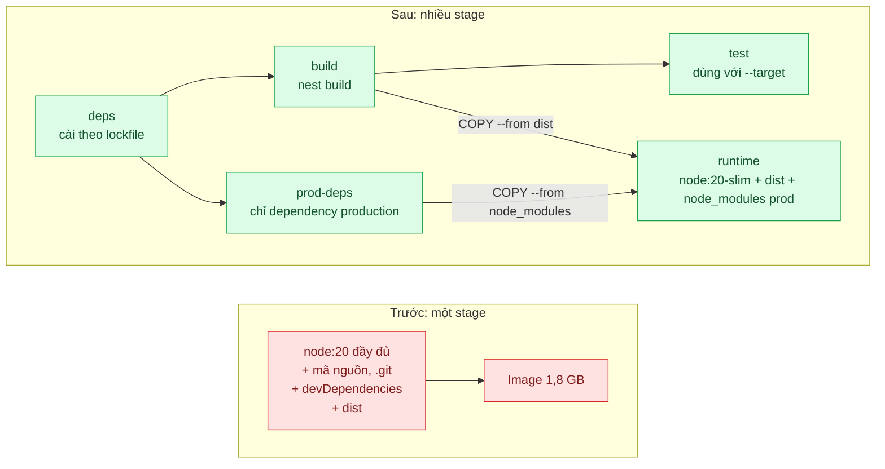
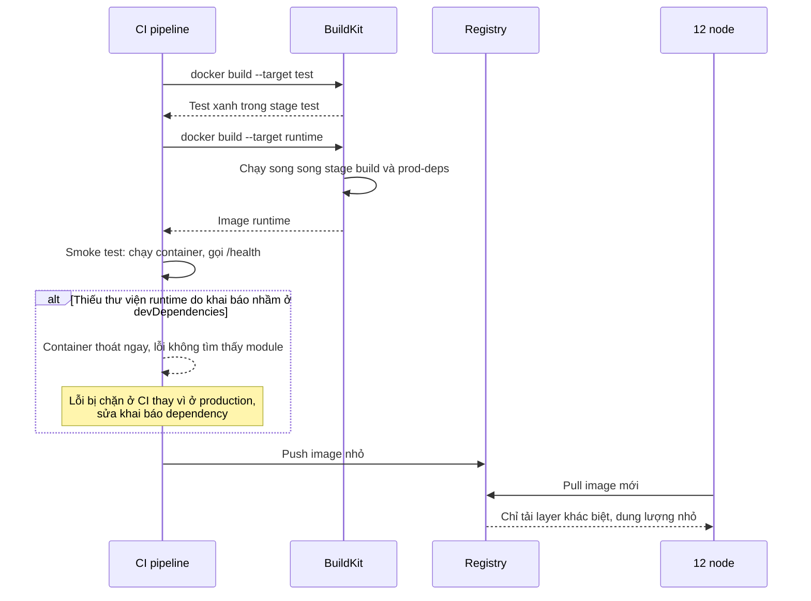

# Multi-stage Build — Image 1,8 GB chứa cả devDependencies, deploy mất 10 phút

| Scope | Mức độ | Trạng thái | Pattern gốc | Cập nhật |
|---|---|---|---|---|
| 17 · backend / docker | 🟢 Cơ bản | 📋 Kế hoạch | Multi-stage Build — Docker docs "Multi-stage builds", "Best practices for writing Dockerfiles" | 2026-10-06 |

> **Một câu tóm tắt:** Tách Dockerfile thành nhiều stage: stage build có đủ công cụ biên dịch và devDependencies, stage cuối chỉ chép `dist/` và dependency production lên một base image gọn, nên image chạy production nhỏ đi nhiều lần và mỗi lần deploy kéo ít dữ liệu hơn.

## 1. Bài toán thực tế (What)

**Bối cảnh** *(doanh nghiệp giả định, số liệu minh họa)*
Công ty SaaS B2B (phần mềm CRM) chạy API NestJS trong monorepo pnpm, deploy lên 12 node mỗi ngày vài lần. Dockerfile hiện tại một stage: `FROM node:20`, `COPY . .`, cài toàn bộ dependency, build, rồi chạy luôn trong cùng image.

**Triệu chứng người kinh doanh nhìn thấy**
- Mỗi lần deploy mất khoảng 10 phút, phần lớn là chờ các node kéo image; bản sửa lỗi khẩn cấp tới tay khách chậm.
- Chi phí lưu trữ registry và băng thông tăng đều theo số lần phát hành.
- Báo cáo quét bảo mật liệt kê hàng trăm lỗ hổng, phần lớn trong công cụ build mà production không hề dùng; đội bảo mật và đội phát triển tranh cãi mỗi quý.

**Nguyên nhân kỹ thuật**
Image 1,8 GB gồm: base image đầy đủ có trình biên dịch và công cụ hệ thống, toàn bộ devDependencies (TypeScript, công cụ test, linter), mã nguồn TypeScript, thư mục `.git`, dữ liệu test. Mọi thứ cần để *build* đều đi theo vào image để *chạy*. Mỗi thay đổi nhỏ tạo layer lớn mới mà các node phải kéo lại.

**Ràng buộc**
- Giữ một Dockerfile duy nhất cho cả CI và production, chạy bằng `docker build` thông thường.
- Không đổi cách build ứng dụng (vẫn `nest build`, vẫn pnpm workspace).
- Image phải chạy được ngay trên các node hiện có, không đổi runtime.

## 2. Vì sao dùng pattern này (Why)

**Nguyên nhân gốc mà pattern nhắm vào:** môi trường build và môi trường chạy bị gộp làm một, nên image chạy mang theo mọi thứ chỉ cần lúc build.

**Pattern giải quyết thế nào:** Docker docs mô tả multi-stage build: một Dockerfile có nhiều chỉ thị `FROM`, mỗi `FROM` mở một stage mới; stage sau chép có chọn lọc kết quả của stage trước bằng `COPY --from=<stage>`, phần còn lại của stage trước bị bỏ khỏi image cuối. Ở bài này: stage `deps` cài dependency theo lockfile, stage `build` biên dịch TypeScript, stage `prod-deps` chỉ cài dependency production cho đúng package API, stage `runtime` dùng base image gọn và chỉ nhận `dist/` cùng `node_modules` production. CI có thể dừng ở stage `test` bằng `--target` để chạy test trong cùng môi trường build.

**Lựa chọn khác đã cân nhắc**

| Lựa chọn | Giải quyết được gì | Vì sao không chọn (ở bài này) |
|---|---|---|
| Giữ nguyên + tối ưu nhỏ (đổi base sang `node:20-slim`, thêm `.dockerignore`) | Giảm vài trăm MB | devDependencies và mã nguồn vẫn trong image; vẫn đáng làm như một phần của bài |
| Build ngoài Docker, chỉ `COPY dist/` vào image | Image nhỏ | Kết quả phụ thuộc máy build (phiên bản Node, hệ điều hành của native module); mất tính tái lập |
| Xóa devDependencies ở cuối cùng một stage (`pnpm prune --prod`) | Ít file hơn | Dữ liệu đã nằm trong layer trước, image không nhỏ đi; vẫn còn công cụ build |
| Multi-stage build (chọn) | Image cuối chỉ có thứ cần để chạy, build tái lập trong Docker | Dockerfile dài hơn; phải hiểu cách chép dependency production trong monorepo |

## 3. Thiết kế hệ thống (How)

### 3.1 Kiến trúc trước và sau



### 3.2 Luồng chính



### 3.3 Thành phần và trách nhiệm

| Thành phần | Trách nhiệm | Quyết định thiết kế đáng chú ý |
|---|---|---|
| Stage `deps` | Cài mọi dependency theo `pnpm-lock.yaml` | `--frozen-lockfile` để build tái lập |
| Stage `build` | Biên dịch TypeScript ra `dist/` | Chỉ chép những gì package API cần trong monorepo |
| Stage `test` | Chạy test trong cùng môi trường build | Chỉ build khi CI gọi `--target test`, không vào image cuối |
| Stage `prod-deps` | Tạo `node_modules` chỉ gồm dependency production của package API | Dùng `pnpm deploy --prod` hoặc `pnpm install --prod` (cần xác minh hành vi ở pnpm 10) |
| Stage `runtime` | Image chạy production | Base `node:20-slim`, chạy thẳng `node dist/main.js`, không cần pnpm |
| Smoke test | Khởi động container và gọi `/health` | Bắt lỗi thiếu dependency production trước khi push |

### 3.4 Điểm dễ sai khi triển khai
- **Thư viện cần lúc chạy nằm ở devDependencies.** Trước đây vẫn chạy vì image có đủ mọi thứ; sau multi-stage sẽ crash. Smoke test trong CI là bắt buộc.
- **Chép cả thư mục từ stage build** (`COPY --from=build /app /app`) làm mất gần hết lợi ích; chỉ chép đúng `dist/` và `node_modules` production.
- **Native module biên dịch ở base khác base runtime** (Alpine với musl và Debian với glibc) gây lỗi lúc chạy; giữ cùng họ base cho build và runtime.
- **Chạy bằng `pnpm start` trong image cuối** kéo theo pnpm và một tiến trình cha không cần thiết; chạy thẳng `node` (liên quan bài 03).
- **Bỏ quên `.dockerignore`.** Build context vẫn gửi `.git` và `node_modules` local lên daemon, build chậm dù image cuối nhỏ (bài 02).

## 4. Tech stack và tác động (Impact techstack)

| Lớp | Công nghệ chọn | Vì sao chọn | Thay thế tương đương |
|---|---|---|---|
| Build | Docker BuildKit, multi-stage | Chạy song song các stage độc lập, bỏ qua stage không cần cho target | Buildah, Kaniko |
| Base runtime | `node:20-slim` | Debian gọn, cùng họ glibc với stage build, đủ cho native module | `node:20-alpine` (musl), distroless (bài 04) |
| Ứng dụng | NestJS 10, TypeScript strict | Stack mặc định | Fastify |
| Monorepo | pnpm 10 workspace + Turborepo | Lấy dependency production của đúng một package | Nx |
| Kiểm tra image | `docker image ls`, `docker history`, dive (cần xác minh) | Xem kích thước và layer nào chiếm chỗ | `docker buildx imagetools inspect` |
| Đo | `time docker pull` trên máy sạch, Trivy | Thời gian kéo image và số lỗ hổng trước và sau | Syft đếm package |

**Thay đổi so với hệ thống hiện tại:** viết lại Dockerfile thành các stage, thêm smoke test vào CI, rà lại phân loại dependency production và dev. Đội phải hiểu sự khác nhau giữa môi trường build và môi trường chạy.

## 5. Kết quả đầu ra và cách đo (Output impact)

| Chỉ số | Trước (minh họa) | Mục tiêu khi thực hành | Cách đo |
|---|---|---|---|
| Kích thước image runtime | 1,8 GB | ≤ 250 MB | `docker image ls` |
| Thời gian kéo image trên máy chưa có cache | 90 giây | ≤ 20 giây | `time docker pull` sau `docker image prune -a`, registry local, 3 lần lấy trung vị |
| Số lỗ hổng HIGH và CRITICAL trong image | hàng trăm | giảm rõ rệt, ghi số cụ thể | `trivy image --severity HIGH,CRITICAL` |
| Số package hệ điều hành và npm trong image | không đo | ghi số trước và sau | Syft liệt kê package |
| Lỗi thiếu dependency lọt tới production | có thể xảy ra | 0, bị chặn ở smoke test | Cố ý chuyển một thư viện runtime sang devDependencies, xem CI có chặn không |

> Số "trước" là minh họa để hình dung bài toán. Số "mục tiêu" chỉ được coi là đạt khi có số đo thật
> ở mục 8 kèm môi trường đo.

**Tác động nghiệp vụ mong đợi:** bản sửa lỗi tới tay khách nhanh hơn, chi phí registry và băng thông giảm, và báo cáo bảo mật chỉ còn những gì thật sự chạy ở production.

## 6. Đánh đổi và khi KHÔNG nên dùng

**Đánh đổi**
- Dockerfile dài và khó đọc hơn; cần chú thích từng stage.
- Image runtime gọn hơn nên ít công cụ gỡ lỗi; gỡ lỗi phải dựa vào log, metric hoặc container gỡ lỗi riêng.
- Phân loại sai dependency production và dev giờ gây lỗi thật, không còn bị che giấu.

**Không nên dùng khi**
- Image chỉ dùng cho môi trường phát triển local có hot reload: một stage có đủ công cụ là hợp lý.
- Ứng dụng là script nhỏ không có bước build và gần như không có dependency: lợi ích không đáng kể.
- Hệ thống build đã tạo artifact tái lập ngoài Docker và chỉ cần đóng gói (ví dụ binary tĩnh từ pipeline riêng).

**Liên quan**
- Đọc sau: `../02-layer-cache-dockerignore-moi-build-cai-lai-npm-5-phut/` — image nhỏ rồi, giờ làm build nhanh.
- Đọc sau: `../04-non-root-distroless-container-chay-root-co-shell/` — base runtime còn gọn và an toàn hơn.
- Đọc sau: `../07-image-tagging-sbom-scan-tag-latest-khong-biet-dang-chay-gi/` — quét và truy vết image đã gọn.
- Cùng chủ đề: `../../09-backend-monorepo/01-workspace-sua-shared-lib-phai-mo-12-pr/` — workspace pnpm là nơi lấy dependency của từng package.

## 7. Cơ sở tham khảo

- Docker docs, "Multi-stage builds" — https://docs.docker.com/build/building/multi-stage/ — cú pháp nhiều `FROM`, đặt tên stage, `COPY --from`, `--target`.
- Docker docs, "Best practices for writing Dockerfiles" — https://docs.docker.com/build/building/best-practices/ — chọn base image phù hợp, không cài gói thừa, tách mối quan tâm.
- pnpm docs, "pnpm deploy" và "Working with Docker" — https://pnpm.io/ — lấy package cùng dependency production ra khỏi workspace (cần xác minh hành vi ở pnpm 10).
- Node.js Docker image — https://hub.docker.com/_/node (cần xác minh) — các biến thể `slim`, `alpine` và khác biệt glibc với musl.

## 8. Kế hoạch thực hành

- [ ] Bước 1: dựng monorepo pnpm tối giản (package API NestJS và một thư viện chung) với Dockerfile một stage hiện trạng; registry local `registry:2` trong Docker Compose.
- [ ] Bước 2: đo "trước": kích thước image, `docker history`, thời gian pull trên máy đã xóa cache, số lỗ hổng bằng Trivy.
- [ ] Bước 3: viết Dockerfile nhiều stage (`deps`, `build`, `test`, `prod-deps`, `runtime`), thêm smoke test khởi động container và gọi `/health`.
- [ ] Bước 4: đo "sau" cùng cách; ghi số thật và môi trường (máy, phiên bản Docker, mạng) vào mục 5.
- [ ] Bước 5: viết test: (a) image runtime không chứa `typescript`, thư mục `src/` hay `.git`; (b) smoke test thất bại khi thư viện runtime bị chuyển sang devDependencies; (c) `--target test` chạy test mà không tạo image runtime.

**Cấu trúc code dự kiến**
```text
apps/api/
  src/main.ts
  Dockerfile                        # [PATTERN] deps, build, test, prod-deps, runtime
  Dockerfile.single-stage           # hiện trạng để so sánh
packages/shared/
scripts/
  smoke-test.sh                     # chạy container, gọi /health
  inspect-image.sh                  # kiểm tra file không được có trong image
test/
  image-contents.test.ts
docker-compose.yml                  # registry local
```

**Cách chạy** *(điền khi bắt đầu code)*
```bash
docker compose up -d
pnpm install && pnpm test
```
