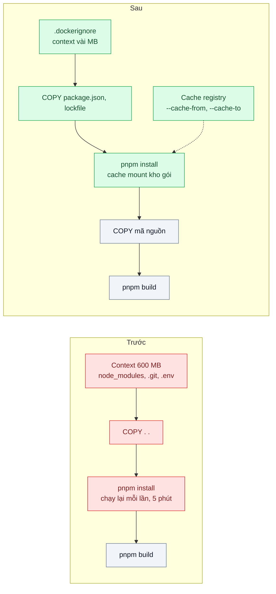
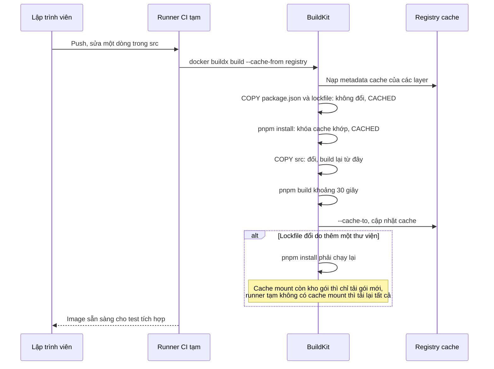

# Layer Caching & .dockerignore — Mỗi build cài lại toàn bộ npm 5 phút dù chỉ sửa một dòng code

| Scope | Mức độ | Trạng thái | Pattern gốc | Cập nhật |
|---|---|---|---|---|
| 17 · backend / docker | 🟢 Cơ bản | ✅ Hoàn thành | Layer Caching — Docker docs "Build cache", ".dockerignore file"; BuildKit cache mounts | 2026-10-09 |

> **Một câu tóm tắt:** Sắp xếp Dockerfile để thứ ít đổi (lockfile, cài dependency) nằm trước thứ hay đổi (mã nguồn), loại file thừa khỏi build context bằng `.dockerignore`, và giữ kho gói giữa các lần build bằng cache mount, để sửa một dòng code chỉ build lại vài chục giây.

## 1. Bài toán thực tế (What)

**Bối cảnh** *(doanh nghiệp giả định, số liệu minh họa)*
Ví điện tử có 25 lập trình viên, mỗi ngày khoảng 150 lần build image trên CI cho các pull request. Dockerfile của API NestJS: `COPY . .` ngay sau `FROM`, rồi `RUN pnpm install`, rồi `RUN pnpm build`. Runner CI là máy tạm, xóa sau mỗi job.

**Triệu chứng người kinh doanh nhìn thấy**
- Mỗi pull request chờ khoảng 7 phút mới có image để chạy test tích hợp; lập trình viên chuyển sang việc khác rồi quên, vòng review kéo dài cả ngày.
- Hóa đơn phút chạy CI tăng đều mỗi tháng, phần lớn là thời gian tải và cài lại cùng một bộ dependency.
- Bản sửa lỗi khẩn cấp vẫn phải chờ đủ chu trình build dài như mọi thay đổi khác.

**Nguyên nhân kỹ thuật**
Docker tái sử dụng một layer chỉ khi chỉ thị và dữ liệu đầu vào của nó không đổi, và mọi layer sau một layer thay đổi đều phải build lại. `COPY . .` đứng trước bước cài đặt nên sửa bất kỳ file nào cũng làm mất cache của `pnpm install`. Build context không có `.dockerignore`: thư mục `node_modules` local, `.git`, `coverage` (khoảng 600 MB) được gửi lên daemon mỗi lần và còn làm cache mất hiệu lực vì nội dung thay đổi liên tục. Runner tạm không giữ cache giữa các job.

**Ràng buộc**
- Kết quả build phải tái lập: cùng lockfile cho ra cùng dependency.
- Không đổi nhà cung cấp CI; runner vẫn là máy tạm.
- `.env` và file bí mật tuyệt đối không được lọt vào build context.

## 2. Vì sao dùng pattern này (Why)

**Nguyên nhân gốc mà pattern nhắm vào:** thứ tự chỉ thị và build context khiến cache của bước tốn kém nhất bị vô hiệu hóa bởi những thay đổi không liên quan.

**Pattern giải quyết thế nào:** Docker docs giải thích cơ chế cache theo layer: mỗi chỉ thị có khóa cache tính từ chỉ thị và dữ liệu đầu vào; một layer đổi thì mọi layer sau build lại. Vì vậy: (1) `.dockerignore` loại `node_modules`, `.git`, `dist`, `.env*` khỏi context, context nhỏ và ổn định; (2) chép `package.json`, `pnpm-lock.yaml`, `pnpm-workspace.yaml` trước, cài dependency, *rồi* mới chép mã nguồn, nên sửa code không chạm layer cài đặt; (3) BuildKit cache mount (`RUN --mount=type=cache,...`) giữ kho gói pnpm giữa các lần build, kể cả khi lockfile đổi làm layer cài đặt phải chạy lại, chỉ tải gói mới; (4) với runner tạm, xuất cache ra registry bằng `--cache-to` và nạp lại bằng `--cache-from`.

**Lựa chọn khác đã cân nhắc**

| Lựa chọn | Giải quyết được gì | Vì sao không chọn (ở bài này) |
|---|---|---|
| Giữ nguyên + tối ưu nhỏ (runner CI mạnh hơn, mirror npm nội bộ) | Tải và cài nhanh hơn một chút | Vẫn cài lại toàn bộ mỗi lần; tốn tiền hơn cho cùng việc thừa |
| Build `dist/` và `node_modules` ngoài Docker rồi `COPY` vào | Tận dụng cache của hệ thống CI | Mất tính tái lập, native module có thể lệch nền tảng |
| Runner CI cố định giữ cache local | Cache tự nhiên giữa các job | Phải tự vận hành runner; job song song trên nhiều máy vẫn không chia sẻ cache |
| Sắp xếp layer + `.dockerignore` + cache mount + cache registry (chọn) | Build lại tối thiểu, context nhỏ, dùng được với runner tạm | Phải hiểu khóa cache; cache mount không đi theo cache registry |

## 3. Thiết kế hệ thống (How)

### 3.1 Kiến trúc trước và sau



### 3.2 Luồng chính



### 3.3 Thành phần và trách nhiệm

| Thành phần | Trách nhiệm | Quyết định thiết kế đáng chú ý |
|---|---|---|
| `.dockerignore` | Loại file không cần khỏi build context | Loại cả `.env*` và khóa cá nhân: vừa nhanh vừa an toàn |
| Thứ tự chỉ thị | File ít đổi trước, file hay đổi sau | Trong monorepo, chép manifest của mọi package cần thiết trước mã nguồn |
| `pnpm fetch` hoặc install theo lockfile | Tải gói chỉ dựa vào lockfile | `pnpm fetch` được thiết kế cho Docker: chỉ cần lockfile, không cần `package.json` của từng package. Đã kiểm ở pnpm 10.32.0: fetch dựng luôn virtual store `node_modules/.pnpm` (15.724 file, 145 MB, `bench/results/check/cache-mount.json`) trong layer, nên `pnpm install` sau đó chỉ còn nối link ("Already up to date") |
| Cache mount | Giữ kho gói pnpm giữa các lần build trên cùng builder | Không nằm trong image, không xuất theo cache registry. Mọi bước cần kho gói (`fetch`, `install`, `deploy`) dùng chung một `id` |
| `pnpm deploy --prod` trước mã nguồn API | Dựng `node_modules` production | Đặt ở stage chỉ phụ thuộc lockfile và thư viện chung, nên sửa `apps/api/src` không làm nó chạy lại và runner mới không cần kho gói |
| Cache registry | Chia sẻ cache layer giữa các runner tạm | `mode=max` để xuất cả layer của stage trung gian |
| Đo cache | Đếm bước CACHED và thời gian từng bước | Dùng `--progress=plain` để log đọc được trong CI |

### 3.4 Điểm dễ sai khi triển khai
- **`.dockerignore` sai vị trí hoặc sai mẫu.** File phải ở gốc build context; mẫu khác `.gitignore` ở vài chi tiết. Kiểm tra bằng kích thước "transferring context" trong log.
- **Chép một file hay đổi trước bước cài đặt** (ví dụ `README.md` hoặc cả thư mục `packages/`) làm cache cài đặt mất hiệu lực mỗi lần.
- **Tin rằng cache mount giúp được runner tạm.** Cache mount sống trong builder; runner mới là builder mới. Với runner tạm, thứ giúp được là cache registry cho layer.
- **Đưa secret vào khóa cache.** Truyền token qua `ARG` để cài gói riêng tư làm token nằm trong metadata và thay đổi khóa cache; dùng build secret (bài 08).
- **Cache cũ che lỗi.** Thỉnh thoảng chạy build `--no-cache` theo lịch để chắc build từ đầu vẫn chạy.

**Gặp thật khi làm lab (2026-10-09):**
- **Không có `.dockerignore`, `COPY . .` mang `node_modules` của máy vào image và pnpm 10 dừng build.** Context có `node_modules` cài trên macOS: `pnpm install --frozen-lockfile` báo `ERR_PNPM_ABORTED_REMOVE_MODULES_DIR_NO_TTY` (pnpm muốn xóa thư mục lạ nhưng không có TTY). Bản hiện trạng của lab "sửa" theo đúng gợi ý của pnpm (`ENV CI=true`): pnpm xóa rồi cài lại, layer `COPY . .` vẫn mang bản macOS.
- **`.dockerignore` không phải thứ duy nhất quyết định byte gửi lên BuildKit.** Với `COPY` chọn lọc, BuildKit chỉ chuyển những đường dẫn mà `COPY` cần (137 kB), kể cả khi xóa `.dockerignore` (phép thử âm `no-dockerignore`: build vẫn xanh). Nhưng context "tiềm năng" (mọi `COPY .` sẽ thấy) có `node_modules`, `.git`, `.env`; một `COPY . .` hay `COPY apps/api apps/api` vô ý là chúng vào image. Vì vậy test (a) kiểm bằng stage `context-probe` (`COPY . /ctx`) chứ không đo byte của build thường.
- **Byte "transferring context" phụ thuộc trạng thái builder.** Builder mới nhận toàn bộ (147,6 – 148,3 MB ở bản hiện trạng); builder đã có context cũ chỉ nhận phần đổi (vài MB). Sau `pnpm add` trên host, `node_modules` đổi nên bản hiện trạng gửi lại vài MB dù mã nguồn không đổi.
- **`--no-cache` (và `--no-cache-filter`) cho bước RUN một cache mount trống.** Trên builder vừa build xong (kho pnpm ấm), `pnpm fetch` của build `--no-cache-filter deps` và của build `--no-cache` đều báo `reused 0, downloaded 414`; build thường sau khi lockfile đổi thì `reused 414, downloaded 1` (BuildKit v0.25.1, `bench/results/check/cache-mount.json`). Muốn đo "kho ấm" phải làm lockfile đổi thật, không dùng `--no-cache-filter`.
- **Cache mount che bớt lỗi thứ tự.** Phép thử âm `COPY . .` lên đầu stage `deps`: sửa src làm `fetch`, `install`, `deploy` chạy lại (đúng là mất cache) nhưng không tải gói nào (kho còn trong cache mount), build 10,2 s thay vì 3,2 s. Trên runner tạm (không có cache mount) lỗi này tải lại toàn bộ gói; chỉ test đọc log CACHED mới bắt được.
- **`pnpm deploy` cần kho gói; trên runner mới kho trống.** Khi bước deploy phải chạy lại trên builder mới (sửa `packages/shared`), `--prefer-offline` tải lại 116 gói production, còn `--offline` lỗi `ERR_PNPM_NO_OFFLINE_TARBALL` (phép thử âm `offline-deploy`). Vì vậy deploy đứng trước mã nguồn API, và mọi bước dùng kho gói đặt `--prefer-offline`.
- **"Thêm một dependency" phải ghim chính xác.** Lượt thử dùng `dayjs@^1.11.21`, pnpm chọn 1.11.23 (ra ngày 2026-08-17), nên kịch bản "kho ấm" vẫn tải một gói; lượt chính dùng `dayjs@1.11.21` cho bước thêm và `>=1.11.21 <1.11.22` (lưu thành `^1.11.21`, vẫn 1.11.21) cho bước kho ấm.

## 4. Tech stack và tác động (Impact techstack)

| Lớp | Công nghệ chọn | Vì sao chọn | Thay thế tương đương |
|---|---|---|---|
| Build | Docker Desktop 4.48.0, Engine 28.5.1, buildx 0.29.1; builder riêng của lab driver `docker-container`, image `moby/buildkit:v0.25.1` (ghim digest `sha256:79cc6476…`, cùng phiên bản BuildKit với builder `desktop-linux`), `--driver-opt network=host` | Builder tạo/xóa được theo tên (`lab-17-02-*`) nên "runner mới" là builder mới thật sự, và dọn cache của lab không đụng cache chung của máy | Kaniko (cơ chế cache khác) |
| Quản lý gói | pnpm 10.32.0 (`pnpm fetch`, `pnpm install --prefer-offline`, `pnpm deploy --prod`), kho gói ở `/pnpm/store` trong cache mount `id=lab-17-02-pnpm-store` | Kho gói dùng lại được giữa các lần cài; trùng stack repo | npm `ci` với cache mount `~/.npm` |
| Cache dùng chung | Cache registry `type=registry,ref=localhost:58500/lab-17-02/api:buildcache,mode=max` trên `registry:2.8.3` (ghim digest, cùng image và cổng 58500 với bài 17/01) | Chạy được với mọi CI, mô phỏng được bằng `registry:2` | Cache của GitHub Actions (`type=gha`) |
| Ứng dụng | Monorepo pnpm của bài 17/01 (`apps/api` NestJS 10.4.22, `packages/shared`), TypeScript 5.9.3 strict, base `node:20.20.2-bookworm-slim` (ghim digest) cho cả hai Dockerfile | Cùng app, cùng lockfile với bài trước để so được; cùng base để thời gian không lệch vì base | Fastify |
| Dependency thêm ở kịch bản 3 | `dayjs@1.11.21` (ra ngày 2026-05-26, không có dependency con, 680 kB giải nén), tải từ npm registry thật | Gói nhỏ, phổ biến cho API; đo được riêng phần "chỉ tải gói mới" | — |
| Đo | `docker buildx build --progress=plain`: thời gian, bước `CACHED`, `DONE x s` từng bước, byte "transferring context", dòng `Progress: … reused …, downloaded …` của pnpm; stage `context-probe` xuất tar để liệt kê context | Thời gian từng bước, số bước CACHED, số gói tải từ mạng | Báo cáo thời gian của hệ thống CI |

**Lệch so với kế hoạch (ghi lại để phiên sau không "sửa cho đúng kế hoạch"):**
- Script đo và test viết bằng TypeScript (`scripts/lib/docker.ts`, `bench/*.ts`, chạy bằng `tsx`) thay cho `build-with-registry-cache.sh` / `measure-build-scenarios.sh`, giống bài 17/01.
- Build trên builder `docker-container` của lab thay cho `time docker build` trên builder mặc định: builder mặc định (driver `docker`) chỉ xuất cache registry khi bật containerd image store (Docker docs "Cache storage backends"), và không xóa riêng được cache của lab. Build đo không xuất image (`--load`/`--push`); test (c) mới `--load` để chạy container.
- Đo 3 vòng (xoay thứ tự hai bản) thay vì 5 lần ở mục 5; kịch bản "builder mới" có sửa một dòng `src` (như một commit mới trên runner tạm) và bản pattern xuất lại cache (`--cache-to`).
- Bản hiện trạng có thêm `ENV CI=true` (mục 3.4): không có dòng này thì build hỏng ngay ở `pnpm install`.
- Context là bản sao giống thư mục làm việc của job CI (checkout → `pnpm install` → `docker build`): có `.git`, `node_modules` của host (macOS) và `.env` giả (giá trị mẫu), không có `coverage/`. Kích thước 146 MB, không phải 600 MB của bối cảnh (app nhỏ, `.git` chỉ vài trăm kB).

**Thay đổi so với hệ thống hiện tại:** thêm `.dockerignore`, sắp xếp lại Dockerfile, bật cache mount và cache registry trong lệnh build CI. Đội học đọc log BuildKit để biết vì sao một bước không trúng cache.

## 5. Kết quả đầu ra và cách đo (Output impact)

| Chỉ số | Trước (minh họa) | Mục tiêu khi thực hành | Cách đo |
|---|---|---|---|
| Thời gian build sau khi sửa một file trong `src` | 5 phút | ≤ 45 giây | `time docker build`, builder có cache, 5 lần lấy trung vị |
| Thời gian build trên builder mới với cache registry | 5 phút | ≤ 90 giây | Xóa builder, `docker buildx create` mới, build với `--cache-from` |
| Thời gian build khi lockfile thêm một gói (có cache mount) | 5 phút | ≤ 90 giây | Thêm một dependency, build lại trên cùng builder |
| Kích thước build context | 600 MB | ≤ 5 MB | Dòng "transferring context" trong log `--progress=plain` |
| File `.env` có trong context | có | không | Bước kiểm tra liệt kê file trong context (stage gỡ lỗi chép context và `ls`) |

> Số "trước" là minh họa để hình dung bài toán. Số "mục tiêu" chỉ được coi là đạt khi có số đo thật
> ở mục 8 kèm môi trường đo.

**Tác động nghiệp vụ mong đợi:** vòng phản hồi pull request ngắn lại, bản sửa khẩn cấp lên nhanh hơn, và chi phí phút CI giảm vì không còn cài lại cùng một bộ dependency.

> Đối chiếu số minh họa với số đo (5.1): app của lab nhỏ (414 gói npm, virtual store 145 MB) và mạng tới npm registry
> nhanh, nên bản hiện trạng chỉ mất khoảng 19 – 24 giây mỗi lần build, không phải 5 phút; context là 146 MB, không phải
> 600 MB. Điều số đo cho thấy là **tỉ lệ** và **cơ chế**: bản hiện trạng tải lại đủ 414 gói ở mọi kịch bản, bản theo pattern
> tải 0 gói khi sửa code (kể cả trên builder mới) và 1 gói khi thêm một dependency.

### 5.1 Số đã đo

**Môi trường** *(đã đo, 2026-10-09, 03:07 – 03:21 giờ Việt Nam)*: MacBook Apple M1 Pro (8 nhân, 16 GB), macOS 26.6.2,
**cắm sạc** (`AC Power`, pin 100 % ở mọi vòng), nắp mở, `caffeinate -ims`; bộ phát hiện máy ngủ của script ghi 0 khoảng ngủ.
Load 1 phút của macOS 10,2 – 14,3 suốt lượt (Docker Desktop, ứng dụng của người dùng, container MySQL/RabbitMQ của dự án
khác), nên số thời gian đọc cùng mức tranh CPU này. Docker Desktop 4.48.0, Engine 28.5.1, buildx 0.29.1-desktop.1;
builder của lab driver `docker-container`, `moby/buildkit:v0.25.1` (ghim digest), `network=host`; máy ảo Docker 8 CPU /
7,65 GiB. Node trên host 20.19.6, trong image 20.20.2 (`node:20.20.2-bookworm-slim`, ghim digest); pnpm 10.32.0. Gói npm tải
từ **npm registry thật qua Internet**; base image kéo từ Docker Hub. Cache registry là `registry:2.8.3` trên cùng máy
(loopback trong máy ảo Docker), không phải registry ở xa. Build không xuất image (`--load`/`--push`), tắt attestation.
3 vòng, xoay thứ tự hai bản giữa các vòng; mỗi vòng, mỗi bản bắt đầu từ registry trống và builder mới. Ghi trung vị
(thấp nhất – cao nhất). File thô: `bench/results/main/measure.json`, `logs/*.log` (log `--progress=plain` của 27 lần
build), `context.json`, `negative.json`; lượt kiểm hành vi cache mount `bench/results/check/cache-mount.json` (không commit). Đơn vị: MB = 10⁶ byte.

**Bốn kịch bản build** (giây, trung vị và thấp nhất – cao nhất của 3 vòng)

| Kịch bản | Hiện trạng (`Dockerfile.naive`) | Theo pattern (`Dockerfile` + cache mount + cache registry) |
|---|---|---|
| 1. Build lần đầu: builder mới (base image đã kéo sẵn), kho pnpm trống, registry trống | 22,8 (22,4 – 23,9) | 23,9 (21,6 – 24,4) |
| 2. Sửa một dòng trong `apps/api/src`, build lại trên cùng builder | 18,9 (17,5 – 27,3) | **3,5** (3,4 – 3,7) |
| 3. Thêm `dayjs@1.11.21` (`pnpm add` trên host), build lại trên cùng builder | 23,5 (21,5 – 29,6) | **15,0** (13,9 – 16,1) |
| 3'. Như 3 nhưng kho pnpm đã có mọi gói (lockfile đổi lần nữa, cùng phiên bản) | không áp dụng (không có kho giữa các lần build) | 13,3 (13,2 – 15,6) |
| 4. Builder mới (runner tạm) + sửa một dòng `src`; bản pattern chỉ có `--cache-from` registry | 23,0 (22,8 – 24,0) | **8,5** (8,1 – 9,1) |
| 4 kể cả tạo builder (2,9 – 4,8 s) và kéo base image từ Docker Hub (14,3 – 16,4 s) | 42,3 (40,0 – 42,5) | **28,9** (26,8 – 29,6) |

**Bước CACHED, gói tải từ mạng, byte context** (giống nhau ở cả 3 vòng trừ khi ghi khoảng)

| Kịch bản | Hiện trạng: CACHED · gói tải · context gửi lên BuildKit | Pattern: CACHED · gói tải · context gửi lên BuildKit |
|---|---|---|
| 1. Lần đầu | 1/6 (`FROM`) · 414 · 147,6 – 148,3 MB | 1/20 (`FROM`) · 414 · 137,2 kB |
| 2. Sửa một dòng | 2/6 (`npm install -g pnpm`, `WORKDIR`) · **414** · 2,2 – 2,3 MB | **16/20** (mọi bước không phụ thuộc `apps/api/src`, cả `fetch`, `install`, `deploy`) · **0** · 1,2 kB |
| 3. Thêm dependency | 2/6 · 415 · 2,6 – 3,3 MB | 3/20 · **1** (dayjs; 414 gói dùng lại từ cache mount) · 133,1 kB |
| 3'. Kho ấm | — | 4/20 · 0 · 132,8 kB |
| 4. Builder mới | 1/6 · 414 · 147,6 – 148,3 MB | **15/20** · **0** · 137,2 kB |

Thời gian từng bước (giây, thấp nhất – cao nhất, từ `#N DONE x s` của log):

| Bước | Hiện trạng | Pattern |
|---|---|---|
| `COPY . .` (cả `node_modules` của host) | 2,3 – 3,7; 4,5 – 5,3 ngay sau `pnpm add` trên host | — |
| Cài dependency, kho trống (414 gói từ npm): `pnpm install` / `pnpm fetch` | 10,4 – 20,5 ở mọi kịch bản | `fetch` 8,0 – 9,3 (chỉ kịch bản 1); `install` sau đó 1,0 – 1,3 |
| `pnpm fetch` khi lockfile đổi: tải 1 gói / không tải gói nào (kho ấm) | — | 2,8 – 3,5 / 2,0 – 3,0 |
| `pnpm deploy --prod` (117 – 118 gói production, từ kho) | — | 1,1 – 1,6 (CACHED ở kịch bản 2, 4) |
| Biên dịch API (`nest build`) | 3,0 – 3,7 | 2,6 – 3,5 |
| `npm install -g pnpm@10.32.0` (khi không trúng cache) | 4,4 – 6,1 | 2,0 – 2,6 |
| Xuất cache lên registry (`--cache-to … mode=max`) | — | 5,3 – 6,1 khi layer dependency đổi (kịch bản 1, 3, 3'); 0,2 – 0,3 khi chỉ src đổi |
| Nạp metadata cache từ registry | — | 0,3 – 0,4 (kịch bản 4) |

Tách phần mạng: với kho ấm, `pnpm fetch` vẫn mất 2,0 – 3,0 s (chép virtual store 145 MB từ kho vào layer); kho trống
thì 8,0 – 9,3 s, nên phần tải 414 gói từ npm registry ở mạng của máy đo **ước lượng** khoảng 6 s; tải một gói dayjs
thêm khoảng dưới 1 s, chênh giữa kịch bản 3 và 3' (15,0 so với 13,3 s) nằm sát dao động giữa các vòng. Ở kịch bản 3 và
3', khoảng 5,3 – 6,1 s là xuất cache lên registry (layer `node_modules/.pnpm` mới), một chi phí mà bản hiện trạng không có.

**Build context** (`bench/results/main/context.json`, đếm từ tar của stage `context-probe` — thứ BuildKit nhận sau khi áp
ignore-file của Dockerfile đó)

| | Hiện trạng (ignore-file rỗng) | Pattern (`.dockerignore`) |
|---|---|---|
| Số file / tổng byte | 17.373 file / 145,79 MB | 19 file / 0,14 MB |
| `node_modules` | 17.232 file, 145,43 MB | không có |
| `.git` | 74 file, 0,12 MB | không có |
| `.env` (giả) | có | không có |
| Lớn nhất còn lại | `pnpm-lock.yaml` 0,13 MB | `pnpm-lock.yaml` 0,13 MB |

Từ vòng 2, context của bản hiện trạng lớn hơn 0,73 MB (148,3 so với 147,6 MB gửi lên): sau khi gỡ dayjs, `node_modules/.pnpm`
của host vẫn giữ `dayjs@1.11.21` mồ côi (đã kiểm bằng `ls`), tức thư mục làm việc của máy dev "bẩn dần" và context
không có `.dockerignore` mang theo cả phần đó.

**Test và phép thử âm**
- `pnpm test`: 3 file, 6 test xanh — (a) `build-context.test.ts`, (b) `install-step-cached.test.ts`, (c) `no-cache-build.test.ts`;
  107 s từ trạng thái sạch (không builder, không image của lab), 74 s khi builder `lab-17-02-test` còn (mục 8).
- (a) bản pattern: context không có `node_modules`, `.git`, `.env`, 0,14 MB; bản hiện trạng có đủ ba thứ.
- (b) bản pattern sau khi sửa src: `fetch`, `install`, `deploy` CACHED, biên dịch API chạy lại, 0 gói tải; bản hiện trạng:
  `pnpm install` chạy lại, tải lại hơn 400 gói.
- (c) `--no-cache` bản pattern: build xanh, không bước `RUN` nào CACHED (BuildKit vẫn báo CACHED cho `FROM`, `WORKDIR`),
  image `--load` vào Docker trả `/health` ok (gọi từ trong container).
- Phép thử âm (`bench/negative-drills.ts`, `negative.json`, 6/6 đúng kỳ vọng, context khôi phục khớp byte sau mỗi phép thử):

| Phép thử | Kết quả |
|---|---|
| Đối chứng (Dockerfile + `.dockerignore` nguyên bản) | (a) xanh, 0,14 MB; (b) xanh: fetch/install/deploy CACHED, 0 gói tải, 3,2 s |
| `COPY . .` thay cho `COPY pnpm-lock.yaml pnpm-workspace.yaml ./` ở đầu stage `deps` | **(b) đỏ**: fetch, install, deploy đều chạy lại (10,2 s); vẫn 0 gói tải vì kho còn trong cache mount |
| Xóa `.dockerignore` | **(a) đỏ**: `node_modules`, `.git`, `.env` (16.921 file, 145,1 MB); build thật vẫn xanh vì `COPY` chọn lọc |
| Bỏ dòng `.env` khỏi `.dockerignore` (context có `.env` giả) | **(a) đỏ** chỉ ở `.env` |
| Builder mới, sửa src, **không** `--cache-from` | 0 bước CACHED ngoài `FROM`, tải 414 gói, 60,7 s; đối chứng có `--cache-from`: 15/20 CACHED, 0 gói, 11,0 s |
| Builder mới, sửa `packages/shared` (deploy phải chạy lại với kho trống) | `--prefer-offline` (nguyên bản): xanh, tải lại 116 gói production; `pnpm deploy --offline`: **lỗi** `ERR_PNPM_NO_OFFLINE_TARBALL` |

Lượt phép thử âm chạy lúc 02:56 – 03:01, load 6,8 – 12,3, cắm sạc; thời gian ở bảng này chỉ để minh họa, không dùng so sánh.

**Đối chiếu mục tiêu**

| Chỉ số | Mục tiêu | Kết quả |
|---|---|---|
| Build sau khi sửa một file trong `src` | ≤ 45 s | **Đạt**: 3,5 s (hiện trạng 18,9 s) |
| Builder mới với cache registry | ≤ 90 s | **Đạt**: 8,5 s; 28,9 s nếu tính cả tạo builder và kéo base image từ Docker Hub (hiện trạng 23,0 / 42,3 s) |
| Lockfile thêm một gói, có cache mount | ≤ 90 s | **Đạt**: 15,0 s, tải 1 gói (hiện trạng 23,5 s, tải 415 gói) |
| Kích thước build context | ≤ 5 MB | **Đạt**: 0,14 MB sau `.dockerignore`; byte gửi lên builder mới 137,2 kB (hiện trạng 145,8 MB / 148,3 MB) |
| `.env` có trong context | không | **Đạt**: không có (hiện trạng: có) — kiểm trên context thật, có phép thử âm |

**Hạn chế:** một máy, load cao (10 – 14) suốt lượt; app nhỏ nên thời gian tuyệt đối ngắn hơn nhiều bối cảnh; phần tải gói
phụ thuộc mạng Internet lúc đo; registry cache nằm cùng máy (loopback), trên CI thật phải cộng thời gian kéo/đẩy cache
qua mạng (manifest cache của lượt cuối: 24 blob, 125,5 MB nén; volume registry 205 MB vì giữ cả blob của các lần xuất
trước); kịch bản 1 của bản pattern gồm cả 5,4 – 6,1 s xuất cache; build không xuất image nên chưa gồm thời gian push image.

## 6. Đánh đổi và khi KHÔNG nên dùng

**Đánh đổi**
- Dockerfile phải giữ kỷ luật thứ tự; một thay đổi vô ý có thể làm mất cache mà không ai để ý.
- Cache registry tốn dung lượng registry và cần chính sách dọn dẹp.
- Cache có thể che lỗi build từ đầu nếu không có build `--no-cache` định kỳ.
- Đã đo (5.1): build lần đầu **không** nhanh hơn (23,9 s so với 22,8 s, chênh nằm trong dao động), và mỗi lần layer dependency đổi bản theo pattern trả thêm 5,3 – 6,1 s xuất cache `mode=max` lên registry. Một lần xuất là 24 blob, 125,5 MB nén; registry không tự dọn blob của các lần xuất cũ (volume 205 MB sau 5 lần xuất trong một vòng).
- Cache mount làm lỗi thứ tự khó thấy hơn trên máy dev: sai thứ tự vẫn không tải gói nào vì kho còn ấm (phép thử âm), chỉ runner tạm mới lộ ra.

**Không nên dùng khi**
- Image build rất hiếm (vài lần mỗi tháng) và nhanh sẵn: công sức tối ưu không đáng.
- Môi trường build không hỗ trợ BuildKit: vẫn làm được `.dockerignore` và thứ tự layer, bỏ phần cache mount.
- Dependency thay đổi ở gần như mỗi commit: cache cài đặt ít khi trúng, ưu tiên mirror gói gần runner.

**Liên quan**
- Đọc trước: `../01-multi-stage-build-image-1-8gb-deploy-10-phut/` — cấu trúc stage mà bài này tối ưu cache.
- Đọc sau: `../08-env-config-secrets-khong-nuong-vao-image/` — build secret thay cho `ARG` chứa token.
- Cùng chủ đề: `../../09-backend-monorepo/03-affected-graph-ci-chay-40-phut-cho-moi-commit/` — chỉ build package bị ảnh hưởng.
- Đọc sau: `../07-image-tagging-sbom-scan-tag-latest-khong-biet-dang-chay-gi/` — gắn tag cho image build ra.

## 7. Cơ sở tham khảo

- Docker docs, "Docker build cache" — https://docs.docker.com/build/cache/ — layer được dùng lại khi chỉ thị và file nó phụ thuộc không đổi; một layer đổi thì mọi layer sau build lại.
- Docker docs, "Build cache invalidation" — https://docs.docker.com/build/cache/invalidation/ — điều gì làm khóa cache của `COPY`/`RUN` đổi.
- Docker docs, "Optimize cache usage in builds" — https://docs.docker.com/build/cache/optimize/ — các mục "Order your layers", "Keep the context small", "Use cache mounts" (`RUN --mount=type=cache`: dựng lại layer thì chỉ tải gói mới hoặc đổi), "Use an external cache".
- Docker docs, "Cache storage backends" — https://docs.docker.com/build/cache/backends/ — `--cache-to`/`--cache-from`; `mode=min` (mặc định) chỉ cache layer của image kết quả, `mode=max` cache cả bước trung gian; driver `docker` chỉ hỗ trợ cache registry khi bật containerd image store. Trang "Registry cache" — https://docs.docker.com/build/cache/backends/registry/.
- Docker docs, "Build context" (mục `.dockerignore`) — https://docs.docker.com/build/concepts/context/ — cú pháp mẫu loại trừ, vị trí file, ignore-file riêng `<Dockerfile>.dockerignore` (lab dùng để mô phỏng repo chưa có `.dockerignore`).
- Dockerfile reference, `RUN --mount=type=cache` — https://docs.docker.com/reference/dockerfile/ — tùy chọn `id`, `target`, `sharing`.
- Docker docs, "Docker container driver" — https://docs.docker.com/build/builders/drivers/docker-container/ — builder BuildKit chạy trong container, `--driver-opt image=…`, `network=…`; image `moby/buildkit` — https://hub.docker.com/r/moby/buildkit.
- pnpm docs, "pnpm fetch" — https://pnpm.io/cli/fetch — tải gói từ lockfile, bỏ qua manifest, thiết kế cho việc build image; "Working with Docker" — https://pnpm.io/docker — cache mount cho kho gói pnpm; "pnpm deploy" — https://pnpm.io/cli/deploy. Trang docs hiện mô tả bản pnpm mới hơn 10.32.0 mà lab dùng; hành vi ghi ở mục 3 và 5.1 là đã kiểm trên 10.32.0.

## 8. Kế hoạch thực hành

- [x] Bước 1: dựng API NestJS (monorepo pnpm của bài 17/01: `apps/api`, `packages/shared`) với `Dockerfile.naive` (`COPY . .` trước install, ignore-file rỗng); registry local `registry:2.8.3` (cổng 58500) làm nơi lưu cache.
- [x] Bước 2: đo "trước": build lần đầu, sửa một dòng rồi build lại, thêm một dependency rồi build lại, builder mới; ghi thời gian, bước CACHED, gói tải từ mạng và byte context.
- [x] Bước 3: thêm `.dockerignore`, sắp xếp lại chỉ thị (lockfile → manifest → thư viện chung → `pnpm deploy` → mã nguồn API), dùng `pnpm fetch` và cache mount, bật `--cache-to` và `--cache-from` registry (`mode=max`).
- [x] Bước 4: đo "sau" cả ba kịch bản và kịch bản builder mới (cộng kịch bản "kho ấm" để tách phần mạng); ghi số thật và môi trường vào mục 5.1.
- [x] Bước 5: viết test: (a) build context thật (stage `context-probe`) không chứa `node_modules`, `.git`, `.env`; (b) sửa file trong `src` thì bước cài đặt được báo CACHED; (c) build `--no-cache` vẫn thành công và image chạy được. Phép thử âm: `bench/negative-drills.ts`.

**Cấu trúc code**
```text
apps/api/
  src/, test/, package.json ...     # NestJS 10, GET /health (giống bài 17/01)
  Dockerfile                        # [PATTERN] base → deps (fetch + install, cache mount) → shared → prod-deps → build → runtime; stage context-probe
  Dockerfile.naive                  # hiện trạng: COPY . . trước pnpm install, một stage, ENV CI=true; stage context-probe
  Dockerfile.naive.dockerignore     # cố ý rỗng: mô phỏng repo chưa có .dockerignore
packages/shared/                    # @lab/shared
.dockerignore                       # [PATTERN] .git, **/node_modules, **/dist, .env, .env.*, Dockerfile...
docker-compose.yml                  # registry:2.8.3 ở 127.0.0.1:58500 (project lab-17-02)
scripts/
  lib/docker.ts                     # context giống thư mục làm việc CI, builder lab-17-02-*, build + đọc log, liệt kê context, smoke
  lib/checks.ts                     # (a) contextViolations / checkContext, (b) srcEditReport — dùng chung cho test và phép thử âm
  prepare-context.ts, build.ts, list-context.ts, clean.ts
test/
  build-context.test.ts             # (a)
  install-step-cached.test.ts       # (b)
  no-cache-build.test.ts            # (c)
bench/
  measure.ts                        # 4 kịch bản (+ kho ấm) × 2 bản × 3 vòng → bench/results/<RUN>/
  negative-drills.ts                # 6 phép thử âm
  check-cache-mount.ts              # kiểm cache mount giữ qua build thường, trống với --no-cache; byte virtual store của stage deps
  lib.ts
```
Lệch so với cấu trúc dự kiến: script viết bằng TypeScript thay vì `.sh` (mục 4); test (a) đặt tên `build-context.test.ts`,
thêm test (c) `no-cache-build.test.ts`. Build chạy trên bản sao ở `.tmp/context/` (copy mã nguồn, `git init` + commit
ngày cố định, `pnpm install` trên host, `.env` giả); nguồn không đổi thì giữ nguyên bản sao.

**Cách chạy** *(đã chạy lại từ đầu ngày 2026-10-09: registry `down -v`, không `node_modules`, `.tmp` đã xóa, không image
và builder nào của lab)*
```bash
# Cần: Docker Desktop (BuildKit, buildx), Node 20, pnpm 10.32.0, mạng tới Docker Hub và npm registry.
# Image dùng (ghim digest, tự kéo khi thiếu): registry:2.8.3, moby/buildkit:v0.25.1 (builder của lab),
# node:20.20.2-bookworm-slim (BuildKit trong builder tự kéo).
docker compose up -d --wait          # registry local 127.0.0.1:58500 (dùng chung cổng với bài 17/01: không chạy cùng lúc)
pnpm install --frozen-lockfile
pnpm typecheck
pnpm test                            # tạo builder lab-17-02-test nếu chưa có: 3 file, 6 test; 107 s từ trạng thái sạch
                                     # (builder mới, kéo base image, các build lạnh); 74 s khi builder test còn (kiem-chung-lab)

# Thủ công
pnpm list-context naive              # thoát 1: node_modules, .git, .env có trong context
pnpm list-context pattern            # ✔ không vi phạm
pnpm build:naive                     # log từng bước: CACHED hay thời gian, gói pnpm tải từ mạng
pnpm build:pattern                   # có --cache-from/--cache-to registry local

# Đo (≈ 14 phút; mỗi lần tạo/xóa builder lab-17-02-m*; kéo base image từ Docker Hub cho mỗi builder mới)
RUN=main ROUNDS=3 pnpm bench:measure       # → bench/results/main/measure.json, logs/, context.json
RUN=main pnpm bench:negative               # → bench/results/main/negative.json (≈ 5 phút)
RUN=check pnpm bench:check-cache-mount     # → bench/results/check/cache-mount.json (≈ 1,5 phút)

# Dọn: chỉ đồ của lab (builder lab-17-02-*, image lab-17-02/*, nhãn lab.id=17-02), không prune toàn cục
pnpm clean
docker compose down -v                     # registry và cache registry trong volume của nó
docker rmi moby/buildkit@sha256:79cc6476ab1a3371c9afd8b44e7c55610057c43e18d9b39b68e2b0c2475cc1b6   # image công cụ, nếu không cần nữa
```

## Bài học sau khi làm

1. **Thứ tự layer là thứ quyết định, cache mount chỉ là lưới đỡ.** Sửa một dòng `src`: bản hiện trạng tải lại 414 gói
   (18,9 s), bản theo pattern 16/20 bước CACHED và 0 gói (3,5 s). Phép thử âm đặt `COPY . .` lên đầu stage `deps` làm
   mọi bước dependency chạy lại; trên builder có kho ấm vẫn 0 gói tải (10,2 s) nên dễ tưởng là ổn, trên runner tạm thì
   tải lại hết. Test phải đọc `CACHED` trong log, không chỉ nhìn thời gian.
2. **Runner tạm chỉ được cứu bởi cache registry.** Builder mới + `--cache-from`: 15/20 bước CACHED, 0 gói, 8,5 s; bỏ
   `--cache-from`: 0 bước CACHED, 414 gói, 60,7 s (lượt phép thử âm). Cache mount không đi theo registry, nên bước nào cần
   kho gói mà phải chạy lại trên runner mới sẽ tải lại: vì vậy `pnpm deploy --prod` đứng trước mã nguồn API (CACHED khi sửa
   `src`), và mọi bước dùng kho đặt `--prefer-offline` (`--offline` lỗi `ERR_PNPM_NO_OFFLINE_TARBALL` khi kho trống).
3. **Kiểm `.dockerignore` bằng context thật.** Với `COPY` chọn lọc, BuildKit chỉ chuyển phần `COPY` cần (137 kB) nên
   xóa `.dockerignore` không làm build đỏ hay chậm đi; nhưng stage `context-probe` cho thấy context "tiềm năng" có
   `node_modules` (145 MB), `.git`, `.env`. `.dockerignore` là lớp phòng thủ cho một `COPY .` vô ý sau này, nên test (a)
   kiểm nó độc lập với cách viết `COPY`.
4. **Không có `.dockerignore` thì `node_modules` của máy dev vào image và pnpm 10 dừng build** (`ERR_PNPM_ABORTED_REMOVE_MODULES_DIR_NO_TTY`).
   "Sửa" bằng `CI=true` cho build chạy, nhưng mỗi build vẫn gửi 148 MB lên builder mới, và thư mục làm việc bẩn dần (gói mồ
   côi sau khi gỡ dependency làm context tăng 0,73 MB).
5. **`--no-cache` không cho "kho ấm".** Bước bị `--no-cache`/`--no-cache-filter` nhận cache mount trống (BuildKit v0.25.1),
   nên muốn đo "lockfile đổi, kho ấm" phải đổi lockfile thật; build lạnh đo bằng builder mới.
6. **Thêm dependency vẫn tốn thời gian ở chỗ khác.** Cache mount giảm phần tải từ 414 gói xuống 1, nhưng `pnpm fetch` vẫn
   chép lại virtual store (2 – 3 s) và layer dependency mới phải xuất lên registry (5,3 – 6,1 s); 15,0 s so với 23,5 s.
   Ghim chính xác phiên bản khi đo: `dayjs@^1.11.21` ở lượt thử kéo 1.11.23.
7. **Hạn chế số đo:** load macOS 10 – 14 suốt lượt; app nhỏ (414 gói) và mạng nhanh nên thời gian tuyệt đối thấp hơn nhiều
   bối cảnh minh họa; phần tải gói phụ thuộc Internet lúc đo; registry cache cùng máy; build không xuất image.
